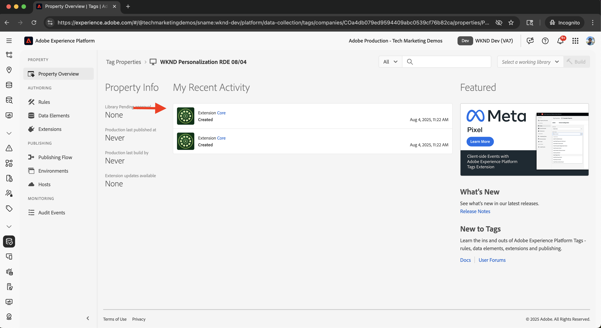
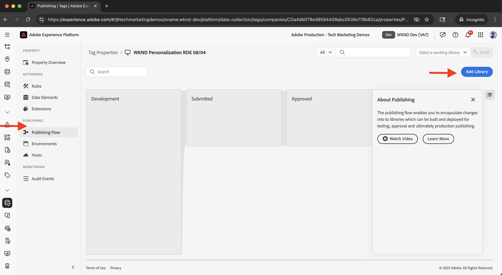
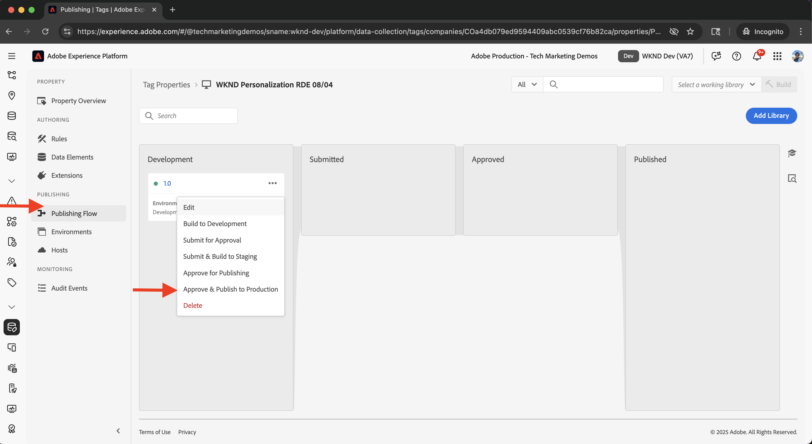
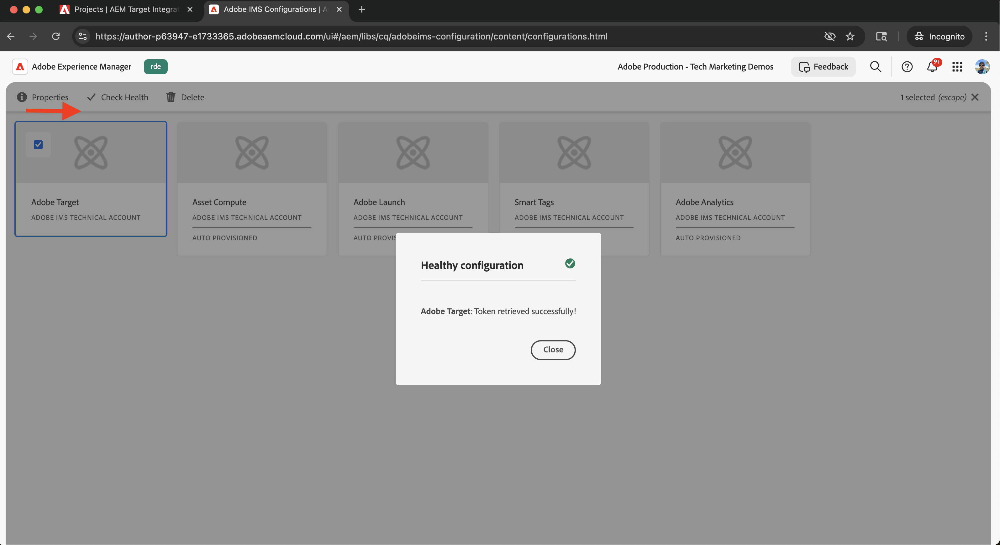
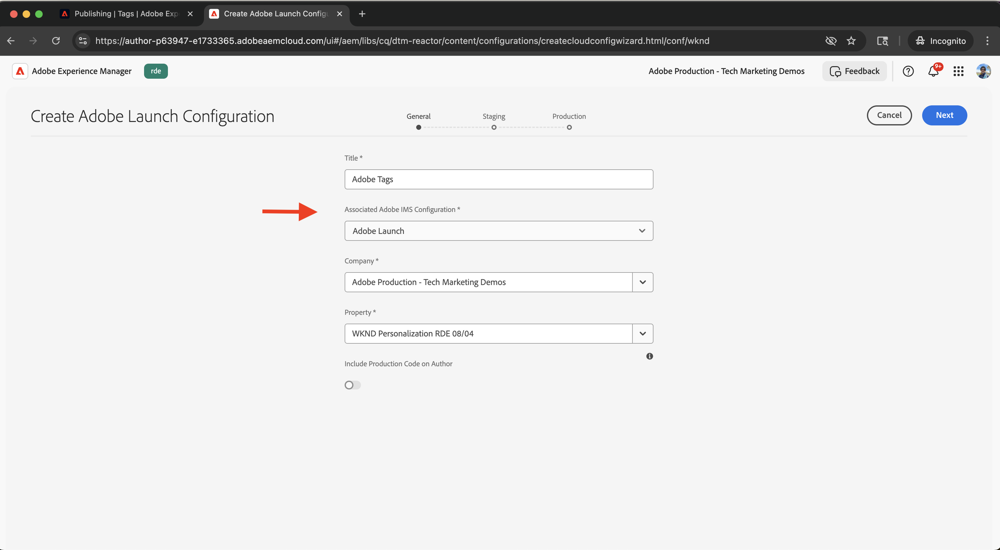

# 整合Adobe Experience Platform中的標籤

瞭解如何將AEM as a Cloud Service (AEMCS)與Adobe Experience Platform中的標籤整合。 標籤（亦稱為Launch）整合可讓您部署Adobe網頁SDK，並將用於資料收集和個人化的自訂JavaScript插入您的AEM頁面。

此整合可讓您的行銷或開發團隊管理和部署JavaScript以進行個人化和資料收集，而不需要重新部署AEM程式碼。

## 高階步驟

整合程式包含建立AEM與Tags之間連線的四個主要步驟：

1. **在Adobe Experience Platform中建立、設定和發佈標籤屬性**
2. **驗證AEM中標籤的Adobe IMS設定**
3. **在AEM中建立標籤設定**
4. **套用標籤設定至您的AEM頁面**

## 在Adobe Experience Platform中建立、設定和發佈標籤屬性

首先，請在Adobe Experience Platform中建立「標籤」屬性。 此屬性可協助您管理Adobe Web SDK的部署，以及個人化和資料收集所需的任何自訂JavaScript。

1. 前往[Adobe Experience Platform](https://experience.adobe.com/platform)，使用您的Adobe ID登入，然後從左側功能表導覽至&#x200B;**標籤**。\
   

2. 按一下&#x200B;**新增屬性**&#x200B;以建立新的Tags屬性。\
   

3. 在&#x200B;**建立屬性**&#x200B;對話方塊中，輸入下列內容：
   - **屬性名稱**： Tags屬性的名稱
   - **屬性型別**：選取&#x200B;**網頁**
   - **網域**：部署屬性的網域（例如，`.adobeaemcloud.com`）

   按一下「**儲存**」。

   

4. 開啟新屬性。 **Core**&#x200B;擴充功能應該已經包含在內。 稍後，您將在設定Experimentation使用案例時新增&#x200B;**Web SDK**&#x200B;擴充功能，因為它需要其他設定，例如&#x200B;**資料串流ID**。\
   

5. 移至&#x200B;**發佈流程**&#x200B;並按一下&#x200B;**新增程式庫**&#x200B;以建立部署程式庫，以發佈Tags屬性。
   

6. 在&#x200B;**建立資料庫**&#x200B;對話方塊中，提供：
   - **名稱**：您程式庫的名稱
   - **環境**：選取&#x200B;**開發**
   - **資源變更**：選擇&#x200B;**新增所有變更的資源**

   按一下&#x200B;**儲存並建置至開發**。

   

7. 若要將程式庫發佈到生產環境，請按一下&#x200B;**核准並發佈到生產環境**。 發佈完成後，屬性即可在AEM中使用。\
   

## 驗證AEM中標籤的Adobe IMS設定

布建AEMCS環境時，會自動包含標籤的Adobe IMS設定，以及相對應的Adobe Developer Console專案。 此設定可確保AEM與Tags之間的安全API通訊。

1. 在AEM中，導覽至&#x200B;**工具** > **安全性** > **Adobe IMS設定**。\
   

2. 找到&#x200B;**Adobe Launch**&#x200B;設定。 如果可用，請選取它並按一下&#x200B;**檢查健康狀態**&#x200B;以驗證連線。 您應該會看到成功回應。\
   

## 在AEM中建立標籤設定

在AEM中建立「標籤」設定，以指定網站頁面所需的屬性和設定。

1. 在AEM中，移至&#x200B;**工具** > **雲端服務** > **Adobe啟動設定**。\
   

2. 選取您網站的根資料夾（例如WKND網站），然後按一下&#x200B;**建立**。\
   

3. 在對話方塊中，輸入下列內容：
   - **標題**：例如「Adobe標籤」
   - **IMS設定**：選取已驗證的&#x200B;**Adobe啟動** IMS設定
   - **公司**：選取連結至標籤屬性的公司
   - **屬性**：選擇先前建立的Tags屬性

   按一下「**下一步**」。

   

4. 為了示範，請保留&#x200B;**測試**&#x200B;和&#x200B;**生產**&#x200B;環境的預設值。 按一下「**建立**」。\
   

5. 選取新建立的設定，然後按一下&#x200B;**發佈**，使其可用於您的網站頁面。\
   

## 套用標籤設定至您的AEM網站

套用標籤設定，將網頁SDK和個人化邏輯插入網站頁面。

1. 在AEM中，移至&#x200B;**網站**，選取您的根網站資料夾（例如WKND網站），然後按一下&#x200B;**內容**。\
   

2. 在&#x200B;**網站屬性**&#x200B;對話方塊中，開啟&#x200B;**進階**&#x200B;索引標籤。 在&#x200B;**設定**&#x200B;下，確定已為`/conf/wknd`雲端設定&#x200B;**選取**。\
   

## 驗證整合

若要確認「標籤」設定正常運作，您可以：

1. 檢查AEM發佈頁面的檢視來源，或使用瀏覽器開發人員工具進行檢查
2. 使用[Adobe Experience Platform Debugger](https://chromewebstore.google.com/detail/adobe-experience-platform/bfnnokhpnncpkdmbokanobigaccjkpob)驗證Web SDK和JavaScript插入

## 其他資源

- [Adobe Experience Platform Debugger概觀](https://experienceleague.adobe.com/zh-hant/docs/experience-platform/debugger/home)
- [標記概觀](https://experienceleague.adobe.com/zh-hant/docs/experience-platform/tags/home)
