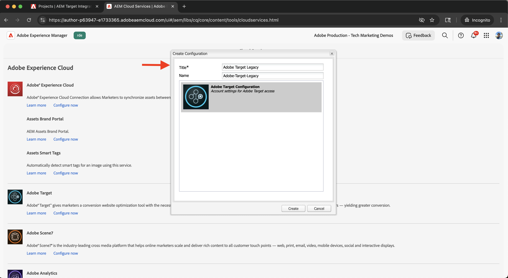
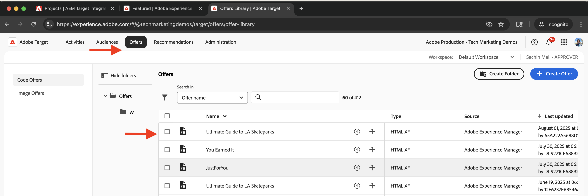

# 整合Adobe Target

瞭解如何將AEM as a Cloud Service (AEMCS)與Adobe Target整合，以啟用個人化內容（例如體驗片段），作為Adobe Target中的選件。

此整合可讓您的行銷團隊在AEM中集中建立和管理個人化內容。 接著，您就可以在Adobe Target中順暢地將此內容啟用為選件。

>[!IMPORTANT]
>
>如果您的團隊偏好在Adobe Target中完全管理優惠方案，而不使用AEM作為集中式內容存放庫，則整合步驟為選用。

## 高階步驟

整合程式包含建立AEM與Adobe Target之間連線的四個主要步驟：

1. **建立並設定Adobe Developer Console專案**
2. **在AEM中建立Target的Adobe IMS設定**
3. **在AEM中建立舊版Adobe Target設定**
4. **將Adobe Target設定套用至體驗片段**

## 建立及設定Adobe Developer Console專案

若要讓AEM能夠安全地與Adobe Target通訊，您必須使用OAuth伺服器對伺服器驗證來設定Adobe Developer Console專案。 您可以使用現有專案或建立新專案。

1. 前往[Adobe Developer Console](https://developer.adobe.com/console)並使用您的Adobe ID登入。

2. 建立新專案或選取現有專案。\
   

3. 按一下&#x200B;**新增API**。 在&#x200B;**新增API**&#x200B;對話方塊中，依&#x200B;**Experience Cloud**&#x200B;篩選，選取&#x200B;**Adobe Target**，然後按一下&#x200B;**下一步**。\
   

4. 在&#x200B;**設定API**&#x200B;對話方塊中，選取&#x200B;**OAuth伺服器對伺服器**&#x200B;驗證方法，然後按一下&#x200B;**下一步**。\
   

5. 在&#x200B;**選取產品設定檔**&#x200B;步驟中，選取&#x200B;**預設Workspace**，然後按一下&#x200B;**儲存已設定的API**。\
   

6. 在左側導覽中，選取&#x200B;**OAuth伺服器對伺服器**並檢閱組態詳細資料。 請注意使用者端ID和使用者端密碼 — 您需要這些值才能在AEM中設定IMS整合。
   

## 在AEM中為Target建立Adobe IMS設定

在AEM中，使用Adobe Developer Console的憑證建立Target的Adobe IMS設定。 此設定可讓AEM使用Adobe Target API進行驗證。

1. 在AEM中，導覽至&#x200B;**工具** > **安全性**，然後選取&#x200B;**Adobe IMS設定**。\
   

2. 按一下「**建立**」。\
   

3. 在&#x200B;**Adobe IMS技術帳戶設定**&#x200B;頁面上，輸入下列內容：
   - **雲端解決方案**： Adobe Target
   - **標題**：設定的標籤，例如「Adobe Target」
   - **授權伺服器**： `https://ims-na1.adobelogin.com`
   - **使用者端識別碼**：來自Adobe Developer Console
   - **使用者端密碼**：來自Adobe Developer Console
   - **範圍**：來自Adobe Developer Console
   - **組織ID**：來自Adobe Developer Console

   然後按一下&#x200B;**建立**。

   

4. 選取組態，然後按一下&#x200B;**檢查健康狀態**&#x200B;以驗證連線。 成功訊息會確認AEM可連線至Adobe Target。\
   

## 在AEM中建立舊版Adobe Target設定

若要將體驗片段作為選件匯出至Adobe Target，請在AEM中建立舊版Adobe Target設定。

1. 在AEM中，導覽至&#x200B;**工具** > **雲端服務**，然後選取&#x200B;**舊版雲端服務**。\
   

2. 在&#x200B;**Adobe Target**&#x200B;區段中，按一下&#x200B;**立即設定**。\
   

3. 在&#x200B;**建立組態**&#x200B;對話方塊中，輸入「Adobe Target舊版」之類的名稱，然後按一下&#x200B;**建立**。\
   

4. 在&#x200B;**Adobe Target舊版設定**&#x200B;頁面上，提供下列專案：
   - **驗證**： IMS
   - **使用者端代碼**：您的Adobe Target使用者端代碼(可在&#x200B;**管理** > **實作**&#x200B;下的Adobe Target中找到)
   - **IMS設定**：您先前建立的IMS設定

   按一下&#x200B;**連線至Adobe Target**&#x200B;以驗證連線。

   

## 套用Adobe Target設定至體驗片段

將Adobe Target設定與您的體驗片段建立關聯，以便將其匯出並作為Target中的選件使用。

1. 在AEM中，前往&#x200B;**體驗片段**。\
   

2. 選取包含您的體驗片段的根資料夾（例如，`WKND Site Fragments`），然後按一下&#x200B;**屬性**。\
   

3. 在&#x200B;**屬性**&#x200B;頁面上，開啟&#x200B;**雲端服務**&#x200B;標籤。 在「**Cloud Service設定**」區段中，選取您的Adobe Target設定。\
   

4. 在出現的&#x200B;**Adobe Target**&#x200B;區段中，完成下列操作：
   - **Adobe Target匯出格式**： HTML
   - **Adobe Target Workspace**：選取要使用的工作區(例如「預設Workspace」)
   - **外部化器網域**：輸入用來產生外部URL的網域

   

5. 按一下&#x200B;**儲存並關閉**&#x200B;以套用組態。

## 驗證整合

若要確認整合可正確運作，請測試匯出功能：

1. 在AEM中，建立新的體驗片段或開啟現有的體驗片段。 按一下工具列中的「匯出至Adobe Target」****。\
   

2. 在Adobe Target中，前往&#x200B;**選件**&#x200B;區段，並確認體驗片段顯示為選件。\
   

## 其他資源

- [Target API總覽](https://experienceleague.adobe.com/en/docs/target-dev/developer/api/target-api-overview)
- [目標選件](https://experienceleague.adobe.com/en/docs/target/using/experiences/offers/manage-content)
- [Adobe Developer Console](https://developer.adobe.com/developer-console/docs/guides/)
- AEM中的[體驗片段](https://experienceleague.adobe.com/en/docs/experience-manager-learn/sites/experience-fragments/experience-fragments-feature-video-use)