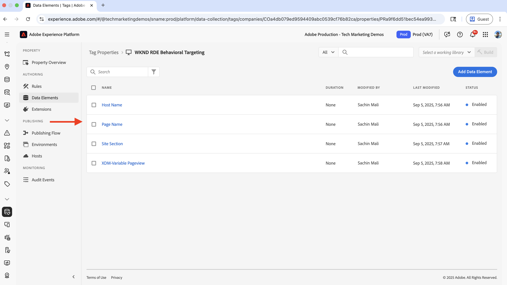
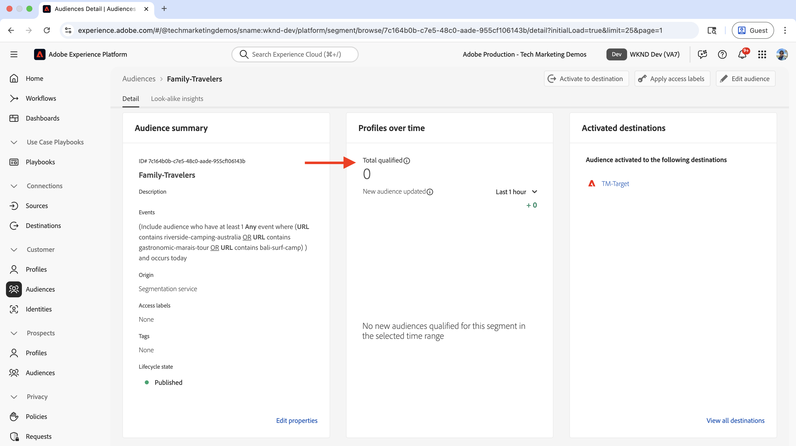
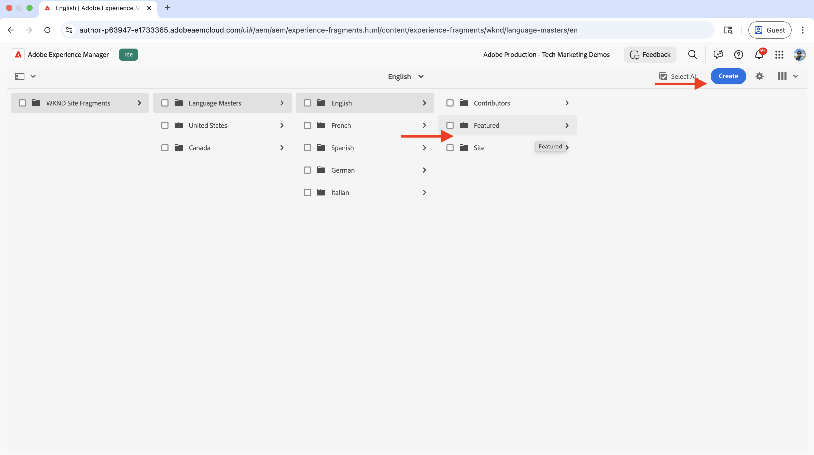

# 行為定向

瞭解如何使用Adobe Experience Platform (AEP)和Adobe Target根據使用者行為個人化內容。

行為鎖定目標可幫助您根據使用者行為（例如他們瀏覽的頁面、他們瀏覽的產品或類別）來提供下一頁個人化。 常見案例包括：

- **英雄區段Personalization**：根據使用者的瀏覽活動，在下一頁顯示個人化的英雄內容
- **內容元素自訂**：根據使用者的瀏覽活動變更標題、影像或call-to-action按鈕
- **頁面內容調整**：根據使用者的瀏覽活動修改整個頁面內容

## 示範使用案例

在本教學課程中，程式會示範造訪過&#x200B;**巴厘島衝浪營**、_河邊露營_&#x200B;或&#x200B;_太浩滑雪場_&#x200B;冒險頁面的&#x200B;_匿名使用者_&#x200B;如何在WKND首頁的&#x200B;**下一個冒險**&#x200B;區段上方看到個人化主圖。


為了示範，具有此瀏覽行為的使用者會分類為&#x200B;**家庭旅行者**&#x200B;對象。

### 即時示範

請造訪[WKND啟用網站](https://wknd.enablementadobe.com/us/en.html)，檢視行為目標定位的實際運作情況。 網站提供三種不同的行為鎖定目標體驗：

- **首頁**：當使用者在瀏覽&#x200B;_巴厘島衝浪營_、_河邊露營_&#x200B;或&#x200B;_太浩滑雪場_&#x200B;冒險頁面後造訪首頁時，他們被分類為&#x200B;**家庭旅行者**&#x200B;對象，並在&#x200B;_下一個冒險_&#x200B;部分上方看到個人化的英雄部分。

- **冒險頁面**：使用者檢視&#x200B;_Bali Surf Camp_&#x200B;或&#x200B;_Surf Camp In Costa Rica_&#x200B;冒險頁面時，他們被分類為&#x200B;**衝浪興趣**&#x200B;對象，並在冒險頁面上看到個人化的英雄區段。

- **雜誌頁面**：當使用者閱讀&#x200B;_三篇或更多_&#x200B;篇文章時，他們被分類為&#x200B;**雜誌讀者**&#x200B;對象，並在雜誌頁面上看到個人化的英雄區段。

>[!VIDEO](https://video.tv.adobe.com/v/3474012/?captions=chi_hant&learn=on&enablevpops)

>[!TIP]
>
>第一個對象使用&#x200B;**Edge**&#x200B;評估進行即時個人化，而第二個和第三個對象使用&#x200B;**批次**&#x200B;評估進行個人化，非常適合再度訪問的訪客。

## 先決條件

在繼續行為鎖定目標使用案例之前，請確定您已完成下列操作：

- [整合Adobe Target](../setup/integrate-adobe-target.md)：可讓團隊在AEM中集中建立和管理個人化內容，並在Adobe Target中將其啟用為優惠方案。
- [在Adobe Experience Platform中整合標籤](../setup/integrate-adobe-tags.md)：可讓團隊管理和部署JavaScript以進行個人化和資料收集，而無需重新部署AEM程式碼。

也熟悉[Adobe Experience Cloud Identity Service (ECID)](https://experienceleague.adobe.com/zh-hant/docs/id-service/using/home)和[Adobe Experience Platform](https://experienceleague.adobe.com/zh-hant/docs/experience-platform/landing/home)概念，例如結構描述、資料流、對象、身分和設定檔。

雖然您可以在Adobe Target中建立簡單的受眾，但Adobe Experience Platform (AEP)提供現代方法，讓您使用各種資料來源（例如行為和異動資料）建立和管理受眾，並建置完整的客戶設定檔。

## 高階步驟

行為目標定位設定程式涉及Adobe Experience Platform、AEM和Adobe Target中的步驟。

1. 在Adobe Experience Platform中&#x200B;**：**
   1. 建立和設定結構
   2. 建立及設定資料集
   3. 建立及設定資料串流
   4. 建立及設定標籤屬性
   5. 設定設定檔的合併原則
   6. 設定(V2) Adobe Target目的地
   7. 建立及設定對象

2. 在AEM中&#x200B;**：**
   1. 使用體驗片段建立個人化優惠
   2. 將標籤屬性整合併插入AEM頁面
   3. 整合Adobe Target並將個人化優惠匯出至Adobe Target

3. 在Adobe Target中&#x200B;**：**
   1. 驗證受眾和選件
   2. 建立及設定活動

4. **驗證AEM頁面上的行為鎖定目標實作**

AEP的各種解決方案可用來收集、管理和收集行為資料，以建立受眾。 這些對象會在Adobe Target中啟動。 使用Adobe Target中的活動，個人化體驗會傳送給符合對象條件的使用者。

## Adobe Experience Platform步驟

若要根據行為資料建立閱聽眾，必須在使用者造訪您的網站或與其互動時收集並儲存資料。 在此範例中，若要將使用者分類為&#x200B;**家庭旅行者**&#x200B;對象，則需要收集頁面檢視資料。 此程式會從Adobe Experience Platform開始，以設定收集此資料的必要元件。

登入[Adobe Experience Cloud](https://experience.adobe.com/)，並從「應用程式切換器」或「快速存取」區段導覽至&#x200B;**Experience Platform**。


### 建立和設定結構

結構描述會定義您在Adobe Experience Platform中收集的資料結構和格式。 它可確保資料的一致性，並可讓您根據標準化的資料欄位建立有意義的對象。 對於行為目標定位，需要可擷取頁面檢視事件和使用者互動的結構描述。

建立結構描述，以收集用於行為定位的頁面檢視資料。

- 在&#x200B;**Adobe Experience Platform**&#x200B;首頁中，從左側導覽按一下&#x200B;**結構描述**，然後按一下&#x200B;**建立結構描述**。

  

- 在&#x200B;**建立結構描述**&#x200B;精靈中，針對&#x200B;**結構描述詳細資料**&#x200B;步驟，選取&#x200B;**體驗事件**&#x200B;選項並按一下&#x200B;**下一步**。

  

- 針對&#x200B;**名稱與檢閱**&#x200B;步驟，請輸入下列內容：
   - **結構描述顯示名稱**： WKND-RDE-Behavioral-Targeting
   - 已選取&#x200B;**類別**： XDM ExperienceEvent

  

- 更新結構，如下所示：
   - **新增欄位群組**： AEP Web SDK ExperienceEvent
   - **設定檔**：啟用

  

- 按一下&#x200B;**儲存**&#x200B;以建立結構描述。

### 建立及設定資料集

資料集是特定結構描述之後的資料容器。 它會當作收集及組織行為資料的儲存位置。 必須為設定檔啟用資料集，才能允許建立受眾及個人化。

讓我們建立資料集以儲存頁面檢視資料。

- 在&#x200B;**Adobe Experience Platform**&#x200B;中，從左側導覽按一下&#x200B;**資料集**，然後按一下&#x200B;**建立資料集**。
  

- 在&#x200B;**建立資料集**&#x200B;步驟中，選取&#x200B;**從結構描述建立資料集**&#x200B;選項並按一下&#x200B;**下一步**。
  

- 在&#x200B;**從結構描述建立資料集**&#x200B;精靈中，針對&#x200B;**選取結構描述**&#x200B;步驟，選取&#x200B;**WKND-RDE-Behavioral-Targeting**&#x200B;結構描述，然後按一下&#x200B;**下一步**。
  

- 對於&#x200B;**設定資料集**&#x200B;步驟，請輸入下列內容：
   - **名稱**： WKND-RDE-Behavioral-Targeting
   - **描述**：要儲存頁面檢視資料的資料集

  

  按一下&#x200B;**完成**&#x200B;以建立資料集。

- 更新資料集，如下所示：
   - **設定檔**：啟用

  

### 建立及設定資料串流

資料流是一種設定，可定義資料如何透過網站SDK從您的網站傳輸到Adobe Experience Platform。 它充當您的網站與平台之間的橋樑，確保資料格式正確並路由至正確的資料集。 對於行為目標定位，我們需要啟用特定服務，例如Edge Segmentation和Personalization目的地。

讓我們建立資料串流，透過網頁SDK將頁面檢視資料傳送至Experience Platform。

- 在&#x200B;**Adobe Experience Platform**&#x200B;中，從左側導覽按一下&#x200B;**資料流**，然後按一下&#x200B;**建立資料流**。

- 在&#x200B;**新資料流**&#x200B;步驟中，輸入下列內容：
   - **名稱**： WKND-RDE-Behavioral-Targeting
   - **描述**：將頁面檢視資料傳送至Experience Platform的資料流
   - **對應結構描述**： WKND-RDE-Behavioral-Targeting
按一下&#x200B;**儲存**&#x200B;以建立資料流。

  

- 建立Datastream後，按一下&#x200B;**新增服務**。

  

- 在&#x200B;**新增服務**&#x200B;步驟中，從下拉式清單中選取&#x200B;**Adobe Experience Platform**，然後輸入下列內容：
   - **事件資料集**： WKND-RDE-Behavioral-Targeting
   - **設定檔資料集**： WKND-RDE-Behavioral-Targeting
   - **Offer Decisioning**：啟用
   - **Edge分段**：啟用
   - **Personalization目的地**：啟用

  按一下&#x200B;**儲存**&#x200B;以新增服務。

  

- 在&#x200B;**新增服務**&#x200B;步驟中，從下拉式清單中選取&#x200B;**Adobe Target**，然後輸入&#x200B;**目標環境ID**。 您可以在Adobe Target的&#x200B;**管理** > **環境**&#x200B;下找到目標環境ID。 按一下&#x200B;**儲存**&#x200B;以新增服務。
  

### 建立及設定標籤屬性

Tags屬性是JavaScript程式碼的容器，可從您的網站收集資料並傳送至Adobe Experience Platform。 其作用為資料收集層，可擷取使用者互動和頁面檢視。 對於行為鎖定目標，我們會收集頁面名稱、URL、網站區段和主機名稱等特定頁面詳細資訊，以建立有意義的對象。

讓我們建立標籤屬性，以便在使用者造訪您的網站時擷取頁面檢視資料。

針對此使用案例，系統會收集頁面名稱、URL、網站區段及主機名稱等頁面詳細資訊。 這些詳細資料可用來建立行為對象。

您可以更新您在[整合Adobe標籤](../setup/integrate-adobe-tags.md)步驟中建立的標籤屬性。 但是，為了使其簡單，會建立一個新的Tags屬性。

#### 建立標籤屬性

若要建立Tags屬性，請完成下列步驟：

- 在&#x200B;**Adobe Experience Platform**&#x200B;中，從左側導覽按一下&#x200B;**標籤**，然後按一下&#x200B;**新增屬性**&#x200B;按鈕。
  

- 在&#x200B;**建立屬性**&#x200B;對話方塊中，輸入下列內容：
   - **屬性名稱**： WKND-RDE-Behavioral-Targeting
   - **屬性型別**：選取&#x200B;**網頁**
   - **網域**：部署屬性的網域（例如，`.adobeaemcloud.com`）

  按一下&#x200B;**儲存**&#x200B;以建立屬性。

  

- 開啟新屬性，從左側導覽按一下&#x200B;**擴充功能**，然後按一下&#x200B;**目錄**&#x200B;標籤。 搜尋&#x200B;**網頁SDK**&#x200B;並按一下&#x200B;**安裝**&#x200B;按鈕。
  

- 在&#x200B;**安裝擴充功能**&#x200B;對話方塊中，選取您先前建立的&#x200B;**資料流**，然後按一下&#x200B;**儲存**。
  

#### 新增資料元素

資料元素是變數，可從網站擷取特定資料點，並用於規則和其他標籤設定。 它們可作為資料收集的建置區塊，讓您從使用者互動和頁面檢視中擷取有意義的資訊。 對於行為鎖定目標，需要擷取主機名稱、網站區段和頁面名稱等頁面詳細資訊，才能建立受眾區段。

建立下列資料元素來擷取重要頁面的詳細資訊。

- 從左側導覽按一下&#x200B;**資料元素**，然後按一下&#x200B;**建立新資料元素**&#x200B;按鈕。
  

- 在&#x200B;**建立新資料元素**&#x200B;對話方塊中，輸入下列內容：
   - **名稱**：主機名稱
   - **延伸模組**：選取&#x200B;**核心**
   - **資料元素型別**：選取&#x200B;**自訂程式碼**
   - **開啟編輯器**&#x200B;按鈕，然後輸入下列程式碼片段：

     ```javascript
     if(window && window.location && window.location.hostname) {
         return window.location.hostname;
     }
     ```

  

- 同樣地，建立下列資料元素：

   - **名稱**：網站區域
   - **延伸模組**：選取&#x200B;**核心**
   - **資料元素型別**：選取&#x200B;**自訂程式碼**
   - **開啟編輯器**&#x200B;按鈕，然後輸入下列程式碼片段：

     ```javascript
     if(event && event.component && event.component.hasOwnProperty('repo:path')) {
         let pagePath = event.component['repo:path'];
     
         let siteSection = '';
     
         //Check for html String in URL.
         if (pagePath.indexOf('.html') > -1) { 
         siteSection = pagePath.substring(0, pagePath.lastIndexOf('.html'));
     
         //replace slash with colon
         siteSection = siteSection.replaceAll('/', ':');
     
         //remove `:content`
         siteSection = siteSection.replaceAll(':content:','');
         }
     
         return siteSection 
     }        
     ```

   - **名稱**：頁面名稱
   - **延伸模組**：選取&#x200B;**核心**
   - **資料元素型別**：選取&#x200B;**自訂程式碼**
   - **開啟編輯器**&#x200B;按鈕，然後輸入下列程式碼片段：

     ```javascript
     if(event && event.component && event.component.hasOwnProperty('dc:title')) {
         // return value of 'dc:title' from the data layer Page object, which is propagated via 'cmp:show' event
         return event.component['dc:title'];
     }        
     ```

- 接下來，建立&#x200B;**變數**&#x200B;型別的資料元素。 此資料元素在傳送至Experience Platform之前會填入頁面詳細資訊。

   - **名稱**： XDM變數頁面檢視
   - **擴充功能**：選取&#x200B;**Adobe Experience Platform Web SDK**
   - **資料元素型別**：選取&#x200B;**變數**

  在右側面板中，

   - **沙箱**：選取您的沙箱
   - **結構描述**：選取&#x200B;**WKND-RDE-Behavioral-Targeting**&#x200B;結構描述

  按一下&#x200B;**儲存**&#x200B;以建立資料元素。

  

- 在您的&#x200B;**資料元素**&#x200B;清單中，您應該有四個資料元素：

  

#### 新增規則

規則會定義何時及如何收集資料並將資料傳送至Adobe Experience Platform。 它們做為邏輯層，可決定網站上發生特定事件時會發生什麼情況。 對於行為鎖定目標，會建立規則來擷取頁面檢視事件，並在將資料元素傳送至平台之前，先以收集的資訊填入資料元素。

建立規則以使用其他資料元素填入&#x200B;**XDM-Variable Pageview**&#x200B;資料元素，然後再將其傳送到Experience Platform。 當使用者瀏覽WKND網站時觸發規則。

- 從左側導覽按一下&#x200B;**規則**，然後按一下&#x200B;**建立新規則**&#x200B;按鈕。
  

- 在&#x200B;**建立新規則**&#x200B;對話方塊中，輸入下列內容：

   - **名稱**：所有頁面 — 載入中

   - 針對&#x200B;**事件**&#x200B;區段，按一下&#x200B;**新增**&#x200B;以開啟&#x200B;**事件設定**&#x200B;精靈。
      - **延伸模組**：選取&#x200B;**核心**
      - **事件型別**：選取&#x200B;**自訂程式碼**
      - **開啟編輯器**&#x200B;按鈕，然後輸入下列程式碼片段：

        ```javascript
        var pageShownEventHandler = function(evt) {
            // defensive coding to avoid a null pointer exception
            if(evt.hasOwnProperty("eventInfo") && evt.eventInfo.hasOwnProperty("path")) {
                //trigger Launch Rule and pass event
                console.debug("cmp:show event: " + evt.eventInfo.path);
                var event = {
                    //include the path of the component that triggered the event
                    path: evt.eventInfo.path,
                    //get the state of the component that triggered the event
                    component: window.adobeDataLayer.getState(evt.eventInfo.path)
                };
        
                //Trigger the Launch Rule, passing in the new 'event' object
                // the 'event' obj can now be referenced by the reserved name 'event' by other Launch data elements
                // i.e 'event.component['someKey']'
                trigger(event);
            }
        }
        
        //set the namespace to avoid a potential race condition
        window.adobeDataLayer = window.adobeDataLayer || [];
        
        //push the event listener for cmp:show into the data layer
        window.adobeDataLayer.push(function (dl) {
            //add event listener for 'cmp:show' and callback to the 'pageShownEventHandler' function
            dl.addEventListener("cmp:show", pageShownEventHandler);
        });
        ```

   - 針對&#x200B;**條件**&#x200B;區段，按一下&#x200B;**新增**&#x200B;以開啟&#x200B;**條件組態**&#x200B;精靈。
      - **邏輯型別**：選取&#x200B;**Regular**
      - **延伸模組**：選取&#x200B;**核心**
      - **條件型別**：選取&#x200B;**自訂程式碼**
      - **開啟編輯器**&#x200B;按鈕，然後輸入下列程式碼片段：

        ```javascript
        if(event && event.component && event.component.hasOwnProperty('@type') && event.component.hasOwnProperty('xdm:template')) {
            console.log('The cmp:show event is from PAGE HANDLE IT');
            return true;
        }else{
            console.log('The cmp:show event is NOT from PAGE IGNORE IT');
            return false;
        }            
        ```

   - 針對&#x200B;**動作**&#x200B;區段，按一下&#x200B;**新增**&#x200B;以開啟&#x200B;**動作組態**&#x200B;精靈。
      - **擴充功能**：選取&#x200B;**Adobe Experience Platform Web SDK**
      - **動作型別**：選取&#x200B;**更新變數**
      - 將&#x200B;**Web** > **webPageDetails** > **name**&#x200B;對應到&#x200B;**Page Name**&#x200B;資料元素

        

      - 同樣地，將&#x200B;**伺服器**&#x200B;對應至&#x200B;**主機名稱**&#x200B;資料元素，並將&#x200B;**siteSection**&#x200B;對應至&#x200B;**網站區段**&#x200B;資料元素。 針對&#x200B;**pageView** > **值**，請輸入`1`以表示頁面檢視事件。

      - 按一下&#x200B;**保留變更**&#x200B;以儲存動作組態。

   - 再次，按一下[新增] **&#x200B;**&#x200B;以新增其他動作，並開啟&#x200B;**動作組態**&#x200B;精靈。
      - **擴充功能**：選取&#x200B;**Adobe Experience Platform Web SDK**
      - **動作型別**：選取&#x200B;**傳送事件**
      - 在右側面板的&#x200B;**資料**&#x200B;區段中，將&#x200B;**XDM-Variable Pageview**&#x200B;資料元素對應至&#x200B;**網頁詳細資料頁面檢視**&#x200B;型別。

     

      - 此外，在右側面板的&#x200B;**Personalization**&#x200B;區段中，勾選&#x200B;**呈現視覺個人化決策**&#x200B;選項。  然後，按一下&#x200B;**保留變更**&#x200B;以儲存動作。

     

   - 按一下&#x200B;**保留變更**&#x200B;以儲存規則。

- 您的規則應如下所示：

  

上述規則建立步驟包含相當多的詳細資訊，因此在建立規則時請務必謹慎。 這聽起來可能很複雜，但請記住這些設定步驟，使其可即插即用，而無需更新AEM程式碼並重新部署應用程式。

#### 新增程式庫並發佈

程式庫是您建立和部署至網站的所有標籤設定（資料元素、規則、擴充功能）的集合。 它會將所有東西封裝在一起，讓資料收集正常運作。 針對行為鎖定目標，會發佈程式庫，讓資料收集規則在您的網站上生效。

- 從左側導覽按一下&#x200B;**發佈流程**，然後按一下&#x200B;**新增資料庫**&#x200B;按鈕。
  

- 在&#x200B;**新增程式庫**&#x200B;對話方塊中，輸入下列內容：
   - **名稱**： 1.0
   - **環境**：選取&#x200B;**開發**
   - 按一下&#x200B;**新增所有變更的資源**&#x200B;以選取所有資源。

  按一下&#x200B;**儲存並建置至開發**&#x200B;以建立程式庫。

  

- 為&#x200B;**開發**&#x200B;泳道建置資料庫後，按一下省略符號（三個點）並選取&#x200B;**核准並發佈到生產環境**&#x200B;選項。
  

恭喜！您已使用規則建立Tags屬性，以便收集頁面詳細資料並將資料傳送至Experience Platform。 這是建立行為對象的基本步驟。

### 設定設定檔的合併原則

合併原則會定義如何將來自多個來源的客戶資料整合到單一設定檔中。 它會判斷哪些資料在出現衝突時優先，以確保您對每個客戶擁有完整且一致的行為目標定位檢視。

在此使用案例中，會建立或更新合併原則，即：

- **預設合併原則**：啟用
- **Edge上的Active-On合併原則**：啟用

若要建立合併原則，請完成以下步驟：

- 在&#x200B;**Adobe Experience Platform**&#x200B;中，從左側導覽按一下&#x200B;**設定檔**，然後按一下&#x200B;**合併原則**&#x200B;索引標籤。

  

- 您可以使用現有的合併原則，但在本教學課程中，系統會使用下列設定建立新的合併原則：

  

- 請確定同時啟用&#x200B;**預設合併原則**&#x200B;和&#x200B;**Edge上的Active-On合併原則**&#x200B;選項。 這些設定可確保您的行為資料正確統一，並可用於即時對象評估。

### 設定(V2) Adobe Target目的地

Adobe Target目的地(V2)可讓您直接在Adobe Target中啟用在Experience Platform中建立的行為對象。 此連線可讓您的行為對象用於Adobe Target中的個人化活動。

- 在&#x200B;**Adobe Experience Platform**&#x200B;中，從左側導覽按一下&#x200B;**目的地**，然後按一下&#x200B;**目錄**&#x200B;索引標籤並依&#x200B;**Personalization**&#x200B;篩選，然後選取&#x200B;**(v2) Adobe Target**&#x200B;目的地。

  

- 在&#x200B;**啟用目的地**&#x200B;步驟中，提供目的地的名稱，然後按一下&#x200B;**連線到目的地**&#x200B;按鈕。
  

- 在&#x200B;**目的地詳細資料**&#x200B;區段中，輸入下列內容：
   - **名稱**： WKND-RDE-Behavioral-Targeting-Destination
   - **描述**：行為鎖定目標對象的目的地
   - **資料流**：選取您先前建立的&#x200B;**資料流**
   - **Workspace**：選取您的Adobe Target工作區

  

- 按一下&#x200B;**下一步**&#x200B;並完成目的地組態。

設定後，此目的地可讓您從Experience Platform啟用行為對象至Adobe Target，以用於個人化活動。

### 建立及設定對象

對象會根據其行為模式和特性定義特定使用者群組。 在此步驟中，系統會使用行為資料規則建立「家庭旅行者」受眾。

若要建立對象，請完成下列步驟：

- 在&#x200B;**Adobe Experience Platform**&#x200B;中，從左側導覽按一下&#x200B;**對象**，然後按一下&#x200B;**建立對象**&#x200B;按鈕。
  

- 在&#x200B;**建立對象**&#x200B;對話方塊中，選取&#x200B;**建置規則**&#x200B;選項，然後按一下&#x200B;**建立**&#x200B;按鈕。
  

- 在&#x200B;**建立**&#x200B;步驟中，輸入下列內容：
   - **姓名**：家庭旅行者
   - **描述**：造訪過適閤家庭的冒險頁面的使用者
   - **評估方法**：選取&#x200B;**Edge** （用於即時對象評估）

  

- 然後，按一下「**事件**」標籤，並導覽至「**網頁**」>「**網頁詳細資料**」，並將「**URL**」欄位拖放至「**事件規則**」區段。 將&#x200B;**URL**&#x200B;欄位再拖曳兩次到&#x200B;**事件規則**&#x200B;區段。 輸入下列值：
   - **URL**：選取&#x200B;**包含**&#x200B;選項，然後輸入`riverside-camping-australia`
   - **URL**：選取&#x200B;**包含**&#x200B;選項，然後輸入`bali-surf-camp`
   - **URL**：選取&#x200B;**包含**&#x200B;選項，然後輸入`gastronomic-marais-tour`

  

- 在&#x200B;**事件**&#x200B;區段中，選取&#x200B;**今天**&#x200B;選項。 您的對象應如下所示：

  

- 檢閱對象，然後按一下&#x200B;**啟用至目的地**&#x200B;按鈕。

  

- 在&#x200B;**啟用至目的地**&#x200B;對話方塊中，選取您先前建立的Adobe Target目的地，並依照步驟啟用對象。

  

- AEP中還沒有資料，因此對象數為0。 一旦使用者開始造訪網站，就會收集資料且對象人數會增加。

  

恭喜！您已建立對象，並將其啟動至Adobe Target目的地。

這將會完成Adobe Experience Platform步驟，而程式已準備好在AEM中建立個人化體驗，並在Adobe Target中使用它。

## AEM步驟

AEM已整合Tags屬性以收集頁面檢視資料並將其傳送至Experience Platform。 Adobe Target也已整合，並為&#x200B;**家庭旅行者**&#x200B;對象建立個人化優惠。 這些步驟可讓AEM搭配在Experience Platform中建立的行為鎖定目標設定。

我們先登入AEM Author服務來建立和設定個人化內容。

- 登入[Adobe Experience Cloud](https://experience.adobe.com/)，並從「應用程式切換器」或「快速存取」區段導覽至&#x200B;**Experience Manager**。

  

- 導覽至您的AEM作者環境，然後按一下&#x200B;**網站**&#x200B;按鈕。
  

### 將標籤屬性整合併插入AEM頁面

此步驟將先前建立的標籤屬性整合到AEM頁面中，以啟用行為定位的資料收集。 Tags屬性會自動擷取頁面檢視資料，並在使用者造訪您的網站時傳送給Experience Platform。

若要將Tags屬性整合至AEM頁面，請依照[在Adobe Experience Platform中整合標籤](../setup/integrate-adobe-tags.md)中的步驟操作。

請務必使用先前建立的&#x200B;**WKND-RDE-Behavioral-Targeting** Tags屬性，而非其他屬性。


整合後，標籤屬性會開始從AEM頁面收集行為資料，並將其傳送到Experience Platform以建立受眾。

### 整合Adobe Target並將個人化優惠匯出至Adobe Target

此步驟會整合Adobe Target與AEM，並可將個人化內容（體驗片段）匯出至Adobe Target。 此連線可讓Adobe Target使用在AEM中建立的內容，以與Experience Platform中建立的行為對象進行個人化活動。

若要整合Adobe Target並將&#x200B;**家庭旅行者**&#x200B;對象優惠匯出至Adobe Target，請依照[在Adobe Experience Platform中整合Adobe Target](../setup/integrate-adobe-target.md)中的步驟操作。

請確定Target設定已套用至體驗片段，以便將其匯出至Adobe Target以用於個人化活動。


整合後，您可以將體驗片段從AEM匯出至Adobe Target，在那裡，它們會作為行為對象的個人化優惠方案使用。

### 建立針對目標對象的個人化優惠方案

體驗片段是可重複使用的內容元件，可匯出至Adobe Target做為個人化優惠。 針對行為目標定位，內容是專為當使用者符合行為條件時所顯示的&#x200B;**家庭旅行者**&#x200B;對象而設計。

為家庭旅客對象建立包含個人化內容的新體驗片段。

- 在AEM中，按一下&#x200B;**體驗片段**

  

- 導覽至&#x200B;**WKND網站片段**&#x200B;資料夾，然後導覽至&#x200B;**精選**&#x200B;子資料夾並按一下&#x200B;**建立**&#x200B;按鈕。

  

- 在&#x200B;**建立體驗片段**&#x200B;對話方塊中，選取Web變數範本，然後按一下&#x200B;**下一步**。

  

- 透過新增Teaser元件來製作新建立的體驗片段，並使用與家庭旅行者相關的內容來自訂該片段。 新增引人入勝的標題、說明和call-to-action，吸引對冒險旅遊感興趣的家庭閱讀。

  

- 選取編寫的體驗片段，然後按一下&#x200B;**匯出至Adobe Target**&#x200B;按鈕。

  

恭喜！您已撰寫並將&#x200B;**家庭旅行者**&#x200B;對象優惠方案匯出至Adobe Target。 體驗片段現在可在Adobe Target中作為個人化選件使用，並可用於個人化活動。

## Adobe Target步驟

在Adobe Target中，在Experience Platform中建立的行為對象和從AEM匯出的個人化優惠經驗證為可正確使用。 接著，系統會建立活動，將對象鎖定目標與個人化內容結合，以提供行為鎖定目標體驗。

- 登入[Adobe Experience Cloud](https://experience.adobe.com/)，並從「應用程式切換器」或「快速存取」區段導覽至&#x200B;**Adobe Target**。

  

### 驗證對象和選件

在建立個人化活動之前，系統會先驗證Experience Platform的行為對象和AEM的個人化優惠是否可在Adobe Target中正確使用。 這可確保行為定位所需的所有元件都已準備就緒。

- 在Adobe Target中，按一下「**對象**」，然後確認已建立「家庭旅客對象」。

  

- 按一下對象，您就能檢視對象詳細資料並驗證其是否已正確設定。

  

- 接著，按一下「**選件**」，確認AEM匯出的選件存在。 在此案例中，選件（或體驗片段）稱為&#x200B;**全家人的冒險體驗**。

  

### 建立及設定活動

Adobe Target中的活動是個人化行銷活動，其定義個人化內容何時及如何傳遞至特定對象。 對於行為鎖定目標，會建立活動以向符合「家庭旅行者」對象條件的使用者顯示個人化優惠方案。

現在，已建立活動，將個人化體驗傳送至&#x200B;**家庭旅行者**&#x200B;對象的首頁。

- 在Adobe Target中，按一下&#x200B;**活動**，然後按一下&#x200B;**建立活動**&#x200B;按鈕並選取&#x200B;**體驗鎖定目標**&#x200B;活動型別。
  

- 在&#x200B;**建立體驗鎖定目標活動**&#x200B;對話方塊中，選取&#x200B;**Web**&#x200B;型別和&#x200B;**Visual**&#x200B;撰寫器選項，並輸入WKND網站首頁URL。 按一下「**建立**」按鈕以建立活動。

  

- 在編輯器中，選取&#x200B;**家庭旅行者**&#x200B;對象，並在&#x200B;**下一個冒險**&#x200B;區段之前新增&#x200B;**全家人的冒險體驗**&#x200B;優惠。 請參閱下方的熒幕擷圖以供參考。

  

- 按一下「下一步」**&#x200B;**&#x200B;並使用適當的目標與度量設定&#x200B;**目標與設定**&#x200B;區段，然後啟動它以即時推送變更。

  

恭喜！您已建立並啟動活動，在WKND網站首頁上為&#x200B;**家庭旅行者**&#x200B;對象提供個人化體驗。 活動現在已上線，並向符合行為標準的使用者顯示個人化內容。

## 驗證AEM頁面上的行為鎖定目標實施

現在完整的行為鎖定目標流程已設定完畢，系統會驗證一切正常運作。 此驗證程式可確保資料收集、對象評估和個人化都如預期般運作。

驗證AEM頁面上的行為鎖定目標實施。

- 造訪已發佈的網站（例如，[WKND啟用網站](https://wknd.enablementadobe.com/us/en.html)），並瀏覽&#x200B;_巴厘島衝浪營_&#x200B;或&#x200B;_河邊露營_&#x200B;或&#x200B;_太浩滑雪場_&#x200B;冒險頁面。 請務必在頁面上至少花費30秒來觸發頁面檢視事件，並允許收集資料。

- 接著，重新造訪首頁，您應該會在「**下一個冒險**」區段之前，看到&#x200B;**家庭旅行者**&#x200B;對象的個人化體驗。

  

- 開啟瀏覽器的開發人員工具，並檢查&#x200B;**網路**&#x200B;標籤。 依`interact`篩選，以尋找Web SDK請求。 請求應該會顯示網頁SDK事件詳細資料。

  

- 回應應包含Adobe Target所做的個人化決定，表示您屬於&#x200B;**家庭旅行者**&#x200B;對象。

  

恭喜！您已驗證AEM頁面上的行為鎖定目標實施。 從資料收集到受眾評估，再到個人化的完整流程現在可正常運作。

## 即時示範

若要檢視行為目標定位的實際運作情況，請造訪[WKND啟用網站](https://wknd.enablementadobe.com/us/en.html)。 有三種不同的行為鎖定目標體驗：

- **首頁**：針對家庭旅行者對象，_下一個冒險_&#x200B;區段上方會顯示個人化主圖優惠。 當使用者造訪首頁並造訪過&#x200B;_巴厘島衝浪營_&#x200B;或&#x200B;_河濱野營_&#x200B;或&#x200B;_太浩滑雪場_&#x200B;冒險頁面時，該使用者被分類為&#x200B;**家庭旅行者**&#x200B;受眾。 對象型別為&#x200B;**Edge**，因此會即時進行評估。

- **冒險頁面**：對於衝浪愛好者，冒險頁面會顯示個人化的英雄區段。 當使用者檢視&#x200B;_Bali Surf Camp_&#x200B;或&#x200B;_Surf Camp In Costa Rica_&#x200B;冒險頁面時，使用者被分類為&#x200B;**衝浪興趣**&#x200B;對象。 對象型別為&#x200B;**批次**，因此評估不是即時的，而是經過一天等的一段時間。 對於再度訪問的訪客很有用。

  

- **雜誌頁面**：對於Magazine讀者，該雜誌頁面會顯示個人化的主圖區段。 當使用者閱讀&#x200B;_三篇或更多_&#x200B;篇文章時，使用者會被分類為&#x200B;**雜誌讀者**&#x200B;對象。 對象型別為&#x200B;**批次**，因此評估不是即時的，而是經過一天等的一段時間。 對於再度訪問的訪客很有用。

  

第一個對象使用&#x200B;**Edge**&#x200B;評估進行即時個人化，而第二個和第三個對象使用&#x200B;**批次**&#x200B;評估進行個人化，非常適合再度訪問的訪客。


## 其他資源

- [Adobe Experience Platform Web SDK](https://experienceleague.adobe.com/zh-hant/docs/experience-platform/web-sdk/home)
- [資料串流總覽](https://experienceleague.adobe.com/zh-hant/docs/experience-platform/datastreams/overview)
- [視覺化體驗撰寫器(VEC)](https://experienceleague.adobe.com/zh-hant/docs/target/using/experiences/vec/visual-experience-composer)
- [Edge區段](https://experienceleague.adobe.com/zh-hant/docs/experience-platform/segmentation/methods/edge-segmentation)
- [對象型別](https://experienceleague.adobe.com/zh-hant/docs/experience-platform/segmentation/types/overview)
- [Adobe Target連線](https://experienceleague.adobe.com/zh-hant/docs/experience-platform/destinations/catalog/personalization/adobe-target-connection)
