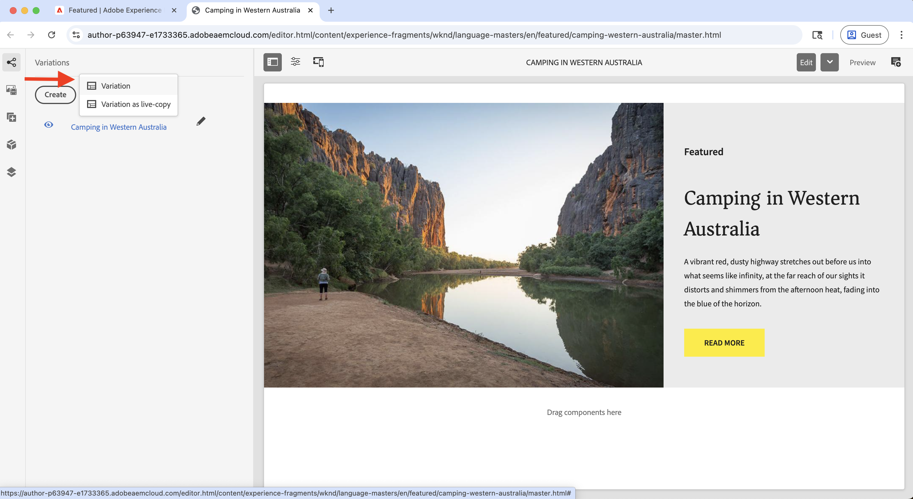

# 實驗 (A/B 測試)

瞭解如何使用Adobe Target在AEM as a Cloud Service (AEMCS)網站上測試不同的內容變數。

A/B測試可協助您比較不同內容版本，以判斷哪些版本在達成業務目標方面表現更好。 常見案例包括：

- 測試登陸頁面上的標題、影像或call-to-action按鈕的變化
- 比較產品詳細資料頁面的不同版面配置或設計
- 評估促銷優惠或折扣策略

## 示範使用案例

在本教學課程中，您為WKND網站上的&#x200B;**Camping in Western Australia** Experience Fragment (XF)設定A/B測試。 您可以建立三個XF變數，並透過Adobe Target管理A/B測試。

變化會顯示在WKND首頁，讓您測量效能並判斷哪些版本可促進參與和轉換。

### 即時示範

請造訪[WKND啟用網站](https://wknd.enablementadobe.com/us/en.html)檢視A/B測試的實際運作情況。 在下列影片中，您會看到首頁上透過不同瀏覽器顯示的&#x200B;**西澳洲露營**&#x200B;的所有三種變化。

>[!VIDEO](https://video.tv.adobe.com/v/3473005/?learn=on&enablevpops)

## 先決條件

繼續實驗使用案例之前，請確定您已完成下列操作：

- [整合Adobe Target](../setup/integrate-adobe-target.md)：可讓您的團隊在AEM中集中建立和管理個人化內容，並在Adobe Target中將其啟用為優惠方案。
- [在Adobe Experience Platform中整合標籤](../setup/integrate-adobe-tags.md)：可讓您的團隊管理和部署JavaScript以進行個人化和資料收集，而不需要重新部署AEM程式碼。

## 高階步驟

A/B測試設定程式涉及六個主要步驟，用於建立和設定實驗：

1. **在AEM中建立內容變數**
2. **將變數匯出為Adobe Target的優惠方案**
3. **在Adobe Target中建立A/B測試活動**
4. **在Adobe Experience Platform中建立和設定資料流**
5. **使用Web SDK擴充功能更新Tags屬性**
6. **驗證AEM頁面上的A/B測試實作**

## 在AEM中建立內容變數

在此範例中，您會使用AEM WKND專案中的&#x200B;**Camping in Western Australia**&#x200B;體驗片段(XF)來建立三個變數，這些變數將用於WKND網站首頁上的A/B測試。

1. 在AEM中，按一下&#x200B;**體驗片段**&#x200B;卡片，導覽至&#x200B;**Camping in Western Australia**，然後按一下&#x200B;**編輯**。
   

1. 在編輯器的&#x200B;**變化**&#x200B;區段下，按一下&#x200B;**建立**，然後選取&#x200B;**變化**。\
   

1. 在&#x200B;**建立變數**&#x200B;對話方塊中：
   - **範本**：體驗片段Web變數範本
   - **Title**：例如，「離開格線」

   按一下&#x200B;**「完成」**。

   

1. 從主要變化中複製&#x200B;**Teaser**&#x200B;元件，然後自訂內容（例如，更新標題和影像）以製作變化。\
   

   >[!TIP]
   >您可以使用[產生變數](https://experience.adobe.com/aem/generate-variations/)，從主XF快速建立新的變數。

1. 重複這些步驟以建立另一個變數（例如「四處遊蕩」）。\
   

   您現在有三個體驗片段變數用於A/B測試。

1. 使用Adobe Target顯示變數之前，您必須從首頁中移除現有的靜態Teaser。 它可防止重複內容，因為體驗片段變數會透過Target以動態方式插入。

   - 導覽至&#x200B;**英文**&#x200B;首頁`/content/wknd/language-masters/en`
   - 在編輯器中，刪除&#x200B;**Camping in Western Australia** Teaser元件。\
     

1. 將變更轉出至&#x200B;**美國>英文**&#x200B;首頁(`/content/wknd/us/en`)以傳播更新。\
   

1. 發佈&#x200B;**美國>英文**&#x200B;首頁，讓更新上線。\
   

## 將變數匯出為選件至Adobe Target

匯出體驗片段變數，以便在Adobe Target中用作A/B測試的選件。

1. 在AEM中，導覽至&#x200B;**Camping in Western Australia**，選取三個變數，然後按一下&#x200B;**匯出至Adobe Target**。\
   

2. 在Adobe Target中，前往&#x200B;**選件**&#x200B;並確認已匯入變數。\
   Adobe Target中的

## 在Adobe Target中建立A/B測試活動

現在建立A/B測試活動，以在首頁上執行實驗。

1. 安裝[Adobe Experience Cloud Visual Editing Helper](https://chromewebstore.google.com/detail/adobe-experience-cloud-vi/kgmjjkfjacffaebgpkpcllakjifppnca) Chrome擴充功能。

1. 在Adobe Target中，導覽至&#x200B;**活動**&#x200B;並按一下&#x200B;**建立活動**。\
   

1. 在&#x200B;**建立A/B測試活動**&#x200B;對話方塊中，輸入下列內容：
   - **型別**：網頁
   - **Composer**：視覺
   - **活動URL**：例如`https://wknd.enablementadobe.com/us/en.html`

   按一下「**建立**」。

   

1. 將活動重新命名為有意義的專案（例如「WKND首頁A/B測試」）。\
   

1. 在&#x200B;**體驗A**&#x200B;中，在&#x200B;**最近文章**&#x200B;區段上方新增&#x200B;**體驗片段**&#x200B;元件。\
   

1. 在元件對話方塊中，按一下&#x200B;**選取選件**。\
   

1. 選擇&#x200B;**Camping in Western Australia**&#x200B;變數並按一下&#x200B;**新增**。\
   

1. 重複&#x200B;**體驗B**&#x200B;和&#x200B;**C**，分別選取&#x200B;**離開格線**&#x200B;和&#x200B;**漫遊**。\
   

1. 在&#x200B;**鎖定目標**&#x200B;區段中，確認流量已平均分配到所有體驗。\
   

1. 在&#x200B;**目標與設定**&#x200B;中，定義您的成功量度(例如CTA對體驗片段的點按)。\
   

1. 按一下右上角的「**啟動**」以啟動測試。\
   

## 在Adobe Experience Platform中建立及設定資料串流

若要將Adobe Web SDK連線至Adobe Target，請在Adobe Experience Platform中建立資料串流。 資料串流可作為Web SDK與Adobe Target之間的路由層。

1. 在Adobe Experience Platform中，導覽至&#x200B;**資料串流**&#x200B;並按一下&#x200B;**建立資料串流**。\
   

1. 在&#x200B;**建立資料流**&#x200B;對話方塊中，輸入資料流的&#x200B;**名稱**，然後按一下&#x200B;**儲存**。\
   

1. 建立Datastream後，按一下&#x200B;**新增服務**。\
   

1. 在&#x200B;**新增服務**&#x200B;步驟中，從下拉式清單中選取&#x200B;**Adobe Target**，然後輸入&#x200B;**目標環境ID**。 您可以在Adobe Target的&#x200B;**管理** > **環境**&#x200B;下找到目標環境ID。 按一下&#x200B;**儲存**&#x200B;以新增服務。\
   

1. 檢閱資料流詳細資料，以確認Adobe Target服務已列出且設定正確。\
   

## 使用網頁SDK擴充功能更新標籤屬性

若要從AEM頁面傳送個人化和資料收集事件，請將Web SDK擴充功能新增至您的Tags屬性，並設定在頁面載入時觸發的規則。

1. 在Adobe Experience Platform中，導覽至&#x200B;**標籤**&#x200B;並開啟您在[整合Adobe標籤](../setup/integrate-adobe-tags.md)步驟中建立的屬性。
   

1. 從左側功能表，按一下&#x200B;**擴充功能**，切換至&#x200B;**目錄**&#x200B;標籤，然後搜尋&#x200B;**網頁SDK**。 按一下右側面板中的&#x200B;**安裝**。\
   

1. 在&#x200B;**安裝擴充功能**&#x200B;對話方塊中，選取您先前建立的&#x200B;**資料流**，然後按一下&#x200B;**儲存**。\
   

1. 安裝之後，請確認&#x200B;**Adobe Experience Platform Web SDK**&#x200B;和&#x200B;**Core**&#x200B;擴充功能都出現在&#x200B;**已安裝**&#x200B;標籤下。\
   

1. 接著，設定載入程式庫時傳送網頁SDK事件的規則。 從左側功能表瀏覽至&#x200B;**規則**，然後按一下&#x200B;**建立新規則**。

   

   >[!TIP]
   >
   >規則可讓您根據使用者互動或瀏覽器事件定義標籤觸發的時間和方式。

1. 在「**建立規則**」畫面中，輸入規則名稱（例如，`All Pages - Library Loaded - Send Event`），然後按一下「**事件**」區段下的「**+新增**」。
   

1. 在&#x200B;**事件組態**&#x200B;對話方塊中：
   - **延伸模組**：選取&#x200B;**核心**
   - **事件型別**：選取&#x200B;**載入的程式庫（頁面頂端）**
   - **名稱**：輸入`Core - Library Loaded (Page Top)`

   按一下&#x200B;**保留變更**&#x200B;以儲存事件。

   

1. 在&#x200B;**動作**&#x200B;區段下，按一下&#x200B;**+新增**&#x200B;以定義觸發事件時發生的動作。

1. 在&#x200B;**動作組態**&#x200B;對話方塊中：
   - **擴充功能**：選取&#x200B;**Adobe Experience Platform Web SDK**
   - **動作型別**：選取&#x200B;**傳送事件**
   - **名稱**：選取&#x200B;**AEP Web SDK — 傳送事件**

   

1. 在右側面板的&#x200B;**Personalization**&#x200B;區段中，勾選&#x200B;**呈現視覺個人化決策**&#x200B;選項。 然後，按一下&#x200B;**保留變更**&#x200B;以儲存動作。\
   

   >[!TIP]
   >
   >   此動作會在頁面載入時傳送AEP Web SDK事件，讓Adobe Target提供個人化內容。

1. 檢閱完成的規則，然後按一下&#x200B;**儲存**。
   

1. 若要套用變更，請移至&#x200B;**發佈流程**，將更新的規則新增至&#x200B;**資料庫**。\
   

1. 最後，將程式庫升級為&#x200B;**生產**。
   

## 驗證AEM頁面上的A/B測試實作

一旦活動上線且Tags程式庫已發佈至生產環境，您就可以驗證AEM頁面上的A/B測試。

1. 造訪已發佈的網站（例如，[WKND Enablement網站](https://wknd.enablementadobe.com/us/en.html)），並觀察顯示的變數。 嘗試從不同的瀏覽器或行動裝置存取該變體，以檢視其他變數。
   

1. 開啟瀏覽器的開發人員工具，並檢查&#x200B;**網路**&#x200B;標籤。 依`interact`篩選，以尋找Web SDK請求。 請求應該會提供網頁SDK事件的詳細資料。

   

回應應包含Adobe Target所作出的個人化決定，以指出已提供哪些變數。\

1. 或者，您可以使用[Adobe Experience Platform Debugger](https://chromewebstore.google.com/detail/adobe-experience-platform/bfnnokhpnncpkdmbokanobigaccjkpob) Chrome擴充功能來檢查網頁SDK事件。
   

## 即時示範

若要檢視A/B測試的實際運作情況，請造訪[WKND啟用網站](https://wknd.enablementadobe.com/us/en.html)，並觀察體驗片段的不同變數在首頁上如何顯示。

## 其他資源

- [A/B測試總覽](https://experienceleague.adobe.com/en/docs/target/using/activities/abtest/test-ab)
- [Adobe Experience Platform Web SDK](https://experienceleague.adobe.com/en/docs/experience-platform/web-sdk/home)
- [資料串流總覽](https://experienceleague.adobe.com/en/docs/experience-platform/datastreams/overview)
- [視覺化體驗撰寫器(VEC)](https://experienceleague.adobe.com/en/docs/target/using/experiences/vec/visual-experience-composer)
