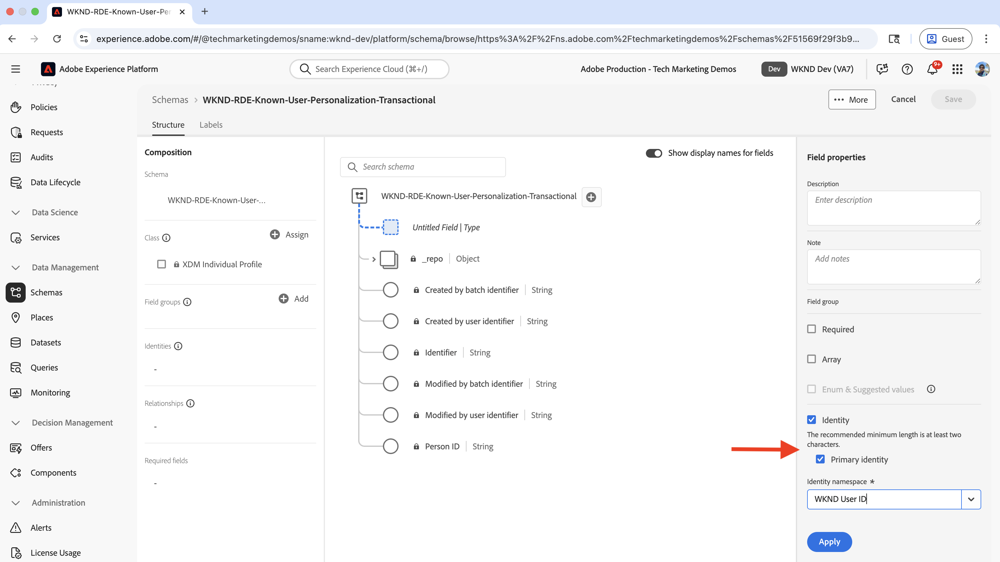
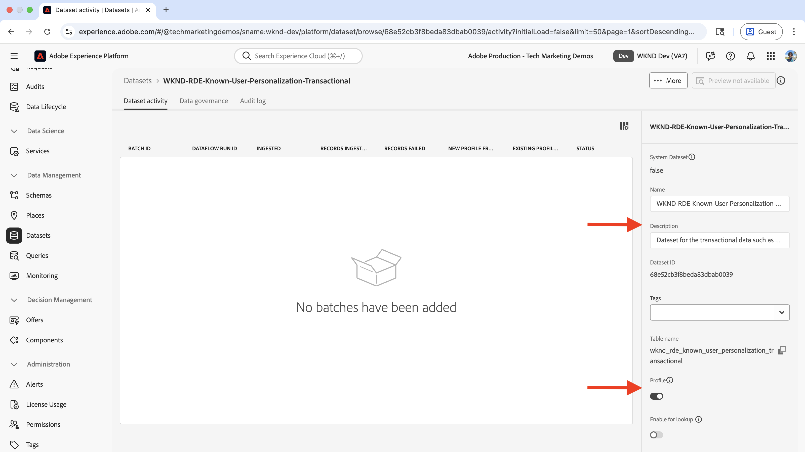
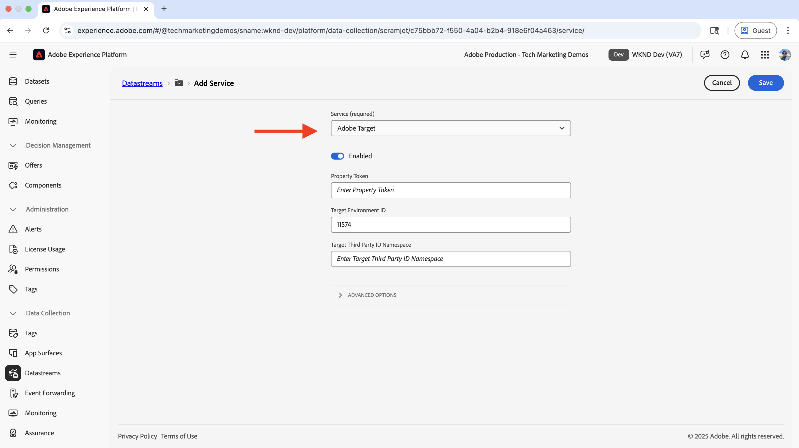
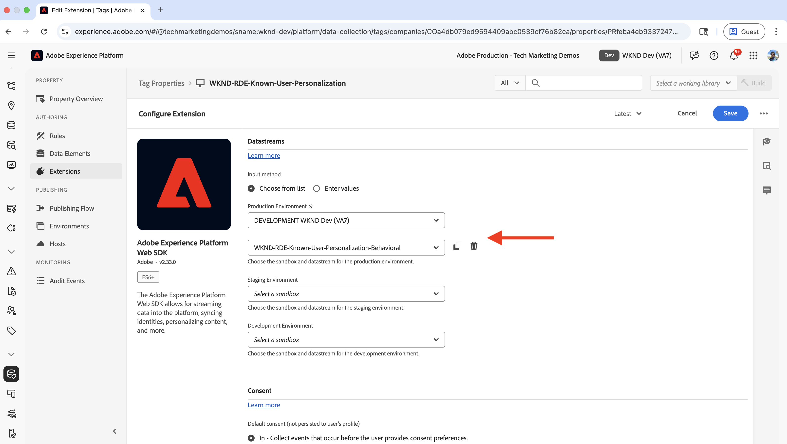
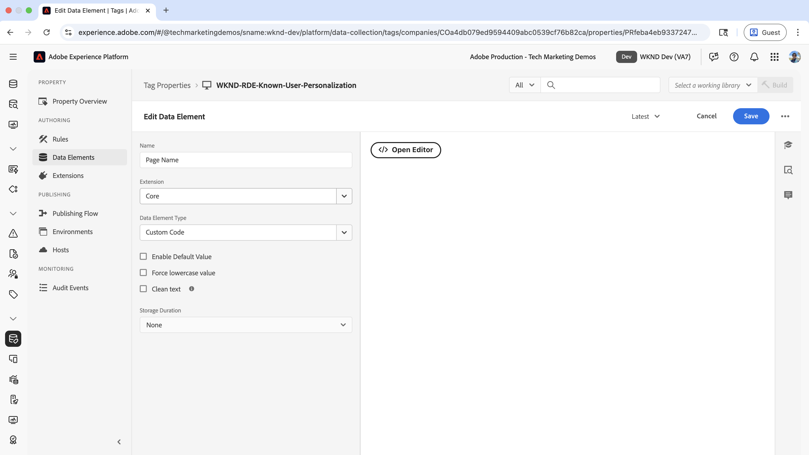
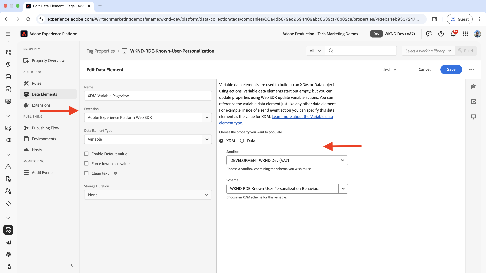
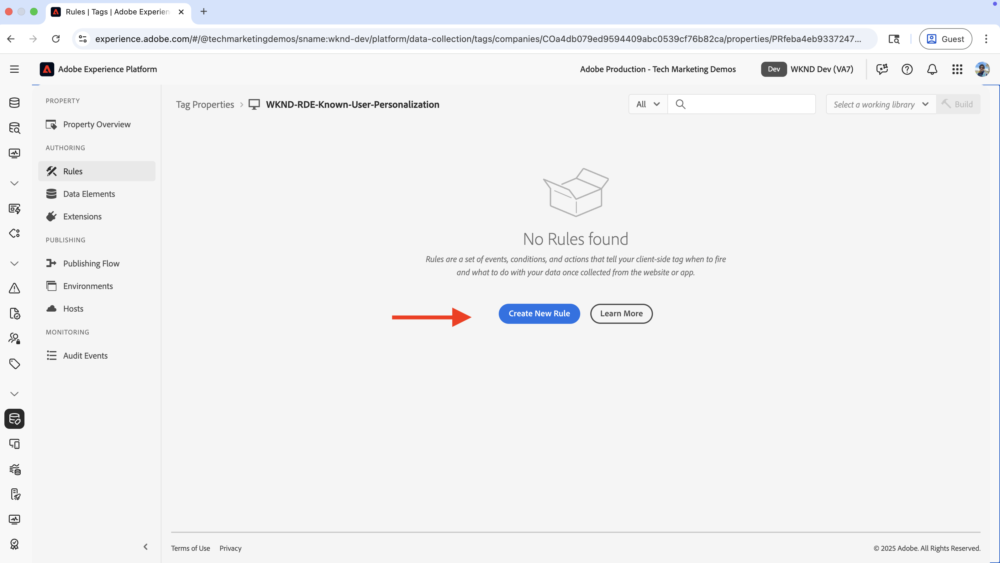
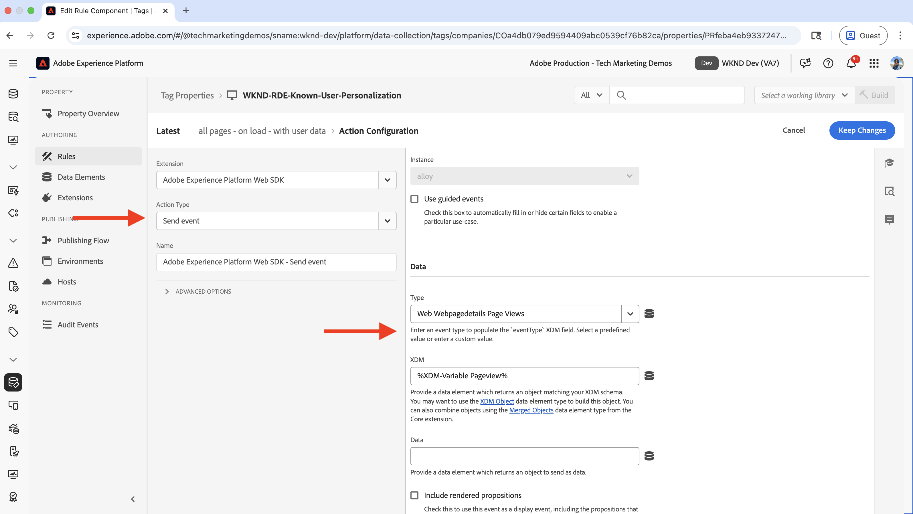
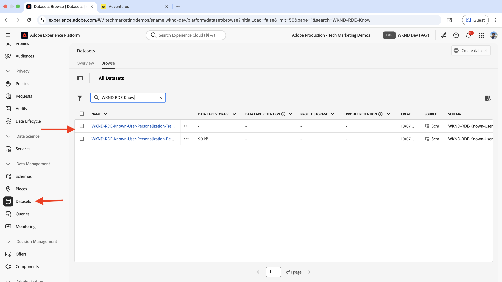

# 已知使用者個人化

瞭解如何根據已知使用者資料（例如購買記錄、CRM資料或收集到的有關使用者的其他資料）個人化內容。

已知使用者個人化可協助您根據所收集關於使用者的資料，將個人化體驗提供給使用者。 可能透過不同的系統&#x200B;_或管道（例如網站、行動應用程式、客服中心等）收集_&#x200B;使用者資料。 然後，會將此&#x200B;_資料拼接在一起，以建立完整的使用者設定檔_，並用來個人化體驗。

常見案例包括：

- **內容個人化**：根據使用者的設定檔資料顯示個人化體驗。 例如，根據使用者的購買歷史記錄，在首頁上顯示個人化主圖。
- **向上銷售和交叉銷售**：根據使用者的購買記錄，顯示個人化的向上銷售和交叉銷售建議。 例如，針對使用者的購買歷史記錄顯示個人化的向上銷售推薦。
- **熟客方案**：依據使用者的購買記錄，顯示個人化的熟客方案優惠。 例如，針對使用者的購買歷史記錄顯示個人化的熟客方案權益。

您的組織對於已知使用者個人化可能有不同的使用案例。 以上只是一些範例。

## 範例使用案例

>[!VIDEO](https://video.tv.adobe.com/v/3476105/?learn=on&enablevpops)

在本教學課程中，使用[範例WKND網站](https://github.com/adobe/aem-guides-wknd)，程式示範了已購買任何&#x200B;**Ski**&#x200B;冒險的&#x200B;**登入使用者**&#x200B;如何在&#x200B;**WKND首頁**&#x200B;看到個人化主圖。

主圖體驗嘗試向購買任何&#x200B;_滑雪_&#x200B;冒險的使用者&#x200B;**追加銷售**&#x200B;基本的滑雪裝備。 未購買任何&#x200B;**滑雪**&#x200B;冒險的使用者會看到預設的主圖內容。 因此，系統會根據使用者的購買記錄和登入狀態，將主圖體驗個人化。 為了啟用此個人化，不同系統的資料會拼接在一起，以建立完整的客戶設定檔並用於個人化活動。


### 跨系統的使用者資料管理

若想進行示範，請假設WKND使用者資料位於以下系統中。 每個系統儲存不同型別的資料，可分類為兩個類別：

- **行為資料**：擷取數位頻道上的使用者互動和活動（頁面檢視、點按、網站導覽、登入狀態、瀏覽模式）
- **交易資料**：記錄已完成的業務交易和客戶設定檔資訊（購買、訂單歷史記錄、設定檔詳細資料、偏好設定）

| 系統 | 用途 | 會儲存哪些資料？ | 資料類型 |
|------|------|------|------|
| AEM | 內容管理系統(CMS)、冒險清單和預訂，以及登入功能 | 使用者互動：頁面檢視、登入狀態、網站導覽。 最低限度的使用者識別碼，例如使用者ID、名稱、電子郵件。 | 行為資料 |
| 其他系統 | 作為完整記錄系統的使用者設定檔和購買交易記錄。 | 完整的客戶設定檔：使用者ID、名稱、地址、電話號碼、購買記錄、訂單詳細資料、偏好設定。 | 異動資料 |

另一個系統可能是Order Management系統(OMS)、客戶關係管理(CRM)系統、主資料管理(MDM)系統，或儲存交易資料的任何其他系統。

也假設WKND網站具有使用者介面(UI)，可讓使用者購買/預訂&#x200B;**Adventures**。 AEM已與其他系統整合，以儲存冒險購買資料。 此外，在購買之前或期間，使用者已在WKND網站上建立帳戶。

邏輯圖表會顯示使用者與WKND網站的互動，以及如何收集行為和異動資料並饋送至Experience Platform。


這是過度簡化的版本，用於示範已知使用者個人化的概念。 在真實世界情況中，您可能有多個系統，在這些系統中會收集和儲存行為與交易式資料。

### 關鍵重點

- **分散式資料儲存**：使用者資料會跨多個系統儲存 — AEM會儲存最低限度的使用者資料（使用者ID、名稱、電子郵件），以供登入功能使用，而其他系統(OMS、CRM、MDM)則會維護完整的使用者設定檔和交易資料，例如購買記錄。
- **身分拼接**：系統使用共同識別碼（WKND使用者ID - `wkndUserId`）連結，該識別碼可唯一識別不同平台和管道中的使用者。
- **完成設定檔建立**：目標是拼接來自這些分散式系統的使用者資料，以建立統一的客戶設定檔，然後用於提供個人化體驗。

您的使用案例可能有不同的系統和資料儲存。 關鍵是識別跨不同平台和管道唯一識別使用者的共同識別碼。

## 先決條件

在繼續處理已知使用者個人化使用案例之前，請確定您已完成下列操作：

- [整合Adobe Target](../setup/integrate-adobe-target.md)：可讓團隊在AEM中集中建立和管理個人化內容，並在Adobe Target中將其啟用為優惠方案。
- [在Adobe Experience Platform中整合標籤](../setup/integrate-adobe-tags.md)：可讓團隊管理和部署JavaScript以進行個人化和資料收集，而無需重新部署AEM程式碼。

也熟悉[Adobe Experience Cloud Identity Service (ECID)](https://experienceleague.adobe.com/en/docs/id-service/using/home)和[Adobe Experience Platform](https://experienceleague.adobe.com/en/docs/experience-platform/landing/home)概念，例如結構描述、資料集、資料流、對象、身分和設定檔。

在本教學課程中，您將瞭解身分拼接和在Adobe Experience Platform中建立客戶設定檔。 因此，將行為資料與交易式資料結合，可建立完整的客戶設定檔。

## 概括性步驟

已知使用者個人化設定程式涉及Adobe Experience Platform、AEM和Adobe Target中的步驟。

1. 在Adobe Experience Platform中&#x200B;**：**
   1. 為WKND使用者ID (_)建立_&#x200B;身分識別名稱空間`wkndUserId`
   1. 建立並設定兩個XDM (Experience Data Model)結構 — 定義資料組織和驗證方式的標準化資料結構 — 一個用於行為資料，另一個用於交易資料
   1. 建立並設定兩個資料集，一個用於行為資料，另一個用於交易資料
   1. 建立及設定資料串流
   1. 建立及設定標籤屬性
   1. 設定設定檔的合併原則
   1. 設定(V2) Adobe Target目的地

2. 在AEM中&#x200B;**：**
   1. 增強WKND網站登入功能，將使用者ID儲存在瀏覽器的工作階段存放中。
   1. 將標籤屬性整合併插入AEM頁面
   1. 驗證AEM頁面上的資料收集
   1. 整合 Adobe Target
   1. 建立個人化優惠方案

3. 在Adobe Experience Platform中&#x200B;**：**
   1. 驗證行為資料和設定檔建立
   1. 擷取異動資料
   1. 驗證行為和異動資料拼接
   1. 建立及設定對象
   1. 在Adobe Target啟用對象

4. 在Adobe Target中&#x200B;**：**
   1. 驗證受眾和選件
   1. 建立及設定活動

5. **驗證您AEM頁面上的已知使用者個人化實作**

Adobe Experience Platform (AEP)的各種解決方案可用來收集、管理、識別及彙整跨系統的使用者資料。 系統會使用拚接的使用者資料，在Adobe Target中建立並啟用對象。 使用Adobe Target中的活動，個人化體驗會傳送給符合對象條件的使用者。

## Adobe Experience Platform設定

若要建立完整的客戶設定檔，必須收集和儲存行為（頁面檢視資料）和異動（WKND冒險購買）資料。 行為資料是使用Tags屬性收集的，交易資料是使用WKND Adventure購買系統收集的。

交易式資料會擷取到Experience Platform中，並與行為資料拼接，以建立完整的客戶設定檔。

在此範例中，若要將已購買任何&#x200B;**滑雪**&#x200B;冒險的使用者分類，需要頁面檢視資料及其冒險購買資料。 資料會使用WKND使用者ID (`wkndUserId`)彙整在一起，這是跨系統的通用識別碼。

讓我們登入Adobe Experience Platform以設定收集與彙整資料所需的元件。

登入[Adobe Experience Cloud](https://experience.adobe.com/)，並從「應用程式切換器」或「快速存取」區段導覽至&#x200B;**Experience Platform**。


### 建立身分名稱空間

身分名稱空間是一個邏輯容器，可為身分提供上下文，有助於Experience Platform瞭解使用的是哪個ID系統（例如電子郵件、CRM ID或忠誠度ID）。 若要將兩個或多個不連續的設定檔資料片段建立關聯，則會使用身分名稱空間。 當這兩個不連續的設定檔資料片段具有相同的屬性值，並共用相同的名稱空間時，它們就會彙整在一起。 若要將屬性限定為身分拼接屬性，它們必須屬於相同的名稱空間。

在此範例中，WKND使用者ID (`wkndUserId`)是行為與交易資料的共同識別碼。 使用此通用識別碼，資料會彙整在一起，以建立完整的客戶設定檔。

讓我們為WKND使用者ID (`wkndUserId`)建立身分名稱空間。

- 在&#x200B;**Adobe Experience Platform**&#x200B;中，從左側導覽按一下&#x200B;**身分**。 然後從右上角按一下&#x200B;**建立身分名稱空間**&#x200B;按鈕。

  

- 在&#x200B;**建立身分名稱空間**&#x200B;對話方塊中，輸入下列內容：
   - **顯示名稱**： WKND使用者識別碼
   - **描述**：登入的WKND使用者的使用者ID或使用者名稱
   - **選取型別**：個別跨裝置識別碼

  按一下&#x200B;**建立**&#x200B;以建立身分名稱空間。

  

### 建立方案

結構描述會定義您在Adobe Experience Platform中收集的資料結構和格式。 它可確保資料的一致性，並可讓您根據標準化的資料欄位建立有意義的對象。 針對已知使用者個人化，需要兩個結構描述，一個用於行為資料，另一個用於交易資料。

#### 行為資料結構描述

首先，建立結構描述以收集行為資料，例如頁面檢視事件和使用者互動。

- 在&#x200B;**Adobe Experience Platform**&#x200B;中，從左側導覽按一下&#x200B;**結構描述**，從右上方按一下&#x200B;**建立結構描述**&#x200B;按鈕。 然後選取&#x200B;**手動**&#x200B;選項，再按一下&#x200B;**選取**&#x200B;按鈕。

  

- 在&#x200B;**建立結構描述**&#x200B;精靈中，針對&#x200B;**結構描述詳細資料**&#x200B;步驟，選取&#x200B;**體驗事件**&#x200B;選項（針對頁面檢視、點按和使用者互動等時間序列資料），然後按一下&#x200B;**下一步**。

  

- 針對&#x200B;**名稱與檢閱**&#x200B;步驟，請輸入下列內容：
   - **結構描述顯示名稱**： WKND-RDE-Known-User-Personalization-Behavioral
   - 已選取&#x200B;**類別**： XDM ExperienceEvent

  

- 更新結構，如下所示：
   - **新增欄位群組**： AEP Web SDK ExperienceEvent
   - **設定檔**：啟用

  按一下&#x200B;**儲存**&#x200B;以建立結構描述。

  

- 若要知道使用者是否已登入（驗證）或匿名，請新增自訂欄位到結構描述。 在此使用案例中，目標是為已購買任何&#x200B;**滑雪**&#x200B;冒險的已知使用者個人化內容。 因此，識別使用者是否已登入（驗證）或匿名很重要。


   - 按一下結構描述名稱旁的&#x200B;**+**&#x200B;按鈕。
   - 在&#x200B;**欄位屬性**&#x200B;區段中，輸入下列內容：
      - **欄位名稱**： wkndLoginStatus
      - **顯示名稱**： WKND登入狀態
      - **型別**：字串
      - **指派給**：欄位群組> `wknd-user-details`

     向下捲動並按一下&#x200B;**套用**&#x200B;按鈕。

     

- 最終行為資料結構描述應如下所示：

  

#### 異動資料結構描述

接下來，建立結構描述以收集交易資料，例如WKND Adventure購買。

- 在&#x200B;**建立結構描述**&#x200B;精靈中，針對&#x200B;**結構描述詳細資料**&#x200B;步驟，選取&#x200B;**個別設定檔**&#x200B;選項（針對客戶屬性、偏好設定和購買歷史記錄等記錄型資料），然後按一下&#x200B;**下一步**。

  

- 針對&#x200B;**名稱與檢閱**&#x200B;步驟，請輸入下列內容：
   - **結構描述顯示名稱**： WKND-RDE-Known-User-Personalization-Transactional
   - **選取的類別**： XDM個別設定檔

  

- 若要儲存使用者的WKND Adventure購買詳細資料，請先新增作為購買識別碼的自訂欄位。 請記住，WKND使用者ID (`wkndUserId`)是跨系統的共同識別碼。
   - 按一下結構描述名稱旁的&#x200B;**+**&#x200B;按鈕。
   - 在&#x200B;**欄位屬性**&#x200B;區段中，輸入下列內容：
      - **欄位名稱**： wkndUserId
      - **顯示名稱**： WKND使用者識別碼
      - **型別**：字串
      - **指派給**：欄位群組> `wknd-user-purchase-details`

  

   - 向下捲動，勾選&#x200B;**身分**，勾選&#x200B;**主要身分** （用來將來自不同來源的資料拼接到統一設定檔中的主要身分），並在&#x200B;**身分名稱空間**&#x200B;下拉式清單中選取&#x200B;**WKND使用者識別碼**。 最後，按一下&#x200B;**套用**&#x200B;按鈕。

  

- 新增自訂主要身分欄位後，結構描述應該如下所示：

  

- 同樣地，新增下列欄位以儲存其他使用者和冒險購買詳細資訊：

  | 欄位名稱 | 顯示名稱 | 類型 | 指派給 |
  |----------|------------|----|---------|
  | 冒險已購買 | 已購買的冒險活動 | 字串 | 欄位群組> `wknd-user-purchase-details` |
  | Adventipurchamount | 冒險購買金額 | 兩倍 | 欄位群組> `wknd-user-purchase-details` |
  | adventurePurchaseQuantity | 冒險購買數量 | 整數 | 欄位群組> `wknd-user-purchase-details` |
  | adventurePurchaseDate | 冒險購買日期 | 日期 | 欄位群組> `wknd-user-purchase-details` |
  | adventureStartDate | 冒險開始日期 | 日期 | 欄位群組> `wknd-user-purchase-details` |
  | adventureEndDate | 冒險結束日期 | 日期 | 欄位群組> `wknd-user-purchase-details` |
  | 名字 | 名字 | 字串 | 欄位群組> `wknd-user-purchase-details` |
  | 姓氏 | 姓氏 | 字串 | 欄位群組> `wknd-user-purchase-details` |
  | 電子郵件 | 電子郵件 | 電子郵件地址 | 欄位群組> `wknd-user-purchase-details` |
  | 電話 | 電話 | 物件 | 欄位群組> `wknd-user-purchase-details` |
  | 性別 | 性別 | 字串 | 欄位群組> `wknd-user-purchase-details` |
  | 年齡 | 年齡 | 整數 | 欄位群組> `wknd-user-purchase-details` |
  | 地址 | 地址 | 字串 | 欄位群組> `wknd-user-purchase-details` |
  | 城市 | 城市 | 字串 | 欄位群組> `wknd-user-purchase-details` |
  | 州別 | 狀態 | 字串 | 欄位群組> `wknd-user-purchase-details` |
  | 國家/地區 | 國家/地區 | 字串 | 欄位群組> `wknd-user-purchase-details` |
  | zipCode | 郵遞區號 | 字串 | 欄位群組> `wknd-user-purchase-details` |

  

- 為結構描述啟用設定檔。

  

您現在已為行為和交易資料建立結構描述。

### 建立及設定資料集

資料集是特定結構描述之後的資料容器。 在此範例中，建立兩個資料集，一個用於行為資料，另一個用於交易資料。

#### 行為資料集

- 在&#x200B;**Adobe Experience Platform**&#x200B;中，從左側導覽按一下&#x200B;**資料集**，從右上方按一下&#x200B;**建立資料集**&#x200B;按鈕。 然後選取&#x200B;**以結構描述為基礎的**&#x200B;選項，再按一下&#x200B;**下一步**。

  

- 對於&#x200B;**選取結構描述**&#x200B;步驟，請選取&#x200B;**WKND-RDE-Known-User-Personalization-Behavioral**&#x200B;結構描述，然後按一下&#x200B;**下一步**。

  

- 對於&#x200B;**設定資料集**&#x200B;步驟，請輸入下列內容：
   - **名稱**： WKND-RDE-Known-User-Personalization-Behavioral
   - **描述**：行為資料的資料集，例如具有使用者登入狀態的頁面檢視。

  

  按一下&#x200B;**完成**&#x200B;以建立資料集。

- 切換&#x200B;**設定檔**&#x200B;開關以啟用設定檔的資料集。

  

#### 異動資料集

- 對異動資料集重複相同的步驟。 唯一的差異是結構描述和資料集名稱。

   - **結構描述**： WKND-RDE-Known-User-Personalization-Transactional
   - **資料集**： WKND-RDE-Known-User-Personalization-Transactive
   - **描述**：交易資料（例如WKND Adventure購買）的資料集。
   - **設定檔**：啟用

  最終的異動資料集應如下所示：

  

兩個資料集都就緒後，您現在可以建立資料串流，讓資料從您的網站傳輸至Experience Platform。

### 建立及設定資料串流

資料流是一種設定，可定義資料如何透過網站SDK從您的網站傳輸到Adobe Experience Platform。 它在您的網站和平台之間充當Bridge，確保資料格式正確並路由至正確的資料集。 針對已知使用者個人化，請啟用Edge細分和Personalization目的地等服務。

讓我們建立資料串流，透過網頁SDK將&#x200B;_行為_ （而非異動）資料傳送至Experience Platform。

- 在&#x200B;**Adobe Experience Platform**&#x200B;中，從左側導覽按一下&#x200B;**資料流**，然後按一下&#x200B;**建立資料流**。

  

- 在&#x200B;**新資料流**&#x200B;步驟中，輸入下列內容：

   - **名稱**： WKND-RDE-Known-User-Personalization-Behavioral
   - **描述**：將行為資料傳送至Experience Platform的資料流
   - **對應結構描述**： WKND-RDE-Known-User-Personalization-Behavioral

  

  按一下&#x200B;**儲存**&#x200B;以建立資料流。

- 建立Datastream後，按一下&#x200B;**新增服務**。

  

- 在&#x200B;**新增服務**&#x200B;步驟中，從下拉式清單中選取&#x200B;**Adobe Experience Platform**，然後輸入下列內容：
   - **事件資料集**： WKND-RDE-Known-User-Personalization-Behavioral
   - **設定檔資料集**： WKND-RDE-Known-User-Personalization-Behavioral
   - **Offer Decisioning**：啟用(可讓Adobe Target即時要求及傳遞個人化優惠)
   - **Edge區段**：啟用（在邊緣網路即時評估對象，以立即個人化）
   - **Personalization目的地**：啟用(允許對象使用Adobe Target等個人化工具共用)

  按一下&#x200B;**儲存**&#x200B;以新增服務。

  

- 在&#x200B;**新增服務**&#x200B;步驟中，從下拉式清單中選取&#x200B;**Adobe Target**，然後輸入&#x200B;**目標環境ID**。 您可以在Adobe Target的&#x200B;**管理** > **環境**&#x200B;下找到目標環境ID。 按一下&#x200B;**儲存**以新增服務。
  

- 最終資料流應該如下所示：

  

資料流現在已設定為透過網頁SDK將行為資料傳送至Experience Platform。

請注意，_交易式_&#x200B;資料是使用批次擷取擷取擷取到Experience Platform （一種以排程間隔而非即時上傳大型資料集的方法）。 WKND Adventure購買資料是使用WKND網站收集並儲存在其他系統中（例如OMS或CRM或MDM）。 然後使用批次擷取將資料擷取到Experience Platform。

您也可以將該資料直接從網站擷取至Experience Platform，本教學課程將對此加以說明。 使用案例旨在強調跨系統拼接使用者資料並建立完整客戶設定檔的程式。

## 建立及設定標籤屬性

Tags屬性是JavaScript程式碼的容器，可從您的網站收集資料並傳送至Adobe Experience Platform。 其作用為資料收集層，可擷取使用者互動和頁面檢視。 對於已知使用者個人化，連同頁面檢視資料（例如頁面名稱、URL、網站區段和主機名稱），也會收集使用者登入狀態和WKND使用者ID。 WKND使用者ID (`wkndUserId`)會作為Identity Map物件的一部分傳送。

讓我們建立Tags屬性，擷取使用者造訪WKND網站時的頁面檢視資料和使用者登入狀態+使用者ID （如果已登入）。

您可以更新您在[整合Adobe標籤](../setup/integrate-adobe-tags.md)步驟中建立的標籤屬性。 但是，為了使其簡單，會建立一個新的Tags屬性。

### 建立標籤屬性

- 在&#x200B;**Adobe Experience Platform**&#x200B;中，從左側導覽按一下&#x200B;**標籤**，然後按一下&#x200B;**新增屬性**&#x200B;按鈕。

  

- 在&#x200B;**建立屬性**&#x200B;對話方塊中，輸入下列內容：
   - **屬性名稱**： WKND-RDE-Known-User-Personalization
   - **屬性型別**：選取&#x200B;**網頁**
   - **網域**：部署屬性的網域（例如，`adobeaemcloud.com`）

  按一下&#x200B;**儲存**&#x200B;以建立屬性。

  

- 開啟新屬性，從左側導覽按一下&#x200B;**擴充功能**，然後按一下&#x200B;**目錄**&#x200B;標籤。 搜尋&#x200B;**網頁SDK**&#x200B;並按一下&#x200B;**安裝**按鈕。
  

- 在&#x200B;**安裝擴充功能**&#x200B;對話方塊中，選取您先前建立的&#x200B;**資料流**，然後按一下&#x200B;**儲存**。
  

#### 新增資料元素

資料元素是變數，可從網站擷取特定資料點，並用於規則和其他標籤設定。 它們可作為資料收集的建置區塊，讓您從使用者互動和頁面檢視中擷取有意義的資訊。 針對已知使用者個人化，需要擷取頁面詳細資訊（如主機名稱、網站區段和頁面名稱），才能建立受眾區段。 此外，使用者登入狀態和WKND使用者ID （如果已登入）也需要擷取。

建立下列資料元素來擷取重要頁面的詳細資訊。

- 從左側導覽按一下&#x200B;**資料元素**，然後按一下&#x200B;**建立新資料元素**按鈕。
  

- 在&#x200B;**建立新資料元素**&#x200B;對話方塊中，輸入下列內容：
   - **名稱**：主機名稱
   - **延伸模組**：選取&#x200B;**核心**
   - **資料元素型別**：選取&#x200B;**自訂程式碼**
   - **開啟編輯器**&#x200B;按鈕，然後輸入下列程式碼片段：

     ```javascript
     if(window && window.location && window.location.hostname) {
         return window.location.hostname;
     }        
     ```

  

- 同樣地，建立下列資料元素：

   - **名稱**：網站區域
   - **延伸模組**：選取&#x200B;**核心**
   - **資料元素型別**：選取&#x200B;**自訂程式碼**
   - **開啟編輯器**&#x200B;按鈕，然後輸入下列程式碼片段：

     ```javascript
     if(event && event.component && event.component.hasOwnProperty('repo:path')) {
         let pagePath = event.component['repo:path'];
     
         let siteSection = '';
     
         //Check of html String in URL.
         if (pagePath.indexOf('.html') > -1) { 
         siteSection = pagePath.substring(0, pagePath.lastIndexOf('.html'));
     
         //replace slash with colon
         siteSection = siteSection.replaceAll('/', ':');
     
         //remove `:content`
         siteSection = siteSection.replaceAll(':content:','');
         }
     
         return siteSection 
     }        
     ```

  

   - **名稱**：頁面名稱
   - **延伸模組**：選取&#x200B;**核心**
   - **資料元素型別**：選取&#x200B;**自訂程式碼**
   - **開啟編輯器**&#x200B;按鈕，然後輸入下列程式碼片段：

     ```javascript
     if(event && event.component && event.component.hasOwnProperty('dc:title')) {
         // return value of 'dc:title' from the data layer Page object, which is propogated via 'cmp:show' event
         return event.component['dc:title'];
     }
     ```

  


   - **名稱**： WKND使用者識別碼
   - **延伸模組**：選取&#x200B;**核心**
   - **資料元素型別**：選取&#x200B;**自訂程式碼**
   - **開啟編輯器**&#x200B;按鈕，然後輸入下列程式碼片段：

     ```javascript
     // Data element for WKND User ID
     if(event && event.user && event.user.userId) {
         console.log('UserID:', event.user.userId);
         return event.user.userId;
     } else {
         console.log('UserID:');
         return "";
     }        
     ```

  


   - **名稱**： WKND使用者狀態
   - **延伸模組**：選取&#x200B;**核心**
   - **資料元素型別**：選取&#x200B;**自訂程式碼**
   - **開啟編輯器**&#x200B;按鈕，然後輸入下列程式碼片段：

     ```javascript
     // Data element for user login status
     if(event && event.user && event.user.status) {
         console.log('User status:', event.user.status);
         return event.user.status;
     } else {
         console.log('User status:anonymous');
         return 'anonymous';
     }        
     ```

  

- 接下來，建立&#x200B;**身分對應**&#x200B;型別的資料元素。 身分對應是一種標準XDM結構，可儲存多個使用者識別碼並將其連結在一起，以實現跨系統的身分拼接。 此資料元素用於儲存WKND使用者ID （如果已登入），作為Identity Map物件的一部分。

   - **名稱**： IdentityMap-WKND使用者識別碼
   - **擴充功能**：選取&#x200B;**Adobe Experience Platform Web SDK**
   - **資料元素型別**：選取&#x200B;**身分對應**

  在右側面板中，
   - **名稱空間**：選取&#x200B;**wkndUserId**
   - **ID**：選取&#x200B;**WKND使用者識別碼**&#x200B;資料元素
   - **驗證狀態**：選取&#x200B;**已驗證**
   - **主要**：選取&#x200B;**true**


  按一下&#x200B;**儲存**&#x200B;以建立資料元素。

  

- 接下來，建立&#x200B;**變數**&#x200B;型別的資料元素。 此資料元素在傳送至Experience Platform之前會填入頁面詳細資訊。

   - **名稱**： XDM變數頁面檢視
   - **擴充功能**：選取&#x200B;**Adobe Experience Platform Web SDK**
   - **資料元素型別**：選取&#x200B;**變數**

  在右側面板中，
   - **沙箱**：選取您的沙箱
   - **結構描述**：選取&#x200B;**WKND-RDE-Known-User-Personalization**&#x200B;結構描述

  按一下&#x200B;**儲存**&#x200B;以建立資料元素。

  

   - 最終資料元素看起來應該像這樣：

     

#### 新增規則

規則會定義何時及如何收集資料並將資料傳送至Adobe Experience Platform。 它們做為邏輯層，可決定網站上發生特定事件時會發生什麼情況。 針對已知使用者個人化，建立規則以擷取頁面檢視資料，以及使用者造訪WKND網站時使用者登入狀態+使用者ID （如果已登入）。

建立規則以使用其他資料元素填入&#x200B;**XDM-Variable Pageview**&#x200B;資料元素，然後再將其傳送到Experience Platform。 當使用者瀏覽WKND網站時觸發規則。

- 從左側導覽按一下&#x200B;**規則**，然後按一下&#x200B;**建立新規則**按鈕。
  

- 在&#x200B;**建立新規則**&#x200B;對話方塊中，輸入下列內容：
   - **名稱**：所有頁面 — 載入中 — 包含使用者資料

   - 針對&#x200B;**事件**&#x200B;區段，按一下&#x200B;**新增**&#x200B;以開啟&#x200B;**事件設定**&#x200B;精靈。
      - **延伸模組**：選取&#x200B;**核心**
      - **事件型別**：選取&#x200B;**自訂程式碼**
      - **開啟編輯器**&#x200B;按鈕，然後輸入下列程式碼片段：

     ```javascript
     var pageShownEventHandler = function(evt) {
         // defensive coding to avoid a null pointer exception
         if(evt.hasOwnProperty("eventInfo") && evt.eventInfo.hasOwnProperty("path")) {
             //trigger Launch Rule and pass event
             console.debug("cmp:show event: " + evt.eventInfo.path);
     
             // Get user data from session storage
             var userData = getUserDataFromSession();
     
             var event = {
                 //include the path of the component that triggered the event
                 path: evt.eventInfo.path,
                 //get the state of the component that triggered the event
                 component: window.adobeDataLayer.getState(evt.eventInfo.path),
                 //include user data in the event
                 user: userData
             };
     
             //Trigger the Launch Rule, passing in the new 'event' object
             trigger(event);
         }
     }
     
     /**
      * Get user data from session storage
     */
     function getUserDataFromSession() {
         var userData = {
             userId: null,
             status: 'anonymous'
         };
     
         try {
             var cachedUserState = sessionStorage.getItem('wknd_user_state');
     
             if (cachedUserState) {
                 var userState = JSON.parse(cachedUserState);
                 var userInfo = userState.data;
     
                 // Validate user data structure before transformation
                 if (userInfo && typeof userInfo === 'object' && userInfo.hasOwnProperty('authorizableId')) {
                     // Transform AEM user data to minimal AEP format
                     userData = {
                         userId: userInfo.authorizableId !== 'anonymous' ? userInfo.authorizableId : null,
                         status: userInfo.authorizableId === 'anonymous' ? 'anonymous' : 'authenticated',
                     };
     
                     //console.log('User details from session storage:', userData.username || 'Anonymous');
                 } else {
                     console.warn('Invalid user data structure in session storage');
                     console.log('Using anonymous user data');
                 }
             } else {
                 console.log('No user data in session storage, using anonymous');
             }
         } catch (e) {
             console.warn('Failed to read user data from session storage:', e);
             console.log('Using anonymous user data');
         }
     
         return userData;
     }
     
     //set the namespace to avoid a potential race condition
     window.adobeDataLayer = window.adobeDataLayer || [];
     
     //push the event listener for cmp:show into the data layer
     window.adobeDataLayer.push(function (dl) {
         //add event listener for 'cmp:show' and callback to the 'pageShownEventHandler' function
         dl.addEventListener("cmp:show", pageShownEventHandler);
     });
     ```

     請注意，`getUserDataFromSession`函式用於從工作階段存放區取得使用者登入狀態和WKND使用者ID （如果已登入）。 AEM程式碼負責使用使用者登入狀態和WKND使用者ID填入工作階段存放區。 在AEM特定步驟中，您增強了WKND網站登入功能，將使用者ID儲存在瀏覽器的工作階段儲存空間中。

   - 針對&#x200B;**條件**&#x200B;區段，按一下&#x200B;**新增**&#x200B;以開啟&#x200B;**條件組態**&#x200B;精靈。
      - **邏輯型別**：選取&#x200B;**Regular**
      - **延伸模組**：選取&#x200B;**核心**
      - **條件型別**：選取&#x200B;**自訂程式碼**
      - **開啟編輯器**&#x200B;按鈕，然後輸入下列程式碼片段：

     ```javascript
     if(event && event.component && event.component.hasOwnProperty('@type') && event.component.hasOwnProperty('xdm:template')) {
         console.log('The cmp:show event is from PAGE HANDLE IT');
         return true;
     } else {
         console.log('The event is NOT from PAGE - IGNORE IT');
         return false;
     }
     ```

   - 針對&#x200B;**動作**&#x200B;區段，按一下&#x200B;**新增**&#x200B;以開啟&#x200B;**動作組態**&#x200B;精靈。
      - **擴充功能**：選取&#x200B;**Adobe Experience Platform Web SDK**
      - **動作型別**：選取&#x200B;**更新變數**

      - 將XDM欄位對應至資料元素：

        | XDM欄位 | 資料元素 |
        |----------|------------|
        | web.webPageDetails.name | 頁面名稱 |
        | web.webPageDetails.server | 主機名稱 |
        | web.webPageDetails.siteSection | 網站區域 |
        | web.webPageDetails.value | 1 |
        | identityMap | identitymap-WKND使用者ID |
        | _$YOUR_NAMESPACE$.wkndLoginStatus | WKND使用者狀態 |

     

      - 按一下&#x200B;**保留變更**&#x200B;以儲存動作組態。

   - 再次按一下「新增」以新增其他動作，並開啟「動作設定」精靈。

      - **擴充功能**：選取&#x200B;**Adobe Experience Platform Web SDK**
      - **動作型別**：選取&#x200B;**傳送事件**
      - 在右側面板的&#x200B;**資料**&#x200B;區段中，將&#x200B;**XDM-Variable Pageview**&#x200B;資料元素對應至&#x200B;**網頁詳細資料頁面檢視**&#x200B;型別。

     

   - 此外，在右側面板的&#x200B;**Personalization**&#x200B;區段中，勾選&#x200B;**呈現視覺個人化決策**&#x200B;選項。 然後按一下&#x200B;**保留變更**&#x200B;以儲存動作。

     

- 您的規則應如下所示：

  

規則現在已設定為傳送頁面檢視資料和使用者登入狀態+使用者ID （如果已登入）至Experience Platform。

上述規則建立步驟包含相當多的詳細資訊，因此在建立規則時請務必謹慎。 這聽起來可能很複雜，但請記住這些設定步驟，使其可即插即用，而無需更新AEM程式碼並重新部署應用程式。

#### 新增並發佈標籤程式庫

程式庫是您建立和部署至網站的所有標籤設定（資料元素、規則、擴充功能）的集合。 它會將所有東西封裝在一起，讓資料收集正常運作。 針對已知使用者個人化，會發佈程式庫，讓資料收集規則在您的網站上生效。

- 從左側導覽按一下&#x200B;**發佈流程**，然後按一下&#x200B;**新增資料庫**按鈕。
  

- 在&#x200B;**新增程式庫**&#x200B;對話方塊中，輸入下列內容：
   - **名稱**： 1.0
   - **環境**：選取&#x200B;**開發**
   - 按一下&#x200B;**新增所有變更的資源**&#x200B;以選取所有資源。

  按一下&#x200B;**儲存並建置至開發**&#x200B;以建立程式庫。

  

- 若要將程式庫發佈到生產環境，請按一下&#x200B;**核准並發佈到生產環境**。 發佈完成後，屬性即可在AEM中使用。
  

程式庫現已發佈，且準備好從AEM頁面收集資料。

### 設定設定檔的合併原則

合併原則會定義如何將來自多個來源的客戶資料整合到單一設定檔中。 它會判斷哪些資料在衝突發生時優先，確保您對每個客戶擁有完整且一致的檢視，以進行已知使用者的個人化。

- 在&#x200B;**Adobe Experience Platform**&#x200B;中，從左側導覽按一下&#x200B;**設定檔**，然後按一下&#x200B;**合併原則**&#x200B;索引標籤。

  

針對此使用案例，會建立合併原則。 不過，如果您有合併原則，則可以使用現有的合併原則。 請確定同時啟用&#x200B;**預設合併原則**&#x200B;和&#x200B;**Edge上的Active-On合併原則**&#x200B;選項（這樣可讓邊緣網路上的設定檔資料可供即時個人化決策使用）。

這些設定可確保您的行為和異動資料正確統一，並可用於即時對象評估。


### 設定(V2) Adobe Target目的地

Adobe Target目的地(V2)可讓您直接在Adobe Target中啟用在Experience Platform中建立的對象。 此連線可讓您的對象用於Adobe Target中的個人化活動。

- 在&#x200B;**Adobe Experience Platform**&#x200B;中，從左側導覽按一下&#x200B;**目的地**，然後按一下&#x200B;**目錄**&#x200B;索引標籤。 搜尋&#x200B;**Personalization**&#x200B;並選取&#x200B;**(v2) Adobe Target**&#x200B;目的地。

  

- 在&#x200B;**啟用目的地**&#x200B;步驟中，提供目的地的名稱，然後按一下&#x200B;**連線到目的地**按鈕。
  

- 在&#x200B;**目的地詳細資料**&#x200B;區段中，輸入下列內容：
   - **名稱**： WKND-RDE-Known-User-Personalization-Destination
   - **描述**：已知使用者個人化的目的地
   - **資料流**：選取您先前建立的&#x200B;**資料流**
   - **Workspace**：選取您的Adobe Target工作區

  

- 按一下&#x200B;**下一步**&#x200B;並完成目的地組態。

  

設定後，此目的地可讓您將在Experience Platform中建立的對象啟動至Adobe Target，以用於個人化活動。

## AEM設定

在下列步驟中，您會增強WKND網站登入功能，將使用者ID儲存在瀏覽器的工作階段存放區中，並將標籤屬性整合和插入AEM頁面。

標籤屬性會插入AEM頁面，以收集頁面檢視資料，以及使用者造訪WKND網站時的使用者登入狀態+使用者ID （如果已登入）。 Adobe Target整合可讓您將個人化優惠匯出至Adobe Target。

### 增強WKND網站登入功能

若要增強WKND網站登入功能，請從GitHub複製[WKND網站專案](https://github.com/adobe/aem-guides-wknd)、建立新功能分支，並在您最喜愛的IDE中開啟它。

```shell
$ mkdir -p ~/Code
$ git clone git@github.com:adobe/aem-guides-wknd.git
$ cd aem-guides-wknd
$ git checkout -b feature/known-user-personalization
```

- 瀏覽至`ui.frontend`模組並開啟`ui.frontend/src/main/webpack/components/form/sign-in-buttons/sign-in-buttons.js`檔案。 檢閱程式碼，在對`currentuser.json`進行AJAX呼叫後，它會根據使用者登入狀態顯示登入或登出按鈕。

- 更新程式碼以將使用者ID儲存在瀏覽器的工作階段存放區中，也會最佳化程式碼以避免對`currentuser.json`發出多個AJAX呼叫。

  ```javascript
  import jQuery from "jquery";
  
  jQuery(function($) {
      "use strict";
  
      (function() {
          const currentUserUrl = $('.wknd-sign-in-buttons').data('current-user-url'),
              signIn = $('[href="#sign-in"]'),
              signOut = $('[href="#sign-out"]'),
              greetingLabel = $('#wkndGreetingLabel'),
              greetingText = greetingLabel.text(),
              body = $('body');
  
          // Cache configuration
          const CACHE_KEY = 'wknd_user_state';
          const CACHE_DURATION = 5 * 60 * 1000; // 5 minutes in milliseconds
  
          /**
           * Get cached user state from session storage
           */
          function getCachedUserState() {
              try {
                  const cached = sessionStorage.getItem(CACHE_KEY);
                  if (cached) {
                      const userState = JSON.parse(cached);
                      const now = Date.now();
  
                      // Check if cache is still valid
                      if (userState.timestamp && (now - userState.timestamp) < CACHE_DURATION) {
                          return userState.data;
                      } else {
                          // Cache expired, remove it
                          sessionStorage.removeItem(CACHE_KEY);
                      }
                  }
              } catch (e) {
                  console.warn('Failed to read cached user state:', e);
                  sessionStorage.removeItem(CACHE_KEY);
              }
              return null;
          }
  
          /**
           * Cache user state in session storage
           */
          function cacheUserState(userData) {
              try {
                  const userState = {
                      data: userData,
                      timestamp: Date.now()
                  };
                  sessionStorage.setItem(CACHE_KEY, JSON.stringify(userState));
              } catch (e) {
                  console.warn('Failed to cache user state:', e);
              }
          }
  
          /**
           * Clear cached user state
           */
          function clearCachedUserState() {
              try {
                  sessionStorage.removeItem(CACHE_KEY);
              } catch (e) {
                  console.warn('Failed to clear cached user state:', e);
              }
          }
  
          /**
           * Update UI based on user state
           */
          function updateUI(userData) {
              const isAnonymous = 'anonymous' === userData.authorizableId;
  
              if(isAnonymous) {
                  signIn.show();
                  signOut.hide();
                  greetingLabel.hide();
                  body.addClass('anonymous');
              } else {
                  signIn.hide();
                  signOut.show();
                  greetingLabel.text(greetingText + ", " + userData.name);
                  greetingLabel.show();
                  body.removeClass('anonymous');
              }
          }
  
          /**
           * Fetch user data from AEM endpoint
           */
          function fetchUserData() {
              return $.getJSON(currentUserUrl + "?nocache=" + new Date().getTime())
                  .fail(function(xhr, status, error) {
                      console.error('Failed to fetch user data:', error);
                      updateUI({ authorizableId: 'anonymous' });
                  });
          }
  
          /**
           * Initialize user state (check cache first, then fetch if needed)
           */
          function initializeUserState() {
              const cachedUserState = getCachedUserState();
  
              if (cachedUserState) {
                  updateUI(cachedUserState);
              } else {
                  fetchUserData().done(function(currentUser) {
                      updateUI(currentUser);
                      cacheUserState(currentUser);
                  });
              }
          }
  
          // Initialize user state
          initializeUserState();
  
          // Clear cache on sign-in/sign-out clicks
          $(document).on('click', '[href="#sign-in"], [href="#sign-out"]', function() {
              clearCachedUserState();
          });
  
          // Clear cache when modal is shown
          $('body').on('wknd-modal-show', function() {
              clearCachedUserState();
          });
  
          // Clear cache when on dedicated sign-in page
          if (window.location.pathname.includes('/sign-in') || window.location.pathname.includes('/errors/sign-in')) {
              clearCachedUserState();
          }
  
          // Clear cache when sign-in form is submitted
          $(document).on('submit', 'form[id*="sign-in"], form[action*="login"]', function() {
              clearCachedUserState();
          });
  
          // Clear cache on successful login redirect
          const urlParams = new URLSearchParams(window.location.search);
          if (urlParams.has('login') || urlParams.has('success') || window.location.hash === '#login-success') {
              clearCachedUserState();
          }
  
          // Debug function for testing
          window.debugUserState = function() {
              console.log('Cache:', sessionStorage.getItem('wknd_user_state'));
              clearCachedUserState();
              initializeUserState();
          };
  
      })();
  });
  ```

  請注意，Tags屬性規則取決於儲存在瀏覽器的工作階段存放區中的使用者ID。 `wknd_user_state`索引鍵是AEM程式碼和用於儲存及擷取使用者ID的Tags屬性規則之間的通用合約。

- 在本機驗證變更，方法是建立專案並在本機執行專案。

  ```shell
  $ mvn clean install -PautoInstallSinglePackage
  ```

  使用`asmith/asmith` （或您建立的任何其他使用者）認證登入，它們是[專案中的](https://github.com/adobe/aem-guides-wknd/blob/main/ui.content.sample/src/main/content/jcr_root/home/users/wknd/l28HasMYWAMHAaGkv-Lj/.content.xml)包含`aem-guides-wknd`。

  

  在我的案例中，我已建立ID為`teddy`的新使用者進行測試。

- 確認使用者ID已儲存在瀏覽器的工作階段存放區（使用瀏覽器的開發人員工具）後，請認可變更並推送至Adobe Cloud Manager遠端存放庫。

  ```shell
  $ git add .
  $ git commit -m "Enhance the WKND site Login functionality to store the user ID in browser's session storage"
  $ git push adobe-origin feature/known-user-personalization
  ```

- 使用AEM as a Cloud Service管道或Cloud Manager RDE命令將變更部署到AEM環境。

### 將標籤屬性整合併插入AEM頁面

此步驟將先前建立的標籤屬性整合到您的AEM頁面中，啟用已知使用者個人化的資料收集。 當使用者造訪WKND網站時，Tags屬性會自動擷取頁面檢視資料和使用者登入狀態+使用者ID （如果已登入）。

若要將Tags屬性整合至AEM頁面，請依照[在Adobe Experience Platform中整合標籤](../setup/integrate-adobe-tags.md)中的步驟操作。

請務必使用先前建立的&#x200B;**WKND-RDE-Known-User-Personalization** Tags屬性，而不是其他屬性。


整合後，標籤屬性會開始從AEM頁面收集已知使用者的個人化資料，並將其傳送到Experience Platform以建立受眾。

### 驗證AEM頁面上的資料收集

若要驗證從AEM頁面收集的資料，您可以使用瀏覽器的開發人員工具來檢查網路要求，並檢視傳送到Experience Platform的資料。 您也可以使用[Experience Platform Debugger](https://chromewebstore.google.com/detail/adobe-experience-platform/bfnnokhpnncpkdmbokanobigaccjkpob)來驗證資料彙集。

- 在瀏覽器中，導覽至部署至AEM as a Cloud Service環境的WKND網站。 匿名，您應該會看到類似的資料收集請求。

  

- 使用`asmith/asmith`認證登入，您應該會看到類似的資料收集要求。

  

請注意，`identityMap`和`_YOUR_NAMESPACE.wkndLoginStatus`變數已分別設定為使用者ID和登入狀態。

### 整合 Adobe Target

此步驟會整合Adobe Target與AEM，並可將個人化內容（體驗片段）匯出至Adobe Target。 此連線可讓Adobe Target使用在AEM中建立的內容，與在Experience Platform中建立的已知使用者對象進行個人化活動。

若要整合Adobe Target並將&#x200B;**WKND-RDE-Known-User-Personalization**&#x200B;對象選件匯出至Adobe Target，請依照[在Adobe Experience Platform中整合Adobe Target](../setup/integrate-adobe-target.md)中的步驟操作。

請確定Target設定已套用至體驗片段，以便將其匯出至Adobe Target以用於個人化活動。


整合後，您可以將體驗片段從AEM匯出至Adobe Target，在那裡這些片段會作為已知使用者對象的個人化優惠使用。

### 建立個人化優惠方案

體驗片段是可重複使用的內容元件，可匯出至Adobe Target做為個人化優惠。 針對已知使用者個人化，讓我們建立新的體驗片段，以&#x200B;_向上銷售_&#x200B;滑雪裝備。

- 在AEM中，按一下&#x200B;**體驗片段**&#x200B;並導覽至&#x200B;**WKND網站片段**&#x200B;資料夾。 在需要的位置建立新的體驗片段。

  

- 新增Teaser元件以製作體驗片段，並使用與追加銷售滑雪裝備相關的內容來自訂體驗片段。

  

- 將體驗片段匯出至Adobe Target。

  

您現在可在Adobe Target中使用個人化優惠方案，以用於活動。

## Adobe Experience Platform設定

重新造訪Adobe Experience Platform，以確認已收集行為資料且已建立相關設定檔。 然後內嵌異動資料、驗證行為和異動資料拼接、建立並設定對象，以及對Adobe Target啟用對象。

### 驗證行為資料和設定檔建立

讓我們驗證是否已收集行為資料並建立相關的設定檔。

- 在Adobe Experience Platform中，按一下&#x200B;**資料集**&#x200B;並開啟&#x200B;**WKND-RDE-Known-User-Personalization-Behavioral**&#x200B;資料集。 請確定擷取的資料統計資料有效。

  

- 若要確認已建立設定檔，請從左側導覽按一下&#x200B;**設定檔**。 然後導覽至&#x200B;**瀏覽**&#x200B;標籤，並使用下列條件進行篩選：
   - **合併原則**：$YOUR_MERGE_POLICY_NAME
   - **身分名稱空間**： ECID (Experience Cloud ID，Adobe自動指派給每位訪客瀏覽器的唯一識別碼)
   - **身分值**：使用瀏覽器的開發人員工具或Experience Platform Debugger尋找。 這是不含`MCMID|`首碼的AMCV_$NAMESPACE$ Cookie值。

  

- 按一下&#x200B;**檢視**按鈕。
  

- 按一下設定檔，您應該會看到設定檔的詳細資料。
  

  在我的案例中，我透過兩種不同的瀏覽器存取我的WKND網站，因此我有兩個與使用者`teddy`相關聯的ECID。 兩個ECID的資料會彙整在一起，以建立設定檔。 您已開始瞭解身分彙整的強大功能，以及如何使用它來建立完整的客戶個人檔案。 不久，交易式資料就會與行為資料結合，以建立完整的客戶設定檔。

- 按一下&#x200B;**事件**標籤，您應該會看到與設定檔相關的事件。
  

### 擷取異動資料

接下來，您將虛擬交易式資料擷取到Experience Platform。 在此範例中，交易式資料會儲存在其他系統（例如OMS或CRM或MDM）中，並使用批次擷取擷取將其擷取到Experience Platform中。 異動資料包含WKND使用者ID，用於拼接行為和異動資料。

- 在Adobe Experience Platform中，按一下&#x200B;**資料集**&#x200B;並開啟&#x200B;**WKND-RDE-Known-User-Personalization-Transactional**&#x200B;資料集。

  

- 在右側面板中，尋找&#x200B;**ADD DATA**&#x200B;區段，並將[ski-adventure-purchase-data.json](../assets/use-cases/known-user-personalization/ski-adventure-purchase-data.json)檔案拖曳到其中。 此檔案包含WKND Adventure購買的虛擬交易資料。 在真實世界的情境中，此資料是使用批次或串流擷取從其他系統（例如OMS或CRM或MDM）擷取。

  

- 等候資料處理完成。

  

- 資料處理完成後，請重新整理資料集頁面。

  

### 驗證行為和異動資料拼接

接下來，您需要驗證行為和交易資料拼接，這是已知使用者個人化使用案例中最重要的部分。 請記住，WKND網站使用者ID是跨系統的共同識別碼，用於拼接資料。 在此範例中，使用者ID `teddy`是用來彙整資料。

- 從左側導覽按一下&#x200B;**設定檔**。 然後導覽至&#x200B;**瀏覽**&#x200B;標籤，並使用下列條件進行篩選：
   - **合併原則**：$YOUR_MERGE_POLICY_NAME
   - **身分名稱空間**： ECID
   - **身分值**：使用您用來篩選行為資料和關聯設定檔的相同ECID值。

  

- 按一下設定檔，您應該會看到設定檔的詳細資料。 異動資料會與行為資料結合，以建立完整的客戶設定檔。

  

- 按一下&#x200B;**屬性**標籤，您應該會看到與設定檔相關的交易和行為資料詳細資料。
  

- 按一下&#x200B;**檢視身分圖表**連結，檢視設定檔的身分圖表。
  

恭喜！您已拼接行為和交易式資料以建立完整的客戶設定檔。

身分拼接是一項強大的功能，可結合來自多個系統的資料來建立完整的客戶設定檔。 在示範用途中，僅有兩個系統可用來彙整資料。 在真實世界的情境中，您可能有多個系統，例如行動應用程式、呼叫中心、聊天機器人、銷售點等。 收集資料並將其儲存在其各自系統中的應用程式。 使用通用識別碼時，資料會彙整在一起，以建立完整的客戶設定檔，並用於個人化活動。 此方法可為使用者提供個人化體驗，並以根據個別客戶設定檔量身打造的體驗取代靜態、一刀切的內容，藉此讓客戶體驗符合現代化要求。

#### 使用WKND使用者ID的設定檔查詢

您可以在Experience Platform中使用WKND使用者ID （而非ECID）查詢設定檔。

- 從左側導覽按一下&#x200B;**設定檔**。 然後導覽至&#x200B;**瀏覽**&#x200B;標籤，並使用下列條件進行篩選：
   - **合併原則**：$YOUR_MERGE_POLICY_NAME
   - **身分名稱空間**： WKND使用者識別碼
   - **身分值**： `teddy`或`asmith`，或您已使用的任何其他使用者ID。

  

- 按一下設定檔，您應該會看到與上一步驟相同的設定檔詳細資料。
  

### 建立及設定對象

對象會根據其行為和異動資料定義特定使用者群組。 在此範例中，已建立符合購買任何&#x200B;**Ski**&#x200B;冒險活動並登入WKND網站的使用者資格的受眾。

若要建立對象，請完成下列步驟：

- 在Adobe Experience Platform中，從左側導覽按一下&#x200B;**對象**，然後按一下&#x200B;**建立對象**&#x200B;按鈕。 然後選取&#x200B;**組建規則**&#x200B;選項，再按一下&#x200B;**建立**按鈕。
  

- 在&#x200B;**建立**&#x200B;步驟中，輸入下列內容：
   - **名稱**： UpSell-Ski-Equipment-To-Authenticated
   - **說明**：已登入且已購買任何滑雪冒險的使用者
   - **評估方法**：選取&#x200B;**Edge** （在使用者瀏覽時即時評估對象成員資格，啟用立即個人化）

  

- 然後按一下「**屬性**」標籤，並導覽至&#x200B;**Techmarketingdemos** （或您的$NAMESPACE$）欄位群組。 將&#x200B;**Adventure Purchased**&#x200B;欄位拖放至&#x200B;**開始建置**&#x200B;區段。 輸入下列明細：

  **已購買的冒險活動**：選取&#x200B;**包含**&#x200B;並輸入值&#x200B;**ski**。

  

- 然後，切換至&#x200B;**事件**&#x200B;標籤，並導覽至&#x200B;**techmarketingdemos** （或您的$NAMESPACE$）欄位群組。 將&#x200B;**WKND登入狀態**&#x200B;欄位拖放至&#x200B;**事件**&#x200B;區段。 輸入下列明細：

  **WKND登入狀態**：選取&#x200B;**等於**&#x200B;並輸入值&#x200B;**已驗證**。

  此外，請選取&#x200B;**今天**&#x200B;選項。

  

- 檢閱對象，然後按一下&#x200B;**啟用至目的地**&#x200B;按鈕。

  

- 在&#x200B;**啟用至目的地**&#x200B;對話方塊中，選取您先前建立的Adobe Target目的地，並依照步驟啟用對象。 按一下&#x200B;**下一步**&#x200B;並完成目的地組態。

  

恭喜！您已建立對象，並將其啟動至Adobe Target目的地。

## Adobe Target設定

在Adobe Target中，在Experience Platform中建立的對象和從AEM匯出的個人化優惠經驗證為可正確使用。 接著，會建立活動將對象鎖定目標與個人化內容結合，以提供已知使用者的個人化體驗。

- 登入Adobe Experience Cloud並從「應用程式切換器」或「快速存取」區段導覽至&#x200B;**Adobe Target**。

  

### 驗證對象和選件

讓我們驗證Adobe Target中是否有適當的對象和選件。

- 在Adobe Target中，按一下「**對象**」，然後確認已建立&#x200B;**UpSell-Ski-Equipment-To-Authenticated**&#x200B;對象。

  

- 按一下對象，您就能檢視對象詳細資料並驗證其是否已正確設定。

  

- 按一下「**選件**」，然後確認AEM匯出的選件存在。 在我的案例中，選件（或體驗片段）稱為&#x200B;**必須有Ski**&#x200B;的專案。

  

  如此一來，即可驗證Adobe Experience Platform、AEM和Adobe Target的整合動作。

### 建立及設定活動

Adobe Target中的活動是個人化行銷活動，其定義個人化內容何時及如何傳遞至特定對象。 針對已知使用者個人化，系統會建立活動，向登入且已購買任何滑雪裝備的使用者顯示滑雪裝備向上銷售選件。

- 在Adobe Target中，按一下&#x200B;**活動**，然後按一下&#x200B;**建立活動**&#x200B;按鈕並選取&#x200B;**體驗鎖定目標**活動型別。
  

- 在&#x200B;**建立體驗鎖定目標活動**&#x200B;對話方塊中，選取&#x200B;**Web**&#x200B;型別和&#x200B;**Visual**&#x200B;撰寫器選項(可讓您直接在您的網站上建立及測試個人化體驗的WYSIWYG編輯器)，並輸入WKND網站首頁URL。 按一下「**建立**」按鈕以建立活動。

  

- 在編輯器中，選取&#x200B;**UpSell-Ski-Equipment-To-Authenticated**&#x200B;對象，然後新增&#x200B;**Must Have Items for Ski**，以取代主要主圖內容。 請參閱下方的熒幕擷圖以供參考。

  

- 按一下「下一步」****&#x200B;並使用適當的目標與度量設定&#x200B;**目標與設定**&#x200B;區段，然後啟動它以即時推送變更。

  

恭喜！您已準備好為登入且已購買任何滑雪冒險的使用者提供已知使用者個人化體驗。

## 驗證已知使用者個人化實施

是時候驗證您WKND網站上的已知使用者個人化實作了。

- 造訪WKND網站首頁，如果您未登入，應該會看到預設的主圖內容。

  

- 使用`teddy/teddy` （或`asmith/asmith`）認證登入，您應該會看到個人化主圖內容。

  

- 開啟瀏覽器的開發人員工具，並檢查&#x200B;**網路**&#x200B;標籤。 依`interact`篩選，以尋找Web SDK請求。 請求/回應應顯示網頁SDK事件和Adobe Target決定詳細資料。

  請求輸出應該如下所示：
  

  回應輸出應如下所示：

  

恭喜！您是提供已知使用者個人化體驗的專家，可利用跨系統的拚接資料來建立完整的客戶設定檔。

## 其他資源

- [Adobe Experience Platform Web SDK](https://experienceleague.adobe.com/en/docs/experience-platform/web-sdk/home)
- [資料串流總覽](https://experienceleague.adobe.com/en/docs/experience-platform/datastreams/overview)
- [視覺化體驗撰寫器(VEC)](https://experienceleague.adobe.com/en/docs/target/using/experiences/vec/visual-experience-composer)
- [Edge區段](https://experienceleague.adobe.com/en/docs/experience-platform/segmentation/methods/edge-segmentation)
- [對象型別](https://experienceleague.adobe.com/en/docs/experience-platform/segmentation/types/overview)
- [Adobe Target連線](https://experienceleague.adobe.com/en/docs/experience-platform/destinations/catalog/personalization/adobe-target-connection)
