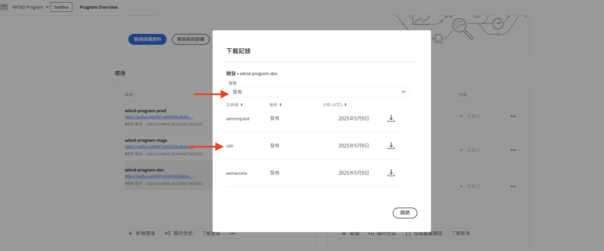
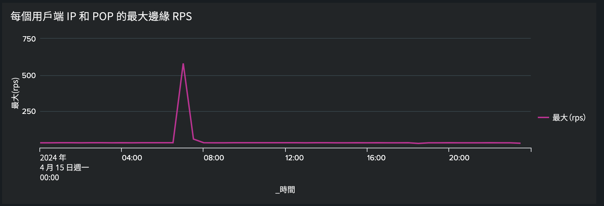

# 使用流量篩選器規則封鎖 DoS 與 DDoS 攻擊

了解如何在 AEM as a Cloud Service (AEMCS) 託管的 CDN 中，使用&#x200B;**速率限制流量篩選器**&#x200B;規則和其他策略來封鎖阻斷服務 (DoS) 和分散式阻斷服務 (DDoS) 攻擊。這些攻擊會導致 CDN，可能還有 AEM Publish 服務 (又稱來源) 出現流量尖峰，並可能影響網站的回應能力和可用性。

本教學課程為您提供指南，說明&#x200B;_如何分析流量模式並設定速率限制[流量篩選器規則](https://experienceleague.adobe.com/zh-hant/docs/experience-manager-cloud-service/content/security/traffic-filter-rules-including-waf)_&#x200B;以緩解這些攻擊。教學課程中也會說明如何[設定警報](https://experienceleague.adobe.com/zh-hant/docs/experience-manager-cloud-service/content/security/traffic-filter-rules-including-waf#traffic-filter-rules-alerts)，以便在疑似遭受攻擊時通知您。

## 了解防護措施

我們來了解 AEM 網站的預設 DDoS 防護：

- **快取：**&#x200B;透過良好的快取原則，DDoS 攻擊的影響會受到更大的限制，因為 CDN 可以防止大多數要求傳送至來源而導致效能下降。
- **自動縮放：** AEM 製作與發佈服務會自動縮放來處理流量尖峰，但仍然可能因為流量突然大幅增加而受到影響。
- **封鎖：**&#x200B;如果來自特定 IP 位址的流量超過 Adobe 根據 CDN PoP (網路服務提供點) 所定義的速率，Adobe CDN 會封鎖流向來源的流量。
- **警報：**&#x200B;當流量超過一定速率時，行動中心會發送來源出現流量尖峰的警報通知。當任何特定 CDN PoP 的流量超過每個 IP 位址上 _Adobe 定義_&#x200B;的要求速率時，便會觸發此警報。如需詳細資訊，請參閱[流量篩選器規則警報](https://experienceleague.adobe.com/zh-hant/docs/experience-manager-cloud-service/content/security/traffic-filter-rules-including-waf#traffic-filter-rules-alerts)。

這些內建的防護措施應被視為組織將 DDoS 攻擊對效能的影響降至最低之能力基準線。由於每個網站的效能特性不同，並且可能在達到 Adobe 定義的速率限制之前就出現效能下降情形，因此建議透過&#x200B;_客戶設定_&#x200B;擴展預設防護。

我們來了解一些客戶可以採取的額外建議措施，以便保護他們的網站抵禦 DDoS 攻擊：

- 宣告每個 PoP 的&#x200B;**速率限制流量篩選器規則**，以封鎖來自單一 IP 位址超過特定速率的流量。這些臨界值通常低於 Adobe 定義的速率限制。
- 透過「警報動作」設定速率限制流量篩選器規則的&#x200B;**警報**，便能在觸發規則時發送行動中心通知。
- 宣告&#x200B;**要求轉換**&#x200B;以忽略查詢參數，進而增加快取覆蓋率。

### 速率限制流量規則變化版本 {#rate-limit-variations}

速率限制流量規則有兩種變化版本：

1. 邊緣 - 依據特定 IP 的所有流量 (包括可從 CDN 快取提供的流量) 之速率，封鎖每個 PoP 的要求。
1. 來源 - 根據特定 IP 發送至來源的流量速率，封鎖每個 PoP 的要求。

## 客戶歷程

下方步驟反映客戶為保護其網站應完成的可能流程。

1. 認識到有必要設定速率限制流量篩選器規則。這可能是收到 Adobe 現成的來源出現流量尖峰警報的結果，也可能是主動採取預防措施以降低 DDoS 攻擊成功之風險的決定。
1. 如果您的網站已經上線，請使用儀表板分析流量模式，判斷速率限制流量篩選器規則的最佳臨界值。如果您的網站尚未上線，請根據您的預期流量來選擇值。
1. 使用上一步中的值，設定速率限制流量篩選器規則。務必啟用相對應的警報，以便在達到臨界值時收到通知。
1. 每當出現流量尖峰時，都會收到流量篩選器規則警報，為您提供重要的深入分析，了解您的組織是否可能成為惡意攻擊者目標。
1. 必要時，針對警報採取行動。分析流量以判斷尖峰所反映的是否為合法要求而非攻擊。如果是合法的流量，則提高臨界值；如果不是合法的流量，則降低臨界值。

本教學課程的其餘部分將引導您完成此流程。

## 認識到有必要設定規則 {#recognize-the-need}

如前所述，Adobe 預設會封鎖 CDN 上超過一定速率的流量，但是，某些網站在未達到該臨界值的情況下體驗到效能下降的情形。因此，應該設定速率限制流量篩選器規則。

理想狀況下，應該在網站上線進入生產之前設定規則。但實際上，許多組織唯有在收到流量尖峰的警報表示可能遭受攻擊後才會宣告規則。

對於特定 PoP，當來自單一 IP 位址的流量超過預設臨界值時，Adobe 會以[行動中心通知](https://experienceleague.adobe.com/zh-hant/docs/experience-manager-cloud-service/content/operations/actions-center)的形式發送來源出現流量尖峰警報。如果收到這樣的警報，建議設定速率限制流量篩選器規則。此預設警報與客戶在定義流量篩選器規則時必須明確啟用的警報不同，您會在後續的區段中了解這些警報。

## 分析流量模式 {#analyze-traffic}

如果您的網站已經上線，可以使用 CDN 記錄和 Adobe 提供的儀表板分析流量模式。

- **CDN 流量儀表板**：透過 CDN 和來源要求速率、4xx 和 5xx 錯誤率以及非快取要求，提供有關流量的深入分析。亦提供每個用戶端 IP 位址每秒最大 CDN 和來源要求數以及更多深入分析，以便最佳化 CDN 設定。

- **CDN 快取命中率**：針對總快取命中率和依照 HIT、PASS 和 MISS 狀態分類之要求總數提供深入分析。亦提供最常發生 HIT、PASS 和 MISS 情形的 URL。

使用&#x200B;_下列其中一個選項_&#x200B;設定儀表板工具：

### ELK - 設定儀表板工具

Adobe 提供的 **Elasticsearch、Logstash 和 Kibana (ELK)** 儀表板工具可用於分析 CDN 記錄。此工具包括一個能將流量模式視覺化的儀表板，可以更輕鬆地判定速率限制流量篩選器規則的最佳臨界值。

- 原地複製 [AEMCS-CDN-Log-Analysis-Tooling](https://github.com/adobe/AEMCS-CDN-Log-Analysis-Tooling) GitHub 存放庫。
- 請依照[如何設定 ELK Docker 容器](https://github.com/adobe/AEMCS-CDN-Log-Analysis-Tooling/blob/main/ELK/README.md#how-to-set-up-the-elk-docker-containerhow-to-setup-the-elk-docker-container)步驟設定工具。
- 在設定過程中，匯入 `traffic-filter-rules-analysis-dashboard.ndjson` 檔案將資料視覺化。_CDN 流量_&#x200B;儀表板包含視覺化圖形，可以顯示 CDN 邊緣和來源每個 IP/POP 的最大要求數。
- 從 [Cloud Manager](https://my.cloudmanager.adobe.com/) 的「_環境_」卡片，下載 AEMCS Publish 服務的 CDN 記錄。

  

  >[!TIP]
  >
  > 新要求可能要花 5 分鐘才會出現在 CDN 記錄中。

### Splunk - 設定儀表板工具

已將 [Splunk 記錄轉送啟用](https://experienceleague.adobe.com/zh-hant/docs/experience-manager-cloud-service/content/implementing/developing/logging#splunk-logs)的客戶可以建立新的儀表板來分析流量模式。

若要在 Splunk 中建立儀表板，請依照[用於 AEMCS CDN 記錄分析的 Splunk 儀表板](https://github.com/adobe/AEMCS-CDN-Log-Analysis-Tooling/blob/main/Splunk/README.md#splunk-dashboards-for-aemcs-cdn-log-analysis)步驟。

### 查看資料

ELK 和 Splunk 儀表板中提供以下視覺化圖形：

- **每個用戶端 IP 和 POP 的邊緣 RPS**：此視覺化圖形會顯示每個 IP/POP **在 CDN 邊緣**&#x200B;的最大要求數。視覺化圖形中的峰值表示最大要求數。

  **ELK 儀表板**：
  

  **Splunk 儀表板**：
  

- **每個用戶端 IP 和 POP 的來源 RPS**：此視覺化圖形會顯示每個 IP/POP **在來源**&#x200B;的最大要求數。視覺化圖形中的峰值表示最大要求數。

  **ELK 儀表板**：
  

  **Splunk 儀表板**：
  

## 選擇臨界值

速率限制流量篩選器規則的臨界值應以上述分析為基礎，並確保合法流量不會被封鎖。關於如何選擇臨界值的指引，請參閱下方表格：

| 變化版本 | 值 |
| :--------- | :------- |
| 來源 | 取&#x200B;**正常**&#x200B;流量條件下每個 IP/POP 最大來源要求數的最高值 (即不是 DDoS 攻擊時的速率)，然後將其增加數倍 |
| 邊緣 | 取&#x200B;**正常**&#x200B;流量條件下每個 IP/POP 最大邊緣要求數的最高值 (即不是 DDoS 攻擊時的速率)，然後將其增加數倍 |

使用的倍數取決於您對自然流量、行銷活動和其他事件導致之正常尖峰的預期。5-10 之間的倍數可能是合理的。

如果您的網站尚未上線，便沒有資料可供分析，則您應對速率限制流量篩選器規則設定的適當值做出有所依據的猜測。例如：

| 變化版本 | 值 |
|------------------------------ |:-----------:|
| 邊緣 | 500 |
| 來源 | 100 |

## 設定規則 {#configure-rules}

在您 AEM 專案的 `/config/cdn.yaml` 檔案中設定&#x200B;**速率限制流量篩選器**&#x200B;規則，並使用根據上述討論而來的值。如果需要，請諮詢您的網頁安全性團隊，確保速率限制值合適且不會封鎖合法流量。

如需更多詳細資訊，請參閱[在您的 AEM 專案中建立規則](https://experienceleague.adobe.com/zh-hant/docs/experience-manager-learn/cloud-service/security/traffic-filter-and-waf-rules/how-to-setup#create-rules-in-your-aem-project)。

```yaml
kind: CDN
version: '1'
metadata:
  envTypes:
    - dev
    - stage
    - prod
data:
  trafficFilters:
    rules:
    ...
    #  Prevent attack at edge by blocking client for 5 minutes if they make more than 500 requests per second on average
      - name: prevent-dos-attacks-edge
        when:
          reqProperty: tier
          in: ["author","publish"]
        rateLimit:
          limit: 500 # replace with the appropriate value
          window: 10 # compute the average over 10s
          penalty: 300 # block IP for 5 minutes
          count: all # count all requests
          groupBy:
            - reqProperty: clientIp
        action:
          type: log
          alert: true
    #  Prevent attack at origin by blocking client for 5 minutes if they make more than 100 requests per second on average
      - name: prevent-dos-attacks-origin
        when:
          reqProperty: tier
          in: ["author","publish"]
        rateLimit:
          limit: 100 # replace with the appropriate value
          window: 10 # compute the average over 10s
          penalty: 300 # block IP for 5 minutes
          count: fetches # count only fetches
          groupBy:
            - reqProperty: clientIp
        action:
          type: log
          alert: true
```

請注意，同時宣告來源規則和邊緣規則，並將警示屬性設為 `true`，因此只要達到臨界值，您就會收到警示，表示可能遭受攻擊。

建議一開始先將動作類型設定為記錄，讓您可以監視流量在數小時或數日內的變化，確保合法流量不會超過這些速率。幾天後再變更為封鎖模式。

依照以下步驟將變更部署至您的 AEMCS 環境：

- 提交上述變更並將其推送至您的 Cloud Manager Git 存放庫。
- 使用 Cloud Manager 的設定管道將變更部署至 AEMCS 環境。如需詳細資訊，請參閱[透過 Cloud Manager 部署規則](https://experienceleague.adobe.com/zh-hant/docs/experience-manager-learn/cloud-service/security/traffic-filter-and-waf-rules/how-to-setup#deploy-rules-through-cloud-manager)。
- 若要驗證&#x200B;**速率限制流量篩選器規則**&#x200B;的運作是否符合預期，您可以按照[攻擊模擬](#attack-simulation)區段所述模擬攻擊。要求數量的值必須高於規則中設定的速率限制值。

### 設定要求轉換規則 {#configure-request-transform-rules}

除了速率限制流量篩選器規則之外，也建議使用[要求轉換](https://experienceleague.adobe.com/zh-hant/docs/experience-manager-cloud-service/content/implementing/content-delivery/cdn-configuring-traffic#request-transformations)來取消設定應用程式不需要的查詢參數，盡量減少透過快取破壞技術繞過快取的方法。例如，如果只希望允許 `search` 和 `campaignId` 查詢參數，可以宣告以下規則：

```yaml
kind: "CDN"
version: "1"
metadata:
  envTypes:
    - dev
    - stage
    - prod
data:
  requestTransformations:
    rules:
      - name: unset-all-query-params-except-those-needed
        when:
          reqProperty: tier
          in: ["publish"]
        actions:
          - type: unset
            queryParamMatch: ^(?!search$|campaignId$).*$
```

## 接收流量篩選器規則警報 {#receiving-alerts}

如上所述，若流量篩選器規則包含 *alert: true*，則符合該規則時便會收到警報。

## 根據警報採取行動 {#acting-on-alerts}

有時，警報只是提供資訊，讓您了解攻擊的頻率。使用上述儀表板分析您的 CDN 資料是值得一試的方式，以確認流量激增是否因為攻擊，而非僅是合法流量的增加。若為後者的情況，請考量提高臨界值。

## 攻擊模擬{#attack-simulation}

此區段會說明模擬 DoS 攻擊的方法，可以針對本教學課程所用的儀表板產生資料，並驗證任何已設定的規則是否能成功封鎖攻擊。

>[!CAUTION]
>
> 請勿在生產環境中執行這些步驟。以下步驟僅供模擬使用。
>
>如果您收到表示出現流量尖峰的警報，請繼續前往[分析流量模式](#analyzing-traffic-patterns)區段。

若要模擬攻擊，可以使用 [Apache Benchmark](https://httpd.apache.org/docs/2.4/programs/ab.html)、[Apache JMeter](https://jmeter.apache.org/)、[Vegeta](https://github.com/tsenart/vegeta) 等工具。

### 邊緣要求

使用以下 [Vegeta](https://github.com/tsenart/vegeta) 命令，可以向您的網站發出許多要求：

```shell
$ echo "GET https://<YOUR-WEBSITE-DOMAIN>" | vegeta attack -rate=120 -duration=60s | vegeta report
```

上述命令會在 5 秒間發出 120 個要求，並輸出報告。假設該網站沒有速率限制，這可能會導致流量尖峰。

### 來源要求

若要繞過 CDN 快取並對來源 (AEM Publish 服務) 發出要求，您可以在 URL 中新增唯一的查詢參數。請參閱[使用 JMeter 指令碼模擬 DoS 攻擊](https://experienceleague.adobe.com/zh-hant/docs/experience-manager-learn/foundation/security/modsecurity-crs-dos-attack-protection#simulate-dos-attack-using-jmeter-script)中的 Apache JMeter 指令碼範例

