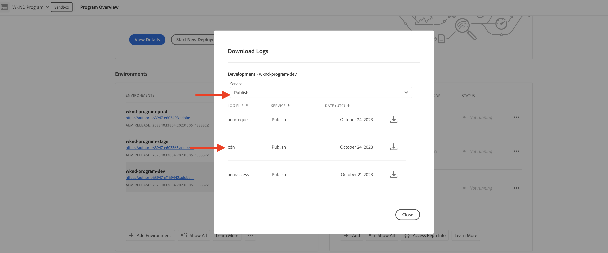

# 使用流量篩選規則封鎖DoS和DDoS攻擊

瞭解如何使用封鎖阻斷服務(DoS)和分散式阻斷服務(DDoS)攻擊 **速率限制流量篩選器** AEMas a Cloud Service(AEMCS)管理的CDN的規則和其他策略。 這些攻擊會導致CDN和潛在的AEM Publish服務（亦稱為來源）的流量尖峰，並可能影響網站的回應能力和可用性。

本教學課程可作為 _如何分析流量模式及設定速率限制 [流量篩選器規則](https://experienceleague.adobe.com/en/docs/experience-manager-cloud-service/content/security/traffic-filter-rules-including-waf)_ 來減少這些攻擊。 本教學課程也說明如何 [設定警報](https://experienceleague.adobe.com/en/docs/experience-manager-cloud-service/content/security/traffic-filter-rules-including-waf#traffic-filter-rules-alerts) 以便在發生可疑攻擊時通知您。

## 瞭解保護

讓我們來瞭解一下AEM網站的預設DDoS保護：

- **快取：** 有了良好的快取原則，DDoS攻擊的影響就會比較有限，因為CDN會防止大多數要求前往來源並造成效能降低。
- **自動縮放：** AEM製作和發佈服務會自動調整規模以處理流量尖峰，不過仍會受到流量突然大幅增加的影響。
- **封鎖：** 如果AdobeCDN的流量超過特定IP位址的Adobe定義速率(每個CDN PoP (Point of Presence))，則CDN會封鎖流向來源的流量。
- **警報：** 當流量超過特定速率時，「動作中心」會在來源警報通知中傳送流量尖峰。 當任何指定CDN PoP的流量超過 _Adobe定義_ 每個IP位址的請求率。 另請參閱 [流量篩選規則警報](https://experienceleague.adobe.com/en/docs/experience-manager-cloud-service/content/security/traffic-filter-rules-including-waf#traffic-filter-rules-alerts) 以取得更多詳細資料。

這些內建的保護應視為組織將DDoS攻擊對效能影響降到最低的能力的基準。 由於每個網站都有不同的效能特性，在達到Adobe定義的速率限制之前，可能會出現效能降低的情況，因此建議延伸預設保護，透過 _客戶設定_.

讓我們來看看客戶可採取的一些其他建議措施，以保護其網站免受DDoS攻擊：

- 宣告 **速率限制流量篩選器規則** 以封鎖來自單一IP位址（每個PoP）超過特定速率的流量。 這些通常是低於Adobe定義之速率限制的臨界值。
- 設定 **警報** 透過「警示動作」開啟速率限制流量篩選規則，這樣當規則觸發時，就會傳送「動作中心」通知。
- 宣告以增加快取涵蓋範圍 **要求轉換** 以忽略查詢引數。

>[!NOTE]
>
>此 [流量篩選器規則警報](https://experienceleague.adobe.com/en/docs/experience-manager-cloud-service/content/security/traffic-filter-rules-including-waf#traffic-filter-rules-alerts) 功能尚未發行。 若要透過早期採用者計畫取得存取權，請傳送電子郵件至 **<aemcs-waf-adopter@adobe.com>**.

### 速率限制流量規則變化 {#rate-limit-variations}

速率限制流量規則有兩種變化：

1. Edge — 根據指定IP每個Po的所有流量（包括可從CDN快取提供的流量）的速率封鎖請求。
1. 來源 — 根據指定IP的來源流量比率（每個PoP），封鎖要求。

## 客戶歷程

以下步驟反映了客戶保護其網站的可能過程。

1. 辨識速率限制流量篩選器規則的必要性。 這可能是由於收到Adobe在來源警報時出現的現成流量尖峰所致，也可能是主動決定採取預防措施，以降低DDoS成功的風險。
1. 如果您的網站已上線，請使用控制面板分析流量模式，以決定速率限制流量篩選規則的最佳臨界值。 如果您的網站尚未上線，請根據您的流量預期挑選值。
1. 使用上一步的值，設定速率限制流量篩選規則。 請務必啟用對應的警報，以便在達到臨界值時通知您。
1. 每當流量尖峰發生時，都會收到流量篩選規則警報，針對您的組織是否可能遭惡意行動者設為目標，提供寶貴的深入分析。
1. 視需要執行警示。 分析流量，判斷尖峰是否反映合法要求，而非攻擊。 如果流量合法，請增加臨界值，否則請降低臨界值。

本教學課程的其餘部分將引導您完成此程式。

## 瞭解設定規則的必要性 {#recognize-the-need}

如先前所述，Adobe預設會封鎖超過特定速率的CDN流量，但有些網站可能會遇到效能降低至低於該臨界值的情況。 因此，應設定速率限制流量篩選器規則。

理想情況下，您最好在進入生產階段前設定規則。 實際上，許多組織只會在收到流量尖峰的警報後，以反應式方式宣告規則，表示可能會發生攻擊。

Adobe在來源時傳送流量尖峰警報，做為 [動作中心通知](https://experienceleague.adobe.com/en/docs/experience-manager-cloud-service/content/operations/actions-center) 超過指定PoP單一IP位址流量的預設臨界值時。 如果您收到這類警報，建議設定速率限制流量篩選器規則。 此預設警報不同於客戶在定義流量篩選規則時必須明確啟用的警報，您將在未來章節中瞭解這些警報。


## 分析流量模式 {#analyze-traffic}

如果您的網站已上線，您可以使用CDN記錄檔及以下其中一種方法來分析流量模式：

### ELK — 設定儀表板工具

此 **Elasticsearch、Logstash和Kibana (ELK)** Adobe提供的儀表板工具可用來分析CDN記錄。 此工具包括視覺化流量模式的儀表板，讓您更容易決定速率限制流量篩選規則的最佳臨界值。

- 原地複製 [AEMCS-CDN-Log-Analysis-ELK-Tool](https://github.com/adobe/AEMCS-CDN-Log-Analysis-ELK-Tool) GitHub存放庫。
- 請遵循下列步驟來設定刀具 [如何設定ELK Docker容器](https://github.com/adobe/AEMCS-CDN-Log-Analysis-ELK-Tool?tab=readme-ov-file#how-to-set-up-the-elk-docker-container) 步驟。
- 在設定過程中，匯入 `traffic-filter-rules-analysis-dashboard.ndjson` 檔案以視覺化資料。 此 _CDN流量_ 儀表板包含的視覺效果會顯示在CDN Edge和Origin每個IP/POP的最大請求數。
- 從 [Cloud Manager](https://my.cloudmanager.adobe.com/)的 _環境_ 卡片，下載AEMCS發佈服務的CDN記錄。

  

  >[!TIP]
  >
  > 新請求可能需要5分鐘的時間才會出現在CDN記錄檔中。

### Splunk — 設定控制面板工具

客戶擁有 [已啟用Splunk記錄檔轉送](https://experienceleague.adobe.com/en/docs/experience-manager-cloud-service/content/implementing/developing/logging#splunk-logs) 可以建立新儀表板來分析流量模式。 下列XML檔案可協助您在Splunk建立儀表板：

- [CDN — 流量儀表板](./assets/traffic-dashboard.xml)：此儀表板提供CDN Edge和Origin流量模式的深入分析。 其中包含顯示CDN Edge和Origin每個IP/POP的最大要求數的視覺效果。

### 檢視資料

ELK和Splunk儀表板中提供下列視覺效果：

- **每個使用者端IP和POP的邊緣RPS**：此視覺效果顯示每個IP/POP的最大請求數 **在CDN Edge**. 視覺效果中的尖峰表示請求數量上限。

  **麋鹿儀表板**：
  

  **Splunk控制面板**：\
  

- **每個使用者端IP和POP的原始RPS**：此視覺效果顯示每個IP/POP的最大請求數 **在原點**. 視覺效果中的尖峰表示請求數量上限。

  **麋鹿儀表板**：
  

  **Splunk控制面板**：
  

## 選擇臨界值

速率限制流量篩選器規則的臨界值應以上述分析為基礎，並確保合法流量不會遭到封鎖。 如需如何選擇臨界值的指引，請參閱下表：

| 變化 | 值 |
| :--------- | :------- |
| 來源 | 取得底下每個IP/POP的最大來源請求數 **一般** 流量條件（即不是DDoS時的速率）並增加倍數 |
| Edge | 取得底下每個IP/POP的最大邊緣請求數 **一般** 流量條件（即不是DDoS時的速率）並增加倍數 |

使用的倍數取決於您對由於自然流量、行銷活動和其他事件造成的正常流量尖峰的期望。 介於5到10之間的倍數可能是合理的。

如果您的網站尚未上線，表示沒有資料可分析，您應教育性猜測要為速率限制流量篩選器規則設定的適當值。 例如：

| 變化 | 值 |
|------------------------------ |:-----------:|
| Edge | 500 |
| 來源 | 100 |

## 設定規則 {#configure-rules}

設定 **速率限制流量篩選器** AEM專案中的規則 `/config/cdn.yaml` 檔案，其值以上述討論為基礎。 如有需要，請洽詢您的Web安全性團隊，以確定速率限制值適當，且不會封鎖合法流量。

請參閱 [在您的AEM專案中建立規則](https://experienceleague.adobe.com/en/docs/experience-manager-learn/cloud-service/security/traffic-filter-and-waf-rules/how-to-setup#create-rules-in-your-aem-project) 以取得更多詳細資料。

```yaml
kind: CDN
version: '1'
metadata:
  envTypes:
    - dev
    - stage
    - prod
data:
  trafficFilters:
    rules:
    ...
    #  Prevent attack at edge by blocking client for 5 minutes if they make more than 500 requests per second on average
      - name: prevent-dos-attacks-edge
        when:
          reqProperty: tier
          in: ["author","publish"]
        rateLimit:
          limit: 500 # replace with the appropriate value
          window: 10 # compute the average over 10s
          penalty: 300 # block IP for 5 minutes
          count: all # count all requests
          groupBy:
            - reqProperty: clientIp
        action: 
          type: log
          experimental_alert: true
    #  Prevent attack at origin by blocking client for 5 minutes if they make more than 100 requests per second on average            
      - name: prevent-dos-attacks-origin
        when:
          reqProperty: tier
          in: ["author","publish"]
        rateLimit:
          limit: 100 # replace with the appropriate value
          window: 10 # compute the average over 10s
          penalty: 300 # block IP for 5 minutes
          count: fetches # count only fetches
          groupBy:
            - reqProperty: clientIp
        action: 
          type: log
          experimental_alert: true   
          
```

請注意，來源和邊緣規則都會宣告，且警報屬性會設為 `true` 因此，只要達到臨界值，您就會收到警示，可能表示有攻擊。

>[!NOTE]
>
>此 _實驗性_ experimental_alert前的prefix_會在警示功能發行時移除。 若要加入率先採用者計畫，請傳送電子郵件至 **<aemcs-waf-adopter@adobe.com>**.

建議一開始將動作型別設為記錄，以便監視數小時或數天的流量，確保合法流量不會超過這些速率。 幾天後，請變更為封鎖模式。

請依照下列步驟，將變更部署至AEMCS環境：

- 提交上述變更並將其推播到您的Cloud Manager Git存放庫。
- 使用Cloud Manager的配置管道將變更部署到AEMCS環境。 參考 [透過Cloud Manager部署規則](https://experienceleague.adobe.com/en/docs/experience-manager-learn/cloud-service/security/traffic-filter-and-waf-rules/how-to-setup#deploy-rules-through-cloud-manager) 以取得更多詳細資料。
- 驗證 **速率限制流量篩選器規則** 如預期般運作，您可以模擬攻擊，如 [攻擊模擬](#attack-simulation) 區段。 將請求數限制在高於規則中設定的速率限制值的值。

### 設定請求轉換規則 {#configure-request-transform-rules}

除了速率限制流量篩選規則之外，建議使用 [要求轉換](https://experienceleague.adobe.com/en/docs/experience-manager-cloud-service/content/implementing/content-delivery/cdn-configuring-traffic#request-transformations) 取消設定應用程式不需要的查詢引數，以最小化透過快取爆破技術略過快取的方式。 例如，如果您只想允許 `search` 和 `campaignId` 查詢引數時，可宣告下列規則：

```yaml
kind: "CDN"
version: "1"
metadata:
  envTypes: 
    - dev
    - stage
    - prod  
data:  
  experimental_requestTransformations:
    rules:            
      - name: unset-all-query-params-except-those-needed
        when:
          reqProperty: tier
          in: ["publish"]
        actions:
          - type: unset
            queryParamMatch: ^(?!search$|campaignId$).*$
```

## 接收流量篩選規則警示 {#receiving-alerts}

如上所述，如果流量篩選規則包含 *experimental_alert： true*，則會在規則符合時收到警報。

## 對警報執行動作 {#acting-on-alerts}

有時候，警報會提供資訊，讓您察覺到攻擊的頻率。 使用上述儀表板來分析您的CDN資料非常有價值，以驗證流量尖峰是否是因為攻擊，而不只是因為合法流量增加。 如果是後者，請考慮增加臨界值。

## 攻擊模擬{#attack-simulation}

本節說明模擬DoS攻擊的方法，這些方法可用來產生本教學課程所用控制面板的資料，並驗證任何設定的規則是否成功封鎖攻擊。

>[!CAUTION]
>
> 請勿在生產環境中執行這些步驟。 下列步驟僅適用於模擬。
> 
>如果您收到指出流量尖峰的警報，請繼續前往 [分析流量模式](#analyzing-traffic-patterns) 區段。

若要模擬攻擊，可使用工具，如 [Apache基準](https://httpd.apache.org/docs/2.4/programs/ab.html)， [Apache JMeter](https://jmeter.apache.org/)， [韋蓋塔](https://github.com/tsenart/vegeta)，而其他元件可使用。

### 邊緣請求

使用下列專案 [韋蓋塔](https://github.com/tsenart/vegeta) 命令您可以對您的網站提出許多要求：

```shell
$ echo "GET https://<YOUR-WEBSITE-DOMAIN>" | vegeta attack -rate=120 -duration=5s | vegeta report
```

上述命令會在5秒內發出120個請求並輸出報表。 假設網站沒有速率限制，這可能會導致流量尖峰。

### 來源請求

若要略過CDN快取並向來源(AEM Publish服務)提出請求，您可以在URL中新增唯一的查詢引數。 請參閱範例Apache JMeter指令碼，來自 [使用JMeter指令碼模擬DoS攻擊](https://experienceleague.adobe.com/en/docs/experience-manager-learn/foundation/security/modsecurity-crs-dos-attack-protection#simulate-dos-attack-using-jmeter-script)

