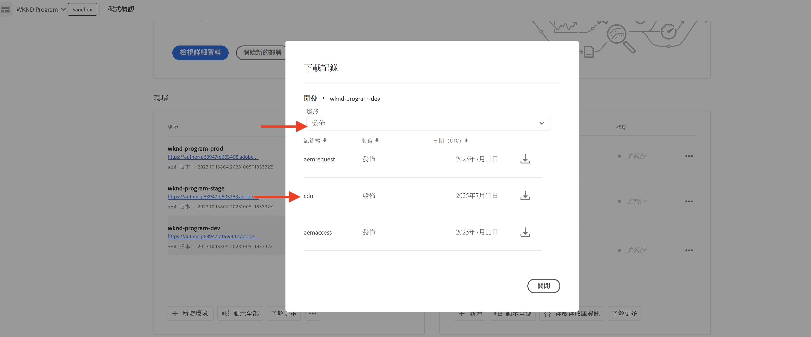

# 監視敏感性要求

了解如何透過使用 AEM as a Cloud Service 中的流量篩選器規則記錄敏感性要求以進行監視。

記錄功能可讓您在不影響一般使用者或服務的情況下觀察流量模式，這是實作封鎖規則之前的重要第一步。

本教學課程示範如何針對 AEM Publish 服務&#x200B;**記錄 WKND 登入和登出路徑的要求**。

## 記錄要求的理由和時機

記錄特定要求是一種低風險、高價值的做法，有助於了解使用者 (以及潛在的惡意行為者) 與您 AEM 應用程式互動的方式。在實作封鎖規則之前，這項做法特別有幫助，能讓您在不干擾合法流量的情況下，更有信心地調整安全性態勢。

記錄的常見案例包括：

- 在推廣至 `block` 模式之前驗證規則的影響和觸及範圍。
- 監視登入/登出路徑和驗證端點是否有異常模式或暴力破解嘗試。
- 追蹤對 API 端點的高頻率存取，以偵測潛在的濫用或 DoS 活動。
- 在套用更嚴格的控制之前，建立機器人行為的基準。
- 若發生安全性事件，請提供鑑識資料，以了解攻擊的性質及受影響的資源。

## 先決條件

繼續進行之前，請確保您已完成[如何設定流量篩選器和 WAF 規則](../setup.md)教學課程中所述的必要設定。此外，您已原地複製 [AEM WKND 網站專案](https://github.com/adobe/aem-guides-wknd)並部署至您的 AEM 環境。

## 範例：記錄 WKND 登入和登出要求

您在此範例中建立一個流量篩選器規則，記錄在 AEM Publish 服務上對 WKND 登入和登出路徑發出的要求。那有助於監視驗證嘗試並識別潛在的安全性問題。

- 在 WKND 專案的 `/config/cdn.yaml` 檔案中新增以下規則。

```yaml
kind: "CDN"
version: "1"
metadata:
  envTypes: ["dev", "stage", "prod"]
data:
  trafficFilters:
    rules:
    # On AEM Publish service log WKND Login and Logout requests
    - name: publish-auth-requests
      when:
        allOf:
          - reqProperty: tier
            matches: publish
          - reqProperty: path
            in:
              - /system/sling/login/j_security_check
              - /system/sling/logout
      action: log   
```

- 提交變更並將其推送至 Cloud Manager Git 存放庫。

- 使用[先前建立的](../setup.md#deploy-rules-using-adobe-cloud-manager) Cloud Manager 設定管道，將變更部署至 AEM 環境。

- 透過登入與登出程式中的 WKND 網站 (例如，`https://publish-pXXXX-eYYYY.adobeaemcloud.com/us/en.html`) 測試該規則您可以使用 `asmith/asmith` 作為使用者名稱和密碼。

  

## 分析

讓我們分析 `publish-auth-requests` 規則的結果，方法是透過從 Cloud Manager 下載 AEMCS CDN 記錄並使用 [AEMCS CDN 記錄分析工具](../setup.md#setup-the-elastic-dashboard-tool)。

- 從 [Cloud Manager](https://my.cloudmanager.adobe.com/) 的「**環境**」卡片中，下載 AEMCS **Publish** 服務的 CDN 記錄。

  

  >[!TIP]
  >
  > 新要求可能要花 5 分鐘才會出現在 CDN 記錄中。

- 將下載的記錄檔案 (例如下面螢幕擷圖中的 `publish_cdn_2023-10-24.log`) 複製到 Elastic 儀表板工具專案的 `logs/dev` 資料夾中。

  

- 重新整理 Elastic 儀表板工具頁面。
   - 在上方的「**全域篩選器**」區段，編輯 `aem_env_name.keyword` 篩選器並選取 `dev` 環境值。

     

   - 若要變更時間間隔，按一下右上角的行事曆圖示，然後選取要採用的時間間隔。

     

- 檢閱更新後儀表板的「**已分析的要求**」、「**已標記的要求**」和「**已標記的要求詳細資訊**」面板。若為符合的 CDN 記錄項目，其應會顯示各項目的用戶端 IP (cli_ip)、主機、URL、動作 (waf_action) 和規則名稱 (waf_match) 的值。

  
