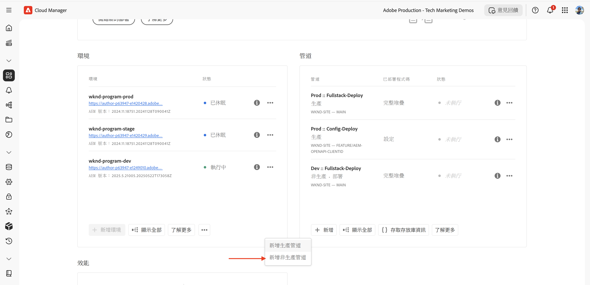
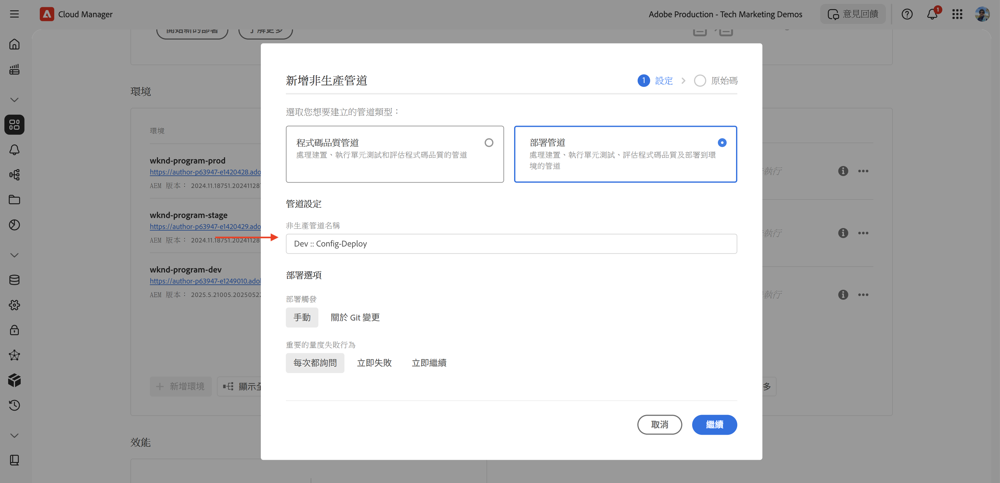
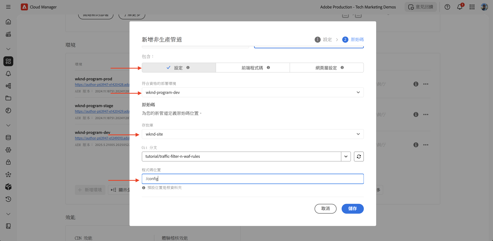
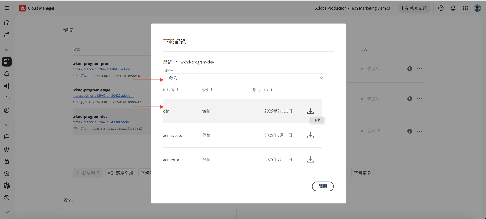

# 如何設定流量篩選器規則 (包括 WAF 規則)

了解&#x200B;**如何設定**&#x200B;流量篩選器規則，包括 Web 應用程式防火牆 (WAF) 規則。我們在本教學課程中為後續的教學課程奠定基礎，接下來您將會設定並部署規則，然後進行測試與結果分析。

本教學課程使用 [AEM WKND Sites 專案](https://github.com/adobe/aem-guides-wknd)示範設定過程。

>[!VIDEO](https://video.tv.adobe.com/v/3469396/?quality=12&learn=on)

## 設定概觀

後續教學課程的基礎準備工作包括以下幾個步驟：

- _在_ AEM 專案的 `config` 資料夾中建立規則
- 使用 Adobe Cloud Manager 的設定管道&#x200B;_部署規則_。
- 使用 Curl、Vegeta 和 Nikto 等工具&#x200B;_測試規則_
- 使用 AEMCS CDN 記錄分析工具&#x200B;_分析結果_

## 在 AEM 專案中建立規則

若要在 AEM 專案中定義&#x200B;**標準**&#x200B;和 **WAF** 流量篩選器規則，請依照以下步驟操作：

1. 在 AEM 專案的頂層建立一個名為 `config` 的資料夾。

2. 在 `config` 資料夾中建立一個名為 `cdn.yaml` 的檔案。

3. 在 `cdn.yaml` 中使用以下的後設資料結構：

```yaml
kind: "CDN"
version: "1"
metadata:
  envTypes: ["dev", "stage", "prod"]
data:
  trafficFilters:
    rules:
```


您將在[下一個教學課程](#next-steps)中，學習如何將 Adobe **建議的標準流量篩選器和 WAF 規則**&#x200B;新增到上述檔案中，為您的實施奠定穩固的基礎。

## 使用 Adobe Cloud Manager 部署規則

在準備部署規則時，請依照以下步驟操作：

1. 登入 [my.cloudmanager.adobe.com](https://my.cloudmanager.adobe.com/) 並選取您的程式。

2. 從「**程式概觀**」頁面，前往「**管道**」卡片，然後按一下「**+ 新增**」以建立新的管道。

   

3. 在管道精靈中：

   - **類型**：部署管道
   - **管道名稱**：Dev-Config

   

4. 來源程式碼設定：

   - **要部署的程式碼**：目標性部署
   - **包含**：設定
   - **部署環境**：例如，`wknd-program-dev`
   - **存放庫**：Git 存放庫 (例如，`wknd-site`)
   - **Git 分支**：您的工作分支
   - **程式碼位置**：`/config`

   

5. 審閱管路設定並按一下「**儲存**」。

您將在 [下一個教學課程](#next-steps)中，學習如何將管道部署到您的 AEM 環境。

## 使用工具測試規則

為了測試標準流量篩選器和 WAF 規則的有效性，可以使用各種工具模擬要求並分析規則的回應方式。

請驗證您的本機電腦已安裝以下工具，或依照指示進行安裝：

- [Curl](https://curl.se/)：測試要求/回應流程。
- [Vegeta](https://github.com/tsenart/vegeta)：模擬高要求負載 (DoS 測試)。
- [Nikto](https://github.com/sullo/nikto/wiki)：掃描漏洞。

您可以使用以下命令驗證安裝：

```shell
# Curl version check
$ curl --version

# Vegeta version check
$ vegeta -version

# Nikto version check
$ cd <PATH-OF-CLONED-REPO>/program
$ ./nikto.pl -Version
```

您將在[下一個教學課程](#next-steps)中，學習如何使用這些工具模擬高要求負載和惡意要求，以測試流量篩選器和 WAF 規則的有效性。

## 分析結果

若要準備分析結果，請依照以下步驟操作：

1. 安裝 **AEMCS CDN 記錄分析工具**&#x200B;以使用預先建立的儀表板將模式視覺化並進行分析。

2. 透過從 Cloud Manager UI 下載記錄以執行 **CDN 記錄攝取**。或者，也可以將記錄直接轉寄至支援的託管記錄目標，例如 Splunk 或 Elasticsearch。

### AEMCS CDN 記錄分析工具

若要分析流量篩選器和 WAF 規則的結果，可以使用 **AEMCS CDN 記錄分析工具**。此工具利用透過 AEMCS CDN 所收集的記錄提供預先建立的儀表板，用於將 CDN 流量與 WAF 活動視覺化。

AEMCS CDN 記錄分析工具支援兩個可觀察性平台，即 **ELK** (Elasticsearch、Logstash、Kibana) 和 **Splunk**。

可以使用記錄轉寄功能將記錄串流傳輸至託管的 ELK 或 Splunk 記錄服務，並在其中安裝儀表板，將標準流量篩選器和 WAF 流量篩選器規則視覺化並進行分析。然而，對於本教學課程，您將在安裝於電腦上的本機 ELK 執行個體設定儀表板。

1. 原地複製 [AEMCS-CDN-Log-Analysis-Tooling](https://github.com/adobe/AEMCS-CDN-Log-Analysis-Tooling) 存放庫。

2. 依照 [ELK Docker 容器設定指南](https://github.com/adobe/AEMCS-CDN-Log-Analysis-Tooling/blob/main/ELK/README.md)在本機安裝和設定 ELK 堆疊。

3. 您可以使用 ELK 儀表板探索 IP 要求、封鎖的流量、URI 模式和安全性警報等量度。

   

>[!NOTE]
> 
> 如果尚未從 AEMCS CDN 攝取記錄，則儀表板將顯示為空。

### CDN 記錄攝取

若要將 CDN 記錄攝取至 ELK 堆疊，請依照以下步驟操作：

- 從 [Cloud Manager](https://my.cloudmanager.adobe.com/) 的「**環境**」卡片中，下載 AEMCS **Publish** 服務的 CDN 記錄。

  

  >[!TIP]
  >
  > 新要求可能要花 5 分鐘才會出現在 CDN 記錄中。

- 將下載的記錄檔案 (例如下面螢幕擷圖中的 `publish_cdn_2025-06-06.log`) 複製到 Elastic 儀表板工具專案的 `logs/dev` 資料夾中。

  {width="800" zoomable="yes"}

- 重新整理 Elastic 儀表板工具頁面。
   - 在上方的「**全域篩選器**」區段，編輯 `aem_env_name.keyword` 篩選器並選取 `dev` 環境值。

     

   - 若要變更時間間隔，按一下右上角的行事曆圖示，然後選取要採用的時間間隔。

- 您將在[下一個教學課程](#next-steps)中，學習如何使用 ELK 堆疊中預先建立的儀表板，分析標準流量篩選器和 WAF 流量篩選器規則的結果。

  

## 摘要

您已成功為在 AEM as a Cloud Service 中實施流量篩選器規則 (包括 WAF 規則) 奠定了基礎。您建立了設定檔案結構、部署管道，並準備了用於測試和分析結果的工具。

## 後續步驟

使用以下教學課程了解如何實施 Adobe 建議的規則：

<!-- CARDS
{target = _self}

* ./use-cases/using-traffic-filter-rules.md
  {title = Protecting AEM websites using standard traffic filter rules}
  {description = Learn how to protect AEM websites from DoS, DDoS and bot abuse using Adobe-recommended standard traffic filter rules in AEM as a Cloud Service.}
  {image = ./assets/use-cases/using-traffic-filter-rules.png}
  {cta = Apply Rules}

* ./use-cases/using-waf-rules.md
  {title = Protecting AEM websites using WAF traffic filter rules}
  {description = Learn how to protect AEM websites from sophisticated threats including DoS, DDoS, and bot abuse using Adobe-recommended Web Application Firewall (WAF) traffic filter rules in AEM as a Cloud Service.}
  {image = ./assets/use-cases/using-waf-rules.png}
  {cta = Activate WAF}
-->
<!-- START CARDS HTML - DO NOT MODIFY BY HAND -->
<div class="columns">
    <div class="column is-half-tablet is-half-desktop is-one-third-widescreen" aria-label="Protecting AEM websites using standard traffic filter rules">
        <div class="card" style="height: 100%; display: flex; flex-direction: column; height: 100%;">
            <div class="card-image">
                <figure class="image x-is-16by9">
                    <a href="./use-cases/using-traffic-filter-rules.md" title="使用標準流量篩選器規則保護 AEM 網站" target="_self" rel="referrer">
                        
                    </a>
                </figure>
            </div>
            <div class="card-content is-padded-small" style="display: flex; flex-direction: column; flex-grow: 1; justify-content: space-between;">
                <div class="top-card-content">
                    <p class="headline is-size-6 has-text-weight-bold">
                        <a href="./use-cases/using-traffic-filter-rules.md" target="_self" rel="referrer" title="使用標準流量篩選器規則保護 AEM 網站">使用標準流量篩選器規則保護 AEM 網站</a>
                    </p>
                    <p class="is-size-6">了解如何使用 Adobe 建議的標準流量篩選器規則，在 AEM as a Cloud Service 中保護 AEM 網站不受 DoS、DDoS 攻擊與機器人濫用的侵害。</p>
                </div>
                <a href="./use-cases/using-traffic-filter-rules.md" target="_self" rel="referrer" class="spectrum-Button spectrum-Button--outline spectrum-Button--primary spectrum-Button--sizeM" style="align-self: flex-start; margin-top: 1rem;">
                    <span class="spectrum-Button-label has-no-wrap has-text-weight-bold">套用規則</span>
                </a>
            </div>
        </div>
    </div>
    <div class="column is-half-tablet is-half-desktop is-one-third-widescreen" aria-label="Protecting AEM websites using WAF traffic filter rules">
        <div class="card" style="height: 100%; display: flex; flex-direction: column; height: 100%;">
            <div class="card-image">
                <figure class="image x-is-16by9">
                    <a href="./use-cases/using-waf-rules.md" title="使用 WAF 流量篩選器規則保護 AEM 網站" target="_self" rel="referrer">
                        
                    </a>
                </figure>
            </div>
            <div class="card-content is-padded-small" style="display: flex; flex-direction: column; flex-grow: 1; justify-content: space-between;">
                <div class="top-card-content">
                    <p class="headline is-size-6 has-text-weight-bold">
                        <a href="./use-cases/using-waf-rules.md" target="_self" rel="referrer" title="使用 WAF 流量篩選器規則保護 AEM 網站">使用 WAF 流量篩選器規則保護 AEM 網站</a>
                    </p>
                    <p class="is-size-6">了解如何使用 Adobe 建議的 Web 應用程式防火牆 (WAF) 流量篩選器規則，在 AEM as a Cloud Service 中保護網站不受包括 DoS、DDoS 及機器人濫用攻擊等在內的複雜威脅。</p>
                </div>
                <a href="./use-cases/using-waf-rules.md" target="_self" rel="referrer" class="spectrum-Button spectrum-Button--outline spectrum-Button--primary spectrum-Button--sizeM" style="align-self: flex-start; margin-top: 1rem;">
                    <span class="spectrum-Button-label has-no-wrap has-text-weight-bold">啟動 WAF</span>
                </a>
            </div>
        </div>
    </div>
</div>
<!-- END CARDS HTML - DO NOT MODIFY BY HAND -->

## 進階使用案例

除了 Adobe 建議的標準流量篩選器與 WAF 規則之外，也可以實施進階案例，以達成特定的業務需求。這些案例包括：

<!-- CARDS
{target = _self}

* ./how-to/request-logging.md

* ./how-to/request-blocking.md

* ./how-to/request-transformation.md
-->
<!-- START CARDS HTML - DO NOT MODIFY BY HAND -->
<div class="columns">
    <div class="column is-half-tablet is-half-desktop is-one-third-widescreen" aria-label="Monitoring sensitive requests">
        <div class="card" style="height: 100%; display: flex; flex-direction: column; height: 100%;">
            <div class="card-image">
                <figure class="image x-is-16by9">
                    <a href="./how-to/request-logging.md" title="監視敏感性要求" target="_self" rel="referrer">
                        
                    </a>
                </figure>
            </div>
            <div class="card-content is-padded-small" style="display: flex; flex-direction: column; flex-grow: 1; justify-content: space-between;">
                <div class="top-card-content">
                    <p class="headline is-size-6 has-text-weight-bold">
                        <a href="./how-to/request-logging.md" target="_self" rel="referrer" title="監視敏感性要求">監視敏感性要求</a>
                    </p>
                    <p class="is-size-6">了解如何透過使用 AEM as a Cloud Service 中的流量篩選器規則記錄敏感性要求以進行監視。</p>
                </div>
                <a href="./how-to/request-logging.md" target="_self" rel="referrer" class="spectrum-Button spectrum-Button--outline spectrum-Button--primary spectrum-Button--sizeM" style="align-self: flex-start; margin-top: 1rem;">
                    <span class="spectrum-Button-label has-no-wrap has-text-weight-bold">了解更多</span>
                </a>
            </div>
        </div>
    </div>
    <div class="column is-half-tablet is-half-desktop is-one-third-widescreen" aria-label="Restricting access">
        <div class="card" style="height: 100%; display: flex; flex-direction: column; height: 100%;">
            <div class="card-image">
                <figure class="image x-is-16by9">
                    <a href="./how-to/request-blocking.md" title="限制存取權" target="_self" rel="referrer">
                        
                    </a>
                </figure>
            </div>
            <div class="card-content is-padded-small" style="display: flex; flex-direction: column; flex-grow: 1; justify-content: space-between;">
                <div class="top-card-content">
                    <p class="headline is-size-6 has-text-weight-bold">
                        <a href="./how-to/request-blocking.md" target="_self" rel="referrer" title="限制存取權">限制存取權</a>
                    </p>
                    <p class="is-size-6">了解如何使用 AEM as a Cloud Service 中的流量篩選器規則封鎖特定要求以限制存取。</p>
                </div>
                <a href="./how-to/request-blocking.md" target="_self" rel="referrer" class="spectrum-Button spectrum-Button--outline spectrum-Button--primary spectrum-Button--sizeM" style="align-self: flex-start; margin-top: 1rem;">
                    <span class="spectrum-Button-label has-no-wrap has-text-weight-bold">了解更多</span>
                </a>
            </div>
        </div>
    </div>
    <div class="column is-half-tablet is-half-desktop is-one-third-widescreen" aria-label="Normalizing requests">
        <div class="card" style="height: 100%; display: flex; flex-direction: column; height: 100%;">
            <div class="card-image">
                <figure class="image x-is-16by9">
                    <a href="./how-to/request-transformation.md" title="標準化要求" target="_self" rel="referrer">
                        
                    </a>
                </figure>
            </div>
            <div class="card-content is-padded-small" style="display: flex; flex-direction: column; flex-grow: 1; justify-content: space-between;">
                <div class="top-card-content">
                    <p class="headline is-size-6 has-text-weight-bold">
                        <a href="./how-to/request-transformation.md" target="_self" rel="referrer" title="標準化要求">標準化要求</a>
                    </p>
                    <p class="is-size-6">了解如何在 AEM as a Cloud Service 中，透過流量篩選器規則轉換要求以進行標準化處理。</p>
                </div>
                <a href="./how-to/request-transformation.md" target="_self" rel="referrer" class="spectrum-Button spectrum-Button--outline spectrum-Button--primary spectrum-Button--sizeM" style="align-self: flex-start; margin-top: 1rem;">
                    <span class="spectrum-Button-label has-no-wrap has-text-weight-bold">了解更多</span>
                </a>
            </div>
        </div>
    </div>
</div>
<!-- END CARDS HTML - DO NOT MODIFY BY HAND -->

## 其他資源

- [流量篩選規則包括 WAF 規則](https://experienceleague.adobe.com/zh-hant/docs/experience-manager-cloud-service/content/security/traffic-filter-rules-including-waf)
