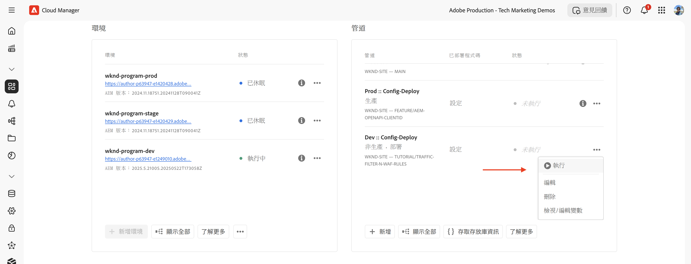
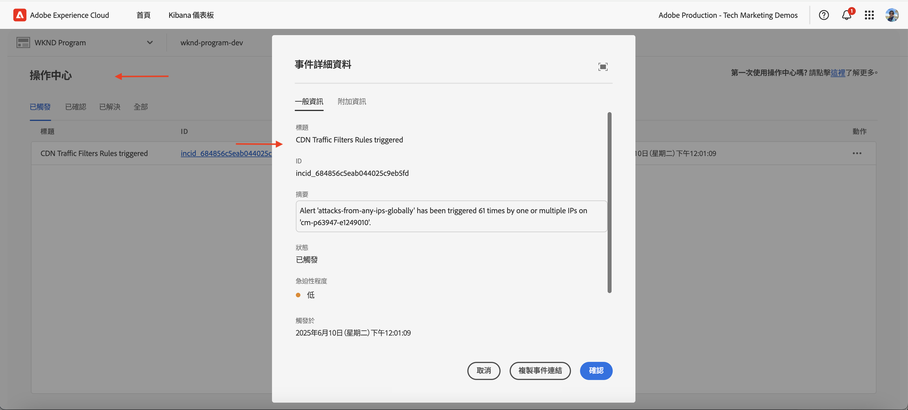
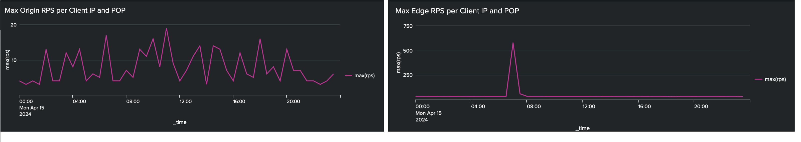

# 使用標準流量篩選規則保護AEM網站

瞭解如何在AEM as a Cloud Service中使用&#x200B;_Adobe建議的_ **標準流量篩選器規則**，以保護AEM網站免受拒絕服務(DoS)、分散式拒絕服務(DDoS)和機器人濫用。

## 學習目標

- 檢閱Adobe建議的標準流量篩選規則。
- 定義、部署、測試及分析規則的結果。
- 瞭解何時以及如何根據流量模式調整規則。
- 瞭解如何使用AEM動作中心來檢閱規則產生的警報。

### 實施概述

實施步驟包括：

- 正在將標準流量篩選規則新增到AEM WKND專案的`/config/cdn.yaml`檔案。
- 認可變更並推送至Cloud Manager Git存放庫。
- 使用Cloud Manager設定管道將變更部署到AEM環境。
- 使用[Vegeta](https://github.com/tsenart/vegeta)模擬DoS攻擊，以測試規則
- 使用AEMCS CDN記錄檔和ELK儀表板工具來分析結果。

## 先決條件

繼續進行之前，請確定您已完成必要的基礎，如[如何設定流量篩選器和WAF規則](../setup.md)教學課程中所述。 此外，您已複製[AEM WKND Sites專案](https://github.com/adobe/aem-guides-wknd)並將其部署至您的AEM環境。

## 規則的關鍵動作

在深入瞭解標準流量篩選規則的詳細資訊之前，請先瞭解這些規則所執行的關鍵動作。 每個規則中的`action`屬性會定義流量篩選器在滿足條件時應如何回應。 這些動作包括：

- **記錄**：規則會記錄事件以進行監視和分析，讓您檢閱流量模式，並視需要調整臨界值。 由`type: log`屬性指定。

- **警示**：當符合條件時，規則會觸發警示，協助您識別潛在問題。 由`alert: true`屬性指定。

- **封鎖**：當符合條件時，規則會封鎖流量，導致無法存取您的AEM網站。 由`action: block`屬性指定。

## 檢閱和定義規則

Adobe建議的標準流量篩選規則可作為基礎層，藉由記錄超過IP型速率限制等事件，找出潛在的惡意流量模式，並封鎖來自特定國家的流量。 這些記錄可協助團隊驗證臨界值，並做出明智的決策，最終將&#x200B;**轉換為區塊模式**&#x200B;規則，而不會中斷合法的流量。

讓我們檢閱您應新增至AEM WKND專案`/config/cdn.yaml`檔案的三個標準流量篩選規則：

- **防止Edge的DoS**：此規則會透過監控使用者端IP的每秒要求(RPS)，偵測到CDN邊緣的潛在拒絕服務(DoS)攻擊。
- **防止來源的DoS**：此規則會監視使用者端IP的擷取要求，以偵測來源可能的拒絕服務(DoS)攻擊。
- **封鎖OFAC國家**：此規則會封鎖來自OFAC (國外Assets控制局)限制之特定國家的存取權。

### 1.避免Edge的DoS

此規則&#x200B;**在CDN偵測到可能的拒絕服務(DoS)攻擊時會傳送警示**。 觸發此規則的條件是，當使用者端在邊緣超過每個CDN POP (Point of Presence)每秒&#x200B;**500個要求** （平均超過10秒）時。

它會計算&#x200B;**所有**&#x200B;個要求，並依使用者端IP分組。

```yaml
kind: "CDN"
version: "1"
metadata:
  envTypes: ["dev", "stage", "prod"]
data:
  trafficFilters:
    rules:
    - name: prevent-dos-attacks-edge
      when:
        reqProperty: tier
        equals: 'publish'
      rateLimit:
        limit: 500
        window: 10
        penalty: 300
        count: all
        groupBy:
          - reqProperty: clientIp
      action:
        type: log
        alert: true
```

`action`屬性指定規則應記錄事件並在符合條件時觸發警示。 因此，它可以協助您監控潛在的DoS攻擊，而不會封鎖合法流量。 不過，您的目標是在您驗證流量模式並調整臨界值後，最終將此規則轉換為區塊模式。

### 2.防止原點的DoS

此規則&#x200B;**在來源偵測到可能的拒絕服務(DoS)攻擊時，會傳送警示**。 觸發此規則的條件是，使用者端超過來源處每個使用者端IP每秒&#x200B;**100個要求** （平均超過10秒）。

它會計算&#x200B;**擷取** （略過快取的要求），並依使用者端IP分組。

```yaml
...
    - name: prevent-dos-attacks-origin
      when:
        reqProperty: tier
        equals: 'publish'
      rateLimit:
        limit: 100
        window: 10
        penalty: 300
        count: fetches
        groupBy:
          - reqProperty: clientIp
      action:
        type: log
        alert: true
```

`action`屬性指定規則應記錄事件並在符合條件時觸發警示。 因此，它可以協助您監控潛在的DoS攻擊，而不會封鎖合法流量。 不過，您的目標是在您驗證流量模式並調整臨界值後，最終將此規則轉換為區塊模式。

### 3.封鎖OFAC國家

此規則會封鎖來自[OFAC](https://ofac.treasury.gov/sanctions-programs-and-country-information)限制之特定國家的存取權。
您可以視需要檢閱和修改國家/地區清單。

```yaml
...
    - name: block-ofac-countries
      when:
        allOf:
          - { reqProperty: tier, in: ["author", "publish"] }
          - reqProperty: clientCountry
            in:
              - SY
              - BY
              - MM
              - KP
              - IQ
              - CD
              - SD
              - IR
              - LR
              - ZW
              - CU
              - CI
      action: block
```

`action`屬性指定規則應該封鎖來自指定國家的存取權。 這可協助您防止從可能帶來安全風險的區域存取您的AEM網站。

具有上述規則的完整`cdn.yaml`檔案看起來像這樣：


## 部署規則

若要部署上述規則，請遵循下列步驟：

- 提交變更並將其推送至 Cloud Manager Git 存放庫。

- 使用先前建立的AEM設定管道[將變更部署到Cloud Manager環境](../setup.md#deploy-rules-using-adobe-cloud-manager)。

  

## 測試規則

若要驗證標準流量篩選規則的有效性，請在&#x200B;**CDN Edge**&#x200B;和&#x200B;**Origin**&#x200B;使用多功能HTTP負載測試工具[Vegeta](https://github.com/tsenart/vegeta)來模擬高要求流量。

- 在Edge測試DoS規則（500 rps限制）。 以下命令會模擬每秒200個要求，持續15秒，超過Edge臨界值(500 rps)。

  ```shell
  $echo "GET https://publish-p63947-e1249010.adobeaemcloud.com/us/en.html" | vegeta attack -rate=200 -duration=15s | vegeta report
  ```

  

  >[!IMPORTANT]
  >
  >  請注意上述報告中的&#x200B;*100%*&#x200B;成功和&#x200B;_200_&#x200B;狀態代碼。 由於規則設定為`log`和`alert`，這些要求&#x200B;_未被封鎖_，但已記錄它們以供監視、分析和發出警示。

- 在來源測試DoS規則（100 rps限制）。 下列命令會模擬每秒超過「原始」臨界值(100 rps)的110個擷取要求（1秒）。 若要模擬略過快取的要求，`targets.txt`檔案會以唯一的查詢引數建立，以確保每個要求都會被視為擷取要求。

  ```shell
  # Create targets.txt with unique query parameters
  $for i in {1..110}; do
    echo "GET https://publish-p63947-e1249010.adobeaemcloud.com/us/en.html?ts=$(date +%s)$i"
  done > targets.txt
  
  # Use the targets.txt file to simulate fetch requests
  $vegeta attack -rate=110 -duration=1s -targets=targets.txt | vegeta report
  ```

  

  >[!IMPORTANT]
  >
  >  請注意上述報告中的&#x200B;*100%*&#x200B;成功和&#x200B;_200_&#x200B;狀態代碼。 由於規則設定為`log`和`alert`，這些要求&#x200B;_未被封鎖_，但已記錄它們以供監視、分析和發出警示。

- 為簡化起見，此處不測試OFAC規則。

## 檢閱警報

觸發流量篩選器規則時會產生警報。 您可以在[AEM動作中心](https://experience.adobe.com/aem/actions-center)檢閱這些警示。



## 分析結果

若要分析流量篩選規則的結果，您可以使用AEMCS CDN記錄檔和ELK儀表板工具。 遵循[CDN記錄擷取](../setup.md#ingest-cdn-logs)安裝區段的指示，將CDN記錄擷取到ELK棧疊中。

在以下熒幕擷圖中，您可以看到AEM開發環境的CDN記錄檔已擷取至ELK棧疊中。


在ELK應用程式內，在模擬DoS攻擊期間，**CDN流量儀表板**&#x200B;應在&#x200B;**Edge**&#x200B;和&#x200B;**Origin**&#x200B;顯示尖峰。

兩個面板(每個使用者端IP的&#x200B;_Edge RPS和POP_&#x200B;以及每個使用者端IP和POP _的_&#x200B;來源RPS)分別顯示在邊緣和來源，依使用者端IP和存在點(POP)分組。


您也可以使用CDN流量儀表板中的其他面板來分析流量模式，例如&#x200B;_常用使用者端IP_、_常用國家_&#x200B;和&#x200B;_常用使用者代理程式_。 這些面板可協助您識別潛在威脅，並據此調整流量篩選規則。

### Splunk整合

已將 [Splunk 記錄轉送啟用](https://experienceleague.adobe.com/zh-hant/docs/experience-manager-cloud-service/content/implementing/developing/logging#splunk-logs)的客戶可以建立新的儀表板來分析流量模式。

若要在 Splunk 中建立儀表板，請依照[用於 AEMCS CDN 記錄分析的 Splunk 儀表板](https://github.com/adobe/AEMCS-CDN-Log-Analysis-Tooling/blob/main/Splunk/README.md#splunk-dashboards-for-aemcs-cdn-log-analysis)步驟。

以下熒幕擷圖顯示Splunk控制面板的範例，此控制面板顯示每個IP的最大來源和邊緣要求，可協助您識別潛在的DoS攻擊。



## 何時及如何精簡規則

您的目標是避免封鎖合法流量，同時仍可保護您的AEM網站免受潛在威脅。 標準流量篩選規則的設計目的，是為了在不封鎖合法流量的情況下，警示並記錄（並最終在模式切換時封鎖）威脅。

若要調整規則，請考量下列步驟：

- **監視流量模式**：使用CDN記錄檔和ELK儀表板來監視流量模式，並識別流量中的任何異常或尖峰。
- **調整臨界值**：根據流量模式，調整規則中的臨界值（增加或減少速率限制），以更符合您的特定需求。 例如，如果您發現觸發警示的流量合法，您可以增加速率限制或調整群組。
下表提供如何選擇臨界值的指引：

  | 變化版本 | 值 |
  | :--------- | :------- |
  | 來源 | 取&#x200B;**正常**&#x200B;流量條件下每個 IP/POP 最大來源要求數的最高值 (即不是 DDoS 攻擊時的速率)，然後將其增加數倍 |
  | 邊緣 | 取&#x200B;**正常**&#x200B;流量條件下每個 IP/POP 最大邊緣要求數的最高值 (即不是 DDoS 攻擊時的速率)，然後將其增加數倍 |

  如需詳細資訊，另請參閱[選擇臨界值](../../blocking-dos-attack-using-traffic-filter-rules.md#choosing-threshold-values)區段。

- **移至封鎖規則**：驗證流量模式並調整臨界值後，您應該將規則轉換為封鎖模式。

## 摘要

在本教學課程中，您已瞭解如何使用Adobe建議的AEM as a Cloud Service標準流量篩選規則，來保護AEM網站免受拒絕服務(DoS)、分散式拒絕服務(DDoS)和機器人濫用的傷害。

## 建議的WAF規則

瞭解如何實作Adobe建議的WAF規則，以保護您的AEM網站免受使用進階技術繞過傳統安全措施的複雜威脅。

<!-- CARDS
{target = _self}

* ./using-waf-rules.md
  {title = Protecting AEM websites using WAF traffic filter rules}
  {description = Learn how to protect AEM websites from sophisticated threats including DoS, DDoS, and bot abuse using Adobe-recommended Web Application Firewall (WAF) traffic filter rules in AEM as a Cloud Service.}
  {image = ../assets/use-cases/using-waf-rules.png}
  {cta = Activate WAF}
-->
<!-- START CARDS HTML - DO NOT MODIFY BY HAND -->
<div class="columns">
    <div class="column is-half-tablet is-half-desktop is-one-third-widescreen" aria-label="Protecting AEM websites using WAF traffic filter rules">
        <div class="card" style="height: 100%; display: flex; flex-direction: column; height: 100%;">
            <div class="card-image">
                <figure class="image x-is-16by9">
                    <a href="./using-waf-rules.md" title="使用WAF流量篩選規則保護AEM網站" target="_self" rel="referrer">
                        
                    </a>
                </figure>
            </div>
            <div class="card-content is-padded-small" style="display: flex; flex-direction: column; flex-grow: 1; justify-content: space-between;">
                <div class="top-card-content">
                    <p class="headline is-size-6 has-text-weight-bold">
                        <a href="./using-waf-rules.md" target="_self" rel="referrer" title="使用WAF流量篩選規則保護AEM網站">使用WAF流量篩選規則保護AEM網站</a>
                    </p>
                    <p class="is-size-6">瞭解如何使用AEM as a Cloud Service中推薦的Web應用程式防火牆(WAF)流量篩選規則，保護AEMAdobe網站免受複雜威脅，包括DoS、DDoS和機器人濫用。</p>
                </div>
                <a href="./using-waf-rules.md" target="_self" rel="referrer" class="spectrum-Button spectrum-Button--outline spectrum-Button--primary spectrum-Button--sizeM" style="align-self: flex-start; margin-top: 1rem;">
                    <span class="spectrum-Button-label has-no-wrap has-text-weight-bold">啟動WAF</span>
                </a>
            </div>
        </div>
    </div>
</div>
<!-- END CARDS HTML - DO NOT MODIFY BY HAND -->


## 使用案例 — 超出標準規則

如需更進階的案例，您可以探索下列使用案例，示範如何根據特定業務需求實作自訂流量篩選規則：

<!-- CARDS
{target = _self}

* ../how-to/request-logging.md

* ../how-to/request-blocking.md

* ../how-to/request-transformation.md
-->
<!-- START CARDS HTML - DO NOT MODIFY BY HAND -->
<div class="columns">
    <div class="column is-half-tablet is-half-desktop is-one-third-widescreen" aria-label="Monitoring sensitive requests">
        <div class="card" style="height: 100%; display: flex; flex-direction: column; height: 100%;">
            <div class="card-image">
                <figure class="image x-is-16by9">
                    <a href="../how-to/request-logging.md" title="監控敏感請求" target="_self" rel="referrer">
                        
                    </a>
                </figure>
            </div>
            <div class="card-content is-padded-small" style="display: flex; flex-direction: column; flex-grow: 1; justify-content: space-between;">
                <div class="top-card-content">
                    <p class="headline is-size-6 has-text-weight-bold">
                        <a href="../how-to/request-logging.md" target="_self" rel="referrer" title="監控敏感請求">正在監視敏感要求</a>
                    </p>
                    <p class="is-size-6">瞭解如何使用AEM as a Cloud Service中的流量篩選規則來記錄敏感請求，以監控這些請求。</p>
                </div>
                <a href="../how-to/request-logging.md" target="_self" rel="referrer" class="spectrum-Button spectrum-Button--outline spectrum-Button--primary spectrum-Button--sizeM" style="align-self: flex-start; margin-top: 1rem;">
                    <span class="spectrum-Button-label has-no-wrap has-text-weight-bold">了解更多</span>
                </a>
            </div>
        </div>
    </div>
    <div class="column is-half-tablet is-half-desktop is-one-third-widescreen" aria-label="Restricting access">
        <div class="card" style="height: 100%; display: flex; flex-direction: column; height: 100%;">
            <div class="card-image">
                <figure class="image x-is-16by9">
                    <a href="../how-to/request-blocking.md" title="限制存取" target="_self" rel="referrer">
                        
                    </a>
                </figure>
            </div>
            <div class="card-content is-padded-small" style="display: flex; flex-direction: column; flex-grow: 1; justify-content: space-between;">
                <div class="top-card-content">
                    <p class="headline is-size-6 has-text-weight-bold">
                        <a href="../how-to/request-blocking.md" target="_self" rel="referrer" title="限制存取">限制存取</a>
                    </p>
                    <p class="is-size-6">瞭解如何使用AEM as a Cloud Service中的流量篩選規則封鎖特定請求，以限制存取權。</p>
                </div>
                <a href="../how-to/request-blocking.md" target="_self" rel="referrer" class="spectrum-Button spectrum-Button--outline spectrum-Button--primary spectrum-Button--sizeM" style="align-self: flex-start; margin-top: 1rem;">
                    <span class="spectrum-Button-label has-no-wrap has-text-weight-bold">了解更多</span>
                </a>
            </div>
        </div>
    </div>
    <div class="column is-half-tablet is-half-desktop is-one-third-widescreen" aria-label="Normalizing requests">
        <div class="card" style="height: 100%; display: flex; flex-direction: column; height: 100%;">
            <div class="card-image">
                <figure class="image x-is-16by9">
                    <a href="../how-to/request-transformation.md" title="標準化請求" target="_self" rel="referrer">
                        
                    </a>
                </figure>
            </div>
            <div class="card-content is-padded-small" style="display: flex; flex-direction: column; flex-grow: 1; justify-content: space-between;">
                <div class="top-card-content">
                    <p class="headline is-size-6 has-text-weight-bold">
                        <a href="../how-to/request-transformation.md" target="_self" rel="referrer" title="標準化請求">標準化請求</a>
                    </p>
                    <p class="is-size-6">瞭解如何使用AEM as a Cloud Service中的流量篩選規則轉換請求，以標準化請求。</p>
                </div>
                <a href="../how-to/request-transformation.md" target="_self" rel="referrer" class="spectrum-Button spectrum-Button--outline spectrum-Button--primary spectrum-Button--sizeM" style="align-self: flex-start; margin-top: 1rem;">
                    <span class="spectrum-Button-label has-no-wrap has-text-weight-bold">了解更多</span>
                </a>
            </div>
        </div>
    </div>
</div>
<!-- END CARDS HTML - DO NOT MODIFY BY HAND -->


## 其他資源

- [建議的入門者規則](https://experienceleague.adobe.com/zh-hant/docs/experience-manager-cloud-service/content/security/traffic-filter-rules-including-waf#recommended-starter-rules)


