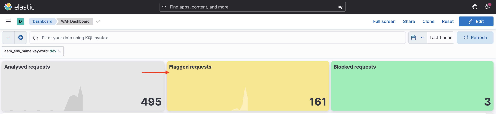
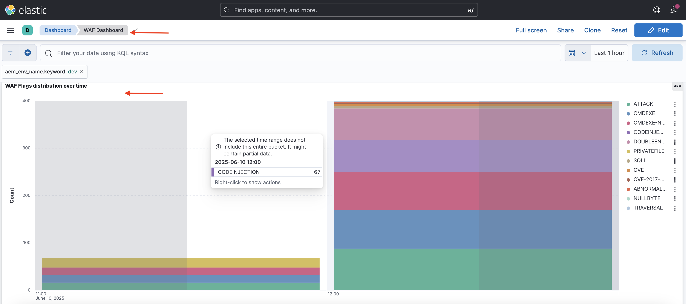

# 使用WAF規則保護AEM網站

瞭解如何在AEM中使用&#x200B;_Adobe建議的_ **Web應用程式防火牆(WAF)規則**，保護AEM as a Cloud Service網站免受複雜威脅，包括DoS、DDoS和機器人濫用。

複雜攻擊的特點是請求率高、模式複雜，並使用進階技術繞過傳統的安全措施。

>[!IMPORTANT]
>
> WAF流量篩選規則需要額外的&#x200B;**WAF-DDoS保護**&#x200B;或&#x200B;**增強式安全性**&#x200B;授權。 依預設，Sites和Forms客戶可使用標準流量篩選規則。

## 學習目標

- 檢閱Adobe建議的WAF規則。
- 定義、部署、測試及分析規則的結果。
- 瞭解何時以及如何根據結果調整規則。
- 瞭解如何使用AEM動作中心來檢閱規則產生的警報。

### 實施概述

實施步驟包括：

- 正在將WAF規則新增至AEM WKND專案的`/config/cdn.yaml`檔案。
- 認可變更並推送至Cloud Manager Git存放庫。
- 使用Cloud Manager設定管道將變更部署到AEM環境。
- 使用[Nikto](https://github.com/sullo/nikto/wiki)模擬DDoS攻擊來測試規則。
- 使用AEMCS CDN記錄檔和ELK儀表板工具來分析結果。

## 先決條件

繼續進行之前，請確定您已完成必要的設定，如[如何設定流量篩選器和WAF規則](../setup.md)教學課程中所述。 此外，您已複製[AEM WKND Sites專案](https://github.com/adobe/aem-guides-wknd)並將其部署至您的AEM環境。

## 檢閱和定義規則

Adobe建議的Web應用程式防火牆(WAF)規則對於保護AEM網站免受複雜威脅（包括DoS、DDoS和機器人濫用）至關重要。 複雜的攻擊通常以高請求率、複雜模式為特徵，並使用進階技術（通訊協定型或裝載型攻擊）來繞過傳統的安全措施。

讓我們檢閱三個建議的WAF規則，這些規則應該新增到AEM WKND專案的`cdn.yaml`檔案中：

### 1.封鎖來自已知惡意IP的攻擊

此規則&#x200B;**封鎖**&#x200B;看起來可疑的&#x200B;*和*&#x200B;請求，這些請求都來自標籤為惡意的IP位址。 由於這兩個條件都符合，我們相信誤判（封鎖合法流量）的風險非常低。 已知不良IP會根據威脅情報摘要和其他來源進行識別。

`ATTACK-FROM-BAD-IP` WAF旗標是用來識別這些要求。 它會彙總列在這裡[的數個WAF旗標](https://experienceleague.adobe.com/en/docs/experience-manager-cloud-service/content/security/traffic-filter-rules-including-waf#waf-flags-list)。

```yaml
kind: "CDN"
version: "1"
metadata:
  envTypes: ["dev", "stage", "prod"]
data:
  trafficFilters:
    rules:
    - name: attacks-from-bad-ips-globally
      when:
        reqProperty: tier
        in: ["author", "publish"]
      action:
        type: block
        wafFlags:
          - ATTACK-FROM-BAD-IP
```

### 2.全域記錄（及之後封鎖）來自任何IP的攻擊

此規則&#x200B;**會記錄**&#x200B;被識別為潛在攻擊的請求，即使威脅情報摘要中找不到IP位址亦然。

`ATTACK` WAF旗標是用來識別這些要求。 類似於`ATTACK-FROM-BAD-IP`，它   彙總數個WAF旗標。

這些請求可能是惡意的，但因為在威脅情報摘要中未識別IP位址，所以謹慎的做法是以`log`模式（而非封鎖模式）啟動。 分析記錄中是否有誤判，一旦驗證，**請確定將規則切換至`block`模式**。

```yaml
...
    - name: attacks-from-any-ips-globally
      when:
        reqProperty: tier
        in: ["author", "publish"]
      action:
        type: log
        alert: true
        wafFlags:
          - ATTACK
```

或者，若您的業務需求不允許惡意流量，您可以選擇立即使用`block`模式。

這些建議的WAF規則針對已知和新興的威脅提供額外一層安全性。


## 移轉至最新的Adobe建議WAF規則

在匯入`ATTACK-FROM-BAD-IP`和`ATTACK` WAF旗標（2025年7月）之前，建議的WAF規則如下。 其中包含特定WAF旗標的清單，以封鎖符合特定條件（例如`SANS`、`TORNODE`、`NOUA`等）的請求。

```yaml
...
data:
  trafficFilters:
    rules:
    ...
    # Enable WAF protections (only works if WAF is enabled for your environment)
      - name: block-waf-flags
        when:
          reqProperty: tier
          matches: "author|publish"
        action:
          type: block
          wafFlags:
            - SANS
            - TORNODE
            - NOUA
            - SCANNER
            - USERAGENT
            - PRIVATEFILE
            - ABNORMALPATH
            - TRAVERSAL
            - NULLBYTE
            - BACKDOOR
            - LOG4J-JNDI
            - SQLI
            - XSS
            - CODEINJECTION
            - CMDEXE
            - NO-CONTENT-TYPE
            - UTF8
...
```

上述規則仍然有效，但建議您移轉至使用`ATTACK-FROM-BAD-IP`和`ATTACK` WAF旗標&#x200B;_的新規則，前提是您尚未自訂`wafFlags`以符合您的業務需求_。

您可以依照下列步驟，移轉至新規則，以符合最佳實務：

- 檢閱`cdn.yaml`檔案中的現有WAF規則，其外觀可能類似於上述範例。 確認沒有針對您業務需求的自訂`wafFlags`。

- 以使用`ATTACK-FROM-BAD-IP`和`ATTACK`旗標的Adobe建議新WAF規則取代您現有的WAF規則。 請確定所有規則都處於區塊模式。

如果您先前已自訂`wafFlags`，您仍可移轉至這些新規則，但請謹慎操作，以確保所有自訂內容都會轉至修訂後的規則中。

移轉作業應可協助您簡化WAF規則，同時針對複雜威脅提供強大的保護功能。 新規則的設計更有效且更易於管理。


## 部署規則

若要部署上述規則，請遵循下列步驟：

- 提交變更並將其推送至 Cloud Manager Git 存放庫。

- 使用先前建立的AEM設定管道[將變更部署到Cloud Manager環境](../setup.md#deploy-rules-using-adobe-cloud-manager)。

  

## 測試規則

若要驗證WAF規則的有效性，請使用[Nikto](https://github.com/sullo/nikto)模擬攻擊，這是可偵測漏洞和錯誤設定的Web伺服器掃描器。 以下命令會觸發針對AEM WKND網站的SQL插入攻擊，此網站受WAF規則保護。

```shell
$./nikto.pl -useragent "AttackSimulationAgent (Demo/1.0)" -D V -Tuning 9 -ssl -h https://publish-pXXXX-eYYYY.adobeaemcloud.com/us/en.html
```


若要進一步了解關於攻擊模擬的資訊，請查看 [Nikto：掃描調整](https://github.com/sullo/nikto/wiki/Scan-Tuning)文件，了解如何指定要納入或排除的測試攻擊類型。

## 檢閱警報

觸發流量篩選器規則時會產生警報。 您可以在[AEM動作中心](https://experience.adobe.com/aem/actions-center)檢閱這些警示。


## 分析結果

若要分析流量篩選規則的結果，您可以使用AEMCS CDN記錄檔和ELK儀表板工具。 遵循[CDN記錄擷取](../setup.md#ingest-cdn-logs)安裝區段的指示，將CDN記錄擷取到ELK棧疊中。

在以下熒幕擷圖中，您可以看到AEM開發環境的CDN記錄檔已擷取至ELK棧疊中。


在ELK應用程式內，**WAF儀表板**應顯示
在使用者端IP (cli_ip)、主機、URL、動作(waf_action)和規則名稱(waf_match)欄中標幟的請求和對應值。



此外，「**WAF 標幟分佈**」和「**主要攻擊**」面板會顯示更多詳細資訊。




### Splunk整合

已將 [Splunk 記錄轉送啟用](https://experienceleague.adobe.com/zh-hant/docs/experience-manager-cloud-service/content/implementing/developing/logging#splunk-logs)的客戶可以建立新的儀表板來分析流量模式。

若要在 Splunk 中建立儀表板，請依照[用於 AEMCS CDN 記錄分析的 Splunk 儀表板](https://github.com/adobe/AEMCS-CDN-Log-Analysis-Tooling/blob/main/Splunk/README.md#splunk-dashboards-for-aemcs-cdn-log-analysis)步驟。

## 何時及如何精簡規則

您的目標是避免封鎖合法流量，同時仍可保護AEM網站免受複雜威脅的侵擾。 建議的WAF規則旨在作為您安全性策略的起點。

若要調整規則，請考量下列步驟：

- **監視流量模式**：使用CDN記錄檔和ELK儀表板來監視流量模式，並識別流量中的任何異常或尖峰。 請注意ELK儀表板中的&#x200B;_WAF旗標分佈_&#x200B;和&#x200B;_熱門攻擊_&#x200B;面板，以瞭解偵測到的攻擊型別。
- **調整wafFlags**：如果`ATTACK`旗標觸發太頻繁或
您必須微調攻擊向量，才能使用特定WAF標幟建立自訂規則。 請參閱檔案中的[WAF旗標](https://experienceleague.adobe.com/en/docs/experience-manager-cloud-service/content/security/traffic-filter-rules-including-waf#waf-flags-list)完整清單。 請考慮先在`log`模式中試用新的自訂規則。
- **移至封鎖規則**：一旦您驗證流量模式並調整WAF旗標，就可以考慮移至封鎖規則。

## 摘要

在本教學課程中，您已瞭解如何使用Adobe建議的網頁應用程式防火牆(WAF)規則來保護AEM網站免受複雜威脅，包括DoS、DDoS和機器人濫用。

## 使用案例 — 超出標準規則

如需更進階的案例，您可以探索下列使用案例，示範如何根據特定業務需求實作自訂流量篩選規則：

<!-- CARDS
{target = _self}

* ../how-to/request-logging.md

* ../how-to/request-blocking.md

* ../how-to/request-transformation.md
-->
<!-- START CARDS HTML - DO NOT MODIFY BY HAND -->
<div class="columns">
    <div class="column is-half-tablet is-half-desktop is-one-third-widescreen" aria-label="Monitoring sensitive requests">
        <div class="card" style="height: 100%; display: flex; flex-direction: column; height: 100%;">
            <div class="card-image">
                <figure class="image x-is-16by9">
                    <a href="../how-to/request-logging.md" title="監控敏感請求" target="_self" rel="referrer">
                        
                    </a>
                </figure>
            </div>
            <div class="card-content is-padded-small" style="display: flex; flex-direction: column; flex-grow: 1; justify-content: space-between;">
                <div class="top-card-content">
                    <p class="headline is-size-6 has-text-weight-bold">
                        <a href="../how-to/request-logging.md" target="_self" rel="referrer" title="監控敏感請求">正在監視敏感要求</a>
                    </p>
                    <p class="is-size-6">瞭解如何使用AEM as a Cloud Service中的流量篩選規則來記錄敏感請求，以監控這些請求。</p>
                </div>
                <a href="../how-to/request-logging.md" target="_self" rel="referrer" class="spectrum-Button spectrum-Button--outline spectrum-Button--primary spectrum-Button--sizeM" style="align-self: flex-start; margin-top: 1rem;">
                    <span class="spectrum-Button-label has-no-wrap has-text-weight-bold">了解更多</span>
                </a>
            </div>
        </div>
    </div>
    <div class="column is-half-tablet is-half-desktop is-one-third-widescreen" aria-label="Restricting access">
        <div class="card" style="height: 100%; display: flex; flex-direction: column; height: 100%;">
            <div class="card-image">
                <figure class="image x-is-16by9">
                    <a href="../how-to/request-blocking.md" title="限制存取" target="_self" rel="referrer">
                        
                    </a>
                </figure>
            </div>
            <div class="card-content is-padded-small" style="display: flex; flex-direction: column; flex-grow: 1; justify-content: space-between;">
                <div class="top-card-content">
                    <p class="headline is-size-6 has-text-weight-bold">
                        <a href="../how-to/request-blocking.md" target="_self" rel="referrer" title="限制存取">限制存取</a>
                    </p>
                    <p class="is-size-6">瞭解如何使用AEM as a Cloud Service中的流量篩選規則封鎖特定請求，以限制存取權。</p>
                </div>
                <a href="../how-to/request-blocking.md" target="_self" rel="referrer" class="spectrum-Button spectrum-Button--outline spectrum-Button--primary spectrum-Button--sizeM" style="align-self: flex-start; margin-top: 1rem;">
                    <span class="spectrum-Button-label has-no-wrap has-text-weight-bold">了解更多</span>
                </a>
            </div>
        </div>
    </div>
    <div class="column is-half-tablet is-half-desktop is-one-third-widescreen" aria-label="Normalizing requests">
        <div class="card" style="height: 100%; display: flex; flex-direction: column; height: 100%;">
            <div class="card-image">
                <figure class="image x-is-16by9">
                    <a href="../how-to/request-transformation.md" title="標準化請求" target="_self" rel="referrer">
                        
                    </a>
                </figure>
            </div>
            <div class="card-content is-padded-small" style="display: flex; flex-direction: column; flex-grow: 1; justify-content: space-between;">
                <div class="top-card-content">
                    <p class="headline is-size-6 has-text-weight-bold">
                        <a href="../how-to/request-transformation.md" target="_self" rel="referrer" title="標準化請求">標準化請求</a>
                    </p>
                    <p class="is-size-6">瞭解如何使用AEM as a Cloud Service中的流量篩選規則轉換請求，以標準化請求。</p>
                </div>
                <a href="../how-to/request-transformation.md" target="_self" rel="referrer" class="spectrum-Button spectrum-Button--outline spectrum-Button--primary spectrum-Button--sizeM" style="align-self: flex-start; margin-top: 1rem;">
                    <span class="spectrum-Button-label has-no-wrap has-text-weight-bold">了解更多</span>
                </a>
            </div>
        </div>
    </div>
</div>
<!-- END CARDS HTML - DO NOT MODIFY BY HAND -->

## 其他資源

- [建議的入門者規則](https://experienceleague.adobe.com/en/docs/experience-manager-cloud-service/content/security/traffic-filter-rules-including-waf#recommended-nonwaf-starter-rules)
- [WAF旗標清單](https://experienceleague.adobe.com/en/docs/experience-manager-cloud-service/content/security/traffic-filter-rules-including-waf#waf-flags-list)
