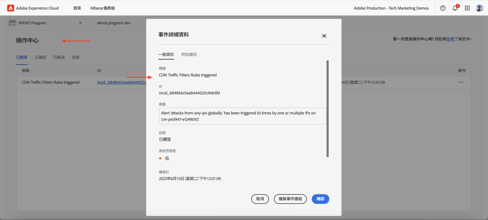

# 使用 WAF 規則保護 AEM 網站

了解如何使用 _Adobe 建議的_ **Web 應用程式防火牆 (WAF) 規則**，在 AEM as a Cloud Service 中保護網站不受包括 DoS、DDoS 及機器人濫用攻擊等在內的複雜威脅。

複雜攻擊的特徵包括高頻率的要求、複雜的模式，以及使用進階技術繞過傳統的安全性防護措施。

>[!IMPORTANT]
>
> WAF流量篩選規則需要額外的延伸安全性(先前稱為WAF-DdS Protection)或醫療保健延伸安全性（先前稱為Enhanced Security）授權。 在預設情況下，標準流量篩選器規則可供 Sites 和 Forms 客戶使用。


>[!VIDEO](https://video.tv.adobe.com/v/3469397/?quality=12&learn=on)

## 學習目標

- 審閱 Adobe 建議的 WAF 規則。
- 定義、部署、測試並分析規則的結果。
- 了解根據結果調整規則的時機和方式。
- 了解如何使用 AEM 行動中心審閱規則所產生的警示。

### 實作概觀

實作步驟包括：

- 將 WAF 規則新增至 AEM WKND 專案的 `/config/cdn.yaml` 檔案。
- 提交變更並將其推送至 Cloud Manager Git 存放庫。
- 使用 Cloud Manager 的設定管道將變更部署至 AEM 環境。
- 透過使用 [Nikto](https://github.com/sullo/nikto/wiki) 模擬 DDoS 攻擊來測試規則。
- 使用 AEMCS CDN 記錄和 ELK 儀表板工具分析結果。

## 先決條件

繼續進行之前，請確保您已完成[如何設定流量篩選器和 WAF 規則](../setup.md)教學課程中所述的必要設定。此外，您已複製 [AEM WKND 網站專案](https://github.com/adobe/aem-guides-wknd)並將其部署至您的 AEM 環境。

## 審閱和定義規則

Adobe 建議的 Web 應用程式防火牆 (WAF) 規則對於保護 AEM 網站不受複雜威脅 (包括 DoS、DDoS 和機器人濫用) 非常重要。複雜的攻擊通常具有要求頻率高、模式複雜，以及使用先進技術 (以通訊協定或以承載為基礎的攻擊) 來繞過傳統安全措施的特性。

讓我們一起審閱三項建議加入 AEM WKND 專案中 `cdn.yaml` 檔案的 WAF 規則：

### &#x200B;1. 封鎖已知的惡意 IP

此規則會&#x200B;**封鎖**&#x200B;那些看起來既可疑&#x200B;*又*&#x200B;來自標幟為惡意 IP 位址的要求。由於皆已符合這兩項條件，我們可以確信誤判 (封鎖合法流量) 的風險非常低。已知的惡意 IP 是根據威脅情報摘要和其他來源所識別的。

此 `ATTACK-FROM-BAD-IP` WAF 標幟用於識別這些要求。其彙總[條列於此處](https://experienceleague.adobe.com/zh-hant/docs/experience-manager-cloud-service/content/security/traffic-filter-rules-including-waf#waf-flags-list)的幾個 WAF 標幟。

```yaml
kind: "CDN"
version: "1"
metadata:
  envTypes: ["dev", "stage", "prod"]
data:
  trafficFilters:
    rules:
    - name: attacks-from-bad-ips-globally
      when:
        reqProperty: tier
        in: ["author", "publish"]
      action:
        type: block
        wafFlags:
          - ATTACK-FROM-BAD-IP
```

### &#x200B;2. 記錄 (並隨後封鎖) 來自全球任何 IP 的攻擊

即使在威脅情報摘要中找不到該 IP 位址，此規則會&#x200B;**記錄**&#x200B;識別為潛在攻擊的要求。

此 `ATTACK` WAF 標幟用於識別這些要求。與 `ATTACK-FROM-BAD-IP` 類似，其彙總多個 WAF 標幟。

這些要求可能是惡意的，但由於未在威脅情報摘要中識別該 IP 位址，因此較為謹慎的做法是先以 `log` 模式啟用，而非直接封鎖。分析記錄以找出誤判，一旦驗證完成，**請務必將規則切換至 `block` 模式**。

```yaml
...
    - name: attacks-from-any-ips-globally
      when:
        reqProperty: tier
        in: ["author", "publish"]
      action:
        type: log
        alert: true
        wafFlags:
          - ATTACK
```

或者，如果您的業務需求不容許任何惡意流量的風險，也可以選擇立即使用 `block` 模式。

這些建議的 WAF 規則對抵禦已知和新興的威脅提供額外的安全保障。


## 移轉至最新的 Adobe 建議 WAF 規則

在 2025 年 7 月引入 `ATTACK-FROM-BAD-IP` 和 `ATTACK` WAF 標幟之前，建議使用的 WAF 規則如下。其中包含一份特定 WAF 標幟的清單，用於封鎖符合特定條件的要求，例如 `SANS`、 `TORNODE`、 `NOUA` 等。

```yaml
...
data:
  trafficFilters:
    rules:
    ...
    # Enable WAF protections (only works if WAF is enabled for your environment)
      - name: block-waf-flags
        when:
          reqProperty: tier
          matches: "author|publish"
        action:
          type: block
          wafFlags:
            - SANS
            - TORNODE
            - NOUA
            - SCANNER
            - USERAGENT
            - PRIVATEFILE
            - ABNORMALPATH
            - TRAVERSAL
            - NULLBYTE
            - BACKDOOR
            - LOG4J-JNDI
            - SQLI
            - XSS
            - CODEINJECTION
            - CMDEXE
            - NO-CONTENT-TYPE
            - UTF8
...
```

上述規則仍然有效，但建議移轉至使用 `ATTACK-FROM-BAD-IP` 和 `ATTACK` WAF 標誌&#x200B;_的新規則，前提是您尚未自訂 `wafFlags` 以滿足您的業務需求_。

您可以依照以下步驟移轉至新規則，以符合最佳實務：

- 審閱 `cdn.yaml` 檔案中原有的 WAF 規則，其中可能與上面的範例類似。確認 `wafFlags` 未依照您的業務需求進行任何自訂。

- 以使用 `ATTACK-FROM-BAD-IP` 和 `ATTACK` 標幟的最新 Adobe 建議 WAF 規則取代您現有的 WAF 規則確保所有規則都處於封鎖模式。

如果您之前已自訂 `wafFlags`，則仍可以移轉至這些新規則，但請謹慎操作，以確保所有自訂內容均已納入修訂後的規則。

移轉應該有助於簡化 WAF 規則，同時仍能提供對複雜威脅的強大保護。新規則的設計更具成效，且更易於管理。


## 部署規則

若要部署上述規則，請依照以下步驟進行：

- 提交變更並將其推送至 Cloud Manager Git 存放庫。

- 使用[先前建立的](../setup.md#deploy-rules-using-adobe-cloud-manager) Cloud Manager 設定管道，將變更部署至 AEM 環境。

  

## 測試規則

若要驗證 WAF 規則的有效性，請使用 [Nikto](https://github.com/sullo/nikto) 模擬攻擊，此款網頁伺服器掃描工具可以偵測漏洞與錯誤設定。以下指令會針對 WAF 規則所保護的 AEM WKND 網站觸發 SQL 注入攻擊。

```shell
$./nikto.pl -useragent "AttackSimulationAgent (Demo/1.0)" -D V -Tuning 9 -ssl -h https://publish-pXXXX-eYYYY.adobeaemcloud.com/us/en.html
```


若要進一步了解關於攻擊模擬的資訊，請查看 [Nikto：掃描調整](https://github.com/sullo/nikto/wiki/Scan-Tuning)文件，了解如何指定要納入或排除的測試攻擊類型。

## 審閱警報

在觸發流量篩選器規則時會產生警報。您可以在 [AEM 行動中心](https://experience.adobe.com/aem/actions-center)審閱這些警報。



## 分析結果

您可以使用 AEMCS CDN 記錄和 ELK 儀表板工具分析流量篩選器規則的結果。依照 [CDN 記錄攝取](../setup.md#ingest-cdn-logs)設定部分的指示，將 CDN 記錄攝取至 ELK 堆疊。

您可以在下方的螢幕截圖中，看到 AEM Dev 環境的 CDN 記錄已攝取至 ELK 堆疊。


在 ELK 應用程式內部，**WAF 儀表板**&#x200B;應該要顯示已標記的要求，以及其用戶端 IP (cli_ip)、主機、URL、動作 (waf_action) 和規則名稱 (waf_match) 欄中的對應值。


此外，「**WAF 標幟分佈**」和「**主要攻擊**」面板會顯示更多詳細資訊。


### Splunk 整合

已將 [Splunk 記錄轉送啟用](https://experienceleague.adobe.com/zh-hant/docs/experience-manager-cloud-service/content/implementing/developing/logging#splunk-logs)的客戶可以建立新的儀表板來分析流量模式。

若要在 Splunk 中建立儀表板，請依照[用於 AEMCS CDN 記錄分析的 Splunk 儀表板](https://github.com/adobe/AEMCS-CDN-Log-Analysis-Tooling/blob/main/Splunk/README.md#splunk-dashboards-for-aemcs-cdn-log-analysis)步驟。

## 調整改善規則的時機和方式

您的目標是避免封鎖合法流量，同時保護您的 AEM 網站不受複雜的威脅。建議的 WAF 規則旨在做為您的安全性策略起點。

請考量以下步驟以調整改善規則：

- **監視流量模式**：使用 CDN 記錄和 ELK 儀表板監視流量模式並識別流量的任何異常或尖峰。請留意 ELK 儀表板中的 _WAF 標幟分佈_&#x200B;和&#x200B;_熱門攻擊_&#x200B;面板，以了解目前偵測到的攻擊類型。
- **調整 wafFlags**：如果 `ATTACK` 標幟觸發過於頻繁或
需要微細調整攻擊向量，則可以使用特定的 WAF 標幟建立自訂規則。請參閱文件中 [WAF 標幟](https://experienceleague.adobe.com/zh-hant/docs/experience-manager-cloud-service/content/security/traffic-filter-rules-including-waf#waf-flags-list)的完整清單。考慮先在 `log` 模式下試用新的自訂規則。
- **移動至封鎖規則**：在驗證流量模式並調整 WAF 標幟後，可以考慮移動至封鎖規則。

## 摘要

您在本教學課程中，了解如何使用 Adobe 建議的 Web 應用程式防火牆 (WAF) 規則，以保護 AEM 網站不受包括 DoS、DDoS 和機器人濫用等複雜威脅的侵害。

## 使用案例－超越標準規則

針對較進階的案例，您可以參考以下使用案例，了解如何根據特定業務需求實作自訂的流量篩選器規則。

<!-- CARDS
{target = _self}

* ../how-to/request-logging.md

* ../how-to/request-blocking.md

* ../how-to/request-transformation.md
-->
<!-- START CARDS HTML - DO NOT MODIFY BY HAND -->
<div class="columns">
    <div class="column is-half-tablet is-half-desktop is-one-third-widescreen" aria-label="Monitoring sensitive requests">
        <div class="card" style="height: 100%; display: flex; flex-direction: column; height: 100%;">
            <div class="card-image">
                <figure class="image x-is-16by9">
                    <a href="../how-to/request-logging.md" title="監視敏感性要求" target="_self" rel="referrer">
                        
                    </a>
                </figure>
            </div>
            <div class="card-content is-padded-small" style="display: flex; flex-direction: column; flex-grow: 1; justify-content: space-between;">
                <div class="top-card-content">
                    <p class="headline is-size-6 has-text-weight-bold">
                        <a href="../how-to/request-logging.md" target="_self" rel="referrer" title="監視敏感性要求">監視敏感性要求</a>
                    </p>
                    <p class="is-size-6">了解如何透過使用 AEM as a Cloud Service 中的流量篩選器規則記錄敏感性要求以進行監視。</p>
                </div>
                <a href="../how-to/request-logging.md" target="_self" rel="referrer" class="spectrum-Button spectrum-Button--outline spectrum-Button--primary spectrum-Button--sizeM" style="align-self: flex-start; margin-top: 1rem;">
                    <span class="spectrum-Button-label has-no-wrap has-text-weight-bold">了解更多</span>
                </a>
            </div>
        </div>
    </div>
    <div class="column is-half-tablet is-half-desktop is-one-third-widescreen" aria-label="Restricting access">
        <div class="card" style="height: 100%; display: flex; flex-direction: column; height: 100%;">
            <div class="card-image">
                <figure class="image x-is-16by9">
                    <a href="../how-to/request-blocking.md" title="限制存取權" target="_self" rel="referrer">
                        
                    </a>
                </figure>
            </div>
            <div class="card-content is-padded-small" style="display: flex; flex-direction: column; flex-grow: 1; justify-content: space-between;">
                <div class="top-card-content">
                    <p class="headline is-size-6 has-text-weight-bold">
                        <a href="../how-to/request-blocking.md" target="_self" rel="referrer" title="限制存取權">限制存取權</a>
                    </p>
                    <p class="is-size-6">了解如何使用 AEM as a Cloud Service 中的流量篩選器規則封鎖特定要求以限制存取。</p>
                </div>
                <a href="../how-to/request-blocking.md" target="_self" rel="referrer" class="spectrum-Button spectrum-Button--outline spectrum-Button--primary spectrum-Button--sizeM" style="align-self: flex-start; margin-top: 1rem;">
                    <span class="spectrum-Button-label has-no-wrap has-text-weight-bold">了解更多</span>
                </a>
            </div>
        </div>
    </div>
    <div class="column is-half-tablet is-half-desktop is-one-third-widescreen" aria-label="Normalizing requests">
        <div class="card" style="height: 100%; display: flex; flex-direction: column; height: 100%;">
            <div class="card-image">
                <figure class="image x-is-16by9">
                    <a href="../how-to/request-transformation.md" title="標準化要求" target="_self" rel="referrer">
                        
                    </a>
                </figure>
            </div>
            <div class="card-content is-padded-small" style="display: flex; flex-direction: column; flex-grow: 1; justify-content: space-between;">
                <div class="top-card-content">
                    <p class="headline is-size-6 has-text-weight-bold">
                        <a href="../how-to/request-transformation.md" target="_self" rel="referrer" title="標準化要求">標準化要求</a>
                    </p>
                    <p class="is-size-6">了解如何在 AEM as a Cloud Service 中，透過流量篩選器規則轉換要求以進行標準化處理。</p>
                </div>
                <a href="../how-to/request-transformation.md" target="_self" rel="referrer" class="spectrum-Button spectrum-Button--outline spectrum-Button--primary spectrum-Button--sizeM" style="align-self: flex-start; margin-top: 1rem;">
                    <span class="spectrum-Button-label has-no-wrap has-text-weight-bold">了解更多</span>
                </a>
            </div>
        </div>
    </div>
</div>
<!-- END CARDS HTML - DO NOT MODIFY BY HAND -->

## 其他資源

- [推薦的入門規則](https://experienceleague.adobe.com/zh-hant/docs/experience-manager-cloud-service/content/security/traffic-filter-rules-including-waf#recommended-nonwaf-starter-rules)
- [WAF 標幟清單](https://experienceleague.adobe.com/zh-hant/docs/experience-manager-cloud-service/content/security/traffic-filter-rules-including-waf#waf-flags-list)
