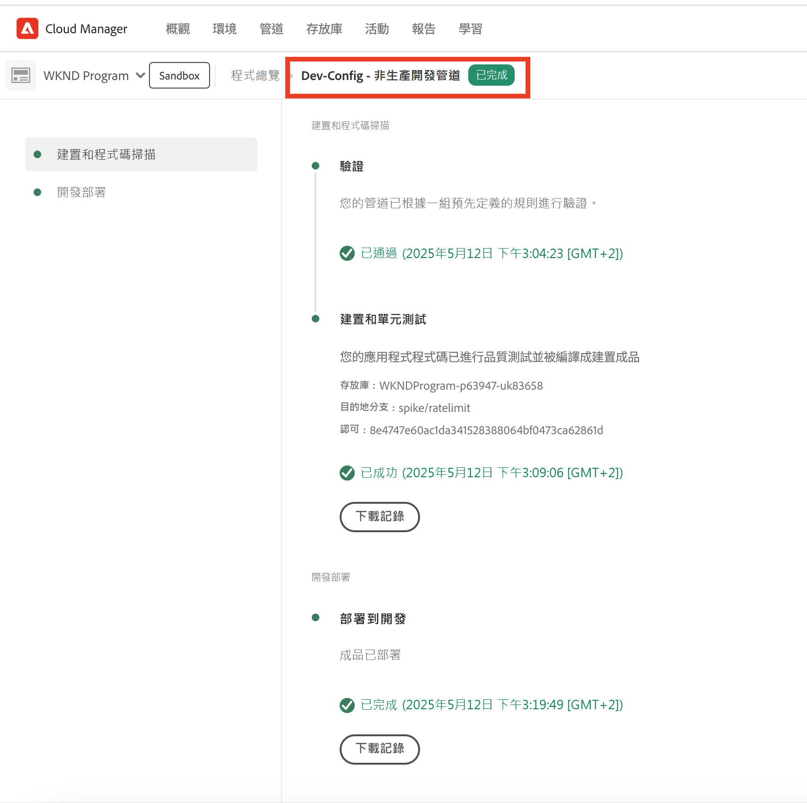
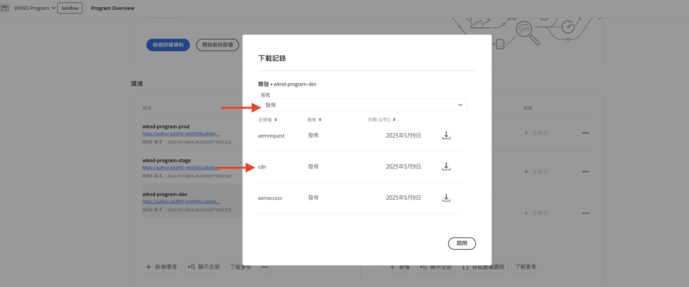

# 流量篩選器規則（包括WAF規則）的範例和結果分析

瞭解如何宣告各種型別的流量篩選規則，並使用Adobe Experience Manager as a Cloud Service (AEMCS) CDN記錄和儀表板工具來分析結果。

在本節中，您將探索流量篩選規則的實用範例，包括WAF規則。 您將瞭解如何使用，根據URI （或路徑）、IP位址、請求數量和不同的攻擊型別，記錄、允許和封鎖請求。 [AEM WKND網站專案](https://github.com/adobe/aem-guides-wknd#aem-wknd-sites-project).

此外，您將瞭解如何使用儀表板工具來擷取AEMCS CDN記錄，並透過Adobe提供的範例儀表板將基本量度視覺化。

為符合您的特定需求，您可以增強和建立自訂儀表板，進而獲得更深入的見解，並最佳化AEM網站的規則設定。

>[!VIDEO](https://video.tv.adobe.com/v/3425404?quality=12&learn=on)

## 範例

讓我們探索各種流量篩選規則的範例，包括WAF規則。 請確定您已完成之前的必要設定程式 [如何設定](./how-to-setup.md) 章節，而且您已複製 [AEM WKND網站專案](https://github.com/adobe/aem-guides-wknd#aem-wknd-sites-project).

### 記錄請求

開始於 **記錄WKND登入和登出路徑的請求** 針對AEM Publish服務。

- 將以下規則新增到WKND專案的 `/config/cdn.yaml` 檔案。

```yaml
kind: CDN
version: '1'
metadata:
  envTypes:
    - dev
    - stage
    - prod
data:
  trafficFilters:
    rules:
    # On AEM Publish service log WKND Login and Logout requests
      - name: publish-auth-requests
        when:
          allOf:
            - reqProperty: tier
              matches: publish
            - reqProperty: path
              in:
                - /system/sling/login/j_security_check
                - /system/sling/logout
        action: log
```

- 提交變更並將其推送到Cloud Manager Git存放庫。

- 使用Cloud Manager將變更部署到AEM開發環境 `Dev-Config` 設定管道 [建立時間較早](how-to-setup.md#deploy-rules-through-cloud-manager).

  

- 在Publish服務上登入並登出您程式的WKND網站以測試規則(例如， `https://publish-pXXXX-eYYYY.adobeaemcloud.com/us/en.html`)。 您可以使用 `asmith/asmith` 作為使用者名稱和密碼。

  

#### 分析{#analyzing}

讓我們來分析以下各項的結果： `publish-auth-requests` 從Cloud Manager下載AEMCS CDN記錄並使用 [儀表板工具](how-to-setup.md#analyze-results-using-elk-dashboard-tool)，即您在上一章中設定的專案。

- 從 [Cloud Manager](https://my.cloudmanager.adobe.com/)的 **環境** 卡片，下載AEMCS **發佈** 服務的CDN記錄檔。

  

  >[!TIP]
  >
  >    新請求可能需要5分鐘的時間才會出現在CDN記錄檔中。

- 複製下載的記錄檔(例如， `publish_cdn_2023-10-24.log` （如下面的熒幕擷圖所示），放入 `logs/dev` 彈性圖示板工具專案的資料夾。

  {width="800" zoomable="yes"}

- 重新整理「彈性儀表板」工具頁面。
   - 在頂端 **全域篩選器** 區段，編輯 `aem_env_name.keyword` 篩選並選取 `dev` 環境值。

     

   - 若要變更時間間隔，請按一下右上角的日曆圖示，然後選取想要的時間間隔。

     

- 檢閱已更新的儀表板的  **分析的請求**， **已標幟的請求**、和 **已標幟的請求詳細資料** 面板。 為了比對CDN記錄專案，它應該顯示每個專案的使用者端IP (cli_ip)、主機、url、動作(waf_action)和規則名稱(waf_match)的值。

  


### 封鎖要求

在此範例中，讓我們在 _內部_ 路徑下的資料夾 `/content/wknd/internal` 在已部署的WKND專案中。 接著宣告流量篩選規則，此規則 **封鎖流量** 從符合您組織的指定IP位址以外的任何地方的子頁面（例如，公司VPN）。

您可以建立自己的內部頁面(例如， `demo-page.html`)或使用 [附加封裝](./assets/demo-internal-pages-package.zip).

- 在WKND專案的 `/config/cdn.yaml` 檔案：

```yaml
kind: CDN
version: '1'
metadata:
  envTypes:
    - dev
    - stage
    - prod
data:
  trafficFilters:
    rules:
    ...

    # Block requests to (demo) internal only page/s from public IP address but allow from internal IP address.
    # Make sure to replace the IP address with your own IP address.
      - name: block-internal-paths
        when:
          allOf:
            - reqProperty: path
              matches: /content/wknd/internal
            - reqProperty: clientIp
              notIn: [192.150.10.0/24]
        action: block
```

- 提交變更並將其推送到Cloud Manager Git存放庫。

- 使用將變更部署至AEM開發環境 [先前建立](how-to-setup.md#deploy-rules-through-cloud-manager) `Dev-Config` Cloud Manager中的設定管道。

- 存取WKND網站的內部頁面以測試規則，例如 `https://publish-pXXXX-eYYYY.adobeaemcloud.com/content/wknd/internal/demo-page.html` 或使用下列CURL指令：

  ```bash
  $ curl -I https://publish-pXXXX-eYYYY.adobeaemcloud.com/content/wknd/internal/demo-page.html
  ```

- 從規則中使用的IP位址重複上述步驟，然後使用不同的IP位址（例如使用行動電話）。

#### 分析

若要分析的結果 `block-internal-paths` 規則，請遵循中所述的相同步驟 [較舊的範例](#analyzing).

不過，這次您應該會看到 **封鎖的要求** 以及使用者端IP (cli_ip)、主機、URL、動作(waf_action)和規則名稱(waf_match)欄中的對應值。


### 防止DoS攻擊

讓我們 **防止DoS攻擊** 封鎖來自IP位址的請求，每秒產生100個請求，導致其被封鎖5分鐘。

- 新增下列專案 [速率限制流量篩選器規則](https://experienceleague.adobe.com/docs/experience-manager-cloud-service/content/security/traffic-filter-rules-including-waf.html#ratelimit-structure) 在WKND專案的 `/config/cdn.yaml` 檔案。

```yaml
kind: CDN
version: '1'
metadata:
  envTypes:
    - dev
    - stage
    - prod
data:
  trafficFilters:
    rules:
    ...
    #  Prevent DoS attacks by blocking client for 5 minutes if they make more than 100 requests in 1 second.
      - name: prevent-dos-attacks
        when:
          reqProperty: path
          like: '*'
        rateLimit:
          limit: 100
          window: 1
          penalty: 300
          groupBy:
            - reqProperty: clientIp
        action: block
```

>[!WARNING]
>
>針對您的生產環境，請與您的Web安全團隊共同作業，以決定適當的值 `rateLimit`，

- 如中所述，提交、推送和部署變更 [先前的範例](#logging-requests).

- 若要模擬DoS攻擊，請使用下列方法 [韋蓋塔](https://github.com/tsenart/vegeta) 命令。

  ```shell
  $ echo "GET https://publish-pXXXX-eYYYY.adobeaemcloud.com/us/en.html" | vegeta attack -rate=120 -duration=5s | vegeta report
  ```

  此命令會在5秒內發出120個請求並輸出報表。 如您所見，成功率為32.5%；其餘部分會收到406 HTTP回應代碼，表示流量遭封鎖。

  

#### 分析

若要分析的結果 `prevent-dos-attacks` 規則，請遵循中所述的相同步驟 [較舊的範例](#analyzing).

這次您應該會看到 **封鎖的要求** 以及使用者端IP (cli_ip)、主機、url、動作(waf_action)和規則名稱(waf_match)欄中的對應值。


此外， **依使用者端IP、國家/地區和使用者代理程式區分的前100大攻擊** 面板會顯示其他詳細資訊，可用來進一步最佳化規則設定。


### WAF規則

目前為止的流量篩選器規則範例可供所有Sites和Forms客戶設定。

接下來，讓我們針對已購買增強式安全性或WAF-DDoS保護授權的客戶，探索其使用體驗，該授權可讓他們設定進階規則，以保護網站免受更複雜的攻擊。

在繼續之前，請按照流量篩選規則檔案中的說明，為您的程式啟用WAF-DDoS保護 [設定步驟](https://experienceleague.adobe.com/docs/experience-manager-cloud-service/content/security/traffic-filter-rules-including-waf.html?lang=en#setup).

#### 不含WAFFlags

讓我們先看看在WAF規則宣告之前的體驗。 當您的程式啟用WAF-DDoS時，您的CDN會依預設記錄任何相符的惡意流量，因此您擁有正確的資訊以提出適當的規則。

讓我們從攻擊WKND網站開始，但不新增WAF規則(或使用 `wafFlags` 屬性)並分析結果。

- 若要模擬攻擊，請使用 [Nikto](https://github.com/sullo/nikto) 以下命令，會在6分鐘內傳送約700個惡意請求。

  ```shell
  $ ./nikto.pl -useragent "AttackSimulationAgent (Demo/1.0)" -D V -Tuning 9 -ssl -h https://publish-pXXXX-eYYYY.adobeaemcloud.com/us/en.html
  ```

  

  若要瞭解攻擊模擬，請檢閱 [Nikto — 掃描調整](https://github.com/sullo/nikto/wiki/Scan-Tuning) 檔案，說明如何指定要包含或排除的測試攻擊型別。

##### 分析

若要分析攻擊模擬的結果，請遵循以下說明的相同步驟： [較舊的範例](#analyzing).

不過，這次您應該會看到 **已標幟的請求** 以及使用者端IP (cli_ip)、主機、url、動作(waf_action)和規則名稱(waf_match)欄中的對應值。 此資訊可讓您分析結果並最佳化規則設定。


請注意 **WAF旗標分佈** 和 **熱門攻擊** 面板會顯示其他詳細資訊，可用來進一步最佳化規則設定。


#### 具有WAFFlags

現在，讓我們新增包含的WAF規則 `wafFlags` 屬性當做的一部分 `action` 屬性和 **封鎖模擬的攻擊要求**.

從語法的角度來看，WAF規則與先前所見相似，但是， `action` 屬性參考一或多個 `wafFlags` 值。 若要進一步瞭解 `wafFlags`，檢閱 [WAF旗標清單](https://experienceleague.adobe.com/docs/experience-manager-cloud-service/content/security/traffic-filter-rules-including-waf.html#waf-flags-list) 區段。

- 在WKND專案的 `/config/cdn.yaml` 檔案。 請注意 `block-waf-flags` 規則包含當受到模擬惡意流量攻擊時，控制面板工具中出現的部分wafFlags。 事實上，隨著威脅的演變，長期分析記錄以判斷要宣告哪些新規則是很好的做法。

```yaml
kind: CDN
version: '1'
metadata:
  envTypes:
    - dev
    - stage
    - prod
data:
  trafficFilters:
    rules:
    ...
    # Enable WAF protections (only works if WAF is enabled for your environment)
      - name: block-waf-flags
        when:
          reqProperty: tier
          matches: "author|publish"
        action:
          type: block
          wafFlags:
            - SANS
            - TORNODE
            - NOUA
            - SCANNER
            - USERAGENT
            - PRIVATEFILE
            - ABNORMALPATH
            - TRAVERSAL
            - NULLBYTE
            - BACKDOOR
            - LOG4J-JNDI
            - SQLI
            - XSS
            - CODEINJECTION
            - CMDEXE
            - NO-CONTENT-TYPE
            - UTF8
```

- 如中所述，提交、推送和部署變更 [先前的範例](#logging-requests).

- 若要模擬攻擊，請使用相同的 [Nikto](https://github.com/sullo/nikto) 命令之前一樣。

  ```shell
  $ ./nikto.pl -useragent "AttackSimulationAgent (Demo/1.0)" -D V -Tuning 9 -ssl -h https://publish-pXXXX-eYYYY.adobeaemcloud.com/us/en.html
  ```

##### 分析

重複中所述的相同步驟 [較舊的範例](#analyzing).

此時，您應該會看到底下的專案 **封鎖的要求** 以及使用者端IP (cli_ip)、主機、url、動作(waf_action)和規則名稱(waf_match)欄中的對應值。


此外， **WAF旗標分佈** 和 **熱門攻擊** 面板會顯示其他詳細資料。


### 全面分析

在上方 _分析_ 您已經瞭解如何使用儀表板工具來分析特定規則的結果。 您可以進一步探索使用其他控制面板面板的分析結果，包括：


- 已分析、已標幟和已封鎖的要求
- WAF標示一段時間內的分佈
- 一段時間內觸發的流量篩選規則
- 依WAF旗標ID排名最前的攻擊
- 排名在前的觸發流量篩選器
- 依使用者端IP、國家/地區和使用者代理程式區分的前100名攻擊者


## 下一步

熟悉建議事項 [最佳實務](./best-practices.md) 降低安全性違規的風險。

## 其他資源

[流量篩選器規則語法](https://experienceleague.adobe.com/docs/experience-manager-cloud-service/content/security/traffic-filter-rules-including-waf.html#rules-syntax)

[CDN記錄格式](https://experienceleague.adobe.com/docs/experience-manager-cloud-service/content/security/traffic-filter-rules-including-waf.html#cdn-log-format)
