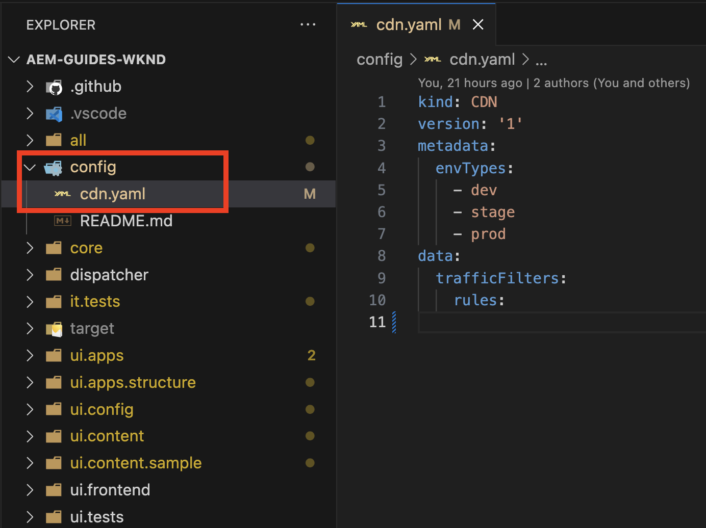
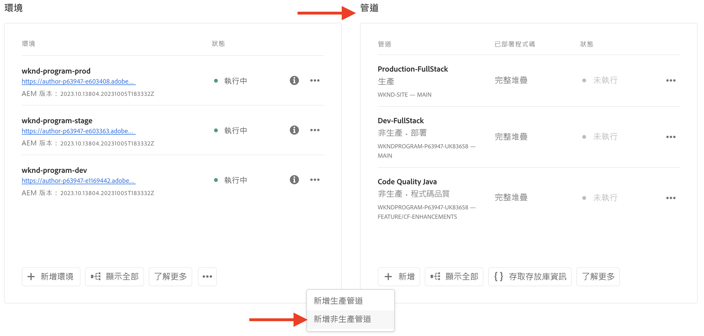
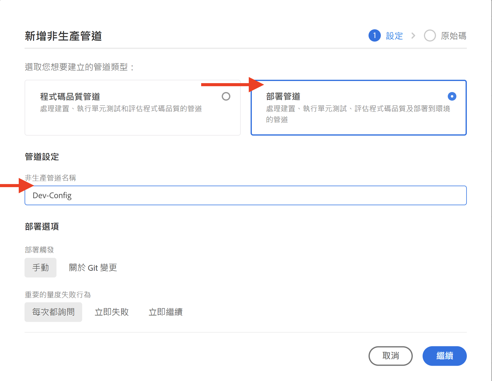
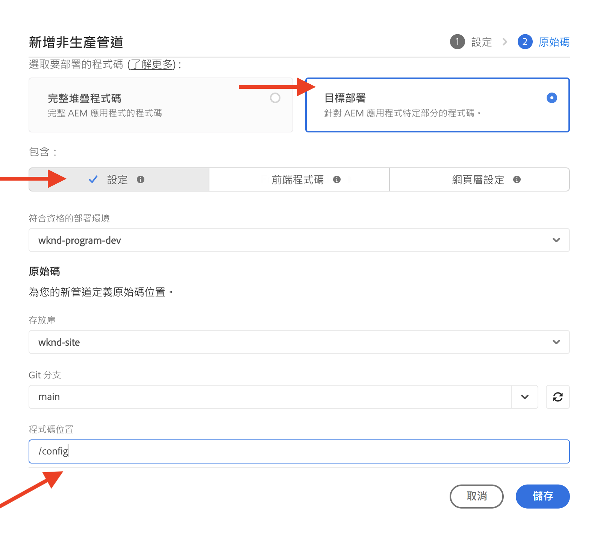

# 如何設定流量篩選器規則，包括WAF規則

瞭解&#x200B;**如何設定**&#x200B;流量篩選規則，包括WAF規則。 閱讀建立、部署、測試和分析結果的相關資訊。

>[!VIDEO](https://video.tv.adobe.com/v/3425407?quality=12&learn=on)

## 設定

設定程式涉及下列專案：

- _使用適當的AEM專案結構和組態檔建立規則_。
- 使用Adobe Cloud Manager的設定管道&#x200B;_部署規則_。
- _使用各種工具來測試規則_&#x200B;以產生流量。
- _使用AEMCS CDN記錄檔和儀表板工具分析結果_。

### 在您的AEM專案中建立規則

若要建立規則，請遵循下列步驟：

1. 在您的AEM專案的最上層，建立資料夾`config`。

1. 在`config`資料夾中，建立名為`cdn.yaml`的新檔案。

1. 將下列中繼資料新增至`cdn.yaml`檔案：

```yaml
kind: CDN
version: '1'
metadata:
  envTypes:
    - dev
    - stage
    - prod
data:
  trafficFilters:
    rules:
```

檢視AEM Guides WKND Sites專案中`cdn.yaml`檔案的範例：

{width="800" zoomable="yes"}

### 透過Cloud Manager部署規則 {#deploy-rules-through-cloud-manager}

若要部署規則，請遵循下列步驟：

1. 在 [my.cloudmanager.adobe.com](https://my.cloudmanager.adobe.com/) 登入 Cloud Manager，並選取適當的組織和方案。

1. 從&#x200B;_方案總覽_&#x200B;頁面瀏覽至&#x200B;_管道_&#x200B;卡片，然後按一下&#x200B;**+新增**&#x200B;按鈕並選取所需的管道型別。

   

   在上述範例中，為了示範目的，已選取&#x200B;_新增非生產管道_，因為使用的是開發環境。

1. 在&#x200B;_新增非生產管道_&#x200B;對話方塊中，選擇並輸入下列詳細資料：

   1. 設定步驟：

      - **型別**：部署管道
      - **管道名稱**： Dev-Config

      

   2. Source程式碼步驟：

      - **要部署的程式碼**：目標部署
      - **包含**：設定
      - **部署環境**：您的環境名稱，例如wknd-program-dev。
      - **存放庫**：管道應從中擷取程式碼的Git存放庫；例如`wknd-site`
      - **Git分支**： Git存放庫分支的名稱。
      - **程式碼位置**： `/config`，對應至上一步驟中建立的頂層設定資料夾。

      

### 透過產生流量來測試規則

若要測試規則，有多種可用的協力廠商工具，而且您的組織可能有偏好的工具。 出於示範目的，讓我們使用下列工具：

- [Curl](https://curl.se/)進行基本測試，例如叫用URL及檢查回應代碼。

- [Vegeta](https://github.com/tsenart/vegeta)執行拒絕服務(DOS)。 遵循[Vegeta GitHub](https://github.com/tsenart/vegeta#install)的安裝指示。

- [Nikto](https://github.com/sullo/nikto/wiki)尋找潛在的問題和安全性漏洞，例如XSS、SQL插入等。 遵循[Nikto GitHub](https://github.com/sullo/nikto)的安裝指示。

- 執行下列命令，確認終端機已安裝並可以使用這些工具：

  ```shell
  # Curl version check
  $ curl --version
  
  # Vegeta version check
  $ vegeta -version
  
  # Nikto version check
  $ cd <PATH-OF-CLONED-REPO>/program
  ./nikto.pl -Version
  ```

### 使用儀表板工具分析結果

建立、部署和測試規則之後，您可以使用&#x200B;**CDN**&#x200B;記錄檔和&#x200B;**AEMCS-CDN-Log-Analysis-Tooling**&#x200B;來分析結果。 工具提供一組控制面板，可將Splunk和ELK (Elasticsearch、Logstash和Kibana)棧疊的結果視覺化。

工具可從[AEMCS-CDN-Log-Analysis-Tooling](https://github.com/adobe/AEMCS-CDN-Log-Analysis-Tooling) GitHub存放庫複製。 然後，按照指示安裝和載入您慣用可觀察性工具的&#x200B;**CDN流量儀表板**&#x200B;和&#x200B;**WAF儀表板**&#x200B;儀表板。

在本教學課程中，讓我們使用ELK棧疊。 遵循AEMCS CDN記錄分析的[ELK Docker容器](https://github.com/adobe/AEMCS-CDN-Log-Analysis-Tooling/blob/main/ELK/README.md)指示來設定ELK棧疊。

- 載入範例儀表板後，您的Elastic儀表板工具頁面應該如下所示：

  

>[!NOTE]
>
>    由於尚未擷取AEMCS CDN記錄，因此儀表板是空的。


## 下一步

瞭解如何使用AEM WKND Sites專案在[範例和結果分析](./examples-and-analysis.md)章節中宣告包含WAF規則的流量篩選規則。
