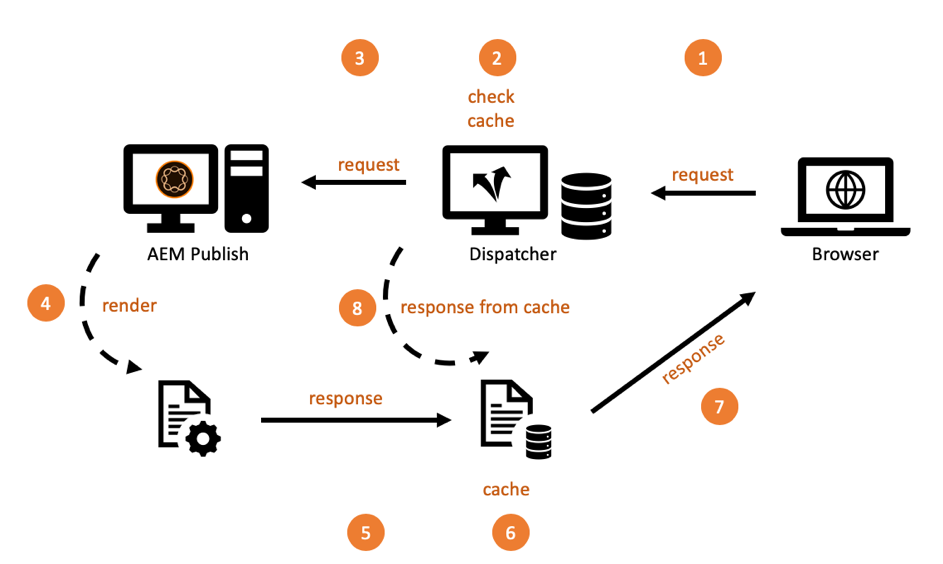

# 第1章 — Dispatcher概念、模式和反模式

## 總覽

本章簡要介紹Dispatcher的歷史和機制，並探討這如何影響AEM開發人員設計其元件的方式。

## 開發人員為何應該關心基礎架構

Dispatcher是大部分(如果不是所有AEM安裝)的必要元件。 您可以找到許多線上文章，討論如何設定Dispatcher以及提示和秘訣。

然而，這些資訊的一部分和一部分總是從非常技術的層面開始 — 假設您已經知道要做什麼，因此只提供了關於如何實現您想要什麼的詳細資訊。 我們從未找到任何描述 _什麼和為什麼_ 涉及您可以和無法對dispatcher執行的操作時。

### 反模式：Dispatcher as a Afterfoud

由於缺乏基本資訊，我們在許多AEM專案中都看到過一些反模式：

1. 當Dispatcher安裝在Apache Web伺服器中時，它是專案中「Unix gods」的工作，可加以設定。 「凡人的java開發者」不需要關心它。

2. Java開發人員需要確保其程式碼可運作……Dispatcher稍後會神奇地加快程式碼的執行速度。 調度程式永遠是事後的事。 但是，此功能無法運作。 開發人員必須在設計程式時考慮調度程式。 他需要知道它的基本概念。

### 「首先讓它起作用 — 然後讓它快速起作用」不總是正確的

你可能聽過寫程式建議 _「首先讓它起作用，然後讓它迅速起作用。」_. 這並非完全錯誤。 不過，若沒有正確的上下文，則傾向於誤解及未正確套用。

建議應避免開發人員過早地最佳化程式碼，因為程式碼可能永遠不會執行，或極少執行，以致於最佳化無法產生足夠的影響，而無法證明將精力投入最佳化的合理性。 此外，優化會導致更複雜的代碼，從而引入錯誤。 因此，如果您是開發人員，請勿將太多時間花在微量最佳化每一行程式碼上。 只要確定您選擇了正確的資料結構、算法和庫，然後等待探查器的熱點分析，以了解更徹底的優化可以提高總體效能。

### 建築決策與文物

然而，在「建築」決策方面，「先讓它起作用 — 然後讓它快速起作用」的建議卻完全錯誤。 什麼是建築決策？ 簡言之，這些決定代價高昂、難以改變，或者是以後不可能改變的。 請記住，&quot;昂貴&quot;有時與&quot;不可能&quot;相同。  例如，當您的專案預算不足時，就無法實作昂貴的變更。 對基礎設施的改變是大多數人想到的第一類改變。 但還有另一種「建築」藝術品，它們可能變得非常討厭：

1. 應用程式「中央」的程式碼片段，許多其他片段都依賴它。 若要變更這些依賴項，必須一次變更並重新測試所有相依項。

2. 偽影，這些偽影涉及一些非同步的、與時間相關的情境，在這種情境中，輸入 — 以及因此系統的行為可能隨機變化。 變更可能產生無法預測的效果，且可能難以測試。

3. 在系統的所有部分和部件中反複使用和重複使用的軟體模式。 如果軟體模式被證明為次優，則使用該模式的所有偽像都需要重新編碼。

記憶? 在此頁面頂端，我們說Dispatcher是AEM應用程式的必要部分。 訪問Web應用程式是非常隨機的 — 用戶在不可預測的時間來來去。 在結尾中 — 會（或應該）快取Dispatcher中的所有內容。 因此，如果您非常關注，您可能已經意識到快取可以被視為「架構」工具，因此應該被團隊的所有成員、開發人員和管理員所理解。

我們不是說開發人員應實際設定Dispatcher。 他們必須知道概念（尤其是界限），才能確保Dispatcher也能運用其程式碼。

Dispatcher不會神奇地提高程式碼的速度。 開發人員必須牢記Dispatcher以建立其元件。 因此，他需要知道它是如何運作的。

## Dispatcher快取 — 基本原則

### 以快取的形式傳送Http — 負載平衡器

什麼是Dispatcher，為什麼一開始叫做「Dispatcher」？

Dispatcher是

* 首先，也是最重要的快取

* 反向代理

* Apache httpd webserver的模組，將AEM相關功能添加到Apache的多功能性中，並與所有其他Apache模組（如SSL或甚至SSI，如我們稍後將看到的）一起平穩工作

在網站的初期，您會預期會有數百位訪客造訪網站。 一個Dispatcher的設定，可「已發送」或平衡對多個AEM發佈伺服器的請求負載，且通常已足夠，因此名稱為「Dispatcher」。 但是，現在這種設定已不再經常使用。

本文稍後會介紹設定Dispatcher和發佈系統的不同方式。 首先，讓我們從一些http快取基本概念開始。



*Dispatcher快取的基本功能*

<br> 

這裡會說明Dispatcher的基本概念。 Dispatcher是簡單的快取反向代理，可接收及建立HTTP請求。 一般的請求/回應週期如下：

1. 使用者要求頁面
2. Dispatcher會檢查，如果它已有該頁面的轉譯版本。 假設這是此頁面的第一個請求，而Dispatcher找不到本機快取副本。
3. Dispatcher會從發佈系統要求頁面
4. 在發佈系統中，頁面會由JSP或HTL範本轉譯
5. 頁面會傳回至Dispatcher
6. Dispatcher對頁面進行快取
7. Dispatcher會將頁面傳回至瀏覽器
8. 如果第二次請求相同頁面，則可直接從Dispatcher快取提供該頁面，而無須在Publish例項上重新轉譯。 這可節省Publish執行個體上使用者和CPU週期的等待時間。

我們在最後一節討論「頁面」。 但同樣的方案也適用於其他資源，例如影像、CSS檔案、PDF下載等。

#### 資料的快取方式

Dispatcher模組會運用Apache伺服器托管所提供的功能。 HTML頁、下載和圖片等資源在Apache檔案系統中儲存為簡單檔案。 就這麼簡單。

檔案名由請求資源的URL衍生。 如果您要求檔案 `/foo/bar.html` 它儲存在，例如/底下`var/cache/docroot/foo/bar.html`.

原則上，如果所有檔案都經過快取，因此會靜態儲存在Dispatcher中，您可以提取Publish系統的外掛程式，而Dispatcher將作為簡單的Web伺服器。 但這只是為了說明原則。 現實生活更複雜。 您無法快取所有內容，而且快取從來不會完全「完全」，因為由於呈現程式的動態性質，資源數量可能會無限。 靜態檔案系統的模型有助於生成調度程式功能的概要圖。 這有助於說明Dispatcher的限制。

#### AEM URL結構與檔案系統對應

若要更詳細了解Dispatcher，請讓我們重新造訪簡單範例URL的結構。  讓我們來看下列範例，

`http://domain.com/path/to/resource/pagename.selectors.html/path/suffix.ext?parameter=value&amp;otherparameter=value#fragment`

* `http` 表示協定

* `domain.com` 是域名

* `path/to/resource` 是資源儲存在CRX中的路徑，隨後儲存在Apache伺服器的檔案系統中

與此相比，AEM檔案系統和Apache檔案系統之間的情況稍有不同。

在AEM中，

* `pagename` 是資源標籤

* `selectors` 代表Sling中使用的數個選取器，用以判斷資源的轉譯方式。 URL可以有任意數量的選取器。 它們以句號分隔。 例如，選取器區段可能像是「french.mobile.fancy」。 選取器應僅包含字母、數字和破折號。

* `html` 作為「選取器」的最後一個，則稱為擴充功能。 在AEM/Sling中，它也部分決定了轉譯指令碼。

* `path/suffix.ext` 是類似路徑的運算式，可以是URL的尾碼。  它可用於AEM指令碼，以進一步控制資源的呈現方式。 稍後，我們將提供有關此部分的整節內容。 目前，您只需知道您可以將其用作其他參數即可。 尾碼必須有副檔名。

* `?parameter=value&otherparameter=value` 是URL的查詢區段。 用於傳遞任意參數至AEM。 無法快取含有參數的URL，因此，參數應限制為絕對必要的情況。

* `#fragment`,URL的片段部分不會傳遞至AEM，而只會在瀏覽器中使用；在JavaScript架構中以「路由參數」的形式執行，或跳至頁面上的特定部分。

在Apache中(*參考下圖*),

* `pagename.selectors.html` 用作快取檔案系統中的檔案名。

如果URL尾碼為 `path/suffix.ext` 然後，

* `pagename.selectors.html` 建立為資料夾

* `path` 資料夾 `pagename.selectors.html` 資料夾

* `suffix.ext` 是 `path` 檔案夾。 注意：如果尾碼沒有副檔名，則不會快取該檔案。


*從Dispatcher取得URL後的檔案系統配置*

<br> 

#### 基本限制

URL、資源和檔案名稱之間的對應相當簡單明瞭。

但你可能注意到了一些陷阱，

1. URL可能會變長。 新增 `/docroot` 本地檔案系統上的檔案系統很容易超過某些檔案系統的限制。 在Windows上以NTFS執行Dispatcher可能是個難題。 但是，Linux是安全的。

2. URL可包含特殊字元和變母。 這通常對Dispatcher而言不是問題。 但請記住，URL會在您應用程式的許多位置進行解譯。 我們經常看到應用程式的奇怪行為 — 只是為了找出一段很少使用（自訂）的程式碼沒有針對特殊字元進行徹底測試。 如果可以的話，你應該避開它們。 如果你做不到，那就計畫徹底測試。

3. 在CRX中，資源具有子資源。 例如，一個頁面會有許多子頁面。 在檔案系統中無法匹配這一點，因為檔案系統有檔案或資料夾。

#### 不會快取沒有副檔名的URL

URL一律必須有副檔名。 雖然您可以在AEM中提供不含副檔名的URL。 Dispatcher不會快取這些URL。

**範例**

`http://domain.com/home.html` is **可快取**

`http://domain.com/home` is **無法快取**

當URL包含尾碼時，同樣的規則適用。 尾碼必須有可快取的擴充功能。

**範例**

`http://domain.com/home.html/path/suffix.html` is **可快取**

`http://domain.com/home.html/path/suffix` is **無法快取**

您可能會想，如果資源部分沒有副檔名，但尾碼有副檔名，會發生什麼事？ 這個例子裡URL沒有尾碼。 查看下一個範例：

**範例**

`http://domain.com/home/path/suffix.ext`

此 `/home/path/suffix` 是資源的路徑……因此URL中沒有尾碼。

**結論**

一律將副檔名新增至路徑和尾碼。 有SEO意識的人有時會辯稱，這會讓你在搜索結果中排名靠後。 但未連結的頁面會非常緩慢，排名會更低。

#### 尾碼URL衝突

請考慮您有兩個有效的URL

`http://domain.com/home.html`

和

`http://domain.com/home.html/suffix.html`

在AEM中是絕對有效的。 您在本機開發電腦上不會看到任何問題（沒有Dispatcher）。 在UAT或負載測試中，您很可能也不會遇到任何問題。 我們面臨的問題如此微妙，以至於在大多數測試中都漏掉了。  當您處於高峰時段，並且您的解決時間有限、可能沒有伺服器訪問權限，或者沒有修復資源時，它將會給您帶來沈重打擊。 我們去過……

那，有什麼問題？

`home.html` 在檔案系統中可以是檔案或資料夾。 與AEM中不同時。

如果您要求 `home.html` 首先，會建立為檔案。

後續請求 `home.html/suffix.html` 返回有效結果，但作為檔案 `home.html` 「阻止」檔案系統中的位置，  `home.html` 無法再次建立為資料夾，因此 `home.html/suffix.html` 未快取。


*檔案系統中的檔案阻塞位置阻止快取子資源*

<br> 

如果你反過來，先請求 `home.html/suffix.html` then `suffix.html` 快取在資料夾下 `/home.html` 一開始。 但是，此資料夾會被檔案刪除並替換 `home.html` 隨後請求 `home.html` 作為資源。


*將父項擷取為資源時刪除路徑結構*

<br> 

因此，快取結果完全是隨機的，且取決於傳入請求的順序。 更棘手的是，您通常有多個調度程式。 而且，效能、快取點擊率和行為可能會因Dispatcher和Dispatcher而有所不同。 如果您想要了解網站為何沒有回應，請務必確認您所查看的Dispatcher順序不正確。 如果您查看的Dispatcher（幸運的是）請求模式較有利，您將會在嘗試尋找問題時迷失方向。

#### 避免URL衝突

當您為資源使用不同副檔名時，可以避免「衝突的URL」，即檔案系統中同一路徑的資料夾名和檔案名「競爭」。

**範例**

* `http://domain.com/home.html`

* `http://domain.com/home.dir/suffix.html`

兩者都完全可以快取，


請求尾碼時，為資源選擇專用的副檔名「dir」，或者完全避免使用尾碼。 在很少的情況下，它們是有用的。 而且，正確實施這些案例很容易。  正如我們在下一章中討論快取失效和排清時所見。

#### 無法處理的請求

讓我們來查看最後一章的快速摘要，以及一些更多例外。 如果URL設定為可快取，且為GET請求，則Dispatcher可以快取。 無法在以下異常之一下快取它。

**可快取請求**

* 請求已設定為可在Dispatcher設定中快取
* 請求是純GET請求

**無法快取的請求或回應**

* 配置拒絕快取的請求（路徑、模式、MIME類型）
* 傳回「Dispatcher:no-cache&quot;頭
* 傳回「快取控制：no-cache|private&quot;標題
* 傳回「Pragma:no-cache&quot;頭
* 具有查詢參數的請求
* 無副檔名的URL
* 尾碼不含副檔名的URL
* 傳回200以外之狀態代碼的回應
* POST要求

## 使快取失效並刷新

### 總覽

最後一章列出許多例外，當Dispatcher無法快取請求時。 但還有更多事情要考慮：就因為Dispatcher _can_ 快取請求，但不一定表示 _show_.

重點是：快取通常很容易。 Dispatcher只需儲存回應的結果，並在下次傳入非常相同的請求時傳回。 右? 錯了！

難的是 _失效_ 或 _沖洗_ 快取。 當資源已變更時，Dispatcher需要找出，且需要重新呈現。

乍一看，這似乎是一項瑣碎的任務……但事實並非如此。 請進一步閱讀，您會發現單一和簡單的資源與頁面之間的一些棘手差異，這些資源依賴於高度網狀的多個資源結構。

### 簡單資源和排清

我們已設定AEM系統，在使用特殊的「縮圖」選取器提出要求時，以動態方式為每個影像建立縮圖轉譯：

`/content/dam/path/to/image.thumb.png`

此外，我們也提供URL，以無選取器的URL提供原始影像：

`/content/dam/path/to/image.png`

如果我們同時下載縮圖和原始影像，我們最後會得到，

```
/var/cache/dispatcher/docroot/content/dam/path/to/image.thumb.png

/var/cache/dispatcher/docroot/content/dam/path/to/image.png
```

在Dispatcher的檔案系統中。

現在，使用者上傳並啟用該檔案的新版本。 最終，失效請求會從AEM傳送至Dispatcher,

```
GET /invalidate
invalidate-path:  /content/dam/path/to/image

<no body>
```

失效很簡單：對Dispatcher上特殊「/無效」URL的簡單GET請求。 不需要HTTP-body，「有效負載」只是「invalidate-path」標題。 另請注意，標頭中的無效路徑是AEM所知的資源，而不是Dispatcher已快取的檔案。 AEM只知道資源。 請求資源時，會在執行階段使用擴充功能、選取器和尾碼。 AEM不會針對資源上已使用的選取器執行任何保單記錄，因此在啟動資源時，它所知道的資源路徑就是唯一確定的。

就我們而言，這已足夠了。 如果資源已變更，我們可以安全地假設該資源的所有轉譯也已變更。 在我們的範例中，如果影像已變更，也會轉譯新縮圖。

Dispatcher可以安全地刪除資源，並包含其已快取的所有轉譯。 它會做類似，

`$ rm /content/dam/path/to/image.*`

移除 `image.png` 和 `image.thumb.png` 以及所有其他符合該模式的轉譯。

只要您只使用一個資源來回應要求，就會非常簡單。

### 參照和網格化內容

#### 網狀內容問題

與上傳至AEM的影像或其他二進位檔案不同，HTML頁面並非獨立的動物。 它們生活在亂堆中，它們通過超連結和引用彼此高度互連。 簡單的連結無害，但當我們討論內容參考時，就會變得棘手。 頁面上無處不在的頂端導覽或前導是內容參考。

#### 內容參考及其成因

讓我們看一個簡單的例子。 旅行社有一個宣傳加拿大旅行的網頁。 此促銷活動會在其他兩頁的宣傳預告區段、「首頁」頁面和「冬季特別計畫」頁面中精選。

由於這兩個頁面都顯示相同的預告，因此沒有必要要求作者為應顯示的每個頁面建立預告多次。 相反地，目標頁面「加拿大」會保留頁面屬性中的一個區段來提供預告的資訊，或者最好提供完全呈現該預告的URL:

`<sling:include resource="/content/home/destinations/canada" addSelectors="teaser" />`

或

`<sling:include resource="/content/home/destinations/canada/jcr:content/teaser" />`


只有在AEM上，它的作用就像魅力，但如果您在Publish例項上使用Dispatcher，就會發生奇怪的情況。

想像一下，您已發佈您的網站。 您加拿大頁面上的標題為「加拿大」。 訪客要求您的首頁時（其中有該頁面的預告參考），「加拿大」頁面上的元件會呈現類似

```
<div class="teaser">
  <h3>Canada</h3>
  
</div>
```

*into* 首頁。 首頁由Dispatcher儲存為靜態.html檔案，包括預告，且是檔案中的標題。

現在，行銷人員已經知道，宣傳標題應該可以操作。 因此，他決定將標題從「加拿大」改為「造訪加拿大」，並更新影像。

他發佈編輯過的「加拿大」頁面，並重新造訪先前發佈的首頁，以查看其變更。 但是，那裡沒有什麼變化。 它仍會顯示舊的預告。 他仔細檢查了&quot;冬季特別節&quot; 該頁面之前從未請求過，因此在Dispatcher中不會靜態快取。 因此，此頁面是Publish新轉譯的，此頁面現在包含新的「造訪加拿大」預告。


*將過時內容儲存在首頁的Dispatcher*

<br> 

怎麼了？ Dispatcher會儲存頁面的靜態版本，其中包含呈現時從其他資源擷取的所有內容和標籤。

Dispatcher只是一個基於檔案系統的Web伺服器，速度快，但也相對簡單。 如果包含的資源改變，它並未意識到這一點。 它仍會依附於轉譯包含頁面時的內容。

「冬季特殊」頁面尚未轉譯，因此Dispatcher上沒有靜態版本，因此會以新預告顯示，因為這是根據要求以新鮮呈現。

您可能會認為，當資源變更時，Dispatcher會在演算及排清已使用此資源的所有頁面時，持續追蹤其所接觸的每個資源。 但Dispatcher不會轉譯頁面。 呈現由發佈系統執行。 Dispatcher不知道哪些資源會放入轉譯的.html檔案中。

還沒說服？ 你可能認為 *「必須有實作某種相依性追蹤的方法」*. 有，或者更準確的說 *was*. 第3號公報AEM的曾曾祖父在 _工作階段_ 用於呈現頁面。

在請求期間，透過此工作階段取得的每個資源都會被視為與目前轉譯之URL的相依性受到追蹤。

但事實證明，跟蹤這些依賴項是非常昂貴的。 人們很快發現，如果完全關閉相依性追蹤功能，而且依賴在變更一個html頁面後重新轉譯所有html頁面，網站的速度就會更快。 此外，這個計畫也不完美 — 路上還有許多陷阱和例外。 在某些情況下，您不是使用請求預設工作階段來取得資源，而是使用管理工作階段來取得一些協助資源來呈現請求。 這些依賴項通常不會被跟蹤，並導致頭痛和給操作團隊打電話，要求手動刷新快取。 如果他們有標準的程式，你就很幸運了。 路上還有更多的玩意，但是……我們別再回憶了。 這可以追溯到2005年。 最終，這一功能在第4號公報中被預設解除了激活，而未能重新進入後續的CQ5,CQ5隨後成為AEM。

### 自動失效

#### 當完全排清比相依性追蹤便宜時

由於CQ5完全依賴於失效（或多或少），而只有其中一個頁面變更時，整個網站才會失效。 此功能稱為「自動失效」。

但是，又一次 — 怎麼可能，丟掉並重新渲染數百頁比進行適當的依賴跟蹤和局部重新渲染更便宜呢？

有兩個主要原因：

1. 在一般網站中，通常只會要求一小部分頁面。 因此，即使您扔掉所有已呈現的內容，事後實際上也只會請求幾打內容。 實際請求頁面時，長尾的呈現可隨時間而分佈。 因此，實際上呈現頁面的負載並未如預期高。 當然，總有例外……我們稍後會討論如何處理大型網站上空Dispatcher快取之平均分配負載的技巧。

2. 所有頁面仍由主導覽連結。 因此，幾乎所有頁面最終都是互相依賴的。 這意味著，即使是最聰明的依賴追蹤者也會找出我們已經知道的：如果其中一個頁面變更，則必須使其他所有頁面無效。

你不相信？ 讓我們來說明最後一點。

我們使用與上一個範例相同的引數，而茶匙會參考遠端頁面的內容。 直到現在，我們還在用一個更極端的例子：自動呈現的主導覽。 如同宣傳預告一樣，導覽標題是從連結或「遠端」頁面繪製為內容參考。 遠程導航標題不儲存在當前呈現的頁面中。 您應記住，導覽會呈現在您網站的每個頁面上。 因此，在具有主導覽的所有頁面上，一遍又一遍地使用一個頁面的標題。 如果您想要變更導覽標題，您只需在遠端頁面上執行一次該動作，而不是在參照該頁面的每個頁面上。

因此，在我們的範例中，導覽會使用目標頁面的「NavTitle」在導覽中轉譯名稱，以將所有頁面網格在一起。 「冰島」的導覽標題從「冰島」頁面繪製，並呈現到每個具有主導覽的頁面中。


*主導覽會提取「NavTitles」，不可避免地將所有頁面的內容整合在一起*

<br> 

如果您將「冰島」頁面上的「NavTitle」從「Iceland」變更為「Beautiful Iceland」，則該標題會在所有其他頁面主功能表上立即變更。 因此，在該變更前轉譯並快取的頁面都會過時，因此需要使其失效。

#### 如何實作自動失效：.stat檔案

現在，如果您有一個擁有數千頁的大型網站，則需要相當長的時間來循環瀏覽所有頁面，並實際刪除這些頁面。 在此期間，Dispatcher可能會無意中提供過時內容。 更糟糕的是，在存取快取檔案時可能會發生一些衝突，可能是在頁面正被刪除時請求頁面，或是由於後續立即啟動後發生的第二次失效而再次刪除頁面。 想想看，這會是多麼亂。 幸好事情不是這樣的。 Dispatcher使用巧妙的技巧來避免：它不會刪除數百個檔案，而是在發佈檔案時將一個簡單、空的檔案放入檔案系統的根目錄中，因此所有依賴的檔案都被視為無效。 此檔案稱為「statfile」。 statfile是空的檔案 — 關於statfile的重要之處只在於其建立日期。

Dispatcher中所有建立日期早於statfile的檔案，都已在上次啟動（和失效）之前呈現，因此被視為「無效」。 檔案系統中仍有這些檔案，但Dispatcher會忽略這些檔案。 它們是「過時的」。 每當對過時資源提出請求時，Dispatcher都會要求AEM系統重新呈現頁面。 然後，新呈現的頁面將儲存在檔案系統中 — 現在有新的建立日期，並且它重新刷新。


*.stat檔案的建立日期定義哪些內容已過時和哪些內容已更新*

<br> 

您可以問它為什麼叫「.stat」？ 也許不是&quot;無效&quot; 可以想像，在檔案系統中放置該檔案有助於Dispatcher確定哪些資源可以 *靜態* 提供 — 就像從靜態Web伺服器提供。 這些檔案不再需要動態呈現。

然而，這個名字的真正本質並不是暗喻。 它衍生自Unix系統呼叫 `stat()`，會傳回檔案的修改時間（除其他屬性外）。

#### 混合簡單與自動驗證

但是……我們之前說，單個資源被物理刪除。 現在，我們說，較新的statfile實際上會在Dispatcher的眼中顯示為無效。 那麼，為什麼首先實際刪除？

答案很簡單。 您通常會同時使用這兩種策略，但針對不同類型的資源。 二進位資產（如影像）是獨立的。 它們與其他資源之間沒有關聯，因為它們需要提供其資訊。

HTML頁面則高度相依。 因此，您會對這些套用自動失效。 這是Dispatcher中的預設設定。 屬於無效資源的所有檔案都會實際刪除。 此外，結尾為「.html」的檔案會自動失效。

Dispatcher會決定檔案副檔名，決定是否套用自動失效配置。

可設定自動失效的檔案結尾。 理論上，您可以包含自動失效的所有擴充功能。 但請記住，這個代價非常高。 您不會無意中傳送過時的資源，但傳送效能會因過度失效而大幅降低。

假設您實作的方案是動態呈現PNG和JPG，並依賴其他資源執行。 您可能希望將高解析度影像重新縮放為與Web相容的較小解析度。 雖然你也會改變壓縮率。 此示例中的解析度和壓縮率不是固定常數，而是使用影像的元件中的可配置參數。 現在，如果此參數已變更，您必須使影像無效。

沒問題 — 我們剛才知道，我們可以將影像添加到自動失效中，並且每次發生任何更改時都會呈現新呈現的影像。

#### 把嬰兒和洗澡水一起扔掉

沒錯，這是個大問題。 再讀一讀最後一段。 &quot;。..每當有任何變化時，就呈現新的影像。&quot; 如你所知，一個好網站會不斷改變；在此處新增內容、更正此處的打字錯誤、在其他地方調整預告。 這表示您的所有影像會持續失效，且需要重新轉譯。 別低估了。 動態轉譯和傳輸影像資料在本機開發電腦上的運作時間（毫秒）。 您的生產環境需要以每秒100倍的頻率執行此操作。

讓我們在這裡清楚一點，當html頁面變更，而且反之亦然，就需要重新呈現您的jpg。 要自動失效的檔案只有一個「貯體」。 整體被衝了。 不用任何手段去細化細節結構。

自動失效預設會保留為「.html」，這是有正確理由的。 目標是把桶子盡可能小。 不要把嬰兒和洗澡水一起扔出去，只是讓一切都失去活力 — 只是為了站在安全的一邊。

應當在資源的道路上提供自成一體的資源。 這很有幫助失效。 請保持簡單，不要建立映射配置，如「/x/y/z」提供的「resource /a/b/c」。 讓您的元件可搭配預設Dispatcher的自動失效設定運作。 請勿嘗試修復Dispatcher中設計不當且過度失效的元件。

##### 自動失效的例外情況：ResourceOnly失效

Dispatcher的無效請求通常會由復寫代理從發佈系統觸發。

如果您對您的依賴項非常有信心，可以嘗試構建自己的使複製代理失效的代理。

本指南將略過細節，但我們想給您一些提示。

1. 真的知道你在做什麼。 正確判定失效真的很難。 這就是自動失效如此嚴格的原因之一；以避免傳送過時內容。

2. 如果您的代理傳送HTTP標題 `CQ-Action-Scope: ResourceOnly`，表示此單一失效請求不會觸發自動失效。 這個( [https://github.com/cqsupport/webinar-dispatchercache/tree/master/src/refetching-flush-agent/refetch-bundle](https://github.com/cqsupport/webinar-dispatchercache/tree/master/src/refetching-flush-agent/refetch-bundle))程式碼片段可能是您自己的復寫代理程式的好起點。

3. `ResourceOnly`，僅防止自動失效。 若要實際執行必要的相依性解決和無效判定作業，您必須自行觸發無效判定請求。 您可以檢查套件Dispatcher排清規則([https://adobe-consulting-services.github.io/acs-aem-commons/features/dispatcher-flush-rules/index.html](https://adobe-consulting-services.github.io/acs-aem-commons/features/dispatcher-flush-rules/index.html))，以獲得關於如何真正實現的靈感。

我們不建議您建立相依性解決方案。 這種努力太多，收益也很小 — 正如之前所說，你會犯錯的太多。

相反地，您應該找出哪些資源對其他資源沒有任何相依性，且可在不自動失效的情況下失效。 不過，您不必為此使用自定義複製代理。 只需在Dispatcher設定中建立自訂規則，排除這些資源不會自動失效。

我們說主導航或茶具是依賴的源。 嗯 — 如果您以非同步方式載入導航和預告，或者在Apache中將它們與SSI指令碼一起包含，則您將不需要跟蹤該依賴項。 我們稍後會在本檔案中說明「Sling Dynamic Includes」時，以非同步方式載入元件。

彈出式視窗或載入燈箱的內容亦同。 這些片段也很少有導覽（亦即「相依性」），且可作為單一資源失效。

## 考慮Dispatcher建立元件

### 將Dispatcher力學應用於實際範例

在最後一章中，我們說明Dispatcher的基本機制、一般運作方式，以及其限制。

現在，我們想將這些力學應用到您很可能在項目要求中找到的一種元件。 我們刻意挑選元件，以展示您遲早也會面臨的問題。 不要害怕 — 並非所有組成部分都需要我們拿出如此大的考慮。 但是，如果你看到需要構建這樣一個元件，你就很清楚後果，並知道如何處理。

### 假離線元件（防）模式

#### 回應式影像元件

讓我們說明具有互連二進位檔案之元件的常見模式（或反模式）。 我們將建立「回應」元件 — 用於「回應式影像」。 此元件應能調整顯示的影像，使其與其顯示的裝置一致。 在桌上型電腦和平板電腦上，它顯示影像的完整解析度，在手機上以窄邊裁切的較小版本顯示影像，甚至可能以完全不同的主題顯示（在回應式世界，這被稱為「藝術方向」）。

資產會上傳至AEM的DAM區域，且僅 _引用_ 在回應式影像元件中。

回應元件負責標籤的轉譯和二進位影像資料的傳送。

我們在此實作它的方式，是許多專案中都看到的常見模式，即使其中一個AEM核心元件也是以該模式為基礎。 因此，您作為開發人員很可能會調整這種模式。 在封裝方面，它有其最佳點，但要讓它準備好Dispatcher，需要花很多努力。 我們稍後將討論如何緩解該問題的幾個選項。

我們稱之為「假死者模式」，因為問題可以追溯到《公報》3的早期，當時有一種方法「假死者」可以被叫到資源上，將二進位原始資料流入響應。

原始術語「假離線」實際上是指共用的慢速離線外圍設備（如打印機），因此在此處無法正確應用。 但無論如何，我們都喜歡這個詞，因為它在網路世界中很少有，因此是可區分的。 而且每個模式都應該有一個可區分的名稱，對吧？ 這是一種模式還是一種反模式，由你決定。

#### 實施

以下是回應式影像元件的實作方式：

該元件分為兩部分；第一部分呈現影像的HTML標籤，第二部分「假設」所引用影像的二進位資料。 由於這是具有回應式設計的現代網站，因此我們不會轉譯簡單 `` 標籤，但 `<picture/>` 標籤。 我們會針對每部裝置將兩個不同的影像上傳至DAM，並從影像元件參照這些影像。

元件有三種轉譯指令碼（以JSP、HTL或Servlet形式實作），每一種都透過專用選擇器處理：

1. `/respi.jsp`  — 沒有選擇器可呈現HTML標籤
2. `/respi.img.java` 呈現案頭版本
3. `/respi.img.mobile.java` 來轉譯行動版本。


元件會放置在首頁的parsys中。 CRX中生成的結構如下所示。


*CRX中回應式影像的資源結構*

<br> 

元件標籤的呈現如下，

```plain
  #GET /content/home.html

  <html>

  …

  <div class="responsive-image>

  <picture>
    <source src="/content/home/jcr:content/par/respi.img.mobile.jpg" …/>
    <source src="/content/home/jcr:content/par/respi.img.jpg …/>

    …

  </picture>
  </div>
  …
```

我們已經完成了封裝的元件。

#### 動作中的回應式影像元件

現在，使用者透過Dispatcher要求頁面和資產。 這會導致Dispatcher檔案系統中的檔案，如下圖所示：


*封裝的響應式影像元件的快取結構*

<br> 

請考慮使用者上傳並啟動兩個花卉影像的新版本至DAM。 AEM將根據失效請求傳送

`/content/dam/flower.jpg`

和

`/content/dam/flower-mobile.jpg`

到Dispatcher。 不過，這些要求是徒勞的。 內容已快取為元件子結構下方的檔案。 這些檔案現在已過時，但仍會應要求提供。


*結構不匹配導致內容過時*

<br> 

這一方法還有另一個注意事項。 請考慮在多個頁面上使用相同的flower.jpg。 接著，您會在多個URL或檔案下快取相同的資產，

```
/content/home/products/jcr:content/par/respi.img.jpg

/content/home/offers/jcr:content/par/respi.img.jpg

/content/home/specials/jcr:content/par/respi.img.jpg

…
```

每次請求新的未快取頁面時，都會從不同URL的AEM擷取資產。 沒有Dispatcher快取和瀏覽器快取可以加速傳送。

#### 輻射模式在哪裡

有一個自然的例外，即便這種模式形式簡單，也是有用的：如果二進位檔儲存在元件本身，而非DAM中。 不過，這項功能只對網站上使用一次的影像有用，而不是將資產儲存在DAM中，這表示您很難管理資產。 想像一下您的特定資產使用授權已用盡。 如何找出您已使用資產的元件？

看到沒？ DAM中的「M」代表「管理」，如數位資產管理。 你不想把那個功能丟掉。

#### 結論

從AEM開發者的角度看，這種圖案看起來非常優雅。 但是，當Dispatcher考慮到這個等式時，你可能會同意，天真的做法可能是不夠的。

現在由你決定這是一種模式還是一種反模式。 也許你已經有了一些好的想法，來緩解上述問題？ 很好。 那麼，你應該迫切希望看到其他項目如何解決這些問題。

### 解決常見的Dispatcher問題

#### 總覽

讓我們討論一下，如何讓快取更方便實作。 有數個選項。 有時候，你無法找到最好的解決方案。 可能您進入了已在運行的項目，而且您的預算有限，只能解決手頭的「快取問題」，而不足以完全重構。 或者，您會面臨一個問題，這比範例影像元件更複雜。

我們將在以下幾節中概述原則和注意事項。

同樣，這是基於現實經驗。 我們已經看到了所有這些在野外的規律，所以這不是一項學術研究。 這就是為什麼我們向你們展示一些反模式，所以你們有機會從別人已經犯的錯誤中吸取教訓。

#### 快取殺手

>[!WARNING]
>
>這是反模式。 請勿使用它。 永遠。

您有沒有看過查詢參數，例如 `?ck=398547283745`? 它們稱為快取殺手(「ck」)。 其思想是，如果新增任何查詢參數，則不會快取資源。 此外，如果您新增隨機數字作為參數的值(例如&quot;398547283745&quot;),URL就會變成唯一，您確定AEM系統與您的畫面之間沒有其他快取可快取。 通常中間的疑似情況是Dispatcher、CDN或甚至瀏覽器快取前的「清漆」快取。 再次：別這樣。 您確實希望盡可能多地快取您的資源。 快取是你的朋友。 別殺朋友。

#### 自動失效

>[!WARNING]
>
>這是反模式。 請避免將其用於數位資產。 請嘗試保留Dispatcher的預設設定，此設定>只會對「.html」檔案自動失效

短期而言，您可以將&quot;。jpg&quot;和&quot;。png&quot;新增至Dispatcher中的自動失效設定。 這表示每當失效發生時，所有「.jpg」、「.png」和「.html」都需要重新轉譯。

如果業務擁有者抱怨其變更在即時網站上的實現速度不夠快，則這種模式非常容易實施。 但這只能給你一些時間，來想出更複雜的解決方案。

請務必了解對效能的巨大影響。 這會顯著減慢您的網站速度，甚至可能影響穩定性（如果您的網站是負載較高且經常變更的網站），例如新聞入口網站。

#### URL指紋

URL指紋看起來像是快取殺手。 但事實並非如此。 它不是隨機數，而是表示資源內容的值。 這可以是資源內容的雜湊，或更簡單的是上傳、編輯或更新資源時的時間戳記。

Unix時間戳記非常適合於實際實作。 為了提高可讀性，我們在本教學課程中使用了更易讀的格式： `2018 31.12 23:59 or fp-2018-31-12-23-59`.

指紋不得用作查詢參數，因為無法快取具有查詢參數的URL。 您可以使用選取器或尾碼作為指紋。

假設，檔案 `/content/dam/flower.jpg` 有 `jcr:lastModified` 日期： 2018年12月31日，23:59。 含有指紋的URL為 `/content/home/jcr:content/par/respi.fp-2018-31-12-23-59.jpg`.

只要參考資源(`flower.jpg`)檔案未變更。 因此，它可以快取無限時間，而且不是快取殺手。

注意，此URL必須由回應式影像元件建立並提供。 這不是現成可用的AEM功能。

這是基本概念。 不過，有些細節很容易被忽視。

在我們的範例中，元件於23:59轉譯並快取。 現在影像已經變更，假設00:00。  元件 _wold_ 在其標籤中生成新的指紋URL。

你可能認為 _show_&#x200B;但事實並非如此。由於僅更改了影像的二進位，並且未接觸包含頁面，因此不需要重新呈現HTML標籤。 因此，Dispatcher會以舊指紋提供頁面，進而提供舊版影像。


*影像元件比參考影像更近，沒有呈現新的指紋。*

<br> 

現在，如果您重新啟動首頁（或該網站的任何其他頁面）,statfile將會更新，Dispatcher會將home.html視為過時，並在影像元件中重新呈現為新指紋。

但我們沒激活首頁，對吧？ 為什麼我們要啟動一個我們還是沒有觸摸的頁面？ 此外，我們可能沒有足夠的權限來啟用頁面，或核准工作流程太長且耗時，因此我們無法在短時間內執行此作業。 那麼，該怎麼辦？

#### 懶惰管理工具 — 降低Statfile層級

>[!WARNING]
>
>這是反模式。 只在短期內使用它，以爭取一些時間，並想出更複雜的解決方案。

懶惰的管理員通常會&#x200B;_將jpgs的自動失效設定為零，並將statfile層級設為零，這一定有助於處理各種快取問題_.&quot; 您會在技術論壇中找到該建議，這有助於解決失效問題。

到目前為止，我們還沒有討論statfile級別。 基本上，自動失效僅適用於相同子樹狀結構中的檔案。 但問題是頁面和資產通常不會存在於相同的子樹狀結構中。 頁面在下方 `/content/mysite` 而資產則顯示於下方 `/content/dam`.

「statfile level」定義子樹的根節點在什麼深度。 在上方的範例中，層級會是&quot;2&quot;(1=/content, 2=/mysite,dam)

將statfile層級「降低」為0的想法，基本上是將整個/content樹狀結構定義為一個且唯一的子樹狀結構，以讓頁面和資產在相同的自動失效網域中上線。 因此，我們只能在大樹上一級（在docroot &quot;/&quot;處）。 但是，只要某些內容發佈，伺服器上的所有網站就會自動失效，甚至是完全不相關的網站。 相信我們：從長遠來看，這是個壞主意，因為整體快取點擊率會嚴重降低。 您只能希望AEM伺服器擁有足夠的火力，不需要快取即可執行。

稍後，您將了解更深入的statfile級別的所有優點。

#### 實作自訂失效代理

無論如何，如果「.jpg」或「.png」變更為允許以新的URL重新轉譯，我們必須以某種方式告訴Dispatcher使HTML頁面無效。

我們在專案中看到的是（例如）發佈系統上的特殊復寫代理，每當發佈網站的影像時，就會傳送網站的無效請求。

如果您能透過命名慣例從資產路徑衍生網站路徑，在此將有很大幫助。

一般而言，最好比對網站和資產路徑，如下所示：

**範例**

```
/content/dam/site-a
/content/dam/site-b

/content/site-a
/content/site-b
```

這樣，當您的自訂Dispatcher排清代理遇到變更時，就可以輕鬆傳送和失效請求至/content/site-a `/content/dam/site-a`.

事實上，您指示Dispatcher使其無效的路徑並不重要，只要該路徑位於相同的網站中、位於相同的「子樹狀結構」中即可。 您甚至不需要使用真正的資源路徑。 也可以是「虛擬」：

```
GET /dispatcher-invalidate
Invalidate-path /content/mysite/dummy
```


1. DAM中的檔案變更時，會觸發發佈系統上的接聽程式

2. 接聽程式傳送無效請求至Dispatcher。 由於自動失效，我們在自動失效中傳送的路徑並不重要，除非它位於網站的首頁下，或在網站狀態檔案層級更精確。

3. statfile會更新。

4. 下次請求首頁時，將重新呈現首頁。 新的指紋/日期取自影像的lastModified屬性，作為其他選取器

5. 這隱含地建立對新影像的參照

6. 如果實際請求了影像，則會建立新的轉譯並儲存在Dispatcher中


#### 清理的必要性

噢。 已完成. 哈雷！

還沒有。

路，

`/content/mysite/home/jcr:content/par/respi.img.fp-2018-31-12-23-59.jpg`

與任何已失效的資源無關。 記憶? 我們只使「虛擬」資源失效，並依賴自動失效來將「首頁」視為無效。 影像本身可能永遠不會 _物理_ 已刪除。 因此，快取會增長，並且會增長。 當影像變更並啟動時，會在Dispatcher的檔案系統中取得新的檔案名稱。

無法實際刪除快取檔案及無限期保留這些檔案，這有三個問題：

1. 您正在浪費儲存容量 — 這很明顯。 當然 — 儲存在過去幾年中變得更便宜。 但過去幾年，影像解析度和檔案大小也在增加 — 視網膜樣的顯示器的出現，它們渴望獲得清晰的水晶影像。

2. 儘管硬碟已變得更便宜，但「儲存」可能並沒有變得更便宜。 我們已經看到一種趨勢，即沒有（廉價）裸機硬碟儲存，而是由您的資料中心提供商在NAS上租用虛擬儲存。 這種儲存比較可靠和可擴展，但也比較昂貴。 你可能不想把過時的垃圾儲存起來浪費掉。 這不僅與主儲存有關，還與備份有關。 如果您有現成的備份解決方案，則可能無法排除快取目錄。 最後，您還在備份垃圾資料。

3. 更糟的是：您可能只在有限的時間（只要您需要）購買特定影像的使用許可。 現在，如果您在授權過期後仍儲存影像，這可能會被視為侵犯版權。 您可能不會再在網頁中使用影像，但Google仍會找到。

最後，你會找到一些家政任務，來清理所有比……更舊的檔案，讓我們舉個星期來控制這種亂七八糟的垃圾。

#### 濫用URL指紋進行拒絕服務攻擊

但等等，這個解決方案還存在另一個缺陷：

我們濫用選取器作為參數：fp-2018-31-12-23-59是動態產生的，是某種「快取殺手」。 但也許一些無聊的孩子（或者一個瘋狂的搜索引擎爬蟲）開始請求網頁：

```
/content/mysite/home/jcr:content/par/img.fp-0000-00-00-00-00.jpg
/content/mysite/home/jcr:content/par/img.fp-0000-00-00-00-01.jpg
/content/mysite/home/jcr:content/par/img.fp-0000-00-00-00-02.jpg

…
```

每個請求都會略過Dispatcher，導致在Publish例項上載入。 而且，更糟糕的是，在Dispatcher上建立根據檔案。

因此……您不必只使用指紋作為簡單的快取殺手，而必須檢查jcr:lastModified影像的日期，如果不是預期的日期，則傳回404。 這需要一些時間和CPU週期，而您最初要防止的就是發佈系統。

#### 高頻版本中URL指紋的警告

您不僅可以對來自DAM的資產使用指紋結構，也可以對JS和CSS檔案及相關資源使用。

[版本控制的Clientlibs](https://adobe-consulting-services.github.io/acs-aem-commons/features/versioned-clientlibs/index.html) 是使用此方法的模組。

但在這裡，您可能會面臨另一個警告：它會將URL系結至內容。 若不變更URL（亦即更新修改日期），則無法變更內容。 這就是指紋最初的設計。 但請考慮，您正在推出新版本，其中包含新的CSS和JS檔案，因此包含新指紋的新URL。 所有HTML頁面仍會參照舊的指紋URL。 因此，為了讓新版本穩定運作，您需要一次使所有HTML頁面無效，以強制重新轉譯並參照新指紋的檔案。 如果您有多個網站依賴相同的資料庫，這可能需要大量的重新轉譯，而此時您無法運用 `statfiles`. 因此，請準備好在轉出後看到發佈系統上的負載峰值。 您可以考慮將快取加熱為藍綠色的部署，或是Dispatcher前面的TTL型快取……有無限的可能性。

#### 短暫的休息

這是很多細節要考慮，對吧？ 而且它拒絕被輕易理解、測試和調試。 而且，這都是為了一個看似優雅的解決方案。 誠然，它很優雅 — 但只從AEM的視角看。 和Dispatcher一起，這會變得令人討厭。

但是，這仍無法解決一個基本警告，如果影像在不同頁面上多次使用，系統會在這些頁面下快取。 快取的協同作用不大。

一般而言，URL指紋識別是工具包中的好工具，但您需要謹慎套用，因為它可能會造成新問題，同時只解決一些現有問題。

那……那是個長篇大論。 但我們經常看到這種模式，我們覺得有必要給你全貌，有利有弊。 URL指紋可解決後台模式中的一些固有問題，但實作的工作量相當大，您也需要考慮其他更簡單的解決方案。 我們的建議是，請一律檢查您的URL是否能以提供的資源路徑為基礎，且沒有中繼元件。 我們將在下一章中討論此問題。

##### 運行時相依性解析

執行階段相依性解決是我們在一個專案中考慮的概念。 但是想清楚它變得相當複雜，我們決定不實施它。

其基本思想如下：

Dispatcher不知道資源的相依性。 只是一堆沒有語義的檔案。

AEM對相依性也知之甚少。 它缺乏正確的語義或「依賴追蹤器」。

AEM會感知部分參考。 當您嘗試刪除或移動參考的頁面或資產時，系統會使用此知識來警告您。 若要這麼做，請在刪除資產時查詢內部搜尋。 內容參考的表單確實非常特殊。 它們是以「/content」開頭的路徑運算式。 因此，它們可以很容易地被全文索引 — 並在必要時查詢。

在我們的案例中，我們需要發佈系統上的自訂復寫代理，該代理會在路徑變更時觸發特定路徑的搜尋。

假設

`/content/dam/flower.jpg`

已在發佈時變更。 代理程式會引發「/content/dam/flower.jpg」搜尋，並尋找參考這些影像的所有頁面。

然後，它可能會向Dispatcher發出許多無效請求。 每個包含資產的頁面各一個。

理論上，這應該行得通。 但僅適用於第一級相依性。 您不想針對多層級相依性套用該配置，例如在頁面上使用的體驗片段上使用影像時。 事實上，我們認為方法太複雜了 — 並且可能存在運行時間問題。 通常最好的建議是不要在事件處理程式中進行昂貴的計算。 特別是搜索成本會很高。

##### 結論

我們希望我們已充分討論後台模式，協助您決定何時要使用，而不要在實施中使用。

## 避免Dispatcher問題

### 資源型URL

要解決依賴問題，一個更優雅的方法是根本沒有依賴。 避免使用一個資源僅代理另一個資源時發生的人工相依性，如上一個範例所示。 盡可能多地將資源視為「單獨」實體。

我們的範例很容易解決：


*使用系結至影像（而非元件）的servlet來假設影像。*

<br> 

我們會使用資產原始資源路徑來轉譯資料。 如果需要依原樣呈現原始影像，我們只能使用AEM。資產的預設轉譯器。

如果需要對特定元件執行一些特殊處理，我們會在該路徑上註冊一個專用的servlet，並選擇器代表元件進行轉換。 我們在這裡以「回應」為榜樣。 選取器。 請務必追蹤全域URL空間上使用的選取器名稱(例如 `/content/dam`)，並有良好的命名慣例，以避免命名衝突。

順便說一下，我們沒有發現任何與程式碼一致性相關的問題。 Servlet可與元件Sling模型定義在相同的Java套件中。

我們甚至可以在全球空間中使用其他選擇器，例如，

`/content/dam/flower.respi.thumbnail.jpg`

輕鬆，對吧？ 那麼為什麼人們會想出像斯波勒這樣的複雜模式呢？

那麼，我們可以解決避免內部內容引用的問題，因為外部元件在內部資源的渲染中添加的值或資訊很少，所以可以很容易地在一組靜態選擇器中對它進行編碼，這些選擇器控制單個資源的表示。

但有一類案例無法透過資源型URL輕鬆解決。 我們將這類案例稱為「參數插入元件」，並在下一章中加以討論。

### 參數注入元件

#### 總覽

最後一章的假設程式只是資源周圍的精簡包裝函式。 它造成的麻煩比幫助解決問題還多。

我們可以使用簡單選擇器，並新增相應的servlet以處理這些請求，輕鬆取代包裝。

但如果「回應」元件不僅僅是一個代理，那又會怎樣呢。 如果元件確實有助於元件的轉譯，該怎麼辦？

讓我們來介紹一下我們的「回應」元件的一小段擴展，這有點改變遊戲規則。 同樣，我們將首先介紹一些天真的解決方案，以應對新挑戰，並展示新挑戰的落後點。

#### Respi2元件

respi2元件是顯示回應式影像的元件，回應元件亦同。 但它有一點附加，


*CRX結構：respi2元件將品質屬性新增至傳送*

<br> 

影像為jpegs，可以壓縮jpegs。 當壓縮jpeg影像時，您會根據檔案大小來交換質量。 壓縮定義為介於&quot;1&quot;到&quot;100&quot;之間的數值「品質」參數。 「1」表示「小但質量差」，「100」表示「質量好但檔案大」。 那麼，哪一個是完美價值？

與所有IT領域一樣，答案是：「視情況而定。」

這取決於主題。 具有高對比度邊緣的圖案，如書面文字、建築物照片、插圖、草圖或產品盒照片（輪廓鋒利，上面寫有文字），通常屬於這一類。 色彩和對比度變化更柔和的圖案，如景觀或肖像，可以被更多地壓縮，而不會造成明顯的質量損失。 自然照片通常屬於這一類。

此外，視影像的使用位置而定，您可能會想使用不同的參數。 宣傳預告中的小縮圖可能比全螢幕主圖橫幅中使用的相同影像更能承受壓縮。 這表示品質參數並非與影像先天，而是與影像和情境先天。 和作者的品味。

簡言之：沒有完美的設定。 沒有一刀切。 最好由作者決定。 他會調整「品質」參數，將其設為元件中的屬性，直到對品質感到滿意，而且不會再做任何動作來犧牲頻寬。

DAM中現在有二進位檔案，以及提供品質屬性的元件。 URL應該是什麼？ 哪個元件應負責假期？

#### 天真做法1:以查詢參數傳遞屬性

>[!WARNING]
>
>這是反模式。 請勿使用它。

在最後一章中，元件呈現的影像URL看起來像這樣：

`/content/dam/flower.respi.jpg`

所缺少的只是品質的值。 元件知道作者輸入的屬性……它可以在轉譯標籤時輕鬆傳遞至影像呈現servlet作為查詢參數，例如 `flower.respi2.jpg?quality=60`:

```plain
  <div class="respi2">
  <picture>
    <source src="/content/dam/flower.respi2.jpg?quality=60" …/>
    …
  </picture>
  </div>
  …
```

這是個壞主意。 記憶? 具有查詢參數的請求無法快取。

#### 天真方法2:以選擇器傳遞其他資訊

>[!WARNING]
>
>這可能會成為反模式。 小心使用。


*將元件屬性傳遞為選取器*

<br> 

這是最後一個URL的略微變化。 只是這一次，我們使用選取器將屬性傳遞至servlet，讓結果可快取：

`/content/dam/flower.respi.q-60.jpg`

這要好得多，但還記得最後一章中那個討厭的劇本小孩，他們在尋找這種模式嗎？ 他會看到，在價值的循環中，他能走多遠：

```plain
  /content/dam/flower.respi.q-60.jpg
  /content/dam/flower.respi.q-61.jpg
  /content/dam/flower.respi.q-62.jpg
  /content/dam/flower.respi.q-63.jpg
  …
```

這又會略過快取，並在發佈系統上建立負載。 所以，這可能是個壞主意。 您只能篩選一小部分參數，即可緩解此問題。 您僅允許 `q-20, q-40, q-60, q-80, q-100`.

#### 使用選取器時篩選無效請求

減少選取器數量是個好開始。 根據經驗，您應始終將有效參數的數量限制為絕對最小值。 如果您這樣做，您甚至可以巧妙地利用AEM外的Web應用程式防火牆，使用一組靜態的篩選器，而不需要深入了解底層的AEM系統，以保護您的系統：

```
Allow: /content/dam/(-\_/a-z0-9)+/(-\_a-z0-9)+
       \.respi\.q-(20|40|60|80|100)\.jpg
```

如果您沒有Web應用程式防火牆，則必須在Dispatcher或AEM本身中進行篩選。 若您在AEM中執行，請確定

1. 該濾波器實現效率極高，不需要過多地訪問CRX，且浪費了記憶體和時間。

2. 篩選器回應「404 — 找不到」錯誤訊息

讓我們再強調一下最後一點。 HTTP對話如下所示：

```plain
  GET /content/dam/flower.respi.q-41.jpg

  Response: 404 – Not found
  << empty response body >>
```

我們也看過實作，它確實會篩選無效參數，但在使用無效參數時，會傳回有效的備援轉譯。 假設我們只允許20-100的參數。 中的值會對應至有效的值。 所以，

`q-41, q-42, q-43, …`

會一律回應與q-40相同的影像：

```plain
  GET /content/dam/flower.respi.q-41.jpg

  Response: 200 – OK
  << flower.jpg with quality = 40 >>
```

這種方法根本沒用。 這些請求實際上是有效的請求。  它們會消耗處理能力，並佔用Dispatcher上快取目錄的空間。

更好的是傳回 `301 – Moved permanently`:

```plain
  GET /content/dam/flower.respi.q-41.jpg

  Response: 301 – Moved permanently
  Location: /content/dam/flower.respi.q-40.jpg
```

這裡AEM告訴瀏覽器。 「我沒有 `q-41`. 但你可以問我 `q-40` 」。

這會在對話中增加額外的請求 — 回應回圈，這雖然有點額外負荷，但比起對 `q-41`. 而且，您也可以利用 `q-40`. 不過，您必須了解，Dispatcher中不會快取302個回應，我們討論的是AEM中執行的邏輯。 一次又一次。 所以你最好把它變得苗條快。

我們個人最喜歡404響應。 這讓事情變得非常明顯。 並協助您在分析日誌檔案時偵測網站上的錯誤。 可以預期301，其中404應始終被分析和消除。

## 安全性 — 偏移

### 篩選請求

#### 最佳篩選位置

最後，我們指出了過濾已知選擇器傳入流量的必要性。 這就引出了一個問題：我實際應該在何處篩選請求？

那要看情況。 越早越好。

#### Web應用程式防火牆

如果您有專為Web安全而設計的Web應用程式防火牆設備或「WAF」，則您絕對應該利用這些功能。 但您可能會發現，WAF是由對內容應用程式知之甚少的人員操作，他們會篩選有效請求或允許傳遞太多有害請求。 也許您會發現，WAF的運營人員被分配到具有不同班次和發佈時間安排的不同部門，溝通可能不像直接隊友那樣緊密，而且您並不總是能及時得到更改，這意味著最終您的開發和內容速度會受到影響。

你最終可能會得到一些一般規則，甚至是一個封鎖名單，你的直覺是，這些規則可能會更嚴格。

#### Dispatcher — 和發佈篩選

下一步是在Apache核心和/或Dispatcher中新增URL篩選規則。

您只能在此處存取URL。 僅限使用模式型篩選器。 如果您需要設定更多內容型篩選（例如僅允許具有正確時間戳記的檔案），或您想要控製作者的部分篩選，您最後會撰寫類似自訂servlet篩選的內容。

#### 監控與除錯

實際上，每個層級都會有一些安全性。 但請確定您有辦法找出篩選掉請求的層級。 請確定您可以直接存取發佈系統、Dispatcher和WAF上的記錄檔，以找出鏈中的哪個篩選器正在封鎖請求。

### 選取器與選取器激增

最後一章中使用「選擇器參數」的方法快速、簡便，可以加快新元件的開發時間，但有局限性。

設定「quality」屬性只是一個簡單的示例。 但假設Servlet也預期「width」的參數更通用。

您可以減少可能的選取器值，以減少有效URL的數量。 您也可以使用寬度執行相同操作：

品質= q-20、q-40、q-60、q-80、q-100

width = w-100、w-200、w-400、w-800、w-1000、w-1200

但所有組合現在都是有效的URL:

```
/content/dam/flower.respi.q-40.w-200.jpg
/content/dam/flower.respi.q-60.w-400.jpg
…
```

現在，我們已有5x6=30個有效URL可用於一個資源。 每個額外屬性都會增加複雜性。 也許有些屬性，不能降為合理的值。

所以，這種方法也有局限性。

#### 不慎公開API

這裡發生了什麼？ 如果仔細看，我們就會發現，我們正在逐步從靜態渲染到高度動態的網站。 我們無意間為客戶的瀏覽器呈現影像轉譯API，而這實際上只是供作者使用。

編輯頁面時，應該先設定影像的品質和大小。 Servlet所公開的相同功能可視為特徵或拒絕服務攻擊的向量。 實際上是什麼，取決於背景。 網站的業務關鍵程度如何？ 伺服器上的負載是多少？ 還剩多少空間？ 您有多少實作預算？ 你必須平衡這些因素。 您應注意優缺點。

## 後衛模式 — 重新審視與修復

### 後台程式如何避免公開API

我們在最後一章中對Spooler模式有點失信了。 是時候修復它了。


後台模式可防止公開我們在最後一章中討論的API時發生問題。 屬性儲存並封裝在元件中。 存取這些屬性所需的只是元件的路徑。 我們不必將URL作為工具，在標籤和二進位轉譯之間傳輸參數：

1. 當元件在主請求循環內被請求時，客戶端呈現HTML標籤

2. 元件路徑用作從標籤到元件的回參考

3. 瀏覽器會使用此反向參考來請求二進位檔

4. 當請求點擊元件時，我們手中的所有屬性都可用於調整二進位資料的大小、壓縮和捲軸

5. 影像通過元件傳輸到客戶端瀏覽器

斯波勒模式畢竟沒那麼糟糕，這就是為什麼它如此受歡迎。 如果只有在快取失效時不那麼麻煩……

### 倒立的後衛，兩個世界最好？

這就引出了問題。 我們為什麼不能從兩個世界中得到最好的呢？ 後台程式模式的良好封裝以及基於資源的URL的良好快取屬性？

我們必須承認，在一個真實的項目中，我們沒有看到。 不過，我們還是敢在這裡進行一點思考實驗 — 作為你自己解決方案的起點。

我們稱這種模式為 _倒置後衛_... 反轉後台程式必須以影像資源為基礎，才能有所有好的快取失效屬性。

但不得公開任何參數。 所有屬性都應封裝在元件中。 但我們可以公開元件路徑 — 作為對屬性的不透明參照。

這會導致表單中的URL:

`/content/dam/flower.respi3.content-mysite-home-jcrcontent-par-respi.jpg`

`/content/dam/flower` 是影像資源的路徑

`.respi3` 是選取正確servlet以傳送影像的選取器

`.content-mysite-home-jcrcontent-par-respi` 是其他選取器。 它對儲存影像變換所需屬性的元件的路徑進行編碼。 選取器的字元範圍會比路徑小。 這裡的編碼方案只是典範。 它用&quot;-&quot;替換&quot;/&quot;。 路徑本身也可包含「 — 」，這並未納入考量。 在一個實際例子中，我們建議採用更複雜的編碼方案。 Base64應該可以。 但它讓調試變得更難了。

`.jpg` 是檔案尾碼

### 結論

對後衛的討論比預期的更長，也更複雜。 我們欠你個藉口。 但我們覺得有必要向大家介紹很多方面 — 好的和壞的方面 — 這樣，你就能對Dispatcher領域的哪些方面有效、哪些方面不有效產生一些直覺。

## Statfile和Statfile級

### 基本概念

#### 簡介

我們已經簡要提到 _statfile_ 之前。 它與自動失效有關：

如果Dispatcher檔案系統中所有設定為自動失效的快取檔案的上次修改日期早於 `statfile's` 上次修改日期。

>[!NOTE]
>
>我們討論的最後修改日期是快取檔案，即從客戶端的瀏覽器中請求檔案並最終在檔案系統中建立的日期。 不是 `jcr:lastModified` 資源的日期。

statfile的上次修改日期(`.stat`)是Dispatcher上收到AEM的無效請求的日期。

如果您有多個Dispatcher，這可能會導致奇怪的效果。 您的瀏覽器可以有Dispatcher的最新版本（如果您有多個Dispatcher）。 或者，Dispatcher可能會認為其他Dispatcher發出的瀏覽器版本已過時，且會不必要地傳送新副本。 這些影響對效能或功能需求沒有重大影響。 當瀏覽器有最新版本時，它們會隨著時間而逐漸停止。 不過，在最佳化和偵錯瀏覽器快取行為時，可能會有些困惑。 所以要警告。

#### 使用/statfilelevel設定無效域

當我們引入自動失效和statfile時，我們說 *all* 如果有任何變更，且所有檔案仍具相依性時，檔案即視為無效。

那不太準確。 通常，共用共同主導覽根的所有檔案都相互依存。 但一個AEM例項可以托管許多網站 —  *獨立* 網站。 不共用共用導覽 — 事實上，不共用任何內容。

使站點B無效不是浪費，因為站點A有更改嗎？ 是的。 這不一定非要這樣。

Dispatcher提供將網站彼此分隔的簡單方法：此 `statfiles-level`.

它是一個數字，它定義了檔案系統中的哪個級別，兩個子樹被視為「獨立的」。

讓我們看看statfilelevel為0的預設案例。


`/statfileslevel "0":` 此 `.stat` 檔案會在docroot中建立。 無效網域涵蓋整個安裝，包括所有網站。

無論檔案失效， `.stat` 檔案會一律更新。 所以當你使 `/content/site-b/home`，也是 `/content/site-a` 也會失效，因為它們現在比 `.stat` 檔案。 當你失效時，顯然不是你需要的 `site-b`.

在此範例中，您寧可將 `statfileslevel` to `1`.

現在，如果您發佈 — 因此無效 `/content/site-b/home` 或以下任何其他資源 `/content/site-b`, `.stat` 檔案建立於 `/content/site-b/`.

以下內容 `/content/site-a/` 不受影響。 此內容會與 `.stat` 檔案位置 `/content/site-a/`. 我們已建立兩個不同的無效網域。


*statfilelevel &quot;1&quot;建立不同的無效域*

<br> 

大型安裝的結構通常更複雜、更深。 一個常見的方案是按品牌、國家和語言來構建網站。 在這種情況下，您可以將statfilelevel設定得更高。 _1_ 會建立每個品牌的無效網域， _2_ 每個國家/地區 _3_ 每種語言。

### 同質場地結構的必要性

statfilelevel同樣適用於您設定中的所有站點。 因此，必須讓所有網站都遵循相同的結構，並從相同的層級開始。

假設您的產品組合中有一些品牌只在少數小市場銷售，而其他品牌則在全球銷售。 小型市場碰巧只有一種本地語言，而在全球市場上，有些國家使用的語言不止一種：

```plain
  /content/tiny-local-brand/finland/home
  /content/tiny-local-brand/finland/products
  /content/tiny-local-brand/finland/about
                              ^
                          /statfileslevel "2"
  …

  /content/tiny-local-brand/norway
  …

  /content/shiny-global-brand/canada/en
  /content/shiny-global-brand/canada/fr
  /content/shiny-global-brand/switzerland/fr
  /content/shiny-global-brand/switzerland/de
  /content/shiny-global-brand/switzerland/it
                                          ^
                                /statfileslevel "3"
  ..
```

前者需要 `statfileslevel` of _2_，而後者則要求 _3_.

不是理想情況。 若您將其設為 _3_，則子分支之間的較小網站將無法自動失效 `/home`, `/products` 和 `/about`.

將其設定為 _2_ 意指您在較大的網站中 `/canada/en` 和 `/canada/fr` 依賴，他們可能不會。 因此， `/en` 也會無效 `/fr`. 這會導致快取點擊率稍微降低，但仍優於傳送過時快取內容。

當然，最好的解決方案是讓所有網站的根源同等深：

```
/content/tiny-local-brand/finland/fi/home
/content/tiny-local-brand/finland/fi/products
/content/tiny-local-brand/finland/fi/about
…
/content/tiny-local-brand/norway/no/home
                                 ^
                        /statfileslevel "3"
```

### 網站間連結

哪個是正確的級別？ 這取決於您在網站之間的相依性數量。 您為轉譯頁面而解析的包含項目視為「硬相依性」。 我們展示了 _包含_ 我們介紹 _Teaser_ 元件。

_超連結_ 是相依性較軟的形式。 很可能，您會在一個網站內建立超連結……而且您的網站之間不太可能有連結。 簡單超連結通常不會在網站之間建立相依性。 想想您從網站設定到facebook的外部連結……如果facebook上有任何變更，您就不需要轉譯頁面，反之亦然？

從連結的資源（例如導覽標題）讀取內容時，會發生相依性。 如果您只依賴本機輸入的導覽標題，而不是從目標頁面繪製這些標題（如同使用外部連結時），則可以避免此類相依性。

#### 意外的依賴

不過，您的設定中可能會有一部分，網站（據說是獨立的）會聚在一起。 讓我們看看我們在其中一個項目中遇到的現實情景。

客戶的站點結構與最後一章所描繪的結構類似：

```
/content/brand/country/language
```

例如，

```
/content/shiny-brand/switzerland/fr
/content/shiny-brand/switzerland/de

/content/shiny-brand/france/fr

/content/shiny-brand/germany/de
```

每個國家都有自己的領域，

```
www.shiny-brand.ch

www.shiny-brand.fr

www.shiny-brand.de
```

語言站點之間沒有可導航的連結，並且沒有明顯的包含，因此我們將statfilelevel設定為3。

所有網站基本上都提供相同的內容。 唯一的主要區別是語言。

像Google這樣的搜尋引擎會認為不同URL上有相同的內容是「欺騙的」。 使用者可能想要透過建立提供相同內容的伺服器陣列，嘗試讓排名更高或列出更多次。 搜尋引擎會識別這些嘗試，並實際將頁面排名較低，而只是循環利用內容。

透明化、您實際上有多個頁面具有相同內容，而且您並未嘗試「遊戲」系統，借此防止排名下滑(請參閱 [「告訴Google您頁面的本地化版本」](https://support.google.com/webmasters/answer/189077?hl=en)) `<link rel="alternate">` 標籤至每個頁面標題區段中的每個相關頁面：

```
# URL: www.shiny-brand.fr/fr/home/produits.html

<head>

  <link rel="alternate" 
        hreflang="fr-ch" 
        href="http://www.shiny-brand.ch/fr/home/produits.html">
  <link rel="alternate" 
        hreflang="de-ch" 
        href="http://www.shiny-brand.ch/de/home/produkte.html">
  <link rel="alternate" 
        hreflang="de-de" 
        href="http://www.shiny-brand.de/de/home/produkte.html">

</head>

----

# URL www.shiny-brand.de/de/home/produkte.html

<head>

  <link rel="alternate" 
        hreflang="fr-fr" 
        href="http://www.shiny-brand.fr/fr/home/produits.html">
  <link rel="alternate" 
        hreflang="fr-ch" 
        href="http://www.shiny-brand.ch/fr/home/produits.html">
  <link rel="alternate" 
        hreflang="de-ch"
         href="http://www.shiny-brand.ch/de/home/produits.html">

</head>
```


*全部連結*

<br> 

一些SEO專家甚至認為，這可能會將名聲或「連結果」從一種語言的高名網站，以不同語言傳輸到同一個網站。

此方案不僅產生了許多連結，也產生了一些問題。 需要的連結數 _p_ in _n_ 語言 _p x(n)<sup>2</sup>-n)_:每個頁面彼此連結(_n x n_)，但本身(_-n_)。 此配置會套用至每個頁面。 如果我們有一個小網站，有4種語言，有20頁，每頁就等於 _240_ 連結。

首先，您不希望編輯器必須手動維護這些連結 — 這些連結必須由系統自動產生。

其次，它們應該是準確的。 每當系統偵測到新的「相對」時，您就會想從所有其他具有相同內容（但使用不同語言）的頁面將其連結。

在我們的專案中，新的相對頁面經常出現。 但它們並沒有成為「替代」的連結。 例如，當 `de-de/produkte` 頁面是在德國網站上發佈的，其他網站上也沒有立即顯示。

原因是，在我們的設定中，網站應該是獨立的。 因此，德國網站的變更並未觸發法國網站的失效。

您已經知道一個解決方案如何解決這個問題。 只需將statfilelevel降低為2即可擴展失效域。 當然，這也會降低快取命中率 — 特別是在發佈時 — 因此無效判定更頻繁。

在我們的案例中，情況更為複雜：

雖然我們有相同的內容，但每個國家/地區實際上並非品牌名稱。

`shiny-brand` 呼叫 `marque-brillant` 法國和 `blitzmarke` 在德國：

```
/content/marque-brillant/france/fr
/content/shiny-brand/switzerland/fr
/content/shiny-brand/switzerland/de
/content/blitzmarke/germany/de
…
```

那本來是為了 `statfiles` 1級 — 這會導致失效網域過大。

重組網站本可以解決這個問題。 將所有品牌合併在一個共同根下。 但那時我們還沒有能力，而且 — 那只會給我們2級。

我們決定堅持第3層，並支付不總是具有最新「替代」連結的價格。 為了緩解問題，我們在Dispatcher上執行了「讀取器」cron工作，無論如何都會清除1週以前的檔案。 所以最終所有頁面都在某個時間點重新呈現。 但這是一個取捨，需要在每個項目中個別決定。

## 結論

我們說明了Dispatcher一般運作方式的一些基本原則，並提供一些範例，說明您可能需要付出更多實作努力才能正確運作，以及您可能想要取捨之處。

我們沒有詳細說明在Dispatcher中如何設定。 我們希望您首先了解基本概念和問題，而不要太早地將您丟到控制台。 而且，實際配置工作有詳細的記錄 — 如果您了解基本概念，則應了解各種交換機的用途。

## Dispatcher秘訣與技巧

我們將在本書的第一部分中，隨機收集一些提示和技巧，這些提示和技巧在某種情況下可能有用。 如前所述，我們不會呈現解決方案，而是呈現構想，讓您有機會了解構想和概念，並連結至詳細說明實際設定的文章。

### 正確的失效計時

如果您安裝AEM製作程式並立即發佈，拓撲會有些奇怪。 作者會將內容傳送至發佈系統，並同時將失效請求傳送至Dispatcher。 由於Publish系統和Dispatcher都與製作分離，因此排入佇列的時間可能有點不順利。 在發佈系統上更新內容之前，Dispatcher可以接收來自作者的無效請求。

如果用戶端同時請求該內容，Dispatcher會請求並儲存過時內容。

更有責任的設定是從發佈系統傳送失效請求 _after_ 他們收到了內容。 文章「[從發佈執行個體使Dispatcher快取失效](https://helpx.adobe.com/experience-manager/dispatcher/using/page-invalidate.html#InvalidatingDispatcherCachefromaPublishingInstance)」描述了詳細資訊。

**引用**

[helpx.adobe.com — 從發佈執行個體使Dispatcher快取失效](https://helpx.adobe.com/experience-manager/dispatcher/using/page-invalidate.html#InvalidatingDispatcherCachefromaPublishingInstance)

### HTTP標頭和標頭快取

過去，Dispatcher只是在檔案系統中儲存純檔案。 如果您需要將HTTP標題傳送給客戶，您可以根據檔案或位置中的少量資訊來設定Apache，借此完成此操作。 當您在AEM中實作嚴重依賴HTTP標題的Web應用程式時，這尤其令人討厭。 在僅限AEM的例項中，一切皆正常運作，但當您使用Dispatcher時則無法正常運作。

通常，您會開始使用 `mod_headers` 通過使用可由資源路徑和尾碼衍生的資訊。 但這並不總是足夠。

尤其令人討厭的是，即使是Dispatcher _無_ 對瀏覽器的回應來自具有完整標題範圍的發佈系統，而後續回應則由具有有限標題集的Dispatcher產生。

從Dispatcher 4.1.11開始，Dispatcher可儲存發佈系統產生的標題。

如此一來，您就不必在Dispatcher中複製標題邏輯，並充分發揮HTTP和AEM的完整表達能力。

**引用**

* [helpx.adobe.com — 快取回應標題](https://helpx.adobe.com/experience-manager/kb/dispatcher-cache-response-headers.html)

### 個別快取例外

您可能希望一般快取所有頁面和影像，但在某些情況下會發生例外狀況。 例如，您想要快取PNG影像，但不想快取顯示驗證碼的PNG影像（假設會在每個請求中變更）。 Dispatcher可能無法將驗證碼辨識為驗證碼……但AEM當然可以。 它可以根據標題和回應傳送，以要求Dispatcher不要快取該請求：

```plain
  response.setHeader("Dispatcher", "no-cache");

  response.setHeader("Cache-Control: no-cache");

  response.setHeader("Cache-Control: private");

  response.setHeader("Pragma: no-cache");
```

快取控制和編譯指示是官方的HTTP標題，會傳播至上層快取層（例如CDN）並由其解譯。 此 `Dispatcher` 標題只是Dispatcher不要快取的提示。 它可用來指示Dispatcher不要快取，同時仍允許上層快取層快取。 實際上，很難找到這樣的案例。 但我們肯定有，某處。

**引用**

* [Dispatcher — 無快取](https://helpx.adobe.com/experience-manager/kb/DispatcherNoCache.html)

### 瀏覽器快取

最快的http回應是瀏覽器本身提供的回應。 在高負載下，請求和響應不必通過網路到Web伺服器。

您可以透過在資源上設定到期日，協助瀏覽器決定何時向伺服器要求新版本的檔案。

通常，您會使用Apache `mod_expires` 或儲存來自AEM的快取控制項和過期標題（如果您需要更個別的控制項）。

瀏覽器中的快取檔案可以有三個最新層級。

1. _保質鮮_  — 瀏覽器可使用快取的文檔。

2. _可能過時_  — 瀏覽器應先詢問伺服器快取的檔案是否仍為最新，

3. _過時_  — 瀏覽器必須向伺服器要求新版本。

第一個由伺服器設定的到期日保證。 如果資源未過期，則無需再次詢問伺服器。

如果文檔已到達到到期日，它仍可以是新的。 檔案傳送時會設定到期日。 但有時候，你不會提前知道新內容何時可用 — 因此，這只是一種保守估計。

若要判斷瀏覽器快取中的檔案是否仍與新請求時傳送的檔案相同，瀏覽器可使用 `Last-Modified` 文檔的日期。 瀏覽器會詢問伺服器：

&quot;_我有6月10日的版本……需要更新嗎？_&quot;伺服器可以以

&quot;_304 — 您的版本仍為最新_」，而無需重新傳輸資源，或者伺服器可以用

&quot;_200 — 以下是最新版本_」，以及HTTP內文中實際更新的內容。

若要讓第二個部分正常運作，請務必傳送 `Last-Modified` 日期至瀏覽器，以便有要求更新的參考點。

我們之前解釋， `Last-Modified` 日期由Dispatcher產生，因為快取檔案（及其日期）是在瀏覽器要求檔案時產生，因此可能因不同請求而異。 另一種方法是使用「e-tags」，即這些數字可識別實際內容（例如透過產生雜湊代碼），而非日期。

&quot;[Etag支援](https://adobe-consulting-services.github.io/acs-aem-commons/features/etag/index.html)」 _ACS公域包_ 使用此方法。 然而，這也帶來了一個價格：由於E-Tag必須以標頭形式發送，但計算哈希代碼需要完全讀取響應，因此響應必須在主記憶體中完全緩衝，才能傳送。 當您的網站很可能沒有資源時，這可能會對延遲造成負面影響，當然您必須留意AEM系統使用的記憶體。

如果您使用URL指紋，則可以設定很長的到期日。 您可以在瀏覽器中永久快取指紋資源。 新版本會標示新URL，而舊版本永遠不需要更新。

引入假離線模式時，我們使用了URL指紋。 來自的靜態檔案 `/etc/design` (CSS、JS)很少變更，也能讓這些檔案成為可作為指紋的理想候選項。

對於一般檔案，我們通常會設定固定的配置，例如每30分鐘重新檢查一次HTML、每4小時重新檢查一次影像等。

瀏覽器快取對製作系統非常有用。 您想要盡可能在瀏覽器中快取，以增強編輯體驗。 很可惜，最昂貴的資產，即無法快取html頁面……這些頁面應該會在作者上經常變更。

組成AEM UI的Granite程式庫可快取相當長的時間。 您也可以在瀏覽器中快取網站靜態檔案（字型、CSS和JavaScript）。 連影像 `/content/dam` 通常可快取約15分鐘，因為快取的頻率不會像頁面上的複製文字一樣經常變更。 在AEM中不會以互動方式編輯影像。 先完成編輯並核准，再上傳至AEM。 因此，您可以假設它們的變更頻率不如文字。

快取UI檔案、您的網站程式庫檔案和影像，可在您處於編輯模式時，大幅加快頁面重新載入的速度。


**引用**

*[developer.mozilla.org — 快取](https://developer.mozilla.org/en-US/docs/Web/HTTP/Caching)

* [apache.org - Mod過期](https://httpd.apache.org/docs/current/mod/mod_expires.html)

* [ACS公域 — Etag支援](https://adobe-consulting-services.github.io/acs-aem-commons/features/etag/index.html)

### 截斷URL

資源儲存在

`/content/brand/country/language/…`

當然，這不是您要向客戶顯示的URL。 為了美學、可讀性和SEO原因，您可能會想要截斷域名中已表示的部分。

如果您有網域

`www.shiny-brand.fi`

通常沒有必要將品牌和國家納入其中。 而不是，

`www.shiny-brand.fi/content/shiny-brand/finland/fi/home.html`

你會想的，

`www.shiny-brand.fi/home.html`

您必須在AEM上實作該對應，因為AEM必須知道如何根據截斷的格式呈現連結。

但不要只依賴AEM。 若您這麼做，您會有 `/home.html` 快取的根目錄中。 現在，這是「終點」的「家」，還是德語，還是加拿大的網站？ 如果有檔案 `/home.html` 在Dispatcher中，Dispatcher如何知道在的 `/content/brand/fi/fi/home` 進來。

我們已看到一個專案，每個網域各有不同的配對。 調試和維護是個噩夢 — 實際上，我們從未見過它完美運行。

我們可以重新構建快取，以解決問題。 所有網域只有一個docroot，因此無效請求可以處理1:1，因為伺服器上的所有檔案都是以 `/content`.

截斷部分也很容易。  AEM根據 `/etc/map`.

現在當請求 `/home.html` 是點擊Dispatcher，首先發生的是套用內部展開路徑的重寫規則。

該規則是在每個vhost配置中靜態設定的。 簡言之，規則看起來是這樣，

```plain
  # vhost www.shiny-brand.fi

  RewriteRule "^(.\*\.html)" "/content/shiny-brand/finland/fi/$1"
```

在檔案系統中，我們現在有了 `/content`「作者」和「發佈」中也可找到的「以行為為基礎的路徑」，有助於偵錯許多錯誤。 更不用提正確的失效 — 這已不是問題。

請注意，我們只對瀏覽器URL槽中顯示的「可見」URL、URL執行了此操作。 例如，影像的URL仍為純「/content」URL。 我們認為，在搜尋引擎最佳化方面，美化「主要」URL就足夠了。

擁有一個普通的渡鳥也有另一個好的特徵。 當Dispatcher發生任何問題時，我們可以執行，

`rm -rf /cache/dispatcher/*`

（在高負荷峰時，您可能不想做的事）。

**引用**

* [apache.org — 修改重寫](https://httpd.apache.org/docs/2.4/mod/mod_rewrite.html)

* [helpx.adobe.com — 資源對應](https://helpx.adobe.com/experience-manager/6-4/sites/deploying/using/resource-mapping.html)

### 錯誤處理

在AEM類別中，您可以學習如何在Sling中編寫錯誤處理常式。 這與編寫一般範本並無不同。 您只需用JSP或HTL編寫範本，對吧？

是的，但這只是AEM部分。 記住 — Dispatcher不會快取 `404 – not found` 或 `500 – internal server error` 回應。

如果您在每個（失敗）請求上動態呈現這些頁面，則在發佈系統上會有不必要的高負載。

我們發現的實用之處是，發生錯誤時不會轉譯完整錯誤頁面，而只會轉譯該頁面的超簡化小版本，甚至是靜態版本，不會有任何裝飾物或邏輯。

這當然不是客戶看到的。 在Dispatcher中，我們已註冊 `ErrorDocuments` 就這樣：

```
ErrorDocument 404 "/content/shiny-brand/fi/fi/edocs/error-404.html"
ErrorDocument 500 "/content/shiny-brand/fi/fi/edocs/error-500.html"
```

現在，AEM系統只能通知Dispatcher發生錯誤，而Dispatcher可傳送亮閃閃的錯誤檔案版本。

這裡應該注意兩件事。

首先， `error-404.html` 一律為相同頁面。 因此，沒有「您的搜尋」之類的個別訊息&#x200B;_producten_&quot;未產生結果&quot;。 我們很容易就能忍受。

其次……如果我們發現內部伺服器錯誤，或更嚴重的是，我們遇到AEM系統中斷，就無法要求AEM轉譯錯誤頁面，對吧？ 必要的後續要求，如 `ErrorDocument` 指令也會失敗。 我們透過執行cron-job來解決此問題，該cron-job會定期從其定義的位置，透過 `wget` 並將它們儲存至中定義的靜態檔案位置 `ErrorDocuments` 指令。

**引用**

* [apache.org — 自訂錯誤檔案](https://httpd.apache.org/docs/2.4/custom-error.html)

### 快取受保護的內容

Dispatcher預設會傳送資源時，不會檢查權限。 此實作目的如下：加速您的公開網站。 如果您想透過登入保護某些資源，基本上有三個選項，

1. Protect請求到達快取之前的資源 — 例如，透過Dispatcher前面的SSO（單一登入）閘道，或作為Apache伺服器中的模組

2. 排除敏感資源，避免進行快取，因此一律會從發佈系統即時提供這些資源。

3. 在Dispatcher中使用需要權限的快取

當然，你可以把三種方法結合起來。

**選項1**. 您的組織仍可能會強制執行「SSO」閘道。 如果您的存取方案執行得非常粗略，則您可能不需要AEM的資訊來決定要授與或拒絕對資源的存取。

>[!NOTE]
>
>此模式需要 _閘道_ the _攔截_ 每個請求並執行實際 _授權_  — 授與或拒絕Dispatcher的要求。 如果您的SSO系統是 _驗證者_，僅建立必須實施選項3的用戶的身份。 如果您在SSO系統手冊中閱讀了「SAML」或「OAauth」等詞語，這是您必須實作選項3的強項指標。


**選項2**. 通常，「不快取」是個壞主意。 如果您這麼做，請確定流量和排除的敏感資源數量很少。 或者，請確定Publish系統中已安裝一些記憶體內快取，讓Publish系統可以處理產生的負載，這在本系列第III部分有更多說明。

**選項3**. 「權限敏感快取」是一種有趣的方法。 Dispatcher正在快取資源，但在傳送資源之前，會詢問AEM系統是否可能快取。 這會從Dispatcher建立額外的請求給Publish，但如果頁面已快取，通常會讓Publish系統無法重新轉譯頁面。 不過，此方法需要一些自訂實作。 請在文章的這裡找到詳細資訊 [對權限敏感的快取](https://helpx.adobe.com/experience-manager/dispatcher/using/permissions-cache.html).

**引用**

* [helpx.adobe.com — 需要權限快取](https://helpx.adobe.com/experience-manager/dispatcher/using/permissions-cache.html)

### 設定寬限期

如果您經常因樹狀結構啟動或僅僅為了保持內容最新而短暫地失效（例如，因樹狀結構啟動），可能會發生您持續排清快取的情況，而訪客幾乎總是會點擊空快取的情況。

下圖說明存取單一頁面時的可能時間。  當請求的不同頁面數量增加時，問題當然會更嚴重。


*經常激活，導致快取在大部分時間內無效*

<br> 

若要緩解此「快取失效風暴」（有時稱為）的問題，您可能不那麼嚴格 `statfile` 解釋。

您可以將Dispatcher設定為使用 `grace period` 自動失效。 這會在內部為 `statfiles` 修改日期。

假設，你的 `statfile` 修改時間為今天12:00，而您的 `gracePeriod` 設為2分鐘。 之後，所有自動失效的檔案都會在12:01和12:02失效。 12時02分之後重新呈現。

參考配置提出 `gracePeriod` 兩分鐘的時間。 你可能會想&quot;兩分鐘？ 那幾乎沒什麼。 我可以輕鬆等待10分鐘，讓內容顯示……」  因此，您可能會想要設定更長的時段 — 假設10分鐘，假設您的內容至少在這10分鐘之後顯示。

>[!WARNING]
>
>這不是 `gracePeriod` 運作中。 寬限期為 _not_ 保證檔案失效的時間，但時間範圍不會失效。 此框架內的每個後續失效 _延長_ 時間範圍 — 可無限期地延長。

讓我們來說明一下 `gracePeriod` 實際上是使用範例：

假設您正在操作媒體網站，而您的編輯人員每5分鐘會定期提供內容更新一次。 請考慮將gracePeriod設為5分鐘。

12:00快速說明。

12:00 - Statfile設定為12:00。 在12:05之前，所有快取檔案都視為有效。

12:01 — 失效發生。 將爐排時間延長到12:06

12:05 — 其他編輯發佈其文章 — 將寬限期延長至另一個寬限期至12:10。

等等，內容永遠不會失效。 每項失效 *with* gracePeriod有效延長了寬限時間。 此 `gracePeriod` 是為了抵御無效的風暴……但你最終必須下雨……所以，保持 `gracePeriod` 要短得多才能防止永遠躲在庇護所里。

#### 確定性寬限期

我們想介紹另一個概念，如何抵御無效風暴。 這只是個主意。 我們在生產中沒有嘗試過，但我們發現這個概念足夠有趣，可以和大家分享。

此 `gracePeriod` 如果常規複製間隔比 `gracePeriod`.

另一種想法如下：僅在固定時間間隔內失效。 中間的時間一律代表提供過時內容。 失效最終會發生，但會收集許多無效判定作業，使其變成一個「大量」失效，讓Dispatcher有機會同時提供某些快取內容，並為Publish系統提供喘息的空間。

實作如下所示：

您使用會在失效發生後執行的「自訂失效指令碼」（請參閱參考）。 此指令碼會讀取 `statfile's` 上次修改日期，並捨入至下一個間隔停止。 Unix shell命令 `touch --time`，讓您指定時間。

例如，如果您將寬限期設為30秒，Dispatcher會將statfile的上次修改日期捨入到下一個30秒。 介於之間發生的無效請求，只需設定相同的下一個完整30秒。


*將失效延遲至下一個完整30秒會增加點擊率。*

<br> 

失效請求與下一輪30秒插槽之間發生的快取點擊會被視為過時；已更新「發佈」，但Dispatcher仍會提供舊內容。

此方法有助於定義較長的寬限期，而不必擔心後續請求會無限期延長寬限期。 儘管我們之前說過 — 這只是一個想法，我們沒有機會去測試它。

**引用**

[helpx.adobe.com - Dispatcher設定](https://helpx.adobe.com/experience-manager/dispatcher/using/dispatcher-configuration.html)

### 自動重新擷取

您的網站有非常特定的存取模式。 您的傳入流量負載很高，而大部分流量都集中在頁面的一小部分。 首頁、您的促銷活動登陸頁面和您最精選的產品詳細資料頁面會收到90%的流量。 或者，如果您經營新網站，則較新的文章的流量會比較舊文章。

現在，這些頁面在Dispatcher中很可能是快取的，因為請求頻率很高。

任意失效請求會傳送至Dispatcher，導致所有頁面（包括您最受歡迎的一次）失效。

隨後，由於這些頁面很受歡迎，因此會有來自不同瀏覽器的新傳入請求。 以首頁為例。

目前快取無效，所有同時傳入首頁的請求都會轉送至發佈系統，造成高負載。


*在空快取上並行請求到同一資源：請求會轉送至「發佈」*

透過自動重新擷取，您可能會在一定程度上減少影響。 自動失效後，大部分已失效的頁面仍會實際儲存在Dispatcher中。 它們只是 _已考慮_ 過時。 _自動重新擷取_ 表示啟動時，您仍會提供這些過時頁面數秒 _單一_ 請求發佈系統重新擷取過時內容：


*在背景重新擷取時傳送過時內容*

<br> 

若要啟用重新擷取，您必須告知Dispatcher在自動失效後要重新擷取的資源。 請記住，您啟動的任何頁面也會自動讓所有其他頁面失效，包括熱門頁面。

重新擷取實際上表示要在每個(!) 無效請求您要重新擷取最受歡迎者，以及最受歡迎者。

這是透過將資源URL清單（實際URL — 而非路徑）放入無效請求內文來達成：

```
POST /dispatcher/invalidate.cache HTTP/1.1

CQ-Action: Activate
CQ-Handle: /content/my-brand/home/path/to/some/resource
Content-Type: Text/Plain
Content-Length: 207

/content/my-brand/home.html
/content/my-brand/campaigns/landing-page-1.html
/content/my-brand/campaigns/landing-page-2.html
/content/my-brand/products/product-1.html
/content/my-brand/products/product-2.html
```

當Dispatcher看到此類請求時，會如常觸發自動失效，並立即將請求加入佇列，以從Publish系統重新擷取新內容。

如同目前使用要求內文，我們也需要根據HTTP標準來設定內容類型和內容長度。

Dispatcher也會在內部標籤根據的URL，以便知道它可以直接傳送這些資源，即使這些資源因自動失效而被視為無效。

所有列出的URL都會逐一請求。 因此，您不必擔心在發佈系統上造成負載過高。 但您也不想在該清單中放入太多URL。 最後，需要在有界的時間處理佇列，才能在過長的時間內不提供過時內容。 只需加入10個最常存取的頁面即可。

如果您查看Dispatcher的快取目錄，會看到標示時間戳記的臨時檔案。 這些是目前在背景載入的檔案。

**引用**

[helpx.adobe.com — 使來自AEM的快取頁面失效](https://helpx.adobe.com/experience-manager/dispatcher/using/page-invalidate.html)

### 屏蔽發佈系統

Dispatcher可讓Publish系統免受僅用於維護目的之請求的影響，提供額外的安全性。 例如，您不想公開 `/crx/de` 或 `/system/console` 公開的URL。

在您的系統中安裝Web應用程式防火牆(WAF)並不有害。 但這增加了預算的很大一部分，並且並非所有項目都處在他們負擔得起、甚至不要忘記運營和維護WAF的境地。

我們常看到的是Dispatcher設定中的一組Apache重寫規則，可防止存取較脆弱的資源。

但你也可以考慮另一種方法：

根據Dispatcher設定，Dispatcher模組會系結至特定目錄：

```
<Directory />
  SetHandler dispatcher-handler
  …
</Directory>
```

但是，當您需要在之後進行篩選時，為何要將處理常式與整個docroot系結起來？

您可以先縮小處理常式的捆綁範圍。 `SetHandler` 只需將處理程式綁定到目錄，您就可以將處理程式綁定到URL或URL模式：

```
<LocationMatch "^(/content|/etc/design|/dispatcher/invalidate.cache)/.\*">
  SetHandler dispatcher-handler
</LocationMatch>

<LocationMatch "^/dispatcher/invalidate.cache">
  SetHandler dispatcher-handler
</LocationMatch>

…
```

若您這麼做，請務必一律將Dispatcher處理常式系結至Dispatcher的無效URL，否則您將無法將無效請求從AEM傳送至Dispatcher。

將Dispatcher作為篩選器的另一個替代方法，是在 `dispatcher.any`

```
/filter {
  /0001  { /glob "\*" /type "deny" }
  /0002  { /type "allow"  /url "/content\*"  }
```

我們不強制使用一個指令，而是建議適當組合所有指令。

但我們確實建議您考慮盡早縮小連結中的URL空間，視需要盡量縮小，並盡可能以最簡單的方式縮小。 請記得，這些技術並非高度敏感網站上WAF的替代技術。 一些人稱這些技術為「窮人的防火牆」 — 原因有二。

**引用**

[apache.org-sethandler指令](https://httpd.apache.org/docs/2.4/mod/core.html#sethandler)

[helpx.adobe.com — 設定內容篩選器的存取權](https://helpx.adobe.com/experience-manager/dispatcher/using/dispatcher-configuration.html#ConfiguringAccesstoContentfilter)

### 使用規則運算式和全域進行篩選

早期您只能使用「globs」 — 在Dispatcher設定中定義篩選器的簡單預留位置。

幸好在Dispatcher的較新版本中已變更。 您現在也可以使用POSIX規則運算式，並可存取請求的不同部分以定義篩選器。 對於剛開始使用Dispatcher的人，這可能是理所當然的。 但如果你習慣只擁有地球，那就有點意外，很容易被忽視。 除了全域和regex的語法也太相似了。 讓我們比較兩個相同的版本：

```
# Version A

/filter {
  /0001  { /glob "\*" /type "deny" }
  /0002  { /type "allow"  /url "/content\*"  }

# Version B

/filter {
  /0001  { /glob "\*" /type "deny" }
  /0002  { /type "allow"  /url '/content.\*'  }
```

你看到區別了嗎？

B版使用單引號 `'` 標籤 _規則運算式模式_. 「任何字元」的表示方式為使用 `.*`.

_萬用字元模式_，而使用雙引號 `"` 您只能使用簡單的佔位符，如 `*`.

如果您知道這種差異，那就無關緊要了 — 但如果不知道，您可以輕鬆混搭引號，然後在陽光明媚的下午對您的配置進行調試。 現在你被警告了。

「我認得 `'/url'` 在設定中……但那是什麼 `'/glob'` 你可以問過濾器嗎？

該指令表示整個請求字串，包括方法和路徑。 它可以代表

`"GET /content/foo/bar.html HTTP/1.1"`

這是您的模式會比較的字串。 初學者往往會忘記第一部分， `method` (GET、POST...)。 所以，一個模式

`/0002  { /glob "/content/\*" /type "allow" }`

一律會失敗，因為「/content」不符合「GET」。 請求。

所以當你想用Globs

`/0002  { /glob "GET /content/\*" /type "allow" }`

是正確的。

對於初始拒絕規則，例如

`/0001  { /glob "\*" /type "deny" }`

沒關係。 但是，在後續允許的情況下，使用請求的個別部分會更好、更清晰、更具表達力、更安全：

```
/method
/url
/path
/selector
/extension
/suffix
```

就這樣：

```
/005  {

  /type "allow"
  /method "GET"
  /extension '(css|gif|ico|js|png|swf|jpe?g)' }
```

請注意，您可以在規則上混合規則運算式和全域運算式。

關於「行數」的最後一個詞，如 `/005` 在每個定義前，

他們一點意義都沒有！ 您可以為規則選擇任意分母。 使用數字不需要花很多力氣去考慮一個方案，但請記住，順序很重要。

如果您有數百個類似的規則：

```
/001
/002
/003
…
/100
…
```

而且，您想在/001和/002之間插入一個，後續數字會如何？ 你在增加他們的人數嗎？ 您在中間插入數字嗎？

```
/001
/001a
/002
/003
…
/100
…
```

或者，如果您更改為/003和/001，您將更改名稱及其身份，或者您是

```
/003
/002
/001
…
/100
…
```

從長遠看，儘管從頭到尾看是一個簡單的選擇，但數字卻達到了極限。 老實說，選擇數字作為標識符無論如何都是一種糟糕的寫程式風格。

我們想提出一種不同的辦法：很可能，您不會為每個個別篩選器規則提供有意義的識別碼。 但它們可能有更大的目的，所以它們可以按照目的以某種方式分組。 例如，「基本設定」、「應用程式特定例外」、「全域例外」和「安全性」。

接著，您可以為規則命名並據以分組，並提供設定的讀取器（您親愛的同事），檔案中會有一些方向：

```plain
  # basic setup:

  /filter {

    # basic setup

    /basic_01  { /glob "\*"             /type "deny"  }
    /basic_02  { /glob "/content/\*"    /type "allow" }
    /basic_03  { /glob "/etc/design/\*" /type "allow" }

    /basic_04  { /extension '(json|xml)'  /type "deny"  }
    …


    # login

    /login_01 { /glob "/api/myapp/login/\*" /type "allow" }
    /login_02 { … }

    # global exceptions

    /global_01 { /method "POST" /url '.\*contact-form.html' }
```


很可能您會將新規則新增至其中一個群組，或甚至建立新群組。 在這種情況下，要更名/重新編號的項目數限於該組。

>[!WARNING]
>
>更精密的設定會將篩選規則分割為多個檔案，由主要 `dispatcher.any` 設定檔。 但新檔案不會引入新的命名空間。 因此，如果一個檔案中有「001」規則，另一個檔案中有「001」規則，您會收到錯誤訊息。 更有理由提出語義強的名字。

**引用**

[helpx.adobe.com — 設計全域屬性的模式](https://helpx.adobe.com/experience-manager/dispatcher/using/dispatcher-configuration.html#DesigningPatternsforglobProperties)

### 協定規範

最後的小費不是真正的小費，但我們覺得，不管怎樣，我們還是應該和你分享。

AEM和Dispatcher在大多數情況下都是現成可用的。 因此，您將無法找到有關無效通訊協定的完整Dispatcher通訊協定規格，以便在頂端建立您自己的應用程式。 資訊是公開的，但有些分散在許多資源上。

我們盡量在這裡填補。 無效請求的外觀如下：

```
POST /dispatcher/invalidate.cache HTTP/1.1
CQ-Action: <action>
CQ-Handle: <path-pattern>
[CQ-Action-Scope]
[Content-Type: Text/Plain]
[Content-Length: <bytes in request body>]

<newline>

<refetch-url-1>
<refetch-url-2>

…

<refetch-url-n>
```

`POST /dispatcher/invalidate.cache HTTP/1.1`  — 第一行是Dispatcher控制端點的URL，您不太可能加以變更。

`CQ-Action: <action>`  — 應該發生什麼。 `<action>` 為：

* `Activate:` 刪除 `/path-pattern.*`
* `Deactive:` 刪除 `/path-pattern.*`
和刪除 `/path-pattern/*`
* `Delete:`   刪除 `/path-pattern.*`
和刪除 
`/path-pattern/*`
* `Test:`   返回&quot;ok&quot;，但不執行任何操作

`CQ-Handle: <path-pattern>`  — 要失效的內容資源路徑。 注意， `<path-pattern>` 實際上是「路徑」，而非「模式」。

`CQ-Action-Scope: ResourceOnly`  — 可選：若此標題已設定，則 `.stat` 檔案未接觸。

```
[Content-Type: Text/Plain]
[Content-Length: <bytes in request body>]
```

如果您定義自動重新擷取URL的清單，請設定這些標題。 `<bytes in request body>` 是HTTP內文中的字元數

`<newline>`  — 如果您有要求內文，則必須以空白列從標題中分隔。

```
<refetch-url-1>
<refetch-url-2>
…
<refetch-url-n>
```

列出您要在失效後立即重新擷取的URL。

## 其他資源

Dispatcher快取的概觀和簡介： [https://helpx.adobe.com/experience-manager/dispatcher/using/dispatcher.html](https://helpx.adobe.com/experience-manager/dispatcher/using/dispatcher.html)

包含所有指令的Dispatcher檔案說明： [https://helpx.adobe.com/experience-manager/dispatcher/using/dispatcher-configuration.html](https://helpx.adobe.com/experience-manager/dispatcher/using/dispatcher-configuration.html)

一些常見問題： [https://helpx.adobe.com/experience-manager/using/dispatcher-faq.html](https://helpx.adobe.com/experience-manager/using/dispatcher-faq.html)

錄制關於Dispatcher最佳化的網路研討會 — 強烈建議： [https://my.adobeconnect.com/p7th2gf8k43?proto=true](https://my.adobeconnect.com/p7th2gf8k43?proto=true)

2018年波茨坦&quot;adapTo()&quot;大會&quot;的介紹 [https://adapt.to/2018/en/schedule/the-underappreciated-power-of-content-invalidation.html](https://adapt.to/2018/en/schedule/the-underappreciated-power-of-content-invalidation.html)

使來自AEM的快取頁面失效： [https://helpx.adobe.com/experience-manager/dispatcher/using/page-invalidate.html](https://helpx.adobe.com/experience-manager/dispatcher/using/page-invalidate.html)

## 下一步

* [2 — 基礎架構模式](chapter-2.md)
