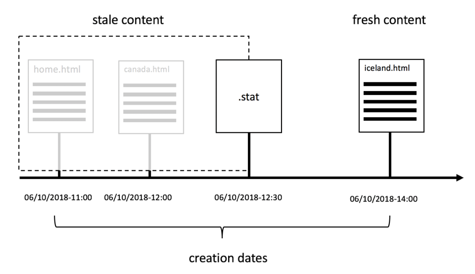

# 第1章- Dispatcher Concepts、Patterns和Antipatterns

## 概覽

本章簡要介紹了Dispatcher的歷史和機制，並討論了它如何影響開發人員設AEM計其元件。

## 開發人員為何應該關心基礎架構

Dispatcher是大多數安裝的重要部分，即使不是所有安裝AEM也是。 您可以找到許多討論如何配置Dispatcher以及提示和秘訣的線上文章。

但是，這些細節總是從非常技術性的層面開始——假設您已經知道自己要做什麼，因此只提供了有關如何實現所需內容的詳細資訊。 我們從未找到任何概念性檔案，其中描述&#x200B;_的內容，以及為什麼_&#x200B;涉及到您可以和不能對調度程式執行什麼操作。

### 反模式：Dispatcher as an Afterthoud

由於缺乏基本資訊，我們在許多專案中看到了許多反AEM常現象：

1. Dispatcher安裝在Apache Web伺服器中時，它是項目中「Unix gods」的作業，用於配置它。 「凡人皆有的java開發人員」不需要擔心。

2. Java開發人員需要確保其程式碼正常運作……調度程式稍後會神奇地快速完成。 調度員總是事後才想到的。 但是，這並不奏效。 開發人員必須在設計程式碼時，考慮到發送器。 他需要知道它的基本概念才能做到。

### 「先讓它起作用，再讓它快速起作用」並非總是正確的

您可能聽到程式設計建議&#x200B;_&quot;先讓它起作用——然後讓它快速運作。&quot;_. 這並非完全錯誤。 但是，若沒有正確的上下文，則往往會誤讀，無法正確套用。

建議應避免開發人員過早地最佳化程式碼，而此程式碼可能永遠無法執行，或極少執行，以至於最佳化無法產生足夠的影響，以證明投入最佳化的努力是合理的。 此外，優化還會導致代碼更複雜，從而引入錯誤。 因此，如果您是開發人員，請不要花太多時間在微量最佳化每一行程式碼上。 只要確定您選擇了正確的資料結構、演算法和程式庫，然後等待設定器的熱點分析，以瞭解更徹底的最佳化可提升整體效能。

### 建築決策與文物

然而，在「建築」決策方面，「先讓它起作用，然後讓它快速起作用」的建議是完全錯誤的。 什麼是建築決策？ 簡言之，它們是代價高昂、難度大和／或不可能事後改變的決定。 請記住，「昂貴」有時與「不可能」相同。  例如，當您的專案預算不足時，就無法進行昂貴的變更。 基礎設施的改變，是人們首先想到的那種改變。 但還有另一種「建築」文物，它們可能變得非常令人討厭：

1. 應用程式「中心」中的程式碼片段，許多其他片段都依賴它。 要更改這些依賴項，需要一次更改並重新測試所有依賴項。

2. 在非同步的、與時間相關的情形中，會出現不自然現象，因此系統的行為可能會非常隨機。 變更可能產生無法預測的效果，而且很難測試。

3. 在系統的所有部分和部分中反複使用和重複使用的軟體模式。 如果軟體模式被證明為次優，則需要重新編碼使用該模式的所有偽像。

記憶? 在本頁最上方，我們說Dispatcher是應用程式的必備部AEM分。 存取Web應用程式是非常隨機的——使用者在無法預測的時間來來去。 最後——所有內容都將（或應該）快取到Dispatcher中。 因此，如果您密切注意，您可能已經意識到，快取可以被視為「架構」工件，因此應該被團隊的所有成員、開發人員和管理員所理解。

我們並不是說開發人員應實際配置Dispatcher。 他們需要知道這些概念，特別是邊界，以確保Dispatcher也能利用其代碼。

Dispatcher不會自動提高代碼的速度。 開發人員需要在建立其元件時，以Dispatcher為中心。 因此，他需要知道它是如何運作的。

## Dispatcher Caching —— 基本原則

### Dispatcher as Caching Http - Load Balancer

什麼是Dispatcher ，為什麼一開始稱為&quot;Dispatcher&quot;?

Dispatcher是

* 首先是快取

* 反向代理

* Apache httpd webserver的模組，為Apache的通用性添加了AEM相關功能，並與所有其他Apache模組（如SSL或甚至SSI包括，如我們稍後將看到的）順利協作

在網站早期，您預期會有數百位訪客造訪網站。 一個Dispatcher的設定，即「已調度」或平衡了對多個發佈伺服器的請求AEM的負載，且通常已足夠，因此名稱為「Dispatcher」。 但是，現在這種設定已不常使用。

在本文稍後，我們將看到不同的設定調度程式和發佈系統的方法。 首先，讓我們從一些http快取基本功能開始。


*Dispatcher Cache的基本功能*

<br> 

此處將說明調度程式的基本知識。 Dispatcher是簡單的快取反向代理，可接收和建立HTTP請求。 一般的請求／回應週期如下：

1. 使用者要求頁面
2. Dispatcher會檢查，如果它已經有該頁的已呈現版本。 假設這是本頁的第一個請求，而Dispatcher找不到本地快取副本。
3. Dispatcher從Publish系統請求頁面
4. 在「發佈」系統中，頁面由JSP或HTL範本呈現
5. 頁面會傳回給Dispatcher
6. Dispatcher快取該頁
7. Dispatcher會將頁面傳回至瀏覽器
8. 如果再次請求同一頁，則可以直接從Dispatcher快取中提供該頁，而無需在Publish實例上重新渲染該頁。 如此可節省使用者和CPU週期在「發佈」例項上的等待時間。

我們在最後一節討論的是「頁面」。 但是，同樣的方案也適用於其他資源，例如影像、CSS檔案、PDF下載等。

#### 資料的快取方式

Dispatcher模組利用托管Apache伺服器提供的功能。 HTML頁面、下載和圖片等資源會儲存為Apache檔案系統中的簡單檔案。 就是這麼簡單。

檔案名稱是由所請求資源的URL衍生而來。 如果您請求檔案`/foo/bar.html`，它將儲存在例如/`var/cache/docroot/foo/bar.html`下。

原則上，如果所有檔案都被快取並因此靜態儲存在Dispatcher中，則可以提取Publish系統的插件，Dispatcher將充當簡單的Web伺服器。 但這只是為了說明原則。 現實生活更複雜。 您無法快取所有內容，而且快取永遠不會完全「完整」，因為由於轉換程式的動態性質，資源數量可能是無限的。 靜態檔案系統的模型有助於生成調度程式功能的概要圖。 AND它有助於解釋調度程式的限制。

#### URL結AEM構與檔案系統映射

要更詳細地瞭解Dispatcher，讓我們重新訪問簡單示例URL的結構。  讓我們看下面的例子，

`http://domain.com/path/to/resource/pagename.selectors.html/path/suffix.ext?parameter=value&amp;otherparameter=value#fragment`

* `http` 表示協定

* `domain.com` 是域名

* `path/to/resource` 是資源儲存在CRX中的路徑，隨後儲存在Apache伺服器的檔案系統中

從這開始，檔案系統和Apache檔案系統之間AEM的情況略有不同。

在AEM,

* `pagename` 是資源標籤

* `selectors` 代表Sling中使用的數個選擇器，以決定如何轉譯資源。URL可以有任意數量的選擇器。 它們以句號分隔。 例如，選擇器區段可以是&quot;french.mobile.fancy&quot;。 選擇器應僅包含字母、數字和破折號。

* `html` 作為「選擇器」的最後一個名稱稱為副檔名。InAEM/Sling也會部分決定轉換指令碼。

* `path/suffix.ext` 是類似路徑的運算式，可以是URL的尾碼。它可用於指令碼AEM中，以進一步控制資源的呈現方式。 稍後，我們將提供有關此部分的整節。 目前，您應該已經知道，您可以將它當做其他參數使用。 字尾必須有副檔名。

* `?parameter=value&otherparameter=value` 是URL的查詢區段。它用於將任意參數傳遞到AEM。 無法快取含參數的URL，因此參數應限制為絕對必要的情況。

* `#fragment`，則URL的片段部分不會傳遞AEM給，而只會在瀏覽器中使用；在JavaScript架構中，選擇「路由參數」或跳至頁面上的特定部分。

在Apache（*參考下圖*）中，

* `pagename.selectors.html` 用作快取檔案系統中的檔案名。

如果URL有尾碼`path/suffix.ext`，則

* `pagename.selectors.html` 建立為資料夾

* `path` 資料夾中的文 `pagename.selectors.html` 件夾

* `suffix.ext` 是資料夾中的 `path` 檔案。注意：如果尾碼沒有副檔名，則不快取檔案。


*從Dispatcher獲取URL後的檔案系統佈局*

<br> 

#### 基本限制

URL、資源和檔案名稱之間的對應相當簡單。

不過，你可能注意到一些陷阱，

1. URL可能變長。 在本地檔案系統上添加`/docroot`的「路徑」部分可能很容易超出某些檔案系統的限制。 在Windows上的NTFS中運行Dispatcher可能是個難題。 但是，Linux是安全的。

2. URL可包含特殊字元和變母。 對於調度程式來說，這通常不是問題。 但請記住，URL會在應用程式的許多地方進行解譯。 我們經常會看到應用程式的奇怪行為，只是為了找出其中一個很少使用（自訂）的程式碼並未完整測試特殊字元。 如果可以的話，你應該避開他們。 如果不能，請規劃徹底測試。

3. 在CRX中，資源具有子資源。 例如，一個頁面會有許多子頁面。 由於檔案系統具有檔案或資料夾，因此在檔案系統中無法匹配。

#### 未快取副檔名的URL

URL永遠必須有副檔名。 雖然您可以提供URL，但不含副AEM檔名。 這些URL不會快取在Dispatcher中。

**範例**

`http://domain.com/home.html` 可高速 **快取**

`http://domain.com/home` 無 **法快取**

當URL包含尾碼時，也會套用相同的規則。 尾碼需要有一個可快取的副檔名。

**範例**

`http://domain.com/home.html/path/suffix.html` 可高速 **快取**

`http://domain.com/home.html/path/suffix` 無 **法快取**

您可能會想，如果資源部分沒有副檔名，但尾碼有一個副檔名，會發生什麼情況？ 那麼，在這個例子中，URL根本沒有尾碼。 請看下一個範例：

**範例**

`http://domain.com/home/path/suffix.ext`

`/home/path/suffix`是資源的路徑……因此URL中沒有尾碼。

**結論**

請始終為路徑和尾碼添加副檔名。 有搜尋引擎最佳化(SEO)意識的人有時會辯稱，這會讓您在搜尋結果中排名偏低。 但未快取的頁面會超慢，排名會更低。

#### 衝突的尾碼URL

請考慮您有兩個有效的URL

`http://domain.com/home.html`

和

`http://domain.com/home.html/suffix.html`

它們絕對有效AEM。 在您的本機開發機器上（沒有Dispatcher），您不會發現任何問題。 在UAT或負載測試中，您很可能也不會遇到任何問題。 我們面臨的問題非常微妙，以至於它在大多數測試中都漏掉了。  當您處於高峰時段時，它會給您帶來沈重的打擊，而且您的解決時間會有限，可能無法存取伺服器，也無法修正它。 我們去過……

所以……有什麼問題？

`home.html` 檔案系統中的檔案可以是檔案或資料夾。不同於同一時間AEM。

如果您先請求`home.html`，則會將其建立為檔案。

對`home.html/suffix.html`的後續請求返回有效結果，但由於檔案`home.html` &quot;blocks&quot;檔案在檔案系統中的位置，因此無法再次建立`home.html`作為資料夾，因此`home.html/suffix.html`不被快取。


*檔案系統中的檔案阻止位置防止子資源被快取*

<br> 

如果您以相反的方式來循環，則首先請求`home.html/suffix.html`，然後`suffix.html`會先快取至資料夾`/home.html`下。 但是，當您隨後請求`home.html`作為資源時，此資料夾將被刪除並替換為檔案`home.html`。


*將父項作為資源讀取時刪除路徑結構*

<br> 

因此，快取結果完全是隨機的，並視傳入請求的順序而定。 更棘手的是，您通常有多個調度程式。 而且，效能、快取命中率和行為可能不同於一個Dispatcher。 如果您想瞭解網站為何沒有回應，請務必確定您查看的Dispatcher是否正確且有不良的快取順序。 如果您正在尋找Dispatcher，但幸運的是，它擁有更有利的請求模式，您將迷失於尋找問題。

#### 避免衝突的URL

當您使用不同的副檔名作為資源時，您可以避免「衝突的URL」，即檔案系統中相同路徑的資料夾名稱和檔案名「競爭」。

**範例**

* `http://domain.com/home.html`

* `http://domain.com/home.dir/suffix.html`

兩者都完全可以快取，


在請求尾碼或完全避免使用尾碼時，為資源選擇專用的擴展&quot;dir&quot;。 在很少的情況下，它們會派上用場。 而且很容易正確實施這些案例。  如我們在下一章中討論快取失效和刷新時所見。

#### 不可執行的請求

讓我們來回顧一下最後一章的快速摘要，再看一些例外情況。 如果URL配置為可快取，並且是GET請求，則Dispatcher可以快取它。 無法在下列其中一個例外情況下快取。

**可快取的請求**

* 請求配置為可在Dispatcher配置中進行快取
* 請求是純GET請求

**不可快取的請求或響應**

* 依設定拒絕快取的請求（路徑、模式、MIME類型）
* 傳回&quot;Dispatcher:no-cache&quot;標頭
* 傳回「快取控制：no-cache|private&quot;標題
* 傳回&quot;Pragma:no-cache&quot;標頭
* 具有查詢參數的請求
* 無副檔名的URL
* 副檔名不為的URL
* 傳回200以外之狀態代碼的回應
* POST請求

## 使快取失效和刷新

### 概覽

最後一章列出了當Dispatcher無法快取請求時的大量例外。 但還有更多事情要考慮：僅僅因為Dispatcher _可以_&#x200B;快取請求，它並不一定表示它&#x200B;_應該_。

重點是：快取通常很簡單。 Dispatcher只需儲存響應的結果，並在下次收到完全相同的請求時返回。 右? 錯！

難點部分是快取的&#x200B;_失效_&#x200B;或&#x200B;_flushing_。 Dispatcher需要查明資源何時更改，並需要重新呈現。

乍一看，這似乎是一項微不足道的任務……但事實並非如此。 進一步閱讀，您將會發現單一資源和簡單資源與依賴高度網狀結構的多個資源的頁面之間有一些棘手的差異。

### 簡單資源與沖洗

我們已設定系統，以AEM在要求時使用特殊的「縮圖」選擇器，動態建立每張影像的縮圖轉譯：

`/content/dam/path/to/image.thumb.png`

此外，我們也提供URL，以提供無選擇器的URL給原始影像：

`/content/dam/path/to/image.png`

如果我們同時下載縮圖和原始影像，我們最終會得到類似，

```
/var/cache/dispatcher/docroot/content/dam/path/to/image.thumb.png

/var/cache/dispatcher/docroot/content/dam/path/to/image.png
```

Dispatcher的檔案系統。

現在，使用者會上傳並啟動該檔案的新版本。 最終，失效請求會從發送AEM到Dispatcher,

```
GET /invalidate
invalidate-path:  /content/dam/path/to/image

<no body>
```

失效很簡單：對Dispatcher上特殊「/invalidate」 URL的簡單GET請求。 不需要HTTP-body,「有效載荷」只是「無效路徑」標題。 另請注意，標頭中的無效路徑是知道的資源，AEM而不是Dispatcher已快取的檔案或檔案。 只AEM知道資源。 請求資源時，會在執行時期使用擴充功能、選擇器和字尾。 不執AEM行任何有關資源上已使用哪些選擇器的記賬，因此，在激活資源時，資源路徑是它所知道的所有確定路徑。

就我們而言，這就足夠了。 如果資源已經更改，我們可以放心地假設該資源的所有轉譯也已更改。 在我們的範例中，如果影像已變更，也會呈現新的縮圖。

Dispatcher可以安全地刪除其已快取的所有轉譯的資源。 它會做些什麼，

`$ rm /content/dam/path/to/image.*`

移除`image.png`和`image.thumb.png`，以及與該模式相符的所有其他轉譯。

確實非常簡單……只要您只使用一個資源來回應請求。

### 參照和網格化內容

#### 網格化內容問題

與上傳到的影像或其他二進位檔案相AEM比，HTML頁面並非孤立的動物。 它們生活在群組中，並且通過超連結和引用彼此高度互連。 簡單的連結是無害的，但當我們討論內容參考時，它會變得棘手。 頁面上隨處可見的頂端導覽或預告是內容參考。

#### 內容參考及其成因

讓我們來看一個簡單的例子。 旅行社有一個網頁，宣傳去加拿大旅遊。 此促銷活動會在另外兩頁的摘要章節（「首頁」和「冬季特惠」頁面）中加以顯示。

由於這兩個頁面都顯示相同的摘要，因此要求作者針對每個應顯示的頁面建立摘要多次時間是不必要的。 相反地，目標頁面&quot;Canada&quot;會保留頁面屬性中的一個區段，以提供摘要的資訊，或是最好提供一個URL，以完全呈現該摘要：

`<sling:include resource="/content/home/destinations/canada" addSelectors="teaser" />`

或

`<sling:include resource="/content/home/destinations/canada/jcr:content/teaser" />`


只AEM有這個功能有魅力，但如果您在「發佈」例項中使用Dispatcher，就會發生奇怪的事。

試想一下，您已發佈您的網站。 您「加拿大」頁面上的標題為「加拿大」。 當訪客要求您的首頁時（該首頁有該頁面的摘要參考）,「加拿大」頁面上的元件會呈現類似

```
<div class="teaser">
  <h3>Canada</h3>
  
</div>
```

** 進入首頁。首頁由Dispatcher以靜態。html檔案形式儲存，包括摘要及其標題在檔案中。

現在，行銷人員已瞭解到摘要標題應該是可操作的。 因此，他決定將標題從「加拿大」改為「造訪加拿大」，並更新影像。

他出版編輯過的「加拿大」頁面，並重新造訪先前發佈的首頁，以檢視其變更。 但是，這裡沒有什麼變化。 它仍會顯示舊版摘要。 他連連查&quot;冬季特惠&quot; 以前從未請求過該頁，因此不會在Dispatcher中靜態快取該頁。 因此，本頁面由Publish新轉譯，而此頁面現在包含新的「Visit Canada」摘要。


*將過時內含內容儲存在首頁的發送器*

<br> 

怎麼了？ Dispatcher儲存包含所有內容和標籤的頁面的靜態版本，這些內容和標籤在渲染時已從其他資源中繪製。

Dispatcher只是基於檔案系統的Web伺服器，速度快，但也相對簡單。 如果包含的資源發生了變化，它並沒有意識到這一點。 它仍會依附於轉譯包含頁面時的內容。

「冬季特別計畫」頁尚未呈現，因此Dispatcher上沒有靜態版本，因此將隨新摘要一起顯示，因為新摘要將在請求時重新呈現。

您可能認為，當資源發生更改時，Dispatcher會在渲染和刷新已使用此資源的所有頁時跟蹤它接觸的每個資源。 但Dispatcher不會呈現頁面。 演算由「發佈」系統執行。 Dispatcher不知道轉譯的。html檔案中會包含哪些資源。

還是不相信？ 您可能認為&#x200B;*&quot;必須有一種方式來實施某種相依性追蹤&quot;*。 這裡有，或者更準確的是&#x200B;*was* 公報3，曾曾祖父在&#x200B;_AEMsession_&#x200B;中實施了一個扶養追蹤器，用於轉譯頁面。

在請求期間，透過此作業取得的每個資源都會被追蹤為目前呈現之URL的相依性。

但事實證明，追蹤這些依賴項非常昂貴。 人們很快發現，如果完全關閉相依性追蹤功能，並依賴在變更一個html頁面後重新轉譯所有html頁面，網站的速度會更快。 此外，這一計畫也並不完美——在路上有許多陷阱和例外。 在某些情況下，您不是使用請求預設工作階段來取得資源，而是使用管理工作階段來取得一些輔助資源來呈現請求。 這些相依性通常不會受到追蹤，並導致操作團隊的頭痛和電話要求手動刷新快取。 如果他們有標準的程式，你就很幸運了。 路途上還有很多疑問，但是……讓我們別再回憶了。 這可以追溯到2005年。 最終，《公報》第4版預設取消了該功能，但它沒有讓它回到後續的CQ5中AEM。

### 自動失效

#### 當完全刷新比依賴性跟蹤更便宜時

由於CQ5，我們完全依賴於在其中一個頁面變更時，使整個網站無效。 此功能稱為「自動失效」。

但是，拋棄和重新轉換數百頁的成本，又怎麼能比進行適當的依賴追蹤和部分重新轉換成本更低呢？

有兩個主要原因：

1. 在一般網站上，通常只會要求一小部分頁面。 因此，即使您扔掉所有轉譯的內容，事後也只會立即要求幾十個內容。 頁面的長尾可以隨著時間而分發，而實際上是要求它們的。 因此，實際上，演算頁面的負載並沒有您預期的高。 當然，總有例外……我們稍後將討論如何處理大型網站（含空的Dispatcher快取）上平均分佈的負載。

2. 所有頁面仍由主導覽連接。 因此，幾乎所有頁面最終都是互相依賴的。 這意味著，即使是最聰明的依賴性追蹤器，也會發現我們已經知道的：如果其中一個頁面變更，您必須使其他所有頁面無效。

你不相信？ 讓我們來說明最後一點。

我們使用與上個範例相同的引數，並加上參照遠端頁面內容的預告器。 直到現在，我們還在用一個更極端的例子：自動轉譯的主導覽。 如同摘要一樣，導覽標題會從連結或「遠端」頁面擷取，做為內容參考。 遠端導覽標題不會儲存在目前轉譯的頁面中。 您應記住，導覽會呈現在您網站的每個頁面上。 因此，在所有具有主導覽功能的頁面上，會一而再、再而三地使用一個頁面的標題。 如果您想要變更導覽標題，您只想在遠端頁面上執行此動作一次，而不是在每個參照該頁面的頁面上執行。

因此，在我們的範例中，導覽會使用目標頁面的「NavTitle」在導覽中演算名稱，以將所有頁面網格化在一起。 「冰島」的導覽標題是從「冰島」頁面擷取，並呈現至每個具有主導覽功能的頁面。


*主導覽不可避免地會拖曳其「NavTitles」，將所有頁面的內容整合在一起*

<br> 

如果您將冰島頁面上的NavTitle從「Iceland」變更為「Beautiful Iceland」，則標題會立即在所有其他頁面的主功能表上變更。 因此，在變更前轉譯和快取的頁面都會變舊，而且必須失效。

#### 自動失效的實施方式：.stat檔案

現在，如果您有大型網站，有數千個頁面，則需要相當長的時間來循環瀏覽所有頁面，並實際刪除這些頁面。 在此期間，Dispatcher可能無意中提供過時內容。 更糟糕的是，在存取快取檔案時可能會發生一些衝突，可能會在頁面正被刪除時提出要求，或是頁面在立即啟動後再次失效而再次被刪除。 想想看，這會是多麼糟糕。 幸運的是，事情並非如此。 Dispatcher使用一種巧妙的技巧來避免：當發佈檔案時，它不會刪除數百個檔案，而是將一個簡單、空的檔案放在檔案系統的根目錄中，因此所有從屬檔案都被視為無效。 此檔案稱為「statfile」。 statfile是空檔案——關於statfile的重要之處在於其建立日期。

調度程式中建立日期早於statfile的所有檔案在上次激活（和失效）之前都已呈現，因此被視為「無效」。 它們仍然在檔案系統中實際存在，但Dispatcher會忽略它們。 他們「過時」了。 每當向過時資源發出請求時，Dispatcher會要求AEM系統重新呈現頁面。 然後，新呈現的頁面會儲存在檔案系統中——現在有新的建立日期，它又重新刷新了。



*.stat檔案的建立日期會定義哪些內容過時，哪些內容是最新的*

<br> 

您可能會問為什麼稱為&quot;。stat&quot;? 也許&quot;無效&quot;? 您可以想像，將該檔案放在檔案系統中有助於Dispatcher確定哪些資源可以&#x200B;*靜態*&#x200B;得到服務——就像從靜態Web伺服器中提供的資源一樣。 這些檔案不再需要動態呈現。

然而，這個名字的真實性質，並不是暗喻。 它源自Unix系統調用`stat()` ，該調用返回檔案的修改時間（以及其他屬性）。

#### 混合簡單與自動驗證

但是，稍早我們說過，單一資源被實際刪除。 現在，我們說，更新的statfile實際上會讓Dispatcher眼中的這些檔案無效。 那麼，為什麼首先刪除實體？

答案很簡單。 您通常同時使用兩種策略——但是用於不同種類的資源。 二進位資產，例如影像是獨立的。 它們與其他資源的聯繫，並不是因為他們需要提供資訊。

而HTML網頁則高度相依。 因此，您應對這些應用自動失效。 這是Dispatcher中的預設設定。 屬於無效資源的所有檔案都會物理刪除。 此外，以&quot;。html&quot;結尾的檔案會自動失效。

Dispatcher決定是否應用自動失效方案。

可配置自動失效的檔案尾。 理論上，您可以包含所有自動失效的擴充功能。 但請記住，這是一個非常高的代價。 您不會無意中傳送過時資源，但傳送效能會因過度失效而大幅降低。

例如，您實作的方案會動態呈現PNG和JPG，並依賴其他資源來執行。 您可能想要將高解析度影像重新縮放為較小的Web相容解析度。 雖然您還在調整壓縮率。 此示例中的解析度和壓縮率不是固定常數，而是使用映像的元件中的可配置參數。 現在，如果此參數已變更，您必須使影像無效。

沒問題——我們剛才知道，我們可以將影像加入自動失效，而且每當有任何改變時，都會有新呈現的影像。

#### 《把嬰兒和洗澡水一起扔出去》

沒錯，這是個大問題。 再次閱讀最後一段。 「...每當有任何改變時，都可產生新的影像。」 如您所知，一個好的網站會不斷變化；在此處新增內容、更正錯字、在其他地方調整摘要。 這表示您的所有影像都會持續失效，而且需要重新轉譯。 別低估這個。 動態演算和傳輸影像資料可在本機開發機器上以毫秒為單位運作。 您的生產環境需要以每秒一百倍的頻率完成這項工作。

讓我們在這裡清楚一點，當html頁面變更時，您的jpg必須重新轉譯，反之亦然。 只有一個檔案「儲存桶」可自動失效。 它整體上被衝了。 沒有辦法進一步細化。

自動失效預設為&quot;。html&quot;有充分的理由。 目標是盡量把桶子留得小。 不要把嬰兒和洗澡水一起扔出去，只是讓一切變得無效——只是為了在安全的一面。

自成一體的資源應該按照該資源的路徑提供。 這對失效有很大幫助。 保持簡單，不要建立映射方案，如&quot;resource /a/b/c&quot; is served from &quot;/x/y/z&quot;。 讓您的元件使用預設Dispatcher的自動失效設定。 請勿嘗試修復Dispatcher中設計不良且過度失效的元件。

##### 自動失效的例外：ResourceOnly失效

Dispatcher的失效請求通常由複製代理從Publish系統引發。

如果您對相依性非常有信心，可以嘗試構建自己的失效複製代理。

要說明細節，本指南可能有些不妥，但我們至少要給您一些提示。

1. 真正瞭解您在做什麼。 要正確進行失效真的很困難。 這就是自動失效如此嚴格的原因之一；以避免傳送過時內容。

2. 如果您的代理髮送HTTP-header `CQ-Action-Scope: ResourceOnly`，表示此單一失效請求不會觸發自動失效。 此([https://github.com/cqsupport/webinar-dispatchercache/tree/master/src/refetching-flush-agent/refetch-bundle](https://github.com/cqsupport/webinar-dispatchercache/tree/master/src/refetching-flush-agent/refetch-bundle))代碼片段可能是您自己的複製代理的好起點。

3. `ResourceOnly`，則僅防止自動失效。要實際執行必要的相關性解決和無效，您必須自己觸發失效請求。 您可能想檢查軟體包Dispatcher刷新規則([https://adobe-consulting-services.github.io/acs-aem-commons/features/dispatcher-flush-rules/index.html](https://adobe-consulting-services.github.io/acs-aem-commons/features/dispatcher-flush-rules/index.html))，以瞭解如何實際發生此情況。

我們不建議您建立相依性解決方案。 我們的努力太多，收益也太少——正如以前所說，你會犯錯的人太多。

相反，您應該瞭解哪些資源不依賴於其他資源，並且可以在不自動失效的情況下失效。 不過，您不必為此使用自定義複製代理。 只需在Dispatcher配置中建立自定義規則，將這些資源排除在自動失效之外。

我們說主導覽器或預覽器是互依關係的來源。 好吧——如果您以非同步方式載入導覽和預告，或在Apache中將其加入SSI指令碼，您就不需要追蹤這些預告。 在本文稍後的章節中，我們將詳細說明非同步載入元件，當我們討論&quot;Sling Dynamic Includes&quot;時。

同樣的道理也適用於快顯視窗或載入燈箱的內容。 這些片段也很少有導覽（亦即「相依性」），而且可以作為單一資源失效。

## 以Dispatcher為中心構建元件

### Dispatcher Mechanics在現實案例中的應用

在最後一章中，我們介紹了Dispatcher的基本機制、它的一般運作方式以及限制。

現在，我們想將這些力學應用到您很可能在項目需求中找到的一類元件上。 我們會刻意挑選元件，以展示您日後也會面臨的問題。 不要害怕——並非所有要素都需要我們提出的那樣多的考慮。 但是，如果你認為有必要建立這樣的一個元件，你就很清楚後果，並知道如何處理。

### 假離線元件(Anti)模式

#### 互動式影像元件

讓我們說明具有互連二進位檔案的元件的通用模式（或反模式）。 我們將建立「respi」元件——用於「自適應影像」。 此元件應能將顯示的影像調整至所顯示的裝置。 在桌上型電腦和平板電腦上，它可顯示影像的完整解析度、在手機上以窄幅裁切的較小版本顯示影像，或甚至是完全不同的主題（在互動式世界中，這稱為「藝術方向」）。

資產上傳至回應式影像元AEM件中的DAM區域，且僅&#x200B;_referenced_。

響應元件同時處理標籤的渲染和二進位影像資料的發送。

我們在這裡實施它的方式是在許多項目中看到的一個共同模式，甚至其中一個核AEM心元件也基於這種模式。 因此，身為開發人員的您很可能會改變這種模式。 在封裝方面，它有其最好的點，但要使其適用於Dispatcher，它需要花費大量的精力。 我們稍後將討論幾種解決問題的方法。

我們稱這裡使用的模式為「假離線模式」，因為問題可以追溯到公報3的早期，當時有一種方法叫做「假離線」，可以用資源將二進位原始資料流入響應。

原始術語「假離線」實際上是指共用慢速離線外圍設備，如打印機，因此無法在此處正確應用。 但我們還是喜歡這個詞，因為在網路世界中，這個詞很少有區別。 而且每個模式都應該有一個可區分的名稱，對吧？ 這要由你決定是一種模式還是一種反模式。

#### 實施

以下是我們的自適應影像元件的實作方式：

該構件分為兩部分：第一部分會轉譯影像的HTML標籤，第二部分則會「線軸」參照影像的二進位資料。 由於這是具有互動式設計的現代網站，我們不會轉換簡單的``標籤，而是在`<picture/>`標籤中轉換一組影像。 對於每個裝置，我們會將兩張不同的影像上傳至DAM，並從我們的影像元件參照這些影像。

此元件有三個轉譯指令碼（在JSP、HTL或Servlet中實作），每個轉譯指令碼都由專用選擇器處理：

1. `/respi.jsp` -沒有選擇器可轉換HTML標籤
2. `/respi.img.java` 轉換案頭版本
3. `/respi.img.mobile.java` 來轉換行動版本。


元件會置於首頁的參數中。 CRX中生成的結構如下所示。


*CRX中自適應影像的資源結構*

<br> 

元件標籤會如此呈現，

```plain
  #GET /content/home.html

  <html>

  …

  <div class="responsive-image>

  <picture>
    <source src="/content/home/jcr:content/par/respi.img.mobile.jpg" …/>
    <source src="/content/home/jcr:content/par/respi.img.jpg …/>

    …

  </picture>
  </div>
  …
```

然後……我們用封裝得很精密的元件完成了。

#### 互動式影像元件的實際運作

現在，使用者會透過Dispatcher要求頁面和資產。 這將導致Dispatcher檔案系統中的檔案，如下圖所示：


*封裝的響應式影像元件的快取結構*

<br> 

請考慮使用者上傳兩張花卉影像並啟動新版本至DAM。 AEM將根據失效請求發送

`/content/dam/flower.jpg`

和

`/content/dam/flower-mobile.jpg`

調度器。 然而，這些要求是徒勞的。 內容已快取為元件子結構下方的檔案。 這些檔案現在已過時，但仍會依要求提供。


*結構不匹配導致過時內容*

<br> 

這一方針還有另一個警告。 請考慮在多個頁面上使用相同的flower.jpg。 然後，您會在多個URL或檔案下快取相同的資產，

```
/content/home/products/jcr:content/par/respi.img.jpg

/content/home/offers/jcr:content/par/respi.img.jpg

/content/home/specials/jcr:content/par/respi.img.jpg

…
```

每次請求新的未快取頁面時，會從不同的URL擷取AEM資產。 沒有Dispatcher快取和瀏覽器快取可加速傳送。

#### 假離線模式放在哪裡

有一個自然的例外，即使以簡單的形式，這種模式也很有用：如果二進位檔案儲存在元件本身中——而不是儲存在DAM中。 不過，這隻適用於網站上使用過一次的影像，而不是將資產儲存在DAM中，表示您很難管理資產。 想像一下，您針對特定資產的使用授權已用完。 您如何得知您已使用資產的元件？

看到沒？ DAM中的「M」代表「管理」，就像數位資產管理一樣。 你不想把那個功能給我。

#### 結論

從開發AEM人員的角度看，這種圖樣看起來非常優雅。 但是，如果把Dispatcher納入到這個等式中，你可能會同意，天真的做法可能不夠。

現在，由您決定這是一種模式還是一種反模式。 或許您已經有一些好的想法，想要如何減輕上述問題？ 很好。 那麼，你將迫切希望看到其他項目是如何解決這些問題的。

### 解決常見的Dispatcher問題

#### 概覽

讓我們來談談如何讓它更易於快取。 有幾種選擇。 有時候，您無法挑選最佳解決方案。 您可能進入已執行的專案，而且預算有限，只能解決手邊的「快取問題」，而不足以完全重構。 或者，您會面臨一個問題，這比範例影像元件更複雜。

以下幾節將概述這些原則和注意事項。

同樣，這是基於現實經驗。 我們已經看到了野外所有的這些規律，所以它不是一種學術活動。 這就是為什麼我們向你們展示一些反模式，因此你們有機會從別人已經犯的錯誤中吸取教訓。

#### 快取殺手

>[!WARNING]
>
>這是反模式。 不要使用它。 永遠。

您有沒有看過像`?ck=398547283745`這樣的查詢參數？ 它們稱為快取殺手(「ck」)。 其思想是，如果添加任何查詢參數，則不會快取資源。 此外，如果您新增隨機數作為參數值（例如&quot;398547283745&quot;）,URL將變為唯一，並且您確定，系統和螢幕之間的其他快取AEM也無法快取。 通常的中間人懷疑是Dispatcher、CDN或甚至瀏覽器快取之前的「清漆」快取。 同樣：別這樣。 您確實希望盡可能多地快取您的資源。 快取是你的朋友。 別殺朋友。

#### 自動失效

>[!WARNING]
>
>這是反模式。 避免將它用於數位資產。 請嘗試保留Dispatcher的預設配置，該配置>僅對&quot;。html&quot;檔案自動失效

在短期內，您可以將&quot;。jpg&quot;和&quot;。png&quot;新增至Dispatcher中的自動失效設定。 這表示，每當發生失效時，所有&quot;。jpg&quot;、&quot;。png&quot;和&quot;。html&quot;都需要重新呈現。

如果企業主抱怨他們的變更在即時網站上發生得不夠快，這種模式就很容易實施。 但這只能為您爭取一些時間，來設計更精巧的解決方案。

請務必瞭解對效能的巨大影響。 這會大幅降低您的網站速度，甚至會影響網站的穩定性——如果您的網站是高負載且經常變更的網站——例如新聞入口網站。

#### URL指紋

URL指紋看起來像是快取殺手。 但事實並非如此。 它不是隨機數，而是資源內容的特徵值。 這可以是資源內容的雜湊，或者更簡單的，是資源上傳、編輯或更新時的時間戳記。

Unix時間戳記非常適合實際實作。 為了提高可讀性，我們在本教學課程中使用了更易讀的格式：`2018 31.12 23:59 or fp-2018-31-12-23-59`。

指紋不能用作查詢參數，作為具有查詢參數的URL   無法快取。 您可以使用選取器或指紋的字尾。

假設`/content/dam/flower.jpg`檔案的日期`jcr:lastModified`為2018年12月31日，23:59。 具有指紋的URL為`/content/home/jcr:content/par/respi.fp-2018-31-12-23-59.jpg`。

只要參考的資源(`flower.jpg`)檔案未變更，此URL就會維持穩定。 因此，它可以無限時間進行快取，而不是快取殺手。

請注意，此URL必須由回應式影像元件建立並提供。 它不是現成可用的功AEM能。

這就是基本概念。 不過，有些細節很容易被忽視。

在我們的範例中，元件是在23:59轉譯並快取。 現在影像已經變更，假設是00:00。  元件&#x200B;_would_&#x200B;在其標籤中生成新的指紋URL。

您可能認為它&#x200B;_應_...但它沒有。由於只變更了影像的二進位元，而未接觸包含頁面，因此不需要重新轉換HTML標籤。 因此，Dispatcher使用舊指紋為頁面提供服務，從而提供舊版影像。


*比參考影像更近的影像元件，沒有產生新的指紋。*

<br> 

現在，如果您重新啟動首頁（或該網站的任何其他頁面），則statfile將會更新，Dispatcher會考慮home.html過時，並在影像元件中重新呈現新的指紋。

但我們沒有啟動首頁，對吧？ 為什麼我們應該啟動一個未觸碰的頁面？ 此外，我們可能沒有足夠的權限來啟動頁面，或是核准工作流程太長且耗時，所以我們無法在短時間內完成。 那麼，該怎麼辦？

#### 懶惰管理員的工具——降低狀態檔案層級

>[!WARNING]
>
>這是反模式。 只需在短期內使用它，就能贏得一些時間，並想出更精巧的解決方案。

懶惰管理員通常&quot;_將自動失效設定為jpgs，並將statfile級別設定為零——始終有助於處理所有類型的快取問題_。&quot; 在技術論壇中，您會發現這一建議，並協助您解決失效問題。

到目前為止，我們還沒討論過靜態檔案級別。 基本上，自動失效只適用於同一子樹中的檔案。 但問題是頁面和資產通常不在相同的子樹狀結構中。 頁面位於`/content/mysite`下方，而資產則位於`/content/dam`下方。

「statfile level」定義子樹的根節點深度。 在上述範例中，層級為&quot;2&quot;(1=/content, 2=/mysite,dam)

將statfile級別「降低」到0的思想基本上是將整個/content樹定義為一個子樹，並且只將頁面和資產生活在同一自動失效域中。 因此，我們只能在大樹的層級上（在docroot &quot;/&quot;）。 但是，每當有內容發佈時，就會自動讓伺服器上的所有網站失效，甚至是完全不相關的網站。 相信我們：從長遠看，這是個壞主意，因為您會嚴重降低整體快取點擊率。 您只能希望您的伺服器AEM具備足夠的火力，以便在無快取的情況下執行。

稍後，您將瞭解更深入的statfile層級的完整優點。

#### 實作自訂失效代理

無論如何——我們必須以某種方式告訴Dispatcher，如果「.jpg」或「.png」變更，允許以新的URL重新轉譯，則使HTML-Pages失效。

我們在專案中看到的是，例如，每當發佈網站的影像時，發佈系統上會傳送網站失效要求的特殊複製代理。

如果您可以透過命名慣例，從資產路徑衍生網站路徑，這對您有很大幫助。

一般而言，最好搭配網站和資產路徑：

**範例**

```
/content/dam/site-a
/content/dam/site-b

/content/site-a
/content/site-b
```

這樣，當您的自定義Dispatcher Flushing代理遇到`/content/dam/site-a`上的更改時，可以輕鬆地向/content/site-a發送和失效請求。

事實上，您告訴Dispatcher使哪條路徑無效並不重要——只要它位於同一站點，位於同一「子樹」中。 您甚至不需要使用真正的資源路徑。 它也可以是「虛擬」的：

`GET /dispatcher-invalidate
Invalidate-path /content/mysite/dummy`


1. 當DAM中的檔案變更時，會觸發發佈系統上的接聽程式

2. 監聽程式向Dispatcher發送失效請求。 由於自動失效，我們在自動失效中傳送的路徑無關緊要，除非它位於網站的首頁之下，或更精確地位於網站的statfile層級。

3. statfile已更新。

4. 下次要求首頁時，會重新轉譯。 新的指紋／日期取自影像的lastModified屬性，做為其他選擇器

5. 這會隱式建立新影像的參照

6. 如果實際請求映像，則會建立新的格式副本並將其儲存在Dispatcher中


#### 清理的必要性

嘿。 已完成. 天哪！

還不是。

路徑，

`/content/mysite/home/jcr:content/par/respi.img.fp-2018-31-12-23-59.jpg`

與任何已失效的資源無關。 記憶? 我們只是使「虛擬」資源失效，而且依賴自動失效來考慮「家庭」無效。 映像本身可能永遠不會被刪除&#x200B;_physical_。 因此，快取將不斷增長。 當映像被更改和激活時，它們會在Dispatcher的檔案系統中獲得新的檔案名。

無法實際刪除快取檔案並無限期保留檔案有三個問題：

1. 顯然，您正在浪費儲存容量。 沒錯——過去幾年，儲存變得更便宜。 但過去幾年，影像解析度和檔案大小也在增加——視網膜樣的顯示器對清晰銳利的影像十分渴望。

2. 雖然硬碟機已變得更便宜，但「儲存空間」可能也不會變得更便宜。 我們看到一種趨勢，即沒有（便宜）裸機HDD儲存，而是由您的資料中心提供商租用NAS上的虛擬儲存。 這種儲存比較可靠和可擴展，但也比較昂貴。 您可能不想將過時的垃圾儲存起來來浪費它。 這不僅與主儲存有關，還與備份有關。 如果您有現成的備份解決方案，則可能無法排除快取目錄。 最後，您還在備份垃圾資料。

3. 更糟糕的是：您可能僅在限定時間內購買特定影像的使用授權——只要您需要。 現在，如果您在授權到期後仍儲存影像，這可能會被視為侵犯著作權。 您可能不會再在網頁中使用影像，但Google仍會找到。

最後，您會找到一些內部管理cronjob來清理……以前的所有檔案比如說一週時間，讓這種亂七八糟的垃圾得到控制。

#### 濫用URL指紋進行拒絕服務攻擊

但等等，這個解決方案還有一個缺陷：

我們濫用選擇器作為參數：fp-2018-31-12-23-59是動態產生的，是一種「快取殺手」。 但也許有些無聊的孩子（或者搜索引擎爬蟲，已經瘋了）開始請求頁面：

```
/content/mysite/home/jcr:content/par/img.fp-0000-00-00-00-00.jpg
/content/mysite/home/jcr:content/par/img.fp-0000-00-00-00-01.jpg
/content/mysite/home/jcr:content/par/img.fp-0000-00-00-00-02.jpg

…
```

每個請求都會略過Dispatcher，導致載入Publish例項。 而且，更糟糕的是，在Dispatcher上建立一個相應檔案。

因此……您不必只使用指紋作為簡單的快取工具，而必須檢查jcr:lastModified影像日期，如果不是預期日期，則傳回404。 在Publish系統上，這需要一些時間和CPU週期……這是您最初想要避免的。

#### 高頻率版本中URL指紋的注意事項

您不僅可以對來自DAM的資產使用指紋結構描述，也可以對JS和CSS檔案及相關資源使用。

[版本化](https://adobe-consulting-services.github.io/acs-aem-commons/features/versioned-clientlibs/index.html) 的Clientlibs是使用此方法的模組。

但在這裡，您可能會面臨另一個URL指紋的警告：它會將URL系結至內容。 若不變更URL（亦即更新修改日期），則無法變更內容。 這是指紋最初的設計目的。 但請考慮，您即將推出新版本，其中包含新的CSS和JS檔案，以及新的URL和新的指紋。 您的所有HTML頁面仍有舊指紋URL的參考。 因此，若要讓新版本一致運作，您必須一次使所有HTML頁面失效，以強制重新轉譯並參照新指紋的檔案。 如果您有多個網站依賴相同的資料庫，這可能需要大量重新轉換——而您無法在此運用`statfiles`。 因此，請準備好在轉出後，在您的發佈系統上看到負載峰值。 您可以考慮在Dispatcher前面部署藍綠色的快取，或者在Dispatcher前面部署基於TTL的快取……無限可能。

#### 短暫休息

哇，這可是很多細節啊？ 而且，它不容易被理解、測試和調試。 而這一切都是為了一個看似優雅的解決方案。 誠然，它很優雅——但只從AEM唯一的角度。 與Dispatcher一起，這會變得骯臟。

但是，這並不能解決一個基本的警告，如果影像在不同頁面上被多次使用，則會快取到這些頁面下。 這裡的快取協同效應不大。

一般而言，URL指紋識別是工具套件中的好工具，但您必須小心套用，因為它只會造成新的問題，而只會解決現有的問題。

所以……那是一個長篇大論。 但是我們經常看到這種模式，我們覺得有必要給你全貌，有利有弊。 URL指紋可解決假離線模式中的一些固有問題，但實作的工作量相當大，您還需要考慮其他更簡單的解決方案。 我們的建議是，請務必檢查您的URL是否可以根據提供的資源路徑，而且沒有中介元件。 我們將在下一章討論此問題。

##### 執行時期相依性解析

執行時期相依性解決是我們在單一專案中考慮的概念。 但是仔細思考它變得相當複雜，我們決定不實施它。

以下是基本概念：

Dispatcher不知道資源的相依性。 只是一堆檔案，沒有什麼語義。

AEM也對相依性知之甚少。 它缺乏正確的語義或「依賴追蹤器」。

已AEM經知道一些參考。 當您嘗試刪除或移動參考頁面或資產時，會使用此知識來警告您。 刪除資產時，會查詢內部搜尋，以執行此動作。 內容參照確實有特別的表單。 它們是以&quot;/content&quot;開頭的路徑運算式。 因此，它們可以很容易地建立全文索引——並在需要時查詢。

在我們的情況下，我們需要在Publish系統上使用自訂的複製代理，當該路徑變更時，它會觸發對特定路徑的搜尋。

假設

`/content/dam/flower.jpg`

已變更發佈。 工程師會啟動「/content/dam/flower.jpg」搜尋，並尋找參照這些影像的所有頁面。

然後，它可以向Dispatcher發出許多失效請求。 每個包含資產的頁面各一個。

理論上，這應該管用。 但僅適用於第一級相依性。 您不想針對多層級相依性套用此方案，例如在頁面上使用的體驗片段上使用影像時。 事實上，我們認為這種方法過於複雜——並且可能存在運行時問題。 通常最好的建議是不要在事件處理程式中進行昂貴的計算。 特別是搜索成本可能會很高。

##### 結論

我們希望我們已充分討論過「假離線模式」，以幫助您決定何時在您的實施中使用它，而不是使用它。

## 避免Dispatcher問題

### 資源型URL

解決依賴性問題的一個更優雅的方法是完全沒有依賴性。 避免在使用一個資源來代理另一個資源時發生的人工依賴性——如上例中所述。 盡量將資源視為「孤立的」實體。

我們的例子很容易解決：


*使用綁定到映像（而非元件）的servlet假離線映像。*

<br> 

我們使用資產原始資源路徑來呈現資料。 如果我們需要依原樣來呈現原始影像，我們只能使用。預AEM設轉譯器來呈現資產。

如果我們需要對特定元件執行一些特殊處理，我們將在該路徑和選擇器上註冊一個專用的servlet，以代表該元件進行轉換。 我們以&quot;。respi&quot;為榜樣。 選擇器。 最好追蹤全域URL空間（例如`/content/dam`）上使用的選擇器名稱，並有良好的命名慣例以避免命名衝突。

順便說一下，我們沒有發現任何與程式碼一致性有關的問題。 Servlet可定義於與元件sling模型相同的Java套件中。

我們甚至可以在全域空間中使用其他選擇器，例如，

`/content/dam/flower.respi.thumbnail.jpg`

輕鬆吧？ 那為什麼人們會想出像勺子一樣複雜的模式呢？

那麼，由於外部元件對內部資源的渲染貢獻很小，或者資訊很少，所以可以解決內部內容引用避免的問題，它很容易被編碼成一組靜態選擇器來控制孤立資源的表示。

但是，有一類案例是您無法透過資源型URL輕鬆解決的。 我們將此類案例稱為「參數注入元件」，並在下一章中加以討論。

### 參數注入元件

#### 概覽

最後一章中的假離線程式只是資源周圍的一個精簡包裝函式。 它帶來的麻煩比幫助解決問題還多。

我們可以使用簡單選擇器輕鬆取代該包裝，並新增根據Servlet來提供此類請求。

但如果「respi」元件不只是代理，該怎麼辦？ 如果元件真的有助於元件的轉換，該怎麼辦？

讓我們介紹一個&quot;respi&quot;元件的小擴展，這有點改變遊戲規則。 同樣，我們將首先引入一些天真的解決方案來應對新挑戰，並展示新挑戰的不足之處。

#### Respi2元件

respi2元件是顯示回應式影像的元件——回應式元件亦然。 但是有一點附加，


*CRX結構：respi2元件新增品質屬性至傳送*

<br> 

影像是jpegs，而jpegs可以壓縮。 當您壓縮jpeg影像時，會以品質換檔案大小。 壓縮定義為數值「品質」參數，範圍從「1」到「100」。 「1」意指「小但品質差」,「100」意指「品質好但檔案大」。 那麼，哪一種是最佳價值？

與所有IT領域一樣，答案是：「這要看情況。」

這取決於主題。 具有高對比度邊緣的主題，如書寫文字、建築照片、插圖、素描或產品盒像片（輪廓銳利、文字清晰），通常屬於此類。 具有更柔和的色彩和對比轉變的圖體（例如風景或人像）可以更多地壓縮，而不會造成可見品質損失。 自然照片通常屬於這類。

另外，您可能想要使用不同的參數，視影像的使用位置而定。 摘要中的小縮圖可承受的壓縮效果，可能比全螢幕英雄橫幅中使用的相同影像更好。 這表示品質參數不是與影像先天的，而是與影像和內容先天的。 也符合作者的品味。

簡而言之：沒有完美的設定可供所有圖片使用。 沒有一刀切。 作者最好決定。 他會調整「品質」參數，作為元件中的屬性，直到對品質滿意為止，而且不會再做任何犧牲頻寬。

我們現在在DAM中有一個二進位檔案和一個元件，可提供品質屬性。 URL應該是什麼樣子？ 哪個元件負責假離線？

#### 天真的做法1:將屬性傳遞為查詢參數

>[!WARNING]
>
>這是反模式。 不要使用它。

在最後一章中，由元件呈現的影像URL如下所示：

`/content/dam/flower.respi.jpg`

所缺少的就是品質的價值。 元件知道作者輸入了什麼屬性……它可以在渲染標籤時作為查詢參數輕鬆傳遞給影像渲染servlet，如`flower.respi2.jpg?quality=60`:

```plain
  <div class="respi2">
  <picture>
    <source src="/content/dam/flower.respi2.jpg?quality=60" …/>
    …
  </picture>
  </div>
  …
```

這是個壞主意。 記憶? 具有查詢參數的請求無法進行快取。

#### 天真的做法2:將其他資訊作為選擇器傳遞

>[!WARNING]
>
>這可能會變成反模式。 小心使用。


*將元件屬性作為選擇器傳遞*

<br> 

這是最後一個URL的輕微變化。 只是這次，我們使用選擇器將屬性傳遞至servlet，以便可快取：

`/content/dam/flower.respi.q-60.jpg`

這要好得多，但還記得最後一章中那個討厭的劇本小子嗎？ 他會看到，在價值觀上，他可以走多遠：

```plain
  /content/dam/flower.respi.q-60.jpg
  /content/dam/flower.respi.q-61.jpg
  /content/dam/flower.respi.q-62.jpg
  /content/dam/flower.respi.q-63.jpg
  …
```

這同樣會略過快取並在發佈系統上建立載入。 所以，這可能是個壞主意。 您只能篩選一小部分參數，以減輕此影響。 您只想允許`q-20, q-40, q-60, q-80, q-100`。

#### 使用選擇器時篩選無效請求

減少選擇器數量是一個好的開始。 根據經驗，您應始終將有效參數的數量限制為絕對最小值。 如果您聰明地這麼做，您甚至可以在不深入瞭解基礎系統的情況下，AEM使用靜態篩選器集之外的Web應用程式防火牆來保護您的AEM系統：

`Allow: /content/dam/(-\_/a-z0-9)+/(-\_a-z0-9)+
\.respi\.q-(20|40|60|80|100)\.jpg`

如果您沒有Web應用程式防火牆，則必須在Dispatcher中或本身進行AEM過濾。 如果您在中AEM執行，請確定

1. 該濾波器實現起來非常有效，不需要過多地訪問CRX，而且不浪費記憶體和時間。

2. 篩選器會回應「404 —— 找不到」錯誤訊息

我們再強調一下最後一點。 HTTP對話如下所示：

```plain
  GET /content/dam/flower.respi.q-41.jpg

  Response: 404 – Not found
  << empty response body >>
```

我們也看到實作，它確實會篩選無效參數，但在使用無效參數時傳回有效的備援演算。 假設，我們只允許20-100個參數。 中的值將映射到有效值。 所以，

`q-41, q-42, q-43, …`

都會回應與q-40相同的影像：

```plain
  GET /content/dam/flower.respi.q-41.jpg

  Response: 200 – OK
  << flower.jpg with quality = 40 >>
```

這種方法根本起不到任何作用。 這些請求實際上是有效的請求。  它們消耗處理能力並佔用Dispatcher上快取目錄中的空間。

最好是傳回`301 – Moved permanently`:

```plain
  GET /content/dam/flower.respi.q-41.jpg

  Response: 301 – Moved permanently
  Location: /content/dam/flower.respi.q-40.jpg
```

這AEM里是瀏覽器。 「我沒有`q-41`。 但是，你可以問我`q-40` &quot;。

這會為對話增加額外的請求——回應回圈，這有些開銷，但比在`q-41`上完整處理要便宜。 此外，您還可以運用已快取至`q-40`下的檔案。 但您必須瞭解，Dispatcher中沒有快取302個回應，我們討論的是在中執行的邏AEM輯。 一次又一次。 因此，您最好讓它變得纖薄而快速。

我們個人最喜歡404個。 這讓事情變得非常明顯。 此外，在您分析日誌檔案時，還可協助偵測網站上的錯誤。 301可預設為，其中404應一律加以分析和刪除。

## 安全性——偏移

### 篩選請求

#### 最佳篩選位置

最後，我們指出了過濾已知選擇器傳入流量的必要性。 這就引出了一個問題：我應該在何處篩選請求？

那要看情況。 越快越好。

#### Web應用程式防火牆

如果您有專為Web安全性而設計的Web應用程式防火牆裝置或「WAF」，您絕對應運用這些功能。 但您可能會發現，WAF是由對您的內容應用程式知之甚少的人員所運作，而且他們會篩選有效要求，或讓傳遞太多有害要求。 您可能會發現，WAF的營運人員會指派給不同部門，其班次和發佈時程不同，溝通可能不像直接隊友那樣緊密，而且您並不總是會及時變更，這意味著您的開發和內容速度會因此而受損。

你最終可能會得到一些一般規則，甚至是一個區塊清單，你的直覺是，這些規則可能會收緊。

#### Dispatcher- and Publish Filtering

下一步是在Apache核心和／或Dispatcher中新增URL篩選規則。

您只能存取URL。 您只能使用以圖樣為基礎的濾鏡。 如果您需要設定更符合內容的篩選（例如只允許使用正確時間戳記的檔案），或您想要在「作者」上控制部分篩選，您最終會撰寫類似自訂servlet篩選的內容。

#### 監控與除錯

實際上，您在每個層級都會有一些安全性。 但請確定您有辦法瞭解篩選請求的層級。 請確定您可以直接存取Publish系統、Dispatcher和WAF上的記錄檔，以找出鏈中的哪個篩選器正在封鎖請求。

### 選擇器與選擇器擴散

最後一章中的&quot;選擇器參數&quot;方法既快速又簡單，可以加快新元件的開發時間，但是它有其局限性。

設定「品質」屬性只是一個簡單的範例。 但是，Servlet也希望「寬度」的參數更多用。

您可以減少可能的選取器值數目，以減少有效URL的數目。 您也可以使用寬度執行相同的動作：

品質= q-20、q-40、q-60、q-80、q-100

width = w-100、w-200、w-400、w-800、w-1000、w-1200

但所有組合現在都是有效的URL:

```
/content/dam/flower.respi.q-40.w-200.jpg
/content/dam/flower.respi.q-60.w-400.jpg
…
```

現在，我們已有5x6=30個有效URL用於一個資源。 每增加一個屬性都會增加複雜性。 也許有些屬性，不能降到合理的值。

所以，這種方法也有其局限性。

#### 不慎暴露API

這裡發生了什麼？ 如果仔細看，我們會發現，我們正逐漸從靜態轉換為高度動態的網站。 我們不慎將影像演算API呈現給客戶的瀏覽器，而實際上僅供作者使用。

設定影像的品質和大小，應由編輯頁面的作者來完成。 Servlet所暴露的相同功能可被視為拒絕服務攻擊的特徵或向量。 它實際上是什麼，取決於背景。 網站對商業有多重要？ 伺服器的負載是多少？ 還剩多少床頭？ 您有多少預算用於實施？ 你必須平衡這些因素。 您應瞭解利弊。

## 後發者模式再認識與修正

### 詐騙者如何避免揭露API

我們在最後一章中，使斯波勒模式失去信譽。 是時候恢復它了。


假離線模式可防止暴露我們在最後一章中討論的API的問題。 屬性將儲存並封裝在元件中。 存取這些屬性所需的，只有元件的路徑。 我們不需要使用URL作為工具，就能在標籤和二進位演算之間傳輸參數：

1. 當在主要請求循環中請求元件時，客戶端將呈現HTML標籤

2. 元件路徑用作從標籤到元件的回參考

3. 瀏覽器使用此反向參考來請求二進位檔案

4. 當請求點擊元件時，我們手中擁有所有屬性，可調整二進位資料的大小、壓縮和捲軸

5. 影像會透過元件傳送至用戶端瀏覽器

勺子模式畢竟沒那麼糟糕，這就是它如此流行的原因。 如果只有在快取失效時不那麼麻煩……

### 倒立的假球手——兩全其美？

這就引出了問題。 為什麼我們不能同時獲得兩個世界的精華呢？ 假離線模式的良好封裝以及基於資源的URL的良好快取屬性？

我們必須承認，我們在一個真實的項目中，還沒有看到這個。 但無論如何，讓我們大膽進行一些思考實驗——作為您自己解決方案的起點。

我們將此模式稱為&#x200B;_反轉假離線程式_。 反轉假離線程式必須基於影像資源，才能擁有所有好的快取失效屬性。

但它不能公開任何參數。 所有屬性都應封裝在元件中。 但我們可以公開元件路徑——作為對屬性的不透明參照。

這會導致表單中的URL:

`/content/dam/flower.respi3.content-mysite-home-jcrcontent-par-respi.jpg`

`/content/dam/flower` 是映像資源的路徑

`.respi3` 是選擇正確servlet以傳送影像的選擇器

`.content-mysite-home-jcrcontent-par-respi` 是其他選擇器。它會對儲存影像轉換所需屬性的元件的路徑進行編碼。 選擇器的字元範圍會限制在路徑以下。 這裡的編碼方案只是個例子。 它用&quot;-&quot;替換&quot;/&quot;。 路徑本身也可包含&quot;-&quot;，這並未考慮。 在現實世界中，建議使用更複雜的編碼方案。 Base64應該可以。 但它讓除錯工作變得更加困難。

`.jpg` 是檔案尾碼

### 結論

關於假髮狂的討論比預期的更長，也更複雜。 我們欠你個藉口。 但我們覺得有必要向您介紹很多方面——好的和壞的——這樣您就可以對Dispatcher-land中哪些功能好以及哪些功能不好產生一些直覺。

## Statfile和Statfile級別

### 基本概念

#### 簡介

我們之前曾簡短地提到過&#x200B;_statfile_。 它與自動失效有關：

如果Dispatcher檔案系統中配置為自動失效的所有快取檔案的上次修改日期早於`statfile's`上次修改日期，則這些檔案將被視為無效。

>[!NOTE]
>
>我們討論的最後修改日期是快取檔案是從客戶端瀏覽器請求檔案並最終在檔案系統中建立的日期。 它不是資源的`jcr:lastModified`日期。

statfile的上次修改日期(`.stat`)是Dispatcher上收到失效請求AEM的日期。

如果您有多個Dispatcher，這可能會產生奇怪的效果。 您的瀏覽器可以有較新版本的調度程式（如果您有多個Dispatcher）。 或者， Dispatcher可能認為由其他Dispatcher發佈的瀏覽器版本已過時，並且不必要地發送新副本。 這些影響對效能或功能需求並無重大影響。 而且，當瀏覽器有最新版本時，它們會隨著時間逐漸停止。 不過，在最佳化和除錯瀏覽器快取行為時，可能會有些混淆。 所以，要小心。

#### 使用/statfiles級別設定失效域

當我們引入自動失效和statfile時，我們說，當發生任何更改且所有檔案都相互依賴時，*all*&#x200B;檔案都將被視為無效。

這不太準確。 通常，共用共同主導覽根目錄的所有檔案都是相互依存的。 但是，AEM一個實例可以托管多個網站- *independent*&#x200B;網站。 不共用共用導覽功能——事實上，不共用任何功能。

B站點因為A站點有變更而失效豈不是浪費？ 是的。 而且不一定非要這樣。

Dispatcher提供了一種簡單的方法，可以將站點彼此分離：`statfiles-level`。

它是一個數字，它定義了檔案系統上的哪個級別，兩個子樹被認為是「獨立的」。

讓我們看一下statfilelevel為0的預設大小寫。


`/statfileslevel "0":` 文 `.stat` 件在Docroot中建立。失效域涵蓋整個安裝，包括所有站點。

無論檔案是否失效，都始終會更新調度程式Docroot最上方的`.stat`檔案。 因此，當使`/content/site-b/home`無效時，`/content/site-a`中的所有檔案也無效，因為它們現在比docroot中的`.stat`檔案更舊。 當您使`site-b`無效時，顯然不是您需要的。

在此範例中，您寧可將`statfileslevel`設為`1`。

現在，如果您發佈——並因此使`/content/site-b/home`或`/content/site-b`下的任何其他資源失效，則會在`/content/site-b/`上建立`.stat`檔案。

`/content/site-a/`下方的內容不受影響。 此內容將與`/content/site-a/`處的`.stat`檔案進行比較。 我們已建立兩個不同的失效網域。


*靜態檔案級別&quot;1&quot;建立不同的失效域*

<br> 

大型安裝的結構通常比較複雜和更深。 一個共同的方案是按品牌、國家和語言來構建網站。 在這種情況下，您可以將statfiles級別設定得更高。 _1_ 會根據品牌、2個國家／地 _區_ 和 _3個語_ 言建立失效網域。

### 同質場地結構的必要性

statfilelevel同樣適用於設定中的所有站點。 因此，必須讓所有站點都遵循同一結構，從同一層次開始。

假設您的作品集中有一些品牌僅在少數小市場銷售，而其他品牌則在全球銷售。 小型市場恰巧只有一種本地語言，而在全球市場上，有些國家使用多種語言：

```plain
  /content/tiny-local-brand/finland/home
  /content/tiny-local-brand/finland/products
  /content/tiny-local-brand/finland/about
                              ^
                          /statfileslevel "2"
  …

  /content/tiny-local-brand/norway
  …

  /content/shiny-global-brand/canada/en
  /content/shiny-global-brand/canada/fr
  /content/shiny-global-brand/switzerland/fr
  /content/shiny-global-brand/switzerland/de
  /content/shiny-global-brand/switzerland/it
                                          ^
                                /statfileslevel "3"
  ..
```

前者要求&#x200B;_2_&#x200B;的`statfileslevel`，後者要求&#x200B;_3_。

不是理想情況。 如果將它設定為&#x200B;_3_，則在子分支`/home`、`/products`和`/about`之間較小的站點內不能自動失效。

將它設為&#x200B;_2_&#x200B;表示在較大的站點中，您聲明`/canada/en`和`/canada/fr`相依，但它們可能不相依。 因此，`/en`中的每個失效也會使`/fr`失效。 這會導致快取點擊率略有降低，但仍比傳送過時快取內容好。

當然，最佳的解決方案是讓所有網站的根基都同等深：

```
/content/tiny-local-brand/finland/fi/home
/content/tiny-local-brand/finland/fi/products
/content/tiny-local-brand/finland/fi/about
…
/content/tiny-local-brand/norway/no/home
                                 ^
                        /statfileslevel "3"
```

### 網站間連結

現在哪一個是正確的級別？ 這取決於您在網站間的相依性數目。 解析用於呈現頁面的包含項被視為「硬相依性」。 在本指南開頭介紹&#x200B;_Teaser_&#x200B;元件時，我們演示了這樣的&#x200B;_inclusion_。

_超_ 連結是較軟的相依性。很可能，您會在一個網站中超連結……而且您的網站之間不一定會有連結。 簡單超連結通常不會在網站之間建立相依性。 只要想想您從網站設定到Facebook的外部連結……如果Facebook上有任何變更，您就不需要轉譯您的頁面，反之亦然，對吧？

從連結資源（如導航標題）讀取內容時，會發生相關性。 如果您只依賴本機輸入的導覽標題，而不是從目標頁面繪製這些標題（如同使用外部連結），則可避免這些相依性。

#### 意外的相依性

不過，您可能會有一部分網站，這些網站可能會匯集在一起。 讓我們看看我們在其中一個項目中遇到的現實場景。

客戶的站點結構與上一章中描述的結構類似：

```
/content/brand/country/language
```

例如，

```
/content/shiny-brand/switzerland/fr
/content/shiny-brand/switzerland/de

/content/shiny-brand/france/fr

/content/shiny-brand/germany/de
```

每個國家都有自己的領域，

```
www.shiny-brand.ch

www.shiny-brand.fr

www.shiny-brand.de
```

語言站點之間沒有可導航的連結，也沒有明顯的包含，因此我們將statfilelevel設定為3。

所有網站基本上都提供相同的內容。 唯一的主要區別是語言。

像谷歌這樣的搜索引擎認為，在不同URL上有相同的內容是「欺騙的」。 使用者可能會想要建立提供相同內容的場，以嘗試更高或更常列出排名。 搜尋引擎會識別這些嘗試，並實際將頁面排名較低，只會重複使用內容。

透過設定透明、您實際擁有多個相同內容的頁面，以及您不嘗試「遊戲」系統（請參閱[&quot;Tell Google about localized versions of your page&quot;](https://support.google.com/webmasters/answer/189077?hl=en)），您可以透過在每個頁面的頁首區段中設定`<link rel="alternate">`標籤來避免排名下滑：

```
# URL: www.shiny-brand.fr/fr/home/produits.html

<head>

  <link rel="alternate" 
        hreflang="fr-ch" 
        href="http://www.shiny-brand.ch/fr/home/produits.html">
  <link rel="alternate" 
        hreflang="de-ch" 
        href="http://www.shiny-brand.ch/de/home/produkte.html">
  <link rel="alternate" 
        hreflang="de-de" 
        href="http://www.shiny-brand.de/de/home/produkte.html">

</head>

----

# URL www.shiny-brand.de/de/home/produkte.html

<head>

  <link rel="alternate" 
        hreflang="fr-fr" 
        href="http://www.shiny-brand.fr/fr/home/produits.html">
  <link rel="alternate" 
        hreflang="fr-ch" 
        href="http://www.shiny-brand.ch/fr/home/produits.html">
  <link rel="alternate" 
        hreflang="de-ch"
         href="http://www.shiny-brand.ch/de/home/produits.html">

</head>
```


*Inter-linking all*

<br> 

一些SEO專家甚至認為，這可能會將名聲或「連結果汁」從一種語言的高位網站，以不同的語言轉移到同一個網站。

該方案不僅產生了許多環節，還產生了一些問題。 _n_&#x200B;語言中&#x200B;_p_&#x200B;所需的連結數為&#x200B;_p x(n<sup>2</sup>-n)_:每個頁面彼此連結(_n x n_)，但本身除外(_-n_)。 此方案會套用至每個頁面。 如果我們有4種語言的小型網站，共20頁，則每個網站等於&#x200B;_240_&#x200B;連結。

首先，您不希望編輯器必須手動維護這些連結——這些連結必須由系統自動生成。

其次，它們應該是準確的。 每當系統偵測到新的「相對」時，您就會想要從具有相同內容（但使用不同語言）的所有其他頁面連結它。

在我們的專案中，新的相關頁面經常出現。 但它們並沒有成為「替代」的連結。 例如，當`de-de/produkte`頁面在德文網站上發佈時，其他網站上不會立即顯示。

原因是，在我們的設定中，網站本應是獨立的。 因此，德國網站上的變更並未觸發法國網站上的無效。

您已經知道一個解決方案如何解決這個問題。 只要將statfiles級別降低為2，即可擴展失效域。 當然，這也會降低快取點擊率——尤其是當出版物時——因此，無效更常發生。

就我們而言，情況更為複雜：

雖然我們有相同的內容，但每個國家實際上並非品牌名稱卻有所不同。

`shiny-brand` 在法國 `marque-brillant` 和德國都 `blitzmarke` 叫它：

```
/content/marque-brillant/france/fr
/content/shiny-brand/switzerland/fr
/content/shiny-brand/switzerland/de
/content/blitzmarke/germany/de
…
```

這本來意味著將`statfiles`級別設定為1 —— 這會導致失效域過大。

重組網站本可以解決這個問題。 將所有品牌合併在一個共同的根下。 但那時我們沒有能力，而且——那只會讓我們達到2級。

我們決定堅持使用第3級，並支付不總是擁有最新「替代」連結的價格。 為了減輕問題，我們在Dispatcher上執行了一個「Reaper」 cron-job ，它會清除1週以前的檔案。 所以最終，所有頁面都會在某個時間點重新轉換。 但這是一種取捨，需要在每個項目中個別決定。

## 結論

我們介紹了Dispatcher一般工作方式的一些基本原則，並給出了一些示例，您可能需要投入一些實施工作，才能使其正確進行，以及您可能希望在哪些方面做出權衡。

我們沒有詳細說明如何在Dispatcher中配置它。 我們希望您先瞭解基本概念和問題，而不要太早就失去主控台。 此外，實際的配置工作有詳細記錄，如果您瞭解基本概念，您應該知道各種交換機的用途。

## Dispatcher Tips and Tricks

在本書的第一部分，我們將隨機收集一些提示和技巧，這些提示和技巧在某種情況下可能很有用。 如我們之前所做，我們不會呈現解決方案，而是呈現這個概念，讓您有機會瞭解這個概念和概念，並連結到描述實際組態的文章。

### 正確的失效定時

如果您安裝AEM Author和「立即發佈」，拓撲會有點奇怪。 作者將內容發送到發佈系統，並同時將失效請求發送到調度程式。 由於Publish系統和Dispatcher都通過隊列與Author解耦，因此時間可能有點不合適。 Dispatcher可在Publish系統上更新內容之前，從Author接收失效請求。

如果客戶端同時請求該內容，Dispatcher將請求並儲存過時內容。

更可靠的設定是在發佈系統&#x200B;_收到內容後發送失效請求。_&#x200B;文章「[ Invalidating Dispatcher Cache from a Publishing Instance](https://helpx.adobe.com/experience-manager/dispatcher/using/page-invalidate.html#InvalidatingDispatcherCachefromaPublishingInstance)」將介紹詳細資訊。

**引用**

[helpx.adobe.com —— 從發佈實例中使Dispatcher Cache無效](https://helpx.adobe.com/experience-manager/dispatcher/using/page-invalidate.html#InvalidatingDispatcherCachefromaPublishingInstance)

### HTTP標頭和標頭快取

在過去， Dispatcher只是在檔案系統中儲存普通檔案。 如果您需要將HTTP標頭傳送給客戶，請根據您從檔案或位置取得的小資訊來設定Apache。 當您在嚴重依賴HTTP標題的網頁應用程式中AEM實作時，這尤其令人討厭。 在唯一實例中AEM，一切都正常，但當您使用Dispatcher時，則不是。

通常，您會開始使用資源路徑和尾碼可衍生的資訊，將缺少的標頭重新應用於具有`mod_headers`的Apache伺服器中的資源。 但這並不總是足夠的。

尤其令人討厭的是，即使在Dispatcher中，第一個&#x200B;_uncached_&#x200B;對瀏覽器的回應也來自具有完整標題範圍的Publish系統，而後續的回應則由Dispatcher產生，且標題集有限。

從Dispatcher 4.1.11開始，Dispatcher可以儲存由Publish系統生成的標頭。

如此可讓您免除在Dispatcher中複製標題邏輯，並發揮HTTP和的完整表現力AEM。

**引用**

* [helpx.adobe.com —— 快取回應標題](https://helpx.adobe.com/experience-manager/kb/dispatcher-cache-response-headers.html)

### 個別快取例外

一般而言，您可能想要快取所有頁面和影像——但在某些情況下會例外。 例如，您想要快取PNG影像，但不要快取顯示驗證碼的PNG影像（假設會在每次請求時變更）。 調度器可能不會將驗證碼識別為驗證碼……但AEM是肯定。 它可以通過發送相應的報頭和響應，要求Dispatcher不要快取該請求：

```plain
  response.setHeader("Dispatcher", "no-cache");

  response.setHeader("Cache-Control: no-cache");

  response.setHeader("Cache-Control: private");

  response.setHeader("Pragma: no-cache");
```

快取控制和編目指示是正式的HTTP標頭，會傳播至上層快取層（例如CDN）並由其解譯。 `Dispatcher`標題只是Dispatcher不要快取的提示。 它可用於告知Dispatcher不要快取，同時仍允許上層快取層進行快取。 事實上，很難找到這樣的例子。 但是，我們確定有些地方。

**引用**

* [Dispatcher —— 無快取](https://helpx.adobe.com/experience-manager/kb/DispatcherNoCache.html)

### 瀏覽器快取

最快的http回應是瀏覽器本身的回應。 在高負載下，請求和響應不必通過網路傳送到Web伺服器。

您可以在資源上設定到期日，協助瀏覽器決定何時向伺服器要求新版本的檔案。

通常，您會使用Apache的`mod_expires`靜態執行此動作，或儲存快取控制項和過期標題(若您需要更個別的控制項AEM)。

瀏覽器中的快取檔案可有三個最新層級。

1. _保證最新_ -瀏覽器可使用快取的檔案。

2. _可能過時_ -瀏覽器應先詢問伺服器，快取的檔案是否仍為最新，

3. _過時_ -瀏覽器必須向伺服器請求新版本。

第一個由伺服器設定的到期日保證。 如果資源未過期，則無需再次詢問伺服器。

如果檔案到達到期日，仍可以是新的。 到期日是在檔案傳送時設定。 但是，您通常不會事先知道新內容何時可用，因此這只是保守的估計。

若要判斷瀏覽器快取中的檔案是否仍與新要求時傳送的檔案相同，瀏覽器可使用檔案的`Last-Modified`日期。 瀏覽器會詢問伺服器：

&quot;_我有6月10日的版本……我是否需要更新？_」此外，伺服器可以

&quot;_304 —— 您的版本仍為最新版本_&quot;，不需重新傳輸資源，或伺服器可以回答

&quot;_200 - HTTP標題中有較新的版本_&quot;,HTTP內文中有實際較新的內容。

若要讓第二個部分正常運作，請務必將`Last-Modified`日期傳送至瀏覽器，讓其有參考點要求更新。

我們稍早已說明，當`Last-Modified`日期由Dispatcher產生時，它可能會因不同請求而有所不同，因為快取檔案（及其日期）是在瀏覽器要求檔案時產生。 另一種選擇是使用「e-tags」-這些數字可識別實際內容（例如產生雜湊代碼）而非日期。

_ACS Commons Package_&#x200B;中的&quot;[Etag Support](https://adobe-consulting-services.github.io/acs-aem-commons/features/etag/index.html)&quot;使用此方法。 然而，這是有代價的：由於E-Tag必須以標頭傳送，但雜湊代碼的計算需要完整讀取回應，因此回應必須在主記憶體中全緩衝，才能傳送。 當您的網站更有可能有未儲存的資源，而且您當然需要留意系統所耗用的記憶體時，這可能會對延遲造成負AEM面影響。

如果您使用URL指紋，則可以設定很長的到期日。 您可以在瀏覽器中永久快取指紋資源。 新版本會標示新URL，而舊版本則不必更新。

我們在介紹假離線模式時使用了URL指紋。 來自`/etc/design`(CSS、JS)的靜態檔案很少變更，也很適合做為指紋的候選檔案。

對於一般檔案，我們通常會設定固定的配置，例如每30分鐘重新檢查一次HTML、每4小時重新檢查一次影像等。

瀏覽器快取在Author系統上非常有用。 您想要盡可能在瀏覽器中快取，以增強編輯體驗。 很遺憾，最昂貴的資產，html頁面無法快取……作者應經常變更。

可快取花崗岩資料庫(AEM由UI組成)相當長的時間。 您也可以在瀏覽器中快取網站的靜態檔案（字型、CSS和JavaScript）。 即使是`/content/dam`中的影像，通常也可快取約15分鐘，因為它們的變更頻率不會像頁面上的複製文字一樣高。 不會在中以互動方式編輯影AEM像。 在上傳至之前，會先編輯並核准AEM。 因此，您可以假設它們的變更頻率不如文字。

快取UI檔案、您的網站程式庫檔案和影像，可大幅加速在編輯模式中重新載入頁面。


**引用**

*[developer.mozilla.org - Caching](https://developer.mozilla.org/en-US/docs/Web/HTTP/Caching)

* [apache.org —— 修改過期](https://httpd.apache.org/docs/current/mod/mod_expires.html)

* [ACS共用- Etag支援](https://adobe-consulting-services.github.io/acs-aem-commons/features/etag/index.html)

### 截斷URL

您的資源儲存在

`/content/brand/country/language/…`

但是，這當然不是您要向客戶呈現的URL。 出於美感、可讀性和SEO原因，您可能希望截斷域名中已表示的部件。

如果您有網域

`www.shiny-brand.fi`

通常沒有必要讓品牌和國家走上正軌。 而不是，

`www.shiny-brand.fi/content/shiny-brand/finland/fi/home.html`

你會想要的，

`www.shiny-brand.fi/home.html`

您必須在上實施該對應AEM-因AEM為需要瞭解如何根據截斷的格式來轉換連結。

但不要只AEM依賴。 如果是，快取的根目錄中會有`/home.html`等路徑。 現在，這是Finish、德文或加拿大網站的「家」嗎？ 如果Dispatcher中有檔案`/home.html`,Dispatcher如何知道當`/content/brand/fi/fi/home`的失效請求傳入時，該檔案必須失效。

我們看到一個專案，每個網域都有不同的Docroot。 除錯和維護是個噩夢——事實上，我們從未看到它完美地運行。

通過重新構建快取，可以解決這些問題。 對於所有網域，我們只有一個docroot，而且失效請求可以處理1:1，因為伺服器上的所有檔案都是以`/content`開頭的。

截斷部分也很容易。  由AEM於`/etc/map`中的依據配置而產生的截斷連結。

現在，當請求`/home.html`正在命中Dispatcher時，首先發生的事情是應用在內部擴展路徑的重寫規則。

該規則已在每個vhost配置中靜態設定。 簡言之，規則看起來是這樣，

```plain
  # vhost www.shiny-brand.fi

  RewriteRule "^(.\*\.html)" "/content/shiny-brand/finland/fi/$1"
```

在檔案系統中，我們現在有基於`/content`的純路徑，這些路徑在「作者」和「發佈」上也可找到——這幫助調試了很多。 更別提正確失效了——這已不再是問題。

注意，我們僅針對「可見」URL、顯示在瀏覽器URL位置的URL，執行此動作。 例如，影像的URL仍為純「/content」 URL。 我們認為，在搜尋引擎最佳化方面，美化「主要」URL是足夠的。

有一個共同的渡鳥也有另一個好的特點。 當Dispatcher中發生任何問題時，我們可以通過執行來清理整個快取，

`rm -rf /cache/dispatcher/*`

（在高負載峰值時，您可能不想做的事）。

**引用**

* [apache.org —— 修改重寫](https://httpd.apache.org/docs/2.4/mod/mod_rewrite.html)

* [helpx.adobe.com —— 資源對應](https://helpx.adobe.com/experience-manager/6-4/sites/deploying/using/resource-mapping.html)

### 錯誤處理

在AEM類別中，您會學習如何在Sling中寫程式錯誤處理常式。 這和撰寫一般範本沒有太大不同。 您只需在JSP或HTL中編寫範本，對吧？

是的，但這隻AEM是部分。 記住- Dispatcher不快取`404 – not found`或`500 – internal server error`響應。

如果您是在每個（失敗）請求上動態轉譯這些頁面，在「發佈」系統上會有不必要的高負載。

我們發現，當發生錯誤時，不要轉譯完整錯誤頁面，只要該頁面經過超簡化、小版本，甚至是靜態版本，而不需要任何裝飾或邏輯。

這當然不是客戶所見。 在Dispatcher中，我們註冊了`ErrorDocuments` ，如下所示：

```
ErrorDocument 404 "/content/shiny-brand/fi/fi/edocs/error-404.html"
ErrorDocument 500 "/content/shiny-brand/fi/fi/edocs/error-500.html"
```

現在，AEM系統只能通知Dispatcher發生錯誤，而Dispatcher可以提供亮閃閃的錯誤文檔版本。

這裡應該注意兩點。

首先，`error-404.html`始終是相同的頁面。 因此，沒有個別訊息，如「您搜尋「_productkten_」未產生結果」。 我們可以輕易接受。

其次……如果我們看到內部伺服器錯誤，或者更糟糕的是，我們遇到系統中斷AEM，就無法AEM要求產生錯誤頁面，對吧？ `ErrorDocument`指令中定義的必要後續請求也會失敗。 我們解決這個問題的方法是執行cron-job，該cron-job會定期透過`wget`從其定義的位置提取錯誤頁面，並將它們儲存在`ErrorDocuments`指令中定義的靜態檔案位置。

**引用**

* [apache.org —— 自定義錯誤文檔](https://httpd.apache.org/docs/2.4/custom-error.html)

### 快取受保護的內容

預設情況下，Dispatcher在傳送資源時不檢查權限。 這樣的實作是故意的——以加速您的公開網站。 如果您想要通過登錄保護某些資源，則基本上有三個選項，

1. Protect請求到達快取前的資源——即通過Dispatcher前面的SSO（單一登錄）網關或作為Apache伺服器中的模組

2. 排除敏感性資源，以免被快取，因此一律從「發佈」系統即時提供這些資源。

3. 在Dispatcher中使用權限相關快取

當然，你可以把三種方法結合起來

**選項1**.您的組織仍可能會強制執行「SSO」閘道。 如果您的訪問方案非常粗糙，則您可能不需要來自AEM的資訊來決定是否授予或拒絕對資源的訪問。

>[!NOTE]
>
>此模式要求&#x200B;___截取每個請求並執行實際的_&#x200B;授權&#x200B;_—— 授予或拒絕向Dispatcher發出請求的_ Gateway。 如果您的SSO系統是&#x200B;_authenticator_，則僅建立必須實作選項3的用戶的身份。 如果您在SSO系統手冊中閱讀「SAML」或「OAauth」等詞語，這是您必須實作選項3的強烈指標。


**選項2**.「不快取」通常是個壞主意。 如果您這麼做，請確定排除的流量和敏感資源數量較小。 或者，請確定Publish系統中已安裝一些記憶體內快取，讓Publish系統可以處理產生的負載——本系列第III部分的更多功能。

**選項3**.「權限敏感快取」是一種有趣的方式。 Dispatcher正在快取資源，但在發送資源之前，它會詢問AEM系統是否可以快取資源。 這會從Dispatcher向Publish建立額外的請求，但是，如果頁面已快取，Publish系統通常不會重新轉譯。 不過，此方法需要一些自訂實作。 請在文章[Permission sensitive caching](https://helpx.adobe.com/experience-manager/dispatcher/using/permissions-cache.html)中尋找詳細資訊。

**引用**

* [helpx.adobe.com —— 權限相關快取](https://helpx.adobe.com/experience-manager/dispatcher/using/permissions-cache.html)

### 設定寬限期

如果您經常在短時間內連續進行無效化——例如，由於啟動樹狀結構，或因為需要更新內容，您可能會經常刷新快取，而且您的訪客幾乎總是點擊空快取。

下圖說明在存取單一頁面時的可能時間。  當要求的不同頁面數量增加時，問題當然會變得更嚴重。


*頻繁的激活導致快取在大多數時間內無效*

<br> 

要緩解此「快取失效風暴」的問題（有時稱為「快取失效風暴」），可以對`statfile`解釋不那麼嚴格。

可以將Dispatcher設定為使用`grace period`自動失效。 這樣會在內部為`statfiles`修改日期增加一些時間。

假設您的`statfile`的修改時間為今天12:00，而您的`gracePeriod`設為2分鐘。 然後，所有自動失效的檔案都將視為在12:01和12:02有效。 12點02分後將重新演算。

參考配置建議使用`gracePeriod`兩分鐘，原因很充分。 你會想&quot;兩分鐘？ 這沒什麼。 我可以輕鬆等待10分鐘，讓內容顯示……」  因此，您可能會想設定較長的時段——例如10分鐘，假設您的內容至少在這10分鐘後顯示。

>[!WARNING]
>
>這不是`gracePeriod`的運作方式。 寬限期為&#x200B;_不_&#x200B;保證檔案失效的時間，但不發生失效的時間範圍。 在此幀&#x200B;_中的每個後續失效都延長_&#x200B;時間幀——這可以無限長。

讓我們來說明`gracePeriod`實際上是如何處理範例的：

假設您在操作媒體網站，而編輯人員每5分鐘會定期提供內容更新。 請考慮將gracePeriod設為5分鐘。

12:00，我們以一個簡單的例子開始。

12:00 —— 狀態檔案設定為12:00。 所有快取檔案都視為有效，直到12:05。

12:01 —— 發生失效。 這樣將爐排時間延長到12:06

12:05 —— 另一位編輯發表他的文章——將寬限期延長至12:10。

等等……內容永遠不會失效。 在寬限期內的每個失效&#x200B;*有效地延長寬限時間。*`gracePeriod`是為了抵御失效風暴而設計的……但是，您最終必須下雨……因此，請保持`gracePeriod`相當短，以防止永遠躲在避難所中。

#### 確定性寬限期

我們想介紹另一個想法，你如何能夠抵御失效風暴。 這只是個主意。 我們尚未在生產中嘗試過，但我們發現這個概念足夠有趣，可以和大家分享。

如果常規複製間隔比`gracePeriod`短，則`gracePeriod`可能變得不可預測的長。

另一個想法是：僅在固定時間間隔內失效。 介於兩者之間的時間永遠表示提供過時的內容。 此失效最終會發生，但會將多個失效收集到一個「大量」失效，因此Dispatcher有機會同時提供某些快取內容，並為Publish系統提供一些喘息的空氣。

實作如下所示：

您使用「自訂失效指令碼」（請參閱參考），會在失效發生後執行。 此指令碼將讀取`statfile's`上次修改日期，並將其捨入到下一個時間間隔停止。 使用Unix shell命令`touch --time` ，讓您指定時間。

例如，如果將寬限期設定為30秒，則Dispatcher會將statfile的上次修改日期捨入到下一個30秒。 發生在兩者之間的失效請求，只需設定相同的下一個完整30秒。


*將失效延遲至下一個30秒全速會增加點擊率。*

<br> 

失效請求和下一輪30秒插槽之間發生的快取命中則被視為過時；Publish有更新——但Dispatcher仍提供舊內容。

這種方法有助於定義較長的寬限期，而不必擔心後續請求會無限期延長寬限期。 儘管如我們之前所說，這只是一個想法，我們沒有機會測試它。

**引用**

[helpx.adobe.com - Dispatcher Configuration](https://helpx.adobe.com/tw/experience-manager/dispatcher/using/dispatcher-configuration.html)

### 自動重新擷取

您的網站有非常特殊的存取模式。 您的傳入流量很高，而且大部分流量都集中在您頁面的一小部分。 首頁、促銷活動登陸頁面和您功能最豐富的產品詳細資訊頁面會收到90%的流量。 或者，如果您經營新網站，較新的文章的流量會比較舊的文章高。

現在，這些頁面很可能會在Dispatcher中快取，因為它們會經常被要求。

任意失效請求被發送到Dispatcher，導致所有頁面（包括您最受歡迎的一次）失效。

隨後，由於這些頁面如此受歡迎，因此會有來自不同瀏覽器的新傳入請求。 以首頁為例，

如今快取無效，所有同時傳入首頁的請求都會轉送至Publish系統，產生高負載。


*空快取上對同一資源的並行請求：請求會轉送至「發佈」*

使用自動重新擷取功能，您可以在一定程度上減輕這種影響。 自動失效後，大部分失效的頁面仍實際儲存在Dispatcher中。 它們只&#x200B;_被考慮_&#x200B;過時。 _自動_ 重新擷取意指您仍會在數秒內提供這些過時頁面，同時啟動 _一_ 個對發佈系統的單一要求，以重新擷取過時內容：


*在背景重新擷取時傳送過時內容*

<br> 

要啟用重新讀取，必須告知Dispatcher在自動失效後要重新獲取哪些資源。 請記住，您啟動的任何頁面都會自動停用所有其他頁面——包括您常用的頁面。

重新擷取實際上意味著在每個(!) 失效請求，您想要重新擷取最受歡迎的請求——以及最受歡迎的請求。

這是透過在失效請求主體中放置資源URL（實際URL —— 不只是路徑）清單來實現的：

```
POST /dispatcher/invalidate.cache HTTP/1.1

CQ-Action: Activate
CQ-Handle: /content/my-brand/home/path/to/some/resource
Content-Type: Text/Plain
Content-Length: 207

/content/my-brand/home.html
/content/my-brand/campaigns/landing-page-1.html
/content/my-brand/campaigns/landing-page-2.html
/content/my-brand/products/product-1.html
/content/my-brand/products/product-2.html
```

當Dispatcher看到此類請求時，它會照常觸發自動失效，並且會立即將請求排入隊列，以便從Publish系統重新獲取新內容。

和現在使用請求主體一樣，我們也需要根據HTTP標準來設定內容類型和內容長度。

Dispatcher也會在內部標籤根據的URL，以便它知道，即使這些資源因自動失效而被視為無效，它仍可以直接傳送這些資源。

所有列出的URL都會逐一要求。 因此，您不需擔心在「發佈」系統上造成負載過高。 但您也不想在清單中放入太多的URL。 最後，隊列最終需要在有界的時間內進行處理，以免服務過長。 只要加入您10個最常存取的頁面即可。

如果查看Dispatcher的快取目錄，您將看到標籤有時間戳的臨時檔案。 這些是目前正在背景載入的檔案。

**引用**

[helpx.adobe.com —— 使快取的頁面無效AEM化](https://helpx.adobe.com/experience-manager/dispatcher/using/page-invalidate.html)

### 屏蔽發佈系統

Dispatcher將Publish系統屏蔽在僅用於維護目的的請求中，從而提供了一些額外的安全性。 例如，您不想將`/crx/de`或`/system/console` URL公開給公眾。

在您的系統中安裝Web應用程式防火牆(WAF)並不有害。 但是，這為您的預算增加了大量成本，而且並非所有項目都處於他們負擔得起、甚至不會忘記運營和維護WAF的境地。

我們經常看到的是Dispatcher配置中的一組Apache重寫規則，它們會阻止對更易受攻擊資源的訪問。

但你也可以考慮一種不同的方法：

根據Dispatcher配置，Dispatcher模組綁定到特定目錄：

```
<Directory />
  SetHandler dispatcher-handler
  …
</Directory>
```

但是，當您需要在之後過濾時，為什麼要將處理程式與整個docroot綁定？

首先可以縮小處理程式的綁定範圍。 `SetHandler` 只要將處理常式系結至目錄，您就可以將處理常式系結至URL或URL模式：

```
<LocationMatch "^(/content|/etc/design|/dispatcher/invalidate.cache)/.\*">
  SetHandler dispatcher-handler
</LocationMatch>

<LocationMatch "^/dispatcher/invalidate.cache">
  SetHandler dispatcher-handler
</LocationMatch>

…
```

如果您這樣做，請不要忘記始終將dispatcher-handler綁定到Dispatcher的失效URL —否則，您將無法將失效請求從發送AEM到Dispatcher。

另一個將Dispatcher用作篩選器的替代方法是在`dispatcher.any`中設定篩選器指令

```
/filter {
  /0001  { /glob "\*" /type "deny" }
  /0002  { /type "allow"  /url "/content\*"  }
```

我們並不要求使用一個指令而不是另一個指令，而是建議將所有指令適當地混合使用。

但是，我們建議您考慮盡可能早地在連結中縮小URL空間，並盡可能以最簡單的方式縮小。 請記住，這些技巧並非高度敏感網站上的WAF的替代品。 有人稱這些技巧為「窮人的防火牆」—這是有原因的。

**引用**

[apache.org-sethandler指令](https://httpd.apache.org/docs/2.4/mod/core.html#sethandler)

[helpx.adobe.com —— 設定內容篩選的存取權](https://helpx.adobe.com/experience-manager/dispatcher/using/dispatcher-configuration.html#ConfiguringAccesstoContentfilter)

### 使用規則運算式和全域進行篩選

早期，您只能使用&quot;globs&quot; —— 簡單佔位符來定義Dispatcher配置中的篩選器。

幸運的是，在Dispatcher的後續版本中，這一點已經改變。 現在您也可以使用POSIX規則運算式，並可存取請求的不同部分來定義篩選。 對於剛開始使用Dispatcher的人，這可能是理所當然的。 但如果你過去只有球門，那就有點意外，很容易被忽視。 除了globs和regexes的語法太相似了。 讓我們比較兩個相同的版本：

```
# Version A

/filter {
  /0001  { /glob "\*" /type "deny" }
  /0002  { /type "allow"  /url "/content\*"  }

# Version B

/filter {
  /0001  { /glob "\*" /type "deny" }
  /0002  { /type "allow"  /url '/content.\*'  }
```

你看到區別了嗎？

B版使用單引號`'`來標籤&#x200B;_規則運算式模式_。 「任何字元」是使用`.*`來表示。

_Globbing patterns_, in morvising use double quotes  `"` and you can only use simple paccelors of  `*`like.

如果您知道這種差異，那就微不足道了，但如果不知道，您可以輕鬆混搭引文，花上一個晴朗的午後時間來調試配置。 現在，我們警告你。

&quot;I recognize `'/url'` in the config ...但您可能會問的篩選條件中的`'/glob'`是什麼？

該指令代表整個請求字串，包括方法和路徑。 它可以代表

`"GET /content/foo/bar.html HTTP/1.1"`

這是您的模式所比較的字串。 初學者通常會忘記第一部分`method`(GET、POST...)。 所以，一個模式

`/0002  { /glob "/content/\*" /type "allow" }`

一律會失敗，因為&quot;/content&quot;不符合&quot;GET...&quot; 請求。

所以當你想用Globs時，

`/0002  { /glob "GET /content/\*" /type "allow" }`

都是對的。

對於初始拒絕規則，如

`/0001  { /glob "\*" /type "deny" }`

沒事。 但是，在後續允許的情況下，使用請求的個別部分會更好、更清晰、表達能力更強，也更安全：

```
/method
/url
/path
/selector
/extension
/suffix
```

類似：

```
/005  {

  /type "allow"
  /method "GET"
  /extension '(css|gif|ico|js|png|swf|jpe?g)' }
```

請注意，您可以在規則中混合規則運算式和全域運算式。

每個定義前面的&quot;行號&quot;,`/005`

根本沒有意義！ 您可以為規則選擇任意分母。 使用數字並不需要花太多精力去考慮一個方案，但請記住，順序很重要。

如果您有數百個這樣的規則：

```
/001
/002
/003
…
/100
…
```

而您想在/001和/002之間插入一個？後續數字會如何？ 你在增加他們的數量嗎？ 您是在中間插入數字嗎？

```
/001
/001a
/002
/003
…
/100
…
```

或者，如果您要更改/003和/001的順序，您將更改名稱及其身份，或者您是

```
/003
/002
/001
…
/100
…
```

編號雖然一開始看似簡單的選擇，但從長遠看卻達到了極限。 老實說，選擇數字作為標識符是一個不好的寫程式方式。

我們想提出一種不同的方法：最有可能的是，您不會為每個個別篩選規則提供有意義的識別碼。 但是，它們可能有更大的目的，因此它們可以按照目的以某種方式被分組。 例如，「基本設定」、「應用程式特定例外」、「全域例外」和「安全性」。

然後，您可以依此命名規則並加以群組，並提供設定的讀者（您親愛的同事）、檔案中的某些方向：

```plain
  # basic setup:

  /filter {

    # basic setup

    /basic_01  { /glob "\*"             /type "deny"  }
    /basic_02  { /glob "/content/\*"    /type "allow" }
    /basic_03  { /glob "/etc/design/\*" /type "allow" }

    /basic_04  { /extension '(json|xml)'  /type "deny"  }
    …


    # login

    /login_01 { /glob "/api/myapp/login/\*" /type "allow" }
    /login_02 { … }

    # global exceptions

    /global_01 { /method "POST" /url '.\*contact-form.html' }
```


您很可能會將新規則新增至其中一個群組，或甚至建立新群組。 在這種情況下，要重新命名／重新編號的項目數將限制在該組。

>[!WARNING]
>
>更精密的設定會將篩選規則分割為多個檔案，這些檔案由主`dispatcher.any`組態檔所包含。 但是，新檔案不會引入新的命名空間。 因此，如果一個檔案中有規則&quot;001&quot;，另一個檔案中有規則&quot;001&quot;，就會出現錯誤。 更有理由用語意強的名字出來。

**引用**

[helpx.adobe.com —— 設計全域屬性的模式](https://helpx.adobe.com/experience-manager/dispatcher/using/dispatcher-configuration.html#DesigningPatternsforglobProperties)

### 協定規範

最後一個小費不是真正的小費，但我們覺得應該和你分享。

而AEMDispatcher在大多數情況下都是現成可用的。 因此，您將找不到有關失效協定的完整Dispatcher協定規範，以便在頂部構建您自己的應用程式。 這些資訊是公開的，但是分散在許多資源上。

我們盡量在這裡填補空白。 失效請求的外觀如下：

```
POST /dispatcher/invalidate.cache HTTP/1.1
CQ-Action: <action>
CQ-Handle: <path-pattern>
[CQ-Action-Scope]
[Content-Type: Text/Plain]
[Content-Length: <bytes in request body>]

<newline>

<refetch-url-1>
<refetch-url-2>

…

<refetch-url-n>
```

`POST /dispatcher/invalidate.cache HTTP/1.1` -第一行是Dispatcher控制端點的URL，您很可能不會更改它。

`CQ-Action: <action>` -應發生的事。`<action>` 為：

* `Activate:` 刪除  `/path-pattern.*`
* `Deactive:` 刪除 `/path-pattern.*`
和刪除  `/path-pattern/*`
* `Delete:`   刪除 `/path-pattern.*`
和刪除 
`/path-pattern/*`
* `Test:`   傳回&quot;ok&quot;，但不執行任何動作

`CQ-Handle: <path-pattern>` -要失效的內容資源路徑。請注意，`<path-pattern>`實際上是&quot;path&quot;而非&quot;pattern&quot;。

`CQ-Action-Scope: ResourceOnly` -可選：如果設定了此標題，則 `.stat` 不會觸及檔案。

```
[Content-Type: Text/Plain]
[Content-Length: <bytes in request body>]
```

如果您定義自動重新擷取URL的清單，請設定這些標題。 `<bytes in request body>` 是HTTP內文中的字元數

`<newline>` -如果您有請求主體，則必須以空行與標題分隔。

```
<refetch-url-1>
<refetch-url-2>
…
<refetch-url-n>
```

列出您要在失效後立即重新擷取的URL。

## 其他資源

Dispatcher快取的好概述和簡介：[https://helpx.adobe.com/experience-manager/dispatcher/using/dispatcher.html](https://helpx.adobe.com/experience-manager/dispatcher/using/dispatcher.html)

更多最佳化秘訣與訣竅：[https://helpx.adobe.com/experience-manager/kb/optimizing-the-dispatcher-cache.html#use-ttls](https://helpx.adobe.com/experience-manager/kb/optimizing-the-dispatcher-cache.html#use-ttls)

Dispatcher文檔及所有指令說明：[https://helpx.adobe.com/experience-manager/dispatcher/using/dispatcher-configuration.html](https://helpx.adobe.com/experience-manager/dispatcher/using/dispatcher-configuration.html)

一些常問的問題：[https://helpx.adobe.com/experience-manager/using/dispatcher-faq.html](https://helpx.adobe.com/experience-manager/using/dispatcher-faq.html)

錄制有關Dispatcher最佳化的網路研討會——強烈建議：[https://my.adobeconnect.com/p7th2gf8k43?proto=true](https://my.adobeconnect.com/p7th2gf8k43?proto=true)

在2018年波茨坦舉行的「內容失效的欠重視力」、「adaptTo()」會議上，發表「https://adapt.to/2018/en/schedule/the-underappreciated-power-of-content-invalidation.html[](https://adapt.to/2018/en/schedule/the-underappreciated-power-of-content-invalidation.html)

正在從以下位置驗證快取頁AEM面：[https://helpx.adobe.com/experience-manager/dispatcher/using/page-invalidate.html](https://helpx.adobe.com/experience-manager/dispatcher/using/page-invalidate.html)

## 下一步

* [2 —— 基礎架構模式](chapter-2.md)
