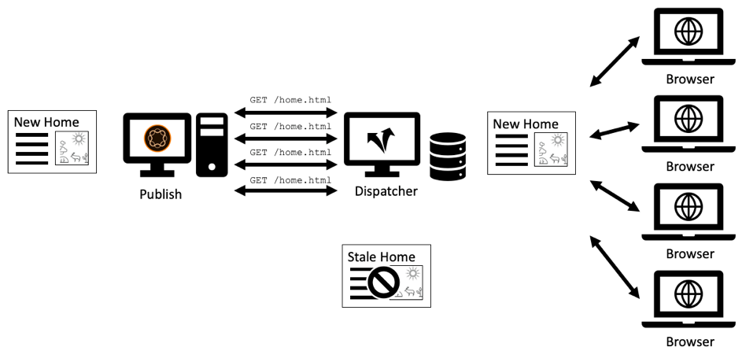

# 第1章 — Dispatcher概念、模式與反模式

## 概觀

本章簡要介紹Dispatcher的歷史和機制，並討論這會如何影響AEM開發人員如何設計其元件。

## 為何開發人員應關注基礎結構

Dispatcher是大部分(如果不是所有AEM安裝的話)的必要部分。 您可以找到許多線上文章，討論如何設定Dispatcher以及秘訣和技巧。

不過，這些零星的資訊總是從非常技術性的層面開始 — 假設您已知道要做什麼，因此只提供如何達成所要目標的詳細資訊。 我們從未找到任何概念性檔案，說明使用Dispatcher可以做哪些事情以及不能做哪些事情時&#x200B;_是什麼以及為什麼是_。

### 反圖樣：Dispatcher作為事後思考

缺乏基本資訊會導致許多反模式，我們在許多AEM專案中看到：

1. 由於Dispatcher已安裝在Apache Web Server中，因此需由專案中的「Unix gods」負責對其進行設定。 「凡世的Java開發人員」不需要擔心這個問題。

2. Java開發人員需要確保他的程式碼可以運作…… Dispatcher稍後會神奇地使其快速。 Dispatcher一律為事後考量。 但是，這無法運作。 開發人員在設計程式碼時必須考慮到Dispatcher。 他需要瞭解它的基本概念才能做到這一點。

### 「先讓它運作，再讓它快速」並非總是正確的

您可能聽說過程式設計建議&#x200B;_「請先讓它運作 — 然後讓它快速。」_。這並非完全錯誤。 但是，如果沒有正確的上下文，它往往會遭到錯誤解譯且無法正確套用。

建議應避免開發人員過早最佳化程式碼，因為程式碼可能永遠不會執行，或執行非常少，以致於最佳化沒有足夠的影響，無法證明將工作投入最佳化的合理性。 此外，最佳化可能會導致程式碼變得更加複雜，從而引入錯誤。 因此，如果您是開發人員，請勿將太多時間花在微調最佳化每行程式碼上。 只要確定您選擇正確的資料結構、演演算法和程式庫，並等待效能分析工具的熱點分析，就能瞭解更徹底的最佳化在哪裡可以提升整體效能。

### 架構決定與成品

然而，在「架構」決策方面，「先讓它運作，然後再讓它快速」的建議是完全錯誤的。 什麼是架構決策？ 簡言之，它們是昂貴、困難和/或事後無法變更的決定。 請記住，「昂貴」有時等同於「不可能」。  例如，當您的專案已用盡預算時，就不可能進行昂貴的變更。 對的基礎架構變更，是此類別中最先出現的一種變更。 不過，還有另外一種「建築」人工因素可能會變得非常難以改變：

1. 位於應用程式「中心」的程式碼片段，其他許多片段都需仰賴這些片段。 若要變更這些專案，需要一次變更並重新測試所有相依性。

2. 涉及某些非同步、計時相關情況的成品，在這種情況下，輸入 — 因此系統的行為可以非常隨機地變化。 變更可能會產生無法預測的效果，而且可能難以測試。

3. 在系統的所有部分及元件中，反複使用及重複使用的軟體模式。 如果軟體模式最後變成次最佳，則所有使用模式的成品都必須重新編碼。

還記得嗎？ 在本頁頂端，我們說過Dispatcher是AEM應用程式的重要一環。 存取網頁應用程式非常隨機 — 使用者在無法預測的時間來往往。 最後，所有內容都會（或應該）在Dispatcher中快取。 因此，如果您仔細觀察，您可能已經意識到，快取可以視為「架構」成品，因此應讓團隊的所有成員、開發人員和管理員都瞭解。

我們並不是說開發人員應該實際設定Dispatcher。 他們需要瞭解概念（尤其是界限），以確保他們的程式碼也能由Dispatcher運用。

Dispatcher不會奇蹟般地提高程式碼速度。 開發人員建立元件時，必須考慮到Dispatcher。 因此，他需要瞭解運作方式。

## Dispatcher快取 — 基本原則

### Dispatcher作為快取Http — 負載平衡器

什麼是Dispatcher？為何最初稱為「Dispatcher」？

Dispatcher是

* 首先也是最重要的一個快取

* 反向proxy

* 適用於Apache httpd webserver的模組，將AEM相關功能新增至Apache的多功能性，並與所有其他Apache模組一起順暢運作（例如SSL或甚至SSI包含，我們稍後將看到）

在網路早期，您可能會有幾百位訪客造訪網站。 一個Dispatcher的設定，「已分派」或平衡多個AEM發佈伺服器的請求負載，通常情況下已足夠 — 因此，名稱為「Dispatcher」。 然而，現今此設定不再經常使用。

我們稍後會看到設定Dispatcher和Publish系統的不同方式。 首先，讓我們從一些http快取基本概念開始。


*Dispatcher快取的基本功能*

<br> 

此處會說明Dispatcher的基本概念。 Dispatcher是簡單的快取反向Proxy，能夠接收和建立HTTP請求。 正常的要求/回應週期如下：

1. 使用者請求頁面
2. Dispatcher會檢查是否已擁有該頁面的轉譯版本。 假設這是此頁面的第一個請求，且Dispatcher找不到本機快取復本。
3. Dispatcher向Publish系統請求頁面
4. 在Publish系統上，頁面會由JSP或HTL範本轉譯
5. 頁面會傳回Dispatcher
6. Dispatcher快取頁面
7. Dispatcher會將頁面傳回瀏覽器
8. 如果第二次請求相同頁面，則可直接從Dispatcher快取中提供此頁面，而不需要在Publish執行個體上重新轉譯。 這樣可節省在Publish執行個體上等待使用者和CPU週期的時間。

我們在最後一節討論「頁面」。 但相同的配置也適用於其他資源，例如影像、CSS檔案、PDF下載等。

#### 如何快取資料

Dispatcher模組會運用託管Apache伺服器所提供的功能。 HTML頁面、下載和圖片等資源會儲存為Apache檔案系統中的簡單檔案。 就是這麼簡單。

檔案名稱是由要求的資源URL衍生。 如果您要求檔案`/foo/bar.html`，則會儲存該檔案，例如在/`var/cache/docroot/foo/bar.html`下。

原則上，如果所有檔案都已快取，並因而靜態儲存在Dispatcher中，您可以提取Publish系統的外掛程式，而Dispatcher將充當簡單的網頁伺服器。 但這只是為了說明原則。 現實生活更複雜。 您不能快取所有內容，而且快取永遠不會完全「滿」，因為由於轉譯過程的動態性質，資源數量可能是無限的。 靜態檔案系統的模型有助於產生Dispatcher功能的粗略描述。 此外，它有助於說明Dispatcher的限制。

#### AEM URL結構和檔案系統對映

若要更詳細地瞭解Dispatcher，讓我們重新造訪簡單範例URL的結構。  讓我們看看以下範例，

`http://domain.com/path/to/resource/pagename.selectors.html/path/suffix.ext?parameter=value&otherparameter=value#fragment`

* `http`代表通訊協定

* `domain.com`是網域名稱

* `path/to/resource`是資源儲存在CRX中以及隨後儲存在Apache伺服器的檔案系統中的路徑

從這裡，AEM檔案系統和Apache檔案系統之間有一點不同。

在AEM中

* `pagename`是資源標籤

* `selectors`代表Sling中使用的多個選取器，以決定如何呈現資源。 URL可以有任意數目的選取器。 它們以句點分隔。 例如，選取器區段可能類似於「french.mobile.fancy」。 選取器應僅包含字母、數字和破折號。

* `html`做為最後一個「選取器」稱為延伸。 在AEM/Sling中，它也部分決定轉譯指令碼。

* `path/suffix.ext`是類似路徑的運算式，可以是URL的後置字元。  它可用於AEM指令碼，以進一步控制資源的呈現方式。 我們稍後會提供此零件的完整章節。 目前應該就足夠了，知道您可以將其用作其他引數。 尾碼必須有副檔名。

* `?parameter=value&otherparameter=value`是URL的查詢區段。 它可用來將任意引數傳遞至AEM。 無法快取包含引數的URL，因此引數應限制在絕對必要的情況下。

* `#fragment`，URL的片段部分沒有傳遞至AEM，它只會在瀏覽器中使用；在JavaScript架構中為「路由引數」，或跳至頁面上的特定部分。

在Apache （*參考以下圖表*）中，

* `pagename.selectors.html`是快取檔案系統中的檔案名稱。

如果URL有尾碼`path/suffix.ext`，則

* `pagename.selectors.html`已建立為資料夾

* `path` `pagename.selectors.html`資料夾中的資料夾

* `suffix.ext`是`path`資料夾中的檔案。 注意：如果尾碼沒有副檔名，則不會快取檔案。

從Dispatcher取得URL後

從Dispatcher取得URL後&#x200B;*檔案系統配置*

<br> 

#### 基本限制

URL、資源和檔案名稱之間的對應相當簡單明瞭。

不過，您可能會注意到一些陷阱，

1. URL可能會變得很長。 在本機檔案系統上新增`/docroot`的「路徑」部分，可能會輕易超過某些檔案系統的限制。 在Windows上的NTFS中執行Dispatcher是一項挑戰。 不過，使用Linux是安全的。

2. URL可包含特殊字元和變音。 這通常不是Dispatcher的問題。 不過請記住，應用程式的許多位置都會解譯URL。 我們經常會看到應用程式的奇怪行為 — 只是為了找出一段很少使用的（自訂）程式碼未針對特殊字元進行徹底測試。 如果可以的話，您應該避免使用這兩項功能。 如果無法做到，請規劃全面測試。

3. 在CRX中，資源具有子資源。 例如，一個頁面會有許多子頁面。 這在檔案系統中無法比對，因為檔案系統有檔案或資料夾。

#### 不會快取沒有副檔名的URL

URL的副檔名一律必須為。 不過您可以在AEM中提供沒有副檔名的URL。 這些URL將不會在Dispatcher中快取。

**範例**

`http://domain.com/home.html`是&#x200B;**可快取**

`http://domain.com/home`是&#x200B;**不可快取**

當URL包含尾碼時，適用相同的規則。 尾碼必須有擴充功能才能快取。

**範例**

`http://domain.com/home.html/path/suffix.html`是&#x200B;**可快取**

`http://domain.com/home.html/path/suffix`是&#x200B;**不可快取**

您可能會想，如果資源部分沒有副檔名，但尾碼有副檔名會發生什麼事？ 嗯，在此案例中，URL完全沒有尾碼。 檢視下一個範例：

**範例**

`http://domain.com/home/path/suffix.ext`

`/home/path/suffix`是資源的路徑……因此URL中沒有尾碼。

**結論**

請一律將副檔名新增至路徑和後置字元。 SEO感知人員有時會主張，這會在搜尋結果中將您排在後面。 但是未快取的頁面速度會非常慢，而且會進一步下降。

#### 衝突的尾碼URL

假設您有兩個有效的URL

`http://domain.com/home.html`

和

`http://domain.com/home.html/suffix.html`

在AEM中絕對有效。 若沒有Dispatcher，您不會在本機開發電腦上看到任何問題。 在UAT或負載測試中，您很可能也不會遇到任何問題。 我們面臨的問題是如此微妙，以至於在大部分測試中都未能通過。  當您處於尖峰時間，而且處理時間有限，可能沒有伺服器存取權，也沒有資源可加以修正時，就會受到嚴重影響。 我們曾經遇到過……

那麼……有什麼問題嗎？

檔案系統中的`home.html`可以是檔案或資料夾。 並非兩者都與AEM中的相同。

如果您先要求`home.html`，則會建立為檔案。

對`home.html/suffix.html`的後續請求會傳回有效結果，但由於檔案`home.html`在檔案系統中「封鎖」該位置，因此無法第二次建立`home.html`做為資料夾，因此不會快取`home.html/suffix.html`。


*檔案系統中的檔案封鎖位置，無法快取子資源*

<br> 

如果您反其道而行之，請先要求`home.html/suffix.html`，然後先將`suffix.html`快取在資料夾`/home.html`下。 不過，當您後續要求`home.html`做為資源時，此資料夾會被刪除並取代為檔案`home.html`。


*當父系擷取為資源時刪除路徑結構*

<br> 

因此，快取的結果完全是隨機的，取決於傳入請求的順序。 讓事情變得更棘手的是，您通常有多個排程程式。 而效能、快取命中率和行為可能因Dispatcher而異。 如果您想瞭解網站為什麼沒有回應，您必須確定您所檢視的Dispatcher正確順序有誤。 如果您正在檢視Dispatcher （運氣好的話）有較有利的請求模式，您在嘗試尋找問題時會迷路。

#### 避免衝突的URL

如果您為資源使用不同的副檔名，但您有尾碼，則可以避免「衝突的URL」，亦即資料夾名稱和檔案名稱在檔案系統中「競爭」相同的路徑。

**範例**

* `http://domain.com/home.html`

* `http://domain.com/home.dir/suffix.html`

兩者皆可完全快取，


當您要求尾碼或完全避免使用尾碼時，請為資源選擇專用的擴充功能「dir」。 在極少數情況下，這些變數很有用。 而且這些案例很容易正確實施。  我們將在下一章中討論快取失效和排清時看到。

#### 不可快取的請求

讓我們檢閱上一章的快速摘要，以及其他一些例外狀況。 如果URL已設定為可快取，且為GET請求，則Dispatcher可快取URL。 無法快取下列其中一個例外狀況。

**可快取的要求**

* 要求已設定為可在Dispatcher設定中快取
* 要求是純GET要求

**無法快取的要求或回應**

* 設定拒絕快取的要求（路徑、模式、MIME型別）
* 傳回「Dispatcher： no-cache」標頭的回應
* 傳回「Cache-Control： no-cache|private」標頭的回應
* 傳回「Pragma： no-cache」標頭的回應
* 使用查詢引數請求
* 沒有副檔名的URL
* 尾碼不含副檔名的URL
* 傳回200以外的狀態代碼的回應
* POST要求

## 讓快取失效並排清

### 概觀

最後一章列出了Dispatcher無法快取要求的大量例外狀況。 但還有更多事情要考慮：只因為Dispatcher _可以_&#x200B;快取要求，並不一定表示它&#x200B;_應該_。

要點在於：快取通常很容易。 Dispatcher只需要儲存回應的結果，並在下次傳入非常相同的請求時傳回。 對嗎？ 錯誤！

困難的部分是快取的&#x200B;_失效_&#x200B;或&#x200B;_排清_。 Dispatcher需要找出資源已變更的時間，並需要再次轉譯。

乍一看，這似乎是一項瑣碎的工作……但事實並非如此。 進一步閱讀，您將瞭解單一和簡單資源以及依賴多個資源之高度網狀結構的頁面之間的一些棘手差異。

### 簡單資源與排清

我們已設定AEM系統，在有特殊的「縮圖」選取器要求時，可動態地為每個影像建立縮圖轉譯：

`/content/dam/path/to/image.thumb.png`

當然，我們也會提供URL，透過無選擇器URL提供原始影像：

`/content/dam/path/to/image.png`

如果同時下載縮圖和原始影像，最後我們會得到，

```
/var/cache/dispatcher/docroot/content/dam/path/to/image.thumb.png

/var/cache/dispatcher/docroot/content/dam/path/to/image.png
```

Dispatcher的檔案系統中。

現在，使用者上傳並啟動該檔案的新版本。 系統會從AEM傳送失效請求給Dispatcher，

```
GET /invalidate
invalidate-path:  /content/dam/path/to/image

<no body>
```

失效很簡單：向Dispatcher上的特殊「/invalidate」 URL提出簡單GET請求。 不需要HTTP-body，「payload」只是「invalidate-path」標頭。 另請注意，標頭中的invalidate-path是AEM知道的資源，而非Dispatcher已快取的檔案。 AEM只知道資源。 當要求資源時，會在執行階段使用擴充功能、選取器和尾碼。 AEM不會針對資源上已使用的選取器執行任何簿記，因此在啟用資源時，資源路徑是其知道的全部資訊。

在我們的案例中這已經足夠。 如果資源已變更，我們可以安全地假設，該資源的所有轉譯也已變更。 在我們的範例中，如果影像已變更，也會轉譯新的縮圖。

Dispatcher可以安全地刪除已快取所有轉譯的資源。 它會執行類似以下的動作，

`$ rm /content/dam/path/to/image.*`

正在移除`image.png`和`image.thumb.png`以及符合該模式的所有其他轉譯。

只要您只使用一種資源來回應要求，確實會非常簡單……

### 參照和網格化內容

#### 網格化內容問題

與上傳至AEM的影像或其他二進位檔案不同，HTML頁面不是孤立的動物。 它們成群結隊地存在，而且透過超連結和參照彼此高度互連。 簡單的連結沒有害處，但在我們談論內容參考時會變得很棘手。 頁面上無處不在的頂端導覽或Teaser是內容參考。

#### 內容引用以及它們為什麼是問題

讓我們來看一個簡單的範例。 一家旅行社有一個推廣加拿大之旅的網頁。 此促銷活動會顯示在其他兩個頁面的Teaser區段中：「首頁」頁面和「冬季特惠」頁面。

由於兩個頁面顯示相同的Teaser，因此不需要要求作者針對應顯示它的每個頁面多次建立Teaser。 相反地，目標頁面「加拿大」會在頁面屬性中保留一個區段，以提供Teaser的相關資訊，或是最好提供完全呈現該Teaser的URL：

`<sling:include resource="/content/home/destinations/canada" addSelectors="teaser" />`

或

`<sling:include resource="/content/home/destinations/canada/jcr:content/teaser" />`


只有在AEM上才會像魅力一樣運作，但如果您在Publish執行個體上使用Dispatcher，會發生奇怪的事情。

想像一下，您已發佈您的網站。 您的加拿大頁面上的標題為「加拿大」。 當訪客要求您的首頁（有該頁面的Teaser參考）時，「加拿大」頁面上的元件會呈現類似以下畫面

```
<div class="teaser">
  <h3>Canada</h3>
  
</div>
```

*到*&#x200B;首頁。 首頁由Dispatcher儲存為靜態.html檔案，包括Teaser和其檔案中的標題。

現在行銷人員瞭解到Teaser標題應該可行。 因此，他決定將標題從「Canada」變更為「Visit Canada」，並更新影像。

他發佈編輯過的「加拿大」頁面，並修訂先前發佈的首頁來檢視變更。 但是 — 沒有任何改變。 仍會顯示舊的Teaser。 他仔細檢視「冬季特惠」。 該頁面之前從未要求過，因此不會靜態快取至Dispatcher。 因此，此頁面由Publish最新呈現，現在包含新的「造訪加拿大」Teaser。


*Dispatcher將過時的包含內容儲存在首頁中*

<br> 

發生了什麼事？ Dispatcher會儲存靜態版本的頁面，其中包含轉譯時已從其他資源提取的所有內容和標籤。

Dispatcher只是檔案系統式的網頁伺服器，速度快，但相對簡單。 如果包含的資源變更，則不會意識到這一點。 它仍會依附於轉譯包含頁面時存在的內容。

「冬季特殊優惠」頁面尚未轉譯，因此Dispatcher上沒有靜態版本，因此在提出要求時全新轉譯時會顯示新的Teaser。

您可能會認為，當資源變更時，Dispatcher會在轉譯及清除所有曾使用此資源的頁面時，追蹤其所觸及的每個資源。 但Dispatcher不會轉譯頁面。 轉譯是由Publish系統執行。 Dispatcher不知道哪些資源會進入轉譯的.html檔案。

還是不相信？ 您可能會認為&#x200B;*「必須有方法來實作某種相依性追蹤」*。 有&#x200B;*有，或者更準確地說*。 公告3 AEM的曾曾祖父在&#x200B;_工作階段_&#x200B;中實作了一個相依性追蹤器，用於呈現頁面。

在請求期間，系統會將透過此工作階段取得的每個資源視為目前轉譯之URL的相依性來進行追蹤。

但事實證明，追蹤這些相依性非常昂貴。 人們很快就發現，如果他們完全關閉相依性追蹤功能，並依賴在變更一個html頁面後重新呈現所有html頁面，網站就會更快。 此外，這個方案也不是完美的 — 過程中會有許多陷阱和例外。 在某些情況下，您未使用請求預設工作階段來取得資源，而是使用管理員工作階段來取得一些協助程式資源來轉譯請求。 這些相依性通常不會受到追蹤，導致作業團隊要求手動清除快取的難題和電話呼叫。 如果他們有標準程式那麼做，那你就很幸運了。 途中還有更多疑問，但……讓我們停止回憶。 這可以追溯到2005年。 最後，該功能預設為在Communication 4中停用，並且無法重新成為後來成為AEM的後續版本CQ5。

### 自動失效

#### 完全排清比相依性追蹤便宜時

由於CQ5隻有其中一個頁面變更，所以我們差不多完全仰賴讓整個網站失效。 此功能稱為「自動失效」。

但同樣地，丟棄並轉譯數百個頁面會比執行適當的相依性追蹤和部分轉譯來得便宜，怎麼可能呢？

主要原因有二：

1. 在一般網站上，僅一小部分頁面會經常被要求。 因此，即使您捨棄所有演算後的內容，事後也只會要求幾十個內容。 呈現頁面長尾可在實際請求時隨時間分佈。 因此，實際上轉譯頁面的負載並不如您預期般高。 當然，總是會有例外……我們稍後會討論一些技巧，如何使用空的Dispatcher快取處理大型網站上平均分佈的負載。

2. 所有頁面仍會透過主導覽進行連線。 因此，幾乎所有頁面最終都是彼此相依的。 這表示即使是最聰明的相依性追蹤器也會找出我們已瞭解的情況：如果其中一個頁面變更，您必須使所有其他頁面失效。

你不相信？ 讓我們來說明最後一點。

我們使用與上一個範例相同的引數，搭配參考遠端頁面內容的Teaser。 只是現在，我們才使用更極端的範例：自動轉譯的主導覽。 和Teaser一樣，導覽標題是從連結或「遠端」頁面中繪製的，作為內容參考。 遠端導覽標題不會儲存在目前轉譯的頁面中。 您應記住，導覽會在您網站中的每個頁面上呈現。 因此，在有主導覽的所有頁面上都會反複使用一個頁面的標題。 而如果您想要變更導覽標題，您只想在遠端頁面上執行一次 — 而不是在每個參照頁面的每個頁面上執行。

因此，在我們的範例中，導覽會使用目標頁面的「NavTitle」來呈現導覽中的名稱，將所有頁面網格化。 「冰島」的導覽標題是從「冰島」頁面中提取，並演算至每個有主要導覽的頁面。


*主要導覽透過拉動「NavTitles」，不可避免地將所有頁面的內容網格化在一起*

<br> 

如果您將冰島頁面上的NavTitle從「Iceline」變更為「Beautiful Iceline」，該標題會立即在其他所有頁面主功能表上變更。 因此，在該變更之前呈現和快取的頁面都會過時，需要失效。

#### 自動失效的實作方式： .stat檔案

現在，如果您有一個包含數千個頁面的大型網站，則需要相當長的時間來循環瀏覽所有頁面並將它們實際刪除。 在此期間，Dispatcher可能會無意中提供過時內容。 更糟糕的是，存取快取檔案時可能會發生一些衝突，可能是某個頁面剛被刪除時即被請求，或該頁面在緊接著啟動後又發生第二次失效，因而再次被刪除。 想想會有多亂。 幸好事情不是這樣的。 Dispatcher巧妙地避免了這一情況：它不會刪除數百個檔案，而是在檔案發佈時將一個簡單的空白檔案放入檔案系統的根目錄中，因此所有相依檔案都被視為無效。 此檔案稱為「statfile」。 statfile是空的檔案 — 與statfile相關的是其建立日期。

Dispatcher中所有建立日期早於statfile的檔案，都已在上次啟動（及失效）前轉譯，因此視為「無效」。 雖然這些檔案實際上仍存在於檔案系統中，但Dispatcher會忽略它們。 它們「過時」。 每當對過時資源發出請求時，Dispatcher都會要求AEM系統重新呈現頁面。 然後，新轉譯的頁面會儲存在檔案系統中 — 現在會有一個新的建立日期，而且會再次刷新。


*.stat檔案的建立日期會定義哪些內容已過時以及哪些內容是新鮮的*

<br> 

您可能會問，為何將其稱為「.stat」？ 也可能不是「.invalidated」？ 嗯，您可以想像，在檔案系統中擁有該檔案，可協助Dispatcher判斷哪些資源可以&#x200B;*靜態提供* — 就像從靜態網頁伺服器提供一樣。 這些檔案不再需要動態呈現。

然而，這個名稱的真正本質並不那麼隱喻。 它是從Unix系統呼叫`stat()`衍生而來，其會傳回檔案的修改時間（以及其他屬性）。

#### 混合簡單與自動驗證

但請稍候……先前我們說過，會實際刪除單一資源。 現在我們說，在Dispatcher看來，較新的statfile實際上會讓這些檔案失效。 為什麼要先進行實體刪除？

答案很簡單。 您通常會同時使用這兩種策略，但適用於不同的資源。 二進位資產（例如影像）是獨立的。 他們未連線至其他資源，因此需要呈現其資訊。

另一方面，HTML頁面是高度相依的。 因此，您可以對這些應用自動失效。 這是Dispatcher中的預設設定。 屬於失效資源的所有檔案都會被實際刪除。 此外，結尾為「.html」的檔案會自動失效。

Dispatcher會決定副檔名，決定是否套用自動失效配置。

可設定自動失效的檔案結尾。 理論上，您可以包含自動失效的所有擴充功能。 但請記住，這是非常昂貴的代價。 您不會看到過時資源無意間傳送，但傳送效能會因過度失效而大幅降低。

舉例來說，假設您實作一個方案，以動態方式呈現PNG和JPG，並依賴其他資源來執行此操作。 您可能想要將高解析度影像重新調整為較小的網頁相容解析度。 當您這樣做時，也會變更壓縮率。 在此範例中，解析度和壓縮率在使用影像的元件中不是固定的常數，而是可設定的引數。 現在，如果變更此引數，您必須讓影像失效。

沒問題 — 我們剛瞭解到，我們可以新增影像到自動失效，並且每當任何變更時，隨時都能重新演算影像。

#### 將嬰兒與浴水一起扔掉

沒錯，這是個大問題。 再次閱讀最後一段。 「……每當任何變更時，都會以全新演算的影像顯示。」 如您所知，良好的網站會不斷變更；在這裡新增內容、更正錯字，以及在其他地方調整Teaser。 這表示您的所有影像都會持續失效，且需要重新演算。 不要小瞧那件事。 在本機開發電腦上，以毫秒為單位動態呈現和傳輸影像資料的運作方式。 您的生產環境每秒需要執行一百倍的重複工作。

在此先澄清一下，當html頁面變更時，您的jpg需要重新呈現，反之亦然。 只有一個「貯體」的檔案可自動失效。 會整體排清。 不必再細分為更詳細的結構。

依預設，自動失效保留為「.html」是有充分理由的。 目標是讓貯體儘可能的小。 不要為了安全起見，就為了讓一切失效，而把嬰兒與浴水一起扔掉。

應該在該資源的路徑中提供自含資源。 這非常有助於失效。 請保持簡單，不要建立對應配置，例如&quot;resource /a/b/c&quot;是從&quot;/x/y/z&quot;提供。 讓您的元件可搭配預設Dispatcher的自動失效設定運作。 請勿嘗試在Dispatcher中修復設計不良且過度失效的元件。

##### 自動失效的例外：ResourceOnly失效

Dispatcher的失效請求通常會由復寫代理從Publish系統觸發。

如果您對相依性感到非常自信，可以嘗試建置您自己的失效復寫代理程式。

本指南會提供一些詳細資訊，但我們希望您至少有一些提示。

1. 非常清楚您正在做什麼。 讓失效變得正確非常困難。 這就是自動失效如此嚴格的原因之一；為了避擴音供過時內容。

2. 如果您的代理程式傳送HTTP標頭`CQ-Action-Scope: ResourceOnly`，表示此單一失效請求不會觸發自動失效。 此([https://github.com/cqsupport/webinar-dispatchercache/tree/master/src/refetching-flush-agent/refetch-bundle](https://github.com/cqsupport/webinar-dispatchercache/tree/master/src/refetching-flush-agent/refetch-bundle))程式碼片段可能是您自己的復寫代理程式的良好起點。

3. `ResourceOnly`，僅防止自動失效。 若要實際執行必要的相依性解析和無效化，您必須自行觸發無效化請求。 您可能想要檢查套件Dispatcher排清規則([https://adobe-consulting-services.github.io/acs-aem-commons/features/dispatcher-flush-rules/index.html](https://adobe-consulting-services.github.io/acs-aem-commons/features/dispatcher-flush-rules/index.html))，以取得實際發生情形的靈感。

我們不建議您建立相依性解析配置。 工作太辛苦，卻收效甚微，而且如前所述，出錯的次數太多了。

而是應該找出哪些資源對其他資源沒有任何相依性，並且可以在沒有自動失效的情況下失效。 不過，您不需要就此使用自訂復寫代理程式。 只需在您的Dispatcher設定中建立自訂規則，將這些資源排除在自動失效之外。

我們說主要導覽或Teaser是相依性的來源。  — 如果您以非同步方式載入導覽和Teaser，或在Apache中使用SSI指令碼包含它們，您將沒有要追蹤的相依性。 我們稍後會詳述非同步載入元件，說明「Sling Dynamic Include」。

這同樣適用於快顯視窗或載入燈箱的內容。 這些片段也很少有導覽（亦即「相依性」），並且可以作為單一資源失效。

## 以Dispatcher建置元件

### 在真實世界範例中套用Dispatcher力學

在最後一章，我們說明Dispatcher的基本機制、其一般運作方式及限制。

我們現在想要將這些機制套用至您很可能可以在專案需求中找到的一種元件。 我們特意挑選元件，以展示您遲早也會遇到的問題。 不用擔心，並非所有元件都需要如此多的考量。 但是，如果您覺得需要建立這類元件，您就很清楚後果，也知道如何處理。

### 多工緩衝處理元件（反）圖樣

#### 回應式影像元件

讓我們來說明具有互連二進位檔之元件的共同模式（或反模式）。 我們將為「回應式影像」建立元件「respi」。 此元件應該能夠將顯示影像調整至其所顯示的裝置。 在桌上型電腦和平板電腦上，這個選項會顯示影像的完整解析度；在手機上，這個選項會採用裁切較窄的較小版本，甚至可能會採用完全不同的主題（在回應式世界中，這稱為「藝術方向」）。

資產會上傳至AEM的DAM區域，且在回應式影像元件中只有&#x200B;_參考的_。

回應元件會處理標籤的轉譯與傳遞二進位影像資料。

我們在這裡實作的方式是在許多專案中看到的常見模式，即使其中一個AEM核心元件也是以該模式為基礎。 因此，身為開發人員的您很可能調整該模式。 雖然在封裝方面有其優點，但需要付出大量努力才能使其具備Dispatcher功能。 我們稍後會討論幾個如何緩解問題的選項。

我們將此處使用的模式稱為「多工緩衝處理器模式」，因為此問題可追溯至Communication 3早期，當時有一個方法「多工緩衝處理器」，可呼叫資源以將其二進位原始資料串流至回應。

原始術語「多工緩衝處理」實際上是指共用慢速離線周邊裝置，例如印表機，因此在這裡無法正確套用。 不過我們還是喜歡這個詞，因為它很少在網路上被區分。 而且每個圖樣都應該有一個可區別的名稱，對嗎？ 您可以自行決定這是圖樣還是反圖樣。

#### 實作

以下是我們實施回應式影像元件的方式：

元件有兩個部分；第一個部分呈現影像的HTML標籤，第二個部分則「卷軸」參照影像的二進位資料。 由於這是具有回應式設計的現代網站，因此我們不會呈現簡單的``標籤，而是`<picture/>`標籤中的一組影像。 我們會為每個裝置上傳兩個不同的影像至DAM，並從影像元件中參照它們。

元件有三個轉譯指令碼（實作於JSP、HTL或作為servlet），每個指令碼都透過專用選擇器定址：

1. `/respi.jsp` — 沒有選擇器可呈現HTML標籤
2. `/respi.img.java`以轉譯案頭版本
3. `/respi.img.mobile.java`以轉譯行動版本。


元件會放置在首頁的parsys中。 CRX中的結果結構如下圖所示。


*CRX中回應式影像的資源結構*

<br> 

元件標籤會如此呈現，

```plain
  #GET /content/home.html

  <html>

  …

  <div class="responsive-image>

  <picture>
    <source src="/content/home/jcr:content/par/respi.img.mobile.jpg" …/>
    <source src="/content/home/jcr:content/par/respi.img.jpg …/>

    …

  </picture>
  </div>
  …
```

而且……我們已經完成妥善封裝的元件。

#### 有回應的影像元件在運作中

現在，使用者透過Dispatcher請求頁面 — 以及資產。 這會導致Dispatcher檔案系統中的檔案，如下所示：

封裝回應式影像元件的

封裝回應式影像元件的&#x200B;*快取結構*

<br> 

考慮使用者將兩個花朵影像的新版本上傳並啟動到DAM。 AEM將根據以下專案的失效請求傳送：

`/content/dam/flower.jpg`

和

`/content/dam/flower-mobile.jpg`

前往Dispatcher。 不過，這些請求都是徒勞的。 內容已快取為元件子結構下的檔案。 這些檔案現已過時，但仍會應要求提供服務。


*結構不符，導致內容過時*

<br> 

此方法還有另一個考量。 假設您在多個頁面上使用相同的flower.jpg。 然後您會在多個URL或檔案底下快取相同的資產，

```
/content/home/products/jcr:content/par/respi.img.jpg

/content/home/offers/jcr:content/par/respi.img.jpg

/content/home/specials/jcr:content/par/respi.img.jpg

…
```

每次請求新的和取消快取的頁面時，都會以不同的URL從AEM擷取資產。 沒有任何Dispatcher快取和瀏覽器快取可以加速傳送。

#### 多工緩衝處理器圖樣發光的位置

有一個自然的例外情況，即使是以其簡單形式，此模式也相當實用：如果二進位檔儲存在元件本身中，而非DAM中。 不過，這僅適用於網站上使用一次的影像，且不會將資產儲存在DAM中，表示您難以管理資產。 想像一下，您的特定資產使用授權會用完。 如何找出您使用資產的元件？

看到沒？ DAM中的「M」代表「管理」，如數位資產管理中所示。 您不想放棄此功能。

#### 結論

從AEM開發人員的角度來看，這個圖案看起來非常優雅。 但將Dispatcher納入考量後，您可能會同意，天真的方法可能還不夠。

目前由您來決定這是模式還是反模式。 或許您已經有一些不錯的主意要告訴您如何減輕上述問題？ 很好。 您應該很想知道其他專案如何解決這些問題。

### 解決常見的Dispatcher問題

#### 概觀

讓我們討論一下如何更適合快取記憶體的實作。 有幾個選項。 有時候，您無法選擇最佳解決方案。 也許您進入的專案已經開始執行，而您僅有有限的預算足以修正手頭的「快取問題」，不足以執行完整的重構。 或者您遇到的問題，比範例影像元件更複雜。

我們將在以下各節概述其原理和注意事項。

同樣地，這是根據實際體驗。 我們已在野外看到所有這些模式，因此這不是學術練習。 這就是為什麼我們會向您顯示一些反模式，以便您有機會從其他人已經犯過的錯誤中學習。

#### 快取殺手

>[!WARNING]
>
>這是反模式。 不要使用它。 永遠。

您曾經看過`?ck=398547283745`之類的查詢引數嗎？ 這類檔案稱為cache-killer (&quot;ck&quot;)。 其想法是，如果您新增任何查詢引數，將不會快取資源。 此外，如果您新增隨機數字作為引數的值(例如「398547283745」)，URL就會變成唯一值，而且您會確定AEM系統和熒幕之間的其他快取也無法進行快取。 通常中間嫌犯會是位於Dispatcher、CDN甚至瀏覽器快取前的「清漆」快取。 再次：請勿這麼做。 您確實希望儘可能長時間地快取資源。 快取是您的朋友。 不要殺朋友。

#### 自動失效

>[!WARNING]
>
>這是反模式。 請避免用於數位資產。 嘗試保留Dispatcher的預設設定，即>只會對「.html」檔案自動失效

您可以在短期內將「.jpg」和「.png」新增到Dispatcher中的自動失效設定。 這表示每當發生失效，所有「.jpg」、「.png」和「.html」都需要重新呈現。

如果業務負責人抱怨未及時在即時網站上實作變更，則此模式可輕鬆實施。 但這只能為您爭取一些時間，以便想出更複雜的解決方案。

請務必瞭解效能受到的各種影響。 這會顯著減慢網站的速度，甚至可能影響穩定性（如果您的網站是高負載網站且經常變更），例如新聞入口網站。

#### URL指紋

URL指紋看起來像快取殺手一樣。 但事實並非如此。 它不是隨機數字，而是資源內容的特性值。 這可以是資源內容的雜湊，或甚至更簡單的資源上傳、編輯或更新時的時間戳記。

Unix時間戳記適合在真實世界中實作。 為了更好的可讀性，我們在本教學課程中使用較易讀的格式： `2018 31.12 23:59 or fp-2018-31-12-23-59`。

不得將指紋當做查詢引數使用，就像使用查詢引數的URL一樣   無法快取。 您可以使用指紋的選擇器或尾碼。

假設檔案`/content/dam/flower.jpg`的`jcr:lastModified`日期為2018年12月31日的23:59。 具有指紋的URL是`/content/home/jcr:content/par/respi.fp-2018-31-12-23-59.jpg`。

只要參照的資源(`flower.jpg`)檔案未變更，此URL就會保持穩定。 因此可以無限期地快取它，而且它不是快取殺手。

請注意，此URL需要由回應式影像元件建立及服務。 這不是立即可用的AEM功能。

這是基本概念。 但是，有一些細節可能會很容易被忽略。

在我們的範例中，元件在23:59完成轉譯和快取。 現在影像已變更，假設00:00。  元件&#x200B;_將_&#x200B;在其標籤中產生新的指紋URL。

您可能會認為它&#x200B;_應該_...，但事實並非如此。由於只變更了影像的二進位檔案，而且未觸及包含頁面，因此不需要重新轉譯HTML標籤。 因此，Dispatcher會以舊指紋提供頁面，進而提供舊版本的影像。


*影像元件比參照的影像更新，沒有重新演算的指紋。*

<br> 

現在，如果您重新啟用首頁（或該網站的任何其他頁面），statfile將會更新，Dispatcher會考慮home.html過時，並在影像元件中使用新指紋重新呈現。

但我們沒有啟動首頁，對嗎？ 為什麼我們要啟用一個原本就沒碰過的頁面？ 此外，我們可能沒有足夠的許可權來啟動頁面，或核准工作流程太長且耗時，我們根本無法在短時間內完成此操作。 那麼 — 該怎麼辦？

#### 懶惰管理員的工具 — 降低Statfile層級

>[!WARNING]
>
>這是反模式。 請僅在短期內使用，以爭取時間，並想出更複雜的解決方案。

懶惰的管理員通常會「_將自動失效設定為jpgs，並將statfile層級設定為零 — 這總能協助解決各種快取問題_」。 您會在技術論壇中找到該建議，並有助於解決您的失效問題。

到目前為止，我們尚未討論statfile層級。 基本上，自動失效僅適用於相同子樹狀結構中的檔案。 但問題是頁面和資產通常不在相同的子樹狀結構中。 頁面在`/content/mysite`以下，而資產在`/content/dam`以下。

「statfile層級」會定義子樹狀結構的根節點深度。 在上述範例中，層級為「2」(1=/content， 2=/mysite，dam)

將statfile層級「降低」為0的想法基本上是將整個/content樹狀結構定義為一個，並且是唯一的子樹狀結構，以使頁面和資產存在於相同的自動失效網域中。 所以我們將只保留在層級的大樹上（在docroot &quot;/&quot;）。 但這樣做一有內容發佈，伺服器上的所有網站都會自動失效，即使是完全不相關的網站。 相信我們：長遠來看，這是個壞主意，因為您會嚴重降低整體的快取命中率。 您只能希望AEM伺服器有足夠的火力，不需要快取即可執行。

稍後您將瞭解更深層statfile層級的完整優點。

#### 實施自訂失效代理

無論如何 — 我們需要以某種方式告知Dispatcher，如果「.jpg」或「.png」變更為允許使用全新URL重新呈現，則HTML頁面會失效。

例如，我們在專案中看到的是，發佈系統上的特殊復寫代理程式，每當發佈網站的影像時，都會傳送該網站的失效請求。

如果您可透過命名慣例從資產的路徑衍生出網站的路徑，這會很有幫助。

一般而言，最好將網站和資產路徑比對如下：

**範例**

```
/content/dam/site-a
/content/dam/site-b

/content/site-a
/content/site-b
```

如此一來，當您的自訂Dispatcher清除代理程式在`/content/dam/site-a`上遇到變更時，便可輕鬆傳送及讓/content/site-a失效的請求。

事實上，您指示Dispatcher失效的路徑並不重要，只要該路徑位於相同網站、相同「子樹」中。 您甚至不必使用真正的資源路徑。 這也可能是「虛擬」的：

```
GET /dispatcher-invalidate
Invalidate-path /content/mysite/dummy
```


1. 當DAM中的檔案變更時，會觸發發佈系統上的監聽器

2. 監聽器會傳送失效請求給Dispatcher。 由於自動失效，我們會在自動失效中傳送哪個路徑並不重要，除非是在網站首頁下 — 或在網站statfile層級中更精確。

3. statfile已更新。

4. 下次請求首頁時，會重新呈現。 新的指紋/日期會從影像的lastModified屬性取得，作為額外的選取器

5. 這會隱含地建立新影像的參照

6. 如果實際需要影像，則會建立新轉譯並儲存在Dispatcher中


#### 清理的必要性

噢。 已完成。 萬歲！

嗯……還不是很清楚。

路徑，

`/content/mysite/home/jcr:content/par/respi.img.fp-2018-31-12-23-59.jpg`

與任何失效的資源無關。 還記得嗎？ 我們只會使「虛擬」資源失效，並依賴自動失效將「home」視為無效。 影像本身可能永遠不會&#x200B;_實際刪除_。 因此，快取會成長、成長、成長。 影像變更並啟動後，會在Dispatcher的檔案系統中取得新檔案名稱。

未實際刪除快取檔案並無限期保留它們有三個問題：

1. 您明顯是在浪費儲存容量。 當然 — 儲存裝置在過去幾年已變得更便宜。 但過去幾年，影像解析度和檔案大小也有所增長 — 眼底型顯示器應運而生，這些顯示器都非常需要清晰銳利的影像。

2. 即使硬碟變得更便宜，「儲存」可能也不會變得更便宜。 我們看到一種趨勢，即您的資料中心供應商不使用（廉價）裸機HDD儲存裝置，而是在NAS上租用虛擬儲存裝置。 這類儲存裝置更可靠、更可擴充，但價格也更高。 您可能不想藉由儲存過時的垃圾而浪費這些資源。 這不僅與主要儲存裝置有關，備份亦是如此。 如果您有現成的備份解決方案，則可能無法排除快取目錄。 最後，您也會備份廢棄專案資料。

3. 更糟糕的是：您可能只在有限的時間內才為某些影像購買使用授權 — 只要您需要這些授權即可。 現在，如果您在授權過期後仍儲存影像，可能會被視為侵犯版權。 您可能無法再在網頁中使用影像，但Google仍可找到。

最後，您會想出一些清潔工作的任人唯親來清除所有早於此時間的檔案……讓我們用一週的時間來控制這種亂丟垃圾的情況。

#### 濫用URL指紋進行拒絕服務攻擊

但請稍等，此解決方案中還有另一個缺陷：

我們有些濫用選取器作為引數： fp-2018-31-12-23-59是作為某種「快取殺手」動態產生的。 但可能是某個無聊的孩子（或某個瘋狂的搜尋引擎編目程式）開始請求頁面：

```
/content/mysite/home/jcr:content/par/img.fp-0000-00-00-00-00.jpg
/content/mysite/home/jcr:content/par/img.fp-0000-00-00-00-01.jpg
/content/mysite/home/jcr:content/par/img.fp-0000-00-00-00-02.jpg

…
```

每個請求都會略過Dispatcher，造成Publish執行個體載入。 更糟的是，在Dispatcher上建立依據的檔案。

因此……您必須檢查影像的jcr：lastModified日期，如果不是預期的日期，則傳回404，而不只是使用指紋做為簡單的快取殺手。 在Publish系統上這需要一些時間和CPU週期……這是您一開始想要防止的。

#### 高頻發行中的URL指紋警告

您不僅可以將指紋架構用於來自DAM的資產，也可用於JS和CSS檔案以及相關資源。

[版本化Clientlibs](https://adobe-consulting-services.github.io/acs-aem-commons/features/versioned-clientlibs/index.html)是使用此方法的模組。

但在這裡，您可能會面臨另一個警告：具有URL指紋：它會將URL連結至內容。 若不變更URL （亦即更新修改日期）則無法變更內容。 這就是指紋的設計初衷。 但請考量一下，您正在推出新版本，其中包含新的CSS和JS檔案，因此是帶有新指紋的新URL。 您的所有HTML頁面仍會參照舊的指紋URL。 因此，為了讓新版本持續運作，您需要一次讓所有HTML頁面失效，以強制使用新指紋檔案的參照重新呈現。 如果您有多個網站依賴相同的資料庫，那麼重新呈現可能會相當多，而且您無法在此使用`statfiles`。 因此，請準備好在推出後檢視Publish系統上的負載尖峰。 您可能會考慮使用具有快取預熱功能的藍綠色部署，或是Dispatcher前面的TTL型快取……可能性是無限的。

#### 簡短插播

哇 — 需要考慮的細節太多了，對吧？ 而且不易理解、測試及除錯。 此外，還有看似優雅的解決方案。 無可否認，這確實很優雅，但只是從AEM的角度來看。 搭配Dispatcher使用，情況會變得很糟糕。

不過，這並不能解決一個基本警告，如果影像在不同頁面上多次使用，則會在這些頁面下快取。 快取協同效應並不多。

一般來說，URL指紋識別是工具組中的一個好工具，但您必須小心地套用，因為它只解決幾個現有的問題，卻可能會造成新的問題。

所以……那是一個很長的章節。 但我們經常看到這種模式，所以覺得有必要為您呈現全貌，包含所有優點與缺點。 URL指紋可以解決多工緩衝處理器模式的一些固有問題，但實作工作量相當大，您也需要考慮其他較簡單的解決方案。 我們的建議是永遠檢查您是否可將URL建立在所提供的資源路徑上，而不需要中繼元件。 我們將在下一章中討論此內容。

##### 執行階段相依性解析

執行階段相依性解析是我們一直在一個專案中考慮的概念。 但經過思考後，過程變得相當複雜，因此我們決定不加以實施。

基本概念如下：

Dispatcher不知道資源的相依性。 只是一些單一檔案，沒有多少語意。

AEM對相依性也幾乎一無所知。 它缺乏適當的語意或「相依性追蹤器」。

AEM可瞭解部分參考資料。 當您嘗試刪除或移動參照的頁面或資產時，它會運用此知識來警告您。 其做法是在刪除資產時查詢內部搜尋。 內容參考確實有非常特殊的形式。 它們是以「/content」開頭的路徑運算式。 因此，它們可以輕鬆建立全文檢索索引，並在必要時進行查詢。

在我們的案例中，我們會需要Publish系統上的自訂復寫代理程式，當路徑變更時，它會觸發搜尋特定路徑。

假設

`/content/dam/flower.jpg`

已在Publish上變更。 代理程式會引發「/content/dam/flower.jpg」搜尋，並尋找所有參照這些影像的頁面。

然後，它可能會向Dispatcher發出許多失效請求。 每個包含資產的頁面各一個。

理論上，這應該有效。 但只適用於第一層相依性。 例如，當您在頁面上使用的體驗片段上使用影像時，您不想要將該配置套用於多層級相依性。 事實上，我們認為方法太複雜，並且可能會出現執行階段問題。 一般來說，最好的建議是不要在事件處理常式中進行昂貴的運算。 尤其是搜尋可能會變得相當昂貴。

##### 結論

我們希望已徹底討論多工緩衝處理器模式，能協助您決定何時使用，以及何時不將其用於實施中。

## 避免Dispatcher問題

### 以資源為基礎的URL

解決相依性問題的更簡單方法是完全沒有相依性。 避免使用某個資源僅代理另一個資源時發生的人工相依性，如同我們在最後一個範例中所做的那樣。 儘可能頻繁地將資源視為「孤立」實體。

我們的範例很容易解決：


*使用繫結至影像的servlet （而非元件）來多工緩衝影像。*

<br> 

我們使用資產原始資源路徑來呈現資料。 如果需要依原樣轉譯原始影像，我們可以使用資產的AEM預設轉譯器。

如果需要對特定元件執行一些特殊處理，我們會在該路徑上註冊一個專用的servlet，並選擇器來代表元件執行轉換。 我們在這裡以「.respi」作為範例。 選擇器。 明智的做法是追蹤全域URL空間（例如`/content/dam`）上使用的選取器名稱，並擁有良好的命名慣例以避免命名衝突。

順便說一下，我們看不出任何程式碼一致性問題。 此servlet可與元件sling模型在同一Java套件中定義。

我們甚至可以在全域空間中使用其他選擇器，例如

`/content/dam/flower.respi.thumbnail.jpg`

很簡單，對吧？ 那為什麼人們會想出像多工緩衝處理器這樣的複雜模式？

那麼，我們可以解決避免內部內容參照的問題，因為外部元件在呈現內部資源時幾乎沒有增加值或資訊，而它可以輕鬆地以一組靜態選取器來編碼，這些選取器控制單一資源的呈現。

但有一類案例是無法透過資源型URL輕鬆解決的。 我們稱之為「引數注入元件」，並在下一章中討論。

### 引數注入元件

#### 概觀

上一章中的多工緩衝處理器只是資源周圍的精簡包裝函式。 它帶來的麻煩比解決問題還要多。

我們可以使用簡單的選擇器輕鬆替代包裝，並新增相應的servlet來服務這類請求。

但如果「respi」元件不只是Proxy，該怎麼辦？ 如果元件真正有助於元件呈現，該怎麼做？

讓我們介紹一下「respi」元件的小擴充功能，這有點兒改變遊戲規則。 我們再次介紹一些天真的解決方案，以解決新的挑戰，並展示其不足之處。

#### Respi2元件

respi2元件是顯示回應式影像的元件，其本身即為回應式元件。 但是它還有些附加功能，


*CRX結構： respi2元件新增品質屬性至傳遞*

<br> 

影像為jpeg，且可壓縮jpeg。 壓縮jpeg影像時，您會交換檔案大小的品質。 壓縮的定義是介於「1」到「100」之間的數值「品質」引數。 「1」表示「小但品質不佳」，「100」表示「品質優異但檔案很大」。 那麼，哪一種是完美價值呢？

和所有IT事務一樣，答案是：「視情況而定。」

這取決於主題。 具有高對比邊緣的圖案，例如圖案包含文字文字、建築物像片、插圖、產品方塊的草圖或像片（具有銳利的輪廓和文字），通常都屬於該類別。 擁有較柔和色彩與對比轉換的圖案（如風景或肖像），可以進一步壓縮，而不會失去可見的品質。 自然攝影通常屬於這個類別。

此外，根據影像的使用位置，您可能要使用不同的引數。 Teaser中的小型縮圖可能會比全熒幕主圖橫幅中使用的相同影像承受更好的壓縮。 也就是說，品質引數並非與影像相關，而是與影像和內容相關。 而且符合作者的品味。

簡而言之：沒有適合所有圖片的完美設定。 沒有萬能的。 最好由作者決定。 他將會調整「品質」引數做為元件中的屬性，直到他對品質滿意為止，而且不會進一步犧牲頻寬。

DAM現在提供二進位檔案，以及提供品質屬性的元件。 URL應該是什麼樣子？ 哪個元件負責執行多工緩衝處理？

#### 樸素方法1：傳遞屬性作為查詢引數

>[!WARNING]
>
>這是反模式。 不要使用它。

在最後一章，元件轉譯的影像URL看起來像這樣：

`/content/dam/flower.respi.jpg`

唯一缺少的是品質的值。 元件知道作者輸入了哪個屬性……當標籤轉譯時（例如`flower.respi2.jpg?quality=60`），它可以輕鬆地傳遞至影像轉譯servlet作為查詢引數：

```plain
  <div class="respi2">
  <picture>
    <source src="/content/dam/flower.respi2.jpg?quality=60" …/>
    …
  </picture>
  </div>
  …
```

這不是個好主意。 還記得嗎？ 無法快取含有查詢引數的請求。

#### 天真的方法2：傳遞其他資訊作為選取器

>[!WARNING]
>
>這可能會變成反模式。 請謹慎使用。


*傳遞元件屬性做為選取器*

<br> 

這是上一個URL的細微變化。 只有這次我們使用選取器將屬性傳遞給servlet，以便可快取結果：

`/content/dam/flower.respi.q-60.jpg`

這樣會好很多，但是還記得上一章中那個尋找這種模式的討厭的指令碼小孩嗎？ 他可以透過循環值來瞭解自己能走多遠：

```plain
  /content/dam/flower.respi.q-60.jpg
  /content/dam/flower.respi.q-61.jpg
  /content/dam/flower.respi.q-62.jpg
  /content/dam/flower.respi.q-63.jpg
  …
```

這再次略過快取並在發佈系統上建立負載。 所以，這可能不是個好主意。 您可以僅篩選一小部分引數來減少此問題。 您只想允許`q-20, q-40, q-60, q-80, q-100`。

#### 使用選取器時篩選無效請求

減少選擇器的數量是個不錯的起點。 根據經驗，您應該一律將有效引數的數量限製為絕對最小值。 如果您聰明地執行這項作業，您甚至可以使用AEM外部的Web應用程式防火牆，使用靜態的篩選器組，而不需要深入瞭解底層AEM系統，以保護您的系統：

```
Allow: /content/dam/(-\_/a-z0-9)+/(-\_a-z0-9)+
       \.respi\.q-(20|40|60|80|100)\.jpg
```

如果您沒有Web應用程式防火牆，則必須在Dispatcher或AEM中篩選。 如果您在AEM中執行此動作，請確定

1. 此篩選器實作效率極高，不會存取CRX太多且浪費記憶體和時間。

2. 篩選器會回應「404 — 找不到」錯誤訊息

讓我們再次強調最後一個點。 HTTP交談如下所示：

```plain
  GET /content/dam/flower.respi.q-41.jpg

  Response: 404 – Not found
  << empty response body >>
```

我們也見過實作，雖然篩選了無效引數，但在使用無效引數時傳回有效的遞補演算。 假設我們僅允許從20到100的引數。 介於之間的值會對應至有效的值。 所以，

`q-41, q-42, q-43, …`

會一律回應與q-40相同的影像：

```plain
  GET /content/dam/flower.respi.q-41.jpg

  Response: 200 – OK
  << flower.jpg with quality = 40 >>
```

這種做法完全沒有幫助。 這些要求實際上是有效的要求。  這類應用程式會耗用處理能力，並佔用Dispatcher快取目錄中的空間。

最好是傳回`301 – Moved permanently`：

```plain
  GET /content/dam/flower.respi.q-41.jpg

  Response: 301 – Moved permanently
  Location: /content/dam/flower.respi.q-40.jpg
```

AEM會在此處告知瀏覽器。 「我沒有`q-41`。 但是，您好 — 您可以問我關於「`q-40`」的問題。

這會在交談中新增額外的要求 — 回應回圈，這會造成一些額外負荷，但比在`q-41`上執行完整處理要便宜。 而且您可以利用`q-40`下已快取的檔案。 不過您必須瞭解，Dispatcher中不會快取302回應，我們說的是在AEM中執行的邏輯。 一遍又一遍。 因此您最好讓電腦更輕薄快速。

我們個人喜歡404回應最多。 如此一來，發生的事情就變得非常明顯。 還有助於在您分析記錄檔時偵測網站上的錯誤。 301s是符合預期的，應一律分析並刪除404。

## 安全性 — 離位

### 篩選請求

#### 何處篩選最佳專案

在上一章的結尾，我們指出必須篩選已知選取器的傳入流量。 這就留下問題：我實際上應該從何處篩選請求？

嗯 — 視情況而定。 越快越好。

#### Web應用程式防火牆

如果您有專為Web Security設計的Web應用程式防火牆裝置或「WAF」，您絕對應該利用這些功能。 但您可能會發現，WAF是由對您的內容應用程式只有有限知識的人所操作，他們或是會篩選有效的請求，或是會傳遞太多有害的請求。 您可能會發現，操作WAF的人員被指派到不同的部門，有不同的輪班和發行排程，溝通可能不像直接團隊成員那樣緊密，而且您並不總是能及時得到變更，這意味著最終您的開發和內容速度會受到影響。

您最終可能會遇到一些一般規則或甚至封鎖清單，而您的直覺告訴我，這些規則可能會收緊。

#### Dispatcher和Publish篩選

下一步是在Apache核心和/或Dispatcher中新增URL篩選規則。

您在這裡只能存取URL。 僅限使用圖樣型篩選器。 如果您需要設定更以內容為基礎的篩選（像是只允許具有正確時間戳記的檔案），或是希望對作者控制一些篩選，您最後會撰寫類似自訂servlet篩選的檔案。

#### 監視和偵錯

實際上，每個層級都會有某些安全性。 但請確定您有辦法找出在哪個層級篩選掉請求。 確定您可以直接存取Publish系統、Dispatcher和WAF上的記錄檔，以找出鏈結中的哪個篩選器會封鎖請求。

### 選擇器和選擇器數量激增

在上一章中使用「選取器 — 引數」的方法快速簡單，並且可以加快新元件的開發時間，但是有其限制。

設定「品質」屬性只是一個簡單的範例。 但假設此servlet也希望「寬度」的引數更具通用性。

您可以減少可能的選取器值數目，以減少有效URL的數目。 您也可以對寬度執行相同操作：

品質= q-20、q-40、q-60、q-80、q-100

寬度= w-100、w-200、w-400、w-800、w-1000、w-1200

但現在所有組合都是有效的URL：

```
/content/dam/flower.respi.q-40.w-200.jpg
/content/dam/flower.respi.q-60.w-400.jpg
…
```

現在已有5x6=30個有效URL可用於一個資源。 每項額外屬性都會增加複雜性。 而且可能有屬性無法縮減至合理的值數量。

因此，此方法也有限制。

#### 不小心公開API

這裡有什麼變化？ 如果仔細觀察，我們會發現，我們正逐漸從靜態轉譯為高度動態的網站。 而且我們無意間將影像轉譯API提供給客戶的瀏覽器，而實際上這僅供作者使用。

應由編輯頁面的作者完成影像的品質和大小設定。 如果Servlet公開相同的功能，就可能會被視為拒絕服務攻擊的特徵或向量。 實際內容取決於內容。 網站的業務關鍵程度如何？ 伺服器上有多少負載？ 還剩多少空間？ 您有多少預算用於實作？ 您必須平衡這些因素。 您應瞭解優缺點。

## 多工緩衝處理器模式 — 重新檢視並修復

### 多工緩衝處理器如何避免公開API

我們在上一章中在一定程度上取消了「多工緩衝處理器」模式的信譽。 是時候修復它了。


多工緩衝處理器模式可防止公開我們在上一章中討論的API時發生的問題。 屬性會儲存並封裝在元件中。 我們只需要元件的路徑即可存取這些屬性。 我們不需要使用URL做為工具，就能在標籤和二進位轉譯器之間傳輸引數：

1. 當在主要請求回圈中請求元件時，使用者端會呈現HTML標示

2. 元件路徑可作為標籤到元件的回溯參照

3. 瀏覽器使用此反向參照來要求二進位

4. 當請求點選元件時，我們手頭上有所有屬性來調整大小、壓縮和捲動二進位資料

5. 影像會透過元件傳輸至使用者端瀏覽器

多工緩衝處理器模式畢竟沒有那麼糟糕，這就是它如此受歡迎的原因。 如果只是在快取失效方面沒有那麼麻煩的時候……

### 反轉多工緩衝處理器 — 兩個領域的最佳選擇？

這引出了我們的問題。 為什麼我們不能兼得兩者的優點？ 多工緩衝處理器模式的良好封裝與資源型URL的良好快取屬性？

我們必須承認，我們尚未在實際的即時專案中看到這個訊息。 但還是讓我們在這裡做一些思想實驗 — 作為您自己的解決方案的起點。

我們將此模式稱為&#x200B;_反轉多工緩衝處理器_.. 反向多工緩衝處理器必須以影像資源為基礎，才能擁有所有良好的快取失效屬性。

但是不得公開任何引數。 所有屬性都應封裝在元件中。 但我們可以公開元件路徑，作為屬性的不透明參照。

這會導向表單中的URL：

`/content/dam/flower.respi3.content-mysite-home-jcrcontent-par-respi.jpg`

`/content/dam/flower`是影像資源的路徑

`.respi3`是選取正確servlet以傳送影像的選擇器

`.content-mysite-home-jcrcontent-par-respi`是額外的選擇器。 它會編碼元件的路徑，該元件儲存影像轉換所需的屬性。 選取器限製為比路徑小的字元範圍。 這裡的編碼配置只是範例。 它會將「/」取代為「 — 」。 未考慮路徑本身，路徑本身也可包含「 — 」。 在真實世界的範例中，建議使用更複雜的編碼配置。 Base64應該正常。 但這會讓偵錯更困難。

`.jpg`是檔案字尾

### 結論

哇……多工緩衝處理器的討論比預期的更長更複雜。 我們缺你個藉口。 但我們覺得有必要向您呈現許多方面，包括好方面和壞方面，以便您對於在Dispatcher地區運作良好和不運作良好的方面形成一些直覺。

## Statfile和Statfile層級

### 基本資訊

#### 簡介

我們之前已簡要提及&#x200B;_statfile_。 這與自動失效有關：

如果Dispatcher檔案系統中的所有快取檔案的上次修改日期早於`statfile's`的上次修改日期，則這些設定為自動失效的檔案會被視為無效。

>[!NOTE]
>
>快取檔案是指從使用者端瀏覽器請求該檔案，並最終在檔案系統中建立該檔案的日期，也就是我們所說的上次修改日期。 不是資源的`jcr:lastModified`日期。

statfile (`.stat`)的上次修改日期是在Dispatcher上收到來自AEM的失效請求的日期。

如果您有多個Dispatcher，這可能會導致奇怪的效果。 您的瀏覽器可以有較新版本的Dispatcher (如果您有一個以上的Dispatcher)。 或者Dispatcher可能會認為其他Dispatcher發行的瀏覽器版本已過期，不必要地傳送新復本。 這些效果對效能或功能需求沒有重大影響。 而且當瀏覽器有最新版本時，它們會隨著時間平準。 不過，當您最佳化和偵錯瀏覽器快取行為時，可能會有點令人困惑。 所以請小心。

#### 使用/statfileslevel設定失效網域

當我們引進自動失效功能時，以及我們所說的statfile，當有任何變更時，會將&#x200B;*所有*&#x200B;檔案視為無效，而且所有檔案仍然相互依存。

這不太準確。 通常，共用相同主導覽根目錄的所有檔案都是相依的。 但一個AEM執行個體可以託管多個網站 — *個獨立的*&#x200B;網站。 不共用共用共用導覽 — 事實上，不共用任何內容。

讓網站B失效不是因為網站A有變更而浪費嗎？ 是的，是的。 而且不一定非要如此。

Dispatcher提供簡單的方法將網站彼此區隔： `statfiles-level`。

這是一個數字，可定義檔案系統中的哪個層級，將兩個子樹狀結構視為「獨立」。

讓我們看看statfileslevel為0的預設案例。


`/statfileslevel "0":` `.stat`檔案是在docroot中建立。 失效網域涵蓋整個安裝，包括所有網站。

無論哪個檔案失效，一律會更新Dispatchers docroot最上方的`.stat`檔案。 因此，當您使`/content/site-b/home`失效時，`/content/site-a`中的所有檔案也會失效，因為它們現在比docroot中的`.stat`檔案舊。 當您使`site-b`失效時，顯然不是您所需要的。

在此範例中，您想要將`statfileslevel`設定為`1`。

現在，如果您發佈 — 並因此使`/content/site-b/home`或低於`/content/site-b`的任何其他資源失效，則會在`/content/site-b/`建立`.stat`檔案。

`/content/site-a/`下的內容不受影響。 此內容將會與位於`/content/site-a/`的`.stat`檔案比較。 我們已建立兩個不同的失效網域。


*statfileslevel &quot;1&quot;會建立不同的失效網域*

<br> 

大型安裝的結構通常較為複雜和深入。 常見的方案是依品牌、國家/地區和語言來建構網站。 在這種情況下，您可以將statfileslevel設定得更高。 _1_&#x200B;會為每個品牌建立失效網域、為每個國家/地區&#x200B;_2_&#x200B;和每個語言&#x200B;_3_。

### 同質網站結構的必要性

statfileslevel會平均套用至您設定中的所有網站。 因此，所有網站都必須遵循相同結構，並從相同層級開始。

假設您的產品組合中有某些品牌只在少數幾個小市場銷售，而其他品牌則在全世界銷售。 小型市場剛好只有一種當地語言，而在全球市場中，有些國家說一種以上的語言：

```plain
  /content/tiny-local-brand/finland/home
  /content/tiny-local-brand/finland/products
  /content/tiny-local-brand/finland/about
                              ^
                          /statfileslevel "2"
  …

  /content/tiny-local-brand/norway
  …

  /content/shiny-global-brand/canada/en
  /content/shiny-global-brand/canada/fr
  /content/shiny-global-brand/switzerland/fr
  /content/shiny-global-brand/switzerland/de
  /content/shiny-global-brand/switzerland/it
                                          ^
                                /statfileslevel "3"
  ..
```

前者需要&#x200B;_2_&#x200B;的`statfileslevel`，而後者則需要&#x200B;_3_。

不是理想的情況。 如果您將其設為&#x200B;_3_，則自動失效無法在子分支`/home`、`/products`和`/about`之間的較小網站中運作。

將其設定為&#x200B;_2_&#x200B;表示在較大的網站中，您宣告為`/canada/en`和`/canada/fr`相依，而它們可能不是。 因此，`/en`中的每一項失效也會使`/fr`失效。 這會導致快取命中率稍微降低，但還是比提供過時的快取內容更好。

當然，最好的解決方案是讓所有網站的根基都一樣深：

```
/content/tiny-local-brand/finland/fi/home
/content/tiny-local-brand/finland/fi/products
/content/tiny-local-brand/finland/fi/about
…
/content/tiny-local-brand/norway/no/home
                                 ^
                        /statfileslevel "3"
```

### 網站間連結

現在哪個層級正確？ 這取決於您在網站之間的相依性數量。 您解析來呈現頁面的包含專案會視為「硬相依性」。 我們在本指南開頭引入&#x200B;_Teaser_&#x200B;元件時，已示範這種&#x200B;_包含_。

_超連結_&#x200B;是較軟的相依性形式。 您很有可能會在一個網站內建立超連結……而且您的網站之間也不太可能有連結。 簡單的超連結通常不會在網站之間建立相依性。 想像一下您從網站設定為facebook的外部連結……如果在facebook上發生任何變更，您就不需要呈現頁面，反之亦然，對嗎？

當您從連結的資源（例如導覽標題）讀取內容時，會發生相依性。 如果您只依賴本機輸入的導覽標題，而不從目標頁面繪製它們（就像處理外部連結一樣），則可以避免此類相依性。

#### 未預期的相依性

不過，您的設定中可能會有一部分（應該是獨立的）網站會整合在一起。 讓我們看看我們在其中一個專案中遇到的真實案例。

客戶的網站結構類似於上一章中的草圖：

```
/content/brand/country/language
```

例如，

```
/content/shiny-brand/switzerland/fr
/content/shiny-brand/switzerland/de

/content/shiny-brand/france/fr

/content/shiny-brand/germany/de
```

每個國家都有自己的網域，

```
www.shiny-brand.ch

www.shiny-brand.fr

www.shiny-brand.de
```

語言網站之間沒有可導覽的連結，也沒有明顯的內含專案，因此我們將statfileslevel設為3。

所有網站基本上都提供相同的內容。 唯一的主要差異是語言。

Google等搜尋引擎會考慮將不同URL上的相同內容設為「欺騙」。 使用者可能會嘗試透過建立提供相同內容的陣列來嘗試獲得更高的排名或更常被列出。 搜尋引擎會識別這些嘗試，並實際將僅能回收內容的頁面排名較低。

您可以透過透明化來避免排名下降、您事實上擁有超過一個相同內容的頁面，以及您不嘗試「遊戲」系統(請參閱[「告訴Google您的頁面的本地化版本」](https://support.google.com/webmasters/answer/189077?hl=en))，方法是在每個頁面的標頭區段中為每個相關頁面設定`<link rel="alternate">`標籤：

```
# URL: www.shiny-brand.fr/fr/home/produits.html

<head>

  <link rel="alternate" 
        hreflang="fr-ch" 
        href="http://www.shiny-brand.ch/fr/home/produits.html">
  <link rel="alternate" 
        hreflang="de-ch" 
        href="http://www.shiny-brand.ch/de/home/produkte.html">
  <link rel="alternate" 
        hreflang="de-de" 
        href="http://www.shiny-brand.de/de/home/produkte.html">

</head>

----

# URL www.shiny-brand.de/de/home/produkte.html

<head>

  <link rel="alternate" 
        hreflang="fr-fr" 
        href="http://www.shiny-brand.fr/fr/home/produits.html">
  <link rel="alternate" 
        hreflang="fr-ch" 
        href="http://www.shiny-brand.ch/fr/home/produits.html">
  <link rel="alternate" 
        hreflang="de-ch"
         href="http://www.shiny-brand.ch/de/home/produits.html">

</head>
```


*全部相互連結*

<br> 

有些SEO專家甚至認為，這樣可能會將一種語言的高階網站中的聲譽或「連結汁」，轉移到另一種語言的同一個網站。

此配置不僅造成許多連結，也造成一些問題。 在&#x200B;_n_&#x200B;語言中，_p_&#x200B;所需的連結數目是&#x200B;_p x (n<sup>2</sup>-n)_：每個頁面都連結到彼此的頁面(_n x n_)，除了它本身(_-n_)。 此配置會套用至每個頁面。 如果我們的小型網站採用4種語言，每種20頁，則總數為&#x200B;_240_&#x200B;個連結。

首先，您不希望編輯器必須手動維護這些連結，因為這些連結必須由系統自動產生。

第二，它們應該是準確的。 每當系統偵測到新的「相對」時，您就會想要將它從其他所有內容相同（但使用不同語言）的頁面連結。

在我們的專案中，新的相對頁面會經常出現。 但是它們並沒有具體化為「替代」連結。 例如，當`de-de/produkte`頁面發佈到德國網站時，其他網站不會立即看到該頁面。

原因在於，在我們的設定中，網站應該是獨立的。 因此，德國網站上的變更並未觸發法國網站上的失效。

您已經知道如何解決這個問題的一個解決方案了。 只需將statfileslevel降低到2級，即可擴大失效網域。 當然，這也會降低快取命中率（尤其是在發佈時），因此失效的頻率會更高。

在我們的案例中，情況甚至更複雜：

雖然我們有相同的內容，但每個國家/地區的實際非品牌名稱卻不同。

`shiny-brand`在法國稱為`marque-brillant`，在德國稱為`blitzmarke`：

```
/content/marque-brillant/france/fr
/content/shiny-brand/switzerland/fr
/content/shiny-brand/switzerland/de
/content/blitzmarke/germany/de
…
```

這會將`statfiles`層級設定為1 — 這會導致網域失效的次數過大。

重組網站便可修正此問題。 將所有品牌合併到一個共同根下。 但我們當時沒有容量，而那只能提供我們第2級的容量。

我們決定堅持使用第3級，並支付不一定要擁有最新「替代」連結的價格。 為了減輕影響，我們在Dispatcher上執行了一個「死神」cron-job，可清除超過1週的檔案。 所以最終所有頁面都會在某個時間點重新呈現。 但這是一個需要分別在每個專案中決定的取捨。

## 結論

我們介紹了Dispatcher一般運作方式的一些基本原則，並提供一些範例，說明您可能必須付出更多實施工作才能正確運作，以及您可能想要進行取捨的地方。

我們未深入瞭解如何在Dispatcher中進行相關設定。 我們希望您能先瞭解基本概念和問題，避免過早迷失於主控台。 而且 — 實際的設定工作已完整記錄 — 如果您瞭解基本概念，您應該知道各種交換器的用途。

## Dispatcher提示與秘訣

在結束本書的第一部分時，我們會隨機收集一些可能適合各種情況的提示和訣竅。 如同先前一樣，我們不會展示解決方案，而是要呈現構想，好讓您有機會瞭解構想和概念，並連結至更詳細地說明實際設定的文章。

### 正確的失效時間

如果您立即安裝AEM Author和Publish，拓朴就會有點奇怪。 作者會將內容傳送至Publish系統，同時將失效請求傳送至Dispatcher。 由於Publish系統和Dispatcher兩者都是透過佇列與作者脫鉤，所以時間安排可能會有點不幸。 在Dispatcher系統上更新內容之前，Publish可以接收來自作者的失效請求。

如果使用者端同時要求該內容，Dispatcher將會要求並儲存過時內容。

更可靠的設定是在&#x200B;_收到內容後，從Publish系統_&#x200B;傳送失效請求。 文章&quot;[使發佈執行個體中的Dispatcher快取失效](https://helpx.adobe.com/tw/experience-manager/dispatcher/using/page-invalidate.html#InvalidatingDispatcherCachefromaPublishingInstance)&quot;描述了詳細資料。

**個參考**

[helpx.adobe.com — 使發佈執行個體中的Dispatcher快取失效](https://helpx.adobe.com/tw/experience-manager/dispatcher/using/page-invalidate.html#InvalidatingDispatcherCachefromaPublishingInstance)

### HTTP標題和標題快取

過去，Dispatcher只會將純檔案儲存在檔案系統中。 如果您需要將HTTP標頭傳送給客戶，您可以根據檔案或位置中的少量資訊來設定Apache，以執行此操作。 當您在AEM中實作高度依賴HTTP標題的網頁應用程式時，這尤其令人煩惱。 在僅限AEM的執行個體中，一切都能正常運作，但在您使用Dispatcher時卻無法正常運作。

通常，您會使用資源路徑與尾碼所衍生的資訊，開始將缺少的標頭重新套用至具有`mod_headers`的Apache伺服器中的資源。 但這並不總是足夠的。

特別令人討厭的是，即使使用Dispatcher，對瀏覽器的第一個&#x200B;_未快取_&#x200B;回應也來自具有完整標題範圍的Publish系統，而後續回應是由Dispatcher以有限的標題範圍產生。

從Dispatcher 4.1.11開始，Dispatcher可以儲存Publish系統產生的標頭。

這可讓您從Dispatcher中重複標題邏輯，並釋放HTTP和AEM的完整表達能力。

**個參考**

* [helpx.adobe.com — 快取回應標頭](https://helpx.adobe.com/experience-manager/kb/dispatcher-cache-response-headers.html)

### 個別快取例外狀況

一般而言，您可能想要快取所有頁面和影像，但在某些情況下則例外。 例如，您要快取PNG影像，但不快取PNG影像以顯示驗證碼（假設每個請求都會變更）。 Dispatcher可能不會將驗證碼辨識為驗證碼……但AEM當然會辨識為。 它可以要求Dispatcher不要快取該請求，方法是傳送相應的標頭以及回應：

```plain
  response.setHeader("Dispatcher", "no-cache");

  response.setHeader("Cache-Control: no-cache");

  response.setHeader("Cache-Control: private");

  response.setHeader("Pragma: no-cache");
```

Cache-Control和Pragma是正式的HTTP標頭，會傳播到上層快取層（例如CDN）並由其解譯。 `Dispatcher`標頭只是Dispatcher不要快取的提示。 它可用來告訴Dispatcher不要快取，同時仍允許上層快取圖層這麼做。 實際上，很難找到可能有用的案例。 但我們確定在某處確實有其他地方。

**個參考**

* [Dispatcher — 無快取](https://helpx.adobe.com/experience-manager/kb/DispatcherNoCache.html)

### 瀏覽器快取

最快的http回應是瀏覽器本身提供的回應。 其中請求和回應不需要在高負載下透過網路傳送到網頁伺服器。

您可以設定資源的到期日，協助瀏覽器決定何時向伺服器要求檔案的新版本。

通常使用Apache的`mod_expires`或儲存來自AEM的Cache-Control和Expires Header （如果您需要更個別的控制項）以靜態方式執行此作業。

瀏覽器中的快取檔案可以有三個最新層級。

1. _保證為最新_ — 瀏覽器可以使用快取的檔案。

2. _可能過時_ — 瀏覽器應該先詢問伺服器快取的檔案是否仍為最新狀態，

3. _過時_ — 瀏覽器必須要求伺服器提供新版本。

伺服器設定的到期日保證是第一個。 如果資源未過期，就不需要再次詢問伺服器。

如果檔案到達到期日，它還是可以保持新鮮。 到期日會在檔案送達時設定。 但您經常不知道何時有新內容可用 — 因此這只是保守的估計。

若要判斷瀏覽器快取中的檔案是否仍與新請求所傳遞的檔案相同，瀏覽器可以使用檔案的`Last-Modified`日期。 瀏覽器會要求伺服器：

「_我有從6月10日起的版本……我需要更新嗎？「_」，而伺服器可能會回應

_304 — 您的版本仍為最新版本_，未重新傳輸資源，或伺服器可透過回應

_200 — 這裡是HTTP標題中較新的版本_，以及HTTP內文中的實際較新的內容。

若要讓第二個部分運作，請務必將`Last-Modified`日期傳輸至瀏覽器，使其具有要求更新的參考點。

我們先前已說明，當Dispatcher產生`Last-Modified`日期時，可能會因不同請求而有所不同，因為快取檔案（及其日期）是在瀏覽器請求檔案時產生的。 另一種選擇是使用「e-tags」 — 這些數字可識別實際內容（例如，透過產生雜湊代碼），而不是日期。

來自&#x200B;_ACS Commons套件_&#x200B;的[Etag支援](https://adobe-consulting-services.github.io/acs-aem-commons/features/etag/index.html)使用此方法。 但這也有代價：由於E-Tag必須以標頭傳送，但雜湊程式碼的計算需要完全讀取回應，因此必須在主要記憶體中完全緩衝回應，才能傳送。 當您的網站很可能有未快取的資源，而且您當然需要留意AEM系統消耗的記憶體時，這可能會對延遲產生負面影響。

如果您使用URL指紋，則可以設定很長的到期日。 您可以在瀏覽器中永遠快取指紋資源。 新版本會以新的URL標示，而舊版本則永遠不需要更新。

我們在推出多工緩衝處理器模式時，使用了URL指紋。 來自`/etc/design` (CSS、JS)的靜態檔案很少變更，這也使其成為用作指紋的良好候選專案。

對於一般檔案，我們通常會設定固定的配置，例如每30分鐘重新檢查HTML、每4小時重新檢查影像等。

瀏覽器快取在Author系統上非常有用。 您想要在瀏覽器中快取儘可能多的內容，以增強編輯體驗。 不幸的是，最昂貴的資產是無法快取html頁面……作者應經常變更這些頁面。

構成AEM UI的Granite程式庫可以快取相當長的時間。 您也可以在瀏覽器中快取網站靜態檔案(字型、CSS和JavaScript)。 即使`/content/dam`中的影像通常也可以快取約15分鐘，因為它們沒有像頁面上的複製文字那樣經常變更。 影像無法在AEM中以互動方式編輯。 它們會先經過編輯和核准，再上傳至AEM。 因此，您可以假設它們不像文字那樣頻繁地變更。

快取UI檔案、網站程式庫檔案和影像可在您處於編輯模式時大幅加快頁面重新載入的速度。


**個參考**

*[developer.mozilla.org — 快取](https://developer.mozilla.org/en-US/docs/Web/HTTP/Caching)

* [apache.org - Mod過期](https://httpd.apache.org/docs/current/mod/mod_expires.html)

* [ACS Commons - Etag支援](https://adobe-consulting-services.github.io/acs-aem-commons/features/etag/index.html)

### 截斷URL

您的資源會儲存在

`/content/brand/country/language/…`

但當然，這不是您想向客戶顯示的URL。 基於美學、可讀性和SEO理由，您可能想要截斷已在網域名稱中表示的零件。

如果您有網域

`www.shiny-brand.fi`

通常不需要讓品牌和國家/地區走上正軌。 而非

`www.shiny-brand.fi/content/shiny-brand/finland/fi/home.html`

您想要的，

`www.shiny-brand.fi/home.html`

您必須在AEM上實作該對應，因為AEM需要知道如何根據該截斷的格式演算連結。

但請勿僅依賴AEM。 如果這樣做，您的快取根目錄中將會有類似`/home.html`的路徑。 這就是Finish或德文或加拿大網站的「首頁」嗎？ 如果Dispatcher中有檔案`/home.html`，Dispatcher如何知道當`/content/brand/fi/fi/home`的失效請求傳入時，這必須失效。

我們看到一個專案對每個網域都有單獨的docroot。 除錯和維護起來簡直是噩夢 — 實際上，我們從來沒見過它完美無缺地運作。

我們可藉由重新建構快取來解決問題。 所有網域都有單一docroot，而且伺服器上所有檔案都是以`/content`開頭時，失效請求可以以1:1處理。

截斷部分也非常簡單。  由於`/etc/map`中的設定相符，AEM產生截斷的連結。

現在，當請求`/home.html`進入Dispatcher時，首先發生的是套用內部擴展路徑的重寫規則。

該規則是在每個vhost設定中以靜態方式設定。 簡單地說，規則看起來像這樣，

```plain
  # vhost www.shiny-brand.fi

  RewriteRule "^(.\*\.html)" "/content/shiny-brand/finland/fi/$1"
```

在檔案系統中，我們現在有純`/content`型路徑，可在Author和Publish上找到 — 這有助於大量偵錯。 更不用說正確失效 — 這不再是問題。

請注意，我們僅針對「可見」URL，也就是顯示在瀏覽器URL位置中的URL這麼做。 例如影像的URL仍為純&quot;/content&quot; URL。 我們認為，美化「主要」URL在搜尋引擎最佳化方面已足夠。

擁有一個通用的docroot也有另一個不錯的功能。 Dispatcher中發生任何錯誤時，我們都能透過執行來清除整個快取，

`rm -rf /cache/dispatcher/*`

（某些您可能不想在高負載尖峰時執行的操作）。

**個參考**

* [apache.org - Mod重新寫入](https://httpd.apache.org/docs/2.4/mod/mod_rewrite.html)

* [helpx.adobe.com — 資源對應](https://helpx.adobe.com/tw/experience-manager/6-4/sites/deploying/using/resource-mapping.html)

### 錯誤處理

在AEM課程中，您會瞭解如何在Sling中編寫錯誤處理常式。 這與撰寫一般範本沒有太大不同。 只要用JSP或HTL撰寫範本即可，對嗎？

是 — 但這只是AEM部分。 請記住 — Dispatcher不會快取`404 – not found`或`500 – internal server error`回應。

如果您在每個（失敗的）請求上動態呈現這些頁面，Publish系統上會產生不必要的高負載。

我們發現有用的是在發生錯誤時不要轉譯完整的錯誤頁面，而應只轉譯超簡化和小型頁面，甚至是靜態版本的頁面，沒有任何裝飾或邏輯。

這當然不是客戶看到的情況。 我們已在Dispatcher中註冊`ErrorDocuments`，如下所示：

```
ErrorDocument 404 "/content/shiny-brand/fi/fi/edocs/error-404.html"
ErrorDocument 500 "/content/shiny-brand/fi/fi/edocs/error-500.html"
```

現在，AEM系統只需通知Dispatcher發生錯誤，Dispatcher便可傳送醒目而優美的錯誤檔案版本。

請注意兩件事。

首先，`error-404.html`永遠是相同頁面。 因此，沒有個別訊息，例如「您對&quot;_product_&quot;的搜尋沒有產生結果」。 我們可以輕鬆地接受這一點。

第二……嗯，如果我們看到內部伺服器錯誤，或者更糟糕的是，我們遇到AEM系統的中斷，就沒辦法要求AEM呈現錯誤頁面，對吧？ 在`ErrorDocument`指示詞中定義的必要後續要求也會失敗。 我們已透過執行cron-job來解決此問題，它會透過`wget`定期從定義的位置提取錯誤頁面，並將其儲存到`ErrorDocuments`指示詞中定義的靜態檔案位置。

**個參考**

* [apache.org — 自訂錯誤檔案](https://httpd.apache.org/docs/2.4/custom-error.html)

### 快取受保護內容

Dispatcher預設會傳送資源，不會檢查許可權。 實作方式與以下類似，是有目的的 — 以加速您的公用網站。 如果您想透過登入來保護某些資源，則基本上有三個選項：

1. 在請求點選快取之前Protect資源 — 即由Dispatcher前面的SSO （單一登入）閘道進行，或當作Apache伺服器中的模組進行

2. 排除要快取的敏感資源，因此一律會從Publish系統即時提供這些資源。

3. 在Dispatcher中使用許可權敏感型快取

當然，您可以套用您自己的所有三種方法的組合。

**選項1**。 貴組織仍可強制執行「SSO」閘道。 如果您的存取配置非常粗糙，您可能不需要來自AEM的資訊來決定是否授與或拒絕對資源的存取權。

>[!NOTE]
>
>此模式需要&#x200B;_攔截每個要求_&#x200B;並執行實際&#x200B;_授權_&#x200B;的&#x200B;_閘道_ — 授與或拒絕Dispatcher的要求。 如果您的SSO系統是&#x200B;_驗證者_，則它只會建立您必須實作選項3的使用者身分識別。 如果您在SSO系統手冊中閱讀「SAML」或「OAauth」等詞語，這是您必須實施選項3的有力指標。


**選項2**。 「不快取」通常是壞主意。 如果確實如此，請確定排除的流量和敏感資源數量都很少。 或者，請務必在Publish系統中安裝一些記憶體中的快取，讓Publish系統能夠處理產生的負載 — 本系列第三部分將對此進行詳細介紹。

**選項3**。 「許可權敏感型快取」是很有趣的方法。 Dispatcher正在快取資源，但在傳送資源前，會詢問AEM系統是否可這麼做。 這會從Dispatcher向Publish建立額外的請求，但通常可避免Publish系統重新呈現已快取的頁面。 不過，此方法需要一些自訂實施。 在文章[許可權敏感型快取](https://helpx.adobe.com/tw/experience-manager/dispatcher/using/permissions-cache.html)中尋找詳細資料。

**個參考**

* [helpx.adobe.com — 許可權敏感型快取](https://helpx.adobe.com/tw/experience-manager/dispatcher/using/permissions-cache.html)

### 設定寬限期

如果您經常在短時間內讓內容失效（例如因為樹狀結構啟動或只是為了保持內容最新狀態），您可能會不時地排清快取，而訪客幾乎總是點選空白快取。

下圖說明存取單一頁面時的可能時間。  當然，當請求的不同頁面數量增加時，問題會變得更嚴重。


*頻繁啟用導致大部分時間快取無效*

<br> 

為了緩解這有時稱為「快取失效風暴」的問題，您可以對`statfile`解讀不那麼嚴格。

您可以設定Dispatcher使用`grace period`自動失效。 這會在`statfiles`修改日期中增加一些額外的內部時間。

假設您的`statfile`修改時間為12:00，而您的`gracePeriod`設定為2分鐘。 然後所有自動失效的檔案在12:01和12:02被視為有效。 它們會在12:02後重新呈現。

參考設定建議兩分鐘的`gracePeriod`，理由很充分。 您可能會認為「兩分鐘？ 這幾乎什麼都不是。 我可以輕鬆等待10分鐘讓內容顯示……」  因此，您可能會想要設定更長的時段（假設10分鐘後至少會顯示您的內容）。

>[!WARNING]
>
>這不是`gracePeriod`的運作方式。 寬限期是&#x200B;_而不是_，在此時間之後檔案一定失效，但時間範圍不會失效。 屬於此框架&#x200B;_的每個後續失效都會延長_&#x200B;時間範圍 — 這可能會無限長。

讓我們說明`gracePeriod`實際如何使用範例：

假設您經營的是媒體網站，而您的編輯人員每5分鐘會定期提供內容更新。 假設您將gracePeriod設為5分鐘。

我們在12:00會從快速範例開始。

12:00 - Statfile已設為12:00。 在12:05之前，所有快取檔案都視為有效。

12:01 — 發生失效。 如此將爐排時間延長到12:06

12:05 — 另一位編輯發佈了他的文章 — 將寬限期延長另一個gracePeriod至12:10。

等等……內容永遠不會失效。 在&#x200B;*內，每個失效*&#x200B;都會有效地延長寬限期。 `gracePeriod`的設計能經受住失效風暴……但您最終必須外出下雨……所以，請儘量縮短`gracePeriod`，以免永遠躲在庇護所裡。

#### 確定性寬限期

我們想要介紹另一個您如何經受無效風暴的想法。 這只是個構想。 我們尚未在生產環境中嘗試，但我們發現這個概念相當有趣，足以與您分享這個想法。

如果定期復寫間隔短於`gracePeriod`，`gracePeriod`可能會變得無法預測地長。

替代想法如下：僅在固定時間間隔內失效。 兩者之間的時間長度一律代表提供過時內容。 最終將會發生失效，但一旦「大量」失效，系統會收集一些失效資料，讓Dispatcher有機會同時提供一些快取內容，並讓Publish系統喘口氣。

實作如下：

您使用「自訂失效指令碼」（請參閱參考），該指令碼將在失效發生後執行。 此指令碼會讀取`statfile's`上次修改日期，並將其四捨五入至下一個間隔停止。 Unix shell命令`touch --time`，讓您指定時間。

例如，如果您將寬限期設為30秒，Dispatcher會將statfile的上次修改日期舍入至接下來的30秒。 在中發生的失效請求，只是設定相同的下一個完整30秒。


*將失效延遲到下一個完整的30秒會增加點選率。*

<br> 

接著，在失效請求與下一個回合30秒槽之間發生的快取點選會視為過時；Publish上已更新，但Dispatcher仍提供舊內容。

此方法有助於定義較長的寬限期，而不用擔心後續請求會無限期地延長寬限期。 雖然如我們先前所述 — 這只是個構想，我們尚無法進行測試。

**個參考**

[helpx.adobe.com - Dispatcher設定](https://helpx.adobe.com/tw/experience-manager/dispatcher/using/dispatcher-configuration.html)

### 自動重新擷取

您的網站具有非常特殊的存取模式。 您的傳入流量負載很高，而且大部分流量都集中在您的一小部分頁面上。 首頁、行銷活動登陸頁面和您最精選的產品詳細資料頁面會獲得90%的流量。 或者，如果您經營新網站，較新的文章的流量會比較舊的文章高。

現在，這些頁面很可能會在Dispatcher中快取，因為請求頻率很高。

任意的失效請求會傳送到Dispatcher，導致所有頁面（包括您最受歡迎一次）失效。

隨後，由於這些頁面非常受歡迎，因此會有來自不同瀏覽器的新傳入請求。 以首頁為例。

由於快取現在無效，所有同時傳入的首頁請求都會轉送至Publish系統，以產生高負載。



*空白快取上向相同資源平行請求：將請求轉送至Publish*

使用自動重新擷取，您可在某種程度上減少這種情形。 在自動失效後，大多數失效的頁面仍會實際儲存在Dispatcher上。 只有&#x200B;_認為_&#x200B;過時。 _自動重新擷取_&#x200B;表示，您在起始向發佈系統重新擷取過時內容的&#x200B;_一個單一_&#x200B;請求時，仍會提供這些過時頁面幾秒鐘：


*在背景中重新擷取時傳遞過時內容*

<br> 

若要啟用重新擷取，您必須指示Dispatcher在自動失效後要重新擷取哪些資源。 請記住，您啟動的任何頁面也會自動讓所有其他頁面失效，包括您常用的頁面。

重新擷取實際上代表在每個(！)中通知Dispatcher 失效請求中，您想要重新擷取最熱門的請求，以及最熱門的請求。

這是通過將資源URL （實際URL — 不僅僅是路徑）清單放在失效請求內文中來實現的：

```
POST /dispatcher/invalidate.cache HTTP/1.1

CQ-Action: Activate
CQ-Handle: /content/my-brand/home/path/to/some/resource
Content-Type: Text/Plain
Content-Length: 207

/content/my-brand/home.html
/content/my-brand/campaigns/landing-page-1.html
/content/my-brand/campaigns/landing-page-2.html
/content/my-brand/products/product-1.html
/content/my-brand/products/product-2.html
```

Dispatcher看到這類請求時，會如常觸發自動失效，並立即將請求排入佇列，以從Publish系統重新擷取最新內容。

由於我們現在是使用要求內文，因此也需要根據HTTP標準設定content-type和content-length。

Dispatcher還在內部標籤對應的URL，以便知道可以直接傳送這些資源，即使自動失效將這些資源視為無效。

所有列出的URL都是逐一要求。 因此，您不必擔心Publish系統上的負載過高。 但您也不想在該清單中放入太多URL。 最後，佇列最終需要在限定時間內處理，才能在太長時間內提供過時內容。 只要包含您最常存取的10個頁面即可。

若檢視Dispatcher的快取目錄，您會看到標示有時間戳記的暫存檔案。 這些是目前在背景中載入的檔案。

**個參考**

[helpx.adobe.com — 使AEM的快取頁面失效](https://helpx.adobe.com/tw/experience-manager/dispatcher/using/page-invalidate.html)

### 遮蔽Publish系統

Dispatcher會遮蔽Publish系統，使其免受僅用於維護目的的請求的影響，提供一些額外的安全性。 例如，您不想將`/crx/de`或`/system/console`個URL公開給公眾。

在系統中安裝Web應用程式防火牆(WAF)不會造成任何傷害。 但這會大幅增加您的預算，而且並非所有專案都能夠負擔得起，並且（別忘了）操作和維護WAF。

我們經常看到Dispatcher設定中的一組Apache重寫規則，可防止存取較易受攻擊的資源。

但您也可以考慮不同的方法：

根據Dispatcher設定，Dispatcher模組會繫結至特定目錄：

```
<Directory />
  SetHandler dispatcher-handler
  …
</Directory>
```

但為何要在之後需要向下篩選時，將處理常式繫結到整個docroot？

首先，您可以縮小處理常式的繫結。 `SetHandler`只是將處理常式繫結到目錄，您可以將處理常式繫結到URL或URL模式：

```
<LocationMatch "^(/content|/etc/design|/dispatcher/invalidate.cache)/.\*">
  SetHandler dispatcher-handler
</LocationMatch>

<LocationMatch "^/dispatcher/invalidate.cache">
  SetHandler dispatcher-handler
</LocationMatch>

…
```

如果您這麼做，別忘了永遠將Dispatcher-handler繫結到Dispatcher的失效URL，否則您將無法從AEM傳送失效請求到Dispatcher。

使用Dispatcher作為篩選器的另一個替代方法是在`dispatcher.any`中設定篩選指示

```
/filter {
  /0001  { /glob "\*" /type "deny" }
  /0002  { /type "allow"  /url "/content\*"  }
```

我們並未強制使用其中一個指示詞，而是建議所有指示詞適當地混合使用。

但我們確實建議您儘可能及早在鏈結中縮小URL空間，且以最簡單的方式進行。 請記住，這些技術並不能取代高度敏感網站上的WAF。 有些人稱這些技術為「窮人的防火牆」 — 這是有原因的。

**個參考**

[apache.org- sethandler指示詞](https://httpd.apache.org/docs/2.4/mod/core.html#sethandler)

[helpx.adobe.com — 設定內容篩選的存取權](https://helpx.adobe.com/tw/experience-manager/dispatcher/using/dispatcher-configuration.html#ConfiguringAccesstoContentfilter)

### 使用規則運算式和Glob進行篩選

回到最初，您只能使用「glob」 — 在Dispatcher設定中定義篩選器的簡單預留位置。

幸運的是，這在Dispatcher的較新版本中已變更。 現在您也可以使用POSIX規則運算式，而且您可以存取要求的不同部分來定義篩選器。 若是剛開始使用Dispatcher的人，這會被視為理所當然。 但如果您習慣只使用地球，這有點令人吃驚，也很容易被忽視。 除了glob和regexes的語法非常類似。 讓我們比較兩個執行相同動作的版本：

```
# Version A

/filter {
  /0001  { /glob "\*" /type "deny" }
  /0002  { /type "allow"  /url "/content\*"  }

# Version B

/filter {
  /0001  { /glob "\*" /type "deny" }
  /0002  { /type "allow"  /url '/content.\*'  }
```

您看到不同之處了嗎？

版本B使用單引號`'`來標籤&#x200B;_規則運算式模式_。 使用`.*`表示「任何字元」。

_萬用字元模式_，相反使用雙引號`"`，而且您只能使用簡單的預留位置，例如`*`。

如果您知道這些差異，就認為這無關緊要 — 但若非如此，您就可以輕鬆地混淆引號，花一個晴朗的下午來偵錯您的設定。 現在警告您。

「我在設定中辨識`'/url'`...但您可能會詢問篩選器中的`'/glob'`是什麼？

該指示詞代表整個要求字串，包括方法和路徑。 它可以代表

`"GET /content/foo/bar.html HTTP/1.1"`

這是將用來比較您模式的字串。 初學者往往會忘記第一部分，`method` (GET、POST...)。 因此，模式

`/0002  { /glob "/content/\*" /type "allow" }`

一律會失敗，因為「/content」不符合「GET..」 請求的。

所以當您想要使用地球時，

`/0002  { /glob "GET /content/\*" /type "allow" }`

是正確的。

對於初始拒絕規則，如

`/0001  { /glob "\*" /type "deny" }`

這沒關係。 但對於後續的允許而言，使用請求的個別部分會更好且更清楚、更有表現力且更安全：

```
/method
/url
/path
/selector
/extension
/suffix
```

類似：

```
/005  {

  /type "allow"
  /method "GET"
  /extension '(css|gif|ico|js|png|swf|jpe?g)' }
```

請注意，您可以在規則上混合使用規則運算式和glob運算式。

每個定義前面有關「行號」（如`/005`）的最後一個字，

根本沒有任何意義！ 您可以為規則選擇任意的分母。 使用數字不需要費力去考慮配置，但請記住，順序很重要。

如果您有數百個規則，例如：

```
/001
/002
/003
…
/100
…
```

而您想要在/001和/002之間插入一個數字，後續的數字會發生什麼情況？ 您是否正在增加他們的數量？ 您是否要在數字之間插入？

```
/001
/001a
/002
/003
…
/100
…
```

或者，如果您變更以重新排序/003和/001，將會發生什麼情況？您將會變更名稱和其身分？

```
/003
/002
/001
…
/100
…
```

編號，雖然一開始看起來是一個簡單的選擇，但從長遠來看，會達到其限制。 說實話，選擇數字作為識別碼無論如何都是糟糕的程式設計風格。

我們想要建議不同的方法：您很可能不會為每個個別篩選規則提供有意義的識別碼。 但它們可能有更大的用途，因此可以根據該用途以某些方式分組。 例如，「基本設定」、「應用程式特定例外」、「全域例外」和「安全性」。

接著，您可以為規則命名並組成相應的群組，並在檔案中提供設定的讀者（您親愛的同事）、一些方向：

```plain
  # basic setup:

  /filter {

    # basic setup

    /basic_01  { /glob "\*"             /type "deny"  }
    /basic_02  { /glob "/content/\*"    /type "allow" }
    /basic_03  { /glob "/etc/design/\*" /type "allow" }

    /basic_04  { /extension '(json|xml)'  /type "deny"  }
    …


    # login

    /login_01 { /glob "/api/myapp/login/\*" /type "allow" }
    /login_02 { … }

    # global exceptions

    /global_01 { /method "POST" /url '.\*contact-form.html' }
```


極有可能您會將新規則新增至其中一個群組，或甚至建立新群組。 在這種情況下，要重新命名/重新編號的專案數將限製為該群組。

>[!WARNING]
>
>更複雜的設定會將篩選規則分割成數個檔案，這些檔案包含在主要`dispatcher.any`組態檔中。 不過，新檔案不會引入新的名稱空間。 因此，如果您有一個檔案包含規則「001」，而另一個檔案包含規則「001」，您將會收到錯誤。 更有理由想出語意強烈的名字。

**個參考**

[helpx.adobe.com — 為glob屬性設計模式](https://helpx.adobe.com/tw/experience-manager/dispatcher/using/dispatcher-configuration.html#DesigningPatternsforglobProperties)

### 通訊協定規格

最後一個秘訣並非真的秘訣，但我們覺得還是值得與您分享。

AEM和Dispatcher在多數情況下都是現成可用的功能。 因此，您將找不到有關失效通訊協定的完整Dispatcher通訊協定規格，因此您無法在上面建置自己的應用程式。 此資訊是公開的，但分散於許多資源中。

我們會嘗試在一定程度上填補這個空白。 無效請求的外觀如下：

```
POST /dispatcher/invalidate.cache HTTP/1.1
CQ-Action: <action>
CQ-Handle: <path-pattern>
[CQ-Action-Scope]
[Content-Type: Text/Plain]
[Content-Length: <bytes in request body>]

<newline>

<refetch-url-1>
<refetch-url-2>

…

<refetch-url-n>
```

`POST /dispatcher/invalidate.cache HTTP/1.1` — 第一行是Dispatcher控制項端點的URL，您可能不會變更它。

`CQ-Action: <action>` — 應該發生什麼情況。 `<action>`是：

* `Activate:`刪除`/path-pattern.*`
* `Deactive:`刪除`/path-pattern.*`
並刪除`/path-pattern/*`
* `Delete:`   刪除`/path-pattern.*`
並刪除`/path-pattern/*`
* `Test:`   傳回「確定」但不執行任何操作

`CQ-Handle: <path-pattern>` — 要失效的內容資源路徑。 請注意，`<path-pattern>`實際上是「路徑」而非「模式」。

`CQ-Action-Scope: ResourceOnly` — 選用：若此標頭已設定，則不會接觸`.stat`檔案。

```
[Content-Type: Text/Plain]
[Content-Length: <bytes in request body>]
```

如果您定義自動重新擷取URL的清單，請設定這些標頭。 `<bytes in request body>`是HTTP內文中的字元數

`<newline>` — 如果您有要求內文，它必須以空白列與標頭分隔。

```
<refetch-url-1>
<refetch-url-2>
…
<refetch-url-n>
```

列出您要在失效後立即重新擷取的URL。

## 其他資源

Dispatcher快取的相關簡介和簡介： [https://helpx.adobe.com/tw/experience-manager/dispatcher/using/dispatcher.html](https://helpx.adobe.com/tw/experience-manager/dispatcher/using/dispatcher.html)

含有所有指示詞的Dispatcher檔案說明： [https://helpx.adobe.com/tw/experience-manager/dispatcher/using/dispatcher-configuration.html](https://helpx.adobe.com/tw/experience-manager/dispatcher/using/dispatcher-configuration.html)

部分常見問題： [https://helpx.adobe.com/tw/experience-manager/using/dispatcher-faq.html](https://helpx.adobe.com/tw/experience-manager/using/dispatcher-faq.html)

有關Dispatcher最佳化的網路研討會影片 — 強烈建議： [https://my.adobeconnect.com/p7th2gf8k43?proto=true](https://my.adobeconnect.com/p7th2gf8k43?proto=true)

在Potsdam 2018 [https://adapt.to/2018/en/schedule/the-underappreciated-power-of-content-invalidation.html](https://adapt.to/2018/en/schedule/the-underappreciated-power-of-content-invalidation.html)舉行的「未充分瞭解的內容失效能力」、「adaptTo()」會議簡報

使AEM中的快取頁面失效： [https://helpx.adobe.com/tw/experience-manager/dispatcher/using/page-invalidate.html](https://helpx.adobe.com/tw/experience-manager/dispatcher/using/page-invalidate.html)

## 下一步

* [2 — 基礎架構模式](chapter-2.md)
