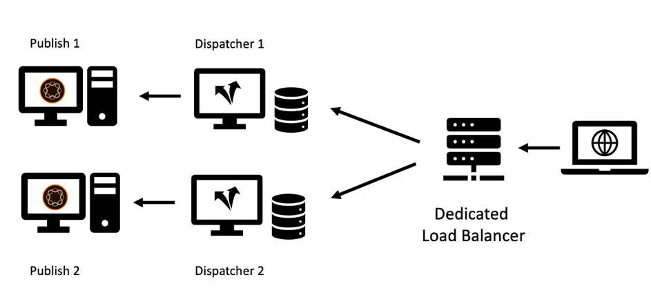
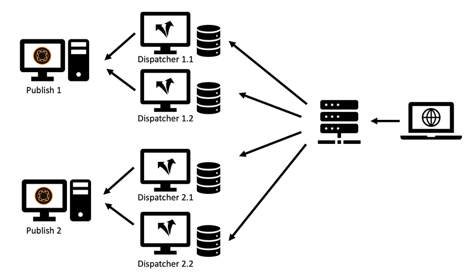

# 第2章 — 基礎結構

## 設定快取基礎結構

在本系列的第1章中，我們介紹了Publish系統的基本拓撲和Dispatcher。 一組發佈和Dispatcher伺服器可在許多變化中進行設定，具體取決於預期的負載、資料中心的拓撲以及所需的容錯移轉屬性。

我們將草擬最常見的拓撲，並描述優點及不足之處。 這份清單（當然）永遠不可能完整。 唯一的限制是想像力。

### 「舊版」設定

在早期，潛在的訪客人數不多，硬體昂貴，而且網頁伺服器並不像現在這樣被視為業務關鍵型伺服器。 常見的設定是將一個Dispatcher當做負載平衡器，並在兩個或更多發佈系統前加入快取。 Dispatcher核心的Apache伺服器非常穩定，且在大部分設定中都能滿足適當數量的請求。

*「舊版」Dispatcher設定 — 根據現今的標準，並不常見*

  

這是Dispatcher從收到其名稱的位置：它基本上是在傳送請求。 此設定已不再很常見，因為它無法滿足現今對效能和穩定性的更高要求。

### 多足式設定

現今稍有不同的拓撲比較常見。 多足拓朴的每個發佈伺服器會有一個Dispatcher。 專用的（硬體）負載平衡器位於AEM基礎結構前面，將請求分派給這兩個（或多個）分支：

*現代化的「標準」Dispatcher設定 — 易於處理和維護*

  

以下是這類設定的原因，

1. 網站平均提供的流量比過去多很多。 因此，需要擴展「Apache基礎結構」。

2. 「舊版」設定未在Dispatcher層級提供備援。 如果Apache Server發生問題，便無法連線整個網站。

3. Apache伺服器價格低廉。 這些服務是以開放原始碼為基礎，而且只要您擁有虛擬資料中心，就能快速完成布建作業。

4. 此設定可讓您以簡單的方式進行「滾動」或「交錯」更新案例。 只要在Publish 1上安裝新的軟體套件時關閉Dispatcher 1即可。 當安裝完成時，且您已透過內部網路進行充分煙霧測試Publish 1，您可以清除Dispatcher 1上的快取並重新開始，同時關閉Dispatcher 2以維護Publish 2。

5. 在此設定中，快取失效變得非常容易且具有確定性。 由於只有一個發佈系統連線到一個Dispatcher，因此只有一個Dispatcher要失效。 失效的順序和時機微不足道。

### 「向外擴展」設定

Apache Server價格低廉且易於布建，何不進一步推出該層級的擴充功能。 為何每個Publish伺服器前面沒有兩個或更多Dispatcher？

*「向外擴充」設定 — 有一些應用程式領域，但也有限制和注意事項*

  

您絕對可以這樣做！ 對於該設定，有許多有效的應用程式情境。 但也有一些限制和複雜性值得考慮。

#### 失效

每個發佈系統都會連線至多個Dispatcher，每個都會在內容變更時失效。

#### 維護

不用說，Dispatcher和Publish系統的初始設定比較複雜。 但也請記住，「滾動」版本的工作量也更高。 AEM系統在執行時可以而且必須更新。 但是明智的做法是在他們主動處理請求時不要這麼做。 通常您只想更新發佈系統的一部分，而其他部分仍在主動提供流量，然後在測試後，切換到其他部分。 如果您很幸運，而且可以在部署過程中存取負載平衡器，您可以在此處停用進行維護的伺服器路由。 如果您位在無法直接存取的共用負載平衡器上，您寧可關閉要更新之發佈的Dispatcher。 位置愈多，您必須關機的次數就愈多。 如果數量很大並且您計畫經常更新，建議使用一些自動化功能。 如果您沒有自動化工具，繼續擴充無論如何都不是個好主意。

在過去的專案中，我們使用不同的秘訣從負載平衡中移除發佈系統，而不需要直接存取負載平衡器本身。

負載平衡器通常會「ping」，此為特定頁面，用於檢視伺服器是否正常運作及執行中。 一個簡單的選擇通常是ping首頁。 但是，如果您想要使用ping訊號讓負載平衡器不要平衡流量，您可以選擇其他專案。 您可以建立專用範本或servlet，將其設定為回應以下專案： `"up"` 或 `"down"` （內文或作為http回應代碼）。 該頁面的回應當然不得在Dispatcher中快取，因此一律會從發佈系統全新擷取。 現在，如果您設定負載平衡器來檢查此範本或servlet，您可以輕鬆讓發佈「假定」它停止運作。 它不會是負載平衡的一部分，而且可以更新。

#### 全球分佈

「全球發佈」是「向外擴展」設定，您在每個發佈系統前有多個Dispatcher — 現在遍佈全球，以便更接近客戶並提供更優異的效能。 當然，在這種情況下，您沒有中央負載平衡器，而是有基於DNS和地理IP的負載平衡配置。

>[!NOTE]
>
>事實上，您就是要使用此方法建立某種內容發佈網路(CDN) — 因此，您應考慮購買現成的CDN解決方案，而非自行建立。 建置和維護自訂CDN並非易事。

#### 水平縮放

即使是在本機資料中心，「向外擴充」拓撲（在每個發佈系統前面有多個Dispatcher）也有一些優點。 如果您發現Apache Server因高流量（以及良好的快取命中率）而造成效能瓶頸，而且您無法再擴充硬體（藉由新增CPU、RAM和更快的磁碟），您可以藉由新增Dispatcher來提升效能。 這稱為「水平縮放」。 然而，這有限制，尤其是當您經常讓流量失效時。 我們將在下一節中說明此效果。

#### 向外擴展拓朴的限制

新增Proxy伺服器通常應該會提高效能。 但是，在某些情況下，新增伺服器實際上可能會降低效能。 如何進行？ 假設您有一個新聞入口網站，您每分鐘都會在此介紹新文章和頁面。 Dispatcher會透過「自動失效」來失效：每當發佈頁面時，同一網站上快取中的所有頁面都會失效。 這是一個有用的功能 — 我們在 [第1章](chapter-1.md) 此系列中 — 但這也意味著，當您的網站經常發生變更時，您會經常讓快取失效。 如果您每個發佈執行個體只有一個Dispatcher，則第一個請求頁面的訪客會觸發該頁面的重新快取。 第二個訪客已取得快取版本。

如果您有兩個Dispatcher，則第二個訪客有50%的機會未快取頁面，然後他會在再次轉譯該頁面時體驗到較大的延遲。 每個發佈擁有更多的Dispatcher會讓情況變得更糟。 實際發生的情況是，發佈伺服器會收到更多負載，因為它必須分別重新呈現每個Dispatcher的頁面。

*在經常發生快取排清的向外擴充案例中效能降低。*

  

#### 緩解過度擴充的問題

您可以考慮對所有Dispatcher使用中央共用儲存空間，或同步Apache伺服器的檔案系統以緩解問題。 我們只能提供有限的第一手經驗，但請做好準備，這會增加系統的複雜性，並可能帶來全新的錯誤類別。

我們曾經嘗試過NFS — 但是NFS會因為內容鎖定而造成巨大的效能問題。 這實際上會降低整體效能。

**結論**  — 不建議在數個排程程式之間共用通用檔案系統。

如果您遇到效能問題，請平均放大Publish和Dispatcher以避免發佈器執行個體上的尖峰負載。 發佈/Dispatcher比率並無黃金法則 — 它高度取決於請求的分佈以及發佈和快取失效的頻率。

如果您也擔心訪客體驗的延遲，請考慮使用內容傳遞網路、快取重新擷取、先佔式快取預熱、設定寬限時間，如所述 [第1章](chapter-1.md) 或參考以下的一些進階概念： [第3部分](chapter-3.md).

### 「交叉連線」設定

我們偶爾會看到的另一個設定是「交叉連線」設定：發佈執行個體沒有專用的Dispatcher，但所有Dispatcher都已連線到所有Publish系統。

  

*跨連線拓撲：增加備援與複雜性。*

乍一看，這提供了更多備援，而預算卻相對較少。 當其中一個Apache伺服器故障時，您仍然可以有兩個發佈系統來執行轉譯工作。 此外，如果其中一個Publish系統當機，您還有兩個Dispatcher提供快取負載。

但這也有代價。

首先，取一條腿進行維護相當麻煩。 事實上，這就是此方案的目的；提供更強大的彈性，並儘可能保持正常運作。 我們已經看過複雜的維護計畫，以瞭解如何處理這個問題。 請先重新設定Dispatcher 2，移除跨連線。 重新啟動Dispatcher 2。 正在關閉Dispatcher 1、更新Publish 1、...等等。 如果長度超過兩條腿，您應該仔細考慮。 您會得出結論，這實際上會增加複雜性和成本，並且是造成人為錯誤的強大來源。 最好將此自動化。 因此，如果您確實有人力資源將此自動化任務納入您的專案排程，最好檢查一下。 雖然您可以藉此節省一些硬體成本，但您可能會花費雙倍的IT人員。

其次，您可能在AEM上執行某些需要登入的使用者應用程式。 您會使用粘性工作階段，以確保永遠都會從相同的AEM執行個體提供一位使用者，以便您可以維護該執行個體的工作階段狀態。 進行此交叉連線設定後，您必須確定粘性工作階段在負載平衡器和Dispatcher上正常運作。 並非不可能 — 但您需要瞭解這一點，並新增一些額外的設定和測試時間，這同樣可能會節省您計畫節省的硬體。

### 結論

我們不建議您使用此跨連線配置作為預設選項。 但是，如果您決定使用它，您將會想要仔細評估風險和隱藏成本，並計畫將設定自動化納入您的專案中。

## 下一步

* [3 — 進階快取主題](chapter-3.md)
