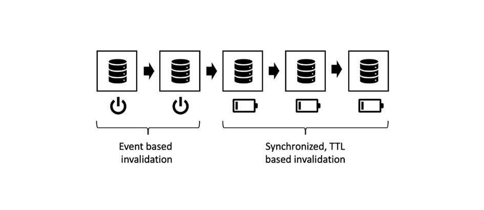
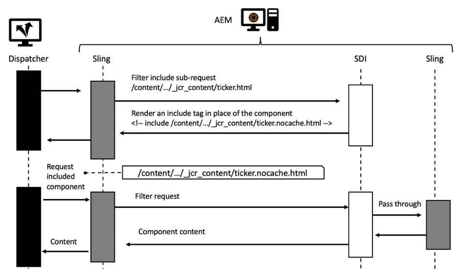

# 第3章 — 進階快取主題

*「電腦科學只有兩件難事：快取失效和命名事物。」*

 — 菲爾·卡爾頓

## 概覽

這是三個部分中的第3部分 — 在AEM中快取的系列。 前兩個部分著重於Dispatcher中的純http快取，以及有哪些限制。 本部分討論如何克服這些限制。

## 一般快取

[本系列的第1](chapter-1.md) 章 [和第2章](chapter-2.md) 主要著重於Dispatcher。我們已說明基本概念、限制，以及您需要取捨之處。

快取複雜度和複雜度並非Dispatcher專屬的問題。 快取通常很困難。

將Dispatcher當作工具箱中唯一的工具，實際上是個限制。

在本章中，我們想進一步擴充快取的檢視範圍，並開發一些想法，以便您能克服Dispatcher的部分缺點。 沒有萬靈丹 — 您必須在您的專案中做出權衡。 請記住，快取和失效的正確性總是會帶來複雜性，而複雜性又會帶來錯誤。

你需要在這些領域做出權衡，

* 效能和延遲
* 資源消耗/CPU負載/磁碟使用量
* 準確度/貨幣/穩定度/安全性
* 簡單性/複雜性/成本/可維護性/易出錯

這些維度在一個相當複雜的系統中相互關聯。 沒有簡單的，如果，那。 使系統更簡單可以使系統更快或更慢。 它可以降低您的開發成本，但會增加服務台的成本，例如，如果客戶看到過時內容或抱怨網站速度緩慢。 所有這些因素都需要相互考慮和平衡。 但現在，你應該有一個好主意，那就是沒有萬靈丹，也沒有一個「最佳實踐」 — 只有很多壞做法和一些好做法。

## 連結快取

### 概覽

#### 資料流

將頁面從伺服器傳送至用戶端的瀏覽器會跨多個系統和子系統。 如果仔細查看，則需要從源資料到流資料進行大量跳躍，每個跳躍資料都是快取的潛在候選資料。


*典型CMS應用程式的資料流*

<br> 

讓我們從硬碟上需要顯示在瀏覽器中的資料片段開始歷程。

#### 硬體和作業系統

首先，硬碟驅動器(HDD)本身在硬體中具有一些內置快取。 其次，裝載硬碟的作業系統使用空閒記憶體來快取頻繁訪問的塊，以加快訪問速度。

#### 內容儲存庫

下一級是CRX或Oak - AEM使用的檔案資料庫。 CRX和Oak將資料分割為可在記憶體中快取的區段，以避免存取HDD的速度變慢。

#### 第三方資料

大多數較大型的Web安裝也有第三方資料；來自產品資訊系統、客戶關係管理系統、舊式資料庫或任何其他任意web服務的資料。 不需要在需要時從來源提取此資料，尤其是當已知變更頻率不太高時。 因此，如果未在CRX資料庫中同步，則可快取它。

#### 業務層 — 應用程式/型號

通常您的範本指令碼不會透過JCR API轉譯來自CRX的原始內容。 您很可能有業務層介於其中，可合併、計算和/或轉換業務網域物件中的資料。 猜猜怎麼著 — 如果這些操作成本很高，您應該考慮快取它們。

#### 標籤片段

模型現在是元件標籤轉譯的基礎。 為何不快取呈現的模型？

#### Dispatcher、CDN和其他Proxy

關閉會將轉譯的HTML頁面傳送至Dispatcher。 我們已經討論過，Dispatcher的主要用途是快取HTML頁面和其他Web資源（儘管其名稱為）。 在資源到達瀏覽器之前，可能會先傳遞反向Proxy（可快取）和CDN（也用於快取）。 客戶端可以坐在辦公室中，僅通過代理授予Web訪問權限，而代理可能會決定快取並保存流量。

#### 瀏覽器快取

最後，但同樣重要的是，瀏覽器也快取。 這是一項容易被忽視的資產。 但這是快取鏈中最接近、最快的快取。 很可惜 — 它不會在使用者之間共用，但仍會在一個使用者的不同請求之間共用。

### 快取的位置及原因

這是一長串潛在的快取。 我們都面臨過時內容的問題。 但考慮到它有多少個階段，這是奇跡它大部分時間都在起作用。

但在這條鏈里，快取到底有意義嗎？ 一開始？ 最後？ 到處都是？ 這取決於……還取決於很多因素。 即使同一網站中有兩個資源，也可能想要針對該問題提供不同答案。

給你一個大致的概念，你可以考慮哪些因素，

**存留時間**  — 如果物件的固有即時時間較短（流量資料的存留時間可能比天氣資料短），快取可能不值得。

**生產成本 —** （從CPU週期和I/O來說）是對象的再生產和交付的成本。如果是便宜的快取，可能就不必了。

**大小**  — 快取大型物件需要更多資源。這可能是一個限制因素，必須與收益平衡。

**存取頻率**  — 如果很少存取物件，快取可能會失效。它們只會過時或失效，才能從快取中第二次存取。 這些項目只會封鎖記憶體資源。

**共用存取**  — 應在鏈上進一步快取多個實體使用的資料。事實上，快取鏈不是鏈，而是樹。 儲存庫中的一段資料可能用於多個模型。 這些模型又可供多個轉譯指令碼使用，以產生HTML片段。 這些片段包含在多個頁面中，並透過瀏覽器中的私人快取分送給多個使用者。 因此，「共用」並不意味著只在人與人之間共用，而是在軟體之間共用。 如果想查找潛在的「共用」快取，只需將樹跟蹤到根目錄並查找共同上階即可 — 您應在此快取。

**地理空間分佈**  — 如果您的使用者分散在全球各地，使用快取的分散網路可能有助於減少延遲。

**網路頻寬和延遲**  — 說到延遲，您的客戶是哪些人，以及他們使用的網路類型？也許你的客戶是使用老一代智慧手機的3G連接的欠發達國家的移動客戶？ 請考慮建立較小的物件，並在瀏覽器快取中加以快取。

這份清單目前還不全面，但我們認為你現在已經明白了。

### 連結快取的基本規則

同樣 — 快取很困難。 讓我們分享一些基本規則，這些規則是從以前的項目中提取的，可以幫助您避免項目中的問題。

#### 避免雙重快取

最後一章介紹的每個層在快取鏈中都提供了一些值。 或者通過節省計算週期，或者通過讓資料更接近消費者。 在鏈的多個階段中快取資料並不錯誤，但您應始終考慮下一階段的好處和成本。 快取Publish系統中的完整頁面通常不會提供任何好處，因為這已在Dispatcher中完成。

#### 混合失效策略

有三種基本的失效策略：

* **TTL、存留時間：** 物件在固定的時間長度後到期（例如「2小時後」）
* **到期日：** 物件會在未來的定義時間到期（例如「2019年6月10日下午5:00」）
* **事件型：** 物件因平台中發生的事件（例如頁面變更並啟動時）而明確失效

現在，您可以在不同的快取層上使用不同的策略，但有一些「有毒」策略。

#### 事件型失效


*純事件型失效：從內快取到外層無效*

<br> 

純粹基於事件的失效是最容易理解的失效，最容易理解，最容易理解，也最準確。

簡而言之，當物件變更後，快取會逐一失效。

您只需記住一條規則：

一律從內到外快取失效。 如果您先使外部快取失效，它可能會從內部快取中重新快取過時內容。 不要在快取何時重新刷新時做出任何假設 — 請確保。 最好是在&#x200B;_使內快取失效後觸發外快取_&#x200B;失效。

這就是理論。 但實際上，有很多問題。 事件必須通過網路進行分發，可能是通過網路進行分發。 在實際中，這使得無效方案的實施最為困難。

#### 自動 — 修復

在事件型失效的情況下，您應有應急計畫。 如果遺漏了失效事件，該怎麼辦？ 簡單的策略可能是在一定時間後使其失效或清除。 因此 — 您可能錯過了該事件，現在提供過時內容。 但物件的隱式TTL僅為數小時（天）。 所以最終，系統會自動加熱。

#### 純TTL型失效


*未同步的TTL型失效*

<br> 

這也是一個相當普遍的方案。 您將多層快取堆疊起來，每個快取都有權在一定時間內為對象提供服務。

易於實施。 不幸的是，很難預測一個資料的有效壽命。


*延長內部對象壽命的外快取*

<br> 

請考量上圖。 每個快取層會引入2分鐘的TTL。 現在 — 總TTL也必須2分鐘，對吧？ 不是。 如果外層在物體失效前即擷取物體，則外層實際上會延長物體的有效存留時間。 在這種情況下，有效的即時時間可以在2到4分鐘之間。 如果你同意了業務部門的意見，那麼一天就可以忍受 — 你有四層快取。 每層的實際TTL不得超過六小時……增加快取失敗率……

我們並不是說這是一個壞計畫。 你應該知道它的局限性。 這是一個簡單的策略。 只有當網站的流量增加時，您才可考慮更精確的策略。

*通過設定特定日期同步失效時間*

#### 到期日型失效

如果要在內部對象上設定特定日期並將其傳播到外部快取，則可獲得更可預測的有效壽命。


*同步到期日*

<br> 

但是，並非所有快取都能傳播日期。 當外部快取將兩個內部對象聚合到不同的過期日期時，這可能會變得很討厭。

#### 混合事件型和TTL型失效



*混合以事件為基礎和以TTL為基礎的策略*

<br> 

AEM領域的常見方案是在內部快取（例如，記憶體內快取，可以近乎即時處理事件）和外部以TTL為基礎的快取（可能您無權存取明確失效）處使用事件型失效。

在AEM世界中，當基礎資源變更，而您將此變更事件傳播至也能以事件為基礎運作的Dispatcher時，Publish系統中會針對商業物件和HTML片段提供記憶體內快取，但快取會失效。 之前會有TTL型CDN。

在Dispatcher前面放置一層（短）TTL型快取，可有效緩和通常會在自動失效後發生的尖峰。

#### 混合TTL — 和事件型失效


*有毒：混合TTL — 和事件型失效*

<br> 

這種組合是有毒的。 快取TTL或過期後，請勿放置和事件型快取。 還記得「純TTL」策略中的溢出效應嗎？ 這裡可以觀察到同樣的效果。 只有外部快取的失效事件可能不會再發生，否則，這會將快取物件的生命週期擴展至無窮大。


*TTL型和事件型結合：溢出至無窮*

<br> 

## 部分快取和記憶體內快取

您可以連結至轉譯程式的階段，以新增快取層。 從獲取遠程資料傳輸對象或建立本地業務對象到快取單個元件的已呈現標籤。 我們將在稍後的教學課程中介紹具體實作。 但或許您已打算自行實作其中幾個快取層。 因此，我們最起碼要介紹基本原則 — 以及成果。

### 警告字詞

#### 遵守存取控制

此處描述的技術相當強大，且每個AEM開發人員的工具箱中都有&#x200B;_must-have_。 但別太激動，明智地使用它們。 通過將對象儲存在快取中，並在後續請求中將其共用給其他用戶，實際上意味著繞過訪問控制。 這通常不會在公開網站上發生問題，但可能是使用者在取得存取權前需要登入時。

請考慮將網站主菜單的HTML標籤儲存在記憶體內快取中，以便在不同頁面之間共用。 實際上，這是儲存部分轉譯的HTML作為建立導覽的最佳範例，通常較昂貴，因為需要遍歷許多頁面。

您不會在所有頁面之間共用相同的功能表結構，也會與所有使用者共用，進而提高效率。 但等等……但功能表中可能有些項目僅保留給特定使用者群組。 在這種情況下，快取可能會變得更複雜。

#### 僅快取自定義業務對象

如果有的話 — 這是最重要的建議，我們可以給你：

>[!WARNING]
>
>僅快取您自己建立、淺層且沒有外發引用的不可變對象。

這是什麼意思？

1. 你不知道別人物品的預定生命週期。 請考慮您收到請求物件的參考，並決定加以快取。 現在，請求已結束，Servlet容器要為下一個傳入的請求回收該物件。 在這種情況下，其他人正在更改您認為您擁有獨佔控制權的內容。 不要忽視這一點 — 我們已經看到某個項目發生了類似的事情。 客戶看到的是其他客戶資料，而不是他們自己的資料。

2. 只要一個對象被一連串的其他引用引用所引用，就無法從堆中刪除它。 如果您在快取中保留引用的小對象，假設4MB的影像表示，您將很有可能遇到記憶體洩露問題。 快取應基於弱引用。 但是，弱的引用並不能如預期般有效。 這是產生記憶體洩漏和結束記憶體不足錯誤的絕對最佳方法。 而且 — 你不知道這些外來物體的記憶體大小，對吧？

3. 尤其是在Sling中，您幾乎可以調整每個物件。 請考慮將資源放入快取中。 下一個請求（具有不同的存取權限）會擷取該資源，並將其調整至resourceResolver或工作階段，以存取他無法存取的其他資源。

4. 即使您從AEM在資源周圍建立精簡的「包裝函式」，您也不得快取此快取，即使它是您自己的且不可變的。 包裝的物體會是參照（我們以前禁止），如果看起來很鋒利，就會產生與最後一個項目中所描述的相同的問題。

5. 如果要快取，請通過將原始資料複製到自己的共用對象中，建立自己的對象。 您可能希望通過引用在自己的對象之間進行連結，例如，您可能希望快取一個對象樹。 這沒問題，但只有您剛在相同請求中建立的快取對象，而且沒有從其他位置請求的對象（即使是「您的」對象的名稱空間）。 _復_ 制對象為鍵。並確保一次清除連結對象的整個結構，並避免對結構的傳入和傳出引用。

6. 是 — 並且保持對象不可變。 私人屬性，僅限和無設定者。

這是很多規則，但值得遵循。 即使你有經驗，超級聰明，一切都在掌控之中。 你項目的年輕同事剛剛大學畢業。 他不知道這些陷阱。 如果沒有陷阱，就沒有可避免的。 保持簡單易懂。

### 工具和程式庫

本系列內容旨在了解概念，並讓您能夠建立最適合使用案例的架構。

我們並未特別推廣任何工具。 但給你一些評估方法。 例如，AEM具有自6.0版以來固定TTL的簡單內建快取。您要使用它嗎？ 事件型快取會依循於鏈中的發佈上可能不會(提示：Dispatcher)。 但對作者來說，這或許是個不錯的選擇。 還有AdobeACS公域的HTTP快取，這可能值得考慮。

或者，您也可以根據[Ehcache](https://www.ehcache.org)等成熟的快取架構，自行建立快取。 這可用於快取Java對象和呈現的標籤（`String`對象）。

在某些簡單的情況下，您也許還可以使用並行哈希圖 — 您會在此處快速看到限制 — 無論是在工具中還是在您的技能中。 並行性與命名和快取一樣難以掌握。

#### 引用

* [ACS Commons http快取  ](https://adobe-consulting-services.github.io/acs-aem-commons/features/http-cache/index.html)
* [Ehcache快取框架](https://www.ehcache.org)

### 基本術語

我們不會在這裡深入探討快取理論，但我們覺得必須提供一些熱門話語，這樣您才能有一個良好的開端。

#### 快取逐出

我們談了很多無效和清除。 _快取_ 逐出與以下術語相關：在條目被逐出後，該條目不再可用。但是，逐出不是在條目過期時，而是在快取已滿時。 較新或「較重要」的項目會將較舊或較不重要的項目從快取中推送出。 你必須犧牲哪些條目是一個逐案的決定。 您可能想要驅逐那些最舊的或很少使用或上次訪問很久的。

#### 搶先快取

搶先快取表示在項目失效或視為過時時，會重新建立包含最新內容的項目。 當然，您只需要幾個資源，即可執行此操作，因為您確實經常且立即存取這些資源。 否則，您將浪費資源來建立可能永遠不會請求的快取項。 通過搶先建立快取項，可以減少快取失效後第一個請求對資源的延遲。

#### 快取預熱

快取預熱與搶先快取密切相關。 雖然你不會用這個詞做即時系統。 而且時間比前者更少。 失效後您不會立即重新快取，但您會在時間允許時逐漸填入快取。

例如，您會從負載平衡器取出Publish / Dispatcher支援，以便進行更新。 在重新整合頁面之前，您會自動對最常存取的頁面進行編目，以再次將其放入快取中。 當快取為「熱」時 — 已充足，您將腿重新整合到負載平衡器中。

或者你一次重新整合腿，但是你把流量調節到腿上，這樣它就有機會通過正常使用來溫暖它的快取。

或者，您也可以在系統閒置時，快取某些較不常存取的頁面，以減少實際請求存取這些頁面時的延遲。

#### 快取物件身分、裝載、失效相依性和TTL

一般而言，快取物件或「項目」有五個主要屬性，

#### 關鍵

這是您用來識別和物件的屬性。 擷取裝載或從快取中清除裝載。 例如，Dispatcher會以頁面的URL作為索引鍵。 請注意，Dispatcher不會使用頁面路徑。 這不足以區分不同的呈現方式。 其他快取可能使用不同的金鑰。 我們稍後會看一些例子。

#### 值/裝載

這是物體的寶庫，你要檢索的資料。 如果是Dispatcher，則為檔案內容。 但它也可以是Java對象樹。

#### TTL

TTL已經覆蓋了。 在此時間之後，系統將某個項目視為過時，不應再傳送。

#### 相依性

這與事件型失效有關。 該物件所依賴的原始資料為何？ 在第一部分，我們已經說過，真正和準確的依賴追蹤太複雜了。 但是，有了我們對系統的了解，你可以用一個更簡單的模型來近似依賴關係。 我們使足夠的對象無效以清除過時內容……而且可能無意中清除了超出要求的內容。 但是，我們仍試圖保持「清除一切」之下。

哪些對象取決於每個應用程式中的其他對象的真實內容。 我們稍後會提供一些範例，說明如何實作相依性策略。

### HTML片段快取


*在不同頁面上重新使用轉譯的片段*

<br> 

HTML片段快取是絕佳的工具。 其思想是快取記憶體內快取中元件產生的HTML標籤。 你可能會問，我為什麼要這麼做？ 我仍會快取Dispatcher中的整個頁面標籤，包括該元件的標籤。 我們同意。 您需要，但每頁一次。 您不會在頁面之間共用該標籤。

假設您正在每個頁面的頂端轉譯導覽。 每個頁面的標籤看起來都一樣。 但您會針對每個頁面一遍又一遍地呈現，而不是在Dispatcher中。 記住：自動失效後，需要重新轉譯所有頁面。 所以基本上，你運行的程式碼和結果是相同的幾百次。

根據我們的體驗，轉譯巢狀頂端導覽是一項昂貴的工作。 通常，您遍歷文檔樹的很大部分以生成導航項。 即使您只需要導覽標題和URL，頁面也必須載入記憶體中。 這裡，它們堵塞了寶貴的資源。 一次又一次。

但元件會在許多頁面之間共用。 而共用是指使用快取。 因此，您想要執行的操作是檢查導覽元件是否已呈現並快取，而非重新呈現只會發出快取值。

這個計畫有兩個美妙的細節很容易被遺漏：

1. 您正在快取Java字串。 字串沒有任何傳出的參考，且不可修改。 因此，考慮到上述警告，這是超安全的。

2. 失效也非常容易。 每當有任何變更時，您都要使此快取項目無效。 重建成本相對較低，因為它只需執行一次，然後被所有數百頁重複使用。

這可讓您的Publish伺服器大鬆一口氣。

### 片段快取的實現

#### 自訂標籤

在過去，JSP是模板引擎，使用自定義JSP標籤繞在元件呈現代碼周圍是很常見的。

```
<!-- Pseudo Code -->

<myapp:cache
  key=' ${info.homePagePath} + ${component.path}'
  cache='main-navigation'
  dependency='${info.homePagePath}'>

… original components code ..

</myapp:cache>
```

自訂標籤會擷取其內文，並將其寫入快取中，或防止執行其內文並輸出快取項目的裝載。

「金鑰」是其在首頁上應有的元件路徑。 我們不會在目前頁面上使用元件的路徑，因為這會為每頁建立一個快取項目，與我們共用該元件的意圖相抵觸。 我們也不僅使用元件相對路徑(`jcr:conten/mainnavigation`)，因為這會防止我們在不同網站中使用不同的導覽元件。

「快取」是儲存條目的指標。 您通常有多個快取，可將項目儲存在其中。 每個都可能有點不同。 因此，區分所儲存的內容是好事 — 即使最終只是字串。

「相依性」是快取項所依賴的。 「主導覽」快取可能有規則，如果節點「相依性」下方有任何變更，則必須清除相應項目。 因此，您的快取實施需要將自身註冊為儲存庫中的事件監聽器，以了解變更，然後套用快取專用規則，以找出需要失效的項目。

以上只是一個例子。 您也可以選擇擁有快取樹。 其中，第一層用於分隔網站（或租戶），而第二層則分支為內容類型（例如「主導覽」），因此您不需要像上述範例那樣新增首頁路徑。

另外，您也可以將此方法與更現代的HTL元件搭配使用。 然後HTL指令碼周圍就會有JSP包裝函式。

#### 元件篩選

但若採用純HTL方法，您寧可使用Sling元件篩選器建立片段快取。 我們還沒有看到這個，但我們將採取這樣的方法。

#### Sling Dynamic Include

如果您在變更環境（不同頁面）的內容中有某個常數（導覽），則會使用片段快取。

但您可能也會有相反的內容、相對恆定的內容（很少變更的頁面），以及該頁面上一些不斷變更的片段（例如即時票證）。

在此情況下，您可能會給予[Sling Dynamic Includes](https://sling.apache.org/documentation/bundles/dynamic-includes.html)機會。 本質上，這是元件篩選器，會圍繞動態元件，而非將元件轉譯至頁面中，而是建立參照。 此參考可以是Ajax呼叫，這樣瀏覽器就會包含元件，而且周圍的頁面可以靜態快取。 或者，Sling Dynamic Include可生成SSI指令（伺服器端包含）。 此指令將在Apache伺服器中執行。 如果您使用支援ESI指令碼的清漆或CDN，則甚至可以使用ESI — 邊包含指令。



*使用Sling Dynamic Include之請求的序列圖*

<br> 

SDI檔案說，您應停用結尾為「*.nocache.html」的URL快取，這樣很合理，因為您正在處理動態元件。

您可能會看到另一個使用SDI的選項：如果您&#x200B;_不_&#x200B;停用包含的Dispatcher快取，則Dispatcher的作用就像片段快取，類似於我們在最後一章中所述的：請求頁面時，頁面和元件片段會在Dispatcher中以平均和獨立的方式快取，並由Apache伺服器中的SSI指令碼匯整。 如此一來，您便可實作共用元件，例如主導覽（假設您一律使用相同的元件URL）。

理論上，這應該行得通。 但是……

我們建議不要這麼做：您將無法略過實際動態元件的快取。 SDI已全域設定，您對「較差手段 — 片段 — 快取」所做的變更也會套用至動態元件。

建議您仔細研究SDI檔案。 還有其他一些限制，但SDI在某些情況下是很有價值的工具。

#### 引用

* [docs.oracle.com — 如何編寫自定義JSP標籤](https://docs.oracle.com/cd/E11035_01/wls100/taglib/quickstart.html)
* [Dominik Süß — 建立和使用元件篩選器](https://www.slideshare.net/connectwebex/prsentation-dominik-suess)
* [sling.apache.org - Sling Dynamic Includes](https://sling.apache.org/documentation/bundles/dynamic-includes.html)
* [helpx.adobe.com — 在AEM中設定Sling Dynamic Includes](https://helpx.adobe.com/experience-manager/kt/platform-repository/using/sling-dynamic-include-technical-video-setup.html)


#### 模型快取


*基於模型的快取：一個業務對象，具有兩個不同的呈現*

<br> 

讓我們再次造訪導覽案例。 我們假設每個頁面都需要導覽的相同標籤。

但也許，情況並非如此。 您可能想要在代表&#x200B;_目前頁面_&#x200B;的導覽中呈現項目的不同標籤。

```
Travel Destinations

<ul class="maninnav">
  <li class="currentPage">Travel Destinations
    <ul>
      <li>Finland
      <li>Canada
      <li>Norway
    </ul>
  <li>News
  <li>About us
<ul>
```

```
News

<ul class="maninnav">
  <li>Travel Destinations
  <li class="currentPage">News
    <ul>
      <li>Winter is coming>
      <li>Calm down in the wild
    </ul>
  <li>About us
<is
```

這是兩種完全不同的呈現。 但是，_business object_ — 完整導覽樹 — 仍然相同。  此處的&#x200B;_業務對象_&#x200B;將是一個表示樹中節點的對象圖形。 此圖表可輕鬆儲存在記憶體內快取中。 但請記住，此圖表不得包含任何物件或參考您未自行建立的任何物件，尤其是現在的JCR節點。

#### 瀏覽器中的快取

我們已經觸及到瀏覽器快取的重要性，其中提供許多良好的教學課程。 最後，對於瀏覽器，Dispatcher只是遵循HTTP通訊協定的網路伺服器。

然而，儘管有這種理論，我們還是收集了一些我們找不到的、我們想分享的知識。

本質上，瀏覽器快取的運用方式有兩種，

1. 瀏覽器有快取的資源，可知確切的到期日。 在此情況下，它不會再次要求資源。

2. 瀏覽器有資源，但無法確定其是否仍有效。 在此情況下，會詢問Web伺服器（在我們的案例中為Dispatcher）。 如果資源自您上次交付後被修改，請將資源提供給我。 如果未變更，則伺服器會以「304 — 未變更」回應，且只會傳送中繼資料。

#### 除錯

如果您正在最佳化Dispatcher設定以進行瀏覽器快取，則在瀏覽器和網頁伺服器之間使用案頭代理伺服器會非常有用。 我們更喜歡卡爾·馮·蘭道的《Charles Web Debugging Proxy》。

使用Charles，您可以讀取會傳送至伺服器和從伺服器傳送的要求和回應。 此外，您還可以深入了解HTTP通訊協定。 現代瀏覽器也提供一些偵錯功能，但案頭代理的功能是前所未有的。 您可以控制傳輸的資料、限制傳輸、重播單個請求等。 用戶介面佈置清晰，相當全面。

最基本的測試是，如果靜態請求（對/etc/...）的數量隨著時間而變小，將網站當作一般使用者使用（其中的代理介於），然後檢查代理，因為這些請求應位於快取中，而不再被請求。

我們發現，代理可能會提供更清楚的概覽，因為快取請求未出現在記錄中，而某些瀏覽器內建的除錯程式仍會以「0毫秒」或「從磁碟」顯示這些請求。 這沒問題，也很準確，但可能會讓您的檢視略為模糊。

然後，您可以下鑽並檢查所傳輸檔案的標題，以查看「過期」http標題是否正確。 您可以重播請求，並設定如果已修改的開始標題，以查看伺服器是否以304或200回應代碼正確回應。 您可以觀察非同步呼叫的時間，也可以在一定程度上測試您的安全性假設。 記得我們告訴過您不要接受所有未明確預期的選取器嗎？ 您可以在此處播放URL和參數，並查看您的應用程式是否運作良好。

在對快取進行除錯時，我們只會要求您不要執行下列操作：

請勿在瀏覽器中重新載入頁面！

「瀏覽器重新載入」、_simple-reload_&#x200B;以及&#x200B;_forced-reload_(&quot;_shift-reload_&quot;)與一般頁面要求不同。 簡單的重新載入請求會設定標題

```
Cache-Control: max-age=0
```

而Shift-Reload（按一下重新載入按鈕時按住「Shift」鍵）通常會設定要求標題

```
Cache-Control: no-cache
```

兩個標題的效果類似，但稍有不同，但最重要的是，當您從URL槽開啟URL或在網站上使用連結時，它們會與一般要求完全不同。 一般瀏覽不會設定快取控制標題，但可能會是修改後的標題。

因此，如果您想要對正常瀏覽行為進行除錯，應確實執行下列動作：_正常瀏覽_。 使用瀏覽器的重新載入按鈕，是在設定中不看到快取配置錯誤的最佳方式。

請使用Charles代理查看我們在討論什麼。 是的，當您開啟請求時，可以在該處重播請求。 不需要從瀏覽器重新載入。

## 效能測試

透過使用代理，您可了解頁面的時間行為。 當然，這還遠不是效能測試。  效能測試需要許多用戶端並行請求您的頁面。

我們常常看到的常見錯誤是，效能測試只包含超少的頁數，而這些頁面只會從Dispatcher快取傳送。

如果您要將應用程式提升至即時系統，則負載與您測試的完全不同。

在即時系統中，存取模式並非只有您在測試中擁有的少數平均分配頁面（首頁和少數內容頁面）。 頁數大得多，請求的分佈也非常不均勻。 而且，當然，無法從快取100%提供即時頁面：來自發佈系統的無效請求會自動讓您寶貴資源的很大一部分失效。

啊，是的，當您重建Dispatcher快取時，您會發現，Publish系統的運作方式也有很大不同，這取決於您是僅請求少數幾個頁面，還是請求較多頁面。 即使所有頁面都同樣複雜，其編號也起到一定作用。 還記得我們說過的鏈式快取嗎？ 如果始終請求相同的少量頁，則可能性很大，因為包含原始資料的相應塊位於硬碟快取中，或者由作業系統快取這些塊。 此外，儲存庫很可能已快取其主記憶體中根據的區段。 因此，重新轉譯的速度會比您讓其他頁面立即互相驅逐，然後從各種快取中逐出快取快得多。

快取很困難，對依賴快取的系統進行測試也是如此。 那麼，你能做些什麼，讓現實生活中的情景更準確？

我們認為您必須執行多項測試，而且您必須提供多項效能索引，以衡量解決方案的品質。

如果您已有現有網站，請測量請求數以及請求的分發方式。 嘗試為使用類似請求分送的測試建立模型。 增加一些隨機性是無害的。 您不必模擬會載入靜態資源（例如JS和CSS）的瀏覽器，這些並不重要。 系統最終會在瀏覽器或Dispatcher中快取這些區段，且不會顯著增加負載。 但參考影像的確很重要。 在舊記錄檔中尋找其分送，並建立類似請求模式的模型。

現在，請對Dispatcher進行測試，完全不會快取。 這是你最壞的情況。 找出在最惡劣條件下，您的系統會變得不穩定的峰值負載。 您也可以視需要取出一些Dispatcher/Publish腿，讓情況更糟。

接下來，使用「開啟」的所有必要快取設定執行相同的測試。 慢慢提高並行請求，以熱化快取，並了解在這些最佳情況下，系統可以佔用多少資源。

平均的情況是，在啟用Dispatcher的情況下執行測試，但也會發生一些無效判定的情況。 您可以透過cronjob觸碰statfile，或以不定期的間隔將無效請求傳送至Dispatcher，來模擬此情況。 同時，別忘了不時清除某些非自動失效的資源。

您可以增加無效請求和增加負載，以變更最後一個案例。

這比線性負載測試要複雜一點，但可讓您對解決方案有更大的信心。

你也許會迴避這個努力。 但是，至少要在Publish系統上進行最壞的案例測試，結果是頁數較多（平均分配），以便了解系統的限制。 請務必正確解釋最佳案例的數量，並為您的系統配置足夠的預留空間。