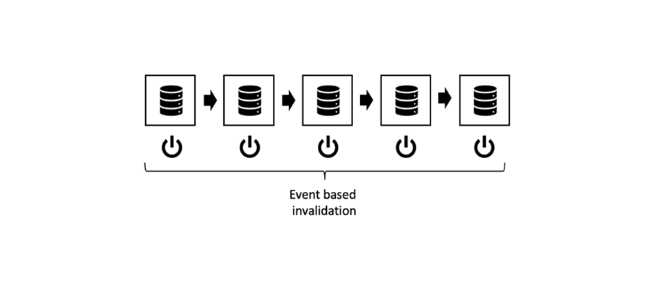

# 第3章 — 高級快取主題

*「在電腦科學領域，只有兩件難事：快取失效和命名。」*

 — 菲爾·卡爾頓

## 概觀

這是要快取的三個部分的第3部分AEM。 前兩個部分側重於Dispatcher中的純HTTP快取以及存在哪些限制。 本部分討論如何克服這些限制的一些想法。

## 常規快取

[第一章](chapter-1.md) 和 [第二章](chapter-2.md) 主要針對調度員。 我們已經解釋了基本問題、局限性以及您需要在哪些方面做出某些權衡。

快取複雜性和複雜性並非Dispatcher獨有的問題。 通常，快取是困難的。

將Dispatcher作為工具箱中的唯一工具實際上是一個真正的限制。

在本章中，我們希望進一步拓寬我們對快取的看法，並提出一些可以克服Dispatcher的一些缺點的想法。 沒有萬靈丹 — 你必須在項目中做出權衡。 請記住，隨著快取和失效的準確性總是會帶來複雜性，而隨著複雜性，可能會出現錯誤。

你需要在這些方面做出權衡，

* 效能和延遲
* 資源消耗/CPU負載/磁碟使用率
* 準確性/貨幣/穩定性/安全性
* 簡單性/複雜性/成本/可維護性/易出錯

這些維度在一個相當複雜的系統中相互關聯。 沒有簡單的，如果，那。 使系統更簡單可以使系統更快或更慢。 它可以降低您的開發成本，但會增加服務台的成本，例如，如果客戶看到陳腐的內容或抱怨網站速度慢的話。 這些因素需要相互考慮和平衡。 但到現在，你應該已經有了一個好主意：沒有銀彈，也沒有單一的「最佳實踐」 — 只有許多壞做法和一些好做法。

## 連結快取

### 概觀

#### 資料流

將頁面從伺服器傳送到客戶端瀏覽器跨越多個系統和子系統。 如果仔細查看，需要從源到漏極獲取多個跳數資料，每個跳數都是快取的潛在候選。


*典型CMS應用程式的資料流*

<br> 

讓我們從一塊硬碟上需要顯示在瀏覽器上的資料開始我們的旅程。

#### 硬體和作業系統

首先，硬碟驅動器(HDD)本身在硬體中有一些內置快取。 其次，裝載硬碟的作業系統使用空閒記憶體快取頻繁訪問的塊以加快訪問速度。

#### 內容儲存庫

下一級是CRX或Oak — 使用的文檔資料AEM庫。 CRX和Oak將資料分成可快取在記憶體中的段，以避免訪問HDD的速度變慢。

#### 第三方資料

大多數較大的Web安裝也有第三方資料；來自產品資訊系統、客戶關係管理系統、傳統資料庫或任何其它任意web服務的資料。 此資料不需要在需要時從源中提取 — 特別是在已知更改不太頻繁時。 因此，如果CRX資料庫中未同步，則可以快取它。

#### 業務層 — 應用/型號

通常，您的模板指令碼不會通過JCR API呈現來自CRX的原始內容。 您很可能在業務層之間合併、計算和/或轉換業務域對象中的資料。 猜猜怎麼著 — 如果這些操作成本高昂，您應該考慮快取它們。

#### 標籤片段

現在，模型是繪製元件標注的基礎。 為什麼不也快取渲染的模型？

#### Dispatcher 、 CDN和其他代理

關閉將呈現的HTML頁轉到調度程式。 我們已經討論過， Dispatcher的主要目的是快取HTML頁和其他Web資源（儘管其名稱）。 在資源到達瀏覽器之前，它可能會傳遞反向代理，該代理可快取，CDN也用於快取。 客戶端可能坐在辦公室裡，只能通過代理授予Web訪問權限，而代理可能決定快取並保存流量。

#### 瀏覽器快取

最後，但同樣重要的是，瀏覽器也會快取。 這是一項容易被忽視的資產。 但它是快取鏈中最接近、最快的快取。 遺憾的是，它不是在用戶之間共用的，而是仍在一個用戶的不同請求之間共用。

### 快取位置及原因

這是一長串潛在的快取。 我們都面臨著一些問題，我們看到過過時的內容。 但考慮到這個階段有多少，它大部分時間都在運作是個奇跡。

但在這條鍊子中，哪裡有意義？ 開始的時候？ 最後？ 到處都是？ 這取決於……它取決於很多因素。 即使是同一網站中的兩個資源，也可能希望得到一個不同的答案。

給你一個大致的概念，

**生存時間**  — 如果對象的固有生存時間較短（交通資料的生存時間可能比天氣資料短），則可能不值得快取。

**生產成本 —** 對象的重新生產和交付成本（就CPU週期和I/O而言）有多高。 如果是便宜的快取，也許沒必要。

**大小**  — 大型對象需要更多資源進行快取。 這可能是一個限制因素，必須與好處相平衡。

**訪問頻率**  — 如果對象很少訪問，則快取可能無效。 它們只會失效或失效，然後才能從快取中第二次訪問。 這些項目只會阻塞記憶體資源。

**共用訪問**  — 多個實體使用的資料應在鏈中進一步快取。 事實上，快取鏈不是鏈，而是樹。 儲存庫中的一個資料可能由多個模型使用。 這些模型又可由多個渲染指令碼使用以生成HTML片段。 這些片段被包括在多個頁面中，這些頁面在瀏覽器中以其專用快取分配給多個用戶。 所以&quot;分享&quot;並不只是指人與人之間的分享，而是指軟體之間的分享。 如果要查找潛在的「共用」快取，只需將樹跟蹤回根目錄，然後找到一個共同的祖先，即應在該位置快取。

**地理空間分佈**  — 如果您的用戶分佈於全球，則使用分佈式快取網路可能有助於減少延遲。

**網路頻寬和延遲**  — 說到延遲，您的客戶是誰，他們使用的是哪種網路？ 或許你的客戶是某個欠發達國家的移動客戶，他們使用老一代智慧手機的3G連接？ 請考慮建立較小的對象，並在瀏覽器快取中快取它們。

這份清單目前還不全面，但我們認為你現在已經明白了。

### 連結快取的基本規則

同樣，快取很困難。 讓我們分享一些基本規則，這些規則是我們從以前的項目中提取的，可以幫助您避免項目中的問題。

#### 避免雙快取

在最後一章中介紹的每個層在快取鏈中都提供了一些價值。 要麼通過節省計算週期，要麼通過讓資料更貼近消費者。 將資料快取到鏈的多個階段並不錯，但您應始終考慮下一階段的好處和成本。 在發佈系統中快取完整頁通常不會提供任何好處，因為在Dispatcher中已經這樣做了。

#### 混合失效策略

有三種基本的失效策略：

* **TTL，生存時間：** 對象在固定時間後過期（例如，「2小時後」）
* **到期日期：** 該對象在將來定義的時間過期（例如，「2019年6月10日下午5:00」）
* **基於事件：** 該對象由在平台中發生的事件（例如，當頁面被更改和激活時）顯式地無效

現在，你可以在不同的快取層上使用不同的策略，但有一些「有毒」的策略。

#### 基於事件的無效



*純事件失效：從內部快取到外層無效*

<br> 

純基於事件的失效是最容易理解的失效，理論上最容易理解的失效，最準確的失效。

簡單地說，在對象發生更改後，快取逐個失效。

你只需記住一條規則：

始終從內部到外部快取無效。 如果先使外部快取無效，則可能會從內部快取中重新快取陳舊內容。 不要在快取何時重新更新時做出任何假設 — 確保。 最好，通過觸發外部快取的無效 _後_ 使內部失效。

這就是理論。 但在實踐中，還有很多陷阱。 事件必須通過網路進行分發 — 可能是通過網路。 在實際中，這是最難實現的失效方案。

#### 自動 — 修復

對於基於事件的失效，您應制定應急計畫。 如果缺少失效事件怎麼辦？ 一個簡單的策略是在一定時間後失效或清除。 因此，您可能錯過了該活動，現在提供陳舊內容。 但您的對象的隱式TTL也只有幾小時（天）。 所以最終系統自動修復它自己。

#### 純TTL基失效


*基於未同步TTL的失效*

<br> 

這個也是一個比較普遍的方案。 您堆疊多層快取，每個快取都有權為對象提供一定時間。

易於實施。 不幸的是，很難預測資料的有效壽命。


*延長內部對象壽命的外部快取*

<br> 

請考慮上圖。 每個快取層引入2分鐘的TTL。 現在 — 總TTL也必須2分鐘，對吧？ 不是。 如果外層在對象失效之前就讀取該對象，則外層實際上延長了對象的有效生存時間。 在這種情況下，有效的即時時間可以在2到4分鐘之間。 考慮到您同意了業務部門的意見，有一天是可以接受的 — 而且您有四層快取。 每個層上的實際TTL不得超過6小時……增加快取丟失率……

我們不是說這是個壞計畫。 你應該知道它的局限性。 這是一個簡單的策略。 只有當站點流量增加時，您才可能考慮更準確的策略。

*通過設定特定日期同步失效時間*

#### 基於到期日期的失效

如果是在內部對象上設定特定日期並將其傳播到外部快取，則可獲得更可預測的有效生命時間。


*同步到期日期*

<br> 

但是，並非所有快取都能夠傳播日期。 當外部快取聚合兩個具有不同過期日期的內部對象時，這可能會變得令人討厭。

#### 基於事件和基於TTL的混合失效


*基於事件和基於TTL的混合策略*

<br> 

此外，世AEM界上的一個常見方案是在內部快取（例如，記憶體中快取，其中可以以接近即時的方式處理事件）和外部快取使用基於TTL的無效功能 — 在這些快取中，您可能沒有訪問顯式無效功能的權限。

在世AEM界中，當基礎資源發生更改並將此更改事件傳播到調度程式時，將在發佈系統中為業務對象和HTML片段提供記憶體快取，該快取無效。 在前面，您將擁有基於TTL的CDN。

在Dispatcher前面設定一層（短）的基於TTL的快取可以有效地緩和通常在自動失效後出現的高峰。

#### 混合TTL — 和基於事件的失效


*有毒：混合TTL和基於事件的無效*

<br> 

這種組合是有害的。 在基於TTL或基於過期的快取後，切勿放置基於事件的快取。 還記得&quot;純TTL&quot;策略中的溢出效應嗎？ 這裡可以觀察到同樣的效應。 只是外部快取的失效事件已發生，可能不會再次發生 — 這樣，可以將快取對象的壽命擴展到無窮大。


*基於TTL和基於事件的組合：溢出到無窮*

<br> 

## 部分快取和記憶體中快取

可以掛接到渲染過程的階段，以添加快取層。 從獲取遠程資料傳輸對象或建立本地業務對象到快取單個元件的呈現標籤。 我們將在後面的教程中介紹具體實施。 但是，也許您已經計畫自己實施了其中幾個快取層。 因此，我們至少可以在這裡介紹基本原則 — 以及要點。

### 警告詞

#### 尊重訪問控制

這裡描述的技術非常強大 _必須_ 在開發AEM人員的工具箱中。 但別太激動，明智地使用它們。 通過將對象儲存在快取中並在後續請求中將其共用給其他用戶實際上意味著規避訪問控制。 這通常不是面向公共網站的問題，但可能是用戶在獲得訪問權之前需要登錄時的問題。

請考慮將站點主菜單的HTML標籤儲存在記憶體快取中，以在不同頁面之間共用。 實際上，這是儲存部分渲染HTML的完美示例，因為建立導航通常非常昂貴，因為它需要遍歷大量頁面。

您不是在所有頁面之間共用相同的菜單結構，而是與所有用戶共用，這使它更加高效。 但等等……但菜單中可能有些項目僅保留給特定用戶組。 在這種情況下，快取會變得複雜一些。

#### 僅快取自定義業務對象

如果有的話 — 這是最重要的一條建議，我們可以給你：

>[!WARNING]
>
>只快取屬於您的、不可變的、您自己構建的、淺的且沒有傳出引用的對象。

這是什麼意思？

1. 你不知道別人物品的預定活動週期。 請考慮您看到對請求對象的引用並決定將其快取。 現在，請求已結束，Servlet容器希望為下一個傳入請求回收該對象。 在這種情況下，其他人正在改變你認為你擁有獨家控制權的內容。 不要忽視這一點 — 我們已經看到類似的事情正在發生在一個項目中。 客戶看到的是其他客戶資料，而不是自己的資料。

2. 只要對象被其它引用鏈引用，就無法從堆中刪除它。 如果您在快取中保留了一個本應小的引用對象，例如4MB的映像，您就很有可能遇到記憶體洩漏問題。 快取應基於弱引用。 但是，弱的引用並不像你預期的那樣有效。 這是產生記憶體洩漏並以記憶體不足錯誤結束的絕對最佳方法。 而且，你不知道這些外來對象的保留記憶體的大小，對吧？

3. 尤其是在Sling中，你可以（幾乎）將每個對象彼此適應。 考慮將資源放入快取。 下一個請求（具有不同的訪問權限）將提取該資源並將其調整到resourceResolver或會話中，以訪問他無權訪問的其他資源。

4. 即使您在資源周圍建立了精簡的「包裝器」AEM，也不能快取該「包裝器」，即使它是您自己的、不可變的。 包裝的對象將是一個參照（我們以前禁止它），如果我們看起來很鋒利，這基本上會產生與上一項中描述的問題。

5. 如果要快取，請通過將基元資料複製到自己的共用對象來建立自己的對象。 您可能希望通過引用在您自己的對象之間連結 — 例如，您可能希望快取對象樹。 這沒關係，但只快取您剛剛在同一請求中建立的對象，並且沒有從其他位置請求的對象（即使是「您」對象的名稱空間）。 _複製對象_ 是關鍵。 同時確保一次清除連結對象的整個結構，並避免對結構的傳入和傳出引用。

6. 是 — 保持對象不變。 專用屬性，僅且沒有設定者。

這是很多規則，但值得遵循。 即使你經驗豐富，非常聰明，一切都在掌控之中。 你項目中的年輕同事剛剛大學畢業。 他不知道這些陷阱。 如果沒有陷阱，就沒什麼可避免的。 保持簡單易懂。

### 工具和庫

此系列旨在瞭解概念並使您能夠構建最適合您的使用案例的體系結構。

我們沒有特別推廣任何工具。 但是給你一些如何評估它們的提示。 例如，AEM自6.0版起，具有固定TTL的簡單內置快取。你要用嗎？ 在鏈中基於事件的快取跟隨的發佈上可能不會(提示：調度程式)。 但對作家來說，這可能是一個不錯的選擇。 還有一個HTTP快取，它通過AdobeACS公域進行，這可能是值得考慮的。

或者，您基於成熟的快取框架構建自己的 [Ehcache](https://www.ehcache.org)。 這可用於快取Java對象和呈現的標籤(`String` 對象)。

在一些簡單的情況下，您也可以使用併發哈希映射來解決問題 — 您會很快在此處看到限制 — 無論是在工具上還是在技能上。 併發與命名和快取一樣難於掌握。

#### 引用

* [ACS公域http快取 ](https://adobe-consulting-services.github.io/acs-aem-commons/features/http-cache/index.html)
* [Ehcache快取框架](https://www.ehcache.org)

### 基本術語

我們不會太深入地研究快取理論，但我們覺得必須提供一些熱門詞語，這樣你就有了一個好的啟動點。

#### 快取逐出

我們談論了很多無效和清除。 _快取逐出_ 與以下條款相關：在條目被逐出後，它不再可用。 但逐出不是在條目過時時，而是在快取已滿時發生。 較新或「較重要」的項目會將較舊或較不重要的項目從快取中移出。 你必須犧牲哪些條目是個個案決定。 您可能想要逐出那些最舊的、很少使用或上次訪問時間較長的。

#### 搶先快取

搶佔式快取是指在條目失效或被認為過時時使用新內容重新建立條目。 當然，您只需使用少量資源即可完成此操作，您確實會頻繁且立即訪問。 否則，您將浪費資源建立可能從未請求的快取條目。 通過搶先建立快取條目，可以減少快取失效後第一個請求對資源的延遲。

#### 快取預熱

快取預熱與搶佔式快取密切相關。 雖然你不會用這個詞來作為即時系統。 與前者相比，時間約束更少。 在失效後，您不會立即重新快取，但是在時間允許時，您會逐漸填充快取。

例如，從負載平衡器中取出「發佈/調度程式」腿來更新它。 在重新整合之前，您會自動爬網最頻繁訪問的頁面，以將它們重新放入快取中。 當快取「溫暖」時 — 已充足填充，您將腿重新整合到負載平衡器中。

或者你可以立即重新整合這條腿，但是你可以把流量限制在這條腿上，這樣它就有機會通過常規方式來溫暖它的快取。

或者，您也希望在系統空閒時快取一些訪問頻率較低的頁面，以減少實際請求訪問這些頁面時的延遲。

#### 快取對象標識、負載、失效依賴項和TTL

一般來說，快取對象或&quot;條目&quot;有五個主要屬性，

#### 金鑰

這是標識，是標識和對象的屬性。 要檢索其負載，或從快取中清除它。 例如，調度程式使用頁面的URL作為鍵。 注意，調度程式不使用頁路徑。 這不足以區分不同的渲染效果。 其他快取可能使用不同的密鑰。 稍後再看一些例子。

#### 值/負載

這是物體的寶庫，你要檢索的資料。 如果是調度員，則是檔案內容。 但它也可以是Java對象樹。

#### TTL

我們已經覆蓋了TTL。 條目被視為過時且不應再傳送的時間。

#### 依賴項

這涉及基於事件的無效。 該對象所依賴的原始資料是什麼？ 在第一部分，我們已經說過，一個真實而準確的依賴關係跟蹤太複雜了。 但是，通過我們對系統的瞭解，您可以用一個更簡單的模型來近似依賴關係。 我們使足夠多的對象失效以清除陳舊內容……可能無意中清除的內容超出了要求。 但是，我們仍試圖保持低於「清除一切」。

在每個應用程式中，哪些對象取決於其他對象的真實性。 我們稍後將給您一些如何實施依賴關係策略的示例。

### HTML片段快取


*在不同頁面上重新使用呈現的片段*

<br> 

HTML片段快取是一個強大的工具。 其思想是在記憶體內快取中快取由元件生成的HTML標籤。 你可能會問，我為什麼要這麼做？ 我仍要快取調度程式中整個頁面的標籤，包括該元件的標籤。 我們同意。 確實，但每頁一次。 您未在頁面之間共用該標籤。

想像一下，您正在每頁的頂部繪製導航。 每個頁面上的標注看起來相同。 但是，您會一遍又一遍地為每個頁面呈現它，而不是在Dispatcher中。 記住：自動失效後，需要重新呈現所有頁面。 所以基本上，你運行相同的代碼，同樣的結果成百上千次。

根據我們的經驗，繪製嵌套的頂部導航是一項非常昂貴的任務。 通常，您會遍歷文檔樹的一大部分來生成導航項。 即使您只需要導航標題和URL，也必須將頁面載入到記憶體中。 而這裡，它們正在堵塞寶貴的資源。 一遍又一遍。

但元件是在許多頁面之間共用的。 而共用某件事就是使用快取的表示。 因此，您要做的是檢查導航元件是否已呈現和快取，而不是重新呈現，只發出快取值。

這個計畫有兩個美妙的細節很容易遺漏：

1. 您正在快取Java字串。 字串沒有任何傳出引用，並且不可變。 因此，考慮到上述警告，這是超級安全的。

2. 失效也非常容易。 無論何時任何內容更改您的網站，您都希望使此快取項失效。 重建相對便宜，因為它只需執行一次，然後被所有數百頁重新使用。

這對您的發佈伺服器大有幫助。

### 片段快取的實現

#### 自定義標籤

在以前，您將JSP用作模板引擎時，使用自定義JSP標籤環繞元件呈現代碼是很常見的。

```
<!-- Pseudo Code -->

<myapp:cache
  key=' ${info.homePagePath} + ${component.path}'
  cache='main-navigation'
  dependency='${info.homePagePath}'>

… original components code ..

</myapp:cache>
```

自定義標籤將捕獲其主體並將其寫入快取或阻止其主體執行並輸出快取項的負載。

「Key」是它在首頁上應具有的元件路徑。 我們不會使用當前頁面上元件的路徑，因為這將為每個頁面建立一個快取條目 — 這與我們共用該元件的意圖相矛盾。 我們也不僅使用元件相對路徑(`jcr:conten/mainnavigation`)，因為這將阻止我們在不同的站點中使用不同的導航元件。

「快取」是儲存條目的指示器。 您通常有多個快取，將項目儲存到其中。 每個人的行為都可能有所不同。 因此，區分儲存的內容是好的 — 即使最終只是字串。

「依賴關係」是快取項所依賴的。 「主導航」快取可能有一條規則，即如果節點「依賴項」下有任何更改，則必須清除相應條目。 因此 — 您的快取實現需要將自身註冊為儲存庫中的事件偵聽器，以瞭解更改，然後應用快取特定的規則來找出需要失效的內容。

以上只是一個例子。 您還可以選擇有快取樹。 其中，第一級用於分離站點（或租戶），而第二級則分支為內容類型（例如「主導航」），這樣，您就可以不必像上例那樣添加首頁路徑。

順便說一下，您還可以將此方法與基於更現代HTL的元件一起使用。 然後，在HTL指令碼周圍將有一個JSP包裝。

#### 元件篩選器

但是，在純HTL方法中，您寧可使用Sling元件篩選器構建片段快取。 我們還沒有在野外看到，但我們將採取這樣的方法。

#### 吊具動態包括

如果在變化環境（不同頁面）的上下文中有某個常數（導航），則使用片段快取。

但是，您可能也會遇到相反的情況，一個相對恆定的上下文（一個很少改變的頁面）和該頁面上一些不斷改變的片段（例如，一個即時的提單）。

在這種情況下，你可以 [吊具動態包括](https://sling.apache.org/documentation/bundles/dynamic-includes.html) 一個機會。 本質上，這是一個元件過濾器，它環繞動態元件，而不是將元件渲染到它建立參照的頁面中。 此引用可以是Ajax調用，以便瀏覽器包含元件，從而可以靜態快取周圍的頁面。 或者，Sling Dynamic Include可以生成SSI指令（伺服器端包括）。 此指令將在Apache伺服器中執行。 如果您使用ISHE或支援ESI指令碼的CDN，則甚至可以使用ESI - Edge Side Include指令。


*使用Sling Dynamic Include的請求序列圖*

<br> 

SDI文檔說，您應禁用以「*.nocache.html」結尾的URL的快取，這是有意義的，因為您正在處理動態元件。

您可能會看到另一個使用SDI的選項：如果 _不_ 禁用包含的調度程式快取，Dispatcher的作用與我們在上一章中描述的片段快取類似：頁面和元件片段在調度程式中被平等和獨立地快取，並在請求頁面時由Apache伺服器中的SSI指令碼拼接在一起。 這樣，您就可以實現共用元件（如主導航）（如果始終使用相同的元件URL）。

理論上，這應該行得通。 但是……

我們建議不要這樣做：您將無法繞過實際動態元件的快取。 SDI是全局配置的，您對「較差手段片段快取」所做的更改也將應用於動態元件。

我們建議您仔細研究SDI文檔。 SDI還有一些其他的限制，但在某些情況下，SDI是一個很有價值的工具。

#### 引用

* [docs.oracle.com — 如何編寫自定義JSP標籤](https://docs.oracle.com/cd/E11035_01/wls100/taglib/quickstart.html)
* [Dominik Süß — 建立和使用元件濾鏡](https://www.slideshare.net/connectwebex/prsentation-dominik-suess)
* [sling.apache.org - Sling動態包括](https://sling.apache.org/documentation/bundles/dynamic-includes.html)
* [helpx.adobe.com — 在中設定Sling Dynamic Include AEM](https://helpx.adobe.com/experience-manager/kt/platform-repository/using/sling-dynamic-include-technical-video-setup.html)


#### 模型快取


*基於模型的快取：一個商業對象，具有兩種不同的渲染*

<br> 

讓我們再次回顧一下導航的案例。 我們假設，每個頁面都需要導航的相同標籤。

但也許，事實並非如此。 您可能希望為表示 _當前頁_。

```
Travel Destinations

<ul class="maninnav">
  <li class="currentPage">Travel Destinations
    <ul>
      <li>Finland
      <li>Canada
      <li>Norway
    </ul>
  <li>News
  <li>About us
<ul>
```

```
News

<ul class="maninnav">
  <li>Travel Destinations
  <li class="currentPage">News
    <ul>
      <li>Winter is coming>
      <li>Calm down in the wild
    </ul>
  <li>About us
<is
```

這是兩種完全不同的渲染。 然而， _業務對象_  — 完整導航樹 — 相同。  的 _業務對象_  這是一個對象圖，表示樹中的節點。 該圖形可以容易地儲存在記憶體快取中。 但請記住，此圖形不得包含任何對象或引用您未自己建立的任何對象 — 特別是現在的JCR節點。

#### 在瀏覽器中快取

我們已經觸及了在瀏覽器中快取的重要性，並且有許多好的教程。 最後，對於瀏覽器， Dispatcher只是遵循HTTP協定的Web伺服器。

然而，儘管有這種理論，我們還是收集了一些知識，這些知識是我們沒有發現的，我們想分享的。

從本質上講，瀏覽器快取可以用兩種不同的方式進行，

1. 瀏覽器具有快取的資源，它知道該資源的確切到期日期。 在這種情況下，它不再請求資源。

2. 瀏覽器有資源，但無法確定它是否仍然有效。 在這種情況下，它將詢問web伺服器（我們的情況中的Dispatcher）。 如果自您上次交付資源後已修改，請將其給我。 如果未更改，伺服器將以「304 — 未更改」應答，並且只傳輸元資料。

#### 偵錯

如果您正在優化Dispatcher設定以用於瀏覽器快取，則在瀏覽器和web伺服器之間使用案頭代理伺服器將非常有用。 我們更喜歡卡爾·馮·蘭道的《查爾斯網路調試代理》。

使用Charles，您可以讀取從伺服器發送的請求和響應。 而且，您可以瞭解HTTP協定的很多資訊。 現代瀏覽器也提供了一些調試功能，但案頭代理的功能是前所未有的。 您可以控制傳輸的資料、限制傳輸、重放單個請求等。 用戶介面佈置清晰，比較全面。

最基本的test是將網站作為普通用戶使用（代理介於之間），並在靜態請求（對/etc/.....）數量隨時間變小時簽入代理，因為這些請求應位於快取中且不再請求。

我們發現，代理可能會提供更清晰的概述，因為快取的請求不會顯示在日誌中，而某些瀏覽器內置的調試程式仍會以「0毫秒」或「從磁碟」顯示這些請求。 這是正確和準確的，但可以讓你的視圖稍加模糊。

然後，您可以細化並檢查已傳輸檔案的標頭，以查看（例如，「過期」http標頭是否正確）。 您可以重播請求，並設定if-modified-scine標頭，以查看伺服器是否正確地使用304或200響應代碼進行響應。 您可以觀察非同步呼叫的時間，也可以在一定程度上test您的安全假設。 記住，我們告訴您不要接受所有不明確期望的選擇器？ 在這裡，您可以播放URL和參數，並查看您的應用程式是否表現良好。

在調試快取時，我們只要求您不要執行以下操作：

不要在瀏覽器中重新載入頁面！

「瀏覽器重新載入」， _簡單重裝_ 以及 _強制重裝_ (&quot;)_換檔重裝_&quot;)與普通頁面請求不同。 簡單的重裝請求設定標題

```
Cache-Control: max-age=0
```

而Shift-Reload（在按一下重裝按鈕時按住Shift鍵）通常會設定請求標頭

```
Cache-Control: no-cache
```

兩個標頭的效果相似但稍有不同，但最重要的是，當您從URL插槽中開啟URL或使用站點上的連結時，它們與正常請求完全不同。 正常瀏覽未設定Cache-Control標頭，但可能是if-modified-scine標頭。

因此，如果要調試正常瀏覽行為，您應該正確執行以下操作： _正常瀏覽_。 使用瀏覽器的重新載入按鈕是在配置中看不到快取配置錯誤的最佳方法。

用你的查理代理查看我們在說什麼。 是的，當您開啟時，您可以在此處重播請求。 無需從瀏覽器重新載入。

## 效能測試

通過使用代理，您可以感知頁面的時間行為。 當然，這遠不是表演test。  效能test需要多個客戶端並行請求您的頁面。

我們經常看到的一個常見錯誤是，效能test只包含極少的頁數，而這些頁僅從Dispatcher快取中傳送。

如果要將應用程式升級到即時系統，則負載與已測試的負載完全不同。

在即時系統中，訪問模式並不是您在test中擁有的分佈均勻的頁面數量少（首頁和內容頁數少）。 頁面數量大得多，請求分佈極不均勻。 當然，即時頁面不能100%地從快取中提供：有來自發佈系統的無效請求正在自動使您的大量寶貴資源失效。

啊，是的 — 當您重建Dispatcher快取時，您會發現，發佈系統的行為也有很大不同，這取決於您是僅請求少量頁面還是請求更大數量頁面。 即使所有頁面都同樣複雜，它們的數字也起到一定作用。 還記得我們說過關於鏈式快取的嗎？ 如果您總是請求相同數量的頁面，則很可能會出現這樣的情況：包含原始資料的相應塊位於硬碟快取中，或者這些塊由作業系統快取。 另外，儲存庫很有可能將相應段快取到其主記憶體中。 因此，重新呈現的速度比當其他頁面逐出時要快得多。

快取很難，對依賴快取的系統進行測試也很困難。 那麼，你能做些什麼來讓真實生活更準確？

我們認為您必須執行多個test，並且您必須提供多個效能指數作為衡量解決方案質量的指標。

如果您已經擁有一個現有網站，請測量請求數以及請求的分發方式。 嘗試為使用類似請求分發的test建模。 增加一些隨機性不會有害。 您不必模擬一個可載入靜態資源（如JS和CSS）的瀏覽器 — 這些並不重要。 它們最終會快取在瀏覽器或Dispatcher中，而且不會顯著增加負載。 但參考影像確實很重要。 在舊日誌檔案中查找其分發，並建立類似請求模式的模型。

現在，與Dispatcher執行test，但Dispatcher根本不快取。 那是你最壞的情況。 瞭解在最壞的情況下，系統的最大負載是什麼。 如果需要，還可以取出幾個「Dispatcher/Publish」腿來使情況變糟。

接下來，將所有所需的快取設定執行相同的test到「開」。 緩慢增加並行請求，以便預熱快取，並瞭解在這些最佳情況下系統可以承受多少。

平均情況情形是運行test時啟用了Dispatcher，但同時發生了一些無效。 您可以通過cronjob觸碰statfile或以不規則間隔將無效請求發送到Dispatcher來模擬此情況。 不要忘記，還會時不時清除一些非自動失效的資源。

您可以通過增加無效請求和增加負載來改變上一個方案。

這比僅僅是線性負載test要複雜一些，但對您的解決方案更有信心。

你可能會迴避這種努力。 但是，至少要在發佈系統上執行最壞情況的test，其頁數較多（均分），以查看系統的限制。 請確保正確解釋最佳案例方案的數量，並為系統配備足夠的空間。
