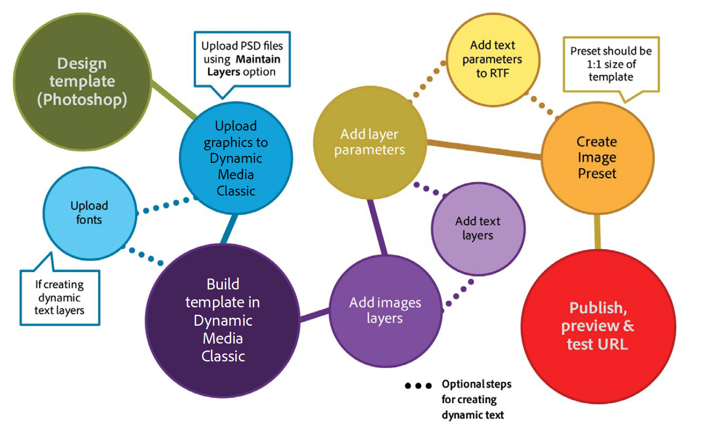

# 基本範本簡介 {#basic-templates}

在Dynamic Media Classic術語中，範本是一份檔案，可在範本發佈後透過URL動態變更。 Dynamic Media Classic提供基本範本、從影像伺服器呼叫的影像型範本，並包含影像和轉譯的文字。

範本最強大的一個功能，是具有直接整合點，可讓您將範本系結至資料庫。 因此，您不僅可以提供影像並調整其大小，還可以查詢資料庫以尋找新項目或銷售項目，並使其顯示為影像上的覆蓋。 您可以要求提供項目的說明，並以您選擇的字型和版面的標籤形式顯示。 可能性是無限的。

基本範本的實作方式有許多不同，從簡單到複雜。 例如：

- 基本的銷售。 如果該產品有免運費，則使用「免運費」等標籤。 這些標籤是由Photoshop的商品團隊所設定，而網路會使用邏輯來知道何時將標籤套用至影像。
- 進階銷售。 每個範本有多個變數，且可同時顯示多個選項。 使用資料庫、清單和業務規則來確定何時將產品顯示為「Just In」、「Clearance」或「Sold Out」。 也可以使用產品後面的透明度來顯示不同的背景，例如在不同的房間。 可在產品詳細資訊頁面上重新規劃相同的範本和/或資產，以顯示不同背景上相同產品的較大或可縮放版本。

請務必了解，Dynamic Media Classic僅提供這些範本型應用程式的視覺部分。 Dynamic Media Classic公司或其整合合作夥伴必須提供業務規則、資料庫和開發技能，才能建立應用程式。 沒有「內置」模板應用程式；設計人員在Dynamic Media Classic中設定範本，而開發人員則使用URL呼叫來變更範本中的變數。

在本教學課程的本節結束前，您將了解如何：

- 上傳PhotoshopPSD至Dynamic Media Classic，以作為範本的基礎。
- 建立由影像層組成的簡單銷售基本範本。
- 新增文字層，並透過使用參數使其變數。
- 建立範本URL並透過網頁瀏覽器動態操控影像。

>[!NOTE]
>
>本章中的所有URL僅用於說明目的；它們不是即時連結。

## 基本範本概觀

基本範本（或簡稱「範本」）的定義是URL可定址的分層影像。 最終結果是影像，但可透過URL變更。 它可由像片、文字或圖形組成 — Dynamic Media Classic中任何PTIFF資產的組合。

範本與PhotoshopPSD檔案最相似，因為它們有類似的工作流程和類似的功能。

- 兩者都由層組成，類似於堆疊的醋酸鹽片。 您可以合成部分透明的影像，並通過圖層的透明區域查看下面的圖層。
- 可以移動和旋轉圖層以重新定位內容，並可以改變不透明度和混合模式以使內容部分透明。
- 可以建立基於文本的圖層。 畫質可能很高，因為影像伺服器使用的文字引擎與Photoshop和Illustrator相同。
- 可以對每個圖層應用簡單的圖層樣式，以建立特殊效果，如陰影或光暈。

不過，與PhotoshopPSD不同，圖層可以完全動態，並透過影像伺服器上的URL加以控制。

- 您可以將變數新增至所有範本屬性，讓您輕鬆即時變更其組成。
- 稱為參數的變數可讓您僅公開要變更的範本部分。

您只需為每個將改變的圖層添加佔位符，而不像在Photoshop中那樣將所有圖層放入單個檔案中，並顯示和隱藏這些圖層（儘管您也可以這樣做，如果您願意的話）。

使用佔位符時，您可以將圖層的內容動態替換為另一個已發佈的資產，並自動取用其替換的圖層的相同屬性（如大小和旋轉）。

由於基本範本通常在Photoshop中設計，但是會透過URL部署，因此範本專案需要兼顧設計與技術技能。 我們通常假設從事創意範本工作的人員是Photoshop設計人員，而實作範本的人員是網頁開發人員。 創意與開發團隊必須密切合作，才能使範本成功。

模板項目可能相對簡單或極其複雜，具體取決於應用程式的業務規則和需求。 基本範本是從影像伺服器呼叫的，但由於Dynamic Media Classic環境的彈性，您甚至可以在其他範本內巢狀內嵌範本，讓您建立相當複雜的影像，這些影像可以由通常命名的變數連結。

- 深入了解 [範本基本知識](https://experienceleague.adobe.com/docs/dynamic-media-classic/using/template-basics/quick-start-template-basics.html).
- 了解如何建立 [基本範本](https://experienceleague.adobe.com/docs/dynamic-media-classic/using/template-basics/creating-template.html#creating_a_template).

## 建立基本範本

使用基本範本時，通常會遵循下圖中的工作流程步驟。 如果您使用動態文字層，則標有虛線的步驟為選用步驟，並在以下說明中顯示為「文字工作流程」。 如果不使用文字，請僅遵循主路徑。

_基本範本工作流程。_

1. 設計和建立資產。 大部分的使用者都會在Adobe Photoshop中執行此作業。 以您需要的確切大小設計資產 — 如果縮圖頁面是200像素的影像，請以200像素設計。 如果您需要放大，請將其設計為大小約2000像素。 使用Photoshop(和/或儲存為點陣圖的Illustrator)建立資產，並使用Dynamic Media Classic將零件組合在一起、管理圖層及新增變數。
2. 設計圖形資產後，將其上傳至Dynamic Media Classic。 建議您不要從PSD上傳個別PSD，而是上傳整個分層資產檔案，並透過使用 **維護圖層** 上傳選項（如需詳細資訊，請參閱下方）。 _文字工作流程：如果要建立動態文字，也請上傳字型。 動態文字是變數，並透過URL加以控制。 如果您的文字為靜態，或只有幾個不會變更的短片，例如，標示「New」或「Sale」（而非「X% Off」，而X為變數的標籤），建議您在Photoshop中預先轉譯文字，並上傳為柵格化圖層作為影像。 它更簡單，而且您可以按照自己的需要來設定文本樣式。_
3. 使用「建置」功能表的「範本基本」編輯器在Dynamic Media Classic中建立範本，然後新增影像層。 文字工作流程：在相同編輯器中建立文字層。 在Dynamic Media Classic中手動建立範本時，需執行此步驟。 選擇與您的設計相符的畫布大小，將影像拖放到畫布上，並設定圖層屬性（大小、旋轉、不透明度等）。 您不會將所有可能的圖層都放在範本上，每個影像層僅放置一個預留位置。 _文字工作流程：使用「文本」工具建立文本圖層，類似於在Photoshop中建立文本圖層。 您可以使用Photoshop文字工具提供的相同選項來選擇字型和樣式。_ 另一個工作流程是上傳PSD，讓Dynamic Media Classic產生「免費」範本，甚至可以重新建立文字層。 稍後會更詳細討論。
4. 建立圖層後，將參數（變數）添加到要通過URL控制的任何圖層的任何屬性，包括圖層的源（影像本身）。 _文字工作流程：您也可以向文本圖層添加參數，以控制文本的內容、圖層本身的大小和位置，以及所有格式選項，如字型顏色、字型大小、水準跟蹤等。_
5. 建立符合範本大小的影像預設集。 建議您這麼做，以便一律以1:1大小呼叫範本，同時為調整大小以符合範本大小的任何大型影像層新增銳利化功能。 如果您要建立要放大的範本，則不需要此步驟。
6. 發佈、從Dynamic Media Classic預覽複製URL，然後在瀏覽器中測試。

## 準備範本資產並上傳至Dynamic Media Classic

在將範本資產上傳至Dynamic Media Classic之前，您需要先完成幾項準備步驟。

### 準備上傳PSD

在將Photoshop檔案上傳至Dynamic Media Classic之前，請先簡化Photoshop中的圖層，讓您更輕鬆地使用，並與影像伺服器擁有最佳相容性。 您的PSD檔案通常會包含許多Dynamic Media Classic無法辨識的元素，而您最後可能會產生許多難以管理的小片段。 請務必儲存主PSD的備份，以備日後需要編輯原始內容時使用。 您將上傳簡化的副本，而非主版。

1. 通過將需要開啟/關閉的相關層合併/平整到單個層來簡化層結構。 例如，標籤「NEW」和藍色橫幅會合併至單一圖層，讓您只要按一下即可顯示或隱藏它們。
   
2. Dynamic Media Classic或影像伺服器不支援某些圖層類型和圖層效果，因此在上傳前需要柵格化。 否則，可能會忽略效果，或捨棄圖層。 柵格化圖層表示如果從可編輯轉換為不可編輯。 要柵格化圖層效果或文本圖層，請建立空圖層，同時選取兩個圖層，然後使用 **圖層>合併圖層** 或CTRL + E/CMD + E。

   - Dynamic Media Classic無法對圖層進行分組或連結。 組或連結集中的所有圖層都轉換為不再分組/連結的單獨圖層。
   - 圖層遮色片在上傳時會轉換為透明度。
   - 不支援調整圖層，因此會捨棄這些圖層。
   - 填充層（如實色層）被柵格化。
   - 智慧對象層和向量層在上載時柵格化為正常影像，並應用和柵格化智慧濾鏡。
   - 除非使用「提取文本」選項，否則文本層也將柵格化 — 有關詳細資訊，請參閱下面的。
   - 大多數圖層效果都會被忽略，並且僅支援少數混合模式。 如果有疑問，請在Dynamic Media Classic中加入簡單效果（例如內陰影或下陰影、內光或外光），或使用空白圖層來合併和柵格化Photoshop中的效果。

### 使用字型

如果需要產生動態文字，您也將上傳和發佈字型。 Dynamic Media Classic中唯一包含的字型為Arial。

每家公司都有責任獲得在網路上使用字型的許可證 — 只要電腦上安裝了字型，您就無權在網路上進行商業使用，如果未經許可，您的公司可能會面臨來自字型發佈商的法律訴訟。 此外，許可條款也不盡相同 — 例如，您可能需要針對打印和螢幕顯示分別使用不同的許可。

Dynamic Media Classic支援標準OpenType(OTF)、 TrueType(TTF)和Type 1 Postscript字型。 Mac僅支援手提箱字型、類型收集檔案、Windows系統字型和專有機器字型（如雕刻機或刺繡機使用的字型） — 您必須將它們轉換為一種標準字型格式，或替換在Dynamic Media Classic和影像伺服器上使用的類似字型。

字型上傳至Dynamic Media Classic後（如同任何其他資產），也必須發佈至影像伺服器。 一個非常常見的模板錯誤是忘記發佈字型，這將導致影像錯誤 — 影像伺服器不會替換其它字型。 此外，如果您想使用 **擷取文字** 選項時，您必須先上傳字型檔案，才能上傳使用這些字型的PSD。 此 **擷取文字** 功能會嘗試將您的文字重新建立為可編輯的文字層，並將其置於Dynamic Media Classic範本內。 這將在下一個主題「PSD選項」中討論。

請注意，字型有多個內部名稱，通常與其外部檔案名稱不同。 您可以在Dynamic Media Classic中該資產的「詳細資訊」頁面上看見其所有不同名稱。 以下是字型Adobe Caslon Pro Semibold的名稱，列於Dynamic Media Classic的「中繼資料」標籤下：

_Dynamic Media Classic中字型的「詳細資訊」頁面上的「中繼資料」標籤。_

Dynamic Media Classic會使用此字型的檔案名稱(ACaslonPro-Semibold)作為其資產ID，但該名稱並非範本所使用的名稱。 模板使用RTF格式(RTF)名稱，該名稱列在底部。 RTF是影像伺服器文本引擎的本機「語言」。

如果需要通過URL更改字型，則必須調用字型的RTF名稱（而不是資產ID），否則將出現錯誤。 在此情況下，此字型的正確名稱為「Adobe Caslon Pro」。 下面的RTF和文本參數主題中將討論有關字型和RTF的更多資訊。

在Windows和Mac系統上最常見的字型檔案格式是OpenType和TrueType。 OpenType的副檔名為.OTF，而TrueType為.TTF。 兩種模式在Dynamic Media Classic的效果都相當好。

### 在上傳您的PSD時選取選項

您不需要上傳Photoshop檔案(PSD)來建立範本；範本可從Dynamic Media Classic中的任何影像資產建置。 不過，上傳PSD可讓編寫變得更輕鬆，因為您通常會將這些資產放在分層PSD中。 此外，當您上傳分層PSD時，Dynamic Media Classic會自動產生範本。

- **維護圖層。** 這是最重要的選項。 這會告訴Dynamic Media Classic為每個Photoshop圖層建立一個影像資產。 如果取消勾選，所有其他選項會停用，而PSD會平面化為單一影像。
- **建立** **範本。** 此選項取用各種生成的圖層，並通過將它們組合在一起自動建立模板。 使用自動產生的範本的缺點是，Dynamic Media Classic會將所有圖層放在一個檔案中，而每個圖層只需一個預留位置。 刪除額外的圖層非常容易，但如果您有多個圖層，則重新建立這些圖層會更快。 請務必重新命名新範本；如果沒有，下次重新上傳相同的PSD時，系統會覆寫它。
- **提取文字。** 這會使用您上傳的字型，將PSD中的文字層重新建立為範本中的文字層。 如果您的文字位於Photoshop中的路徑，且您想在範本中維護該路徑，則需要執行此步驟。 此功能需要您使用 **建立範本** 選項，因為擷取的文字只能由上傳時產生的範本建立。
- **將圖層擴展到背景大小。** 此設定可讓每個圖層的大小與整體PSD畫布相同。 對於始終固定在位置的圖層，這非常有用：否則，將影像交換到同一圖層時，可能必須重新定位影像。
- **層命名。** 這會告訴Dynamic Media Classic如何為每個層產生的每個資產命名。 我們建議 **Photoshop** **和圖層** **名稱** 或Photoshop和 **圖層** **數字**. 這兩個選項都使用PSD名稱作為名稱的前半部分，並在結尾處添加圖層名稱或數字。 例如，如果您有一個名為&quot;shirt.psd&quot;的PSD，且圖層名為&quot;front&quot;、&quot;lieves&quot;和&quot;collar&quot;，則使用上傳 **Photoshop和** 圖層 **名稱** 選項，Dynamic Media Classic會產生資產ID「shirt_front」、「shirt_seeves」和「shirt_collar」。 使用其中一個選項可確保名稱在Dynamic Media Classic中是唯一的。

## 使用影像層建立模板

即使Dynamic Media Classic可以從分層PSD自動建立範本，您仍應知道如何手動建立範本。 如上所述，有時您不想使用Dynamic Media Classic建立的範本。

### 範本基本UI

先來熟悉編輯介面。

在左側中心，您的工作區域會顯示最終範本的預覽。 右側是「圖層」和「圖層屬性」面板。 這些領域是你最擅長的工作。

_「生成模板基本資訊」頁。_

- **預覽/工作區。** 這是主窗口。 在此，您可以用滑鼠移動、調整圖層大小和旋轉圖層。 圖層輪廓顯示為虛線。
- **層。** 這類似於Photoshop圖層面板。 將圖層添加到模板時，它們將顯示在此處。 圖層從上到下堆疊 — 「圖層」面板中的頂層在清單中位於其下的其他層上。
- **圖層屬性。** 在此，您可以使用數字控制項來調整圖層的所有屬性。 首先選取一個圖層，然後調整其屬性。
- **複合** **URL。** UI底部是複合URL區域。 本教學課程的本節將不會討論此問題，不過在這裡，您會看到範本經解構為一系列「影像伺服URL」修飾元。 此區域是可編輯的 — 如果您非常熟悉Image Server命令，則可以在此處手動編輯模板。 不過你也可以打破它。 與Photoshop一樣，圖層編號從0開始。 畫布是第0層，而您自己新增的第一層是第1層。 混合模式確定圖層的像素如何與其下的像素混合。 您可以使用混合模式建立各種特效。

#### 使用範本基本編輯器

以下是啟動基本範本的工作流程步驟：

1. 在Dynamic Media Classic中，前往 **建置>範本基本知識**. 您可以不選取任何項目，或從選取影像開始，影像會成為範本的第一層。
2. 選擇大小並按 **確定**. 此大小應與您在Photoshop中設計的大小相符。 將載入範本編輯器。
3. 如果您在步驟1中未選取影像，請在左側的資產面板中搜尋或瀏覽至影像，然後將其拖曳至工作區域。

   - 會自動調整影像大小以符合畫布的大小。 如果您打算替換高解析度影像，則通常會導入其中一個大(2000 px)的PTIFF影像，並將其用作佔位符。
   - 這應該是模板的最下層，但您以後可以重新排序圖層。

4. 直接在工作區中調整圖層的大小或重新定位，或通過調整「圖層屬性」面板中的設定。
5. 視需要拖曳其他影像層。 如果需要，可添加圖層效果。 請參閱主題 _添加圖層效果_，下方。
6. 按一下 **儲存**，選擇位置，並為範本命名。 您可以預覽，但是此時您的範本將完全等同於平面化的Photoshop影像 — 它尚不可變更。

### 添加圖層效果

影像伺服器支援一些程式化圖層效果，這些特殊效果會更改圖層內容的外觀。 它們的運作方式與Photoshop中的圖層效果類似。 它們附接到層，但獨立於層進行控制。 您可以調整或移除它們，而不對圖層本身進行永久性變更。

- **陰影**. 在圖層邊界之外應用陰影，由x和y像素偏移定位。
- **內陰影**. 在圖層邊界內應用陰影，由x和y像素偏移定位。
- **外發光**. 均勻地在圖層的所有邊緣上應用發光效果。
- **內發光**. 均勻地在圖層的所有邊緣中應用發光效果。

_有陰影和無陰影的圖層_

要添加效果，請按一下 **添加效果**，然後從菜單中選擇效果。 與普通圖層一樣，您可以在「圖層」面板中選擇效果，並使用「圖層屬性」面板來調整其設定。

陰影效果在水準或垂直方向上偏移，而輝光效果在所有方向上均勻應用。 內部效應作用在層的不透明部分的頂部，而外部效應只影響透明區域。

深入了解[添加圖層效果](https://experienceleague.adobe.com/docs/dynamic-media-classic/using/template-basics/creating-template.html#using-shadow-and-glow-effects-on-layers).

### 新增參數

如果您只是組合圖層並儲存它們，則淨結果與平面化的Photoshop影像並無不同。 讓範本變得特殊的是能夠將參數新增至每個層的屬性，以便透過URL動態變更參數。

在Dynamic Media Classic中，參數是可連結至範本屬性的變數，因此可透過URL操作。 將參數新增至圖層時，Dynamic Media Classic會在URL中公開該屬性，方法是在參數名稱前面加上貨幣符號($)，例如，如果您建立名為「size」的參數以變更圖層的大小，Dynamic Media Classic會重新命名您的參數$size。

如果您未為屬性新增參數，該屬性仍會隱藏在Dynamic Media Classic資料庫中，且不會顯示在URL中。

若沒有參數，您的URL通常會更長，尤其是如果您也使用動態文字。 文字會在每個URL中新增數十個額外字元。

最後，您的初始參數集將成為範本中屬性的預設值。 如果您建置範本、新增參數，然後呼叫不含其參數的URL，影像伺服器會使用您儲存在範本中的所有預設值來建立影像。 只有在您要變更屬性時，才需要參數。 如果屬性不需要變更，您不需要設定參數。

#### 建立參數

這是建立參數的工作流程：

1. 按一下 **參數** 按鈕（位於要為其建立參數的層名稱旁）。 「參數」(Parameters)螢幕隨即開啟。 它會列出圖層上的每個屬性及其值。
1. 選取 **開啟** 選項（位於您要建立為參數的每個屬性的名稱旁）。 預設參數名稱隨即出現。 您只能將參數新增至已從預設狀態變更的屬性。

   - 例如，如果您新增圖層，並將其保留在0,0的預設xy位置，Dynamic Media Classic將不會顯示 **位置** 屬性。 若要固定，請至少移動一個像素。 現在，Dynamic Media Classic **位置** 作為屬性，您可以參數化。
   - 若要將參數新增至show/hide屬性（這會開啟或關閉圖層），請按一下 **顯示** 或 **隱藏圖層** 圖示將圖層切換為關閉（您可以在之後再開啟它，如果需要）。 Dynamic Media Classic現在會公開 **隱藏** 可參數化的屬性。

1. 將預設參數名稱重新命名為URL中較容易識別的名稱。 例如，如果要添加參數以更改影像頂部的橫幅圖層，請將預設名稱「layer_2_src」更改為「banner」。
1. Press **關閉** 退出「參數」畫面。
1. 按一下 **參數** 按鈕，並新增和重新命名參數。
1. 完成時儲存您的變更。

>[!TIP]
>
>將參數重新命名為有意義的名稱，並開發命名慣例來標準化這些名稱。 請確定設計和開發團隊已事先同意命名慣例。
>
>無法新增參數，因為您沒有看見屬性？ 只需將圖層的屬性從預設值更改（通過移動、調整大小、隱藏等）。 您現在應該會看到該屬性已公開。

深入了解 [範本參數](https://experienceleague.adobe.com/docs/dynamic-media-classic/using/template-basics/creating-template-parameters.html).

## 使用文本層建立模板

現在您將學習如何建立包含文字層的基本範本。

### 了解動態文字

您現在知道如何使用影像層建立基本範本。 對於許多應用程式來說，這就是您所需要的。 如上一練習所示，具有簡單文本（如「Sale」和「New」）的圖層可柵格化並視為影像，因為其文本不需要更改。

不過，如果您需要：

- 加上標籤以說明「25%關閉」，值25%為變數
- 在影像上方新增具有產品名稱的文字標籤
- 根據您檢視範本的國家/地區，將您的圖層本地化為不同語言

在這種情況下，您會想要新增一些包含參數的動態文字層，以控制文字和/或格式。

要建立文本，您需要上傳一些字型 — 否則，Dynamic Media Classic將預設為Arial。 字型也必須發佈到影像伺服器，否則當字型嘗試呈現使用該字型的任何文字時，將會產生錯誤。

### RTF和文本參數

若要使用範本基本工具將變數新增至文字，您應了解文字的轉譯方式。 影像伺服器會使用「Adobe文字引擎」(與Photoshop和Illustrator所使用的引擎相同)產生文字，並將其複合為最終影像中的圖層。 為了與引擎通信，影像伺服器使用RTF格式。

RTF是Microsoft為指定文檔格式而開發的檔案格式規範。 這是大多數文字處理和電子郵件軟體使用的標準標籤語言。 如果寫入URL &amp;text=\b1 Hello，則影像伺服器將生成帶有粗體類型字「Hello」的影像，因為\b1是使文本變為粗體的RTF命令。

好消息是Dynamic Media Classic會為你生成RTF。 每當您在模板中鍵入文本並添加格式設定時，Dynamic Media Classic都會靜靜地將RTF代碼自動寫入模板中。 我們提到它的原因是，您直接將參數添加到RTF本身，因此，您對它有點熟悉是很重要的。

#### 建立文本層

您可以透過下列兩種方式，在Dynamic Media Classic的範本中建立文字層：

1. Dynamic Media Classic中的文字工具。 我們將在下面討論這個方法。 範本基礎編輯器的工具可讓您建立文字方塊、輸入文字及設定文字格式。 Dynamic Media Classic會視需要產生RTF，並將其放置在單獨的圖層中。
2. 擷取文字（上傳時）。 另一種方法是在Photoshop中建立文字層，並將其儲存在PSD中為一般文字層（而非將其柵格化為影像層）。 然後將檔案上傳至Dynamic Media Classic，並使用 **擷取文字** 選項。 Dynamic Media Classic將使用RTF命令將每個Photoshop文本層轉換為影像伺服文本層。 如果您使用此方法，請務必先將字型上傳至Dynamic Media Classic，否則Dynamic Media Classic將在上傳時取代預設字型，且無法輕鬆重新取代正確的字型。

### 文字編輯器

使用文本編輯器輸入文本。 文字編輯器是WYSIWYG介面，可讓您使用類似於Photoshop或Illustrator中的格式控制項來輸入及格式化文字。

_範本基礎文字編輯器。_

您將在 **預覽** 頁簽，您可以輸入文字並查看其顯示方式，如在範本中所示。 此外， **來源** 頁簽，該頁簽用於手動編輯RTF（如果需要）。

一般工作流程是使用 **預覽** 頁簽來鍵入文本。

然後，選擇文本，並使用頂部的控制項選擇一些格式，如字型顏色、字型大小或對齊。 在文本按所需方式設定樣式後，按一下 **套用** 以在工作區預覽中查看更新。 然後，關閉文本編輯器以返回「模板基礎」主窗口。

#### 使用文字編輯器

以下是在「範本基礎」建置頁面中新增文字的工作流程步驟：

1. 按一下 **文字** 工具按鈕。
2. 拖出要顯示文本的文本框。 文字編輯器視窗將會在強制回應視窗中開啟。 在背景中，您會看到範本，但在您完成文字編輯前，範本無法編輯。
3. 輸入首次載入範本時要顯示的範例文字。 例如，如果您要為個人化電子郵件影像建立文字方塊，您的文字可能會顯示「您的姓名」。 現在是拯救的時候了！」 之後您會新增文字參數，以將「名稱」取代為您在URL上傳送的值。 在您按一下「 」後，您的文字才會出現在視窗下方的範本中 **套用**.
4. 若要設定文字的格式，請使用滑鼠拖曳並在UI中選擇格式控制項，以選取文字。

   - 有許多格式選項。 最常見的是字型（面）、字型大小和字型顏色，以及左/中/右對齊。
   - 別忘了先選取文字。 否則，您將無法套用任何格式。
   - 要選擇不同的字型，請確保選擇文本並開啟「字型」菜單。 編輯器會顯示上傳至Dynamic Media Classic的所有字型清單。 如果電腦上也安裝了字型，該字型將顯示為黑色。 如果未在您的電腦上安裝，則會以紅色顯示。 不過，當您按一下「 」時，它仍會呈現在預覽視窗中 **套用**. 您只需將字型上傳至Dynamic Media Classic，即可供使用Dynamic Media Classic的任何人使用。 發佈後，影像伺服器將使用這些字型生成文本 — 您的用戶無需安裝任何字型即可查看您建立的文本，因為它是影像的一部分。
   - 與Photoshop和Illustrator不同，影像伺服器可在文字方塊中垂直對齊您的文字。 預設值為頂端對齊方式。 若要變更此項目，請選取您的文字並選擇 **中間** 或 **底部** 從 **垂直對齊** 功能表。
   - 如果您讓文字過大而無法顯示方塊（或文字方塊太小），則會剪下或消失所有或部分文字。 縮小字型大小或使方塊變大。

5. 按一下 **套用** 以查看更改在工作區窗口中生效。 您必須按一下 **套用**，否則您會失去編輯。
6. 完成後，按一下 **關閉**. 如果要返回編輯模式，請按兩下文本層以重新開啟文本編輯器。

如果系統上已將字型安裝在本地，則文本編輯器會預覽字型的大小。

### 關於將參數添加到文本層

現在，我們會依照類似程式新增文字參數，就像對圖層參數所做的一樣。 文本層也可以採用圖層參數進行尺寸、位置等；但是，它們可以採用允許您控制RTF任何方面的其他參數。

與圖層參數不同，您只選取要變更的值，並將參數新增至該值，而不是將參數新增至整個屬性。

RTF示例：

檢查RTF時，需要確定要更改的每個設定的位置。 在上面的RTF中，有些可能有些合理，您可以看到格式設定的來源。

你可以看到「巧克力薄荷桑達」這個詞就是文字本身。

- 有一個字型Poor Richard的引用 — 這是字型的選取位置。
- 您可以看到RGB值：\red56\green53\blue4  — 這是文本顏色。
- 雖然字型大小為20，但您沒有看到數字20。 但是，您確實看到命令\fs40 — 基於一些奇怪的原因，RTF將字型測量為半點。 因此\fs40是字型大小！

您有足夠的資訊來建立參數，但是影像伺服文檔中有所有RTF命令的完整引用。 造訪 [影像提供檔案](https://experienceleague.adobe.com/docs/dynamic-media-developer-resources/image-serving-api/image-serving-api/http-protocol-reference/text-formatting/c-text-formatting.html#concept-0d3136db7f6f49668274541cd4b6364c).

#### 向文本層添加參數

以下是將參數新增至文字層的步驟。

1. 按一下 **參數** 按鈕(「P」)，以建立參數的文字層名稱。 「參數」(Parameters)螢幕隨即開啟。 此 **常見** 索引標籤會列出圖層上的每個屬性及其值。 您可以在此處新增一般圖層參數。
1. 按一下 **文字** 標籤。 在這裡，您可以看到頂部的RTF;您新增的參數位於該下方。
1. 若要新增參數，請先反白標示您要變更的值，然後按一下 **新增參數** 按鈕。 請確保僅選擇命令的值，而不選擇整個命令本身。 例如，要在上面的示例RTF中設定字型名稱的參數，我只會突出顯示&quot;Poor Richard&quot;並添加參數，但不會添加&quot;\f0&quot;。 當您按一下 **新增參數** ，它顯示在下面的清單中，參數值在RTF中以紅色顯示，而它仍被選中。 如果您需要移除參數，請按一下旁邊的核取方塊 **開啟** 關閉參數，就會消失。
1. 按一下，將參數重新命名為更有意義的名稱。
1. 完成後，在存在參數的情況下，RTF將以綠色突出顯示，下面列出了您的參數名稱和值。
1. 按一下 **關閉** 退出「參數」畫面。 然後按 **儲存** ，以儲存範本。 完成編輯後，按 **關閉** 退出「模板基本知識」頁。
1. 按一下 **預覽** 以在Dynamic Media Classic中測試範本。 要測試文本參數，請在預覽窗口中鍵入新文本或新值。 要更改字型，必須鍵入字型的確切RTF名稱。

>[!TIP]
>
>若要將參數新增至文字顏色，請分別新增紅、綠、藍的參數。 例如，如果RTF為 `\red56\green53\blue46`，您會為值56、53和46新增個別的紅、綠和藍參數。 在URL中，您可以呼叫這三個項目來變更顏色： `&$red=56&$green=53&$blue=46`.

了解如何 [建立動態文字參數](https://experienceleague.adobe.com/docs/dynamic-media-classic/using/template-basics/creating-template-parameters.html#creating-dynamic-text-parameters).

## 發佈和建立範本URL

### 建立影像預設集

為範本建立預設集並非必要步驟。 建議您將其作為最佳實務，這樣一來，系統一律會以1:1大小呼叫範本，同時為調整大小以符合範本大小的任何大型影像層新增銳利化功能。 如果您呼叫沒有預設集的影像，「影像伺服器」可以任意將影像調整為預設大小（約400像素），且不會套用預設銳利化。

範本的「影像預設集」並無特殊之處。 如果您已有相同大小的靜態影像預設集，則可改用。

### 發佈

您需要執行發佈，才能看到將變更即時推送至影像伺服器。 請記住需要發佈的內容：各種影像資產層、動態文本的字型以及模板本身。 與影像集和回轉集等其他Dynamic Media Classic多媒體資產類似，「基本範本」是人工建構，是資料庫中的條列項目，使用一系列「影像伺服」命令來參照影像和字型。 因此，當您發佈範本時，只會更新影像伺服器上的資料。

深入了解 [發佈範本](https://experienceleague.adobe.com/docs/dynamic-media-classic/using/template-basics/publishing-templates.html).

### 範本URL建構

基本範本的基本URL語法與先前說明的一般影像呼叫相同。 範本通常會有更多修飾元 — 以&amp;符號分隔的命令，例如具有值的參數。 不過，主要差異在於您呼叫範本作為主要影像，而非呼叫靜態影像。

影像預設集在預設集名稱的每側都有貨幣符號($)，與此不同，參數的開頭有單一貨幣符號。 這些美元信號的安排非常重要。

**正確：**

`$text=46-inch LCD HDTV`

**錯誤：**

`$text$=46-inch LCD HDTV`

`$text=46-inch LCD HDTV$`

`text=46-inch LCD HDTV`

如前所述，參數用於變更範本。 如果您在沒有參數的情況下呼叫範本，則會回復成範本基礎製作工具中設計的預設設定。 如果屬性不需要變更，您不需要設定參數。

_範本範例，不設定參數（以上）和參數（下方）。_
