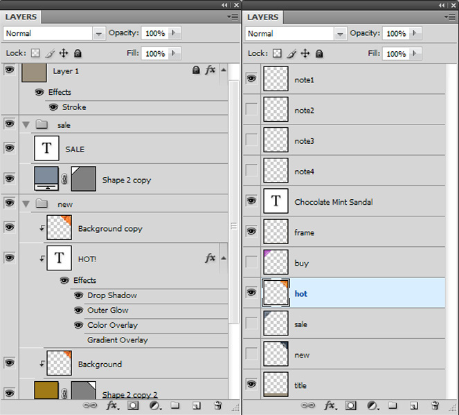

# 基本範本簡介 {#basic-templates}

在Dynamic Media Classic術語中，範本是可在範本發佈後透過URL動態變更的檔案。 Dynamic Media Classic提供基本範本，這是從影像伺服器呼叫的影像型範本，由影像和演算後的文字組成。

範本最強大的一個方面是它們有直接的整合點，可讓您將其連結到資料庫。 因此，您不僅可以提供影像並調整其大小，還可以查詢資料庫以尋找新的或銷售專案，並讓它在影像上顯示為覆蓋圖。 您可以要求專案說明，並以您選擇之字型及版面配置中的標籤顯示。 可能性是無限的。

基本範本可以透過許多不同的方式實作，從簡單到複雜。 例如：

- 基本銷售。 如果產品有免運費，則使用「免運費」等標籤。 這些標籤由Photoshop中的商品團隊設定，而網頁會使用邏輯來知道何時將它們套用至影像。
- 進階銷售。 每個範本都有多個變數，並可同時顯示多個選項。 使用資料庫、詳細目錄和業務規則來判斷何時將產品顯示為「剛好加入」、「清除」或「已售出」。 也可以使用產品後面的透明度，以在不同背景顯示，例如在不同房間中。 相同的範本和/或資產可在產品詳細資料頁面上重新利用，以在不同背景上顯示相同產品的較大或可縮放版本。

請務必瞭解，Dynamic Media Classic只提供這些範本式應用程式的視覺部分。 Dynamic Media Classic公司或其整合合作夥伴必須提供建立應用程式的商業規則、資料庫和開發技能。 沒有「內建」範本應用程式；設計人員在Dynamic Media Classic中設定範本，而開發人員使用URL呼叫來變更範本中的變數。

在本教學課程的這個章節結束時，您將知道如何：

- 將PhotoshopPSD上傳至Dynamic Media Classic，以用作範本的基礎。
- 建立包含影像圖層的簡單銷售「基本範本」。
- 新增文字圖層，並使用引數使其成為可變圖層。
- 建構範本URL並透過網頁瀏覽器動態操作影像。

>[!NOTE]
>
>本章中的所有URL僅供說明用途；並非即時連結。

## 基本範本概觀

「基本範本」（或簡稱「範本」）的定義是URL可定址的分層影像。 最終結果是影像，但可由URL變更。 它可包含像片、文字或圖形，亦即Dynamic Media Classic中任何PTIFF資產的組合。

範本與PhotoshopPSD檔案最相似，因為兩者有類似的工作流程與功能。

- 兩者都是由類似棧疊醋酸紙的圖層所組成。 您可以複合部分透明影像，並透過圖層的透明區域看見下面的圖層。
- 可以移動和旋轉圖層來重新定位內容，而且可以改變不透明度和混合模式，使內容部分透明。
- 您可以建立文字圖層。 影像伺服器使用的文字引擎與Photoshop和Illustrator相同，因此品質可能非常高。
- 簡單圖層樣式可套用至每個圖層，以建立特殊效果，例如投影或光暈。

不過，與PhotoshopPSD不同，圖層可以完全動態化，並透過影像伺服器上的URL控制。

- 您可以將變數新增至所有範本屬性，以便快速變更其構成。
- 稱為引數的變數可讓您僅公開您要變更的範本部分。

您只需要為每個會變化的圖層新增預留位置，而不必像在Photoshop中一樣將所有圖層放在單一檔案中，並加以顯示和隱藏（不過您也可以視需要這樣做）。

使用預留位置，您可以動態地將圖層的內容與其他已發佈的資產交換，並且會自動取得被取代圖層的相同屬性（例如大小和旋轉）。

由於基本範本通常在Photoshop中設計，但透過URL部署，因此範本專案需要混合設計和技術技能。 我們通常假設負責創意範本的人是Photoshop設計人員，而實作範本的人是網頁開發人員。 創意和開發團隊必須密切合作，才能讓範本成功。

根據應用程式的商業規則和需求，範本專案可能會相對簡單或極為複雜。 基本範本是從影像伺服器呼叫，但由於Dynamic Media Classic環境的彈性，您甚至可以在其他範本中巢狀內嵌範本，讓您建立相當複雜的影像，這些影像可以透過常命名的變數連結。

- 進一步瞭解 [範本基本需知](https://experienceleague.adobe.com/docs/dynamic-media-classic/using/template-basics/quick-start-template-basics.html).
- 瞭解如何建立 [基本範本](https://experienceleague.adobe.com/docs/dynamic-media-classic/using/template-basics/creating-template.html#creating_a_template).

## 建立基本範本

使用基本範本時，您通常會遵循下圖中的工作流程步驟。 如果您使用動態文字圖層，則以虛線標示的步驟為選用，並在下列指示中標示為「文字工作流程」。 如果不使用文字，請只遵循主路徑。

_基本範本工作流程。_

1. 設計和建立您的資產。 大部分的使用者都會在Adobe Photoshop中執行此動作。 以您所需的確切大小設計資產 — 如果縮圖頁面為200畫素的影像，請以200畫素來設計。 如果您需要放大顯示，請將其設計成約2000畫素的大小。 使用Photoshop (和/或Illustrator儲存為點陣圖)建立資產，並使用Dynamic Media Classic將零件組裝在一起、管理圖層並新增變數。
2. 設計圖形資產後，請將其上傳至Dynamic Media Classic。 建議您上傳整個分層PSD檔案，並讓Dynamic Media Classic使用PSD為每個層建立檔案，而非從資產上傳個別資產。 **保留圖層** 選項進行上傳（如需更多詳細資料，請參閱下文）。 _文字工作流程：如果建立動態文字，請一併上傳您的字型。 動態文字是可變的，並透過URL控制。 如果您的文字是靜態的或只有幾個短語沒有變更（例如，標籤上寫著「New」或「Sale」，而不是「X% Off」，其中X是變數），我們建議在Photoshop中預先轉譯文字，並上傳為點陣化圖層以做為影像。 這樣會更簡單，而且您可以依照您想要的樣式來設定文字。_
3. 使用「建置」功能表的「範本基本知識」編輯器在Dynamic Media Classic中建置範本，並新增影像圖層。 文字工作流程：在相同編輯器中建立文字圖層。 在Dynamic Media Classic中手動建立範本時，需要此步驟。 選擇符合您設計的畫布大小、將影像拖放至畫布上，以及設定圖層屬性（大小、旋轉、不透明度等）。 您不是要將所有可能的圖層都放在範本上，而是只為每個影像圖層放一個預留位置。 _文字工作流程：您可以使用「文字」工具建立文字圖層，類似於在Photoshop中建立文字圖層。 您可以使用Photoshop文字工具提供的相同選項來選擇字型和樣式。_ 另一個工作流程是上傳PSD並讓Dynamic Media Classic產生「自由」範本，甚至可以重新建立文字圖層。 稍後會對此進行更詳細的討論。
4. 建立圖層後，請將引數（變數）新增至您要透過URL控制的任何圖層的任何屬性，包括圖層的來源（影像本身）。 _文字工作流程：您也可以新增引數至文字圖層，以控制文字內容、圖層本身的大小和位置，以及所有格式選項，例如字型顏色、字型大小、水準字距等。_
5. 建立符合範本大小的影像預設集。 我們建議這麼做，讓範本的呼叫總是以1:1大小來進行，並且還要對任何調整大小以符合範本大小的大型影像圖層新增銳利化。 如果您要建置要縮放的範本，則不需要執行此步驟。
6. 發佈、從Dynamic Media Classic預覽複製URL，然後在瀏覽器中測試。

## 準備範本資產並將其上傳至Dynamic Media Classic

將範本資產上傳至Dynamic Media Classic之前，您需要完成一些準備步驟。

### 準備上傳的PSD

將Photoshop檔案上傳至Dynamic Media Classic之前，請先簡化Photoshop中的圖層，使其更易於使用並與影像伺服器具有最佳相容性。 您的PSD檔案通常包含許多Dynamic Media Classic無法辨識的元素，而且您最終可能會有許多難以管理的小片段。 請務必儲存主PSD的備份，以備稍後需要編輯原始檔案時使用。 您將上傳簡化的復本，而不是主版。

1. 將需要一起開啟/關閉的相關圖層合併/平面化為單一圖層，以簡化圖層結構。 例如，標籤「NEW」和藍色橫幅會合併為單一圖層，您只需按一下即可顯示或隱藏它們。
   
2. Dynamic Media Classic或「影像伺服器」不支援某些圖層型別和圖層效果，因此需要在上傳前點陣化。 否則，效果可能會被忽略，或者圖層會被丟棄。 點陣化圖層表示將可編輯轉換為不可編輯。 若要點陣化圖層效果或文字圖層，請建立空白圖層，然後選取兩者，並使用下列方式合併 **「圖層」>「合併圖層」** 或CTRL + E/CMD + E。

   - Dynamic Media Classic無法群組或連結圖層。 群組或連結集中的所有圖層都會轉換為不再群組/連結的個別圖層。
   - 上傳時，圖層遮色片會轉換為透明度。
   - 不支援調整圖層，因此會捨棄調整圖層。
   - 填色圖層（例如「純色」圖層）會點陣化。
   - 「智慧型物件」圖層和「向量」圖層會在上傳時點陣化成一般影像，並套用及點陣化「智慧型濾鏡」。
   - 除非您使用「擷取文字」選項，否則文字圖層也會點陣化 — 請參閱下方以取得更多資訊。
   - 會忽略大部分的圖層效果，僅支援少數混合模式。 如有疑問，請在Dynamic Media Classic中新增簡單效果（例如內部或下拉陰影、內部或外部光暈），或使用空白圖層在Photoshop中合併及點陣化效果。

### 使用字型

如果您需要產生動態文字，您也可以上傳並發佈字型。 Dynamic Media Classic唯一包含的字型是Arial。

每家公司都有責任取得使用網路字型的授權 — 只要在電腦上安裝字型，您就無權在網路上進行商業使用，而未經許可使用字型發佈商可能會對貴公司採取法律行動。 此外，授權條款也有所不同 — 例如，您可能需要單獨的列印與熒幕顯示授權。

Dynamic Media Classic支援標準OpenType(OTF)、TrueType (TTF)和Type 1 Postscript字型。 僅適用於Mac的手提箱字型、文字集合檔案、Windows系統字型和專屬機器字型（如雕刻或刺繡機器使用的字型）全都不受支援，您必須將其轉換為標準字型格式之一，或取代類似字型以用於Dynamic Media Classic和影像伺服器。

字型上傳到Dynamic Media Classic後，就像任何其他資產一樣，也必須發佈到影像伺服器。 一個非常常見的範本錯誤是忘記發佈您的字型，這會導致影像錯誤 — 影像伺服器不會取代其他字型來取代它的位置。 此外，如果您想使用 **擷取文字** 選項上傳時，您必須先上傳字型檔案，才能上傳使用這些字型的PSD。 此 **擷取文字** 功能會嘗試將文字重新建立為可編輯的文字圖層，並將其置於Dynamic Media Classic範本中。 這會在下一個主題PSD選項中討論。

請注意，字型有多個內部名稱，這些名稱通常與它們的外部檔案名稱不同。 您可以在Dynamic Media Classic中該資產的「詳細資訊」頁面上檢視其所有不同名稱。 以下是Adobe Caslon Pro Semibold字型的名稱，列在Dynamic Media Classic的「中繼資料」標籤下方：

_在Dynamic Media Classic中，字型的「詳細資訊」頁面上的「中繼資料」索引標籤。_

Dynamic Media Classic會使用此字型的檔案名稱(ACaslonPro-Semibold)作為資產ID，但此名稱並非範本所使用的名稱。 範本使用RTF格式(RTF)名稱，列在底部。 RTF是影像伺服器文字引擎的原生「語言」。

如果您需要透過URL變更字型，則必須呼叫字型的RTF名稱（不是資產ID），否則會出現錯誤。 在這種情況下，此字型的正確名稱將是「Adobe Caslon Pro」。 我們將在以下的RTF和Text引數主題中討論有關字型和RTF的更多資訊。

在Windows和Mac系統上最常見的字型檔案格式為OpenType和TrueType。 OpenType的副檔名為.OTF，而TrueType則為.TTF。 兩種格式在Dynamic Media Classic中的運作方式相同。

### 上傳PSD時選取選項

您不需要上傳Photoshop檔案(PSD)即可建立範本；範本可以根據Dynamic Media Classic中的任何影像資產建立。 不過，上傳PSD可讓撰寫更輕鬆，因為通常這些資產會位於分層PSD中。 此外，當您上傳分層PSD時，Dynamic Media Classic會自動產生範本。

- **保留圖層。** 這是最重要的選項。 這會告訴Dynamic Media Classic每個Photoshop圖層建立一個影像資產。 如果未勾選，則會停用所有其他選項，且PSD會平面化為單一影像。
- **建立** **範本。** 此選項會取用各種產生的圖層，並透過將它們組合在一起來自動建立範本。 使用自動產生範本的缺點在於Dynamic Media Classic會將所有圖層放在一個檔案中，而每個圖層只需要一個預留位置。 刪除多餘的圖層相當容易，但如果您有許多圖層，則重新建立它們會更快一些。 請務必重新命名新範本；如果不重新命名，下次您重新上傳同一PSD時將會覆寫新範本。
- **擷取文字。** 這會使用您上傳的字型，將PSD中的文字圖層重新建立為範本中的文字圖層。 如果您的文字位於Photoshop中的路徑，而您想要在範本中維護該路徑，則需要執行此步驟。 此功能需要您使用 **建立範本** 選項，因為擷取的文字只能由上傳時產生的範本建立。
- **將圖層延伸至背景大小。** 此設定使每個圖層的大小與整體PSD畫布相同。 這對於永遠保持固定位置的圖層非常有用：否則將影像調換到相同圖層時，您可能必須重新定位它們。
- **圖層命名。** 這會告訴Dynamic Media Classic如何為每個圖層產生的每個資產命名。 我們建議採取以下其中一種方式 **Photoshop** **和圖層** **名稱** 或Photoshop和 **圖層** **數字**. 這兩個選項都使用PSD名稱作為名稱的第一部分，並在結尾處新增圖層名稱或編號。 例如，如果您有名為「shirt.psd」的PSD，且有名為「front」、「sleeves」和「collar」的圖層(如果您使用 **Photoshop和** 圖層 **名稱** 選項，Dynamic Media Classic會產生「shirt_front」、「shirt_sleeves」和「shirt_collar」資產ID。 使用其中一個選項有助於確保名稱在Dynamic Media Classic中是唯一的。

## 建立包含影像圖層的範本

即使Dynamic Media Classic可以自動從分層PSD建立範本，您也應該知道如何手動建立範本。 如上所述，在某些情況下您會不想使用Dynamic Media Classic建立的範本。

### 範本基本需知UI

讓我們先熟悉編輯介面。

左中是顯示最終範本預覽的工作區域。 右側是「圖層」和「圖層屬性」面板。 這些區域是您工作最多的區域。

_建置範本基本資訊頁面。_

- **預覽/工作區。** 這是主視窗。 您可以在此使用滑鼠移動、調整圖層大小及旋轉圖層。 圖層輪廓會顯示為虛線。
- **圖層。** 這類似於Photoshop圖層面板。 當您將圖層新增至範本時，它們將會顯示在這裡。 圖層會由上而下棧疊 — 清單中會顯示「圖層」面板中的上層圖層在其下方的其他圖層上方。
- **圖層屬性。** 您可以在此處使用數值控制項來調整圖層的所有屬性。 首先，選取圖層，然後調整其屬性。
- **複合** **URL。** UI底部是複合URL區域。 這部分教學課程不會討論此問題，但在這裡，您會看到範本解構為一系列影像伺服URL修飾元。 此區域可編輯 — 如果您非常熟悉「影像伺服器」命令，可以在此處手動編輯範本。 不過，您也可以將其中斷。 和Photoshop一樣，圖層編號也是從0開始。 「畫布」是第0層，而您自己加入的第一個圖層是第1層。 混合模式會決定圖層的畫素與其下方的畫素混合的方式。 您可以使用混合模式來建立各種特殊效果。

#### 使用範本基本知識編輯器

以下是啟動基本範本的工作流程步驟：

1. 在Dynamic Media Classic中，前往 **建置>範本基本知識**. 您可以不選取任何內容，或是先選取影像，該影像會成為範本的第一個圖層。
2. 選擇大小並按 **確定**. 此大小應符合您在Photoshop中設計的大小。 將載入範本編輯器。
3. 如果您在步驟1中未選取影像，請搜尋或瀏覽至左側資產面板中的影像，並將其拖曳至工作區域。

   - 影像會自動調整大小以符合畫布的大小。 如果您打算置換高解析度的影像，通常會帶入一個大型（2000畫素） PTIFF影像，並做為預留位置使用。
   - 這應該是範本的最底層，不過您可以稍後重新排序圖層。

4. 直接在工作區域中調整圖層大小或重新定點陣圖層，或是調整「圖層屬性」面板中的設定。
5. 視需要拖曳其他影像圖層。 您也可以新增圖層效果。 請參閱主題 _增加圖層效果_，在底下。
6. 按一下 **儲存**，選擇位置，並為範本命名。 您可以預覽，不過此時您的範本看起來完全像平面化的Photoshop影像 — 尚未可變更。

### 增加圖層效果

「影像伺服器」支援一些程式化的圖層效果 — 可變更圖層內容外觀的特殊效果。 它們的作用與Photoshop中的圖層效果類似。 它們會附加至圖層，但不受該圖層控制。 您可以調整或移除它們，而不需永久變更圖層本身。

- **陰影**. 在圖層邊界外套用陰影，以x和y畫素位移定位。
- **內陰影**. 在圖層邊界內套用陰影，位置為x和y畫素位移。
- **外光暈**. 在圖層的所有邊緣周圍均勻套用光暈效果。
- **內光暈**. 在圖層的所有邊緣內均勻套用光暈效果。

_有或沒有投影的圖層_

若要新增效果，請按一下 **新增效果**，然後從選單中選擇效果。 如同一般圖層，您可以在「圖層」面板中選取效果，並使用「圖層屬性」面板調整其設定。

陰影效果是水平或垂直位移到圖層之外，而「光暈」效果則是均勻地套用到所有方向。 內部效果會作用在圖層的不透明部分上方，而「外部效果」只會影響透明區域。

進一步瞭解[增加圖層效果](https://experienceleague.adobe.com/docs/dynamic-media-classic/using/template-basics/creating-template.html#using-shadow-and-glow-effects-on-layers).

### 新增引數

如果您所做的只是組合圖層並儲存它們，則淨結果與平面化的Photoshop影像沒有區別。 讓範本與眾不同之處在於它能夠將引數新增至每個圖層的屬性，因此這些引數可以透過URL動態變更。

在Dynamic Media Classic術語中，引數是可連結至範本屬性的變數，因此可透過URL操作。 當您將引數新增至圖層時，Dynamic Media Classic會以美元符號($)作為引數名稱的前置詞，以此在URL中公開該屬性 — 例如，如果您建立名為「size」的引數來變更圖層的大小，Dynamic Media Classic會將您的引數重新命名為$size。

如果您未為屬性新增引數，則該屬性在Dynamic Media Classic資料庫中保持隱藏，並且不會顯示在URL中。

若沒有引數，URL通常會更長，尤其是如果您也使用動態文字時。 文字會在每個URL上新增數十個額外字元。

最後，您的初始引數集會成為範本中屬性的預設值。 如果您建立範本、新增引數，然後呼叫URL而不呼叫其引數，影像伺服器會使用您儲存在範本中的所有預設值來建立影像。 只有在您想要變更屬性時，才需要引數。 如果屬性不需要變更，您就不需要設定引數。

#### 建立引數

這是建立引數的工作流程：

1. 按一下 **引數** 按鈕，位於您要為其建立引數的圖層名稱旁。 「引數」畫面隨即開啟。 它會列出圖層上的每個屬性及其值。
1. 選取 **開啟** 選項，位於您要設為引數的每個屬性名稱旁。 將會顯示預設引數名稱。 您只能將引數新增至已變更其預設狀態的屬性。

   - 例如，如果您新增圖層並將它保留在其預設xy位置0,0，Dynamic Media Classic將不會公開 **位置** 屬性。 若要修正，請將圖層移動至少一個畫素。 現在Dynamic Media Classic將公開 **位置** 作為屬性，您可以進行引數化。
   - 若要將引數新增至show/hide屬性（開啟和關閉圖層），請按一下 **顯示** 或 **隱藏圖層** 圖示來關閉圖層（您之後可以視需要將其開啟）。 Dynamic Media Classic現在會公開 **隱藏** 可引數化的屬性。

1. 將預設引數名稱重新命名為更易在URL中識別的名稱。 例如，如果您想要新增引數來變更影像頂端的橫幅圖層，請將預設名稱「layer_2_src」變更為「banner」。
1. 按下 **關閉** 以結束「引數」畫面。
1. 按一下「 」，對其他圖層重複此程式 **引數** 按鈕以及新增和重新命名引數。
1. 完成時儲存您的變更。

>[!TIP]
>
>將引數重新命名為有意義的名稱，並開發命名慣例來標準化這些名稱。 請確定設計和開發團隊事先已同意命名慣例。
>
>無法新增引數，因為您沒有看到屬性？ 只需變更圖層的屬性，使其脫離預設即可（透過移動、調整大小、隱藏等等）。 您現在應該會看到該屬性已公開。

進一步瞭解 [範本引數](https://experienceleague.adobe.com/docs/dynamic-media-classic/using/template-basics/creating-template-parameters.html).

## 建立具有文字圖層的範本

現在您將瞭解如何建立包含文字圖層的基本範本。

### 瞭解動態文字

您現在知道如何使用影像圖層建立基本範本。 對於許多應用程式來說，這都是您所需要的。 如同在上一個練習中所見，具有簡單文字（例如「Sale」和「New」）的圖層可以點陣化並視為影像，因為其文字不需要變更。

不過，如果您需要：

- 新增標籤以顯示「25%折扣」，其中25%的值為變數
- 新增文字標籤，在影像上方加上產品名稱
- 根據檢視範本的國家/地區，將圖層本地化為不同的語言

在這種情況下，您需要使用引數來新增一些動態文字圖層，以控制文字和/或格式設定。

若要建立文字，您必須上傳一些字型，否則會將Dynamic Media Classic預設為Arial。 字型也必須發佈到影像伺服器，否則嘗試轉譯使用該字型的任何文字時，就會產生錯誤。

### RTF和文字引數

若要使用「範本基本知識」工具新增變數至文字，您應瞭解文字的轉譯方式。 「影像伺服器」會使用Adobe文字引擎產生文字(與Photoshop和Illustrator使用的引擎相同)，並將其複合為最終影像中的圖層。 為了與引擎通訊，「影像伺服器」會使用RTF格式。

RTF是由Microsoft開發的檔案格式規格，用於指定檔案格式。 這是大多數文書處理和電子郵件軟體所使用的標準標籤語言。 如果您寫入URL &amp;text=\b1 Hello，則影像伺服器會以粗體字產生含有「Hello」字樣的影像，因為\b1是將文字變為粗體的RTF命令。

好消息是Dynamic Media Classic會為您產生RTF。 每當您在範本中鍵入文字並新增格式時，Dynamic Media Classic都會悄悄地將RTF程式碼自動寫入範本。 我們之所以提到這個原因，是因為您直接將引數新增至RTF本身，所以請務必先熟悉一下。

#### 建立文字圖層

您可以在Dynamic Media Classic中，透過下列兩種方式在範本中建立文字圖層：

1. Dynamic Media Classic中的文字工具。 我們將在下方討論此方法。 「範本基本知識」編輯器有一個工具，可讓您建立文字方塊、輸入文字和設定文字的格式。 Dynamic Media Classic會視需要產生RTF，並將其放置在個別的圖層中。
2. 擷取文字（上傳時）。 另一種是在Photoshop中建立文字圖層，並將它儲存在PSD中作為一般文字圖層（而不是點陣化成影像圖層）。 然後，將檔案上傳至Dynamic Media Classic並使用 **擷取文字** 選項。 Dynamic Media Classic將使用RTF命令將每個Photoshop文字圖層轉換為「影像伺服」文字圖層。 如果您使用此方法，請務必先將字型上傳至Dynamic Media Classic，否則Dynamic Media Classic會在上傳時取代預設字型，而且沒有簡單的方法可重新取代正確的字型。

### 文字編輯器

您可以使用「文字編輯器」輸入文字。 文字編輯器是WYSIWYG介面，可讓您使用類似於Photoshop或Illustrator中的格式控制項，輸入文字並設定其格式。

_範本基本內容文字編輯器。_

您大部分的工作都在 **預覽** 索引標籤，可讓您輸入文字，並看到文字在範本中顯示的樣子。 此外， **來源** 標籤，如有必要，可用來手動編輯RTF。

一般工作流程是使用 **預覽** 按Tab鍵以輸入一些文字。

然後您選取文字，並使用上方的控制項選擇某些格式設定，例如字型顏色、字型大小或齊行。 文字依照您想要的方式設定樣式後，請按一下 **套用** 以在工作區預覽中檢視其更新。 然後關閉「文字編輯器」以返回「範本基本知識」主視窗。

#### 使用文字編輯器

以下是在「範本基本概念建置」頁面中新增文字的工作流程步驟：

1. 按一下 **文字** 工具按鈕。
2. 將您要顯示文字的文字方塊拖曳出來。 文字編輯器視窗將在強制回應視窗中開啟。 在背景中，您會看到範本，但在您完成編輯文字之前無法編輯。
3. 輸入您要在第一次載入範本時顯示的範例文字。 例如，如果您要建立個人化電子郵件影像的文字方塊，文字可能會顯示「您好！ 現在是儲存的時候了！」 您稍後會新增文字引數，以您在URL上傳送的值取代Name。 除非您按一下「 」，否則您的文字將不會顯示在視窗下方的範本中 **套用**.
4. 若要設定文字格式，請使用滑鼠拖曳來選取文字，然後在UI中選擇格式控制項。

   - 有許多格式選項。 最常見的是字型（字型）、字型大小和字型顏色，以及左對齊/居中/右對齊。
   - 別忘了先選取文字。 否則，您將無法套用任何格式。
   - 若要選擇其他字型，請確定您選取文字並開啟「字型」選單。 編輯器將顯示上傳到Dynamic Media Classic的所有字型清單。 如果您的電腦上也安裝了字型，則會以黑色顯示。 如果您的電腦未安裝，則會以紅色顯示。 不過，當您按一下「 」，它仍會在預覽視窗中呈現 **套用**. 您只需要將字型上傳到Dynamic Media Classic，任何使用Dynamic Media Classic的人都可以使用。 發佈之後，影像伺服器會使用這些字型來產生文字 — 您的使用者不需要安裝任何字型即可看到您建立的文字，因為它是影像的一部分。
   - 與Photoshop和Illustrator不同，「影像伺服器」可以在文字方塊中垂直對齊文字。 預設值為靠上對齊。 若要變更，請選取您的文字，然後選擇 **中間** 或 **下** 從 **垂直對齊** 功能表。
   - 如果您讓文字對方塊而言太大（或文字方塊太小），則所有或部分文字都會被裁剪而消失。 縮小字型大小或讓方塊變大。

5. 按一下 **套用** 以讓變更在工作區域視窗中生效。 您必須按一下 **套用**，否則會遺失您的編輯。
6. 完成後，按一下 **關閉**. 如果要返回編輯模式，請連按兩下文字圖層以重新開啟文字編輯器。

如果字型安裝在本機系統上，文字編輯器就會預覽字型的大小。

### 關於新增引數至文字圖層

現在，我們會依照類似程式新增文字引數，就像新增圖層引數一樣。 文字圖層也可以採用大小、位置等圖層引數；但是，它們也可以採用其他引數，讓您控制RTF的任何方面。

與圖層引數不同，您只需選取想要變更的值，然後新增引數至該值，而不是將引數新增至整個屬性。

範例RTF：

在檢查RTF時，您必須找出每個設定要變更的位置。 在上方的RTF中，有些可能會有意義，而且您可以看到格式來自何處。

你可以看到Chocolate Mint Sandal這個詞 — 也就是文字本身。

- 這裡有字型參考Por Richard — 這是選取字型的地方。
- 您可以看到RGB值：\red56\green53\blue4 — 這是文字顏色。
- 雖然字型大小為20，但您不會看到數字20。 不過，您確實會看到一個指令\fs40 — 由於某些奇怪的原因，RTF會以半點來測量字型。 因此\fs40就是字型大小！

您有足夠的資訊來建立引數，不過「影像伺服」檔案中有所有RTF命令的完整參考。 造訪 [影像伺服檔案](https://experienceleague.adobe.com/docs/dynamic-media-developer-resources/image-serving-api/image-serving-api/http-protocol-reference/text-formatting/c-text-formatting.html#concept-0d3136db7f6f49668274541cd4b6364c).

#### 新增引數至文字圖層

以下是新增引數至文字圖層的步驟。

1. 按一下 **引數** 按鈕(「P」)，位於您要建立引數的文字圖層名稱旁。 「引數」畫面隨即開啟。 此 **通用** tab會列出圖層上的每個屬性及其值。 您可以在此處新增一般圖層引數。
1. 按一下 **文字** 標籤。 您可以在這裡看到RTF在頂端；您新增的引數在底下。
1. 若要新增引數，請先反白您要變更的值，然後按一下 **新增引數** 按鈕。 請確定您只選取指令的值，而不是選取整個指令本身。 例如，若要為上述範例RTF中的字型名稱設定引數，我只會反白顯示「Poor Richard」並在其中新增引數，但不包括「\f0」。 當您按一下 **新增引數** ，它會顯示於下列清單中，而引數值仍會選取時，會在RTF中以紅色顯示。 如果您需要移除引數，請按一下旁邊的核取方塊 **開啟** 關閉該引數，該引數就會消失。
1. 按一下「 」，將引數重新命名為更有意義的名稱。
1. 完成後，您的RTF會以綠色反白顯示，其中引數存在，而且您的引數名稱和值會列示於下方。
1. 按一下 **關閉** 以結束「引數」畫面。 然後按 **儲存** ，以儲存範本。 如果您已完成編輯，請按下 **關閉** 以結束「範本基本知識」頁面。
1. 按一下 **預覽** 以在Dynamic Media Classic中測試範本。 若要測試文字引數，請在預覽視窗中輸入新文字或新值。 若要變更字型，您必須鍵入該字型的確切RTF名稱。

>[!TIP]
>
>若要新增引數至文字顏色，請分別新增紅色、綠色和藍色的引數。 例如，如果RTF為 `\red56\green53\blue46`，您可以為值56、53和46新增個別的紅色、綠色和藍色引數。 在URL中，您可以呼叫全部三個來變更顏色： `&$red=56&$green=53&$blue=46`.

瞭解如何 [建立動態文字引數](https://experienceleague.adobe.com/docs/dynamic-media-classic/using/template-basics/creating-template-parameters.html#creating-dynamic-text-parameters).

## 發佈和建立範本URL

### 建立影像預設集

不需要為範本建立預設集。 我們建議將此作為最佳實務，所以一律以1:1的大小呼叫範本，並且還要對任何調整大小以符合範本的大型影像圖層新增銳利化。 如果您呼叫沒有預設集的影像，「影像伺服器」可能會任意地將影像大小調整為預設大小（大約400畫素），並且不會套用預設銳利化。

範本的影像預設集並沒有什麼特別之處。 如果您已有相同大小的靜態影像的預設集，您可以改用。

### 發佈

您必須執行發佈，才能檢視將變更即時推送至影像伺服器的情形。 請牢記需要發佈的內容：各種影像資產圖層、動態文字的字型，以及範本本身。 與其他Dynamic Media Classic多媒體資產（如影像集和迴轉集）類似，基本範本是一種人造結構 — 它是資料庫中的行專案，使用一系列「影像伺服」命令來參考影像和字型。 因此，當您發佈範本時，您只會更新影像伺服器上的資料。

進一步瞭解 [發佈您的範本](https://experienceleague.adobe.com/docs/dynamic-media-classic/using/template-basics/publishing-templates.html).

### 範本URL結構

基本範本具有與先前說明的一般影像呼叫相同的基本URL語法。 範本通常會有更多修飾元（以&amp;符號分隔的命令），例如含有值的引數。 不過，主要差異在於您呼叫範本作為主要影像，而不是呼叫靜態影像。

影像預設集在預設集名稱的兩邊各有一個貨幣符號($)，而引數在開頭只有一個貨幣符號。 放置這些美元符號非常重要。

**正確：**

`$text=46-inch LCD HDTV`

**不正確：**

`$text$=46-inch LCD HDTV`

`$text=46-inch LCD HDTV$`

`text=46-inch LCD HDTV`

如前所述，引數用於變更範本。 如果您呼叫沒有引數的範本，它會恢復為預設設定，如範本基本撰寫工具中所設計。 如果屬性不需要變更，您就不需要設定引數。

_未設定引數的範本（上圖）和帶有引數的範本（下圖）範例。_
