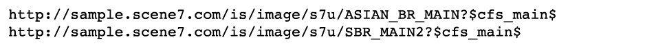
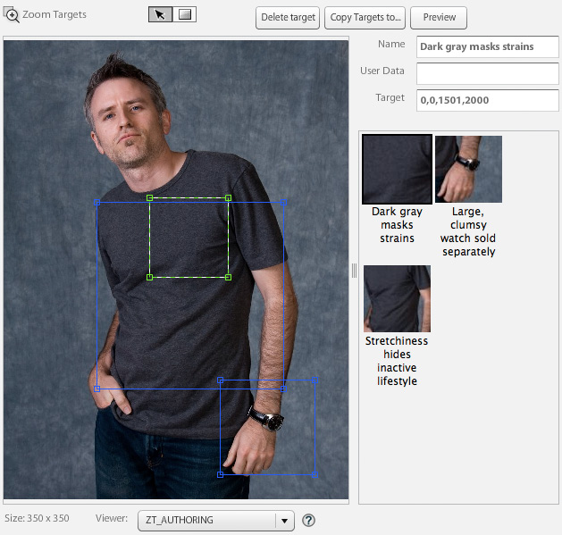
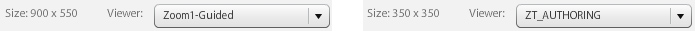

# 裁切、調整後的影像和縮放目標 {#crop-adjusted-zoom-targets}

Dynamic Media Classic主影像概念的主要優點之一，就是您可以重新利用影像資產進行多項用途。 傳統上，您必須為每個影像建立個別的裁切版本，以顯示詳細資訊或色票。 使用Dynamic Media Classic時，您可以在單一主版上執行相同的工作，並將這些裁切的版本儲存為新的實體檔案或儲存為無儲存空間的虛擬衍生工具。

在本教學課程的此區段結束時，您將知道如何：

- 在Dynamic Media Classic中裁切影像，並儲存為新的主檔案或虛擬影像。 [深入了解](https://experienceleague.adobe.com/docs/dynamic-media-classic/using/master-files/cropping-image.html)。
- 儲存虛擬調整後的影像，並使用它們來取代主要資產。 [深入了解](https://experienceleague.adobe.com/docs/dynamic-media-classic/using/master-files/adjusting-image.html)。
- 在影像上建立縮放目標以顯示其醒目提示。 [深入了解](https://experienceleague.adobe.com/docs/dynamic-media-classic/using/zoom/creating-zoom-targets-guided-zoom.html)。

## 裁切

Dynamic Media Classic有一些影像編輯工具，可在UI中方便使用，包括裁切工具。 您可能想要在Dynamic Media Classic中裁切主影像，原因有很多。 例如：

- 您沒有原始檔案的存取權。 您想要以不同的裁切或外觀比例來顯示影像，但您的電腦上沒有原始檔案，或者您正在家中工作。 在此情況下，您可以前往Dynamic Media Classic、尋找影像、裁切影像並儲存，或儲存為新版本。
- 移除多餘的空格。 影像的拍攝空間太大，導致產品看起來太小。 您想要縮圖影像儘可能填滿畫布。
- 若要建立「已調整影像」，請建立不需要磁碟空間的影像虛擬復本。 有些公司的商業規則會要求他們保留相同影像的個別復本，但使用不同的名稱。 或者，您可能想要相同影像的裁切與非裁切版本。
- 從來源影像製作新影像。 例如，您可能想要建立色票或主要影像的細節。 您可以在Adobe Photoshop中執行此動作並單獨上傳，或在Dynamic Media Classic中使用裁切工具。

>[!NOTE]
>
>以下有關「裁切」的討論中所有URL僅供說明用途；並非即時連結。

### 使用裁切工具

您可以從資產的詳細資訊頁面存取Dynamic Media Classic中的裁切工具，或按一下 **編輯** 按鈕。 您可以透過兩種方式使用此工具裁切：

- 您拖曳裁切視窗操作框或在「大小」方塊中輸入值的預設裁切模式。 瞭解如何 [手動裁切](https://experienceleague.adobe.com/docs/dynamic-media-classic/using/master-files/cropping-image.html#select-an-area-to-crop).
- 修剪. 使用此選項可計算不符合影像的畫素數，移除影像周圍多餘的空格。 瞭解如何 [透過裁剪裁切](https://experienceleague.adobe.com/docs/dynamic-media-classic/using/master-files/cropping-image.html#crop-to-remove-white-space-around-an-image).

### _手動裁切_

當您儲存手動裁切的版本時，影像似乎已永久裁切；Dynamic Media Classic實際上已新增內部URL修飾元來裁切影像，以隱藏畫素。 發佈時，系統會向所有人顯示影像已裁切，但您稍後可返回「裁切編輯器」並移除裁切。

然後，您可以選擇儲存為新的主影像或主影像的「額外檢視」。 新的主版是佔用儲存空間的新實體檔案(如TIFF或JPEG)。 另一個檢視是不佔用伺服器空間的虛擬影像。 我們不建議您選擇「取代原始」，因為這樣會覆寫您的主版，並使裁切成為永久性的。 如果您儲存為新的主版或額外的檢視，則必須選擇新的資產ID。 如同其他資產ID，這必須是Dynamic Media Classic中的唯一名稱。

### _修剪裁切_

如果您上傳的影像在影像主要主旨周圍有太多空格（額外的畫布），調整大小後在網頁上的外觀會小很多。 150畫素或更小的縮圖影像尤其如此 — 像片的主旨可能會遺失在周圍的所有額外空間中。

比較相同影像的這兩個版本。

移除產品周圍多餘的空間，讓右側的影像更加顯眼。 裁剪可使用裁切工具一次完成一個影像，或在上傳時以批次程式方式執行。 如果您希望將所有影像一致裁切到主要主題的邊界，我們建議您以批次程式執行。 修剪裁切至邊界方框 — 影像周圍的矩形。

>[!NOTE]
>
>修剪不會在影像周圍建立透明度。 為此，您需要在影像上內嵌剪裁路徑，並使用 **從剪裁路徑建立遮色片** 上傳選項。
>
>此外，當您使用時，若要在裁切影像後將其還原為原始狀態 **儲存** 選項，在裁切編輯器畫面中顯示影像，並選取 **重設** 按鈕。

### _上傳時裁切_

如先前所述，您也可以選擇在上傳影像時裁切影像。 若要在上傳時使用修剪裁切，請按一下 **工作選項** 按鈕，然後在「裁切選項」底下，選擇 **Trim**.

Dynamic Media Classic會在下次上傳時記住此選項。 雖然您可能想要裁切此上傳的影像，但您不希望在每次上傳時都裁切這些影像。 另一個選項是設定特殊的已排程FTP上傳工作，並將裁切選項置於該處。 如此一來，您只能在需要裁切影像時執行工作。

>[!IMPORTANT]
>
>如果您設定上傳的裁切，Dynamic Media Classic會在下次記憶該設定時放入Cookie。 依據最佳做法的要求，請按一下 **重設為公司預設值** 按鈕來清除上次上傳後留下的任何裁切選項；否則，您可能會意外裁切下一批影像。

### 依URL裁切

雖然在Dynamic Media Classic中並不明顯，但您也可以純粹透過URL裁切（或甚至新增裁切至影像預設集）。

每當您使用裁切工具時，都會在底部的欄位中看到URL值。 您可以取用這些值，並將其直接套用至影像做為URL修飾元。

_裁切編輯器底部的裁切命令修飾元_

由於大小必須依每個影像進行計算，當您使用修剪來裁切時，無法透過URL自動進行。 修剪裁切作業只能在上傳時執行，或是一次套用一個影像。

### _在影像預設集中裁切_

影像預設集有一個欄位，您可以在其中新增額外的「影像伺服」命令。 若要新增與上述相同的裁切至您的影像預設集，請編輯您的預設集並貼上，或在「URL修飾元」欄位中輸入值，然後儲存並發佈。

_將裁切命令（或任何命令）新增至影像預設集的URL修飾元。_

裁切現在將成為該影像預設集的一部分，並會在每次使用時自動套用。 當然，此方法取決於所有需要相同裁切量的影像。 如果您的影像並非全都是以相同方式拍攝，則此方法不適合您。

## 調整後的影像

使用裁切工具時，您有選項可 **另存為主影像的額外檢視**. 儲存後，這會建立新型Dynamic Media Classic資產，也就是調整後的影像。 調整後的影像（也稱為衍生）是虛擬影像。 它實際上根本不是影像；它是實體主影像的資料庫參考（如別名或捷徑）。

### 請站起來看真實的影像`?`

您可以分辨哪個是主影像，哪個是調整後的影像？

若未檢視Dynamic Media Classic並看到SBR_MAIN2的「調整後的影像」資產型別，您應該無法分辨此專案。

「已調整影像」不使用磁碟空間，因為它只作為行專案存在於資料庫中。 它也會永久連結至原始資產；如果刪除原始資產，也會刪除「調整後的影像」。 它可包含完整、未裁切的影像，或只包含影像的一部分（裁切）。

您通常會使用「裁切」工具建立「調整後的影像」；不過，也可以使用其他影像編輯器（「調整」和「銳利化」工具）來建立「調整後的影像」。

調整後的影像需要唯一的資產ID。 發佈時（您必須像任何其他資產一樣發佈），它們會像任何其他影像一樣運作，而且系統會根據其資產ID呼叫URL。 在「詳細資訊」頁面上，您可以檢視下與主影像關聯的調整影像。 **建置與衍生物** 標籤。

_已調整主影像的檢視表ASIAN_BR_MAIN_

## 縮放目標

縮放目標也可從以下位置找到： **編輯** 功能表和 **詳細資料** 影像的頁面。 它們可讓您設定「熱點」，以反白顯示縮放影像的特定銷售功能。 縮放檢視器不會裁切大型主影像來建立個別影像，而是可以提供影像頂端的詳細資訊，以及您建立的簡短標籤。

由於「縮放目標」基本上是銷售功能，且需要瞭解產品的賣點，因此通常是由公司銷售或產品團隊中的人員建立。

這個過程非常簡單 — 按一下特徵，給它一個描述性名稱，然後儲存。 如果目標相似，可以從一個影像複製到另一個影像，但程式是手動的。 Dynamic Media Classic無法自動建立縮放目標，因為每個影像都不同，且功能也不同。

決定是否使用「縮放目標」的另一個因素，是您選擇的檢視器。 並非所有檢視器型別都可以顯示縮放目標（例如，彈出檢視器不支援縮放目標）。

瞭解如何 [建立縮放目標](https://experienceleague.adobe.com/docs/dynamic-media-classic/using/zoom/creating-zoom-targets-guided-zoom.html#creating-and-editing-zoom-targets).

### 使用縮放目標工具

以下是在Dynamic Media Classic中建立目標的工作流程。

1. 瀏覽至影像，按一下 **編輯** 按鈕，然後選擇 **縮放目標**.
2. 將會載入「縮放目標編輯器」。 您會在中間看到影像、頂端看到一些按鈕，而右側則會顯示空白的目標面板。 在左下方，您會看到已選取的檢視器預設集。 預設值為「Zoom1-Guided」。
3. 使用滑鼠移動紅色方塊，然後按一下以建立新目標。

   - 紅色方塊是目標區域。 當使用者按一下該目標時，它會放大至方塊內的區域。
   - 目標大小是由檢視器預設集內的檢視大小所決定。 這會決定主要縮放影像的大小。 另請參閱 _設定檢視大小_，在底下。

4. 您會看到剛才建立的目標變成藍色，而在右側，您會看到該目標的縮圖版本，以及預設名稱「target-0」。
5. 若要重新命名目標，請按一下其縮圖，然後輸入新的 **名稱**，然後按一下 **輸入** 或 **標籤**  — 如果您按一下就離開，將不會儲存您的名稱。
6. 當選取目標時，方塊周圍會有綠色虛線，您可以調整大小並移動它。 拖曳邊角以調整大小，或拖曳目標方塊以移動它。

   - 這會將影像載入預設的自訂縮放檢視器中。 請確定檢視器預設集支援縮放目標 — 一般而言，所有含有「 — Guided」字樣的標準預設集都是針對縮放目標所設計。 若要使用目標，請將游標停留在目標縮圖（或熱點圖示）上以檢視標籤，然後按一下它以檢視檢視器放大該功能。
   - 如同您在Dynamic Media Classic中執行的所有其他工作一樣，您必須發佈以讓縮放目標在網頁上顯示。 如果您已使用支援目標的檢視器，它們將會立即顯示（在清除快取後）。 不過，如果您未使用已啟用「縮放目標」的檢視器，這些檢視器仍會保持隱藏狀態。

     

7. 此外，如果您需要移除目標，請按一下目標的縮圖以選取目標，然後按下 **刪除目標** 按鈕或按鍵盤上的DELETE鍵。
8. 繼續按一下以新增目標、重新命名和/或在新增後重新調整大小。
9. 完成後，按一下 **儲存** 按鈕，然後 **預覽**.

### 在縮放檢視器預設集中設定檢視大小

讓我們先來談談縮放目標的大小來源。 在縮放檢視器的檢視器預設集中有一個稱為檢視大小的設定。 檢視大小是檢視器內縮放影像的大小。 不同於舞台大小，舞台大小是檢視器的總大小，包括UI元件和圖稿。

當您建立新目標時，它會從檢視大小衍生其大小和外觀比例。 例如，如果檢視大小為200 x 200，則您只能使用最大縮放區域為200畫素的方形目標。 您的目標可以大於200畫素，但一律為正方形。 但這也表示縮放檢視器內的影像隻有200畫素 — 縮放目標的大小與檢視器的大小有直接關係。 因此，在設定目標之前，請先決定檢視器設計。

但是，依照預設，檢視大小是空白的（設定為0 x 0），因為主檢視影像的大小是動態的，而且會根據舞台的大小自動衍生。 問題是如果您未在預設集中明確設定檢視大小，「縮放目標」工具將無法知道要建立目標的大小。

載入「縮放目標」工具時，檢視大小會顯示在預設集名稱旁。 比較內建的Zoom1引導式預設集與自訂ZT_AUTHORING預設集之間的檢視大小。

您可以看到內建預設集的大小為900 x 550，這表示目標絕不會小於這個相當大的大小。 這可能太大了 — 如果您有2000畫素的影像，您只能呼叫至少900畫素橫跨的功能。 使用者可以手動進一步縮放，但您無法引導他們更靠近。 將檢視大小設定為350 x 350，可讓目標非常接近地放大或大幅調整大小。 但是，如果您想要在檢視器中放大影像，則需要建立新的預設集，因為您的影像鎖定在350畫素。

### 建立或編輯支援縮放目標的檢視器預設集

若要設定檢視大小，請建立或編輯支援「縮放目標」的檢視器預設集。

1. 在檢視器預設集中，前往 **縮放設定** 選項。
2. 設定寬度和高度。
3. 儲存預設集，然後關閉。 如果您想要在即時網站上使用該預設集，您稍後也必須發佈。
4. 進入「縮放目標」工具，然後在左下方選擇您編輯的預設集。 您會立即看到新的檢視大小反映在您的目標中。
