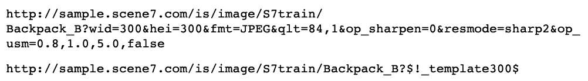

# 影像預設集 {#image-presets}

「影像預設集」實質上包含建立特定大小、格式、品質和銳利化影像所需的所有設定。 影像預設集是動態調整大小的關鍵元件。

如果您查看幾乎任何Dynamic Media Classic客戶的URL，可能會看到使用中的影像預設集。 只要在URL結尾處尋找$name$（任何字詞或字詞都取代為名稱）。

「影像預設集」會縮短URL，因此您不必針對每個請求寫出數個「影像伺服」指示，而是可以編寫單一影像預設集。 例如，這兩個URL會以銳利化方式產生相同的300 x 300 JPEG影像，但第二個URL會使用影像預設集：

「影像預設集」的真正價值在於，任何公司管理員都可以更新該影像預設集的定義，並影響使用該格式的每張影像。 而不需變更任何網頁程式碼。 清除URL的快取後，您會看到影像預設集的任何變更結果。

>[!IMPORTANT]
>
>調整影像大小時，應始終將影像寬高比、影像寬度與高度的比例保持成比例，以避免影像扭曲。

影像預設集的名稱兩側都有美元符號($)，並在問號(?)之後 分隔符號.

>[!TIP]
>
>在您的網站上，依每個獨特影像大小建立一個影像預設集。 例如，如果您需要350 X 350影像做為產品詳細資訊頁面、120 X 120影像用於瀏覽／搜尋頁面，以及90 X 90影像作為交叉銷售／功能項目，則您需要3個影像預設集，不論您有500張影像或500,000張影像。

- 進一步瞭解[影像預設集](https://docs.adobe.com/content/help/en/dynamic-media-classic/using/image-sizing/setting-image-presets.html)。
- 瞭解如何[建立影像預設集](https://docs.adobe.com/content/help/en/dynamic-media-classic/using/image-sizing/setting-image-presets.html#creating-an-image-preset)。

## 影像預設集與銳利化

影像預設集通常會調整影像大小，而且只要您從影像的原始大小調整影像大小，您就應該加入銳利化功能。 這是因為調整大小會導致許多像素合併並混合到較小的空間中，使影像看起來柔和模糊。 銳利化可提高影像中邊緣和高對比區域的對比度。

我們預期您上傳至Dynamic Media Classic的高解析度影像，在以完整大小檢視時，不需要加以銳利化。 放大。 不過，在任何較小的尺寸上，通常都需要銳利化。

>[!TIP]
>
>調整影像大小時，請務必銳利化！ 這表示您需要將銳利化功能加入每個影像預設集（和檢視器預設集，稍後我們將討論）。
>
>如果您的影像看起來不好，可能是因為需要銳利化，或者一開始品質不佳。

增加多少銳利化是完全主觀的。 有些人喜歡柔和的影像，而另一些人則喜歡銳利的影像。 在影像上執行銳利化濾鏡的組合，以輕鬆增強影像。 不過，您也可以輕鬆捨棄和過度銳利化影像。

下圖顯示三個銳利化層級。 從右到左，您不會銳利化，只會銳利化適當的量，而且太多。

Dynamic Media Classic可讓您使用三種銳利化類型：簡單的銳利化、重新取樣模式和非銳利化遮色片。

進一步瞭解[Dynamic Media Classic銳利化選項](https://docs.adobe.com/content/help/en/dynamic-media-classic/using/master-files/sharpening-image.html#sharpening_an_image)。

## 其他資源

[影像預設集指南](https://www.adobe.com/content/dam/www/us/en/experience-manager/pdfs/dynamic-media-image-preset-guide.pdf)。用來最佳化影像品質和載入速度的設定。

[影像是一切第2部分：從來不只是模糊。 品質與速度](https://theblog.adobe.com/image-is-everything-part-2-its-never-just-a-blur-quality-versus-speed/)。討論使用影像預設集來傳送高品質、快速載入影像的部落格文章。

[影像是網路研討會的一切](https://dynamicmediaseries2019.enterprise.adobeevents.com/)。連結至&#x200B;_影像是一切_&#x200B;系列中所有三個網路研討會的錄制。 [網路研討會2](https://seminars.adobeconnect.com/p6lqaotpjnd3) 討論影像預設集。
