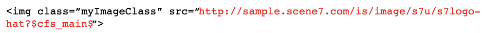

# Dynamic Media Classic主要工作流程和預覽資產 {#main-workflow}

Dynamic Media支援建立（和上傳）、製作（和發佈）和傳送工作流程程式。 首先，您要上傳資產，然後對這些資產執行動作，例如建立影像集，最後發佈以讓這些資產上線。 「建置」步驟對於某些工作流程為選用。 例如，如果您的目標只是動態調整影像大小和縮放，或轉換並發佈視訊以供串流使用，則沒有必要的建置步驟。

Dynamic Media Classic解決方案中的工作流程包含三個主要步驟：

1. 建立（和上傳）SourceContent
2. 製作（及發佈）資產
3. 傳送資產

## 步驟1:建立（和上傳）

這是工作流程的開始。 在此步驟中，您可以收集或建立符合您使用工作流程的來源內容，並將其上傳至Dynamic Media Classic。 系統支援多種檔案類型，適用於影像、視訊和字型，也適用於PDF、Adobe Illustrator和Adobe InDesign。

請參閱 [支援的檔案類型](https://experienceleague.adobe.com/docs/dynamic-media-classic/using/upload-publish/uploading-files.html#supported-asset-file-formats).

您可以透過數種不同方式上傳來源內容：

- 直接從您的案頭或本機網路。 [了解如何](https://experienceleague.adobe.com/docs/dynamic-media-classic/using/upload-publish/uploading-files.html#upload-files-using-sps-desktop-application).
- 從Dynamic Media Classic FTP伺服器。 [了解如何](https://experienceleague.adobe.com/docs/dynamic-media-classic/using/upload-publish/uploading-files.html#upload-files-using-via-ftp).

預設模式為「從案頭」，您可在此瀏覽本地網路上的檔案並啟動上載。

>[!TIP]
>
>請勿手動新增資料夾。 請改為從FTP執行上傳，並使用 **包含子資料夾** 選項，在Dynamic Media Classic內重新建立資料夾結構。

預設會啟用兩個最重要的上傳選項： **標籤為發佈**&#x200B;我們之前討論過， **覆寫**. 「覆寫」意指如果上傳的檔案與系統中已存在的檔案名稱相同，則新檔案將取代現有版本。 如果取消核取此選項，則可能無法上傳檔案。

### 上傳影像時覆寫選項

您可以為整個公司設定「覆寫影像」選項的四種變數，而且這些變數常常被誤解。 簡而言之，您可以設定規則，讓同名資產被更頻繁地覆寫，或是讓覆寫發生頻率較低（在此情況下，新影像會以「–1」或「–2」副檔名重新命名）。

- **在當前資料夾中覆蓋，具有相同的基本影像名稱/副檔名**.
此選項是最嚴格的取代規則。 它要求您將取代影像上傳至與原始影像相同的資料夾，且取代影像的副檔名與原始影像相同。 若不符合這些要求，則會建立重複項目。

- **覆寫目前資料夾中的相同基本資產名稱（不論副檔名為何）**.
需要您將取代影像上傳至與原始檔案相同的資料夾，但副檔名可能與原始檔案不同。 例如， chair.tif會取代chair.jpg。

- **任何檔案夾內若有基本資產名稱/副檔名相同者，將予以覆寫**.
需要替換影像的副檔名與原始影像相同（例如chair.jpg必須替換chair.jpg，而不是chair.tif）。 不過，您可以將取代影像上傳至與原始影像不同的資料夾。 更新後的影像位於新資料夾中；在檔案的原始位置找不到該檔案。

- **任何檔案夾內若有基本資產名稱相同者 (無論副檔名為何)，將予以覆寫**.
此選項是最包容的取代規則。 您可以將取代影像上傳至與原始檔案不同的資料夾、以不同副檔名上傳檔案，然後取代原始檔案。 如果原始檔案位於不同的資料夾中，則替換影像位於上載到的新資料夾中。

深入了解 [覆寫影像選項](https://experienceleague.adobe.com/docs/dynamic-media-classic/using/setup/application-setup.html#using-the-overwrite-images-option).

雖然並非必要，但使用上述兩種方法之一上傳時，您可以指定該特定上傳的「工作選項」，例如，排程循環上傳、在上傳時設定裁切選項等。 這些功能對某些工作流程很有價值，因此若適合您的工作流程，則值得一考。

深入了解 [作業選項](https://experienceleague.adobe.com/docs/dynamic-media-classic/using/upload-publish/uploading-files.html#upload-options).

上傳是任何工作流程中的第一個必要步驟，因為Dynamic Media Classic無法處理系統中尚未包含的任何內容。 在上傳期間的幕後，系統會向集中的Dynamic Media Classic資料庫註冊每個上傳的資產、指派ID，並將其複製到儲存。 此外，系統將影像檔案轉換為允許動態調整大小和縮放的格式，並將視頻檔案轉換為MP4網頁友好格式。

### 概念：以下是將影像上傳至Dynamic Media Classic時的結果

將任何類型的影像上傳至Dynamic Media Classic時，都會轉換為主影像格式，稱為金字塔TIFF或PTIFF。 PTIFF與分層TIFF點陣圖影像的格式類似，只是檔案包含同一影像的多個大小（解析度），而不是不同的圖層。

轉換影像時，Dynamic Media Classic會拍攝影像全部大小的「快照」，縮放一半並儲存，再縮放一半並儲存，等等，直到填滿原始大小的數倍為止。 例如，2000像素的PTIFF在同一檔案中有1000-、500-、250 — 和125像素大小（且更小）。 PTIFF檔案是Dynamic Media Classic中所謂「主影像」的格式。

當您請求特定大小的影像時，建立PTIFF可讓Dynamic Media Classic的影像伺服器快速找到下一個較大的大小並縮小。 例如，如果您上傳2000像素影像並請求100像素影像，Dynamic Media Classic會尋找125像素版本，並將其縮小至100像素，而非從2000像素縮小至100像素。 這使得操作非常快。 此外，當放大影像時，這使縮放查看器僅請求縮放的影像的拼貼，而不是整個完整解析度影像。 主影像格式PTIFF檔案就是這樣支援動態調整大小和縮放的。

同樣地，您可以將主要來源視訊上傳至Dynamic Media Classic，上傳Dynamic Media Classic時，可自動調整其大小，並轉換為適合MP4網頁的格式。

### 決定上傳影像的最佳大小的經驗法則

**以您需要的最大大小上傳影像。**

- 如果需要縮放，請上傳最長維度中1500-2500像素範圍的高解析度影像。 請考慮您要提供多少詳細資訊、來源影像的品質，以及要顯示的產品大小。 例如，為小環上傳1000像素影像，為整個房間場景上傳3000像素影像。
- 如果您不需要縮放，請以顯示的確切大小上傳它。 例如，如果您的頁面上有要放置的標誌或開始畫面/橫幅影像，請以1:1的大小準確上傳，然後以該大小完全呼叫。

**上傳至Dynamic Media Classic之前，請勿上傳或炸毀您的影像。** 例如，請勿上調小影像的樣本，使其變成2000像素的影像。 看起來不妙。 上傳前，請盡可能使影像接近完美。

**縮放沒有最小大小，但依預設，檢視器不會縮放超過100%。** 如果影像太小，它不會縮放，或只會縮小一小部分，以防影像看起來不好。

**雖然影像大小沒有最小值，但不建議上傳巨型影像。** 大型影像可以視為4000+像素。 上傳此大小的影像可能會顯示潛在的瑕疵，例如影像中的灰塵粒子或毛髮。 這些影像在Dynamic Media Classic伺服器上佔用了更多空間，這可能導致您超過合約的儲存限制。

深入了解 [上傳檔案](https://experienceleague.adobe.com/docs/dynamic-media-classic/using/upload-publish/uploading-files.html#uploading-your-files).

## 步驟2:作者（和發佈）

建立和上傳內容後，您將透過執行一或多個子工作流程，從上傳的資產製作新的多媒體資產。 這包括所有不同類型的集合 — 影像、色票、回轉和混合媒體集，以及範本。 其中也包含影片。 我們稍後會詳細說明每種類型的影像收集集和多媒體視訊。 不過，在幾乎所有情況下，您都可以先選取一或多個資產（或未選取任何資產），然後選取您要建置的資產類型。 例如，您可以選取主影像和該影像的幾個檢視，然後選擇建立「影像集」（相同產品的替代檢視集合）。

>[!IMPORTANT]
>
>請確定所有資產皆已標示為要發佈。 雖然依預設，上傳時會自動將所有資產標示為發佈，但您上傳內容中任何新撰寫的資產也必須標示為發佈。

建置新資產後，就會執行發佈工作。 您可以手動執行此操作，或排程自動執行的發佈工作。 發佈會將所有內容從私人、Dynamic Media Classic領域複製到公開，並發佈方程式的伺服器領域。 Dynamic Media發佈工作的產品是每個已發佈資產的唯一URL。

您發佈到的伺服器取決於內容和工作流程的類型。 例如，所有影像都轉到影像伺服器，並將視頻流到FMS伺服器。 為方便起見，我們將說「發佈」是單一事件，傳至單一伺服器。

發佈會發佈所有標示為要發佈的內容，而不只是您的內容。 單一管理員通常代表每個人發佈，而非執行發佈的個別使用者。 管理員可以視需要發佈，或設定將自動發佈的每日、每週或甚至每10分鐘循環工作。 依對您的業務有意義的排程發佈。

>[!TIP]
>
>自動執行發佈工作，並排程完整發佈，以便在每天凌晨12:00點或晚上任何時間執行。

### 概念：了解Dynamic Media Classic URL

Dynamic Media Classic工作流程的最終產品是指向資產（無論是影像集或最適化視訊集）的URL。 這些URL可非常預測，而且會遵循相同的模式。 在影像的情況下，從PTIFF主影像生成每個影像。

以下是影像URL的語法，其中包含一些範例：

在URL中，問號左側的所有項目都是特定影像的虛擬路徑。 問號右側的一切都是影像伺服器修飾符，用於指示如何處理影像。 有多個修飾元時，它們會以&amp;符號分隔。

在第一個示例中，影像&quot;Back_A&quot;的虛擬路徑是 `http://sample.scene7.com/is/image/s7train/BackpackA`. 影像伺服器修改器將影像的大小調整為250像素的寬度（從wid=250），並使用Lanczos插值算法重新調整影像，該算法會隨著調整大小而銳利化（從resMode=sharp2）。

第二個範例將所謂的「影像預設集」套用至相同的Backp_A影像，如$所示！_template300$。 運算式兩側的$符號表示影像預設集（一組封裝的影像修飾元）正被套用至影像。

了解Dynamic Media Classic URL的匯整方式後，您就能了解如何以程式設計方式變更URL，以及如何將這些URL整合到您的網站和後端系統中。

### 概念：了解快取延遲

新上傳和發佈的資產會立即顯示，而更新的資產可能會延遲10小時快取。 依預設，所有已發佈的資產在過期前至少有10小時。 我們說最小值，因為每次檢視影像時，它就會啟動一個時鐘，直到10小時過後，才會過期，而沒有人檢視過該影像。 這10小時時段是資產的「存留時間」。 該資產的快取一旦過期，即可傳送更新的版本。

除非發生錯誤，且影像/資產的名稱與先前發佈的版本相同，否則這通常不會發生問題，但影像有問題。 例如，您不小心上傳了低解析度版本，或您的藝術總監未核准影像。 在此情況下，您會想要重新叫出原始影像，並使用相同資產ID以新版本取代。

了解如何 [手動清除需要更新之URL的快取](https://experienceleague.adobe.com/docs/experience-manager-cloud-service/assets/dynamicmedia/invalidate-cdn-cache-dynamic-media.html?lang=zh-Hant).

>[!TIP]
>
>為避免快取延遲的問題，請一律前進，例如晚上、一天、兩週等。 及時建置，讓內部各方在發佈至公眾之前，能夠證明您的工作成果，以確保QA/接受。 即使在前一個晚上工作，您也能在當天晚上進行變更並重新發佈。 10小時過後，快取會以正確的影像更新。

- 深入了解 [建立發佈工作](https://experienceleague.adobe.com/docs/dynamic-media-classic/using/upload-publish/publishing-files.html#creating-a-publish-job).
- 深入了解 [發佈](https://experienceleague.adobe.com/docs/dynamic-media-classic/using/upload-publish/publishing-files.html).

## 步驟3:傳遞

請記住，Dynamic Media Classic工作流程的最終產品是指向資產的URL。 此URL可能會指向個別影像、影像集、回轉集或其他影像集集合或視訊。 您需要取用該URL並執行相關操作，例如編輯HTML，以便 `` 標籤會指向Dynamic Media Classic影像，而非指向來自您目前網站的影像。

在「傳送」步驟中，您必須將這些URL整合至您的網站、行動應用程式、電子郵件行銷活動，或您要顯示資產的任何其他數位接觸點。

將影像的Dynamic Media Classic URL整合至網站的範例：

紅色的URL是唯一專屬於Dynamic Media Classic的元素。

您的IT團隊或整合合作夥伴可主導撰寫和變更程式碼，將Dynamic Media Classic URL整合至您的網站。 Adobe有一個諮詢團隊，可提供技術、創意或一般指引，協助您完成此工作。

對於縮放檢視器或結合縮放與替代檢視的檢視器等更複雜的解決方案，URL通常會指向由Dynamic Media Classic托管的檢視器，且該URL內也是資產ID的參考。

在新快顯視窗中開啟檢視器中「影像集」的連結範例（紅色）:

>[!IMPORTANT]
>
>您需要將Dynamic Media Classic URL整合至您的網站、行動應用程式、電子郵件和其他數位接觸點 — Dynamic Media Classic無法為您執行此操作！

## 預覽資產

您可能會想要預覽您上傳或正在建立或編輯的資產，以確保客戶檢視資產時，資產可如您所需般顯示。 您可以按一下任何 **預覽** 按鈕，位於資產縮圖上方 **瀏覽/建置面板**，或前往 **檔案>預覽**. 在瀏覽器視窗中，系統會預覽面板中目前的任何資產，無論是影像、視訊或已建置的資產（例如影像集）。

### 動態大小預覽（影像預設集）

您可以使用 **大小** 預覽。 這會載入可用影像預設集的清單。 我們稍後將討論影像預設集，但將它們視為以指定大小載入影像的「方式」，具有特定銳利化和影像品質。

### 縮放預覽

您也可以使用 **縮放** 選項，以根據不同包含的縮放檢視器，在許多預先建立的縮放預設集之一中預覽影像。

深入了解 [預覽資產](https://experienceleague.adobe.com/docs/dynamic-media-classic/using/managing-assets/previewing-asset.html).
