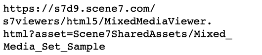

# 影像、色票、回轉和混合媒體集 {#media-sets}

Dynamic Media Classic集合可超越單一影像，提供更豐富的線上體驗，以進行動態調整大小和縮放。 本教學課程的本節將探討如何在Dynamic Media Classic中建立下列多媒體集：

- 影像集
- 色票集
- 迴轉集
- 混合媒體集

也將說明如何使用批次集預設集，透過上傳自動建立集。

## 你一直想知道的關於集合的事

除了基本的動態調整大小和縮放，集合可能是使用最廣泛的Dynamic Media Classic子產品。 集合本質上是「虛擬」資產，不含實際影像，但包含與其他影像和/或視訊的一組關係。 集合的主要吸引力在於，它們是可以「現成」的微型應用。 也就是說，每個集檢視器都包含其專屬的邏輯和介面，因此您只需在網站上呼叫他們即可。 此外，它們只要求您追蹤每個集的單一資產ID，而不需自行管理所有成員資產和關係。

建立集合時，該集合會管理為個別資產，必須先標示為發佈，才能從URL提供該集合。 其所有成員資產也必須發佈。

### 集的類型

讓我們來了解您可在Dynamic Media Classic中建立的四種集類型：影像、色票、回轉和混合媒體集。

## 影像集

這是最常見的集合類型。 您通常會將其用於相同項目的替代檢視。 它包含多個影像，您可按一下該影像的相關縮圖，將這些影像載入檢視器中。

_影像集範例_

上述影像集的URL可能顯示為：

- 透過[影像集快速入門](https://experienceleague.adobe.com/docs/dynamic-media-classic/using/image-sets/quick-start-image-sets.html)深入了解影像集。
- 了解如何[建立影像集](https://experienceleague.adobe.com/docs/dynamic-media-classic/using/image-sets/creating-image-set.html#creating-an-image-set)。

### 色票集

此類型的集通常用於顯示相同項目的彩色視圖。 它由成對的影像和顏色色板組成。

「色票」和「影像集」之間的主要差異在於，「色票集」使用不同的影像作為可點按的色票，而「影像集」使用原始影像的縮圖縮圖版本。

色票集不會將影像著色（常見的誤解）。 只是在交換影像，與在影像集中完全相同。 迷你色票影像可能是使用Photoshop製作，每種顏色可能是單獨拍攝，或者Dynamic Media Classic中的裁切工具可能是使用其中一個彩色影像製作色票。

_色票集範例_

上述色票集的URL可能顯示為：

- 透過[快速入門色票集](https://experienceleague.adobe.com/docs/dynamic-media-classic/using/swatch-sets/quick-start-swatch-sets.html)了解更多色票集。
- 了解如何[建立色票集](https://experienceleague.adobe.com/docs/dynamic-media-classic/using/swatch-sets/creating-swatch-set.html#creating-a-swatch-set)。

### 迴轉集

此集通常用於顯示項目的360度檢視。 與色票集一樣，回轉集也不使用3D魔術 — 真正的工作是從所有方面建立影像的許多照片。 檢視器只會讓您在影像之間切換，就像停止動畫一樣。

回轉集可以沿單個軸沿一個方向回轉，或者如果交替建立為2D回轉集，則可以在多個軸上回轉。 例如，汽車可以在所有車輪都在地面時轉動，然後也可以「翻轉」，在後輪上轉動。 為了正確設定2D回轉集，每個軸的每列影像數應相同。 換言之，如果您在兩個軸上旋轉，則需要的影像數量是單個角度旋轉的兩倍。

_回轉集範例_

上述回轉集的URL可能顯示為：

- 透過[快速入門回轉集](https://experienceleague.adobe.com/docs/dynamic-media-classic/using/spin-sets/quick-start-spin-sets.html)深入了解回轉集。
- 了解如何[建立回轉集](https://experienceleague.adobe.com/docs/dynamic-media-classic/using/spin-sets/creating-spin-set.html#creating-a-spin-set)。

## 混合媒體集

這是組合集。 它可讓您結合任何先前的集合，以及將視訊新增至單一檢視器。 在此工作流程中，您會先建立任何元件集，然後將它們組合為混合媒體集。

_混合媒體集範例_

上述混合媒體集的URL可能顯示為：

- 進一步了解混合媒體集與[快速入門混合媒體集](https://experienceleague.adobe.com/docs/dynamic-media-classic/using/mixed-media-sets/quick-start-mixed-media-sets.html)。

- 了解如何[建立混合媒體集](https://experienceleague.adobe.com/docs/dynamic-media-classic/using/mixed-media-sets/creating-mixed-media-set.html#creating-a-mixed-media-set)。

若要在網站上顯示影像以進行縮放、設定或影片，請在Dynamic Media Classic「檢視器」中將其命名。 Dynamic Media Classic包含多媒體資產的檢視器，例如色票集、回轉集、視訊和其他許多資產。

深入了解[AEM Assets和Dynamic Media Classic適用的檢視器](https://experienceleague.adobe.com/docs/dynamic-media-developer-resources/library/viewers-aem-assets-dmc/c-html5-s7-aem-asset-viewers.html)。

## 批次集預設集

到目前為止，我們一直在討論如何使用Dynamic Media Classic Build函式手動建立集。 不過，只要您有標準化的命名慣例，就可以使用批集預設集自動建立影像集和回轉集。

每個預設集都是一組唯一命名、自含的指令，定義如何使用符合定義命名慣例的影像來建構此集。 在預設集中，您會先定義要分組在一組中之資產的命名慣例。 然後可以建立批集預設集以參考這些影像。

雖然您可以自行建立預設集（可在&#x200B;**設定>應用程式設定>批次集預設集**&#x200B;下找到），但最佳實務是請諮詢團隊或技術支援為您設定。 原因如下：

- 批集預設集的設定可能很複雜 — 它們由規則運算式提供技術支援，除非您是開發人員，否則此語法可能不熟悉或令人困惑。
- 建立後，預設會開啟。 沒有「復原」功能。 如果您開始上傳數千個影像，而您的預設集設定不正確，您可能會收到數百個或數千個中斷的集，您必須手動尋找和刪除。

先前建議使用簡單的命名慣例，很容易建置至批次集預設集。 不過，由於預設集非常有彈性，因此它們可以處理複雜的命名策略。 簡而言之，屬於某個集合的影像應以某個通用名稱系結在一起 — 通常是SKU編號或產品ID。 在Dynamic Media Classic中，您可以指定要用於預設集的所有影像的預設命名慣例，也可以建立多個預設集，每個預設集具有不同的命名規則。

批集預設集僅在上載時應用；上傳影像後無法執行。 因此，在開始載入所有影像之前，請務必規劃您的命名慣例並取得已建置的預設集。

建立預設集後，公司管理員即可選擇其使用中或非使用中。 作用中表示這些預設集會顯示在上傳頁面的&#x200B;**作業選項**&#x200B;下，而非作用中的預設集則會保持隱藏。

了解如何[建立批集預設集](https://experienceleague.adobe.com/docs/dynamic-media-classic/using/setup/application-setup.html#creating-a-batch-set-preset)。

### 在上傳時使用批次集預設集

以下說明建立批集預設集後，如何在上傳時使用這些預設集：

1. 按一下「**上傳**」，然後選擇「從案頭&#x200B;**」或「通過FTP**&#x200B;從&#x200B;**」。**
2. 按一下「**作業選項**」。
3. 開啟&#x200B;**批集預設集**&#x200B;選項，並勾選或取消勾選預設集以便與上傳搭配使用。
4. 上傳完成後，在資料夾中尋找已完成的集合。

進一步了解[批次集預設集](https://experienceleague.adobe.com/docs/dynamic-media-classic/using/setup/application-setup.html#batch-set-presets)。
