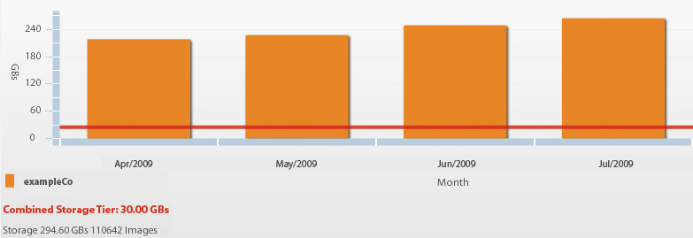

# 適合管理員的寶貴報表 {#valuable-reports}

在最後一章中，我們只是希望您瞭解如果您是管理員，可以考慮設定的兩個重要報表：「頻寬與儲存」報表和「影像錯誤」報表。

## 頻寬與儲存報告

「頻寬與儲存」報表詳細說明每個月已消耗多少影像伺服器頻寬，以及您在Dynamic Media Classic上使用的儲存空間。 儲存是合約金額，因此務必檢查並確保未超過限額，以避免超額費用。

_「頻寬與儲存」報表會顯示此帳戶已超過其30GB的儲存限制。_

## 影像錯誤報告

每當URL請求缺少影像時，影像伺服器都會產生錯誤。 您可以設定在這些情況下顯示的預設影像，但您仍應注意到錯誤。 「影像錯誤」報表提供您過去24小時內最常發生的20個影像錯誤清單，以及發生錯誤次數、發生錯誤的影像，以及有問題影像的頁面等詳細資訊。 如果回應為「預設」，表示已改為提供預設影像。

_影像錯誤報告。_

## 結論

我們希望您在本最佳實務指南中找到內容，這些內容有助於您開始使用功能強大的多媒體解決方案，或從中獲得更多益處。

若要進一步瞭解Dynamic Media Classic，請參閱下列資源：

- [Experience League上的Dynamic Media Classic — 取得價值](https://guided.adobe.com/?launch=AEM-5a#recommended/solutions/experience-manager)
- [Experience League上的Dynamic Media Classic — 完成更多工作](https://guided.adobe.com/?launch=AEM-6a#recommended/solutions/experience-manager)
- [Dynamic Media電子報封存](https://experienceleague.adobe.com/docs/dynamic-media-classic/using/dynamic-media-newsletter.html)
- [Dynamic Media Classic檔案](https://experienceleague.adobe.com/docs/dynamic-media-classic/using/home.html)
