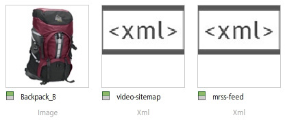

# 影片概述 {#video-overview}

Dynamic Media Classic隨附上傳時的視訊自動轉換、視訊串流至案頭和行動裝置，以及根據裝置和頻寬最佳化以播放的最適化視訊集。 視頻最重要的一點是工作流程很簡單 — 它的設計讓任何人都能使用它，即使他們不太熟悉視頻技術。

在本教學課程的本節結束前，您將了解如何：

- 將視訊上傳並編碼（轉碼）為不同大小和格式
- 從可用的視訊預設集中選擇以上傳
- 新增或編輯視訊編碼預設集
- 在視訊檢視器中預覽視訊
- 將視訊部署至網站和行動網站
- 將字幕和章節標籤新增至視訊
- 為案頭和行動使用者自訂和發佈視訊檢視器

>[!NOTE]
>
>本章中的所有URL僅用於說明目的；它們不是即時連結。

## Dynamic Media Classic影片概觀

首先，讓我們更清楚了解使用Dynamic Media Classic的視訊可能性。

### 功能

Dynamic Media Classic視訊平台提供視訊解決方案的所有部分，包括視訊的上傳、轉換及管理；向視頻添加字幕和章節標籤的功能；以及使用預設集輕鬆播放的功能。

它可讓您輕鬆發佈高品質的最適化視訊，以在多個畫面間串流，包括桌上型電腦、iOS、Android、Blackberry和Windows行動裝置。 適用性視訊集將以不同位速率和格式（如400 kbps、800 kbps和1000 kbps）編碼的相同視訊的版本分組。 台式電腦或行動裝置會偵測可用頻寬。

此外，如果案頭或行動裝置上的網路條件改變，視訊品質會自動動態切換。 此外，如果客戶在桌上型電腦上進入全螢幕模式，適用性視訊集會使用更佳的解析度來回應，進而改善客戶的觀看體驗。 使用最適化視訊集，可讓客戶在多個畫面和裝置上播放Dynamic Media Classic視訊，獲得最佳的播放效果。

### 視訊管理

使用視訊可能比使用靜態數位影像更複雜。 使用視頻，您將處理多種格式和標準，以及觀眾能否播放剪輯的不確定性。 Dynamic Media Classic可讓您輕鬆處理視訊，提供許多功能強大的工具（「機殼底下」），但可免除與他們合作的複雜性。

Dynamic Media Classic可辨識且可搭配許多不同的來源格式使用。 不過，閱讀視訊只是其中一環，您也必須將視訊轉換為適合網頁的格式。 Dynamic Media Classic可讓您將視訊轉換為H.264視訊，借此處理此問題。

使用許多專業和愛好者工具，自己轉換視頻會變得非常複雜。 Dynamic Media Classic提供針對不同品質設定而最佳化的簡單預設集，讓操作更簡單。 不過，如果您想要更自訂的項目，您也可以建立自己的預設集。

如果您有許多影片，您將非常欣賞在Dynamic Media Classic中管理所有資產以及影像和其他媒體的功能。 您可以透過強大的XMP中繼資料支援，組織、編錄和搜尋您的資產，包括視訊資產。

### 視訊播放

將視訊轉換為方便在網路存取的問題，與實作視訊和將視訊部署至網站的問題類似。 選擇是購買播放器還是構建自己的播放器，使它與各種設備和螢幕相容，然後維護您的播放器可能是全職工作。

同樣地，Dynamic Media Classic的方法是讓您選擇符合您需求的預設集和檢視器。 您有許多不同的檢視器選擇，以及可用的許多預設集庫。

由於Dynamic Media Classic支援HTML5視訊，因此您可以輕鬆將視訊傳送至網頁和行動裝置，這表示您可以鎖定執行各種瀏覽器的使用者，以及Android和iOS平台使用者。 串流視訊可順暢地播放較長或高清的內容，而漸進式HTML5視訊則針對小螢幕最佳化預設集。

視訊的檢視器預設集可根據檢視器類型部分設定。

與所有檢視器一樣，整合也是透過單一Dynamic Media Classic URL（每個檢視器或影片）。

>[!NOTE]
>
>最佳作法是使用Dynamic Media Classic HTML5視訊檢視器。 HTML5視訊檢視器中使用的預設集是強大的視訊播放器。 結合為單一播放器，即可使用HTML5和CSS設計播放元件、內嵌播放，以及根據瀏覽器功能使用最適化和漸進式串流，將多媒體內容的觸及範圍擴展至桌上型電腦、平板電腦和行動使用者，並確保簡化的視訊體驗。

關於Dynamic Media Classic視訊的最後一個備注，可能適用於部分客戶：並非所有公司都可能為其帳戶啟用自動轉換、串流或視訊預設集。 如果由於某些原因您無法存取串流視訊的URL，可能就是這個原因。 您仍可上傳和發佈逐步下載的視訊，並可存取所有視訊檢視器。 不過，為了充分利用Dynamic Media Classic的完整視訊功能，您需要連絡客戶經理或銷售經理，以啟用這些功能。

進一步了解Dynamic Media Classic的[影片](https://experienceleague.adobe.com/docs/dynamic-media-classic/using/video/quick-start-video.html)。

## Video 101

### 基本影片概念和術語

開始之前，讓我們討論一些您應該熟悉的術語，以便使用視頻。 這些概念並非Dynamic Media Classic專屬，如果您要管理專業網站的影片，您最好進一步了解相關主題。 在本節結尾，我們將建議一些資源。

- **編碼/轉碼。** 編碼是套用視訊壓縮的程式，將原始、未壓縮的視訊資料轉換為格式，讓您更容易使用。轉碼雖然類似，但是指從一種編碼方法轉換為另一種編碼方法。

   - 使用視訊編輯軟體建立的主視訊檔案通常太大，且格式不適合傳送至線上目的地。 這些檔案通常經過編碼，以便在案頭上快速播放及進行編輯，但無法透過網路傳送。
   - 為了將數位視訊轉換為適當的格式和規格，以便在不同螢幕上播放，視訊檔案會轉碼為較小且有效的檔案大小，以最佳方式傳送至網頁和行動裝置。

- **視頻壓縮。** 減少用於表示數字視頻影像的資料量，是空間影像壓縮和時間運動補償的組合。

   - 大多數壓縮技術都有損，這意味著它們為了達到較小的尺寸而丟棄資料。
   - 例如，DV視頻壓縮相對較少，可以方便地編輯源素材，但是它太大，無法通過網路使用，甚至不能放在DVD上。

- **檔案格式。** 格式是容器，類似ZIP檔案，可決定視訊檔案中檔案的組織方式，但通常不會根據其編碼方式。

   - 源視頻的常見檔案格式包括Windows Media(WMV)、QuickTime(MOV)、Microsoft AVI和MPEG等。 由Dynamic Media Classic發佈的格式為MP4。
   - 視頻檔案通常包含多個軌道 — 一個視頻軌道（沒有音頻）和一個或多個音頻軌道（沒有視頻） — 它們相互關聯並且同步。
   - 視訊檔案格式決定這些不同資料追蹤和中繼資料的組織方式。

- **轉碼器.** 視頻編解碼器描述通過使用壓縮來編碼視頻的算法。音頻也通過音頻編解碼器進行編碼。

   - 轉碼器將播放視訊所需的資訊量減到最少。 僅儲存關於一個幀和下一個幀之間差異的資訊，而不是每個單獨幀的資訊。
   - 由於大部分視訊在一個幀之間變化很小，因此編解碼器允許高壓縮率，這會導致檔案大小變小。
   - 視頻播放器根據視頻的編解碼器對視頻進行解碼，然後在螢幕上顯示一系列影像或幀。
   - 常見的視訊轉碼器包括H.264、On2 VP6和H.263。

- **解析度.** 視訊的高度和寬度（像素）。

   - 源視頻的大小由相機決定，並從編輯軟體輸出。 高清相機通常會產生1920 x 1080高解析度的視訊，但為了在網路上順暢播放，您會將其縮減取樣（調整大小）至1280 x 720、640 x 480或更小的解析度。
   - 解析度會直接影響檔案大小，以及播放該視訊所需的頻寬。

- **顯示外觀比例。** 視訊寬度與視訊高度的比率。當視訊的長寬比不符合播放器的比例時，您可能會看到「黑條」或空白字元。 用於顯示視訊的兩種常見外觀比率為：

   - 4:3(1.33:1)。 用於幾乎所有標準定義的電視廣播內容。
   - 16:9(1.78:1)。 用於幾乎所有寬屏、高清電視內容(HDTV)和電影。

- **位速率/資料速率。** 編碼為構成視訊播放單秒的資料量（以千位/秒為單位）。

   - 一般而言，位速率越低，對Web來說就越理想，因為它的下載速度越快。 但是，這也意味著由於壓縮損失，質量很低。
   - 良好的編解碼器應平衡低比特率和高質量。

- **幀速率（每秒幀數，或FPS）。** 每秒視頻的幀數或靜止影像數。通常，北美電視(NTSC)的播出速度為29.97 FPS;歐洲和亞洲電視(PAL)以25 FPS播放；和膠片（模擬和數字）通常為24(23.976)FPS。

   - 為了讓事情更加混亂，還有逐行和交錯的幀。 每個逐行幀包含整個影像幀，而隔行幀包含影像幀中的每一行像素。 然後，畫面會迅速播放，看起來會融為一體。 膠片使用逐行掃描方法，而數字視頻通常是隔行掃描的。
   - 一般而言，源素材是否是隔行掃描無關 — Dynamic Media Classic將保留轉換後視頻中的掃描方法。
   - 串流/漸進式傳送。 視訊串流是在連續資料流中傳送媒體，當它到達時可加以播放，而逐步下載的視訊會像從伺服器下載的任何其他檔案一樣下載，並快取在您的瀏覽器中。

希望本入門課程能協助您了解使用Dynamic Media Classic影片時涉及的各種選項。

## 視訊工作流程

在Dynamic Media Classic中使用視訊時，會遵循與使用影像類似的基本工作流程。

1. 首先，請上傳視訊檔案至Dynamic Media Classic。 要執行此操作，請開啟Dynamic Media Classic擴充功能面板底部的&#x200B;**工具功能表**，然後選擇&#x200B;**上傳至Dynamic Media Classic >檔案至資料夾名稱**&#x200B;或&#x200B;**上傳至Dynamic Media Classic >資料夾至資料夾名稱**。 「資料夾名稱」會是您目前使用擴充功能瀏覽的任何資料夾。 視訊檔案可能很大，因此我們建議使用FTP上傳大型檔案。 在上傳作業中，選擇一或多個視訊預設集來編碼您的視訊。 上傳時，視訊可轉碼為MP4視訊。 如需使用和建立編碼預設集的詳細資訊，請參閱下方的視訊預設集主題。 了解[上傳和編碼視訊](https://experienceleague.adobe.com/docs/dynamic-media-classic/using/video/uploading-encoding-videos.html)。
2. 選取或選取並修改視訊檢視器預設集，並預覽您的視訊。 您可以選擇預先建立的檢視器預設集，或自訂您自己的預設集。 如果您要鎖定行動使用者，您不必在此處執行任何動作，因為行動平台不需要檢視器或預設集。 進一步了解[在視訊檢視器](https://experienceleague.adobe.com/docs/dynamic-media-classic/using/video/previewing-videos-video-viewer.html)中預覽視訊和[新增或編輯視訊檢視器預設集](https://experienceleague.adobe.com/docs/dynamic-media-classic/using/video/previewing-videos-video-viewer.html#adding-or-editing-a-video-viewer-preset)。
3. 執行視訊發佈、取得URL及整合。 視訊工作流程與影像工作流程的此步驟主要差異在於，您將執行特殊的「視訊發佈」，而非（或可能以及）標準的「影像伺服發佈」。 案頭上的視訊檢視器整合的運作方式與影像檢視器整合完全相同，不過對於行動裝置而言則更簡單 — 您只需要視訊本身的URL。

### 關於轉碼

轉碼的定義早先是從一種編碼方法轉換為另一種編碼方法的過程。 在Dynamic Media Classic的案例中，此程式會將來源視訊從目前的格式轉換為MP4。 在案頭瀏覽器或行動裝置上顯示影片之前，此為必要項目。

Dynamic Media Classic可為您處理所有轉碼作業，這是一項巨大優勢。 您可以自行轉碼視訊，並上傳已轉換為MP4的檔案，但這可能是一個需要複雜軟體的複雜過程。 除非你知道自己在做什麼，否則你通常不會在第一次嘗試時獲得良好的結果。

Dynamic Media Classic不僅會為您轉換檔案，還提供簡單易用的預設集，讓您輕鬆操作。 您確實不需要對此流程的技術方面了解多少 — 您只需知道大致的最終大小，以及最終用戶擁有的頻寬。

雖然預先建立的預設集很實用，且可滿足大部分需求，但有時您需要更自訂的項目。 在此情況下，您可以建立自己的編碼預設集。 在Dynamic Media Classic中，編碼預設集稱為視訊預設集。 本章稍後將對此進行說明。

### 關於串流

另一項值得注意的主要功能是視訊串流，這是Dynamic Media Classic視訊平台的標準功能。 串流媒體在傳送時會持續由使用者接收並呈現給使用者。 這是重要和可取的，原因有很多。

串流通常需要的頻寬比漸進式下載要少，因為實際上只會傳送觀看的視訊部分。 Dynamic Media Classic視訊串流伺服器和檢視器會使用自動頻寬偵測，提供使用者網際網路連線所可能的最佳資料流。

透過串流，視訊開始播放的速度會比使用其他方法來得快。 它還能更有效地使用網路資源，因為只有被觀看的視頻部分才會發送到客戶端。

另一種傳送方法是漸進式下載。 與串流視訊相比，漸進式下載只有一個一致的優點 — 您不需要串流伺服器來傳送視訊。 這當然是Dynamic Media Classic的功能 — Dynamic Media Classic有內建在平台中的串流伺服器，因此您不需要維護這部專屬硬體的麻煩或額外成本。

可從任何一般Web伺服器提供漸進式下載視訊。 雖然這種方式既方便又具成本效益，但請記住，漸進式下載的搜尋和導覽功能有限，使用者可存取和重新調整您的內容用途。 在某些情況下，例如在嚴格的網路防火牆後播放，流傳輸可能會被阻止；在這些情況下，可以期望回滾到逐步交付。

對愛好者或具有低流量需求的網站來說，漸進式下載是絕佳選擇；如果他們不介意自己的內容是否快取在用戶電腦上；如果他們只需要傳送較短長度的視訊（10分鐘以內）;或者，如果訪客因故收不到串流視訊。

如果您需要進階功能並控制視訊傳送，以及/或您需要向較大的對象（例如數百個同時觀看者）顯示視訊、追蹤和報表使用情況或檢視統計資料，或想要為檢視者提供最佳的互動式播放體驗，則需要串流您的視訊。

最後，如果您擔心因智慧財產權或權限管理問題而保護媒體，流式傳送可提供更安全的視訊傳送，因為媒體在串流時不會儲存到用戶端的快取。

## 視訊預設集

上傳視訊時，您可以從一或多個預設集中選擇，這些預設集包含透過編碼將主視訊轉換為適合網頁的格式的設定。 視訊預設集有兩種風格：適用性視訊預設集和單一編碼預設集。

請參閱[可用視訊預設集](https://experienceleague.adobe.com/docs/dynamic-media-classic/using/setup/application-setup.html#video-presets-for-encoding-video-files)。

「適用性視訊預設集」預設為啟用，這表示可用於編碼。 如果您想使用單一編碼預設集，管理員需要啟用它，才會顯示在視訊預設集清單中。

了解如何[啟動或取消啟動視訊預設集](https://experienceleague.adobe.com/docs/dynamic-media-classic/using/video/uploading-encoding-videos.html#activating-or-deactivating-video-encoding-presets)。

您可以選擇Dynamic Media Classic隨附的許多預先建立的預設集之一，或自行建立預設集；不過，預設不會選取要上傳的預設集。 換句話說，如果您未在上傳時選取「視訊預設集」，則您的視訊將不會轉換，且可能無法發佈&#x200B;**。**&#x200B;不過，您可以自行離線轉換影片，上傳和發佈也不錯。 只有在您想要Dynamic Media Classic為您進行轉換時，才需要視訊預設集。

上傳時，您可以選擇「作業選項」面板中的&#x200B;**視訊選項**&#x200B;來選取視訊預設集。 然後，您可以選擇要為電腦、行動裝置或平板電腦進行編碼。

- 電腦供案頭使用。 您通常會在此處找到耗用更多頻寬的較大預設集（例如HD）。
- 行動裝置和平板電腦為iPhone和Android智慧手機等裝置建立MP4視訊。 行動裝置和平板電腦的唯一差異在於，平板電腦預設集的頻寬通常較高，因為其使用方式是以WiFi為基礎。 行動預設集已針對較慢的3G使用情形最佳化。

### 在選擇預設集之前要自問的問題

選擇預設集時，您應了解您的對象以及來源素材。 您對客戶了解多少？ 他們如何觀看視頻 — 使用電腦顯示器或移動設備？

視頻解析度是什麼？ 如果您選擇的預設集比原始預設集大，則可能會得到一個模糊/像素化視頻。 如果影片大於預設集，但不要選擇大於來源影片的預設集，即可。

它的長寬比是多少？ 如果在轉換的視訊周圍看到黑色長條，表示您選擇了錯誤的長寬比。 Dynamic Media Classic無法自動偵測這些設定，因為上傳前必須先檢查檔案。

### 視訊選項劃分

視訊預設集會指定這些設定，以決定視訊的編碼方式。 若您不熟悉這些術語，請參閱上述基本影片概念和術語主題。

- **外觀比例.** 通常為標準4:3或寬螢幕16:9。
- **大小.** 這與顯示解析度相同，並以像素計量。這與長寬比有關。 以16:9的比例，視訊會是432 x 240像素，而以4:3的比例則是320 x 240像素。
- **FPS.** 標準幀速率是30、25或24幀/秒(fps)，具體取決於視頻標準 — NTSC、PAL或Film。此設定並不重要，因為Dynamic Media Classic一律會使用與來源視訊相同的影格速率。
- **格式.** 這是MP4。
- **頻寬。** 這是目標使用者所需的連線速度。他們的網際網路連接速度快還是速度慢？ 他們通常使用桌上型電腦或行動裝置嗎？ 這也與解析度（大小）有關，因為視訊愈大，所需頻寬愈大。

### 決定視訊的資料速率或「位元速率」

計算視訊的位元速率是將視訊提供至網路時，最不明白的因素之一，但可能最重要，因為它會直接影響使用者體驗。 如果將比特率設定得太高，則視頻質量會很高，但效能會很差。 網際網路連線速度較慢的使用者將被迫等候，因為視訊播放時會持續暫停。 但是，如果設定得太低，品質就會受到影響。 在視訊預設集內，Dynamic Media Classic會根據您的目標頻寬，提供一系列資料。 這是一個好起點。

但是，如果你想自己弄明白，你需要一個速率計算器。 這是視頻專業人員和愛好者常用的工具，用於估計資料在給定流或介質（如DVD）中的大小。

## 建立自訂視訊預設集

有時候，您可能會發現需要特殊的視訊預設集，而不符合內建編碼視訊預設集的設定。 如果您的自訂視訊具有特定大小，例如從3D動畫軟體建立的視訊，或已從原始大小裁切的視訊，就可能會發生此情況。 您可能想要嘗試使用不同的頻寬設定，以提供更高品質或更低品質的視訊。 無論如何，您都需要建立自訂的單一編碼視訊預設集。

### 視訊預設集工作流程

1. 視訊預設集位於&#x200B;**Setup > Application Setup > Video Presets**&#x200B;下。 您可以在這裡找到公司可用的所有編碼預設集清單。

   - 每個串流視訊帳戶都有數十個現成的預設集，如果您建立自己的自訂預設集，您也會在此處看到這些預設集。
   - 您可以使用下拉式功能表依類型篩選。 預設集分為電腦、行動裝置和平板電腦。
      

2. 「作用中」欄可讓您選擇要顯示上傳時的所有預設集，還是只顯示您選擇的預設集。 如果您在美國，則可能要取消選中「歐洲PAL預設集」，如果在UK/ EMEA中，取消選中「NTSC預設集」。
3. 按一下&#x200B;**Add**&#x200B;按鈕以建立自訂預設集。 這會開啟「新增視訊預設集」面板。 此處的程式類似於建立影像預設集。
4. 首先，為其指定&#x200B;**預設集名稱**，以在預設集清單中顯示。 在上例中，此預設集用於螢幕擷取教學課程影片。
5. **Description**&#x200B;為選用，但可為您的使用者提供說明此預設集用途的工具提示。
6. **編碼檔案尾碼**&#x200B;會附加至您在此建立的視訊名稱的結尾。 請記住，您會有主視訊以及這個編碼的視訊（此為主視訊的衍生項目），而且Dynamic Media Classic中的兩個資產都不能有相同的資產ID。
7. **播** 放裝置，可在其中選擇想要的視訊檔案格式（電腦、行動裝置或平板電腦）。請記住，行動裝置和平板電腦會產生相同的MP4格式。 Dynamic Media Classic只需知道要放置預設集的類別；不過，理論上的差異在於，平板電腦預設集通常用於更快的網際網路連線，因為所有預設集都支援WiFi。
8. **Target資** 料比率是您必須自行判斷的項目，不過您可以在下方的影像上看到建議的範圍。或者，您也可以將滑桿拖曳至約定目標頻寬。 要獲得更精確的數字，請使用位速率計算器。 有一點試驗和錯誤。

   

9. 設定源檔案的&#x200B;**長寬比**。 此設定會直接與下方的大小相連結。 如果選擇&#x200B;_Custom_，則必須手動輸入寬度和高度。
10. 如果您選擇外觀比例，請為&#x200B;**解析度大小**&#x200B;設定一個值，Dynamic Media Classic就會自動填入另一個值。 不過，對於自訂外觀比例，請填入兩個值。 您的大小應與您的資料速率一致。 如果您設定的資料速率非常低且大，您會預期品質會很差。
11. 按一下「**儲存**」以儲存預設集。 與其他所有預設不同，此時您不需要發佈，因為預設集僅用於上傳檔案。 稍後，您必須發佈已編碼的視訊，但預設集僅供Dynamic Media Classic內部使用。
12. 若要確認您的視訊預設集是否在上傳清單上，請前往&#x200B;**Upload**。選擇&#x200B;**工作選項**&#x200B;並展開&#x200B;**視訊選項**。 您的預設集會列在您所選播放裝置（電腦、行動裝置或平板電腦）的類別中。

深入了解[新增或編輯視訊預設集](https://experienceleague.adobe.com/docs/dynamic-media-classic/using/video/uploading-encoding-videos.html#adding-or-editing-a-video-encoding-preset)。

## 為視訊添加字幕

在某些情況下，向視頻添加字幕會很有用 — 例如，當您需要以多種語言向觀眾提供視頻，但不想用另一種語言複製音頻或以不同語言再次錄制視頻時。 此外，添加字幕為聽力受損者提供更好的可訪問性，並使用隱藏式字幕。 Dynamic Media Classic可讓您輕鬆在影片中新增註解。

了解如何[向Video](https://experienceleague.adobe.com/docs/dynamic-media-classic/using/video/adding-captions-video.html)添加字幕。

## 新增章節標籤至您的視訊

若是長篇影片，您的觀眾可能會欣賞到使用章節標籤來導覽影片的功能與便利。 Dynamic Media Classic可讓您輕鬆將章節標籤新增至您的影片。

了解如何[將章節標籤新增至Video](https://experienceleague.adobe.com/docs/dynamic-media-classic/using/video/adding-chapter-markers-video.html)。

## 影片實作主題

### 發佈與複製URL

Dynamic Media Classic工作流程的最後一個步驟是發佈您的影片內容。 不過，視訊有其專屬的發佈工作（稱為視訊伺服器發佈），可在「進階」下找到。

了解如何[發佈您的視訊](https://experienceleague.adobe.com/docs/dynamic-media-classic/using/video/deploying-video-websites-mobile-sites.html#publishing-video)。

執行視訊發佈後，您將能取得URL，以在網頁瀏覽器中存取您的視訊和任何現成的Dynamic Media Classic Viewer Presets。 不過，如果您自訂或建立自己的視訊檢視器預設集，您仍需要執行個別的影像伺服器發佈。

- 了解如何[將URL連結至行動網站或網站](https://experienceleague.adobe.com/docs/dynamic-media-classic/using/video/deploying-video-websites-mobile-sites.html#linking-a-video-url-to-a-mobile-site-or-a-website)。
- 了解如何[將視訊檢視器內嵌在網頁上](https://experienceleague.adobe.com/docs/dynamic-media-classic/using/video/deploying-video-websites-mobile-sites.html#embedding-the-video-viewer-on-a-web-page)。

您也可以使用協力廠商或自訂內建的視訊播放器來部署視訊。

了解如何使用協力廠商視訊播放器](https://experienceleague.adobe.com/docs/dynamic-media-classic/using/video/deploying-video-websites-mobile-sites.html#deploying-video-using-a-third-party-video-player)部署視訊。[

此外，如果還要使用視頻縮略圖（從視頻中提取的影像），則還需要運行「影像伺服器」發佈。 這是因為視訊的縮圖影像位於影像伺服器上，而視訊本身位於視訊伺服器上。 視訊縮圖可用於視訊搜尋結果、視訊播放清單中，並可作為播放視訊之前，在視訊檢視器中顯示的初始「海報框架」。

深入了解[使用視訊縮圖](https://experienceleague.adobe.com/docs/dynamic-media-classic/using/video/deploying-video-websites-mobile-sites.html#working-with-video-thumbnails)。

### 選取和自訂檢視器預設集

選取和自訂檢視器預設集的程式與影像的程式完全相同。 您可以建立新預設集或修改現有預設集，然後以新名稱儲存、進行編輯，以及執行「影像伺服」發佈。 所有檢視器預設集都會發佈到影像伺服器，而不只是影像的預設集，因此您必須執行影像發佈，才能查看新的或修改的預設集。

>[!TIP]
>
>在視訊伺服器發佈後執行影像伺服以發佈任何與您的視訊相關聯的縮圖影像。

## 視訊搜尋引擎最佳化

搜尋引擎最佳化(SEO)是改善搜尋引擎中網站或網頁可見性的程式。 雖然搜尋引擎擅長收集關於文字內容的資訊，但除非向他們提供這些資訊，否則他們無法充分取得視訊的資訊。 使用Dynamic Media Classic Video SEO時，您可以使用中繼資料來提供視訊的說明給搜尋引擎。 視訊SEO功能可讓您建立視訊網站地圖和媒體RSS(mRSS)饋送。

- **視訊Sitemap**。告知Google視訊內容在網站上的確切位置和內容。 因此，視訊可在Google上完全搜尋。 例如，視訊Sitemap可指定視訊的執行時間和類別。
- **mRSS饋送**。內容發佈者用來將媒體檔案饋送至Yahoo! 視訊搜尋。 Google支援視訊Sitemap和媒體RSS(mRSS)摘要通訊協定，用於將資訊提交至搜尋引擎。

當您建立視訊網站地圖和mRSS饋送時，您會決定要包含視訊檔案中的中繼資料欄位。 這樣，您就可以向搜尋引擎描述您的影片，讓搜尋引擎能夠更精確地將流量導向您網站上的影片。

建立Sitemap或摘要後，您就可以讓Dynamic Media Classic自動發佈、手動發佈，或只產生檔案以供日後編輯。 此外，Dynamic Media Classic可每天自動產生和發佈此檔案。

程式結束時，您會將檔案或URL提交至搜尋引擎。 這項工作是在Dynamic Media Classic外完成；不過，我們將在下面簡要討論。

### Sitemap/mRSS檔案需求

為了讓Google和其他搜尋引擎不會拒絕您的檔案，這些檔案的格式必須正確，並包含某些資訊。 Dynamic Media Classic將產生格式正確的檔案；不過，如果您的某些影片無法取得這些資訊，則這些資訊將不會包含在檔案中。

必填欄位包括「著陸頁面」（提供影片的頁面URL，而非影片本身的URL）、「標題」和「說明」。 每個視訊都必須有這些項目的項目，否則不會納入產生的檔案中。 選用欄位為「標籤」和「類別」。

還有其他兩個必要欄位：內容URL、視訊資產本身的URL，以及縮圖、視訊縮圖影像的URL，不過Dynamic Media Classic會自動為您填入這些值。

建議的工作流程是使用XMP中繼資料在上傳前將此資料內嵌到您的影片中，而Dynamic Media Classic會在上傳時擷取。 您會使用Adobe Bridge(所有Adobe Creative Cloud應用程式都包含此應用程式)等應用程式，將資料填入標準中繼資料欄位中。

依照此方法，您就不需要使用Dynamic Media Classic手動輸入此資料。 不過，您也可以使用Dynamic Media Classic中的中繼資料預設集，以快速方式每次輸入相同資料。

有關該主題的詳細資訊，請參閱[查看、添加和導出元資料](https://experienceleague.adobe.com/docs/dynamic-media-classic/using/managing-assets/viewing-adding-exporting-metadata.html)。

中繼資料填入後，您就能在該視訊資產的「詳細資料檢視」中看到。 關鍵字也可能存在，但它們位於「關鍵字」頁簽下。

- 深入了解[新增關鍵字](https://experienceleague.adobe.com/docs/dynamic-media-classic/using/managing-assets/viewing-adding-exporting-metadata.html#add-or-edit-keywords)。
- 深入了解[視訊SEO](https://experienceleague.adobe.com/docs/dynamic-media-classic/using/setup/video-seo-search-engine-optimization.html)。
- 了解視訊SEO的[設定](https://experienceleague.adobe.com/docs/dynamic-media-classic/using/setup/video-seo-search-engine-optimization.html#choosing-video-seo-settings)。

#### 設定視訊SEO

設定視訊SEO的開始是選擇您要的格式類型、產生方法，以及應將哪些中繼資料欄位放入檔案中。

1. 前往&#x200B;**設定>應用程式設定>視訊SEO >設定**。
2. 在&#x200B;**層代模式**&#x200B;菜單中，選擇檔案格式。 預設值為「關閉」，因此若要啟用，請選擇「視訊Sitemap」、「mRSS」或「兩者」。
3. 選擇要自動生成還是手動生成。 為簡單起見，建議您將其設為&#x200B;**自動模式**。 如果您選擇「自動」，請也設定「**標示為發佈**」選項，否則檔案不會上線。 Sitemap和RSS檔案是XML檔案的類型，必須像發佈任何其他資產一樣發佈。 如果您目前尚未準備好所有資訊，或只想執行一次性生成，請使用其中一種手動模式。
4. 填入要在檔案中使用的中繼資料標籤。 此步驟不是選用的。 您至少必須包含標有星號(\*)的三個欄位：**著陸頁面** 、 **標題**&#x200B;和&#x200B;**說明**。 若要對這些工作使用您的中繼資料，請將右側的「中繼資料」面板中的欄位拖放至表單上的對應欄位。 Dynamic Media Classic會自動將每個影片的實際資料填入預留位置欄位。 您不必使用中繼資料欄位。 您可以改為在此輸入一些靜態文字，但每個影片會顯示相同的文字。
5. 在三個必填欄位中輸入資訊後，Dynamic Media Classic會啟用&#x200B;**Save**&#x200B;和&#x200B;**Save &amp; Generate**&#x200B;按鈕。 按一下「 」以儲存您的設定。 如果您處於自動模式，且想要讓Dynamic Media Classic稍後產生檔案，請使用&#x200B;**儲存**。 使用&#x200B;**儲存並產生**&#x200B;立即建立檔案。

### 測試和發佈您的視訊Sitemap、mRSS饋送或兩個檔案

產生的檔案會顯示在您帳戶的根（基礎）目錄中。

這些檔案必須發佈，因為影片SEO工具本身無法執行發佈。 只要將它們標示為發佈，就會在下次執行發佈時傳送至發佈伺服器。

發佈後，您的檔案將可使用此URL格式。

範例:

### 提交至搜尋引擎

最後一步是將您的檔案和/或URL提交至搜尋引擎。 Dynamic Media Classic無法為您執行此步驟；不過，假設您提交URL而非XML檔案本身，您的摘要應在下次產生檔案及發佈時更新。

提交至搜尋引擎的方法會有所不同，不過，對於Google，您使用的是Google網站管理員工具。 前往「**網站設定>網站地圖**」，然後按一下「**提交Sitemap**」按鈕。 您可以在此將Dynamic Media Classic URL放置到SEO檔案。

### 影片SEO報表

Dynamic Media Classic提供報表，顯示檔案中成功包含了多少個視訊，更重要的是，這些視訊並未包含在錯誤中。 若要存取報表，請前往&#x200B;**設定>應用程式設定>視訊SEO >報表**。

## MP4視訊的行動實作

Dynamic Media Classic不包含行動裝置的檢視器預設集，因為不需要檢視者在支援的行動裝置上播放視訊。 只要您編碼為H.264 MP4格式（通過上傳時轉換或在案頭上預編碼），支援的平板電腦和智慧手機就能夠播放您的視頻，而無需觀看者。 Android和iOS（iPhone和iPad）裝置均支援此功能。

不需要檢視器的原因是，這兩個平台皆有原生H.264支援。 您可以將視訊內嵌在HTML5網頁中，或將視訊內嵌在應用程式本身，而Android和iOS作業系統將提供控制器以播放視訊。

因此，Dynamic Media Classic不會為行動裝置的檢視器提供URL，而會直接為影片提供URL。 在MP4視訊的「預覽」視窗中，會有「案頭」和「行動」的連結。 行動URL會指向已發佈的影片。

關於已發佈的視訊，需注意的重要事項之一，是URL會列出視訊的完整路徑，而不只是資產ID。 處理影像時，無論資料夾結構為何，您都會依其資產ID呼叫影像。 不過，對於視訊，您也必須指定資料夾結構。 在上述URL中，視訊儲存在路徑中：

這也可以表示為公司名稱/資料夾路徑/視訊名稱。

### 方法#1:瀏覽器播放 — HTML5代碼

若要將MP4視訊內嵌在網頁中，請使用HTML5視訊標籤。

此方法也適用於案頭Web，但您可能會因為瀏覽器支援而遇到問題 — 並非所有案頭Web瀏覽器都原本支援H.264視訊，包括Firefox。

### 方法#2:iOS上的應用程式播放 — 媒體播放器架構

或者，您也可以將Dynamic Media Classic MP4視訊內嵌在行動應用程式程式碼中。 以下是iOS使用僅供說明用途之Media Player架構的一般範例：

## 其他資源

觀看[Dynamic Media技能生成器：Dynamic Media Classic](https://seminars.adobeconnect.com/p2ueiaswkuze)隨選網路研討會中的影片，了解如何使用Dynamic Media Classic中的影片功能。
