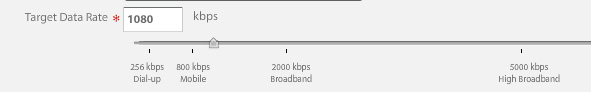

# 影片概觀 {#video-overview}

Dynamic Media Classic提供上傳時視訊的自動轉換、案頭和行動裝置的視訊串流，以及根據裝置和頻寬針對播放進行最佳化的最適化視訊集。 視訊最重要的事情之一就是工作流程非常簡單，即便不熟悉視訊技術，任何人都能使用。

在本教學課程的這個章節結束時，您將知道如何：

- 上傳視訊並編碼（轉碼）為不同大小和格式
- 在可供上傳的視訊預設集中選擇
- 新增或編輯視訊編碼預設集
- 在視訊檢視器中預覽視訊
- 將視訊部署至網站和行動網站
- 新增註解和章節標籤至視訊
- 為桌上型電腦和行動使用者自訂和發佈視訊檢視器

>[!NOTE]
>
>本章中的所有URL僅供說明用途；並非即時連結。

## Dynamic Media Classic影片概觀

讓我們先更瞭解使用Dynamic Media Classic製作視訊的可能性。

### 特性與功能

Dynamic Media Classic視訊平台提供視訊解決方案的所有部分 — 上傳、轉換和管理視訊；為視訊新增字幕和章節標籤的功能；以及使用預設集輕鬆播放的功能。

它可讓您輕鬆發佈高品質的最適化視訊，以便在多個熒幕(包括桌上型電腦、iOS、Android™、BlackBerry®和Windows行動裝置)上串流。 「自我調整視訊集」會將使用不同位元速率和格式（例如400 kbps、800 kbps和1000 kbps）編碼的相同視訊版本分組。 桌上型電腦或行動裝置會偵測到可用的頻寬。

此外，如果桌上型電腦或行動裝置上的網路狀況改變，視訊品質會自動動態切換。 此外，如果客戶在桌上型電腦進入全熒幕模式，Adaptive Video Set會使用更好的解析度來回應，進而改善客戶的觀看體驗。 對於在多個熒幕和裝置上播放Dynamic Media Classic視訊的客戶，使用「最適化視訊集」可提供最佳播放方式。

### 視訊管理

使用視訊可能比使用靜態數位影像更複雜。 透過視訊，您可以處理多種格式和標準，以及觀眾能否播放剪輯的不確定性。 Dynamic Media Classic可讓您輕鬆處理視訊，提供「隱藏式」許多強大工具，但免除使用視訊的複雜性。

Dynamic Media Classic可辨識並搭配多種可用的來源格式運作。 不過，閱讀影片只是工作的一部分，您也必須將影片轉換為網頁易用的格式。 Dynamic Media Classic可讓您將視訊轉換為H.264視訊來處理這個問題。

使用許多可用的專業和愛好者工具，自行轉換視訊會變得複雜。 Dynamic Media Classic提供針對不同品質設定進行最佳化的簡易預設集，讓操作更簡單。 不過，如果您想要更自訂的內容，也可以建立自己的預設集。

如果您有大量影片，一定會感激您能夠在Dynamic Media Classic中管理所有資產以及影像和其他媒體。 您可以透過強大的XMP中繼資料支援，整理、編目和搜尋您的資產（包括視訊資產）。

### 視訊播放

將視訊轉換成Web友好型且可供存取的問題類似，也是實作視訊並將其部署至網站的問題。 選擇購買播放器或是建置自己的播放器，使其與各種裝置和熒幕相容，然後維護您的播放器可能是全職工作。

同樣地，Dynamic Media Classic的方法是讓您選擇符合您需求的預設集和檢視器。 您有許多不同的檢視器選擇，而且有許多可用的預設集資料庫。

您可以輕鬆將視訊傳送至網頁和行動裝置，因為Dynamic Media Classic支援HTML5視訊，這表示您可以鎖定執行各種瀏覽器的使用者，以及Android™和iOS平台使用者。 串流視訊可順暢播放較長或高解析度內容，而漸進式HTML5視訊則有針對小熒幕最佳化的預設集。

視訊的檢視器預設集可依檢視器型別進行部分設定。

就像所有檢視器一樣，整合是透過每個檢視器或視訊單一Dynamic Media Classic URL。

>[!NOTE]
>
>如需參考最佳作法，請使用Dynamic Media Classic HTML5影片檢視器。 HTML5視訊檢視器中使用的預設集是強大的視訊播放器。 將使用HTML5和CSS設計播放元件的功能合併為單一播放器、採用內嵌式播放，以及根據瀏覽器的功能使用調適型和漸進式串流，您可將豐富媒體內容的觸及範圍延伸至桌上型電腦、平板電腦和行動使用者，並確保簡化的視訊體驗。

可能適用於某些客戶的Dynamic Media Classic視訊的最後一個注意事項：並非所有公司都可能為其帳戶啟用自動轉換、串流或視訊預設集。 如果您因為某些原因無法存取串流視訊的URL，這可能是原因。 您可以上傳和發佈漸進式下載的視訊，並可存取所有視訊檢視器。 不過，若要利用完整的Dynamic Media Classic視訊功能，請聯絡您的客戶經理或銷售經理，以啟用這些功能。

進一步瞭解 [Dynamic Media Classic中的影片](https://experienceleague.adobe.com/docs/dynamic-media-classic/using/video/quick-start-video.html).

## Video 101

### 基本影片概念和術語

在開始之前，請先討論您應該熟悉的一些術語，以便使用影片。 這些概念並非Dynamic Media Classic特有，如果您要管理專業網站的影片，最好進一步瞭解該主題。 我們建議在本節結尾提供一些資源。

- **編碼/轉碼。** 編碼是套用視訊壓縮的程式，以將原始的未壓縮視訊資料轉換為更易於使用的格式。 轉碼與此類似，指的是從一種編碼方法轉換成另一種編碼方法。

   - 使用視訊編輯軟體建立的主視訊檔案通常太大，且格式不正確，無法傳送到線上目的地。 它們通常經過編碼，以便在案頭上快速播放和進行編輯，但不是為了透過網路傳送。
   - 為了將數位視訊轉換為在不同熒幕播放的適當格式和規格，視訊檔案會轉碼為較小、有效率的檔案大小，以最佳方式傳送至網頁和行動裝置。

- **視訊壓縮。** 減少用於表示數位視訊影像的資料量，這是空間影像壓縮和時間運動補償的組合。

   - 大部分的壓縮技術都是有損的，這表示它們會捨棄資料，以達到較小的大小。
   - 例如，DV視訊的壓縮量相對較小，可讓您輕鬆編輯來源素材，但因過於龐大，無法透過網頁使用，甚至無法放入DVD。

- **檔案格式。** 格式是一種容器，類似於ZIP檔案，可決定檔案在視訊檔案中的組織方式，但通常不會決定其編碼方式。

   - 來源視訊的常見檔案格式包括Windows Media (WMV)、QuickTime (MOV)、Microsoft®AVI和MPEG等。 Dynamic Media Classic發佈的格式為MP4。
   - 視訊檔案通常包含多個曲目 — 一個視訊曲目（沒有音訊）和一個或多個音訊曲目（沒有視訊） — 這些曲目相互關聯並同步。
   - 視訊檔案格式會決定如何組織這些不同的資料追蹤和中繼資料。

- **轉碼器.** 視訊轉碼器說明使用壓縮來編碼視訊的演演算法。 音訊也透過音訊轉碼器編碼。

   - 轉碼器可將播放視訊所需的資訊量降至最低。 只儲存一個影格與下一個影格之間差異的資訊，而不儲存每個個別影格的資訊。
   - 由於大部分的視訊在不同影格之間幾乎不會變化，轉碼器可提供高壓縮率，進而縮小檔案大小。
   - 視訊播放器會根據轉碼器將視訊解碼，然後在熒幕上顯示一系列影像或影格。
   - 常見的視訊轉碼器包括H.264、On2 VP6和H.263。

- **解析度.** 視訊的高度和寬度（以畫素為單位）。

   - 來源視訊的大小由相機及編輯軟體的輸出決定。 HD相機可建立高解析度的1920 x 1080視訊，但若要在網頁上順利播放，您可以縮減取樣（調整大小）至較小的解析度，例如1280 x 720、640 x 480或更小。
   - 解析度會直接影響檔案大小，以及播放該視訊所需的頻寬。

- **顯示外觀比例。** 視訊寬度與視訊高度的比例。 當視訊的外觀比例不符合播放器的比例時，您可能會看到「黑條」或空白字元。 用於顯示視訊的兩個常見外觀比例是：

   - 4:3 (1.33:1). 用於幾乎所有標準解析度電視廣播內容。
   - 16:9 (1.78:1). 幾乎用於所有寬熒幕、高解析度電視內容(HDTV)和電影。

- **位元速率/資料速率。** 已編碼為構成一秒的視訊播放的資料量（以千位元/秒為單位）。

   - 一般而言，位元速率越低，網頁就越想要使用它，因為網頁可以更快地下載。 不過，這也表示品質較低，因為壓縮遺失。
   - 好的轉碼器應該能在低位元速率與良好的品質之間取得平衡。

- **影格速率（每秒影格數或FPS）。** 視訊每秒的影格數（或靜態影像）。 一般而言，北美電視(NTSC)的播放速率為29.97 FPS；歐洲和亞洲電視(PAL)的播放速率為25 FPS；而電影（類比與數位）的播放速率通常為24 (23.976) FPS。

   - 為了讓事情更加混亂，也有漸進和交錯的框架。 每個漸進式影格包含整個影像影格，而交錯式影格則包含影像影格中其他每一列的畫素。 然後會快速播放影格，並看起來混合在一起。 影片使用漸進式掃描方法，而數位視訊通常是交錯式的。
   - 一般來說，來源素材是否為交錯式並不重要 — Dynamic Media Classic會將掃描方法保留在轉換後的視訊中。
   - 串流/漸進式傳送。 視訊串流是指以連續串流傳送媒體，當媒體到達時即可播放，而漸進式下載的視訊會像其他檔案一樣從伺服器下載，並在瀏覽器中快取至本機。

希望此入門課程可協助您瞭解使用Dynamic Media Classic影片的各種選項。

## 視訊工作流程

在Dynamic Media Classic中使用視訊時，您會遵循與使用影像類似的基本工作流程。

1. 首先，將視訊檔案上傳至Dynamic Media Classic。 若要這麼做，請開啟 **工具功能表** ，然後選擇「 」Dynamic Media Classic擴充功能面板 **上傳至Dynamic Media Classic >檔案至資料夾名稱**，或 **上傳至Dynamic Media Classic >資料夾至資料夾名稱**. 「資料夾名稱」是指您目前使用擴充功能瀏覽的任何資料夾。 視訊檔案可能很大，因此我們建議使用FTP上傳大型檔案。 在上傳過程中，請選擇一或多個視訊預設集來編碼您的視訊。 上傳視訊時，可將視訊轉碼為MP4視訊。 如需使用和建立編碼預設集的詳細資訊，請參閱下面的視訊預設集主題。 瞭解 [上傳和編碼視訊](https://experienceleague.adobe.com/docs/dynamic-media-classic/using/video/uploading-encoding-videos.html).
2. 選取或選取並修改視訊檢視器預設集，然後預覽視訊。 您可以選擇預先建立的檢視器預設集，或是自訂您自己的檢視器預設集。 如果您要鎖定行動使用者，則無須在此執行任何動作，因為行動平台不需要檢視器或預設集。 進一步瞭解 [在視訊檢視器中預覽視訊](https://experienceleague.adobe.com/docs/dynamic-media-classic/using/video/previewing-videos-video-viewer.html) 和 [新增或編輯視訊檢視器預設集](https://experienceleague.adobe.com/docs/dynamic-media-classic/using/video/previewing-videos-video-viewer.html#adding-or-editing-a-video-viewer-preset).
3. 執行視訊發佈、取得URL並整合。 此視訊工作流程步驟與影像工作流程步驟的主要差異，在於您執行的是特殊的視訊發佈，而非（或可能和）標準的影像伺服發佈。 案頭上的視訊檢視器整合與影像檢視器整合的效果完全相同，不過在行動裝置上更簡單，您只需要視訊本身的URL即可。

### 關於轉碼

將轉碼定義為從一種編碼方法轉換為另一種編碼方法的過程。 在Dynamic Media Classic中，此程式會將您的來源視訊從目前的格式轉換為MP4。 您的影片在案頭瀏覽器或行動裝置上顯示之前需要此專案。

Dynamic Media Classic可以為您處理所有轉碼工作，這是一項巨大的優勢。 您可以自行轉碼視訊並上傳已轉換為MP4的檔案，但這是一個複雜的程式，需要複雜的軟體。 除非您知道自己在做什麼，否則通常不會在第一次嘗試時獲得良好的結果。

Dynamic Media Classic不僅為您轉換檔案，還提供簡單易用的預設集，讓您輕鬆轉換。 您確實不需要深入瞭解此程式的技術方面 — 您只需要知道大約是您想從系統中獲得的最終大小，以及您使用者擁有的頻寬感覺。

雖然預先建立的預設集很方便且可滿足大多數需求，但有時您還是想要更客製化的東西。 在這種情況下，您可以建立自己的編碼預設集。 在Dynamic Media Classic中，編碼預設集稱為視訊預設集。 本章稍後會對此進行說明。

### 關於串流

另一個值得注意的主要功能是視訊串流，這是Dynamic Media Classic視訊平台的標準功能。 串流媒體在傳送時會被持續接收並呈現給一般使用者。 這相當重要且值得使用，原因有幾個。

串流通常比漸進式下載需要較少的頻寬，因為只會傳送觀看過的視訊部分。 Dynamic Media Classic視訊串流伺服器和檢視器使用自動頻寬偵測，為使用者的網際網路連線提供最佳串流。

使用串流時，視訊開始播放的時間會比使用其他方法時早。 這樣還能更有效率地使用網路資源，因為只有已檢視的視訊部分會傳送給使用者端。

另一種傳送方法是漸進式下載。 相較於串流視訊，漸進式下載只有一個持續優勢：您不需要串流伺服器即可傳送視訊。 這當然是Dynamic Media Classic的優勢所在 — Dynamic Media Classic在平台中內建了串流伺服器，因此您不需要維護這個專屬硬體的麻煩或額外成本。

漸進式下載視訊可從任何一般網頁伺服器提供。 雖然這樣既方便又可能符合成本效益，但請記住，漸進式下載的搜尋和導覽功能有限，使用者可以存取您的內容並重新調整其用途。 在某些情況下（例如在嚴格的網路防火牆後面播放），串流傳送可能會遭到封鎖；在這些情況下，最好是復原為漸進式傳送。

漸進式下載適用於流量需求較低的業餘愛好者或網站；如果他們不介意將內容快取在使用者的電腦上；如果他們只需要傳送較短的視訊（少於10分鐘）；或其訪客由於某些原因無法接收串流視訊。

如果您需要進階功能和控制視訊傳送，以及/或者您需要向更多對象顯示視訊（例如，多個100個同時檢閱者）、追蹤和報告使用情況或檢視統計資料，或者想要為檢閱者提供最佳互動式播放體驗，則需要串流處理視訊。

最後，如果您擔心保護媒體安全，以防發生智慧財產權或版權管理問題，串流可提供更安全的視訊傳送，因為媒體在串流時不會儲存至使用者端的快取。

## 視訊預設集

上傳視訊時，您可以選擇一或多個預設集，其中包含透過編碼將主視訊轉換為Web友好格式的設定。 視訊預設集有兩種風格：最適化視訊預設集和單一編碼預設集。

另請參閱 [可用的視訊預設集](https://experienceleague.adobe.com/docs/dynamic-media-classic/using/setup/application-setup.html#video-presets-for-encoding-video-files).

最適化視訊預設集預設為啟用，這表示它們可用於編碼。 如果您想要使用單一編碼預設集，您的管理員需要啟動該預設集，它才會顯示在視訊預設集清單中。

瞭解如何 [啟用或停用視訊預設集](https://experienceleague.adobe.com/docs/dynamic-media-classic/using/video/uploading-encoding-videos.html#activating-or-deactivating-video-encoding-presets).

您可以從Dynamic Media Classic隨附的許多預先建立預設集中選擇一個，也可以建立您自己的預設集；不過，預設不會選取要上傳的預設集。 換句話說， **如果您在上傳時未選取視訊預設集，您的視訊將不會轉換，而且可能會無法發佈**. 不過，您可以離線轉換影片，也可以上傳並發佈。 只有當您希望Dynamic Media Classic為您執行轉換時，才需要視訊預設集。

上傳時，您可選擇影片預設集 **視訊選項** 在「工作選項」面板中。 然後，您可以選擇您要針對Computer、Mobile或Tablet編碼。

- 電腦是供桌上型電腦使用。 在這裡，您通常會發現使用更多頻寬的大型預設集（例如HD）。
- 行動裝置和平板電腦為iPhone和Android™智慧型手機等裝置建立MP4視訊。 行動裝置和平板電腦的唯一區別在於，平板電腦預設集通常擁有較高的頻寬，因為它們是以WiFi使用量為基礎的。 行動預設集已針對較慢的3G使用率進行最佳化。

### 選擇預設集前須自問的問題

選擇預設集時，您應該知道您的對象和來源素材。 您對客戶瞭解多少？ 他們如何觀看視訊 — 使用電腦監視器或行動裝置？

您的視訊解析度為何？ 如果您選擇的預設集大於原始視訊，您可能會獲得模糊/畫素化的視訊。 如果您的視訊大於預設集，但不要選擇大於來源視訊的預設集，這沒有關係。

其外觀比例為何？ 如果您在轉換後的視訊周圍看到黑色長條，則表示您選擇了錯誤的外觀比例。 Dynamic Media Classic無法自動偵測這些設定，因為它必須先檢查檔案才能上傳。

### 視訊選項劃分

視訊預設集會指定這些設定，以決定視訊的編碼方式。 如果您不熟悉這些術語，請檢閱上方的基本影片概念和術語主題。

- **外觀比例.** 標準4:3或寬熒幕16:9。
- **大小.** 這與顯示解析度相同，並以畫素測量。 這與長寬比有關。 以16:9的比率，視訊是432 x 240畫素，而以4:3的比率則為320 x 240畫素。
- **FPS.** 標準影格速率為每秒30個影格、每秒25個影格或每秒24個影格(fps)，視視視訊標準（NTSC、PAL或影片）而定。 此設定並不重要，因為Dynamic Media Classic一律會使用與來源視訊相同的影格速率。
- **格式.** 這是MP4。
- **頻寬。** 這是目標使用者所需的連線速度。 他們有快速或慢速的網際網路連線嗎？ 他們通常使用桌上型電腦或行動裝置嗎？ 這也與解析度（大小）有關，因為視訊愈大，所需的頻寬就愈多。

### 決定視訊的資料速率或「位元速率」

計算視訊的位元速率是提供視訊至網路的最不為人所瞭解的因素之一，但可能是最重要的因素之一，因為它會直接影響使用者體驗。 如果您將位元速率設定得太高，將會有高視訊品質，但效能不佳。 網際網路連線速度較慢的使用者不得不在視訊播放時持續暫停等候。 不過，如果您設定得太低，品質就會受損。 在視訊預設集內，Dynamic Media Classic會根據您的目標頻寬建議一系列資料。 這是一個很好的起點。

不過，如果您想自己算出來，您需要位元速率電腦。 這是影片專業人員和愛好者常用的工具，可評估指定資料流或媒體（例如DVD）中的資料量。

## 建立自訂視訊預設集

有時您可能會發現您需要不符合內建編碼視訊預設集設定的特殊視訊預設集。 如果您有特定大小的自訂視訊，例如使用3D動畫軟體建立的視訊，或是已從原始大小裁切的視訊，則可能會發生這種情況。 您可能想要嘗試使用不同的頻寬設定，以提供更高或更低品質的視訊。 無論情況如何，請建立自訂的單一編碼視訊預設集。

### 視訊預設集工作流程

1. 視訊預設集位於 **設定>應用程式設定>視訊預設集**. 您可以在這裡找到貴公司可用的所有編碼預設集清單。

   - 每個串流視訊帳戶都有數十個立即可用的預設集，如果您建立自己的自訂預設集，您也會在這裡看到它們。
   - 您可以使用下拉式選單依型別篩選。 預設集分為電腦、行動裝置和平板電腦。
      

2. 「作用中」欄可讓您選擇是否要在上傳時顯示所有預設集，或只顯示您選擇的預設集。 如果您在美國，則可能想要取消勾選European PAL預設集；如果您在英國/歐洲、中東和非洲地區，則取消勾選NTSC預設集。
3. 按一下 **新增** 按鈕以建立自訂預設集。 這會開啟「新增視訊預設集」面板。 此處的程式與建立影像預設集類似。
4. 首先，將其授予 **預設集名稱** 以顯示在預設集清單中。 在上述範例中，此預設集適用於熒幕擷取教學課程影片。
5. 此 **說明** 是選用專案，但可為使用者提供說明此預設集用途的工具提示。
6. 此 **編碼檔案字尾** 會附加至您在這裡建立的視訊名稱結尾。 請記住，您會有主視訊和此編碼視訊（這是主視訊的衍生專案），而且Dynamic Media Classic中沒有任何兩個資產可以有相同的資產ID。
7. **播放裝置** 是您選擇要使用哪種視訊檔案格式（電腦、行動裝置或Tablet）的位置。 請記住，行動裝置和平板電腦會產生相同的MP4格式。 Dynamic Media Classic只需要知道要將預設集放在哪個類別；然而，理論上的差異在於，平板電腦預設集通常用於更快的網際網路連線，因為所有預設集都支援WiFi。
8. **目標資料速率** 是您必須自行解決的問題，不過您可在下方影像中看到建議的範圍。 您也可以將滑桿拖曳至近似的目標頻寬。 如需更精確的圖形，請使用位元速率電腦。 這涉及一些試用和錯誤。

   

9. 設定來源檔案的 **外觀比例**. 此設定會直接繫結至下方的大小。 如果您選擇 _自訂_，您必須手動輸入寬度和高度。
10. 如果您選擇外觀比例，請為下列專案設定一個值： **解析度大小** ，Dynamic Media Classic會自動填入其他值。 不過，如果是自訂外觀比例，請填入兩個值。 您的大小應與資料速率一致。 如果您設定較低的資料速率和較大的大小，您可能會認為品質不佳。
11. 按一下 **儲存** 以儲存您的預設集。 與其他預設集不同，您此時不需要發佈，因為預設集僅用於上傳檔案。 稍後，您必須發佈經過編碼的視訊，但預設集僅供內部Dynamic Media Classic使用。
12. 若要驗證您的視訊預設集是否在上傳清單中，請前往 **上傳**. 選擇 **工作選項** 並展開 **視訊選項**. 您的預設集會列在您所選播放裝置（電腦、行動裝置或平板電腦）的類別中。

進一步瞭解 [新增或編輯視訊預設集](https://experienceleague.adobe.com/docs/dynamic-media-classic/using/video/uploading-encoding-videos.html#adding-or-editing-a-video-encoding-preset).

## 在視訊中新增註解

有時候，在視訊中新增註解會很有用，例如，當您需要以多種語言向檢視者提供視訊，但不想以其他語言複製音訊，或想以不同語言再次錄製視訊時。 此外，新增註解可讓有聽力障礙且使用隱藏式註解的使用者擁有更出色的協助工具。 Dynamic Media Classic可讓您輕鬆新增註解至影片。

瞭解如何 [新增註解至視訊](https://experienceleague.adobe.com/docs/dynamic-media-classic/using/video/adding-captions-video.html).

## 新增章節標籤至您的視訊

對於長格式影片，您的觀眾可能會欣賞使用章節標籤導覽影片所提供的能力和便利。 Dynamic Media Classic可讓您輕鬆將章節標籤新增至視訊。

瞭解如何 [新增章節標籤至視訊](https://experienceleague.adobe.com/docs/dynamic-media-classic/using/video/adding-chapter-markers-video.html).

## 影片實作主題

### 發佈並複製URL

Dynamic Media Classic工作流程的最後一步是發佈您的視訊內容。 不過，視訊有其本身的發佈工作，稱為「視訊伺服器發佈」，可在「進階」下找到。

瞭解如何 [發佈您的視訊](https://experienceleague.adobe.com/docs/dynamic-media-classic/using/video/deploying-video-websites-mobile-sites.html#publishing-video).

執行視訊發佈後，您就可以取得URL，以便在網頁瀏覽器中存取您的視訊和任何現有的Dynamic Media Classic Viewer預設集。 不過，如果您自訂或建立自己的視訊檢視器預設集，則需要執行個別的影像伺服器發佈。

- 瞭解如何 [將URL連結至行動網站或網站](https://experienceleague.adobe.com/docs/dynamic-media-classic/using/video/deploying-video-websites-mobile-sites.html#linking-a-video-url-to-a-mobile-site-or-a-website).
- 瞭解如何 [將視訊檢視器內嵌在網頁上](https://experienceleague.adobe.com/docs/dynamic-media-classic/using/video/deploying-video-websites-mobile-sites.html#embedding-the-video-viewer-on-a-web-page).

您也可以使用協力廠商或自訂的視訊播放器來部署視訊。

瞭解如何 [使用協力廠商視訊播放器部署視訊](https://experienceleague.adobe.com/docs/dynamic-media-classic/using/video/deploying-video-websites-mobile-sites.html#deploying-video-using-a-third-party-video-player).

此外，如果您也想要使用視訊縮圖（從視訊擷取的影像），您需要執行影像伺服器發佈。 這是因為影片的縮圖影像位在「影像伺服器」上，而影片本身位在「影片伺服器」上。 視訊縮圖可用於視訊搜尋結果、視訊播放清單，並可作為初始的「海報影格」，在視訊播放前顯示在視訊檢視器中。

進一步瞭解 [使用視訊縮圖](https://experienceleague.adobe.com/docs/dynamic-media-classic/using/video/deploying-video-websites-mobile-sites.html#working-with-video-thumbnails).

### 選取和自訂檢視器預設集

選取和自訂檢視器預設集的程式與影像的程式相同。 您可以建立預設集或修改現有預設集，然後以新名稱儲存、進行編輯並執行「影像伺服」發佈。 所有檢視器預設集都會發佈至影像伺服器，而不僅僅是影像的預設集，因此您必須執行影像發佈，才能檢視新的或修改過的預設集。

>[!TIP]
>
>在視訊伺服器發佈後執行影像伺服發佈，以發佈與視訊相關聯的任何縮圖影像。

## 視訊搜尋引擎最佳化

搜尋引擎最佳化(SEO)是改善搜尋引擎中網站或網頁可見度的程式。 雖然搜尋引擎擅長收集文字型內容的資訊，但除非提供視訊資訊，否則無法充分取得視訊資訊。 使用Dynamic Media Classic視訊SEO，您可以使用中繼資料來提供搜尋引擎和視訊的說明。 視訊SEO功能可讓您建立視訊網站地圖和媒體RSS (mRSS)摘要。

- **視訊網站地圖**. 告知Google視訊內容在網站上的確切位置與內容。 因此，您完全可以在Google上搜尋影片。 例如，視訊網站地圖可指定視訊的執行時間和類別。
- **mRSS摘要**. 內容發佈者用來將媒體檔案饋送至Yahoo！ 視訊搜尋。 Google支援視訊網站地圖和媒體RSS (mRSS)摘要通訊協定，以便提交資訊給搜尋引擎。

建立視訊網站地圖和mRSS摘要時，您可以決定要包含視訊檔案的中繼資料欄位。 這樣一來，您就可以將視訊描述給搜尋引擎，讓搜尋引擎可以更準確地將流量導向您網站上的視訊。

建立Sitemap或摘要後，您可以讓Dynamic Media Classic自動發佈、手動發佈，或直接產生檔案以供您稍後編輯。 此外，Dynamic Media Classic每天都能自動產生並發佈此檔案。

程式結束時，您會將檔案或URL提交至搜尋引擎。 這項工作是在Dynamic Media Classic外部完成，不過我們會在下文簡要討論。

### Sitemap/mRSS檔案的需求

若要Google和其他搜尋引擎不拒絕您的檔案，檔案格式必須正確，並包含特定資訊。 Dynamic Media Classic會產生格式正確的檔案；不過，如果您的部分影片沒有這項資訊，則不會包含在檔案中。

必要欄位為「登陸頁面」（提供視訊之頁面的URL，而非視訊本身的URL）、「標題」和「說明」。 每個影片都必須有這些專案對應的專案，否則不會包含在產生的檔案中。 選擇性欄位包括標籤和類別。

還有其他兩個必要欄位 — 內容URL、視訊資產本身的URL，以及縮圖（視訊縮圖影像的URL），不過Dynamic Media Classic會自動為您填入這些值。

建議的工作流程是在使用XMP中繼資料上傳之前，將此資料內嵌到您的影片中，Dynamic Media Classic會在上傳時擷取這些資料。 您可以使用隨附於所有Adobe Creative Cloud應用程式的Adobe Bridge等應用程式，將資料填入標準中繼資料欄位中。

依照此方法，您不必使用Dynamic Media Classic手動輸入此資料。 不過，您也可以在Dynamic Media Classic中使用中繼資料預設集，作為每次輸入相同資料的快速方式。

如需有關該主題的詳細資訊，請參閱 [檢視、新增和匯出中繼資料](https://experienceleague.adobe.com/docs/dynamic-media-classic/using/managing-assets/viewing-adding-exporting-metadata.html).

填入中繼資料後，您就能在該視訊資產的詳細資料檢視上看到它。 關鍵字也可能存在，但這些關鍵字位於「關鍵字」標籤下方。

- 進一步瞭解 [新增關鍵字](https://experienceleague.adobe.com/docs/dynamic-media-classic/using/managing-assets/viewing-adding-exporting-metadata.html#add-or-edit-keywords).
- 進一步瞭解 [視訊SEO](https://experienceleague.adobe.com/docs/dynamic-media-classic/using/setup/video-seo-search-engine-optimization.html).
- 瞭解 [視訊SEO的設定](https://experienceleague.adobe.com/docs/dynamic-media-classic/using/setup/video-seo-search-engine-optimization.html#choosing-video-seo-settings).

#### 設定視訊SEO

設定視訊SEO時，首先要選擇您要使用的格式型別、產生方法，以及哪些中繼資料欄位應該放入檔案中。

1. 前往 **設定>應用程式設定>視訊SEO >設定**.
2. 於 **產生模式** 功能表，選擇檔案格式。 預設為「關閉」，若要啟用此功能，請選擇「視訊網站地圖」、「mRSS」或「兩者」。
3. 選擇是自動產生還是手動產生。 為簡化起見，建議您將其設為 **自動模式**. 如果您選擇「自動」，則也將 **標籤為發佈** 選項，否則檔案將不會上線。 Sitemap和RSS檔案是XML檔案的型別，必須像任何其他資產一樣發佈。 如果您尚未準備好所有資訊，或只想進行一次性產生，請使用其中一個手動模式。
4. 填入檔案中使用的中繼資料標籤。 此步驟不是選擇性的。 您至少必須包含三個標有星號(\*)的欄位： **登陸頁面** ， **標題**、和 **說明**. 若要針對這些工作使用您的中繼資料，請從右側的「中繼資料」面板拖放欄位，至表單上的對應欄位中。 Dynamic Media Classic會自動在預留位置欄位中填入每個視訊的實際資料。 您不必使用中繼資料欄位。 您可以改為在這裡輸入一些靜態文字，但每個視訊都會顯示相同的文字。
5. 在三個必填欄位中輸入資訊後，Dynamic Media Classic將會啟用 **儲存** 和 **儲存並產生** 按鈕。 按一下其中一個以儲存您的設定。 使用 **儲存** 如果您處於自動模式，且想讓Dynamic Media Classic稍後產生檔案。 使用 **儲存並產生** 立即建立檔案。

### 測試並發佈您的視訊網站地圖、mRSS摘要，或同時發佈這兩個檔案

產生的檔案會顯示在您帳戶的根（基礎）目錄中。

必須發佈這些檔案，因為視訊SEO工具無法自行執行發佈。 只要這些檔案標示為發佈，下次執行發佈時就會傳送至發佈伺服器。

發佈後，您的檔案便可使用此URL格式。

範例:

### 提交至搜尋引擎

該程式的最後一步是將您的檔案和/或URL提交至搜尋引擎。 Dynamic Media Classic無法為您執行此步驟；不過，假設您提交URL而非XML檔案本身，則下次產生檔案並發生發佈時，應更新您的摘要。

提交至搜尋引擎的方法會有所不同，不過對於Google，您會使用Google網站管理員工具。 到那裡後，前往 **網站設定>網站地圖** ，然後按一下 **提交網站地圖** 按鈕。 您可以在此處將Dynamic Media Classic URL放置到SEO檔案。

### 視訊SEO報表

Dynamic Media Classic提供的報表可讓您檢視檔案中成功納入了多少影片，更重要的是，還有因錯誤而未納入的影片。 若要存取報告，請前往 **設定>應用程式設定>視訊SEO >報表**.

## MP4視訊的行動實作

Dynamic Media Classic不包含行動裝置的檢視器預設集，因為檢視器不需要在支援的行動裝置上播放視訊。 只要您編碼為H.264 MP4格式（在上傳時轉換，或在您的桌上型電腦上預先編碼），支援的平板電腦和智慧型手機就可以在不需要檢視器的情況下播放您的視訊。 Android和iOS (iPhone和iPad)裝置支援此功能。

不需要檢視器的原因是因為兩個平台都支援原生H.264。 您可以將視訊內嵌於HTML5網頁或應用程式本身，而Android和iOS作業系統將提供控制器來播放視訊。

因此，Dynamic Media Classic不會提供您行動裝置檢視器的URL，而是直接提供您視訊的URL。 在MP4視訊的「預覽」視窗中，有「案頭」和「行動」連結。 行動URL會指向已發佈的影片。

關於已發佈視訊，有一點必須注意，就是URL會列出視訊的完整路徑，而不只是資產ID。 處理影像時，無論檔案夾結構為何，您都會以影像的資產ID呼叫影像。 但是對於視訊，您也必須指定資料夾結構。 在上述URL中，影片儲存在路徑中：

這也可以表示為影片的公司名稱/資料夾路徑/名稱。

### 方法#1：瀏覽器播放 — HTML5程式碼

若要將MP4視訊內嵌在網頁中，請使用HTML5視訊標籤。

此方法也可用於案頭網頁，但瀏覽器支援可能會讓您遇到問題 — 並非所有案頭網頁瀏覽器都原生支援H.264視訊，包括Firefox。

### 方法#2：在iOS上播放應用程式 — Media Player架構

或者，您也可以將Dynamic Media Classic MP4視訊內嵌在行動應用程式程式碼中。 以下是使用Media Player架構的iOS通用範例，僅供說明用途：

## 其他資源

觀看 [Dynamic Media技能建立： Dynamic Media Classic中的影片](https://seminars.adobeconnect.com/p2ueiaswkuze) 隨選網路研討會，瞭解如何使用Dynamic Media Classic中的影片功能。
