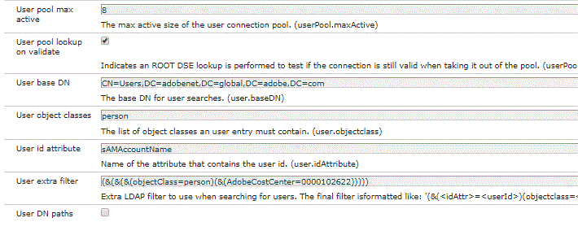

# 將LDAP與AEM Forms工作流一起使用

將AEM Forms工作流任務分配給提交者的管理員。

在工作流中使AEM用Adaptive Form時，您希望將任務動態分配給表單提交者的管理器。 要完成此使用案例，我們必須使用LdapAEM進行配置。

使用LDAP配置AEM所需的步驟在此[詳細說明。](https://helpx.adobe.com/experience-manager/6-5/sites/administering/using/ldap-config.html)

為了本文，我附加了用於使用AdobeLdap進行配置的配AEM置檔案。 這些檔案包含在包中，可使用包管理器導入。

在下面的螢幕擷取中，我們會擷取屬於特定成本中心的所有使用者。 如果要獲取LDAP中的所有用戶，則不能使用額外的篩選器。



在下面的螢幕擷取中，我們將群組指派給從LDAP擷取到的使用者AEM。 請注意指派給已匯入使用者的表單使用者群組。 使用者必須是此群組的成員，才能與AEM Forms互動。 我們也將manager屬性儲存在的profile/manager節點下AEM。


在配置LDAP並將用戶導入到中後，AEM我們可以建立一個將任務分配給提交者管理員的工作流。 為此，我們開發了一個簡單的單步驟審批工作流程。

工作流的第一個步驟將初始步驟的值設定為「否」。 最適化表單中的業務規則將禁用「提交者詳細資訊」面板，並根據初始步驟值顯示「批准者」面板。

第二個步驟將任務分配給提交者的管理員。 我們使用自定義代碼獲取提交者的管理員。


```java
public String getParticipant(WorkItem workItem, WorkflowSession wfSession, MetaDataMap arg2) throws WorkflowException{
resourceResolver = wfSession.adaptTo(ResourceResolver.class);
UserManager userManager = resourceResolver.adaptTo(UserManager.class);
Authorizable workflowInitiator = userManager.getAuthorizable(workItem.getWorkflow().getInitiator());
.
.
String managerPorperty = workflowInitiator.getProperty("profile/manager")[0].getString();
.
.

}
```

程式碼片段負責擷取管理員ID並指派工作給管理員。

我們瞭解啟動工作流程的人員。 然後，我們將獲取manager屬性的值。

根據manager屬性在LDAP中的儲存方式，您可能需要執行一些字串操作來獲取管理器ID。

請閱讀本文以實作您自己的[ ParticipantChooser 。](https://helpx.adobe.com/experience-manager/using/dynamic-steps.html)

要在系統上測試此示例(對於Adobe員工，您可以立即使用此示例)

* [下載並部署setvalue組合](/help/forms/assets/common-osgi-bundles/SetValueApp.core-1.0-SNAPSHOT.jar)。這是用於設定管理器屬性的自定義OSGI包。
* [下載並安裝DevelopingWithServiceUserBundle](/help/forms/assets/common-osgi-bundles/DevelopingWithServiceUser.jar)
* [使用套件管理器將與本文相關AEM的資產匯入。本套件包含的LDAP組態檔、工作流程和最適化表單。](assets/aem-forms-ldap.zip)
* 使用AEM適當的LDAP憑據配置LDAP。
* 使用LDAPAEM憑據登錄。
* 開啟[timeoffrequestform](http://localhost:4502/content/dam/formsanddocuments/helpx/timeoffrequestform/jcr:content?wcmmode=disabled)
* 填寫表格並送出。
* 提交者的管理員應該收到表單以供審核。

>[!NOTE]
>
>此用於提取管理器名稱的自定義代碼已通過AdobeLDAP的測試。 如果要針對不同的LDAP執行此代碼，則必須修改或寫入您自己的getParticipant實施以獲取管理員的名稱。
