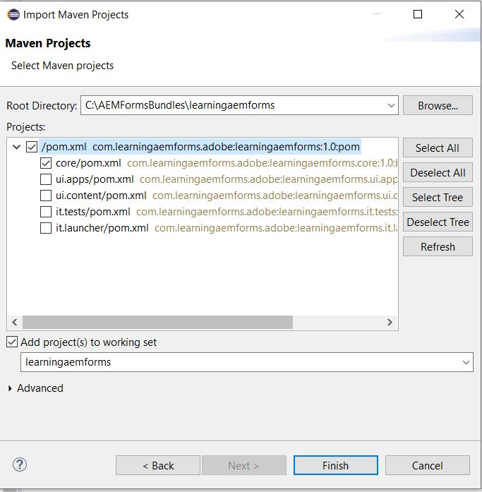

# 建立您的第一個OSGi套件

OSGi套件是Java™封存檔，包含Java程式碼、資源，以及說明套件及其相依性的資訊清單。 套件是應用程式的部署單位。 本文的適用對象為想要使用AEM Forms6.4或6.5來建立OSGi服務或servlet的開發人員。若要建立您的第一個OSGi套件，請遵循下列步驟：


## 安裝JDK

安裝支援的JDK版本。 我已使用JDK1.8。請確定您已在環境變數中添加&#x200B;**JAVA_HOME**，並且指向JDK安裝的根資料夾。
將%JAVA_HOME%/bin添加到路徑


>[!NOTE]
> 請勿使用JDK 15。 它不受支援AEM。

### 測試您的JDK版本

開啟新的命令提示窗口並鍵入：`java -version`。 您應返回由`JAVA_HOME`變數所識別的JDK版本


## 安裝Maven

Maven是主要用於Java專案的建置自動化工具。 請依照下列步驟，在您的本機系統上安裝maven。

* 在C驅動器中建立名為`maven`的資料夾
* 下載[二進位zip封存檔](http://maven.apache.org/download.cgi)
* 將郵遞區號封存的內容解壓縮至`c:\maven`
* 建立名為`M2_HOME`的環境變數，其值為`C:\maven\apache-maven-3.6.0`。 在我的情況下，**mvn**&#x200B;版本為3.6.0。在撰寫本文時，最新的Maven版本為3.6.3
* 將`%M2_HOME%\bin`新增至路徑
* 儲存變更
* 開啟新的命令提示符，然後鍵入`mvn -version`。 您應該會看到&#x200B;**mvn**&#x200B;版本列在下方螢幕擷取中


## Settings.xml

Maven `settings.xml`檔案定義了以各種方式配置Maven執行的值。 最常用的是，它用於定義本地儲存庫位置、備用遠程儲存庫伺服器以及專用儲存庫的驗證資訊。

導覽至`C:\Users\<username>\.m2 folder`
解壓[settings.zip](assets/settings.zip)檔案的內容，並將它放置在`.m2`檔案夾中。

## 安裝Eclipse

安裝最新版[eclipse](https://www.eclipse.org/downloads/)

## 建立您的第一個專案

Archetype是Maven項目的範本工具組。 原型被定義為原始圖案或模型，從中可以製造所有同類物品。 我們嘗試提供一個系統，提供一致的方式來產生Maven專案，因此這個名稱符合我們的要求。 原型將幫助作者為用戶建立Maven項目模板，並為用戶提供生成這些項目模板的參數化版本的方法。
若要建立您的第一個主要專案，請依照下列步驟進行：

* 在C驅動器中建立名為`aemformsbundles`的新資料夾
* 開啟命令提示符並導航到`c:\aemformsbundles`
* 在命令提示符下運行以下命令
* `mvn archetype:generate  -DarchetypeGroupId=com.adobe.granite.archetypes  -DarchetypeArtifactId=aem-project-archetype -DarchetypeVersion=19`

系統會以互動方式產生主要專案，並要求您提供許多屬性的值，例如

| 屬性名稱 | 重要性 | 值 |
------------------------|---------------------------------------|---------------------
| groupId | groupId可唯一識別所有專案中的專案 | com.learningaemforms.adobe |
| appsFolderName | 保存項目結構的資料夾的名稱 | 學習Aemforms |
| artifactId | artifactId是不含版本的jar的名稱。 如果您已建立它，則可以選擇任何您想要的名稱，並使用小寫字母，而不使用奇怪的符號。 | 學習Aemforms |
| 版本 | 如果您分發，則可以選擇任何具有數字和點(1.0、1.1、1.0.1、...)的典型版本。 | 1.0 |

通過按一下Enter鍵，接受其他屬性的預設值。
如果一切順利，您應會在命令視窗中看到建置成功訊息

## 從您的主要專案建立Eclipse專案

將工作目錄更改為`learningaemforms`。
從命令行執行`mvn eclipse:eclipse`
上述命令讀取pom檔案，並使用正確的元資料建立Eclipse項目，以便Eclipse瞭解項目類型、關係、類路徑等。

## 將專案匯入Eclipse

啟動&#x200B;**Eclipse**

轉到&#x200B;**檔案->導入**&#x200B;並選擇&#x200B;**現有的Maven項目**，如此處所示


按「下一步」

按一下&#x200B;**瀏覽**&#x200B;按鈕選擇`c:\aemformsbundles\learningaemform`



>[!NOTE]
>您可以根據需要選擇導入相應的模組。 如果您只想在專案中建立Java程式碼，請僅選取並匯入核心模組。

按一下&#x200B;**完成**&#x200B;以啟動導入過程

專案已匯入至Eclipse，您會看到許多`learningaemforms.xxxx`資料夾

展開`learningaemforms.core`資料夾下的`src/main/java`。 這是您將在其中寫入大部分代碼的資料夾。


## 建立專案

一旦您編寫了OSGi服務或servlet，您就需要建立專案，以產生可使用Felix網頁主控台部署的OSGi套件。 請參閱[AEMFD用戶端SDK](https://repo.adobe.com/nexus/content/repositories/public/com/adobe/aemfd/aemfd-client-sdk/)，在您的Maven專案中加入適當的用戶端SDK。 您必須將AEMFD用戶端SDK加入核心專案`pom.xml`的相依性區段中，如下所示。

```xml
<dependency>
    <groupId>com.adobe.aemfd</groupId>
    <artifactId>aemfd-client-sdk</artifactId>
    <version>6.0.122</version>
</dependency>
```

若要建立專案，請遵循下列步驟：

* 開啟&#x200B;**命令提示符窗口**
* 導航到 `c:\aemformsbundles\learningaemforms\core`
* 執行命令`mvn clean install`
如果一切順利，您應在下列位置`C:\AEMFormsBundles\learningaemforms\core\target`中看到包。 此套件現已可使用Felix網頁主控台AEM部署至。
