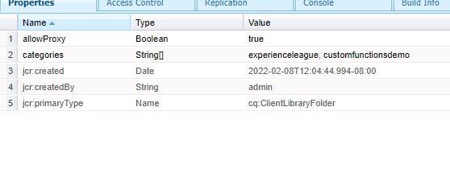

# 自訂函式

AEM Forms 6.5匯入定義JavaScript函式的功能，以在使用規則編輯器定義複雜商業規則時使用這些函式。
AEM Forms提供許多立即可用的自訂函式，但您需要定義自己的自訂函式，並在多個表單中使用這些函式。

若要定義您的第一個自訂函式，請遵循下列步驟：
* [登入crx](http://localhost:4502/crx/de/index.jsp#/apps/experience-league/clientlibs)
* 在應用程式下建立名為experience-league的新資料夾（此資料夾名稱可以是您選擇的名稱）
* 儲存您的變更。
* 在experience-league資料夾底下建立名為clientlibs的cq：ClientLibraryFolder型別的新節點。
* 選取新建立的clientlibs資料夾，然後新增allowProxy和類別屬性（如熒幕擷取畫面中所示），並儲存變更。


* 建立名為的資料夾 **js** 在 **clientlibs** 資料夾
* 建立名為的檔案 **函式.js** 在 **js** 資料夾
* 建立名為的檔案 **js.txt** 在 **clientlibs** 資料夾。 儲存您的變更。
* 您的資料夾結構看起來應該像下面的熒幕擷取畫面。


* 按兩下functions.js以開啟編輯器。
將下列程式碼複製到functions.js中並儲存變更。

```javascript
/**
* Get List of County names
* @name getCountyNamesList Get list of county names
* @return {OPTIONS} drop down options 
 */
function getCountyNamesList()
{
    var countyNames= [];
    countyNames[0] = "Santa Clara";
    countyNames[1] = "Alameda";
    countyNames[2] = "Buxor";
    countyNames[3] = "Contra Costa";
    countyNames[4] = "Merced";

    return countyNames;

}
/**
* Covert UTC to Local Time
* @name convertUTC Convert UTC Time to Local Time
* @param {string} strUTCString in Stringformat
* @return {string}
*/
function convertUTC(strUTCString)
{
    var dt = new Date(strUTCString);
    console.log(dt.toLocaleString());
    return dt.toLocaleString();
}
```

請 [請參閱jsdoc](https://jsdoc.app/index.html)以取得有關為javascript函式加上註解的詳細資訊。
上述程式碼有兩個功能：
**getCountyNamesList**  — 傳回字串陣列
**convertUTC**  — 將UTC時間戳記轉換為當地時區

開啟js.txt並貼上下列程式碼並儲存變更。

```javascript
#base=js
functions.js
```

#base=js行指定JavaScript檔案所在的目錄。
以下各行表示JavaScript檔案相對於基底位置的位置。

如果您在建立自訂函式時遇到問題，請隨時 [下載並安裝此套件](assets/custom-functions.zip) 在您的AEM執行個體中。

## 使用自訂函式

以下影片會逐步帶您瞭解在適用性表單的規則編輯器中使用自訂函式的相關步驟
>[!VIDEO](https://video.tv.adobe.com/v/340305?quality=12&learn=on)
