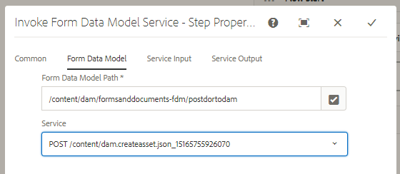

# 使用表單資料模型張貼二進位資料{#using-form-data-model-to-post-binary-data}

從AEM Forms 6.4開始，我們現在可以在AEM Workflow中呼叫表單資料模型服務。 本文將引導您檢視使用表單資料模型服務張貼記錄檔案的範例使用案例。

使用案例如下：

1. 使用者填寫並提交最適化表單。
1. 自適應表單被配置為生成記錄文檔。
1. 在提交此可調式表單時，會觸發AEM工作流程，此工作流程將使用叫用表單資料模型服務，將記錄檔案發佈至AEM DAM。

表單資料模型頁籤——屬性

在「服務輸入」(Service Input)頁籤中，我們映射以下

* 檔案（需要儲存的二進位物件）與裝載相關的DOR.pdf屬性。 這意味著，當提交最適化表單時，產生的記錄檔案會儲存在與工作流程裝載相關的名為DOR.pdf的檔案中。**請確定此DOR.pdf與您設定Adaptive Form&#39;s submission屬性時提供的相同。**

* fileName —這是二進位對象儲存在DAM中的名稱。 因此，您希望動態產生此屬性，以便每個fileName在每次提交時都是唯一的。 為此，我們使用工作流程中的處理步驟來建立名為filename的中繼資料屬性，並將其值設定為提交表單之人員的「會員名稱」和「帳戶編號」的組合。 例如，如果該人員的成員名稱為John Jacobs，而其帳號為9846，則檔案名稱為John Jacobs_9846.pdf

服務輸入

>[!NOTE]
>
>故障排除提示——如果由於某些原因未在DAM中建立DOR.pdf，請按一下[此處](http://localhost:4502/mnt/overlay/fd/fdm/gui/components/admin/fdmcloudservice/properties.html?item=%2Fconf%2Fglobal%2Fsettings%2Fcloudconfigs%2Ffdm%2Fpostdortodam)重置資料源驗證設定。 這些是AEM驗證設定，預設為admin/admin。

若要在您的伺服器上測試此功能，請遵循下列步驟：

1.[部署Developingwithserviceuser bundle](/help/forms/assets/common-osgi-bundles/DevelopingWithServiceUser.jar)

1. [下載並部署setvalue bundle](/help/forms/assets/common-osgi-bundles/SetValueApp.core-1.0-SNAPSHOT.jar)。此自訂OSGI bundle用來建立中繼資料屬性，並從提交的表單資料設定其值。

1. [使用套](assets/postdortodam.zip) 件管理員將與本文相關的資產匯入AEM。您將取得下列

   1. 工作流程模型
   1. 已設定為送出至AEM工作流程的最適化表單
   1. 資料來源已設定為使用PostToDam.JSON檔案
   1. 使用資料來源的表單資料模型

1. 指向您的[瀏覽器以開啟最適化表單](http://localhost:4502/content/dam/formsanddocuments/helpx/timeoffrequestform/jcr:content?wcmmode=disabled)
1. 填寫表格並送出。
1. 如果已建立並儲存記錄檔案，請勾選「資產」應用程式。

[建立資](http://localhost:4502/conf/global/settings/cloudconfigs/fdm/postdortodam/jcr:content/swaggerFile) 料來源時使用的Swagger檔案可供您參考
