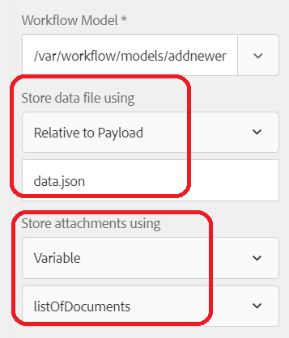

# 在資料庫中插入表單附件

本文將逐步說明在MySQL資料庫中儲存表單附件的使用案例。

客戶通常會要求將擷取的表單資料與表單附件儲存在資料庫表格中。
要完成此使用案例，請執行以下步驟

## 建立資料庫表格以儲存表單資料與附件

已建立名為newhire的表格來儲存表單資料。 請注意&#x200B;**LONGBLOB**型別的資料行名稱圖片，以儲存表單附件


## 建立表單資料模型

已建立表單資料模型以與MySQL資料庫通訊。 您將需要建立下列專案

* [AEM中的JDBC資料來源](./data-integration-technical-video-setup.md)
* 以JDBC資料來源為基礎的[表單資料模型](./jdbc-data-model-technical-video-use.md)

## 建立工作流程

將最適化表單設定為提交至AEM工作流程，您可以選擇將表單附件儲存在工作流程變數中，或將附件儲存在有效負載下的指定資料夾中。 對於此使用案例，我們需要將附件儲存在ArrayList of Document型別的工作流程變數中。 我們需要從這個ArrayList擷取第一個專案，並初始化檔案變數。 已建立名為&#x200B;**listOfDocuments**&#x200B;和&#x200B;**employeePhoto**的工作流程變數。
提交最適化表單以觸發工作流程時，工作流程中的步驟將使用ECMA指令碼初始化employeePhoto變數。 以下是ECMA指令碼

```javascript
log.info("executing script now...");
var metaDataMap = graniteWorkItem.getWorkflow().getWorkflowData().getMetaDataMap();
var listOfAttachments = [];
// Make sure you have a workflow variable caled listOfDocuments defined
listOfAttachments = metaDataMap.get("listOfDocuments");
log.info("$$$  got listOfAttachments");
//Make sure you have a workflow variable caled employeePhoto defined
var employeePhoto = listOfAttachments[0];
metaDataMap.put("employeePhoto", employeePhoto);
log.info("Employee Photo updated");
```

工作流程的下一步是使用叫用表單資料模型服務元件，將資料和表單附件插入表格中。

[您可以從這裡](assets/add-new-employee.zip)下載包含範例ecma指令碼的完整工作流程。

>[!NOTE]
> 您必須建立新的以JDBC為基礎的表單資料模型，並在工作流程中使用該表單資料模型

## 建立最適化表單

根據上一步建立的表單資料模型建立最適化表單。 將表單資料模型元素拖放到表單上。 設定表單提交以觸發工作流程，並指定下列屬性，如下方熒幕擷取畫面所示

