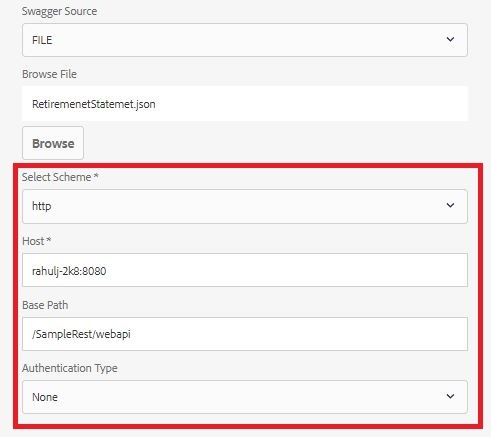

# 修改資料Source組態設定的功能{#ability-to-modify-data-source-configuration-settings}

直到AEM Forms 6.4版本，一旦設定資料來源，您就無法變更RESTful服務的配置、主機、基本路徑。 如果您想要針對不同環境測試資料來源，這會造成問題。

隨著AEM Forms 6.5的發行，您現在可以輕鬆變更上述屬性。 有了這項新功能，您現在可以根據開發環境建立表單資料模型，並在對結果滿意後，變更屬性以指向不同的環境。

以下熒幕擷取畫面顯示AEM Forms 6.4和Forms 6.5中的資料來源組態設定

AEM 6.4 **中的**&#x200B;資料Source設定

**AEM 6.5及更高版本中的可編輯資料Source設定**

