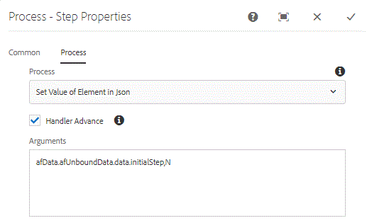

# 在AEM Forms工作流程中設定JSON資料元素的值 {#setting-value-of-json-data-element-in-aem-forms-workflow}

由於最適化表單在AEM Workflow中路由給不同的使用者，因此需要根據檢閱表單的人來隱藏或停用某些欄位或面板。 為了滿足這些使用案例，我們通常會設定隱藏欄位的值。 您可以根據此隱藏欄位的值來編寫商業規則，以隱藏/停用適當的面板或欄位。

在AEM Forms OSGi — 我們必須建立自訂OSGi套件組合以設定JSON資料元素的值。 此套件組合已隨本教學課程提供。

我們使用AEM工作流程中的「程式步驟」。 我們會將「在Json中設定元素值」的OSGi套件組合與此程式步驟建立關聯。

我們需要傳遞兩個引數至設定值組合。 第一個引數是需要設定其值的元素的路徑。 第二個引數是需要設定的值。

例如，在上述熒幕擷圖中，我們將initialStep元素的值設為「N」

afData.afUnboundData.data.initialStep,N

在我們的範例中，我們有一個簡單的休假請求表單。 此表單的發起人填寫其姓名和休假日期。 提交時，此表單會前往「經理」進行稽核。 當管理員開啟表單時，第一個面板上的欄位會停用。 這是因為我們已將JSON資料中初始步驟元素的值設定為N。

根據初始步驟欄位值，我們顯示「核准者」面板，「經理」可以核准或拒絕請求。

請檢視針對「初始步驟」設定的規則。 我們會根據initialStep欄位的值，使用表單資料模型擷取使用者詳細資訊，並填入適當的欄位和隱藏/停用適當的面板。

若要在本機系統上部署資產：

* [下載並部署DevelopingWidthServiceUserBundle](/help/forms/assets/common-osgi-bundles/DevelopingWithServiceUser.jar)

* [下載和部署setvalue套件組合](/help/forms/assets/common-osgi-bundles/SetValueApp.core-1.0-SNAPSHOT.jar). 這是自訂OSGI套件組合，可讓您在提交的json資料中設定元素值。

* [下載並解壓縮zip檔案的內容](assets/set-value-jsondata.zip)
   * 將瀏覽器指向 [封裝管理員](http://localhost:4502/crx/packmgr/index.jsp)
      * 匯入並安裝SetValueOfElementInJSONDataWorkflow.zip。此套件包含與表單相關聯的範例工作流程模型和表單資料模型。

* 將瀏覽器指向 [Forms和檔案](http://localhost:4502/aem/forms.html/content/dam/formsanddocuments)
* 按一下建立 |檔案上傳
* 上傳TimeOffRequestForm.zip檔案
   **此表單是使用AEM Forms 6.4建立的。請確定您使用的是AEM Forms 6.4或更高版本**
* 開啟 [表單](http://localhost:4502/content/dam/formsanddocuments/timeoffrequest/jcr:content?wcmmode=disabled)
* 填寫「開始日期」和「結束日期」並提交表單。
* 前往 [&quot;收件匣&quot;](http://localhost:4502/aem/inbox)
* 開啟與任務相關聯的表單。
* 請注意，第一個面板中的欄位已停用。
* 請注意，核准或拒絕請求的面板現在可見。

>[!NOTE]
>
>由於我們使用使用者設定檔預先填入最適化表單，請向管理員確認 [使用者設定檔資訊 ](http://localhost:4502/security/users.html). 至少要確定您已設定FirstName、LastName和Email欄位值。
>您可以啟用com.aemforms.setvalue.core.SetValueInJson的記錄器來啟用偵錯記錄 [從這裡](http://localhost:4502/system/console/slinglog)

>[!NOTE]
>
>在JSON資料中設定資料元素值的OSGi套件組合目前支援一次設定一個元素值的功能。 如果要設定多個元素值，則需要多次使用處理步驟。
>
>請確定最適化表單提交選項中的資料檔案路徑已設為「Data.xml」。 這是因為程式步驟中的程式碼會在裝載資料夾下尋找名為Data.xml的檔案。
