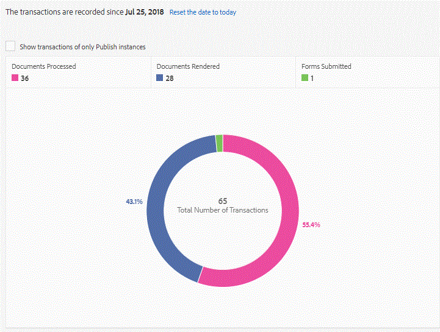

# 在AEM Forms中使用交易報表{#using-transaction-reporting-in-aem-forms}

AEM Forms 6.4.1已推出交易報告功能，以擷取表單提交次數、使用檔案服務轉換檔案，以及互動式通訊（網路和印刷通道）。這項功能主要適用於想要根據提交表單和／或所提供檔案數量來授權軟體的客戶。 此功能目前僅適用於AEM Forms OSGI堆疊。

## 啟用事務報告 {#enabling-transaction-reporting}

預設情況下會禁用事務記錄。 若要啟用交易記錄，請遵循下列步驟：

* [開啟configMgr](http://localhost:4502/system/console/configMgr)
* 搜尋「表單交易報表」
* 選中「記錄事務」複選框
* 儲存變更

在啟用交易報表後，您就可以提交Adaptive Forms、使用檔案服務產生檔案，或轉譯Interactive Communication檔案，以檢視交易報表的實際運作。

## 查看事務處理報表 {#viewing-transaction-report}

若要檢視交易報表，請以管理員身分登入AEM Forms。 只有fd-Administrator組的成員才能查看事務報告。

選擇工具 |表格 |檢視交易報表

或按一下此處檢視交易報 [表](http://localhost:4502/mnt/overlay/fd/transaction/gui/content/report.html)

在上述的「檔案處理」螢幕擷取中，是使用檔案服務產生的檔案數。 轉譯的檔案是轉譯的互動式通訊檔案（網頁和列印）數目。 提交的表單是最適化表單提交的數量。

事務在指定期間（刷新緩衝時間+反向複製時間）內保留在緩衝區中。 依預設，交易計數大約需要90秒才能反映在交易報表中。

提交PDF表單、使用代理UI預覽互動式通訊或使用非標準表單提交方法等動作不會視為交易。 AEM Forms提供API來記錄此類交易。 從您的自訂實作呼叫API以記錄交易。

如果您正在查看作者實例的事務報告，請確保在所有發佈實例上配置了反向複製。

若要進一步瞭解交易報表，請 [按一下這裡](https://helpx.adobe.com/experience-manager/6-4/forms/using/transaction-reports-overview.html)

