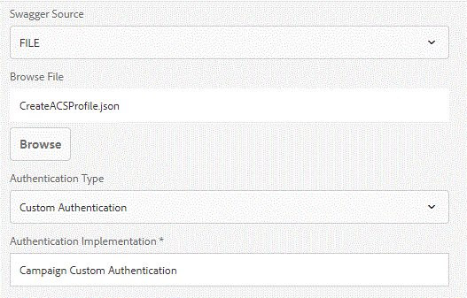

# 使用表單資料模型建立市場活動配置檔案 {#create-campaign-profile-using-form-data-model}

使用Adobe Campaign Standard表單資料模型建立AEM Forms配置檔案涉及的步驟

## 建立自定義身份驗證 {#create-custom-authentication}

使用swagger檔案建立資料源時，AEM Forms支援以下類型的身份驗證

* 無
* OAuth 2.0
* 基本驗證
* API 金鑰
* 自訂驗證



我們必須使用自定義身份驗證向Adobe Campaign Standard進行REST呼叫。

要使用自定義身份驗證，我們必須開發一個OSGi元件來實現IAuthentication介面

需要實現方法getAuthDetails。 此方法將返回AuthenticationDetails對象。 此AuthenticationDetails對象將具有對Adobe Campaign進行REST API調用所需的HTTP標頭集。

以下是用於建立自定義身份驗證的代碼。 方法getAuthDetails完成所有工作。 我們建立AuthenticationDetails對象。 然後，我們將相應的HttpHeaders添加到此對象並返回此對象。

```java
package aemfd.campaign.core;

import java.io.IOException;
import java.security.NoSuchAlgorithmException;
import java.security.spec.InvalidKeySpecException;

import org.osgi.service.component.annotations.Component;
import org.osgi.service.component.annotations.Reference;
import org.slf4j.Logger;
import org.slf4j.LoggerFactory;

import com.adobe.aemfd.dermis.authentication.api.IAuthentication;
import com.adobe.aemfd.dermis.authentication.exception.AuthenticationException;
import com.adobe.aemfd.dermis.authentication.model.AuthenticationDetails;
import com.adobe.aemfd.dermis.authentication.model.Configuration;

import aemforms.campaign.core.CampaignService;
import formsandcampaign.demo.CampaignConfigurationService;
@Component(service=IAuthentication.class,immediate=true)

public class CampaignAuthentication implements IAuthentication {
 @Reference
 CampaignService campaignService;
  @Reference
     CampaignConfigurationService config;
private Logger log = LoggerFactory.getLogger(CampaignAuthentication.class);
 @Override
 public AuthenticationDetails getAuthDetails(Configuration arg0) throws AuthenticationException {
 try {
   AuthenticationDetails auth = new AuthenticationDetails();
   auth.addHttpHeader("Cache-Control", "no-cache");
   auth.addHttpHeader("Content-Type", "application/json");
   auth.addHttpHeader("X-Api-Key",config.getApiKey() );
         auth.addHttpHeader("Authorization", "Bearer "+campaignService.getAccessToken());
         log.debug("Returning auth");
         return auth;
   
  } catch (NoSuchAlgorithmException e) {
   // TODO Auto-generated catch block
   e.printStackTrace();
  } catch (InvalidKeySpecException e) {
   // TODO Auto-generated catch block
   e.printStackTrace();
  } catch (IOException e) {
   // TODO Auto-generated catch block
   e.printStackTrace();
  }
  return null;
  
 }

 @Override
 public String getAuthenticationType() {
  // TODO Auto-generated method stub
  return "Campaign Custom Authentication";
 }

}
```

## 建立資料源 {#create-data-source}

第一步是建立swagger檔案。 swagger檔案定義將用於在Adobe Campaign Standard建立配置檔案的REST API。 交換器檔案定義REST API的輸入參數和輸出參數。

使用swagger檔案建立資料源。 建立資料源時，可以指定驗證類型。 在這種情況下，我們將使用自定義身份驗證來對Adobe Campaign進行身份驗證。上面列出的代碼用於對Adobe Campaign進行身份驗證。

示例swagger檔案將作為與本文相關的資產的一部分提供給您。**確保更改swagger檔案中的主機和basePath以匹配ACS實例**

## Test解決方案 {#test-the-solution}

要test解決方案，請執行以下步驟：
* [確保您已按照此處所述的步驟操作](aem-forms-with-campaign-standard-getting-started-tutorial.md)
* [下載並解壓縮此檔案以獲取swagger檔案](assets/create-acs-profile-swagger-file.zip)
* 使用交換器檔案建立資料源建立表單資料模型並基於在上一步中建立的資料源
* 基於在前一步中建立的表單資料模型建立自適應表單。
* 將以下元素從資料源頁籤拖放到自適應表單

   * 電子郵件
   * 名字
   * 姓氏
   * 手機

* 將提交操作配置為「使用表單資料模型提交」。
* 將資料模型配置為適當提交。
* 預覽窗體。 填寫欄位並提交。
* 驗證配置檔案是否在Adobe Campaign Standard建立。
