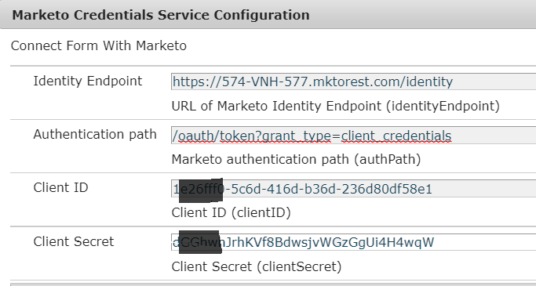

# Marketo Authentication Service

Marketo的REST API是使用2條腿的OAuth 2.0驗證。我們需要建立自訂驗證，以針對Marketo進行驗證。 此自訂驗證通常會寫入OSGI套件組合中。 下列程式碼顯示本教學課程中使用的自訂驗證器。

## 自訂驗證服務

下列程式碼會建立AuthenticationDetails物件，其具有針對Marketo進行驗證所需的access_token

```java
package com.marketoandforms.core;
import org.osgi.service.component.annotations.Component;
import org.osgi.service.component.annotations.Reference;
 
import com.adobe.aemfd.dermis.authentication.api.IAuthentication;
import com.adobe.aemfd.dermis.authentication.exception.AuthenticationException;
import com.adobe.aemfd.dermis.authentication.model.AuthenticationDetails;
import com.adobe.aemfd.dermis.authentication.model.Configuration;
@Component(service={IAuthentication.class}, immediate=true)
public class MarketoAuthenticationService implements IAuthentication {
@Reference
MarketoService marketoService;
    @Override
    public AuthenticationDetails getAuthDetails(Configuration arg0) throws AuthenticationException
    {
        AuthenticationDetails auth = new AuthenticationDetails();
        auth.addHttpHeader("Cache-Control", "no-cache");
        auth.addHttpHeader("Authorization", "Bearer " + marketoService.getAccessToken());
        return auth
    }
 
    @Override
    public String getAuthenticationType() {
        // TODO Auto-generated method stub
        return "AemForms With Marketo";
    }
}
```

MarketoAuthenticationService會實作IAuthentication介面。 此介面是AEM Forms用戶端SDK的一部分。 服務會取得存取權杖，並將權杖插入AuthenticationDetails的HttpHeader中。 填入AuthenticationDetails對象的HttpHeaders後，AuthenticationDetails對象將返回到表單資料模型的真實層。

請注意getAuthenticationType方法傳回的字串。 在配置資料源時將使用此字串。

### 取得存取權杖

簡單介面是使用一個傳回access_token的方法來定義。 實施此介面的類的代碼將在頁面的下半部列出。

```java
package com.marketoandforms.core;
public interface MarketoService {
    String getAccessToken();
}
```

下列程式碼為服務的，會傳回用於進行REST API呼叫的access_token。 此服務中的程式碼會存取進行GET呼叫所需的設定參數。 如您所見，我們會在GETURL中傳遞client_id、client_secret以產生access_token。 然後，此access_token會傳回至呼叫應用程式。

```java
package com.marketoandforms.core.impl;
import java.io.IOException;
import org.apache.http.HttpEntity;
import org.apache.http.HttpResponse;
import org.apache.http.ParseException;
import org.apache.http.client.ClientProtocolException;
import org.apache.http.client.HttpClient;
import org.apache.http.client.methods.HttpGet;
import org.apache.http.impl.client.HttpClientBuilder;
import org.apache.http.util.EntityUtils;
import org.json.JSONException;
import org.osgi.service.component.annotations.Component;
import org.osgi.service.component.annotations.Reference;
import org.slf4j.Logger;
import org.slf4j.LoggerFactory;
import com.marketoandforms.core.*; 
@Component(service=MarketoService.class,immediate = true)
public class MarketoServiceImpl implements MarketoService {
    private final Logger log = LoggerFactory.getLogger(getClass());
@Reference
MarketoConfigurationService config;
    @Override
    public String getAccessToken()
    {
        String AUTH_URL = config.getAUTH_URL();
        String CLIENT_ID = config.getCLIENT_ID();
        String CLIENT_SECRET = config.getCLIENT_SECRET();
        String AUTH_PATH = config.getAUTH_PATH();
        HttpClient httpClient = HttpClientBuilder.create().build();
        String getURL = AUTH_URL+AUTH_PATH+"&client_id="+CLIENT_ID+"&client_secret="+CLIENT_SECRET;
        log.debug("The url to get the access token is "+getURL);
        HttpGet httpGet = new HttpGet(getURL);
        httpGet.addHeader("Cache-Control","no-cache");
        try {
            HttpResponse httpResponse = httpClient.execute(httpGet);
            HttpEntity httpEntity = httpResponse.getEntity();
            org.json.JSONObject responseJSON = new org.json.JSONObject(EntityUtils.toString(httpEntity))
            return (String)responseJSON.get("access_token");
        } catch (ClientProtocolException e) {
            // TODO Auto-generated catch block
            e.printStackTrace();
        } catch (IOException e) {
            // TODO Auto-generated catch block
            e.printStackTrace();
        } catch (ParseException e) {
            // TODO Auto-generated catch block
            e.printStackTrace();
        } catch (JSONException e) {
            // TODO Auto-generated catch block
            e.printStackTrace();
        }
        return null;
    }
}
```

下方的螢幕擷取畫面顯示需要設定的設定屬性。 這些設定屬性會讀取於上述程式碼中，以取得access_token



### 設定

下列程式碼用於建立設定屬性。 這些屬性是您的Marketo例項專屬的

```java
package com.marketoandforms.core;
 
import org.osgi.service.metatype.annotations.AttributeDefinition;
import org.osgi.service.metatype.annotations.ObjectClassDefinition;
 
@ObjectClassDefinition(name="Marketo Credentials Service Configuration", description = "Connect Form With Marketo")
public @interface MarketoConfiguration {
     @AttributeDefinition(name="Identity Endpoint", description="URL of Marketo Identity Endpoint")
     String identityEndpoint() default "";
      @AttributeDefinition(name="Authentication path", description="Marketo authentication path")
      String authPath() default "";
      @AttributeDefinition(name="Client ID", description="Client ID")
      String clientID() default "";
      @AttributeDefinition(name="Client Secret", description="Client Secret")
      String clientSecret() default "";
}
```

以下代碼讀取配置屬性並通過getter方法返回相同的屬性

```java
package com.marketoandforms.core;
 
import org.osgi.service.component.annotations.Activate;
import org.osgi.service.component.annotations.Component;
import org.osgi.service.metatype.annotations.Designate;
import org.slf4j.Logger;
import org.slf4j.LoggerFactory;
@Component(immediate=true, service={MarketoConfigurationService.class})
@Designate(ocd=MarketoConfiguration.class)
public class MarketoConfigurationService {
    private final Logger log = LoggerFactory.getLogger(getClass());
    private MarketoConfiguration config;
    private String AUTH_URL;
    private String  AUTH_PATH;
    private String CLIENT_ID ;
    private String CLIENT_SECRET;
     @Activate
      protected final void activate(MarketoConfiguration config) {
        System.out.println("####In my marketo activating auth service");
        AUTH_URL = config.identityEndpoint();
        AUTH_PATH = config.authPath();
        CLIENT_ID = config.clientID();
        CLIENT_SECRET = config.clientSecret();
        log.info("clientID:" + CLIENT_ID);
        System.out.println("The client id is "+CLIENT_ID+"AUTH PATH"+AUTH_PATH);
      }
    public String getAUTH_URL() {
        return AUTH_URL;
    }
   public String getAUTH_PATH() {
        return AUTH_PATH;
    }
    public String getCLIENT_ID() {
        return CLIENT_ID;
    }

    public String getCLIENT_SECRET() {
        return CLIENT_SECRET;
    }
}
```

1. 建置套件並部署至您的AEM伺服器。
1. [將瀏覽器指向](http://localhost:4502/system/console/configMgr) configMgrand搜尋「Marketo憑證服務設定」
1. 指定您Marketo例項專屬的適當屬性
