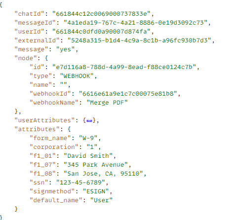

# 剖析ChatBot資料

A [chatbotwebhook](https://www.chatbot.com/help/webhooks/what-are-webhooks/) 用於將ChatBot資料傳送至AEM servlet。
ChatBot中擷取的資料採用JSON格式，使用者在屬性物件中輸入了資料，如下所示


若要將資料與XDP範本合併，我們需要建立以下XML。 請注意xml的根元素，這必須與XDP範本的根元素相符，資料才能成功合併。


```xml
<topmostSubForm>
    <f1_01>David Smith</f1_01>
    <signmethod>ESIGN</signmethod>
    <corporation>1</corporation>
    <f1_08>San Jose, CA, 95110</f1_08>
    <f1_07>345 Park Avenue</f1_07>
    <ssn>123-45-6789</ssn>
    <form_name>W-9</form_name>
</topmostSubForm>
```


## 後續步驟

[將資料與XDP範本合併](./merge-data-with-template.md)
