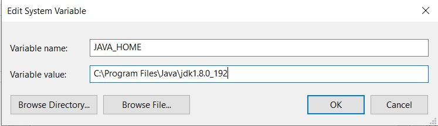

# 建立您的第一個OSGi套件組合

OSGi套件是Java™封存檔案，包含Java程式碼、資源，以及說明套件及其相依性的資訊清單。 套件是應用程式的部署單位。 本文適用於想使用AEM Forms 6.4或6.5建立OSGi服務或servlet的開發人員。若要建立您的第一個OSGi套件組合，請遵循下列步驟：


## 安裝JDK

安裝支援的JDK版本。 我已使用JDK1.8。請確定您已新增 **JAVA_HOME** ，並指向JDK安裝的根資料夾。
將%JAVA_HOME%/bin添加到路徑



>[!NOTE]
> 請勿使用JDK 15。 AEM不支援此功能。

### 測試您的JDK版本

開啟新的命令提示窗口，然後鍵入： `java -version`. 您應該會回傳 `JAVA_HOME` 變數


## 安裝Maven

Maven是主要用於Java專案的建置自動化工具。 請按照以下步驟在本地系統上安裝maven。

* 建立名為 `maven` 在C驅動器中
* 下載 [二進位zip封存](https://maven.apache.org/download.cgi)
* 將zip封存的內容解壓縮至 `c:\maven`
* 建立環境變數，稱為 `M2_HOME` 值為 `C:\maven\apache-maven-3.6.0`. 就我而言， **mvn** 版本為3.6.0。撰寫本文時，最新的maven版本為3.6.3
* 新增 `%M2_HOME%\bin` 到
* 儲存您的變更
* 開啟新的命令提示字元並輸入 `mvn -version`. 您應會看到 **mvn** 如下方螢幕擷取所示的版本


## 安裝Eclipse

安裝最新版本的 [eclipe](https://www.eclipse.org/downloads/)

## 建立您的第一個專案

原型是Maven專案範本工具包。 原型被定義為原始模式或模型，從中產生所有同類的事物。 我們正嘗試提供系統，提供一致的方式來產生Maven專案，這個名稱就適合了。 原型可協助作者為使用者建立Maven專案範本，並提供使用者參數化版本專案範本的方法。
若要建立您的第一個Maven專案，請依照下列步驟操作：

* 建立名為 `aemformsbundles` 在C驅動器中
* 開啟命令提示字元並導覽至 `c:\aemformsbundles`
* 在命令提示符下運行以下命令

```java
mvn -B org.apache.maven.plugins:maven-archetype-plugin:3.2.1:generate -D archetypeGroupId=com.adobe.aem -D archetypeArtifactId=aem-project-archetype -D archetypeVersion=36 -D appTitle="My Site" -D appId="mysite" -D groupId="com.mysite" -D aemVersion=6.5.14
```

成功完成時，您應該會在命令視窗中看到組建成功訊息

## 從Maven專案建立Eclipse專案

* 將工作目錄變更為 `mysite`
* 執行 `mvn eclipse:eclipse` 從命令列。 該命令讀取您的pom檔案，並使用正確的元資料建立Eclipse項目，以便Eclipse了解項目類型、關係、類路徑等。

## 將專案匯入eclipse

Launch **Eclipse**

前往 **檔案 — >導入** 選取 **現有Maven專案** 如下所示


按「下一步」

選取c:\aemformsbundles\mysite by clicking the **瀏覽** 按鈕


>[!NOTE]
>您可以視需要選取匯入適當的模組。 只有在您打算在專案中建立Java程式碼時，才選取並匯入核心模組。

按一下 **完成** 啟動導入過程

專案已匯入Eclipse，而您會看到 `mysite.xxxx` 資料夾

展開 `src/main/java` 在 `mysite.core` 檔案夾。 這是您編寫大部分程式碼的資料夾。


## 包含AEMFD用戶端SDK

您必須將AEMFD用戶端sdk納入您的專案中，以利用AEM Forms隨附的各種服務。 請參閱 [AEMFD用戶端SDK](https://mvnrepository.com/artifact/com.adobe.aemfd/aemfd-client-sdk) 將適當的用戶端SDK納入您的Maven專案。 您必須將AEM FD用戶端SDK包含在 `pom.xml` 核心專案，如下所示。

```xml
<dependency>
    <groupId>com.adobe.aemfd</groupId>
    <artifactId>aemfd-client-sdk</artifactId>
    <version>6.0.122</version>
</dependency>
```

若要建置專案，請依照下列步驟操作：

* 開啟 **命令提示窗口**
* 瀏覽到 `c:\aemformsbundles\mysite\core`
* 執行命令 `mvn clean install -PautoInstallBundle`
上述命令會建置套件並安裝於上執行的AEM伺服器中 `http://localhost:4502`. 此套件也可在以下位置的檔案系統上使用：
   `C:\AEMFormsBundles\mysite\core\target` 可透過 [Felix Web Console](http://localhost:4502/system/console/bundles)
