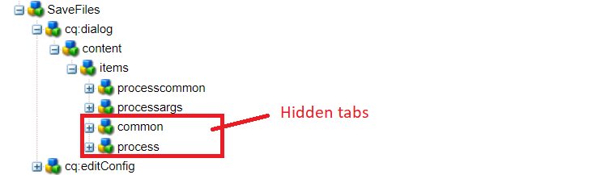

# 自定義工作流元件

本教程適用於需要建立自定義工作流元件的AEM Forms客戶。 工作流元件將配置為執行在上一步中寫入的代碼。 工作流元件能夠為代碼指定進程參數。 本文將探討與代碼相關的工作流元件。

[下載自定義工作流元件](assets/saveFiles.zip)
導入工作流元件 [使用包管理器](http://localhost:4502/crx/packmgr/index.jsp)

自定義工作流元件位於/apps/AEMFormsDemoLits/workflow元件/SaveFiles中

選擇「保存檔案」節點並檢查其屬性

**元件組**  — 此屬性的值確定工作流元件的類別。

**jcr：標題**  — 這是工作流元件的標題。

**sling:resourceSuperType** 此屬性的值將確定此元件的繼承。 在這種情況下，我們將從流程元件繼承

## cq：對話框

對話框用於允許作者與元件交互。 cq：對話框位於「保存檔案」節點下

項目節點下的節點表示元件的頁籤，作者將通過這些頁籤與元件進行交互。 公用和進程頁籤被隱藏。 「常用」(Common)和「參數」(Arguments)頁籤可見。

進程的進程參數位於processargs節點下

作者指定如下螢幕抓圖所示的參數

這些值作為元資料節點的屬性儲存。 例如，值 **c:\formsattachments** 將儲存在元資料節點的saveToLocation屬性中

## cq：編輯配置

cq:EditConfig只是一個主類型cq:EditConfig的節點，元件根下的名稱cq:editConfig。通過在元件節點(cq:Component)下添加cq:EditConfig類型的cq:editConfig節點來配置元件的編輯行為

cq:formParameters（節點類型nt：非結構化）:定義添加到對話框窗體的附加參數。

注意cq:formParameters節點的屬性

屬性PROCESS的值指示將與工作流元件關聯的Java代碼。
