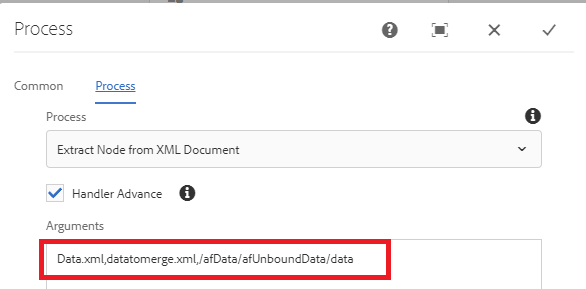

# 從提交的資料xml擷取節點

此自訂流程步驟是從另一個xml檔案中擷取節點，以建立新的xml檔案。 當您想要將提交的資料與xdp範本合併以產生pdf時，需要使用此選項。 例如，當您提交最適化表單時，您需要與xdp範本合併的資料位於資料元素內。 在這種情況下，您需要透過擷取適當的資料元素來建立另一個xml檔案。

以下熒幕擷圖顯示您需要傳遞至自訂流程步驟的引數

以下是引數
* Data.xml — 您要從中擷取節點的xml檔案
* datatomerge.xml — 使用擷取的節點建立的新xml
* /afData/afUnboundData/data — 要擷取的節點

以下熒幕擷圖顯示正在裝載資料夾下建立的datamerge.xml

[自訂套件組合可從這裡下載](/help/forms/assets/common-osgi-bundles/SetValueApp.core-1.0-SNAPSHOT.jar)
