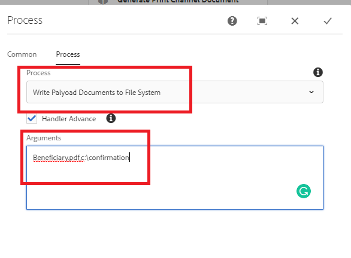

# 將檔案寫入檔案系統

常見的使用案例是將工作流程中產生的檔案寫入檔案系統。
此自訂工作流程程式步驟可讓您輕鬆將工作流程檔案寫入檔案系統。
自訂程式會採用下列逗號分隔引數

```java
ChangeBeneficiary.pdf,c:\confirmation
```

第一個引數是您要儲存至檔案系統的檔名稱。 第二個引數是您要儲存檔案的資料夾位置。 以上述使用案例為例，檔案會寫入 `c:\confirmation\ChangeBeneficiary.pdf`

以下熒幕擷圖顯示您需要傳遞至自訂流程步驟的引數


[自訂套件組合可從這裡下載](/help/forms/assets/common-osgi-bundles/SetValueApp.core-1.0-SNAPSHOT.jar)
