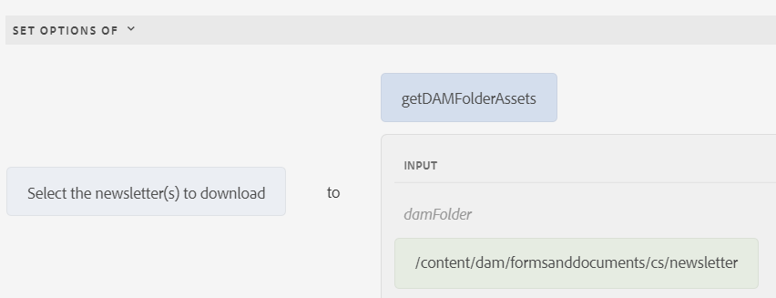

# 將項動態添加到選擇組元件

AEM Forms6.5引入了將項目動態添加到自適應Forms選擇組元件（如CheckBox、單選按鈕和影像清單）的功能。 在本文中，我們將看到在選擇組元件中填充DAM資料夾內容的使用情形。 在螢幕抓圖中，3個檔案位於名為swelter的資料夾中。每次將新新聞簡報添加到資料夾時，選擇組元件都會更新以自動列出其內容。 用戶可以選擇要下載的一個或多個新聞稿。


## 建立Servlet以返回DAM資料夾內容

已編寫以下代碼以JSON格式返回DAM資料夾內容。

```java
package com.newsletters.core.servlets;
import static com.day.cq.commons.jcr.JcrConstants.JCR_CONTENT;
import java.io.IOException;
import java.io.PrintWriter;
import java.util.ArrayList;
import java.util.List;
import javax.servlet.Servlet;
import org.apache.sling.api.SlingHttpServletRequest;
import org.apache.sling.api.SlingHttpServletResponse;
import org.apache.sling.api.resource.Resource;
import org.apache.sling.api.servlets.SlingSafeMethodsServlet;
import org.osgi.service.component.annotations.Component;
import org.slf4j.Logger;
import org.slf4j.LoggerFactory;
import com.google.gson.Gson;
import com.google.gson.JsonObject;

@Component(service = {
  Servlet.class
}, property = {
  "sling.servlet.methods=get",
  "sling.servlet.paths=/bin/listfoldercontents"
})
public class ListFolderContent extends SlingSafeMethodsServlet {
  private static final long serialVersionUID = 1 L;
  private static final Logger log = LoggerFactory.getLogger(ListFolderContent.class);
  protected void doGet(SlingHttpServletRequest request, SlingHttpServletResponse response) {
    Resource resource = request.getResourceResolver().getResource(request.getParameter("damFolder"));
    List < JsonObject > results = new ArrayList < > ();
    resource.getChildren().forEach(child -> {
      if (!JCR_CONTENT.equals(child.getName())) {
        JsonObject asset = new JsonObject();
        log.debug("##The child name is " + child.getName());
        asset.addProperty("assetname", child.getName());
        asset.addProperty("assetpath", child.getPath());
        results.add(asset);

      }
    });
    PrintWriter out = null;
    try {
      out = response.getWriter();
    } catch (IOException e) {

      log.debug(e.getMessage());
    }
    response.setContentType("application/json");
    response.setCharacterEncoding("UTF-8");
    Gson gson = new Gson();
    out.print(gson.toJson(results));
    out.flush();
  }

}
```

## 使用JavaScript函式建立客戶端庫

從JavaScript函式調用Servlet。 該函式返回將用於填充選擇組元件的陣列對象

```javascript
/**
 * Populate drop down/choice group  with assets from specified folder
 * @return {string[]} 
 */
function getDAMFolderAssets(damFolder) {
   // strUrl is whatever URL you need to call
   var strUrl = '/bin/listfoldercontents?damFolder=' + damFolder;
   var documents = [];
   $.ajax({
      url: strUrl,
      success: function(jsonData) {
         for (i = 0; i < jsonData.length; i++) {
            documents.push(jsonData[i].assetpath + "=" + jsonData[i].assetname);
         }
      },
      async: false
   });
   return documents;
}
```

## 建立自適應窗體

建立自適應表單並將表單與客戶端庫關聯 **清單資料夾資產**。 將複選框元件添加到窗體。 使用規則編輯器填充螢幕抓圖中顯示的複選框選項


我們正在調用名為Javascript的函式 **getDAMFolderAssets** 並將DAM資料夾的資產路徑以表格形式列出。

## 後續步驟

[裝配選定資產](./assemble-selected-newsletters.md)
