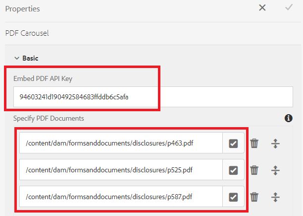

# 在浮動切換中顯示多個pdf檔案

常見的使用案例是向表單填寫工具顯示多個PDF檔案，以便在提交表單前進行稽核。

為了完成此使用案例，我們已運用 [Adobe PDF內嵌API](https://www.adobe.io/apis/documentcloud/dcsdk/pdf-embed.html).

[您可以在這裡體驗此範例的即時示範。](https://forms.enablementadobe.com/content/dam/formsanddocuments/wefinancecreditcard/jcr:content?wcmmode=disabled)

已執行下列步驟以完成整合

## 建立自訂元件以顯示多個PDF檔案

已建立自訂元件(pdf-carousel)以便在pdf檔案中循環

## 用戶端資源庫

已建立使用者端程式庫，以使用Adobe PDF Embed API顯示PDF。 要顯示的PDF會在pdf轉盤元件中指定。

## 建立最適化表單

建立以某些標籤為基礎的調適型表單（此範例有3個標籤）在前兩個標籤中新增一些調適型表單元件在第三個標籤中新增pdf轉盤元件設定pdf轉盤元件，如以下熒幕擷圖所示

**內嵌PDFAPI金鑰**  — 這是可用來內嵌PDF的金鑰。 此金鑰僅適用於localhost。 您可以建立 [您自己的金鑰](https://www.adobe.io/apis/documentcloud/dcsdk/pdf-embed.html) 並將其與其他網域相關聯。

**指定PDF檔案**  — 您可在此指定要在轉盤中顯示的pdf檔案。

## 在您的伺服器上部署範例

若要在本機伺服器上測試此專案，請遵循下列步驟：

1. [匯入使用者端資源庫](assets/pdf-carousel-client-lib.zip) 至您的本機AEM執行個體 [使用封裝管理員](http://localhost:4502/crx/packmgr/index.jsp)
1. [匯入pdf轉盤元件](assets/pdf-carousel-component.zip) 至您的本機AEM執行個體 [使用封裝管理員](http://localhost:4502/crx/packmgr/index.jsp)
1. [匯入最適化表單](assets/adaptive-form-pdf-carousel.zip) 至您的本機AEM執行個體 [使用封裝管理員](http://localhost:4502/crx/packmgr/index.jsp)
1. [匯入範例pdf以顯示](assets/pdf-carousel-sample-documents.zip) 至您的本機AEM執行個體 [使用資產檔案上傳連結](http://localhost:4502/assets.html/content/dam)
1. [預覽最適化表單](http://localhost:4502/content/dam/formsanddocuments/wefinancecreditcard/jcr:content?wcmmode=disabled)
1. 按Tab鍵至「要檢閱的檔案」標籤。 您應該會在轉盤元件中看到三份PDF檔案。
