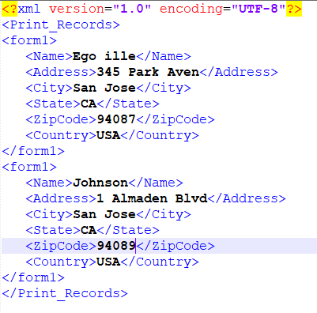

# 從單一xml資料檔案產生一組PDF檔案

OutputService提供多種方法，可使用表單設計建立檔案，並使用資料與表單設計合併。 以下文章說明如何使用包含多個個別記錄的大型xml來產生多個pdf。
以下是包含多個記錄的xml檔案的螢幕擷取畫面。



資料xml有2個記錄。 每個記錄由form1元素表示。 此xml會傳遞至OutputService [generatePDFOutputBatch方法](https://helpx.adobe.com/aem-forms/6/javadocs/com/adobe/fd/output/api/OutputService.html)，我們會取得pdf檔案清單（每份記錄一份）
generatePDFOutputBatch方法的簽名採用下列參數

* 模板——包含模板的映射，由鍵標識
* data —— 包含XML資料檔案的地圖，由索引鍵識別
* pdfOutputOptions —— 設定pdf產生的選項
* batchOptions —— 用於配置批處理的選項

>[!NOTE]
>
>此使用案例在此[website](https://forms.enablementadobe.com/content/samples/samples.html?query=0)上提供即時範例。

## 使用案例詳細資訊{#use-case-details}

在此使用案例中，我們將提供簡單的Web介面來上傳範本和資料(xml)檔案。 在檔案上傳完成並傳送POST要求至Servlet後AEM, 此servlet提取文檔並調用OutputService的generatePDFOutputBatch方法。 產生的PDF會壓縮成zip檔，讓使用者可從網頁瀏覽器下載。

## Servlet代碼{#servlet-code}

以下是servlet中的代碼片段。 代碼從請求中提取模板(xdp)和資料檔案(xml)。 範本檔案會儲存至檔案系統。 建立了兩個映射-templateMap和dataFileMap，分別包含模板和xml(data)檔案。 然後，會呼叫DocumentServices服務的generateMultipleRecords方法。

```java
for (final java.util.Map.Entry < String, org.apache.sling.api.request.RequestParameter[] > pairs: params
.entrySet()) {
final String key = pairs.getKey();
final org.apache.sling.api.request.RequestParameter[] pArr = pairs.getValue();
final org.apache.sling.api.request.RequestParameter param = pArr[0];
try {
if (!param.isFormField()) {

if (param.getFileName().endsWith("xdp")) {
    final InputStream xdpStream = param.getInputStream();
    com.adobe.aemfd.docmanager.Document xdpDocument = new com.adobe.aemfd.docmanager.Document(xdpStream);

    xdpDocument.copyToFile(new File(saveLocation + File.separator + "fromui.xdp"));
    templateMap.put("key1", "file://///" + saveLocation + File.separator + "fromui.xdp");
    System.out.println("####  " + param.getFileName());

}
if (param.getFileName().endsWith("xml")) {
    final InputStream xmlStream = param.getInputStream();
    com.adobe.aemfd.docmanager.Document xmlDocument = new com.adobe.aemfd.docmanager.Document(xmlStream);
    dataFileMap.put("key1", xmlDocument);
}
}

Document zippedDocument = documentServices.generateMultiplePdfs(templateMap, dataFileMap,saveLocation);
.....
.....
....
```

### 介面實施代碼{#Interface-Implementation-Code}

下列程式碼使用OutputService的generatePDFOutputBatch產生多個pdf，並將包含pdf檔案的zip檔案傳回至呼叫servlet

```java
public Document generateMultiplePdfs(HashMap < String, String > templateMap, HashMap < String, Document > dataFileMap, String saveLocation) {
    log.debug("will save generated documents to " + saveLocation);
    com.adobe.fd.output.api.PDFOutputOptions pdfOptions = new com.adobe.fd.output.api.PDFOutputOptions();
    pdfOptions.setAcrobatVersion(com.adobe.fd.output.api.AcrobatVersion.Acrobat_11);
    com.adobe.fd.output.api.BatchOptions batchOptions = new com.adobe.fd.output.api.BatchOptions();
    batchOptions.setGenerateManyFiles(true);
    com.adobe.fd.output.api.BatchResult batchResult = null;
    try {
        batchResult = outputService.generatePDFOutputBatch(templateMap, dataFileMap, pdfOptions, batchOptions);
        FileOutputStream fos = new FileOutputStream(saveLocation + File.separator + "zippedfile.zip");
        ZipOutputStream zipOut = new ZipOutputStream(fos);
        FileInputStream fis = null;

        for (int i = 0; i < batchResult.getGeneratedDocs().size(); i++) {
              com.adobe.aemfd.docmanager.Document dataMergedDoc = batchResult.getGeneratedDocs().get(i);
            log.debug("Got document " + i);
            dataMergedDoc.copyToFile(new File(saveLocation + File.separator + i + ".pdf"));
            log.debug("saved file " + i);
            File fileToZip = new File(saveLocation + File.separator + i + ".pdf");
            fis = new FileInputStream(fileToZip);
            ZipEntry zipEntry = new ZipEntry(fileToZip.getName());
            zipOut.putNextEntry(zipEntry);
            byte[] bytes = new byte[1024];
            int length;
            while ((length = fis.read(bytes)) >= 0) {
                zipOut.write(bytes, 0, length);
            }
            fis.close();
        }
        zipOut.close();
        fos.close();
        Document zippedDocument = new Document(new File(saveLocation + File.separator + "zippedfile.zip"));
        log.debug("Got zipped file from file system");
        return zippedDocument;


    } catch (OutputServiceException | IOException e) {

        e.printStackTrace();
    }
    return null;


}
```

### 部署在您的伺服器上{#Deploy-on-your-server}

若要在您的伺服器上測試此功能，請依照下列指示進行：

* [下載並解壓縮zip檔案內容至您的檔案系統](assets/mult-records-template-and-xml-file.zip)。這個zip檔案包含範本和xml資料檔案。
* [將您的瀏覽器指向Felix網頁主控台](http://localhost:4502/system/console/bundles)
* [部署DevelopingWithServiceUser Bundle](/help/forms/assets/common-osgi-bundles/DevelopingWithServiceUser.jar)。
* [部署自訂AEMFormsDocumentServices Bundle](/help/forms/assets/common-osgi-bundles/AEMFormsDocumentServices.core-1.0-SNAPSHOT.jar).Custom bundle，它使用OutputService API產生pdf
* [將您的瀏覽器指向封裝管理員](http://localhost:4502/crx/packmgr/index.jsp)
* [匯入並安裝套件](assets/generate-multiple-pdf-from-xml.zip)。此套件包含html頁面，可讓您拖放範本和資料檔案。
* [將您的瀏覽器指向MultiRecords.html](http://localhost:4502/content/DocumentServices/Multirecord.html?)
* 將範本和xml資料檔案拖放在一起
* 下載已建立的zip檔案。 此zip檔案包含輸出服務產生的pdf檔案。

>[!NOTE]
>觸發此功能有多種方式。 在此範例中，我們使用Web介面來拖放範本和資料檔案，以展示其功能。

