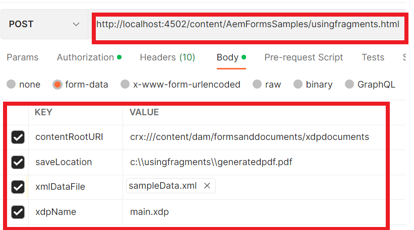

# 使用片段生成PDF文檔{#developing-with-output-and-forms-services-in-aem-forms}


在本文中，我們將使用輸出服務使用xdp片段生成pdf檔案。 主xdp和片段駐留在crx儲存庫中。 在中模擬檔案系統資料夾結構非常重要AEM。 例如，如果在xdp的片段資料夾中使用片段，則必須建立一個名為 **碎片** 下AEM。 基本資料夾將包含基xdp模板。 例如，如果檔案系統上具有以下結構
* c:\xdptemplates - This will contain your base xdp template
* c:\xdptemplates\fragments - This folder will contain fragments and the main template will reference the fragment as shown below
   。
* 資料夾xdpdocuments將包含您的基本模板和 **碎片** 資料夾

可以使用 [窗體和文檔ui](http://localhost:4502/aem/forms.html/content/dam/formsanddocuments)

下面是使用2個片段的示例xdp的資料夾結構


* 輸出服務 — 通常，此服務用於將xml資料與xdp模板或pdf合併，以生成拼合的pdf。 有關詳細資訊，請參閱 [javadox](https://helpx.adobe.com/experience-manager/6-5/forms/javadocs/index.html?com/adobe/fd/output/api/OutputService.html) 的子菜單。 在此示例中，我們使用駐留在crx儲存庫中的片段。


以下代碼用於在PDF檔案中包括片段

```java
System.out.println("I am in using fragments POST.jsp");
// contentRootURI is the base folder. All fragments are relative to this folder
String contentRootURI = request.getParameter("contentRootURI");
String xdpName = request.getParameter("xdpName");
javax.servlet.http.Part xmlDataPart = request.getPart("xmlDataFile");
System.out.println("Got xml file");
String filePath = request.getParameter("saveLocation");
java.io.InputStream xmlIS = xmlDataPart.getInputStream();
com.adobe.aemfd.docmanager.Document xmlDocument = new com.adobe.aemfd.docmanager.Document(xmlIS);
com.adobe.fd.output.api.OutputService outputService = sling.getService(com.adobe.fd.output.api.OutputService.class);

if (outputService == null) {
  System.out.println("The output service is  null.....");
} else {
  System.out.println("The output service is  not null.....");

}
com.adobe.fd.output.api.PDFOutputOptions pdfOptions = new com.adobe.fd.output.api.PDFOutputOptions();
pdfOptions.setAcrobatVersion(com.adobe.fd.output.api.AcrobatVersion.Acrobat_11);

pdfOptions.setContentRoot(contentRootURI);

com.adobe.aemfd.docmanager.Document generatedDocument = outputService.generatePDFOutput(xdpName, xmlDocument, pdfOptions);
generatedDocument.copyToFile(new java.io.File(filePath));
out.println("Document genreated and saved to " + filePath);
```

**test系統上的示例包**

* [將示例xdp檔案下載並導入到AEM](assets/xdp-templates-fragments.zip)
* [使用包管理器下載並安裝AEM包](assets/using-fragments-assets.zip)
* [可以從此處下載示例xdp和片段](assets/xdptemplates.zip)

**安裝軟體包後，必須允許在AdobeGranite CSRF過濾器中列出以下URL。**

1. 請按照下面所述的步驟列出上述路徑。
1. [登錄到configMgr](http://localhost:4502/system/console/configMgr)
1. Adobe花崗岩CSRF濾波器的研究
1. 在排除的節中添加以下路徑並保存
1. /content/AemFormsSamples/usingfragments

test示例代碼有多種方法。 最快捷最簡單的方法是使用Postman應用。 Postman允許您向伺服器發出POST請求。 在系統上安裝Postman應用。
啟動應用並輸入以下URL以test導出資料API

確保從下拉清單http://localhost:4502/content/AemFormsSamples/usingfragments.html中選擇了「POST」，確保將「授權」指定為「基本授權」。 指定服AEM務器用戶名和密碼導航到「正文」頁籤並指定請求參數，如下圖所示

然後按一下「發送」按鈕

[您可以導入此郵遞員集合以testAPI](assets/usingfragments.postman_collection.json)
