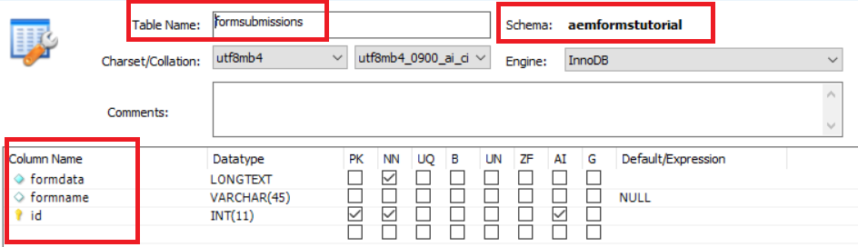

# 簡介

客戶通常會想要將提交的表單資料匯出為CSV格式。 本文將重點說明以CSV格式匯出表單資料所需的步驟。 本文假設表單提交儲存在RDBMS表格中。 以下螢幕截圖詳細說明儲存表單提交所需的最小表格結構。

>[!NOTE]
>
>此範例僅適用於不以結構或表單資料模型為基礎的適用性Forms


如您所見，架構的名稱為aemformstutorial。此架構內是表格式提交，已定義以下列

* 表單資料：此欄包含已提交的表單資料
* formname:此列包含提交的表單的名稱
* id:這是主要金鑰，設為自動遞增

表格名稱和兩欄名稱會以OSGi設定屬性的形式公開，如下方螢幕擷取所示：

程式碼會讀取這些值，並建構適當的SQL查詢以執行。 例如，會根據上述值執行下列查詢

`SELECT formdata FROM aemformstutorial.formsubmissions where formname=timeoffrequestform`

在上述查詢中，表單名稱(timeoffrequestform)會以請求參數的形式傳遞至servlet。

## **建立OSGi服務**

已建立下列OSGI服務，以將提交的資料匯出為CSV格式。

* 第37行：我們正在存取Apache Sling Connection Pooled DataSource。

* 第89行：這是服務的入口點。方法 `getCSVFile(..)` 會以formName作為輸入參數，並擷取與指定表單名稱相關的已提交資料。

>[!NOTE]
>
>此代碼假定您已在Felix Web Console中定義了名為「aemformational」的連接池DataSource。此代碼還假定資料庫中有一個稱為aemformational的架構

```java
package com.aemforms.storeandexport.core;

import java.io.IOException;
import java.io.StringReader;
import java.sql.Connection;
import java.sql.PreparedStatement;
import java.sql.ResultSet;
import java.sql.SQLException;
import java.sql.Statement;
import java.util.ArrayList;
import java.util.List;

import javax.sql.DataSource;
import javax.xml.parsers.DocumentBuilder;
import javax.xml.parsers.DocumentBuilderFactory;
import javax.xml.parsers.ParserConfigurationException;
import javax.xml.xpath.XPath;
import javax.xml.xpath.XPathConstants;
import javax.xml.xpath.XPathExpressionException;
import javax.xml.xpath.XPathFactory;

import org.osgi.service.component.annotations.Component;
import org.osgi.service.component.annotations.Reference;
import org.slf4j.Logger;
import org.slf4j.LoggerFactory;
import org.w3c.dom.Document;
import org.w3c.dom.Node;
import org.w3c.dom.NodeList;
import org.xml.sax.InputSource;
import org.xml.sax.SAXException;

@Component(service = StoreAndExport.class)
public class StoreAndExportImpl implements StoreAndExport {

    private final Logger log = LoggerFactory.getLogger(getClass());
    @Reference
    StoreAndExportConfigurationService config;
    @Reference(target = "(&(objectclass=javax.sql.DataSource)(datasource.name=aemformstutorial))")
    private DataSource dataSource;

    private List<String> getRowValues(String row) {
        List<String> rowValues = new ArrayList<String>();
        //API to obtain DOM Document instance
        DocumentBuilderFactory factory = DocumentBuilderFactory.newInstance();
        DocumentBuilder builder = null;
        try {
            builder = factory.newDocumentBuilder();
            Document doc = builder.parse(new InputSource(new StringReader(row)));
            XPathFactory xpf = XPathFactory.newInstance();
            XPath xpath = xpf.newXPath();
            Node dataNode = (Node) xpath.evaluate("//afData/afUnboundData/data", doc, XPathConstants.NODE);
            NodeList dataElements = dataNode.getChildNodes();
            for (int i = 0; i < dataElements.getLength(); i++) {
                log.debug("The name of the node is" + dataElements.item(i).getNodeName() + " the node value is " + dataElements.item(i).getTextContent());
                rowValues.add(i, dataElements.item(i).getTextContent());
            }
            return rowValues;
        } catch (Exception e) {
            log.debug(e.getMessage());
        }
        return null;
    }

    private List<String> getHeaderValues(String row) {
        DocumentBuilderFactory factory = DocumentBuilderFactory.newInstance();
        List<String> rowValues = new ArrayList<String>();
        DocumentBuilder builder = null;
        try {
            //Create DocumentBuilder with default configuration
            builder = factory.newDocumentBuilder();
            Document doc = builder.parse(new InputSource(new StringReader(row)));
            XPathFactory xpf = XPathFactory.newInstance();
            XPath xpath = xpf.newXPath();
            Node dataNode = (Node) xpath.evaluate("//afData/afUnboundData/data", doc, XPathConstants.NODE);
            NodeList dataElements = dataNode.getChildNodes();
            for (int i = 0; i < dataElements.getLength(); i++) {
                rowValues.add(i, dataElements.item(i).getNodeName());
            }
            return rowValues;
        } catch (Exception e) {
            log.debug(e.getMessage());
        }
        return null;

    }

    @Override
    public StringBuilder getCSVFile(String formName) {
        log.debug("In get CSV File");
        String selectStatement = "SELECT " + config.getFORM_DATA_COLUMN() + " FROM aemformstutorial." + config.getTABLE_NAME() + " where " + config.getFORM_NAME_COLUMN() + "='" + formName + "'" + "";
        log.debug("The select statment is " + selectStatement);
        Connection con = getConnection();
        Statement st = null;
        ResultSet rs = null;
        CSVUtils csvUtils = new CSVUtils();
        try {
            st = con.createStatement();
            rs = st.executeQuery(selectStatement);
            log.debug("Got Result Set in getCSVFile");
            StringBuilder sb = new StringBuilder();
            while (rs.next()) {
                if (rs.isFirst()) {
                    sb = csvUtils.writeLine(getHeaderValues(rs.getString(1)), sb);
                }
                sb = csvUtils.writeLine(getRowValues(rs.getString(1)), sb);
                log.debug("$$$$The current strng buffer is " + sb.toString());
            }

            return sb;
        } catch (Exception e) {
            log.debug(e.getMessage());
        } finally {
            try {
                rs.close();
            } catch (Exception e) { /* ignored */ }
            try {
                st.close();
            } catch (Exception e) { /* ignored */ }
            try {
                con.close();
            } catch (Exception e) { /* ignored */ }
        }

        return null;

    }

    private Connection getConnection() {
        log.debug("Getting Connection ");
        Connection con = null;
        try {
            con = dataSource.getConnection();
            log.debug("got connection");
            return con;
        } catch (Exception e) {
            log.debug("not able to get connection ");
            log.debug(e.getMessage());
        }
        return null;
    }
    
    @Override
    public void inserFormData(String formData) {
        String formDataColumn = config.getFORM_DATA_COLUMN();
        String formNameColumn = config.getFORM_NAME_COLUMN();
        String tableName = config.getTABLE_NAME();
        String insertStatement = "Insert into aemformstutorial." + tableName + "(" + formDataColumn + "," + formNameColumn + ") VALUES(?,?)";
        log.debug("The insert statment is" + insertStatement);
        Connection con = getConnection();
        PreparedStatement pstmt = null;
        try {
            DocumentBuilderFactory factory = DocumentBuilderFactory.newInstance();
            DocumentBuilder builder = null;
            builder = factory.newDocumentBuilder();
            Document xmlDoc = builder.parse(new InputSource(new StringReader(formData)));
            XPath xPath = javax.xml.xpath.XPathFactory.newInstance().newXPath();
            org.w3c.dom.Node submittedFormNameNode = (org.w3c.dom.Node) xPath.compile("/afData/afSubmissionInfo/afPath").evaluate(xmlDoc, javax.xml.xpath.XPathConstants.NODE);
            String paths[] = submittedFormNameNode.getTextContent().split("/");
            String formName = paths[paths.length - 1];
            log.debug("The form name submiited is" + formName);
            pstmt = null;
            pstmt = con.prepareStatement(insertStatement);
            pstmt.setString(1, formData);
            pstmt.setString(2, formName);
            log.debug("Executing the insert statment  " + pstmt.execute());
            con.commit();
        } catch (SQLException e) {
            log.debug(e.getMessage());
        } catch (ParserConfigurationException e) {
            log.debug(e.getMessage());
        } catch (SAXException e) {
            log.debug(e.getMessage());
        } catch (IOException e) {
            log.debug(e.getMessage());
        } catch (XPathExpressionException e) {
            log.debug(e.getMessage());
        } finally {
            try {
                pstmt.close();
            } catch (Exception e) { /* ignored */ }
            try {
                con.close();
            } catch (Exception e) { /* ignored */ }
        }
    }
}
```

## 配置服務

我們已公開下列三個屬性作為OSGI設定屬性。 SQL查詢是通過在運行時讀取這些值來構建的。

```java
package com.aemforms.storeandexport.core;

import org.osgi.service.metatype.annotations.AttributeDefinition;
import org.osgi.service.metatype.annotations.ObjectClassDefinition;

@ObjectClassDefinition(name="Store and Export Configuration", description = "Details on the Database ")
public @interface StoreAndExportConfiguration {
    @AttributeDefinition(name = "Table Name", description = "Name of the table to store the submitted data")
    String tableName() default "formsubmissions";

    @AttributeDefinition(name = "Form Data Column Name", description = "Column name to hold submitted form data")
    String formDataColumn() default "formdata";

    @AttributeDefinition(name = "Form Name Column Name", description = "Column name to hold submitted form name")
    String formNameColumn() default "formname";
}
```

## Servlet

以下是叫用 `getCSVFile(..)` 服務的方法。 服務返回StringBuffer對象，然後將該對象流化回調用應用程式

```java
package com.aemforms.storeandexport.core.servlets;

import java.io.IOException;
import javax.servlet.Servlet;
import javax.servlet.ServletOutputStream;

import org.apache.sling.api.SlingHttpServletRequest;
import org.apache.sling.api.SlingHttpServletResponse;
import org.apache.sling.api.servlets.SlingAllMethodsServlet;
import org.osgi.service.component.annotations.Component;
import org.osgi.service.component.annotations.Reference;
import com.aemforms.storeandexport.core.StoreAndExport;

@Component(
        service = {Servlet.class}, 
        property = {"sling.servlet.methods=get", "sling.servlet.paths=/bin/streamformdata"}
)
public class StreamCSVFile extends SlingAllMethodsServlet {
    private static final long serialVersionUID = -3703364266795135086L;

    @Reference
    StoreAndExport createCSVFile;

    protected void doGet(SlingHttpServletRequest request, SlingHttpServletResponse response) {
        StringBuilder stringToStream = createCSVFile.getCSVFile(request.getParameter("formName"));
        response.setHeader("Content-Type", "text/csv");
        response.setHeader("Content-Disposition", "attachment;filename=\"formdata.csv\"");
        try {
            final ServletOutputStream sout = response.getOutputStream();
            sout.print(stringToStream.toString());
        } catch (IOException e) {
            log.debug(e.getMessage());
        }
    }
}
```

### 在伺服器上部署

* 匯入 [SQL檔案](assets/formsubmissions.sql) 使用MySQL Workbench進入MySQL Server。 這會建立以下架構： **修飾** 表名 **提交** 包含一些範例資料。
* 部署 [OSGi套件](assets/store-export.jar) 使用Felix網路主控台
* [獲取TimeOffRequest提交](http://localhost:4502/bin/streamformdata?formName=timeoffrequestform). 您應將CSV檔案串流傳回給您。
