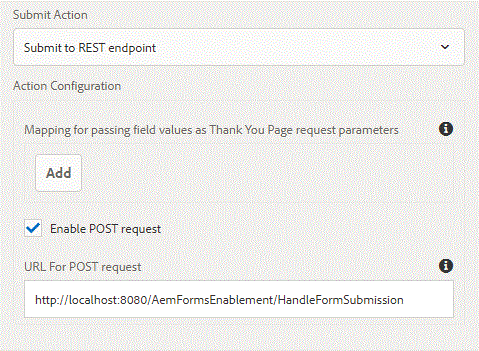

# 將Adaptive Form提交到外部伺服器{#submitting-adaptive-form-to-external-server}

使用「提交到REST端點」(Submit to REST Endpoint)操作，將提交的資料發佈到REST URL。 URL可以是內部（轉譯表單的伺服器）或外部伺服器。

通常，客戶會想要將表單資料提交至外部伺服器以進行進一步處理。

若要將資料張貼至內部伺服器，請提供資源路徑。 資料會張貼在資源的路徑上。 例如，&lt;/content/restEndPoint> 。 對於這種帖子請求，使用提交請求的驗證資訊。

若要將資料張貼至外部伺服器，請提供URL。 URL的格式為<http://host:port/path_to_rest_end_point>。 請確定您已設定路徑以匿名方式處理POST要求。

為了本文，我已編寫了一個簡單的war檔案，可部署在您的tomcat實例上。 假設您的tomcat在埠8080上運行，則POST URL將是

<http://localhost:8080/AemFormsEnablement/HandleFormSubmission>

當您將Adaptive Form配置為提交到此端點時，表單資料和附件（如果有的話）可通過以下代碼在servlet中提取

```java
System.out.println("form was submitted");
Part attachment = request.getPart("attachments");
if(attachment!=null)
{
    System.out.println("The content type of the attachment added is "+attachment.getContentType());
}
Enumeration<String> params = request.getParameterNames();
while(params.hasMoreElements())
{
String paramName = params.nextElement();
System.out.println("The param Name is "+paramName);
String data = request.getParameter(paramName);System.out.println("The data  is "+data);
}
```


格提交若要在伺服器上測試此項，請執行下列動作

1. 如果尚未安裝Tomcat。 [此處提供安裝tomcat的說明](https://helpx.adobe.com/experience-manager/kt/forms/using/preparing-datasource-for-form-data-model-tutorial-use.html)
1. 下載與本文相關的[zip檔案](assets/aemformsenablement.zip)。 解壓縮檔案以取得war檔案。
1. 在tomcat伺服器中部署war檔案。
1. 使用檔案附件元件建立簡單的最適化表單，並設定其提交動作，如上述螢幕擷取所示。 POST URL為<http://localhost:8080/AemFormsEnablement/HandleFormSubmission>。 如果您的AEM和tomcat未在localhost上執行，請依此變更URL。
1. 要啟用向tomcat提交多部件表單資料，請將以下屬性添加到&lt;tomcatInstallDir>\conf\context.xml的上下文元素中，然後重新啟動Tomcat伺服器。
1. **&lt;context allowCasualMultipartParsing=&quot;true&quot;>**
1. 預覽最適化表單、新增附件並送出。 檢查tomcat控制台窗口中的消息。

